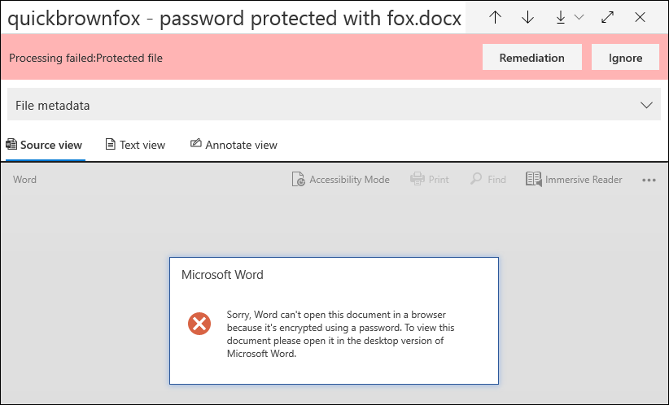

# 高級 eDiscovery 中的單一專案錯誤修正Single item error remediation in Advanced eDiscovery

錯誤修正功能可讓高級 eDiscovery 使用者修正導致「高級 eDiscovery」無法正確處理內容的資料問題。Error remediation gives Advanced eDiscovery users the ability to rectify data issues that prevent Advanced eDiscovery from properly processing the content. 例如，無法處理受密碼保護的檔案，因為這些檔案已鎖定或已加密。For example, files that are password protected can't be processed because those files are locked or encrypted. 先前，您只能使用 [此工作流程](error-remediation-when-processing-data-in-advanced-ediscovery.md)大量修正錯誤。Previously, you could only remediate errors in bulk by using [this workflow](error-remediation-when-processing-data-in-advanced-ediscovery.md). 不過，如果您不確定這些檔案中的任何檔案是否都回應您正在調查的案例，有時在多個檔案中修復錯誤就沒有意義。But sometimes, it doesn't make sense to remediate errors in multiple files when you’re unsure if any of those files are responsive to the case you’re investigating. 在您有機會檢查檔案中繼資料 (例如檔案位置或誰具有存取權) ，以協助您進行回應的前期決策之前，也可能無法修正錯誤。It also might not make sense to remediate errors before you’ve had a chance to review the file metadata (such as file location or who had access) to help you make up-front decisions about responsiveness. 稱為 *單一專案錯誤修正* 的新功能可讓 eDiscovery 管理員以處理錯誤來查看檔案中繼資料，並在必要時直接在複查集中修正錯誤。A new feature called *single item error remediation* gives eDiscovery managers the ability to view the metadata of files with a processing error and if necessary remediate the error directly in the review set. 本文討論如何使用審閱集中的處理錯誤來識別、忽略和修正檔案。The article discusses how to identify, ignore, and remediate files with processing errors in a review set.

## 識別錯誤的檔Identify documents with errors

在審閱集中處理錯誤的檔現在會以橫幅) 識別 (。Documents with processing errors in a review set are now identified (with a banner). 您可以修正或略過錯誤。You can remediate or ignore the error. 下列螢幕擷取畫面顯示 Word 檔的處理錯誤橫幅，其為密碼保護的審閱集。The following screenshot shows the processing error banner for a Word document in a review set that is password-protected. 此外，請注意，您可以透過處理錯誤來查看檔的中繼資料。Also notice that you can view the file metadata of documents with processing errors.

您也可以在 [審閱集中查詢檔](review-set-search.md)時使用 **處理狀態** 條件，搜尋處理錯誤的檔。You can also search for documents that have processing errors by using the **Processing status** condition when [querying the documents in a review set](review-set-search.md).

### 忽略錯誤Ignore errors

您可以按一下處理錯誤橫幅中的 [ **略** 過]，忽略處理錯誤。You can ignore a processing error by clicking **Ignore** in the processing error banner. 當您忽略錯誤時，該檔會從 [大量錯誤修正工作流程](error-remediation-when-processing-data-in-advanced-ediscovery.md)中移除。When you ignore an error, the document is removed from the [bulk error remediation workflow](error-remediation-when-processing-data-in-advanced-ediscovery.md). 在忽略錯誤之後，檔橫幅會變更色彩，並指出忽略處理錯誤。After an error is ignored, the document banner changes color and indicates that the processing error was ignored. 您可以隨時按一下 [ **還原**]，恢復決定忽略錯誤。At any time, you can revert the decision to ignore the error by clicking **Revert**.

![按一下 [忽略] 忽略處理錯誤。](../media/SIERimage3.png)

您也可以搜尋包含處理錯誤的所有檔，以在審閱集中查詢檔時使用「 *忽略處理錯誤* 」條件忽略。You can also search for all documents that had a processing error that was ignored by using the *Ignored processing errors* condition when querying documents in a review set.

## 修正含有錯誤的檔Remediate a document with errors

在某些情況下，您可能需要在檔 (中修復處理錯誤，方法是移除密碼、解密加密的檔案或復原損毀的檔) 然後將修正檔新增至審閱集。Sometimes you may be required to remediate a processing error in documents (by removing a password, decrypting an encrypted file, or recovering a corrupted document) and then add the remediated document to the review set. 這可讓您檢查及匯出錯誤檔，以及審閱集中的其他檔。This allows you to review and export the error document together with the other documents in the review set. 

若要修正單一檔，請遵循下列步驟：To remediate a single document, follow these steps:

1. 按一下 [**下載** 原始檔案]，將檔案的  >  複本下載到本機電腦。Click **Download** > **Download original** to download a copy of the file to a local computer.

   

2. 在離線修正檔中的錯誤。Remediate the error in the file offline. 若為加密檔案，則需要解密軟體，以移除密碼保護，請提供密碼並儲存檔案或使用密碼破解程式。For encrypted files, that would require decryption software, to remove password protection, either provide the password and save the file or use a password cracker. 修正檔後，請移至下一個步驟。After you remediate the file, go to the next step.

3. 在 [檢查] 集中，選取具有修正處理錯誤的檔案，然後按一下 [ **修復**]。In the review set, select the file with the processing error that you remediated, and then  click **Remediation**.

   ![在具有處理錯誤的檔旗標中按一下 [修正]](../media/SIERimage6.png)

4. 按一下 **[流覽]**，移至您本機電腦上已修正檔案的位置，然後選取檔案。Click **Browse**, go to the location of the remediated file on your local computer, and then select the file.

   ![按一下 [流覽]，然後選取本機電腦上的修正檔案。](../media/SIERimage7.png)

    選取修正的檔案之後，它會自動上傳至審閱集。After selecting the remediated file, it is automatically uploaded to the review set. 您可以追蹤檔的處理狀態。You can track the processing status of the file.

    

   處理完成後，您可以查看修正的檔。After processing is completed, you can view the remediated document.

    

如需修正檔時的詳細資訊，請參閱修正檔案時會 [發生什麼情況](error-remediation-when-processing-data-in-advanced-ediscovery.md#what-happens-when-files-are-remediated)。For more information about what happens when a document is remediated, see [What happens when files are remediated](error-remediation-when-processing-data-in-advanced-ediscovery.md#what-happens-when-files-are-remediated).

## 搜尋修正的檔Search for remediated documents

您可以使用 **關鍵字** 條件，並指定下列屬性，搜尋審閱集中已修正的所有檔：值配對： **IsFromErrorRemediation： true**。You can search for all documents in a review set that were remediated by using the **Keywords** condition and specifying the following property:value pair: **IsFromErrorRemediation:true**. 當您從審閱集匯出檔時，也會在匯出載入檔案中使用此屬性。This property is also available in the export load file when you export documents from a review set.
