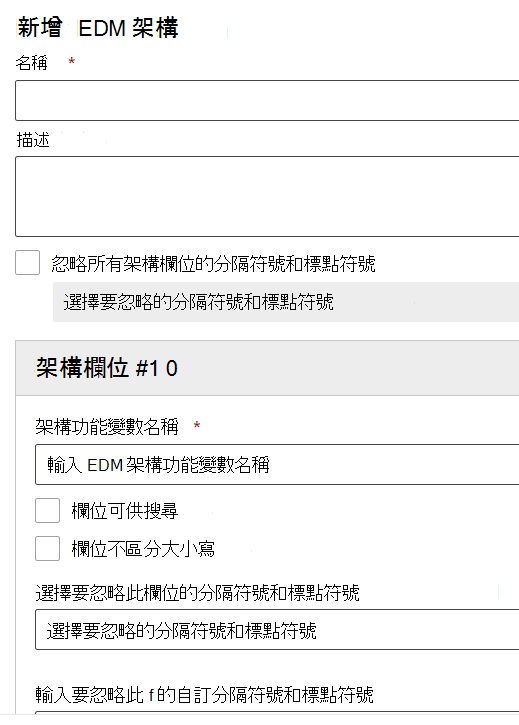

# 使用完全符合結構描述和敏感性資訊類型精靈

[使用以精確資料比對為基礎 (EDM) 的分類建立自訂敏感性資訊類型](create-custom-sensitive-information-types-with-exact-data-match-based-classification.md) 包含諸多步驟。  您可以使用此嚮導建立架構和機密資訊類型 (SIT) pattern (規則套件) 檔案，以協助簡化程式。

> [!NOTE]
> 「完全符合結構描述和敏感性資訊類型」精靈只適用于 World Wide 和 GCC 雲端。

您可以使用這個精靈取代：

- [定義用於敏感性資訊的資料庫結構描述](create-custom-sensitive-information-types-with-exact-data-match-based-classification.md#define-the-schema-for-your-database-of-sensitive-information)
- [設定模式 (規則套件)](create-custom-sensitive-information-types-with-exact-data-match-based-classification.md#set-up-a-rule-package)

[第 1 部分：設定以 EDM 為基礎的分類](create-custom-sensitive-information-types-with-exact-data-match-based-classification.md#part-1-set-up-edm-based-classification) 的步驟。

## 先決條件

1. 快速瞭解使用 EDM 建立自訂敏感性資訊類型的步驟 [工作流程概覽](create-custom-sensitive-information-types-with-exact-data-match-based-classification.md#the-work-flow-at-a-glance)。

2. 執行 [將敏感性資料儲存為 .csv 格式](create-custom-sensitive-information-types-with-exact-data-match-based-classification.md#save-sensitive-data-in-csv-format) 一節中的步驟。

## 使用完全符合結構描述和敏感性資訊類型模式精靈

1. 針對您的租使用者，在 Microsoft 365 合規性中心，移至 **資料分類** > **完全資料比對**。

2. 選擇 **[建立 EDM 結構描述]** 以開啟結構描述精靈設定飛出視窗。

3. 請填入適當的 **名稱** 和 **描述**。

4. 如果您想要該行為，請選擇 [ **所有架構欄位都忽略分隔符號和標點符號** ]。 若要深入瞭解設定 EDM 以忽略大小寫或分隔符號，請參閱 [使用精確的資料符合建立自訂機密資訊類型 (EDM) 型分類](create-custom-sensitive-information-types-with-exact-data-match-based-classification.md)。

5. 在 **結構描述欄位 #1** 填入您想要的值，並視需要新增更多欄位。 

> [!IMPORTANT]
> 您至少必須將其中一個最多五個結構描述欄位指定為可供搜尋。

6. 選擇 [儲存]。 您的結構描述會隨即列出。

7. 選擇 **[EDM 敏感性資訊類型]** 和 **[建立 EDM 敏感性資訊類型]**，以開啟 [敏感性資訊類型設定] 精靈。

8. 選擇 **[選擇現有的 EDM 結構描述]**，然後從清單中選擇您在步驟2-6 中所建立的結構描述。

9. 選擇 **[下一步]**，然後選擇 **[建立模式]**。

10. 選擇 **[信賴等級]** 和 **[主要元素]**。  若要深入瞭解如何設定模式，請參閱 [在合規性中心內建立自訂敏感性資訊類型](create-a-custom-sensitive-information-type.md)

11.  選擇 **[主要元素的敏感性資訊類型]** 以建立關聯。 若要深入瞭解可用的敏感性資訊類型，請參閱 [[敏感性資訊類型實體定義]](sensitive-information-type-entity-definitions.md)。

12. 選擇 **[完成]**。

13. 選擇您想要的 **[信賴等級和字元概量]**。  這會是整個 EDM 敏感性資訊類型的預設值

13. 如果您想要建立其他 EDM 敏感資訊類型的模式，請選擇 [ **建立模式** ]。

14. 選擇 **[下一步]** 並填入 **[名稱]** 和 **[系統管理員的描述]**。

15. 檢閱並選擇 **[提交]**。

您可以選取顯示 [編輯] 和 [刪除] 的控制項，以刪除或編輯敏感性資訊類型模式。

> [!IMPORTANT]
> 如果您想要移除某一結構描述，且它已與 EDM 敏感性資訊類型相關聯，您必須先刪除 EDM 敏感性資訊類型，然後您就可以刪除該結構描述。

## 建立後的步驟

在您使用這個精靈建立 EDM 結構描述和模式 (規則套件) 檔案之後，您仍需執行 [第2部分：雜湊並上傳敏感性資料]](create-custom-sensitive-information-types-with-exact-data-match-based-classification.md#part-2-hash-and-upload-the-sensitive-data) 中的步驟，您才能使用 EDM 自訂敏感性資訊類型。

在確認您的機密資訊資料表已正確上載後，您可以測試它是否正常運作。

1. 開啟 **規範中心**  >  **資料分類**  >  **機密資訊類型**。
2. 從清單中選取 EDM SIT，然後選取飛入窗格中的 [ **測試** ]。 
3. Upload 包含您要偵測之資料的專案，例如，建立包含機密資訊表格中的部分資料的專案。 如果您在架構中使用 [可設定的相符] 功能定義略過的分隔符號，請確定該專案包括和沒有這些分隔符號的範例。
4. 上載及掃描檔案後，請檢查是否符合 EDM SIT。
5. 如果 SIT 中的 **Test** 函數偵測到相符的，請檢查它未進行裁切或解壓縮錯誤。 例如，只要只解壓縮其應該偵測的完整字串子字串，或是只拾取多字字串中的第一個字，或是在解壓縮中包含額外的符號或字元。 請參閱 [正則運算式語言-](/dotnet/standard/base-types/regular-expression-language-quick-reference) 正則運算式語言參考的快速參考。 

### 疑難排解

如果您找不到任何相符專案，請嘗試下列步驟：
- 使用 [EDM 工具上傳機密資料的指導](create-custom-sensitive-information-types-with-exact-data-match-based-classification.md)方針中所述的命令，確認您的機密資料已正確上傳。
- 請檢查您在專案中輸入的範例是否存在於您的機密資訊資料表中，而且忽略的分隔符號是否正確。
- **測試** 您在每個模式中設定主要元素時所使用的 SIT。 這會確認 SIT 可以符合專案中的範例。 
  -  如果您在 EDM 類型中為主要元素選取的 SIT 沒有在專案中找到相符專案，或找到比預期更少的相符專案，請檢查它是否支援存在於內容中的分隔符號及分隔符號。 請務必包含您架構中定義的被忽略分隔符號。 
  -  如果 **Test** 函數根本沒有偵測任何內容，請檢查您選取的 SIT 是否包含其他關鍵字或其他驗證的需求。 針對內建的，請參閱 [敏感資訊類型實體定義](sensitive-information-type-entity-definitions.md) ，以確認符合每個類型的最低需求。
