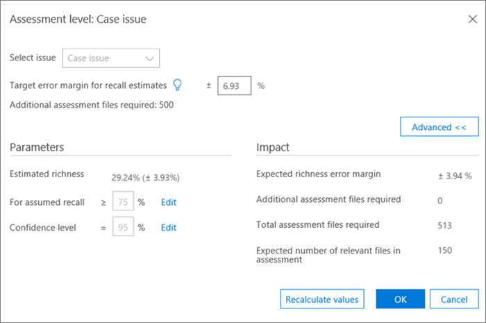

# 在 [高級 eDiscovery] 中的 [相關性] 模組中進行標記與評估Tagging and Assessment in the Relevance module in Advanced eDiscovery
  
本節說明在「高級 eDiscovery」的 [相關性] 模組中進行評估的程式。This section describes the procedure for Assessment in the Relevance module in Advanced eDiscovery.
  
## 執行評估訓練和分析Performing Assessment training and analysis

1. 在 [ **相關性 \> 追蹤** ] 索引標籤中，按一下 [ **評估** ] 以啟動案例評估。In the **Relevance \> Track** tab, click **Assessment** to start case assessment.

    例如，在此程式中，會建立一個500檔的範例評估集，並顯示 [標籤] 索引標籤，其中包含 **[標記]** 面板、顯示的檔案內容及其他標記選項。For example purposes in this procedure, a sample assessment set of 500 files is created and the **Tag** tab is displayed, which contains the Tagging panel, displayed file content and other tagging options. 

    
  
2. 請複查範例中的每個檔案，判斷檔案對於每個案例問題的相關性，並使用相關性 (R) （不相關 (NR) 和 [ **標記] 面板** 窗格中的 [略過] 按鈕）標記檔案。Review each file in the sample, determine the file's relevance for each case issue, and tag the file using the Relevance (R), Not relevant (NR) and Skip buttons in the **Tagging panel** pane. 

    > [!NOTE]
    >  評估需要500標記的檔案。Assessment requires 500 tagged files. 如果檔案是「略過」，您會收到更多檔案以進行標記。If files are "skipped", you will receive more files to tag. 
  
3. 在範例中標記所有檔案之後，按一下 [ **計算**]。After tagging all files in the sample, click **Calculate**.

    在 [ **相關性追蹤** ] 索引標籤中計算及顯示「評估目前錯誤邊界」和「大量豐富資訊」，如下所示。The Assessment current error margin and richness are calculated and displayed in the **Relevance Track** tab, with expanded details per issue, as shown below. 「 [回顧評估結果](#reviewing-assessment-results) 」一節將說明此對話方塊的詳細資訊。More details about this dialog are described in the [Reviewing assessment results](#reviewing-assessment-results) section.

    
  
    > [!TIP]
    > 根據預設，當問題的評估進度指示器已完成時，建議您繼續進行預設的下一個步驟，表示已評審評估範例，並已標記足夠相關的檔案。By default, we recommend that you proceed to the default Next step when the Assessment progress indicator for the issue has completed, indicating that the assessment sample was reviewed and sufficient relevant files were tagged. > 否則，如果您想要查看 [ **追蹤** ] 索引標籤的結果，並控制錯誤和下一個步驟的邊界，請按一下 [ **修改** 相鄰至 **下一個步驟]**，選取 [ **繼續評估**]，然後按一下 **[確定]**。> Otherwise, if you want to view the **Track** tab results and control the margin of error and the next step, click **Modify** adjacent to **Next Step**, select **Continue assessment**, and then click **OK**.
  
4. 按一下 [**評估**] 核取方塊右邊的 [**修改**]，以查看並指定每個問題的評估參數。Click **Modify** to the right of the **Assessment** check box to view and specify assessment parameters per issue. 隨即會顯示每個問題的 **評估層級** 對話方塊，如下列範例所示：An **Assessment level** dialog for each issue is displayed, as shown in the following example: 

    
  
    在 [ **評估層級** ] 對話方塊中計算及顯示問題的下列參數：The following parameters for the issue are calculated and displayed in the **Assessment level** dialog: 

    **召回評估的目標錯誤邊界**：根據此值，計算出所需審閱之其他檔案的預估數目。**Target error margin for recall estimates**: Based on this value, the estimated number of additional files necessary to review is calculated. 用於召回的邊界大於75%，且具有95% 信賴等級。The margin used for recall is greater than 75% and with a 95% confidence level.

    **需要其他評估** 檔案：指出若目前錯誤邊界的需求尚未滿足，則需要多少檔案。**Additional assessment files required**: Indicates how many more files are necessary if the current error margin's requirements have not been met. 

5. 若要調整目前的錯誤邊界，並查看不同錯誤邊界 (每個問題的效果) ：To adjust the current error margin and see the effect of different error margins (per issue):

6. 在 [ **選取問題** ] 清單中，選取問題。In the **Select issue** list, select an issue. 

7. 在 [ **召回評估的目標誤差邊界**] 中，輸入新的值。In **Target error margin for recall estimates**, enter a new value.

8. 按一下 [ **更新值** ] 以查看調整的影響。Click **Update values** to see the impact of the adjustments. 

9. 按一下 [**評估層級**] 對話方塊中的 [**高級**]，以查看下列其他參數和詳細資料：Click **Advanced** in the **Assessment level** dialog to see the following additional parameters and details: 

    
  
    - **預估豐富** 程度：根據目前評估結果估計豐富程度**Estimated richness**: Estimated richness according to the current assessment results

    - **對於假設的召回**：依預設，目標錯誤邊界會套用到高於75% 的召回。**For assumed recall**: By default, the target error margin applies to recall above 75%. 如果您想要變更此參數，並在不同的召回值範圍中控制錯誤的邊界，請按一下 [ **編輯** ]。Click **Edit** if you want to change this parameter and control the margin of error on a different range of recall values. 

    - **信賴等級**：根據預設，建議的錯誤邊界為95%。**Confidence level**: By default, the recommended error margin for confidence is 95%. 若要變更此參數，請按一下 [ **編輯** ]。Click **Edit** if you want to change this parameter.

    - **預期的大量豐富的錯誤邊際**：獲得更新的值時，這是大量豐富的錯誤的預期邊界，之後會檢查所有其他的評估檔案。**Expected richness error margin**: Given the updated values, this is the expected margin of error of the richness, after all additional assessment files are reviewed.

    - **需要其他評估** 檔案：針對已更新的值，需要複習以到達目標的其他評估檔案數目。**Additional assessment files required**: Given the updated values, the number of additional assessment files that need to be reviewed to reach the target.

    - **所需的評估檔案總數**：已獲得更新的值、審查所需的評估檔總數。**Total assessment files required**: Given the updated values, total assessment files required for review.

    - **評估中預期相關檔案的數目**：已更新的值，會檢查所有其他評估檔之後整個評估中的預期相關檔案數目。**Expected number of relevant files in assessment**: Given the updated values, the expected number of relevant files in the entire assessment after all additional assessment files are reviewed.

10. 如果變更參數，請按一下 [ **重新計算值**]。Click **Recalculate values**, if parameters are changed. 當您完成時，如果有一個問題，請按一下 **[確定]** ，將變更儲存 (或 **下一步** ，以查看或修改多個問題，然後 **完成**) 。When you're done, if there is one issue, click **OK** to save the changes (or **Next** when there are multiple issues to review or modify and then **Finish**). 

    在有多個問題時，當所有問題都經過評審或調整之後，就會顯示「 **評估層級：摘要** 」對話方塊，如下列範例所示。When there are multiple issues, after all issues have been reviewed or adjusted, an **Assessment level: summary** dialog is displayed, as shown in the following example. 

    
  
    順利完成評估時，請繼續進行相關性訓練中的下一個階段。On successful completion of assessment, proceed to the next stage in Relevance training.

## 查看評估結果Reviewing assessment results

在標記評估範例後，評估結果會計算並顯示在 [相關性追蹤] 索引標籤中。After an Assessment sample is tagged, the assessment results are calculated and displayed in the Relevance Track tab.
  
下列結果會顯示在已展開的軌道顯示中：The following results are displayed in the expanded Track display:
  
- 評估召回評估的目前錯誤邊界Assessment current error margin for recall estimates

- 預估豐富豐富Estimated richness

- 需要 (以進行審閱) 其他評估檔案Additional assessment files required (for review)

評估目前錯誤邊界是「高級 eDiscovery」所建議的錯誤邊際。The Assessment current error margin is the error margin recommended by Advanced eDiscovery. 「需要其他評估檔案」所顯示的數位會對應至該建議。The number displayed for the "Additional assessment files required" corresponds to that recommendation.
  
評估進度指標會顯示評估的完成程度（指定目前的錯誤邊界）。The Assessment progress indicator shows the level of completion of the assessment, given the current error margin. 當評估進行中時，使用者將會標記另一個評估範例。When assessment is underway, the user will tag another assessment sample.
  
當評估進度指示器顯示評估為完成時，表示評估範例審閱已完成，而且有足夠的相關檔案已標記。When the assessment progress indicator shows assessment as complete, that means the assessment sample review was completed and sufficient relevant files were tagged. 
  
展開的曲目顯示會顯示建議的下一個步驟、評估統計資料，以及對詳細結果的存取。The expanded Track display shows the recommended next step, the assessment statistics, and access to detailed results.
  
當豐富程度非常低時，需要的額外評估檔案數目若要產生有用的統計資料，就會非常高。When richness is very low, the number of additional assessment files needed to reach a minimal number of relevant files to produce useful statistics is very high. 「高級 eDiscovery」會建議您移至訓練。Advanced eDiscovery will then recommend moving on to training. 評估進度指示器會變成陰影，不會提供任何統計資料。The assessment progress indicator will be shaded, and no statistics will be available.
  
在缺少以統計為基礎的穩定化時，將會有較低的精確度和信賴等級的結果。In the absence of statistically based stabilization, there will be results with a lower level of accuracy and confidence level. 不過，當您不需要知道所找到之相關檔案的百分比時，可以使用這些結果來尋找相關檔案。However, these results can be used to find relevant files when you do not need to know the percentage of relevant files found. 同樣地，這種狀態也可以用來訓練低豐富的問題，在此情況下，相關性分數可以加速與特定問題相關的檔案存取。Similarly, this status can be used to train issues with low richness, where Relevance scores can accelerate access to files relevant to a specific issue.
  
> [!TIP]
> 在 [ **相關性 \> 追蹤** ] 索引標籤中，展開 [問題顯示]，可使用下列查看選項：In the **Relevance \> Track** tab, expanded issue display, the following viewing options are available: 
> 
> 建議的下一個步驟，例如 **[下一步：** 標籤可以略過 (每個問題) ，只要按一下該按鈕右邊的 [ **修改** ] 按鈕，然後選取 **下一個步驟** 中的其他步驟。The recommended next step, such as **Next step: Tagging** can be bypassed (per issue) by clicking the **Modify** button to its right, and then selecting an different step in the **Next step**. 當評估進度指示器尚未完成時，評估會是下一個建議的選項，以標記更多評估檔案，並增加統計資料的準確性。When the assessment progress indicator has not completed, assessment will be the next recommended option, to tag more assessment files and increase statistics accuracy. 
> 
> 您可以變更錯誤邊界並評估其影響，方法是按一下 [ **修改**]，然後在 [ **評估層級] 對話方塊** 中，變更 [重新 **叫評估的目標誤差邊界**]，然後按一下 [ **更新值**]。You can change the error margin and assess its impact, by clicking **Modify**, and in the **Assessment level dialog**, changing the **Target error margin for recall estimates**, and clicking **Update values**. 此外，在此對話方塊中，您可以按一下 [ **高級**] 以查看高級選項。Also, in this dialog, you can view advanced options, by clicking **Advanced**. 
> 
> 您可以按一下 [ **view**] （查看）以查看其他評估層級統計資料及其影響。You can view additional assessment level statistics and their impact by clicking **View**. 在 [顯示的詳細結果] 對話方塊中，每個問題都有至少500標記的評估檔案，且至少有18個檔案標示為相關問題的統計資料。In the displayed Detail results dialog, statistics are available per issue, when there are at least 500 tagged assessment files and at least 18 files are tagged as Relevant for the issue. 
