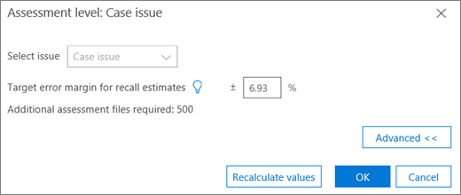
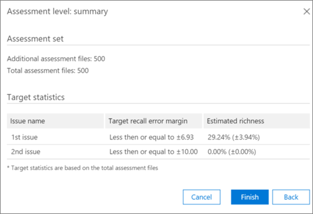

# 在 [高級 eDiscovery] 中的 [相關性] 模組中進行標記與評估
  
本節說明在「高級 eDiscovery」的 [相關性] 模組中進行評估的程式。
  
## 執行評估訓練和分析

1. 在 [ **相關性 \> 追蹤** ] 索引標籤中，按一下 [ **評估** ] 以啟動案例評估。

    例如，在此程式中，會建立一個500檔的範例評估集，並顯示 [標籤] 索引標籤，其中包含 **[標記]** 面板、顯示的檔案內容及其他標記選項。 

    
  
2. 請複查範例中的每個檔案，判斷檔案對於每個案例問題的相關性，並使用相關性 (R) （不相關 (NR) 和 [ **標記] 面板** 窗格中的 [略過] 按鈕）標記檔案。 

    > [!NOTE]
    >  評估需要500標記的檔案。 如果檔案是「略過」，您會收到更多檔案以進行標記。 
  
3. 在範例中標記所有檔案之後，按一下 [ **計算**]。

    在 [ **相關性追蹤** ] 索引標籤中計算及顯示「評估目前錯誤邊界」和「大量豐富資訊」，如下所示。 「 [回顧評估結果](#reviewing-assessment-results) 」一節將說明此對話方塊的詳細資訊。

    
  
    > [!TIP]
    > 根據預設，當問題的評估進度指示器已完成時，建議您繼續進行預設的下一個步驟，表示已評審評估範例，並已標記足夠相關的檔案。 > 否則，如果您想要查看 [ **追蹤** ] 索引標籤的結果，並控制錯誤和下一個步驟的邊界，請按一下 [ **修改** 相鄰至 **下一個步驟]**，選取 [ **繼續評估**]，然後按一下 **[確定]**。
  
4. 按一下 [**評估**] 核取方塊右邊的 [**修改**]，以查看並指定每個問題的評估參數。 隨即會顯示每個問題的 **評估層級** 對話方塊，如下列範例所示： 

    
  
    在 [ **評估層級** ] 對話方塊中計算及顯示問題的下列參數： 

    **召回評估的目標錯誤邊界**：根據此值，計算出所需審閱之其他檔案的預估數目。 用於召回的邊界大於75%，且具有95% 信賴等級。

    **需要其他評估** 檔案：指出若目前錯誤邊界的需求尚未滿足，則需要多少檔案。 

5. 若要調整目前的錯誤邊界，並查看不同錯誤邊界 (每個問題的效果) ：

6. 在 [ **選取問題** ] 清單中，選取問題。 

7. 在 [ **召回評估的目標誤差邊界**] 中，輸入新的值。

8. 按一下 [ **更新值** ] 以查看調整的影響。 

9. 按一下 [**評估層級**] 對話方塊中的 [**高級**]，以查看下列其他參數和詳細資料： 

    
  
    - **預估豐富** 程度：根據目前評估結果估計豐富程度

    - **對於假設的召回**：依預設，目標錯誤邊界會套用到高於75% 的召回。 如果您想要變更此參數，並在不同的召回值範圍中控制錯誤的邊界，請按一下 [ **編輯** ]。 

    - **信賴等級**：根據預設，建議的錯誤邊界為95%。 若要變更此參數，請按一下 [ **編輯** ]。

    - **預期的大量豐富的錯誤邊際**：獲得更新的值時，這是大量豐富的錯誤的預期邊界，之後會檢查所有其他的評估檔案。

    - **需要其他評估** 檔案：針對已更新的值，需要複習以到達目標的其他評估檔案數目。

    - **所需的評估檔案總數**：已獲得更新的值、審查所需的評估檔總數。

    - **評估中預期相關檔案的數目**：已更新的值，會檢查所有其他評估檔之後整個評估中的預期相關檔案數目。

10. 如果變更參數，請按一下 [ **重新計算值**]。 當您完成時，如果有一個問題，請按一下 **[確定]** ，將變更儲存 (或 **下一步** ，以查看或修改多個問題，然後 **完成**) 。 

    在有多個問題時，當所有問題都經過評審或調整之後，就會顯示「 **評估層級：摘要** 」對話方塊，如下列範例所示。 

    
  
    順利完成評估時，請繼續進行相關性訓練中的下一個階段。

## 查看評估結果

在標記評估範例後，評估結果會計算並顯示在 [相關性追蹤] 索引標籤中。
  
下列結果會顯示在已展開的軌道顯示中：
  
- 評估召回評估的目前錯誤邊界

- 預估豐富豐富

- 需要 (以進行審閱) 其他評估檔案

評估目前錯誤邊界是「高級 eDiscovery」所建議的錯誤邊際。 「需要其他評估檔案」所顯示的數位會對應至該建議。
  
評估進度指標會顯示評估的完成程度（指定目前的錯誤邊界）。 當評估進行中時，使用者將會標記另一個評估範例。
  
當評估進度指示器顯示評估為完成時，表示評估範例審閱已完成，而且有足夠的相關檔案已標記。 
  
展開的曲目顯示會顯示建議的下一個步驟、評估統計資料，以及對詳細結果的存取。
  
當豐富程度非常低時，需要的額外評估檔案數目若要產生有用的統計資料，就會非常高。 「高級 eDiscovery」會建議您移至訓練。 評估進度指示器會變成陰影，不會提供任何統計資料。
  
在缺少以統計為基礎的穩定化時，將會有較低的精確度和信賴等級的結果。 不過，當您不需要知道所找到之相關檔案的百分比時，可以使用這些結果來尋找相關檔案。 同樣地，這種狀態也可以用來訓練低豐富的問題，在此情況下，相關性分數可以加速與特定問題相關的檔案存取。
  
> [!TIP]
> 在 [ **相關性 \> 追蹤** ] 索引標籤中，展開 [問題顯示]，可使用下列查看選項： 
> 
> 建議的下一個步驟，例如 **[下一步：** 標籤可以略過 (每個問題) ，只要按一下該按鈕右邊的 [ **修改** ] 按鈕，然後選取 **下一個步驟** 中的其他步驟。 當評估進度指示器尚未完成時，評估會是下一個建議的選項，以標記更多評估檔案，並增加統計資料的準確性。 
> 
> 您可以變更錯誤邊界並評估其影響，方法是按一下 [ **修改**]，然後在 [ **評估層級] 對話方塊** 中，變更 [重新 **叫評估的目標誤差邊界**]，然後按一下 [ **更新值**]。 此外，在此對話方塊中，您可以按一下 [ **高級**] 以查看高級選項。 
> 
> 您可以按一下 [ **view**] （查看）以查看其他評估層級統計資料及其影響。 在 [顯示的詳細結果] 對話方塊中，每個問題都有至少500標記的評估檔案，且至少有18個檔案標示為相關問題的統計資料。 
