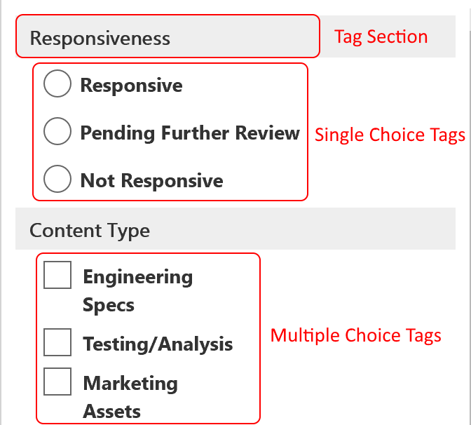

# 標記檢閱集中的文件Tag documents in a review set

在「檢查」集中組織內容對於在 eDiscovery 程式中完成各種工作流程很重要。Organizing content in a review set is important to complete various workflows in the eDiscovery process. 這包括：This includes:

- 挑選不必要的內容Culling unnecessary content

- 識別相關的內容Identifying relevant content
 
- 識別必須由專家或律師審閱的內容Identifying content that must be reviewed by an expert or an attorney

當專家、律師或其他使用者查看審閱集中的內容時，可以使用標記來捕獲其與內容相關的觀點。When experts, attorneys, or other users review content in a review set, their opinions related to the content can be captured by using tags. 例如，若要挑選不必要的內容，使用者可以使用標記（如「沒有回應」）來標記檔。For example, if the intent is to cull unnecessary content, a user can tag documents with a tag such as "non-responsive". 在審閱及標記內容之後，您可以建立審閱集搜尋，以排除標記為「無回應」的任何內容，這會在 eDiscovery 工作流程的後續步驟中消除此內容。After content has been reviewed and tagged, a review set search can be created to exclude any content tagged as "non-responsive", which eliminates this content from the next steps in the eDiscovery workflow. 您可以針對每個案例自訂標記面板，使標記能夠支援預定的審閱工作流程。The tag panel can be customized for every case so that the tags can support the intended review workflow.

## 標記類型Tag types

「高級 eDiscovery」提供兩種類型的標記：Advanced eDiscovery provides two types of tags:

- **單一選擇標記**-限制使用者選取群組內的單一標記。**Single choice tags** - Restricts users to select a single tag within a group. 這可確保使用者不會選取「已回應」和「無回應」等衝突標記。This can be useful to ensure users don't select conflicting tags such as "responsive" and "non-responsive". 這些會顯示為選項按鈕。These will appear as radio buttons.

- **多重選取標記**-允許使用者選取群組中的多個標記。**Multiple choice tags** - Allow users to select multiple tags within a group. 這些會顯示為核取方塊。These will appear as checkboxes.

## 標記結構Tag structure

除了標記類型之外，標記在標記面板中的組織方式也可以用來讓標記檔更直觀。In addition to the tag types, the structure of how tags are organized in the tag panel can be used to make tagging documents more intuitive. 標記是依區段群組。Tags are grouped by sections. 「複查設定搜尋」支援依標籤及依標籤進行搜尋的功能] 區段。Review set search supports the ability to search by tag and by tag section. 這表示您可以建立「複查集搜尋」，以檢索標記為區段中任何標記的檔。This means you can create a review set search to retrieve documents tagged with any tag in a section.

您可以透過將標記嵌入區段中進一步組織標籤。Tags can be further organized by nesting them within a section. 例如，如果要識別及標記特權內容，可以使用嵌套來明確指出使用者可以將檔標記為「特權」，並檢查適當的嵌套標記，以選取特權類型。For example, if the intent is to identify and tag privileged content, nesting can be used to make it clear that a user can tag a document as "Privileged" and select the type of privilege by checking the appropriate nested tag.

## 套用標記Applying tags

有幾種方式可以將標記套用至內容。There are several ways to apply a tag to content.

### 標記單一檔Tagging a single document

在審閱集中查看檔時，您可以按一下 [**標記] 面板**來顯示可供審閱使用的標記。When viewing a document in a review set, you can display the tags that a review can use by clicking **Tagging panel**.

![按一下 [標記面板] 以顯示標記面板](../media/Singledoctag.png)

這可讓您將標記套用至顯示在檢視器中的檔。This will enable you to apply tags to the document displayed in the viewer.

### 大量標記Bulk tagging

您可以在結果格線中選取多個檔案，然後使用 [標記]**面板**中的標記，類似于 [標記單一檔]，以完成大量標記。Bulk tagging can be done by selecting multiple files in the results grid and then using the tags in the **Tagging panel** similar to tagging single documents. 您可以透過選取標記兩次來執行大量取消標籤，第一次按一下會套用標籤，第二個選取範圍會確定已清除所有選取檔案的標記。Bulk un-tagging can be done by selecting tags twice; the first click will apply the tag, and the second selection will ensure that tag is cleared for all selected files.

> [!NOTE]
> 大量標記時，[標記] 面板將會顯示為面板中每一個標記標記的檔案計數。When bulk tagging, the tagging panel will display a count of files that are tagged for each tag in the panel.

### 在其他審閱面板中標記Tagging in other review panels

當您審閱檔時，您可以使用其他的「審閱」面板來查看結果格線中檔的其他特性。When reviewing documents, you can use the other review panels to review other characteristics of documents in the results grid. 這包括複查其他相關的檔、電子郵件執行緒、接近重複專案及雜湊重複專案。This includes reviewing other related documents, email threads, near duplicates, and hash duplicates. 例如，當您檢查相關的檔時（使用 [**檔系列**檢查] 面板），您可以透過大量標記相關檔大幅減少審閱時間。For example, when you're reviewing related documents (by using the **Document family** review panel), you can significantly reduce review time by bulk tagging related documents. 例如，如果電子郵件訊息有數個附件，而您想確定整個系列都以一致的方式標記。For example, if an email message has several attachments and you want to ensure that the entire family is tagged consistently.

例如，以下是使用 [**檔系列**檢查] 面板時，顯示 [**標記] 面板**的方式：For example, here's how to display the **Tagging panel** when using the **Document family** review panel:

1. 在 [審閱] 面板開啟選取檔時（例如，在 [**檔系列**檢查] 面板中顯示相關內容的清單），按一下 [檔系列檢查面板] 底下的 [**標記檔**]。With the review panel open for a selected document (for example, displaying the list of related content in the **Document family** review panel, click **Tag documents** under the document family review panel.

   [標記] 面板會顯示為快顯視窗。The tagging panel is displayed as a pop-up window.

2. 選擇一個或多個要套用選取檔的標記。Choose one or more tags to apply the selected document. 

3. 若要標記所有檔，請選取 [檔] [**系列**] 面板中的 [所有檔]，然後按一下 [**標記檔**]，然後選擇要套用至整個檔系列的標記。To tag all documents, select all documents in the **Document family** panel, click **Tag documents**, and then choose the tags to apply to the entire family of documents.

