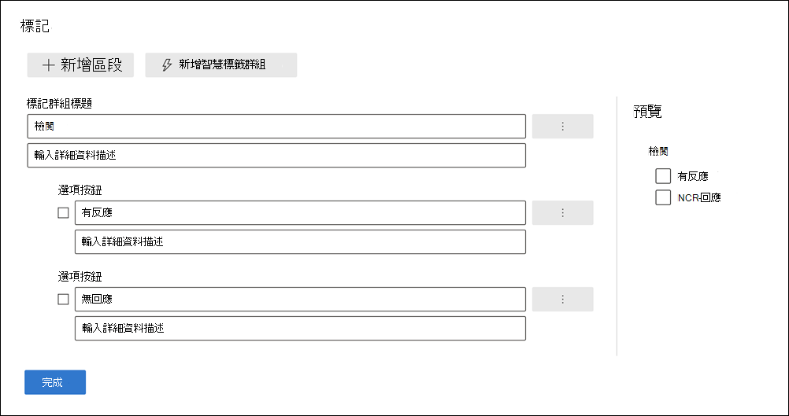
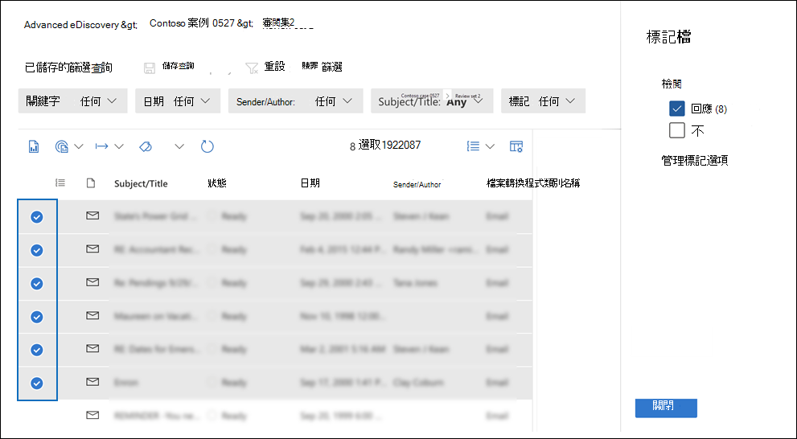
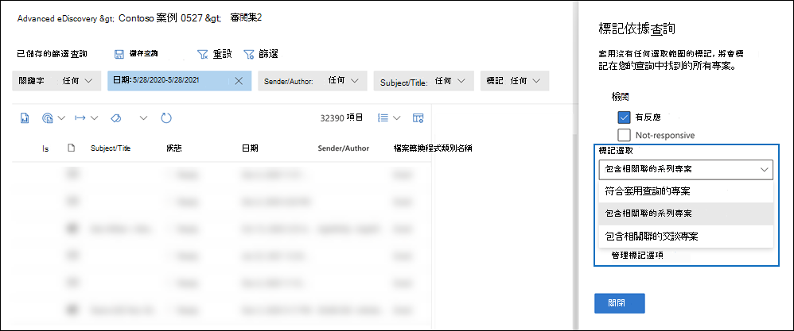

# 在 Advanced eDiscovery 中的審閱集中標記檔

在「檢查」集中組織內容對於在 eDiscovery 程式中完成各種工作流程很重要。 這包括：

- 挑選不必要的內容

- 識別相關的內容

- 識別專家或律師必須查看的內容

當專家、律師或其他使用者查看審閱集中的內容時，可以使用標記來捕獲其與內容相關的觀點。 例如，若要挑選不必要的內容，使用者可以使用標記（如「沒有回應」）來標記檔。 在審閱及標記內容之後，您可以建立審閱集搜尋，以排除標記為「無回應」的任何內容。 此程式會從 eDiscovery 工作流程的後續步驟中消除未回應的內容。 您可以針對每個案例自訂審閱集中的 [標籤] 面板，使標記支援案例的預定的審閱工作流程。

> [!NOTE]
> 標記的範圍是 Advanced eDiscovery 案例。 這表示案例只能有一組標記可供檢閱者用來標記審閱集檔。 您無法設定一組不同的標記，以在相同的情況下用於不同的審閱集。

## 標記類型

Advanced eDiscovery 提供兩種標記類型：

- **單一選項標記**：限制檢閱者選取群組內的單一標記。 這些類型的標記是很有用的，可確保檢閱者沒有選取「已回應」及「無回應」等衝突標記。 單一選項標記顯示為選項按鈕。

- **多重選取標記**：允許評論選取群組中的多個標記。 這些類型的標記會顯示為核取方塊。

## 標記結構

除了標記類型之外，標記在標記面板中的組織方式也可以用來讓標記檔更直觀。 標記是依區段群組。 「複查設定搜尋」支援依標籤及依標籤進行搜尋的功能] 區段。 這表示您可以建立「複查集搜尋」，以檢索標記為區段中任何標記的檔。

您可以在區段中嵌套標記以進一步組織標籤。 例如，如果要識別及標記特權內容，可以使用嵌套來明確檢閱者可以將檔標記為「特權」，並檢查適當的嵌套標記，以選取特權類型。

## 建立標記

將標籤套用至審閱集內的檔之前，您必須建立標記結構。

1. 開啟審閱集，並流覽至命令列，然後選取 [ **依查詢選取標記**]。

2. 在 [標記] 面板中，選取 [**管理標記選項**]。

3. 選取 [ **新增標記] 區段**。

4. 輸入標記群組標題和選用的描述，然後按一下 [**儲存**]。

5. 選取標記群組標題旁的三個點下拉式功能表，然後按一下 [ **新增] 核取方塊** 或 [ **新增選項] 按鈕**。

6. 輸入核取方塊或選項按鈕的名稱和描述。

7. 重複此程式以建立新的標記區段、標記選項及核取方塊。

   

## 套用標記

使用標記結構時，檢閱者可以在審閱集中對檔套用標記。 有兩種不同的套用標記方式：

- 標記檔

- 標記依據查詢

### 標記檔

不論您是選取審閱集中的單一專案或多個專案，您可以按一下命令列中的 [標籤檔]， **將標記套用** 至選取範圍。 在 [標記] 面板中，您可以選取標記，它會自動套用至選取的檔。

> [!NOTE]
> 標記只會套用至專案清單中的選取專案。

### 標記依據查詢

[依查詢進行標記] 可讓您將標記套用至目前套用於審閱集之篩選查詢所顯示的所有專案。

1. 取消選取審閱集中的所有專案，然後移至命令列，然後選取 [ **依查詢選取標記**]。

2. 在 [標記] 面板中，選取您要套用的標記。

3. 在 [ **標記選取範圍** ] 下拉式清單中，有三個選項可以規定要套用標記的專案。

   - **符合套用查詢的專案**：會將標記套用至符合篩選器查詢準則的特定專案。

   - **包含相關聯的系列專案**：將標記套用至符合篩選器查詢準則的特定專案，以及其相關聯的族專案。 *系列專案* 是指共用相同 FamilyId 中繼資料值的專案。  

   - **包含相關聯的交談專案**：將標記套用至符合篩選器查詢準則的專案，以及其相關聯的交談專案。 *交談專案* 是指共用相同 ConversationId 中繼資料值的專案。

   

4. 按一下 [ **開始標記] 工作** 以觸發標記工作。

## 標記篩選

使用 [檢查] 中的標籤篩選，可根據專案的標記方式，快速尋找或排除查詢結果中的專案。 

1. 選取 [ **篩選** ] 以展開 [篩選] 面板。

2. 選取並展開 [ **專案屬性**]。

3. 向下流覽以找出 [篩選名稱] **標記**，選取核取方塊，然後按一下 [ **完成**]。

4. 若要在查詢中包含或排除具有特定標記的專案，請執行下列其中一項操作：

   - **包含專案**：選取標記值，然後在下拉式功能表中選取 [ **等於** ]。

      或者

   - **排除專案**：選取標記值，然後在下拉式功能表中選取 [ **等於無** ]。

     

> [!NOTE]
> 請務必重新整理頁面，以確保標記篩選顯示標籤結構的最新變更。
