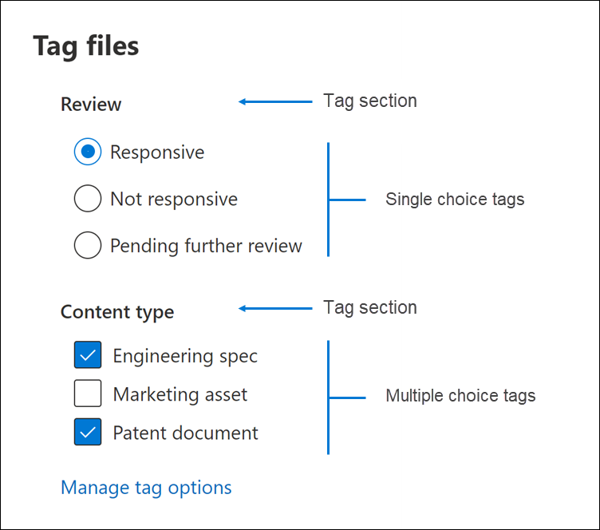

# 在高級 eDiscovery 的審閱集中標記檔

在「檢查」集中組織內容對於在 eDiscovery 程式中完成各種工作流程很重要。 這包括：

- 挑選不必要的內容

- 識別相關的內容
 
- 識別必須由專家或律師審閱的內容

當專家、律師或其他使用者查看審閱集中的內容時，可以使用標記來捕獲其與內容相關的觀點。 例如，若要挑選不必要的內容，使用者可以使用標記（如「沒有回應」）來標記檔。 在審閱及標記內容之後，您可以建立審閱集搜尋，以排除標記為「無回應」的任何內容，這會在 eDiscovery 工作流程的後續步驟中消除此內容。 您可以針對每個案例自訂標記面板，使標記能夠支援預定的審閱工作流程。

## 標記類型

「高級 eDiscovery」提供兩種類型的標記：

- **單一選擇標記** -限制使用者選取群組內的單一標記。 這可確保使用者不會選取「已回應」和「無回應」等衝突標記。 這些會顯示為選項按鈕。

- **多重選取標記** -允許使用者選取群組中的多個標記。 這些會顯示為核取方塊。

## 標記結構

除了標記類型之外，標記在標記面板中的組織方式也可以用來讓標記檔更直觀。 標記是依區段群組。 「複查設定搜尋」支援依標籤及依標籤進行搜尋的功能] 區段。 這表示您可以建立「複查集搜尋」，以檢索標記為區段中任何標記的檔。

您可以透過將標記嵌入區段中進一步組織標籤。 例如，如果要識別及標記特權內容，可以使用嵌套來明確指出使用者可以將檔標記為「特權」，並檢查適當的嵌套標記，以選取特權類型。

## 套用標記

有幾種方式可以將標記套用至內容。

### 標記單一檔

在審閱集中查看檔時，您可以按一下 [ **標記] 面板**來顯示可供審閱使用的標記。

![按一下 [標記面板] 以顯示標記面板](../media/Singledoctag.png)

這可讓您將標記套用至顯示在檢視器中的檔。

### 大量標記

您可以在結果格線中選取多個檔案，然後使用 [標記] **面板** 中的標記，類似于 [標記單一檔]，以完成大量標記。 您可以透過選取標記兩次來執行大量取消標籤，第一次按一下會套用標籤，第二個選取範圍會確定已清除所有選取檔案的標記。

> [!NOTE]
> 大量標記時，[標記] 面板將會顯示為面板中每一個標記標記的檔案計數。

### 在其他審閱面板中標記

當您審閱檔時，您可以使用其他的「審閱」面板來查看結果格線中檔的其他特性。 這包括複查其他相關的檔、電子郵件執行緒、接近重複專案及雜湊重複專案。 例如，當您使用 [ **檔系列** 檢查] 面板) 檢查相關的檔 (時，您可以透過大量標記相關檔大幅減少審閱時間。 例如，如果電子郵件訊息有數個附件，而您想確定整個系列都以一致的方式標記。

例如，以下是使用 [**檔系列**檢查] 面板時，顯示 [**標記] 面板**的方式：

1. 在 [審閱] 面板開啟選取的檔時 (例如，在 [ **檔系列** 檢查] 面板中顯示相關內容的清單，然後按一下 [檔系列檢查] 面板底下的 [ **標記檔** ]。

   [標記] 面板會顯示為快顯視窗。

2. 選擇一個或多個要套用選取檔的標記。 

3. 若要標記所有檔，請選取 [檔] [ **系列** ] 面板中的 [所有檔]，然後按一下 [ **標記檔**]，然後選擇要套用至整個檔系列的標記。

