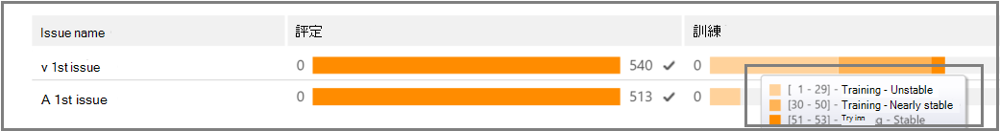
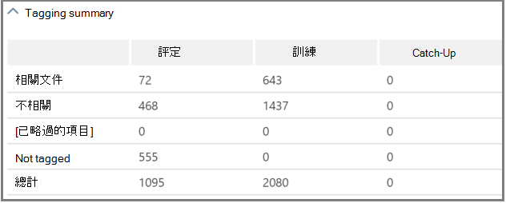

# 在高級 eDiscovery （經典）中追蹤相關性分析Track Relevance analysis in Advanced eDiscovery (classic)

> [!NOTE]
> 進階電子文件探索需要具有進階合規性附加元件的 Office 365 E3，或適用於您組織的 E5 訂閱。如果您沒有該方案，且想要嘗試進階電子文件探索，您可以[註冊 Office 365 企業版 E5 試用版](https://go.microsoft.com/fwlink/p/?LinkID=698279)。Advanced eDiscovery requires an Office 365 E3 with the Advanced Compliance add-on or an E5 subscription for your organization. If you don't have that plan and want to try Advanced eDiscovery, you can [sign up for a trial of Office 365 Enterprise E5](https://go.microsoft.com/fwlink/p/?LinkID=698279). 
  
在 [Advanced eDiscovery] 中，[相關性追蹤] 索引標籤會顯示在 [標籤] 索引標籤中所執行相關性訓練的計算有效性，並指出在重複訓練程式中要採取的下一個步驟。In Advanced eDiscovery, the Relevance Track tab displays the calculated validity of the Relevance training performed in the Tag tab and indicates the next step to take in the iterative training process in Relevance. 
  
## 追蹤相關性訓練狀態Tracking Relevance training status

1. 如下列 [**問題名稱**] 對話方塊的 [相關性追蹤] 中所示，請查看下列詳細資料。View the following details in Relevance Track for the case issues, as shown in the following example of an **Issue name** dialog below. 
    
  - **評估**：此進度指標顯示對此點所做的相關性訓練程度已在錯誤的邊界方面達到評估目標。**Assessment**: This progress indicator shows to what degree the Relevance training performed to this point has achieved the assessment target in terms of margin of error. 也會顯示相關的相關性訓練結果的豐富功能。The richness of the Relevance training results is also displayed. 
    
  - **訓練**：這種色彩編碼的進度指示器和工具提示顯示會指出相關性訓練結果的穩定性和數值比例，顯示針對每個問題標示的相關性訓練範例數目。**Training**: This color-coded progress indicator and tool-tip display indicates the Relevance training results stability and a numeric scale showing the number of Relevance training samples tagged for each issue. 專家會監視反覆運算相關性訓練程式的進度。The expert monitors the progress of the iterative Relevance training process. 
    
  - **批次計算**：此進度指標會提供有關批次計算完成的資訊。**Batch calculation**: This progress indicator provides information about the completion of Batch calculation.
    
  - **下一步**：顯示要執行下一個步驟的建議。**Next step**: Displays the recommendation for the next step to be performed. 
    
    在此範例中，會顯示成功完成的問題評估，並以已完成的色彩進度指示器和核取記號來表示。In the example, a successfully completed Assessment for an issue is shown, indicated by the completed color progress indicator and the checkmark. 標記正在進行中，但仍會將此案例視為不穩定（在工具提示中也會顯示穩定性狀態）。Tagging is underway, but the case is still considered unstable (stability status also shown in a tool-tip). 接下來的步驟建議是「訓練」。The next step recommendation is "Training". 
    
    
  
    展開的視圖會顯示其他資訊和選項。The expanded view displays additional information and options. 顯示的目前錯誤邊界是指目前評估狀態下的召回錯誤邊界，並提供現有（已標記）的評估檔。The displayed current error margin is the error margin of the recall in the current state of assessment, given the existing (already tagged) assessment files.
    
    > [!NOTE]
    >  您可以在每個問題旁清除 [**評估**] 核取方塊，然後針對「所有問題」，以略過評估階段。The Assessment stage can be bypassed by clearing the **Assessment** check box per issue and then for "all issues". 不過，如此一來，就不會發生此問題的統計資料。However, as a result, there will be no statistics for this issue. > 清除**評估**核取方塊只會在執行評估之前完成。> Clearing the **Assessment** check box can only be done before assessment is performed. 如果有多個問題存在於案例中，只有在此核取方塊針對每個問題清除時，才會略過評估。Where multiple issues exist in a case, assessment is bypassed only if the check box is cleared for each issue 
  
    當第一組範例中的評估未完成時，評估可能是進行其他標記的下一個步驟。When assessment is not completed with the first sample set of files, assessment might be the next step for tagging more files. 
    
    在 [**相關性** \> **追蹤**] 中，訓練進度指示器和工具提示會指出達到穩定性所需的額外範例數目。In **Relevance** \> **Track**, the training progress indicator and tool-tip indicate the estimated number of additional samples needed to reach stability. 這種評估為您所需的其他訓練提供指導方針。This estimate provides a guideline for the additional training needed.
    
    
  
2. 當您完成標記時，如果您需要繼續訓練，請按一下 [**訓練**]。When you're done tagging and if you need to continue training, click **Training**. 另一組檔案範例會從載入的檔案集產生，以供其他訓練。Another sample set of files is generated from the loaded file set for additional training. 然後您會傳回 [標籤] 索引標籤，以標記及訓練更多檔案。You are then returned to the Tag tab to tag and train more files.
    
### 達到穩定的訓練層級Reaching stable training levels

在評估檔已具備穩定的訓練等級之後，就可以使用「高級 eDiscovery」來進行批次計算。After the assessment files have attained a stable level of training, Advanced eDiscovery is ready for Batch calculation.
  
> [!NOTE]
> 通常，在三個穩定的訓練範例後，下一步是「批次計算」。Usually, after three stable training samples, the next step is "Batch calculation". 例如，當先前範例中的檔案卷標已變更時，或新增 seed 檔案時，可能會有例外狀況。There may be exceptions, for example, when there were changes to the tagging of files from earlier samples or when seed files were added. 
  
### 執行批次計算Performing Batch calculation

批次計算會在成功完成訓練時，做為下一個步驟（在工具提示中顯示 [進度列] 中的 [已勾選] 和 [穩定] 狀態時，會執行 [穩定訓練] 狀態）。批次計算會將相關性訓練期間所取得的知識套用到整個檔人口，以評估檔案的相關性並指派相關性分數。Batch calculation is executed as the next step after training is successfully completed (when a stable training status is shown by the progress bar, a checkmark and stable status in the tool-tip.) Batch calculation applies the knowledge acquired during the Relevance training to the entire file population, to assess the files' relevance and to assign Relevance scores.
  
當有一個以上的問題時，批次計算會在每個問題中完成。When there is more than one issue, Batch calculation is done per issue. 在批次計算期間，處理所有檔案時便會監控進度。During Batch calculation, progress is monitored while processing all of the files. 
  
在這裡，建議的下一個步驟是 "None"，表示目前不需要任何其他的重複相關性訓練。Here, the recommended next step is "None", which indicates that no additional iterative Relevance training is required at this point. 下一個階段是 [**相關性 \> 決定**] 索引標籤。The next phase is the **Relevance \> Decide** tab. 
  
如果您想要在批次計算後匯入新的檔案，系統管理員可以將匯入的檔案新增至新的負載。If you want to import new files after Batch calculation, the administrator can add the imported files to a new load.
  
> [!NOTE]
> 如果您在批次計算期間按一下 [**取消**]，程式就會儲存已執行的內容。If you click **Cancel** during Batch calculation, the process saves what was already executed. 如果您再次執行批次計算，程式將會從上次執行的點繼續。If you run Batch calculation again, the process will continue from the last executed point. 
  
### 評估標記一致性Assessing tagging consistency

若檔標記中有不一致，它會影響分析。If there are inconsistencies in file tagging, it can affect the analysis. 當結果不是最優或一致性不確定時，可以使用高級 eDiscovery 標記一致性處理常式。The Advanced eDiscovery tagging consistency process can be used when results are not optimal or consistency is in doubt. 會傳回可能不一致的標記檔案清單，並視需要加以檢查並重新標記。A list of possible inconsistently tagged files is returned, and they can be reviewed and re-tagged, as necessary.
  
> [!NOTE]
> 在七個或多個訓練四捨五入後，可在**相關性**追蹤問題中查看標記一致性 \> **Track** \> **Issue** \> 。**詳細結果** \> **訓練進度**After seven or more training rounds following assessment, tagging consistency can be viewed in **Relevance** \> **Track** \> **Issue** \> **Detailed results** \> **Training progress**. 此項檢查一次只對一個問題進行。This review is done for one issue at a time. 
  
1. 在 [**相關性 \> 追蹤**] 中，展開問題的列。In **Relevance \> Track**, expand an issue's row.
    
2. 在 **[下一步]** 的右側，按一下 [**修改**]。To the right of **Next step**, click **Modify**.
    
3. 選取 [**標記不一致性**做為**下一個步驟]** 選項，7訓練範例後，按一下 **[確定]**。Select **Tag inconsistencies** as the **Next step** option, after seven training samples and click **OK**.
    
4. 選取 [**標記不一致**。Select **Tag inconsistencies**. [**標記**] 索引標籤會開啟，顯示不一致的清單，視需要重新標記。The **Tag** tab opens displaying a list of the inconsistencies to re-tag as necessary. 
    
5. 按一下 [**計算**] 提交變更。Click **Calculate** to submit the changes. 標記不一致的下一個步驟是「訓練」。The next step after tagging inconsistencies is "Training". 
    
## 查看和使用相關性結果Viewing and using Relevance results

在 [**相關性 \> 追蹤**] 索引標籤中，展開問題的列，然後按一下 [**詳細結果**] 旁邊的 [**查看**]。In the **Relevance \> Track** tab, expand an issue's row, and next to **Detailed results**, click **View**. 隨即會顯示詳細的結果窗格，如下所示。The Detailed results panes are displayed, as shown and described below.
  

  
### 標記摘要Tagging summary

 在下列範例中，**標記摘要**會顯示每個評估、訓練及追趕檔標記程式的總數。In the example shown below, the **Tagging summary** displays totals for each of Assessment, Training, and Catch-up file tagging processes. 
  

  
### 關鍵字Keywords

關鍵字是由「高級 eDiscovery」識別為有關檔案是否相關的重要標記，而由「高級 eDiscovery」所識別之檔案中的唯一字串、word、片語或字詞順序。A keyword is a unique string, word, phrase, or sequence of words in a file identified by Advanced eDiscovery as a significant indicator of whether a file is relevant. 標記為相關的檔案中的「包含」欄清單關鍵字和權重，而「排除」欄會列出標示為不相關之檔案中的關鍵字和重量。The "Include" columns list keyword and weights in files tagged as Relevant, and the "Exclude" columns lists keywords and weights in files tagged as Not relevant.
  
「高級 eDiscovery」會指派負數或正值關鍵字權重值。Advanced eDiscovery assigns negative or positive keyword weight values. 權重越高，關鍵字顯示所在檔案的可能性越高，在批次計算期間指派的相關性分數越高。The higher the weight, the higher the likelihood that a file in which the keyword appears is assigned a higher Relevance score during Batch calculation. 
  
可使用關鍵字的高級 eDiscovery 清單來補充由專家所建的清單，或在檔案檢查程式中的任何一點以間接的健全檢查。The Advanced eDiscovery list of keywords can be used to supplement a list built by an expert or as an indirect sanity check at any point in the file review process.
  
### 訓練進度Training progress

[**訓練進度**] 窗格包含訓練進度圖表和品質指示器顯示，如以下範例所示。The **Training Progress** pane includes a training progress graph and quality indicator display, as shown in the example below. 
  

  
 **訓練品質指示器**：顯示標記一致性的評級，如下所示：**Training quality indicator**: Displays the rating of the tagging consistency as follows:
  
- **不錯**：檔案以一致的方式標記。**Good**: Files are tagged consistently. （顯示綠色光）(Green light displayed)
    
- **中**：部分檔的標記可能不一致。**Medium**: Some files may be tagged inconsistently. （顯示黃色光）(Yellow light displayed)
    
- **警告**：許多檔的標記可能不一致。**Warning**: Many files may be tagged inconsistently. （顯示紅色光）(Red light displayed)
    
 **訓練進度圖**：顯示與 F 量值比較的相關訓練週期數之後，相關性訓練的穩定性程度。**Training progress graph**: Shows the degree of Relevance training stability after a number of Relevance training cycles in comparison to the F-measure value. 當我們透過圖形從左向右移動時，置信區間會隨著高級 eDiscovery 相關性而縮小及使用，以判斷相關性訓練結果的穩定性。As we move from the left to the right across the graph, the confidence interval narrows and is used, along with the F-measure, by Advanced eDiscovery Relevance to determine stability when the Relevance training results are optimized.
  
> [!NOTE]
> 「相關性」會使用 F2，其中的召回會以精確度的精確度接收兩倍的值。Relevance uses F2, an F-measure metric where Recall receives twice as much weight as Precision. 針對具有大量豐富的情況（超過25%），相關性使用 F1 （1:1 比率）。For cases with high richness (over 25%), Relevance uses F1 (1:1 ratio). 您可以在 [**相關性設定**] [ \> **高級設定**] 中設定 F 測量比率。The F-measure ratio can be configured in **Relevance setup** \> **Advanced settings**. 
  
### 批次計算結果Batch calculation results

「**批次計算結果**」窗格包含相關的計分檔數，如下所示：The **Batch calculation results** pane includes the number of files that were scored for Relevance, as follows: 
  
- **Success****Success**
    
- **空白**：不含任何文字，例如只有空格/定位字元**Empty**: Contains no text, for example, only spaces/tabs
    
- **失敗**：由於大小過高或無法讀取**Failed**: Due to excessive size or could not be read
    
- 已**忽略**：由於大小過大**Ignored**: Due to excessive size
    
- **Nebulous**：包含無意義的文字或沒有與問題相關的功能**Nebulous**: Contains meaningless text or no features relevant to the issue
    
> [!NOTE]
> 空白、失敗、忽略或 Nebulous 將會收到-1 的相關性分數。Empty, Failed, Ignored, or Nebulous will receive a Relevance score of -1. 
  
### 訓練統計資料Training statistics

[**訓練統計資料**] 窗格會根據高級 eDiscovery 相關性訓練中的結果，顯示統計資料和曲線圖。The **Training statistics** pane displays statistics and graphs based on results from Advanced eDiscovery Relevance training. 
  

  
此視圖顯示下列專案：This view shows the following:
  
- **複查-召回比率**：根據 hypothetically 線性評論中的相關性分數，比較結果。**Review-recall ratio**: Comparison of results according to Relevance scores in a hypothetically linear review. 若要設定複查集大小，請估計重新叫用。Recall is estimated given the review set size set.
    
- **參數**：相對於整個案例的檔案人口，對應于審閱集的累計計算統計資料。**Parameters**: Cumulative calculated statistics pertaining to the review set in relation to the file population for the entire case.
    
- **檢查**：根據此截止點所要複查的檔案百分比。**Review**: Percentage of files to review based on this cutoff.
    
- **召回**：審閱集內相關檔案的百分比。**Recall**: Percentage of Relevant files in the review set. 
    
- **依相關性分數發佈**：深色灰度顯示幕中的檔案低於截止分數。**Distribution by relevance score**: Files in the dark gray display to the left are below the cutoff score. 工具提示會顯示與檔總數相關的審閱檔案集中的相關性分數和相關百分比。A tool-tip displays the Relevance score and the related percentage of files in the review file set in relation to the total files.
    
## 請參閱See also

[進階電子文件探索 (傳統版)Advanced eDiscovery (classic)](office-365-advanced-ediscovery.md)
  
[瞭解相關評估Understanding Assessment in Relevance](assessment-in-relevance-in-advanced-ediscovery.md)
  
[執行和核查評估Performing and reviewing Assessment](tagging-and-assessment-in-advanced-ediscovery.md)
  
[執行相關性訓練Performing Relevance training](tagging-and-relevance-training-in-advanced-ediscovery.md)
  
[根據結果作出決策Making decisions based on the results](decision-based-on-the-results-in-advanced-ediscovery.md)
  
[測試相關性分析Testing Relevance analysis](test-relevance-analysis-in-advanced-ediscovery.md)

