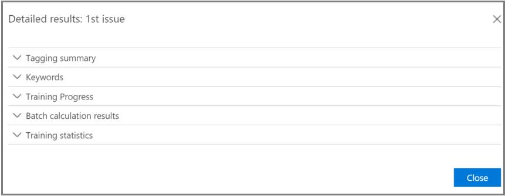
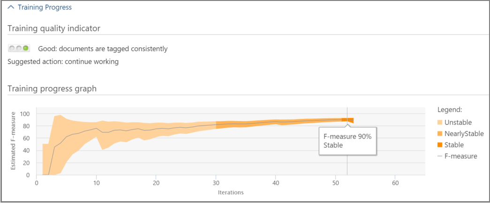

# 在「高級 eDiscovery (傳統) 中追蹤相關性分析

> [!NOTE]
> 進階電子文件探索需要具有進階合規性附加元件的 Office 365 E3，或適用於您組織的 E5 訂閱。如果您沒有該方案，且想要嘗試進階電子文件探索，您可以[註冊 Office 365 企業版 E5 試用版](https://go.microsoft.com/fwlink/p/?LinkID=698279)。 
  
在 [Advanced eDiscovery] 中，[相關性追蹤] 索引標籤會顯示在 [標籤] 索引標籤中所執行相關性訓練的計算有效性，並指出在重複訓練程式中要採取的下一個步驟。 
  
## 追蹤相關性訓練狀態

1. 如下列 [ **問題名稱** ] 對話方塊的 [相關性追蹤] 中所示，請查看下列詳細資料。 
    
  - **評估**：此進度指標顯示對此點所做的相關性訓練程度已在錯誤的邊界方面達到評估目標。 也會顯示相關的相關性訓練結果的豐富功能。 
    
  - **訓練**：這種色彩編碼的進度指示器和工具提示顯示會指出相關性訓練結果的穩定性和數值比例，顯示針對每個問題標示的相關性訓練範例數目。 專家會監視反覆運算相關性訓練程式的進度。 
    
  - **批次計算**：此進度指標會提供有關批次計算完成的資訊。
    
  - **下一步**：顯示要執行下一個步驟的建議。 
    
    在此範例中，會顯示成功完成的問題評估，並以已完成的色彩進度指示器和核取記號來表示。 標記正在進行中，但仍然會將此案例視為不穩定 (穩定性狀態也會顯示在工具提示) 中。 接下來的步驟建議是「訓練」。 
    
    
  
    展開的視圖會顯示其他資訊和選項。 如果現有的 (已標示) 評估檔案，則顯示目前的錯誤邊界是指目前評估狀態下的召回錯誤邊界。
    
    > [!NOTE]
    >  您可以在每個問題旁清除 [ **評估** ] 核取方塊，然後針對「所有問題」，以略過評估階段。 不過，如此一來，就不會發生此問題的統計資料。 > 清除 **評估** 核取方塊只會在執行評估之前完成。 如果有多個問題存在於案例中，只有在此核取方塊針對每個問題清除時，才會略過評估。 
  
    當第一組範例中的評估未完成時，評估可能是進行其他標記的下一個步驟。 
    
    在 [ **相關性** \> **追蹤**] 中，訓練進度指示器和工具提示會指出達到穩定性所需的額外範例數目。 這種評估為您所需的其他訓練提供指導方針。
    
    
  
2. 當您完成標記時，如果您需要繼續訓練，請按一下 [ **訓練**]。 另一組檔案範例會從載入的檔案集產生，以供其他訓練。 然後您會傳回 [標籤] 索引標籤，以標記及訓練更多檔案。
    
### 達到穩定的訓練層級

在評估檔已具備穩定的訓練等級之後，就可以使用「高級 eDiscovery」來進行批次計算。
  
> [!NOTE]
> 通常，在三個穩定的訓練範例後，下一步是「批次計算」。 例如，當先前範例中的檔案卷標已變更時，或新增 seed 檔案時，可能會有例外狀況。 
  
### 執行批次計算

當進度列（在工具提示中顯示 [核取記號] 和 [穩定狀態]）顯示時，會以下一 (步的方式執行批次計算。 ) 批次計算會將相關性訓練期間所取得的知識套用到整個檔人口，以評估檔的相關性並指派相關性分數。
  
當有一個以上的問題時，批次計算會在每個問題中完成。 在批次計算期間，處理所有檔案時便會監控進度。 
  
在這裡，建議的下一個步驟是 "None"，表示目前不需要任何其他的重複相關性訓練。 下一個階段是 [ **相關性 \> 決定** ] 索引標籤。 
  
如果您想要在批次計算後匯入新的檔案，系統管理員可以將匯入的檔案新增至新的負載。
  
> [!NOTE]
> 如果您在批次計算期間按一下 [ **取消** ]，程式就會儲存已執行的內容。 如果您再次執行批次計算，程式將會從上次執行的點繼續。 
  
### 評估標記一致性

若檔標記中有不一致，它會影響分析。 當結果不是最優或一致性不確定時，可以使用高級 eDiscovery 標記一致性處理常式。 會傳回可能不一致的標記檔案清單，並視需要加以檢查並重新標記。
  
> [!NOTE]
> 在七個或多個訓練四捨五入後，可在 **相關性** 追蹤問題中查看標記一致性 \>  \>  \> 。**詳細結果** \> **訓練進度** 此項檢查一次只對一個問題進行。 
  
1. 在 [ **相關性 \> 追蹤**] 中，展開問題的列。
    
2. 在 **[下一步]** 的右側，按一下 [ **修改**]。
    
3. 選取 [ **標記不一致性** 做為 **下一個步驟]** 選項，7訓練範例後，按一下 **[確定]**。
    
4. 選取 [ **標記不一致**。 [ **標記** ] 索引標籤會開啟，顯示不一致的清單，視需要重新標記。 
    
5. 按一下 [ **計算** ] 提交變更。 標記不一致的下一個步驟是「訓練」。 
    
## 查看和使用相關性結果

在 [ **相關性 \> 追蹤** ] 索引標籤中，展開問題的列，然後按一下 [ **詳細結果**] 旁邊的 [ **查看**]。 隨即會顯示詳細的結果窗格，如下所示。
  

  
### 標記摘要

 在下列範例中， **標記摘要** 會顯示每個評估、訓練及追趕檔標記程式的總數。 
  

  
### 關鍵字

關鍵字是由「高級 eDiscovery」識別為有關檔案是否相關的重要標記，而由「高級 eDiscovery」所識別之檔案中的唯一字串、word、片語或字詞順序。 標記為相關的檔案中的「包含」欄清單關鍵字和權重，而「排除」欄會列出標示為不相關之檔案中的關鍵字和重量。
  
「高級 eDiscovery」會指派負數或正值關鍵字權重值。 權重越高，關鍵字顯示所在檔案的可能性越高，在批次計算期間指派的相關性分數越高。 
  
可使用關鍵字的高級 eDiscovery 清單來補充由專家所建的清單，或在檔案檢查程式中的任何一點以間接的健全檢查。
  
### 訓練進度

[ **訓練進度** ] 窗格包含訓練進度圖表和品質指示器顯示，如以下範例所示。 
  

  
 **訓練品質指示器**：顯示標記一致性的評級，如下所示：
  
- **不錯**：檔案以一致的方式標記。 顯示 (綠光) 
    
- **中**：部分檔的標記可能不一致。  (顯示黃色光光) 
    
- **警告**：許多檔的標記可能不一致。 顯示 (紅燈光) 
    
 **訓練進度圖**：顯示與 F 量值比較的相關訓練週期數之後，相關性訓練的穩定性程度。 當我們透過圖形從左向右移動時，置信區間會隨著高級 eDiscovery 相關性而縮小及使用，以判斷相關性訓練結果的穩定性。
  
> [!NOTE]
> 「相關性」會使用 F2，其中的召回會以精確度的精確度接收兩倍的值。 對於高豐富 (超過 25% ) 的情況，相關性使用 F1 (1:1 比率) 。 您可以在 [ **相關性設定**] [ \> **高級設定**] 中設定 F 測量比率。 
  
### 批次計算結果

「 **批次計算結果** 」窗格包含相關的計分檔數，如下所示： 
  
- **Success**
    
- **空白**：不含任何文字，例如只有空格/定位字元
    
- **失敗**：由於大小過高或無法讀取
    
- 已 **忽略**：由於大小過大
    
- **Nebulous**：包含無意義的文字或沒有與問題相關的功能
    
> [!NOTE]
> 空白、失敗、忽略或 Nebulous 將會收到-1 的相關性分數。 
  
### 訓練統計資料

[ **訓練統計資料** ] 窗格會根據高級 eDiscovery 相關性訓練中的結果，顯示統計資料和曲線圖。 
  

  
此視圖顯示下列專案：
  
- **複查-召回比率**：根據 hypothetically 線性評論中的相關性分數，比較結果。 若要設定複查集大小，請估計重新叫用。
    
- **參數**：相對於整個案例的檔案人口，對應于審閱集的累計計算統計資料。
    
- **檢查**：根據此截止點所要複查的檔案百分比。
    
- **召回**：審閱集內相關檔案的百分比。 
    
- **依相關性分數發佈**：深色灰度顯示幕中的檔案低於截止分數。 工具提示會顯示與檔總數相關的審閱檔案集中的相關性分數和相關百分比。
