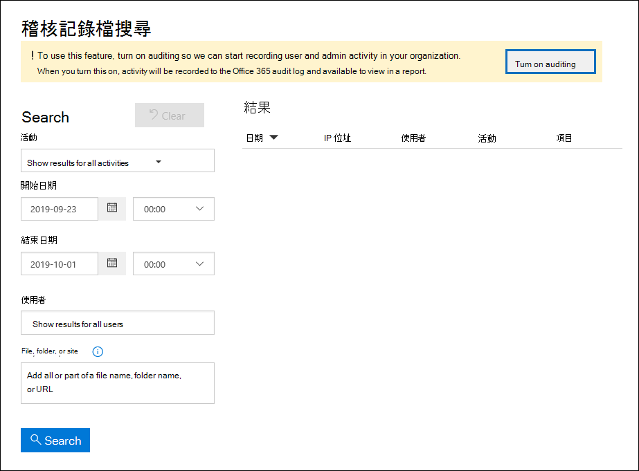

# <a name="turn-auditing-on-or-off"></a>開啟或關閉審計

使用 Microsoft 365 和 Office 365 企業版的組織，預設會開啟 [稽核記錄]。 其中包括使用 E3/G3 或 E5/G5 訂閱的組織。 開啟規範中心的審計時，會將組織中的使用者和系統管理員活動記錄在審核記錄中，並在90天內保留，視指派給使用者的授權而定到一年。 不過，您的組織可能會有不想要記錄和保留審核記錄資料的原因。 在這種情況下，全域管理員可能會決定在 Microsoft 365 中關閉審核。

> [!IMPORTANT]
> 如果您在 Microsoft 365 中關閉審核，您就無法使用 Office 365 管理活動 API 或 Azure Sentinel 來存取組織的審計資料。 遵循本文中的步驟關閉審計，表示當您使用安全性 & 合規性中心或在 Exchange Online PowerShell 中執行 **Search-UnifiedAuditLog** Cmdlet 來搜尋審核記錄時，將不會傳回任何結果。 這也表示無法透過 Office 365 管理活動 API 或 Azure Sentinel 使用審核記錄。
  
## <a name="before-you-turn-auditing-on-or-off"></a>開啟或關閉審計之前

- 您必須在 Exchange Online 中指派「審計記錄」角色，才能在 Microsoft 365 組織中開啟或關閉審計。 根據預設，此角色會指派給 Exchange 系統管理中心的 [**許可權**] 頁面上的 [規範管理] 和 [組織管理] 角色群組。 Microsoft 365 中的全域系統管理員是 Exchange Online 中的「組織管理」角色群組的成員。 

    > [!NOTE]
    > 在 Exchange Online 開啟或關閉審核時，必須將許可權指派給使用者。 如果您在安全性 & 合規性中心的 [ **許可權** ] 頁面上指派「審核記錄」角色，則使用者將無法開啟或關閉審核功能。 這是因為基準 Cmdlet 是 Exchange Online PowerShell Cmdlet。 

- 如需搜尋審核記錄的逐步指示，請參閱在 [安全性 & 規範中心搜尋審核記錄](search-the-audit-log-in-security-and-compliance.md)檔。 如需 Microsoft 365 管理活動 API 的詳細資訊，請參閱[開始使用 Microsoft 365 管理 APIs](/office/office-365-management-api/get-started-with-office-365-management-apis)。

- 若要確認已開啟審核，您可以在 Exchange Online 中執行下列命令 PowerShell:

    ```powershell
    Get-AdminAuditLogConfig | FL UnifiedAuditLogIngestionEnabled
    ```

    `True` _UnifiedAuditLogIngestionEnabled_ 屬性的值表示已開啟審計。 

## <a name="turn-on-auditing"></a>開啟審計

如果您的組織未開啟審核，您可以在「規範中心」或使用 Exchange Online PowerShell 來開啟審核。 在您開啟審核後，可能需要數小時的時間，才能在搜尋審核記錄檔時傳回結果。
  
### <a name="use-the-compliance-center-to-turn-on-auditing"></a>使用規範中心來開啟審計

1. 移至 <https://compliance.microsoft.com> 並登入。

2. 在 Microsoft 365 規範中心的左功能窗格中，按一下 [**全部顯示**]，然後按一下 [**審計**]。

   如果您的組織未開啟審核，就會顯示橫幅，提示您開始錄製使用者和系統管理員活動。

   

3. 按一下 [ **開始錄製使用者和系統管理員] 活動** 橫幅。

   可能需要長達60分鐘，變更才會生效。

### <a name="use-powershell-to-turn-on-auditing"></a>使用 PowerShell 開啟審計

1. [連線到 Exchange Online PowerShell](/powershell/exchange/connect-to-exchange-online-powershell)

2. 執行下列 PowerShell 命令，在 Office 365 中開啟審計。

    ```powershell
    Set-AdminAuditLogConfig -UnifiedAuditLogIngestionEnabled $true
    ```

    隨即顯示一則訊息，指出可能需要長達60分鐘的時間，變更才會生效。
  
## <a name="turn-off-auditing"></a>關閉審計

您必須使用 Exchange Online PowerShell 關閉審核。
  
1. [連線到 Exchange Online PowerShell](/powershell/exchange/connect-to-exchange-online-powershell)

2. 執行下列 PowerShell 命令以關閉審計。

    ```powershell
    Set-AdminAuditLogConfig -UnifiedAuditLogIngestionEnabled $false
    ```

3. 經過一段時間後，請確認已停用 (停用) 的審計功能。 執行這項作業的方法有兩種：

    - 在 Exchange Online PowerShell 中，執行下列命令：

      ```powershell
      Get-AdminAuditLogConfig | FL UnifiedAuditLogIngestionEnabled
      ```

      `False` _UnifiedAuditLogIngestionEnabled_ 屬性的值表示已關閉的審計功能。

    - 移至 Microsoft 365 規範中心的「**審計**」頁面。

      如果您的組織未開啟審核，就會顯示橫幅，提示您開始錄製使用者和系統管理員活動。
