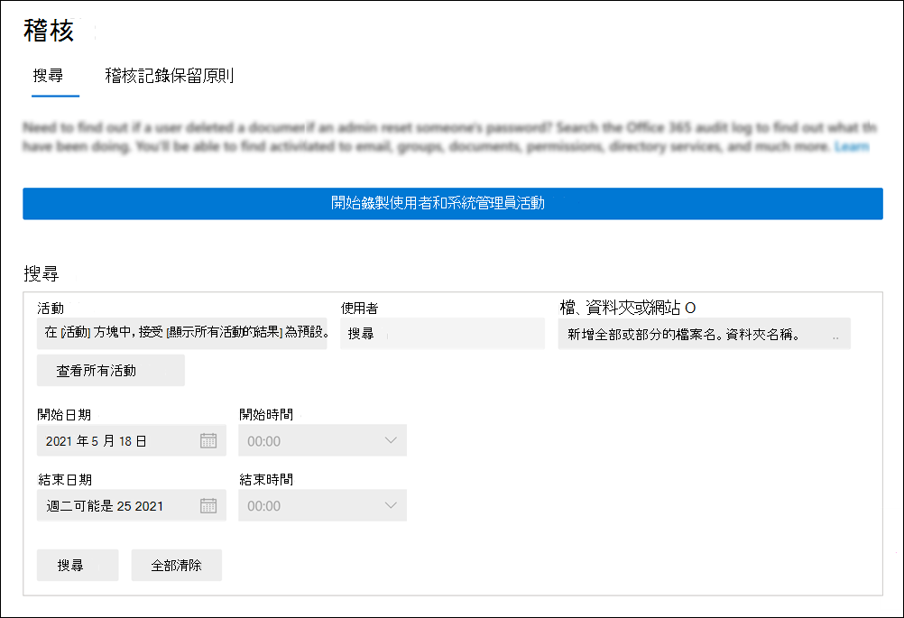

# <a name="turn-auditing-on-or-off"></a><span data-ttu-id="5eefd-103">開啟或關閉稽核</span><span class="sxs-lookup"><span data-stu-id="5eefd-103">Turn auditing on or off</span></span>

<span data-ttu-id="5eefd-104">使用 Microsoft 365 和 Office 365 企業版的組織，預設會開啟 [稽核記錄]。</span><span class="sxs-lookup"><span data-stu-id="5eefd-104">Audit logging is turned on by default for Microsoft 365 and Office 365 enterprise organizations.</span></span> <span data-ttu-id="5eefd-105">當 Microsoft 365 合規性中心中的審計開啟時，您組織中的使用者和系統管理員活動會記錄在審核記錄中，並在90天內保留，視指派給使用者的授權而定到一年。</span><span class="sxs-lookup"><span data-stu-id="5eefd-105">When auditing in the Microsoft 365 compliance center is turned on, user and admin activity from your organization is recorded in the audit log and retained for 90 days, and up to one year depending on the license assigned to users.</span></span> <span data-ttu-id="5eefd-106">不過，您的組織可能會有不想要記錄和保留審核記錄資料的原因。</span><span class="sxs-lookup"><span data-stu-id="5eefd-106">However, your organization may have reasons for not wanting to record and retain audit log data.</span></span> <span data-ttu-id="5eefd-107">在這種情況下，全域管理員可能會決定在 Microsoft 365 中關閉審核。</span><span class="sxs-lookup"><span data-stu-id="5eefd-107">In those cases, a global admin may decide to turn off auditing in Microsoft 365.</span></span>

<span data-ttu-id="5eefd-108">當您設定新的 Microsoft 365 或 Office 365 組織時，您可以確認組織的審核狀態。</span><span class="sxs-lookup"><span data-stu-id="5eefd-108">When setting up a new Microsoft 365 or Office 365 organization, you can verify the auditing status for your organization.</span></span> <span data-ttu-id="5eefd-109">如需相關指示，請參閱本文中的 [驗證您的組織的審計狀態](#verify-the-auditing-status-for-your-organization) 一節。</span><span class="sxs-lookup"><span data-stu-id="5eefd-109">For instructions, see the [Verify the auditing status for your organization](#verify-the-auditing-status-for-your-organization) section in this article.</span></span>

> [!IMPORTANT]
> <span data-ttu-id="5eefd-110">如果您在 Microsoft 365 中關閉審核，您就無法使用 Office 365 管理活動 API 或 Azure Sentinel 來存取組織的審計資料。</span><span class="sxs-lookup"><span data-stu-id="5eefd-110">If you turn off auditing in Microsoft 365, you can't use the Office 365 Management Activity API or Azure Sentinel to access auditing data for your organization.</span></span> <span data-ttu-id="5eefd-111">遵循本文中的步驟關閉審計，表示當您使用 Microsoft 365 合規性中心搜尋審計記錄檔時，或在 Exchange Online PowerShell 中執行 **Search-UnifiedAuditLog** Cmdlet 時，不會傳回任何結果。</span><span class="sxs-lookup"><span data-stu-id="5eefd-111">Turning off auditing by following the steps in this article means that no results will be returned when you search the audit log using the Microsoft 365 compliance center or when you run the **Search-UnifiedAuditLog** cmdlet in Exchange Online PowerShell.</span></span> <span data-ttu-id="5eefd-112">這也表示無法透過 Office 365 管理活動 API 或 Azure Sentinel 使用審核記錄。</span><span class="sxs-lookup"><span data-stu-id="5eefd-112">This also means that audit logs won't be available through the Office 365 Management Activity API or Azure Sentinel.</span></span>
  
## <a name="before-you-turn-auditing-on-or-off"></a><span data-ttu-id="5eefd-113">開啟或關閉審計之前</span><span class="sxs-lookup"><span data-stu-id="5eefd-113">Before you turn auditing on or off</span></span>

- <span data-ttu-id="5eefd-114">您必須在 Exchange Online 中指派「審計記錄」角色，才能在 Microsoft 365 組織中開啟或關閉審計。</span><span class="sxs-lookup"><span data-stu-id="5eefd-114">You have to be assigned the Audit Logs role in Exchange Online to turn auditing on or off in your Microsoft 365 organization.</span></span> <span data-ttu-id="5eefd-115">根據預設，此角色會指派給 Exchange 系統管理中心的 [**許可權**] 頁面上的 [規範管理] 和 [組織管理] 角色群組。</span><span class="sxs-lookup"><span data-stu-id="5eefd-115">By default, this role is assigned to the Compliance Management and Organization Management role groups on the **Permissions** page in the Exchange admin center.</span></span> <span data-ttu-id="5eefd-116">Microsoft 365 中的全域系統管理員是 Exchange Online 中的「組織管理」角色群組的成員。</span><span class="sxs-lookup"><span data-stu-id="5eefd-116">Global admins in Microsoft 365 are members of the Organization Management role group in Exchange Online.</span></span>

    > [!NOTE]
    > <span data-ttu-id="5eefd-117">在 Exchange Online 開啟或關閉審核時，必須將許可權指派給使用者。</span><span class="sxs-lookup"><span data-stu-id="5eefd-117">Users have to be assigned permissions in Exchange Online to turn auditing on or off.</span></span> <span data-ttu-id="5eefd-118">如果您在 Microsoft 365 合規性中心中的 [**許可權**] 頁面上指派「審核記錄」角色，使用者將無法開啟或關閉審計。</span><span class="sxs-lookup"><span data-stu-id="5eefd-118">If you assign users the Audit Logs role on the **Permissions** page in the Microsoft 365 compliance center, they won't be able to turn auditing on or off.</span></span> <span data-ttu-id="5eefd-119">這是因為基準 Cmdlet 是 Exchange Online PowerShell Cmdlet。</span><span class="sxs-lookup"><span data-stu-id="5eefd-119">This is because the underlying cmdlet is an Exchange Online PowerShell cmdlet.</span></span>

- <span data-ttu-id="5eefd-120">如需搜尋審核記錄的逐步指示，請參閱 [搜尋審核記錄](search-the-audit-log-in-security-and-compliance.md)檔。</span><span class="sxs-lookup"><span data-stu-id="5eefd-120">For step-by-step instructions on searching the audit log, see [Search the audit log](search-the-audit-log-in-security-and-compliance.md).</span></span> <span data-ttu-id="5eefd-121">如需 Microsoft 365 管理活動 API 的詳細資訊，請參閱[開始使用 Microsoft 365 管理 APIs](/office/office-365-management-api/get-started-with-office-365-management-apis)。</span><span class="sxs-lookup"><span data-stu-id="5eefd-121">For more information about the Microsoft 365 Management Activity API, see [Get started with Microsoft 365 Management APIs](/office/office-365-management-api/get-started-with-office-365-management-apis).</span></span>

## <a name="verify-the-auditing-status-for-your-organization"></a><span data-ttu-id="5eefd-122">驗證組織的審計狀態</span><span class="sxs-lookup"><span data-stu-id="5eefd-122">Verify the auditing status for your organization</span></span>

<span data-ttu-id="5eefd-123">若要確認已開啟組織的審計，您可以在[Exchange Online PowerShell](/powershell/exchange/connect-to-exchange-online-powershell)中執行下列命令：</span><span class="sxs-lookup"><span data-stu-id="5eefd-123">To verify that auditing is turned on for your organization, you can run the following command in [Exchange Online PowerShell](/powershell/exchange/connect-to-exchange-online-powershell):</span></span>

```powershell
Get-AdminAuditLogConfig | FL UnifiedAuditLogIngestionEnabled
```

<span data-ttu-id="5eefd-124">`True` _UnifiedAuditLogIngestionEnabled_ 屬性的值表示已開啟審計。</span><span class="sxs-lookup"><span data-stu-id="5eefd-124">A value of `True` for the  _UnifiedAuditLogIngestionEnabled_ property indicates that auditing is turned on.</span></span> <span data-ttu-id="5eefd-125">值 `False` 表示未開啟審計。</span><span class="sxs-lookup"><span data-stu-id="5eefd-125">A value of `False` indicates that auditing is not turned on.</span></span>

## <a name="turn-on-auditing"></a><span data-ttu-id="5eefd-126">開啟審計</span><span class="sxs-lookup"><span data-stu-id="5eefd-126">Turn on auditing</span></span>

<span data-ttu-id="5eefd-127">如果您的組織未開啟審核，您可以在 Microsoft 365 合規性中心中或使用 Exchange Online PowerShell 將其開啟。</span><span class="sxs-lookup"><span data-stu-id="5eefd-127">If auditing is not turned on for your organization, you can turn it on in the Microsoft 365 compliance center or by using Exchange Online PowerShell.</span></span> <span data-ttu-id="5eefd-128">在您開啟審核後，可能需要數小時的時間，才能在搜尋審核記錄檔時傳回結果。</span><span class="sxs-lookup"><span data-stu-id="5eefd-128">It may take several hours after you turn on auditing before you can return results when you search the audit log.</span></span>
  
### <a name="use-the-compliance-center-to-turn-on-auditing"></a><span data-ttu-id="5eefd-129">使用規範中心來開啟審計</span><span class="sxs-lookup"><span data-stu-id="5eefd-129">Use the compliance center to turn on auditing</span></span>

1. <span data-ttu-id="5eefd-130">移至 <https://compliance.microsoft.com> 並登入。</span><span class="sxs-lookup"><span data-stu-id="5eefd-130">Go to <https://compliance.microsoft.com> and sign in.</span></span>

2. <span data-ttu-id="5eefd-131">在 Microsoft 365 合規性中心的左導覽窗格中，按一下 [**審計**]。</span><span class="sxs-lookup"><span data-stu-id="5eefd-131">In the left navigation pane of the Microsoft 365 compliance center, click **Audit**.</span></span>

   <span data-ttu-id="5eefd-132">如果您的組織未開啟審核，就會顯示橫幅，提示您開始錄製使用者和系統管理員活動。</span><span class="sxs-lookup"><span data-stu-id="5eefd-132">If auditing is not turned on for your organization, a banner is displayed prompting you start recording user and admin activity.</span></span>

   

3. <span data-ttu-id="5eefd-134">按一下 [ **開始錄製使用者和系統管理員] 活動** 橫幅。</span><span class="sxs-lookup"><span data-stu-id="5eefd-134">Click the **Start recording user and admin activity** banner.</span></span>

   <span data-ttu-id="5eefd-135">可能需要長達60分鐘，變更才會生效。</span><span class="sxs-lookup"><span data-stu-id="5eefd-135">It may take up to 60 minutes for the change to take effect.</span></span>

### <a name="use-powershell-to-turn-on-auditing"></a><span data-ttu-id="5eefd-136">使用 PowerShell 開啟審計</span><span class="sxs-lookup"><span data-stu-id="5eefd-136">Use PowerShell to turn on auditing</span></span>

1. <span data-ttu-id="5eefd-137">[連線至 Exchange Online PowerShell](/powershell/exchange/connect-to-exchange-online-powershell)。</span><span class="sxs-lookup"><span data-stu-id="5eefd-137">[Connect to Exchange Online PowerShell](/powershell/exchange/connect-to-exchange-online-powershell).</span></span>

2. <span data-ttu-id="5eefd-138">執行下列 PowerShell 命令以開啟審計。</span><span class="sxs-lookup"><span data-stu-id="5eefd-138">Run the following PowerShell command to turn on auditing.</span></span>

    ```powershell
    Set-AdminAuditLogConfig -UnifiedAuditLogIngestionEnabled $true
    ```

    <span data-ttu-id="5eefd-139">隨即顯示一則訊息，指出可能需要長達60分鐘的時間，變更才會生效。</span><span class="sxs-lookup"><span data-stu-id="5eefd-139">A message is displayed saying that it may take up to 60 minutes for the change to take effect.</span></span>
  
## <a name="turn-off-auditing"></a><span data-ttu-id="5eefd-140">關閉審計</span><span class="sxs-lookup"><span data-stu-id="5eefd-140">Turn off auditing</span></span>

<span data-ttu-id="5eefd-141">您必須使用 Exchange Online PowerShell 關閉審核。</span><span class="sxs-lookup"><span data-stu-id="5eefd-141">You have to use Exchange Online PowerShell to turn off auditing.</span></span>
  
1. <span data-ttu-id="5eefd-142">[連線至 Exchange Online PowerShell](/powershell/exchange/connect-to-exchange-online-powershell)。</span><span class="sxs-lookup"><span data-stu-id="5eefd-142">[Connect to Exchange Online PowerShell](/powershell/exchange/connect-to-exchange-online-powershell).</span></span>

2. <span data-ttu-id="5eefd-143">執行下列 PowerShell 命令以關閉審計。</span><span class="sxs-lookup"><span data-stu-id="5eefd-143">Run the following PowerShell command to turn off auditing.</span></span>

    ```powershell
    Set-AdminAuditLogConfig -UnifiedAuditLogIngestionEnabled $false
    ```

3. <span data-ttu-id="5eefd-144">經過一段時間後，請確認已停用 (停用) 的審計功能。</span><span class="sxs-lookup"><span data-stu-id="5eefd-144">After a while, verify that auditing is turned off (disabled).</span></span> <span data-ttu-id="5eefd-145">執行這項作業的方法有兩種：</span><span class="sxs-lookup"><span data-stu-id="5eefd-145">There are two ways to do this:</span></span>

    - <span data-ttu-id="5eefd-146">在 Exchange Online PowerShell 中，執行下列命令：</span><span class="sxs-lookup"><span data-stu-id="5eefd-146">In Exchange Online PowerShell, run the following command:</span></span>

      ```powershell
      Get-AdminAuditLogConfig | FL UnifiedAuditLogIngestionEnabled
      ```

      <span data-ttu-id="5eefd-147">`False` _UnifiedAuditLogIngestionEnabled_ 屬性的值表示已關閉的審計功能。</span><span class="sxs-lookup"><span data-stu-id="5eefd-147">The value of  `False` for the  _UnifiedAuditLogIngestionEnabled_ property indicates that auditing is turned off.</span></span>

    - <span data-ttu-id="5eefd-148">移至 Microsoft 365 合規性中心中的 [**審計**] 頁面。</span><span class="sxs-lookup"><span data-stu-id="5eefd-148">Go to the **Audit** page in the Microsoft 365 compliance center.</span></span>

      <span data-ttu-id="5eefd-149">如果您的組織未開啟審核，就會顯示橫幅，提示您開始錄製使用者和系統管理員活動。</span><span class="sxs-lookup"><span data-stu-id="5eefd-149">If auditing is not turned on for your organization, a banner is displayed prompting you start recording user and admin activity.</span></span>
