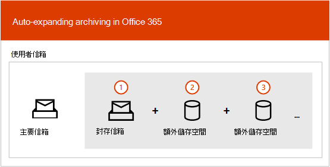

# 無限制封存概觀

在 Office 365 中，封存信箱可為使用者提供額外的信箱儲存空間。 啟用使用者的封存信箱之後，最多可有 100 GB 的額外儲存空間。 過去，當達到 100 GB 的儲存配額時，組織必須與 Microsoft 聯繫以要求封存信箱的額外儲存空間。 不再是這樣。

Microsoft 365 中的無限制封存功能（稱為*自動展開*封存）在封存信箱中提供額外的儲存空間。 當封存信箱中的儲存配額達到時，Microsoft 365 會自動增加封存的大小，這表示使用者將不會耗盡信箱儲存空間，而且系統管理員不需要針對封存信箱要求額外的儲存空間。

如需開啟自動展開封存的逐步指示，請參閱[啟用無限期](enable-unlimited-archiving.md)封存。

> [!NOTE]
> 自動展開封存也支援共用信箱。 若要啟用共用信箱的封存，則需要 exchange Online Plan 2 授權或 Exchange online Plan 1 授權與 Exchange Online 封存授權。

## 自動展開封存的運作方式

如先前所述，在啟用使用者的封存信箱時，會建立額外的信箱儲存空間。 啟用自動展開封存時，Microsoft 365 會定期檢查封存信箱的大小。 封存信箱接近其儲存限制時，Microsoft 365 會自動為封存建立額外的儲存空間。 如果使用者已耗盡此額外的儲存空間，則 Microsoft 365 會為使用者的封存增加更多儲存空間。 此程式會自動進行，這表示系統管理員不需要要求額外的封存儲存或管理自動展開的封存。

以下是程式的快速綜述。

1. 啟用使用者信箱或共用信箱的封存。 會建立具有 100 GB 儲存空間的封存信箱，並將封存信箱的警告配額設定為 90 GB。

2. 管理員啟用信箱的自動擴充封存。 當封存信箱（包括 [可復原的專案] 資料夾）達到 90 GB 時，它會轉換成自動展開的封存，而 Microsoft 365 會將儲存空間新增至封存。 最多可能需要30天的時間，才能布建額外的儲存空間。

   > [!NOTE]
   > 如果信箱處於暫止狀態或指派給保留原則，當自動擴充封存啟用時，封存信箱的儲存配額會提升為 110 GB。 同樣地，封存警告配額增加為 100 GB。

3. Microsoft 365 會在必要時自動新增更多儲存空間。

> [!IMPORTANT]
> 只支援針對個別使用者（或共用信箱）使用的信箱，其增長率不會超過每日 1 GB。 使用者的封存信箱僅供該使用者使用。 不允許使用日誌記錄、傳輸規則或自動轉寄規則，將郵件複製到封存信箱。 Microsoft 保留在使用者的封存信箱用來儲存其他使用者的封存資料或其他不適當用途的情況下，拒絕無限封存的權利。

## 哪些專案會移至其他封存儲存空間？

若要有效使用自動展開的封存儲存區，資料夾可能會移動。 Microsoft 365 會決定當其他儲存區新增至封存時，哪些資料夾會移動。 有時移動資料夾時，會自動建立一個或多個子資料夾，而且原始檔案夾中的專案會發佈到這些資料夾，以協助移動程式。 當您在 Outlook 中查看資料夾清單的封存部分時，這些子資料夾會顯示在原始檔案夾底下。  Microsoft 365 用來命名這些子資料夾的命名慣例為** \<資料夾名稱\>_yyyy （在 mmm dd，yyyy h_mm 上建立）**，其中：

- **yyyy**是一年接收資料夾中的郵件。

- **mmm dd yyyy h_m**是由 Office 365 建立子資料夾的日期和時間，以 UTC 格式，根據使用者的時區及 Outlook 中的區域設定而定。

下列螢幕擷取畫面顯示將郵件移至自動展開的封存之前和之後的資料夾清單。

 **新增額外的儲存體之前**

 **新增額外的儲存空間之後**

> [!NOTE]
> 如先前所述，Microsoft 365 會將專案移至子資料夾（並使用上述命名慣例加以命名），以協助將內容散佈至輔助封存。 但是將專案移至子資料夾可能不一定是這樣。 有時候整個資料夾可能會移至輔助封存。 在此情況下，資料夾將保留其原始名稱。  在 Outlook 的資料夾清單中，資料夾已經移至輔助封存，它並不明顯。

## 在自動展開的封存中存取專案所需的 Outlook 需求

若要存取儲存在自動展開的封存中的郵件，使用者必須使用下列其中一個 Outlook 用戶端：

- Outlook 2016 或 Outlook 2019 for Windows

- Outlook 網頁版

- Outlook 2016 或 Outlook 2019 （適用于 Mac）

以下是使用 Outlook 或 Outlook 網頁版時所要考慮的一些事項，以存取儲存在自動擴充封存中的郵件。

- 您可以存取封存信箱中的任何資料夾，包括已移至自動擴充儲存區域的資料夾。

- 您可以搜尋資料夾本身，只搜尋移至其他儲存體區域的專案。 這表示您必須選取 [資料夾清單] 中的 [封存] 資料夾，以選取**目前的資料夾**選項作為搜尋範圍。 同樣地，如果自動擴充的儲存體區域中的資料夾包含子資料夾，您必須分別搜尋每個子資料夾。

- 在自動展開的封存中，Outlook 中的專案計數和已讀取/未讀取的計數（在 Outlook 和網頁型 outlook 中）可能不准確。

- 您可以刪除子資料夾中的專案，使其指向自動擴充的儲存區，但是無法刪除資料夾本身。

- 您無法使用 [復原刪除的郵件] 功能，從自動擴充的儲存區中復原已刪除的專案。

## 自動展開封存和其他符合性功能

本節說明自動擴充封存與其他法規遵從性及資料管理功能之間的功能。

- **eDiscovery：** 當您使用 eDiscovery 工具（例如內容搜尋或 In-Place 電子檔探索）時，也會搜尋自動擴充封存中的其他儲存區。

- **保留：** 當您使用 Exchange Online 中的訴訟資料暫止或 eDiscovery 案例保留和保留原則，將信箱保留在「保留」狀態時，位於自動展開封存中的內容也會處於暫止狀態。

- **通訊記錄管理（MRM）：** 如果您使用 Exchange Online 中的 MRM 刪除原則永久刪除過期的信箱專案，則也會刪除位於自動展開封存中的已過期專案。

- 匯**入服務：** 您可以使用 Office 365 匯入服務，將 PST 檔案匯入至使用者的自動擴充封存。 您可以將最多 100 GB 的資料從 PST 檔案匯入至使用者的封存信箱。

## 詳細資訊

如需自動展開封存的相關技術詳細資訊，請參閱[Microsoft 365：自動展開的封存常見問題](https://blogs.technet.microsoft.com/exchange/2018/04/09/office-365-auto-expanding-archives-faq/)。
