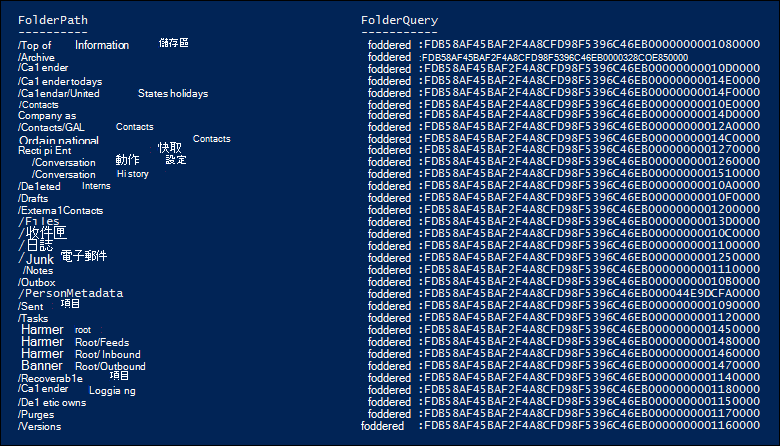
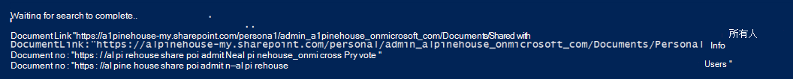

# <a name="use-content-search-for-targeted-collections"></a>對目標集合使用內容搜尋

Microsoft 365 規範中心的內容搜尋功能不會在 UI 中提供直接的方式，以搜尋 Exchange 信箱或 SharePoint 和商務用 OneDrive 網站中的特定資料夾。 不過，您可以在實際搜尋查詢語法中指定網站的 [電子郵件] 或 [)  (路徑] 的資料夾識別碼內容， (稱為 *目標集合*) ，以搜尋特定資料夾。 當您確信回應案例或特權專案的專案位於特定信箱或網站資料夾時，使用內容搜尋來執行目標集合很有用。 您可以使用本文中的腳本，取得信箱資料夾的資料夾識別碼，或 SharePoint 和商務用 OneDrive 網站上資料夾的 (DocumentLink) 路徑。 然後您可以使用搜尋查詢中的資料夾識別碼或路徑，傳回位於資料夾中的專案。

> [!NOTE]
> 若要傳回位於 SharePoint 或商務用 OneDrive 網站的資料夾中的內容，本主題中的腳本會使用 DocumentLink managed 屬性，而不是 Path 屬性。 DocumentLink 屬性比 Path 屬性更強健，因為它會傳回資料夾中的所有內容，而 Path 屬性則不會傳回某些媒體檔案。

## <a name="before-you-run-a-targeted-collection"></a>在執行目標集合之前

- 您必須是 Security & 合規性中心內 eDiscovery 管理員角色群組的成員，才可執行步驟1中的腳本。 如需詳細資訊，請參閱[指派電子文件探索權限](assign-ediscovery-permissions.md)。

    此外，您必須為您的 Exchange Online 組織指派「郵件收件者」角色。 這是執行 **Get-MailboxFolderStatistics** Cmdlet 的必要指令，該指令包含在腳本中。 根據預設，會將「郵件收件者」角色指派給 Exchange Online 中的組織管理和收件者管理角色群組。 如需在 Exchange Online 指派許可權的相關資訊，請參閱[Manage role group members](/exchange/manage-role-group-members-exchange-2013-help)。 您也可以建立自訂角色群組、指派「郵件收件者」角色給它，然後新增需要在步驟1中執行腳本的成員。 如需詳細資訊，請參閱 [管理角色群組](/Exchange/permissions-exo/role-groups)。

- 本文中的腳本支援新式驗證。 如果您是 Microsoft 365 或 Microsoft 365 GCC 組織，您可以使用腳本。 如果您是 Office 365 德國組織、Microsoft 365 GCC 高組織或 Microsoft 365 DoD 組織，您必須編輯腳本以順利執行它。 具體說來，您必須編輯該行 `Connect-ExchangeOnline` 並使用 *ExchangeEnvironmentName* 參數 (，並使用適當的值為您的組織輸入) 以連接至 Exchange Online PowerShell。  此外，您必須編輯該行 `Connect-IPPSSession` 並使用 *ConnectionUri* 和 *AzureADAuthorizationEndpointUri* 參數 (以及組織類型的適當值，) 才能連線至安全性 & 規範中心 PowerShell。 如需詳細資訊，請參閱[連線中 Exchange Online PowerShell](/powershell/exchange/connect-to-exchange-online-powershell#connect-to-exchange-online-powershell-without-using-mfa)及[連線安全性 & 規範中心 PowerShell](/powershell/exchange/connect-to-scc-powershell#connect-to-security--compliance-center-powershell-without-using-mfa)的範例。

- 每當您執行腳本時，就會建立新的遠端 PowerShell 會話。 這表示您可以使用所有可用的遠端 PowerShell 會話。 若要避免發生這種情況，請執行下列命令，以中斷使用中遠端 PowerShell 會話的連線。

  ```powershell
  Get-PSSession | Remove-PSSession
  ```

    如需詳細資訊，請參閱＜[連線至 Exchange Online PowerShell](/powershell/exchange/connect-to-exchange-online-powershell)＞。

- 腳本包含最低的錯誤處理。 腳本的主要用途是快速顯示可在內容搜尋的搜尋查詢語法中使用的信箱資料夾 IDs 或網站路徑清單，以執行目標集合。

- 在任何 Microsoft standard support 方案或服務下，都不支援本主題中提供的範例腳本。 範例指令碼係依「現狀」提供，不含任何種類的擔保方式。 Microsoft 另外不承擔任何明示或默示的擔保，包括但不限於適售性或適合某特定用途的默示擔保。 使用或操作範例指令碼和文件發生的所有風險，皆屬於您的責任。 Microsoft、其作者以及其他與建置、生產或交付程式碼相關的任何人在任何情況下皆完全不需對任何損失負責任，包括但不限於商業利潤損失、業務中斷、業務資訊損失、或其他錢財損失等因使用或無法使用範例指令碼或文件所發生的損失，即使 Microsoft 曾建議這些損失發生的可能性。

## <a name="step-1-run-the-script-to-get-a-list-of-folders-for-a-mailbox-or-site"></a>步驟1：執行腳本以取得信箱或網站的資料夾清單

您在此第一個步驟中執行的腳本會傳回信箱資料夾或 SharePoint 和商務用 OneDrive 資料夾的清單，以及每個資料夾對應的資料夾識別碼或路徑。 當您執行此腳本時，它會提示您輸入下列資訊。

- **電子郵件地址或網站 URL**：輸入管理員的電子郵件地址，以傳回 Exchange 信箱資料夾和資料夾 IDs 清單。 或輸入 SharePoint 網站或商務用 OneDrive 網站的 URL，以傳回指定網站的路徑清單。 以下為一些範例：

  - **Exchange**： stacig@contoso .com name.onmicrosoft.com17 <spam> <spam>

  - **SharePoint**： HTTPs <span>//</span>contoso.sharepoint.com/sites/marketing

  - **商務用 OneDrive**： HTTPs <span>//</span>contoso-my.sharepoint.com/personal/stacig_contoso_onmicrosoft_com

- **您的使用者認證**：腳本會使用您的認證，以連線至 Exchange Online PowerShell 或安全性 & 規範中心 PowerShell 使用新式驗證。 如先前所述，您必須獲指派適當的許可權，才可成功執行這個腳本。

若要顯示信箱資料夾或網站 documentlink 的清單) 名稱 (路徑：

1. 使用 .ps1 的檔案名尾碼，將下列文字儲存至 Windows PowerShell 腳本檔案;例如， `GetFolderSearchParameters.ps1` 。

   ```powershell
   #########################################################################################################
   # This PowerShell script will prompt you for:                                #
   #    * Admin credentials for a user who can run the Get-MailboxFolderStatistics cmdlet in Exchange    #
   #      Online and who is an eDiscovery Manager in the Security & Compliance Center.            #
   # The script will then:                                            #
   #    * If an email address is supplied: list the folders for the target mailbox.            #
   #    * If a SharePoint or OneDrive for Business site is supplied: list the documentlinks (folder paths) #
   #    * for the site.                                                                                    #
   #    * In both cases, the script supplies the correct search properties (folderid: or documentlink:)    #
   #      appended to the folder ID or documentlink to use in a Content Search.                #
   # Notes:                                                #
   #    * For SharePoint and OneDrive for Business, the paths are searched recursively; this means the     #
   #      the current folder and all sub-folders are searched.                        #
   #    * For Exchange, only the specified folder will be searched; this means sub-folders in the folder    #
   #      will not be searched.  To search sub-folders, you need to use the specify the folder ID for    #
   #      each sub-folder that you want to search.                                #
   #    * For Exchange, only folders in the user's primary mailbox will be returned by the script.        #
   #########################################################################################################
   # Collect the target email address or SharePoint Url
   $addressOrSite = Read-Host "Enter an email address or a URL for a SharePoint or OneDrive for Business site"
   # Authenticate with Exchange Online and the Security & Compliance Center (Exchange Online Protection - EOP)
   if ($addressOrSite.IndexOf("@") -ige 0)
   {
      # List the folder Ids for the target mailbox
      $emailAddress = $addressOrSite
      # Connect to Exchange Online PowerShell
      if (!$ExoSession)
      {
          Import-Module ExchangeOnlineManagement
          Connect-ExchangeOnline
      }
      $folderQueries = @()
      $folderStatistics = Get-MailboxFolderStatistics $emailAddress
      foreach ($folderStatistic in $folderStatistics)
      {
          $folderId = $folderStatistic.FolderId;
          $folderPath = $folderStatistic.FolderPath;
          $encoding= [System.Text.Encoding]::GetEncoding("us-ascii")
          $nibbler= $encoding.GetBytes("0123456789ABCDEF");
          $folderIdBytes = [Convert]::FromBase64String($folderId);
          $indexIdBytes = New-Object byte[] 48;
          $indexIdIdx=0;
          $folderIdBytes | select -skip 23 -First 24 | %{$indexIdBytes[$indexIdIdx++]=$nibbler[$_ -shr 4];$indexIdBytes[$indexIdIdx++]=$nibbler[$_ -band 0xF]}
          $folderQuery = "folderid:$($encoding.GetString($indexIdBytes))";
          $folderStat = New-Object PSObject
          Add-Member -InputObject $folderStat -MemberType NoteProperty -Name FolderPath -Value $folderPath
          Add-Member -InputObject $folderStat -MemberType NoteProperty -Name FolderQuery -Value $folderQuery
          $folderQueries += $folderStat
      }
      Write-Host "-----Exchange Folders-----"
      $folderQueries |ft
   }
   elseif ($addressOrSite.IndexOf("http") -ige 0)
   {
      $searchName = "SPFoldersSearch"
      $searchActionName = "SPFoldersSearch_Preview"
      # List the folders for the SharePoint or OneDrive for Business Site
      $siteUrl = $addressOrSite
      # Connect to Security & Compliance Center PowerShell
      if (!$SccSession)
      {
          Import-Module ExchangeOnlineManagement
          Connect-IPPSSession
      }
      # Clean-up, if the script was aborted, the search we created might not have been deleted.  Try to do so now.
      Remove-ComplianceSearch $searchName -Confirm:$false -ErrorAction 'SilentlyContinue'
      # Create a Content Search against the SharePoint Site or OneDrive for Business site and only search for folders; wait for the search to complete
      $complianceSearch = New-ComplianceSearch -Name $searchName -ContentMatchQuery "contenttype:folder" -SharePointLocation $siteUrl
      Start-ComplianceSearch $searchName
      do{
          Write-host "Waiting for search to complete..."
          Start-Sleep -s 5
          $complianceSearch = Get-ComplianceSearch $searchName
      }while ($complianceSearch.Status -ne 'Completed')
      if ($complianceSearch.Items -gt 0)
      {
          # Create a Compliance Search Action and wait for it to complete. The folders will be listed in the .Results parameter
          $complianceSearchAction = New-ComplianceSearchAction -SearchName $searchName -Preview
          do
          {
              Write-host "Waiting for search action to complete..."
              Start-Sleep -s 5
              $complianceSearchAction = Get-ComplianceSearchAction $searchActionName
          }while ($complianceSearchAction.Status -ne 'Completed')
          # Get the results and print out the folders
          $results = $complianceSearchAction.Results
          $matches = Select-String "Data Link:.+[,}]" -Input $results -AllMatches
          foreach ($match in $matches.Matches)
          {
              $rawUrl = $match.Value
              $rawUrl = $rawUrl -replace "Data Link: " -replace "," -replace "}"
              Write-Host "DocumentLink:""$rawUrl"""
          }
      }
      else
      {
          Write-Host "No folders were found for $siteUrl"
      }
      Remove-ComplianceSearch $searchName -Confirm:$false -ErrorAction 'SilentlyContinue'
   }
   else
   {
      Write-Error "Couldn't recognize $addressOrSite as an email address or a site URL"
   }
   ```

2. 在您的本機電腦上，開啟 [Windows PowerShell]，然後移至您用來儲存腳本的資料夾。

3. 執行腳本;例如：

   ```powershell
   .\GetFolderSearchParameters.ps1
   ```

4. 輸入腳本提示您的資訊。

    腳本會顯示指定使用者的信箱資料夾或網站資料夾清單。 讓此視窗保持開啟，以便您可以複製資料夾識別碼或 documentlink 名稱，並將其貼到步驟2中的搜尋查詢。

    > [!TIP]
    > 您可以將腳本的輸出重新導向至文字檔，而不是顯示電腦畫面上的資料夾清單。 此檔案會儲存至腳本所在的資料夾。 例如，若要將腳本輸出重新導向至文字檔，請在步驟3中執行下列命令：  `.\GetFolderSearchParameters.ps1 > StacigFolderIds.txt` 然後，您就可以從檔案中複製資料夾識別碼或 documentlink，以在搜尋查詢中使用。

### <a name="script-output-for-mailbox-folders"></a>信箱資料夾的腳本輸出

如果您正在取得信箱資料夾 IDs，腳本會連接至 Exchange Online PowerShell，執行 **MailboxFolderStatisics 指令程式**，然後顯示指定信箱中的資料夾清單。 針對信箱中的每個資料夾，腳本會在 [ **FolderPath** ] 欄中顯示資料夾的名稱，並在 [ **FolderQuery** ] 欄中顯示資料夾識別碼。 此外，腳本會新增 **folderId** (的首碼，也就是信箱屬性) 至資料夾識別碼的名稱。 由於 **folderid** 屬性是可搜尋的屬性，因此您將  `folderid:<folderid>` 在步驟2的搜尋查詢中使用，來搜尋該資料夾。 腳本會顯示最多100個信箱資料夾。

> [!IMPORTANT]
> 本文中的腳本包含編碼邏輯，可將 **Get-MailboxFolderStatistics** 所傳回的64字元資料夾識別碼值，轉換成為搜尋編制索引的相同48字元格式。 如果您只在 PowerShell 中執行 **Get-MailboxFolderStatistics** Cmdlet 以取得資料夾識別碼 (但不是在本文中執行腳本) ，則使用該資料夾識別碼值的搜尋查詢會失敗。 您必須執行腳本，才能取得可在內容搜尋中使用的正確格式資料夾識別碼。

以下是信箱資料夾腳本所傳回的輸出範例。



步驟2中的範例會顯示用來搜尋使用者的 [可復原的專案] 資料夾中的 [清除] 子資料夾的查詢。

### <a name="script-output-for-site-folders"></a>網站資料夾的腳本輸出

如果您從 SharePoint 或商務用 OneDrive 網站取得 **documentlink** 屬性的路徑，腳本會連線至安全性 & 合規性 PowerShell，並建立新的內容搜尋來搜尋網站中的資料夾，然後顯示位於指定網站中的資料夾清單。 腳本會顯示每個資料夾的名稱，並將 **documentlink** 的首碼新增至資料夾 URL。 由於 **documentlink** 屬性是可搜尋的屬性，因此您將在 `documentlink:<path>` 步驟2的搜尋查詢中使用 property： value 對來搜尋該資料夾。 腳本會顯示最多200個網站資料夾。 如果有200以上的網站資料夾，則會顯示最新的網站資料夾。

以下是網站資料夾腳本所傳回的輸出範例。



## <a name="step-2-use-a-folder-id-or-documentlink-to-perform-a-targeted-collection"></a>步驟2：使用資料夾識別碼或 documentlink 來執行目標集合

在您執行腳本來收集特定使用者的資料夾 IDs 或檔連結的清單後，下一步是移至「Microsoft 365 規範中心」，並建立新的內容搜尋來搜尋特定的資料夾。 `folderid:<folderid>` `documentlink:<path>` 如果您使用 **New-ComplianceSearch** Cmdlet) ，您會在 [內容搜尋關鍵字] 方塊中所設定的搜尋查詢中，使用 or property： value 組 (，也可以使用 *ContentMatchQuery* 參數的值。 您可以將  `folderid` or  `documentlink` 屬性與其他搜尋參數或搜尋條件結合使用。 如果您在查詢中只包含  `folderid` or  `documentlink` 屬性，則搜尋會傳回位於指定資料夾中的所有專案。

1. <https://compliance.microsoft.com>使用您在步驟1中用來執行腳本的帳戶和認證，移至並登入。

2. 在 [規範中心] 的左窗格中，按一下 [**顯示所有**  >  **內容搜尋**]，然後按一下 [**新增搜尋**]。

3. 在 [ **關鍵字** ] 方塊中， `folderid:<folderid>` 將  `documentlink:<path>` 步驟1中的腳本所傳回的 or 值貼上。

    例如，下列螢幕擷取畫面中的查詢會搜尋使用者的 [可復原的專案] 資料夾中的 [清除] 子資料夾中的任何專案 ([清除] 子資料夾的 `folderid` 屬性值會顯示在步驟 1) 中的螢幕擷取畫面中：

    

4. 在 [ **位置**] 下，選取 [ **特定位置** ]，然後按一下 [ **修改**]。

5. 請根據您搜尋的是信箱資料夾或網站資料夾，執行下列其中一項操作：

    - 在 [ **Exchange 電子郵件**] 旁，按一下 **[選擇使用者、群組或小組**]，然後新增您在步驟1中執行腳本時所指定的相同信箱。

      或

    - 在 [ **SharePoint 網站**] 旁，按一下 **[選擇網站**]，然後新增當您在步驟1中執行腳本時所指定的相同網站 URL。

6. 在您儲存要搜尋的內容位置之後，請按一下 [ **儲存 & 執行**]，輸入內容搜尋的名稱，然後按一下 [ **儲存** ] 以開始目標集合搜尋。

### <a name="examples-of-search-queries-for-targeted-collections"></a>目標集合的搜尋查詢範例

以下是  `folderid`  `documentlink` 在搜尋查詢中使用和屬性來執行目標集合的一些範例。 使用預留位置做為  `folderid:<folderid>` 及  `documentlink:<path>` 節省空間。

- 這個範例會搜尋三個不同的信箱資料夾。 您可以使用類似的查詢語法，在使用者的 [可復原的專案] 資料夾中搜尋隱藏的資料夾。

  ```powershell
  folderid:<folderid> OR folderid:<folderid> OR folderid:<folderid>
  ```

- 本範例會在信箱資料夾中搜尋包含確切片語的專案。

  ```powershell
  folderid:<folderid> AND "Contoso financial results"
  ```

- 本範例會在標題中搜尋包含字母 "保密協定" 的檔的網站資料夾 (及任何子資料夾) 。

  ```powershell
  documentlink:<path> AND filename:nda
  ```

- 此範例會在某個日期範圍內，搜尋 (和所有子資料夾) 中已變更的子資料夾。

  ```powershell
  documentlink:<path> AND (lastmodifiedtime>=01/01/2017 AND lastmodifiedtime<=01/21/2017)
  ```

## <a name="more-information"></a>其他資訊

使用本文中的腳本時，請記住下列事項，以執行目標集合。

- 腳本不會移除結果中的任何資料夾。 因此，結果中所列的某些資料夾可能會無法搜尋 (或傳回零個專案) 因為它們包含系統所產生的內容，或是因為它們只包含子資料夾而非信箱專案。

- 此腳本只會傳回使用者主要信箱的資料夾資訊。 它不會傳回使用者封存信箱中資料夾的相關資訊。 若要傳回使用者封存信箱中資料夾的相關資訊，您可以編輯腳本。 若要這麼做，請將該行變更 `$folderStatistics = Get-MailboxFolderStatistics $emailAddress` 為， `$folderStatistics = Get-MailboxFolderStatistics $emailAddress -Archive` 然後儲存並執行編輯過的腳本。 這項變更會傳回使用者封存信箱中的資料夾及子資料夾的資料夾 IDs。 若要搜尋整個封存信箱，您可以 `OR` 在搜尋查詢中，以運算子連線所有的資料夾識別碼屬性：值配對。

- 搜尋信箱資料夾時，只會搜尋以其屬性) 所指定的指定資料夾 (`folderid` ; 也不會搜尋子資料夾。 若要搜尋子資料夾，您必須使用您要搜尋之子資料夾的資料夾識別碼。

- 搜尋網站資料夾時，資料夾 (會以其 `documentlink` 屬性) 及所有子資料夾加以搜尋。

- 當您在 [搜尋查詢] 中只指定屬性時，若要匯出的搜尋結果 `folderid` ，您可以選擇 [第一個匯出] 選項：「所有未辨識格式的專案（除外）」、「加密」或「尚未」為其他原因編制索引」。 不論索引狀態為何，資料夾識別碼永遠都會被匯出，因為資料夾識別碼永遠都是編制索引。
