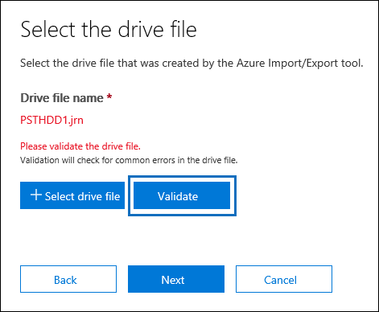
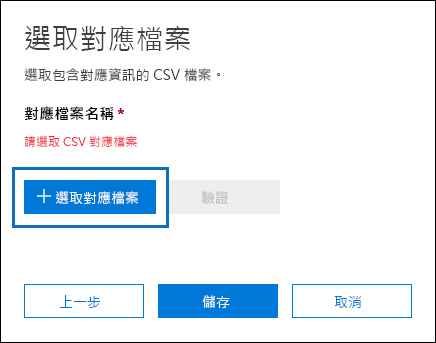
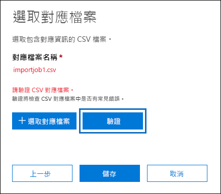
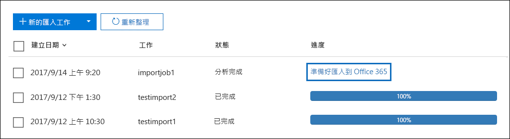
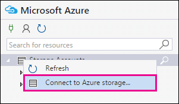

# <a name="use-drive-shipping-to-import-your-organization-pst-files-to-office-365"></a>使用驱动器传送将组织 PST 文件导入 Office 365

**本文是为管理员。您是否正在尝试将 PST 文件导入您自己的邮箱？请参阅[从 Outlook .pst 文件导入电子邮件、联系人和日历](https://go.microsoft.com/fwlink/p/?LinkID=785075)**
   
使用 Office 365 导入服务，将批量导入 PST 文件传送到用户邮箱。 磁碟機運送代表您將 PST 檔案複製到硬碟，並實際運送磁碟機給 Microsoft。 當 Microsoft 收到您的硬碟時，資料中心人員會將資料從硬碟複製到 Microsoft Cloud 中的儲存區域。 然后，您有机会通过设置控制导入的数据的筛选器来修剪实际导入到目标邮箱的 PST 数据。 启动导入作业后，导入服务将 PST 数据从存储区域导入到用户邮箱。 使用驱动器传送将 PST 文件导入用户邮箱是将组织的电子邮件迁移到 Office 365 的一种方式。
  
以下是使用驱动器传送将 PST 文件导入 Office 365 邮箱所需的步骤：
  
[第 1 步：下载安全存储密钥和 PST 导入工具](#step-1-download-the-secure-storage-key-and-pst-import-tool)

[第 2 步：将 PST 文件复制到硬盘](#step-2-copy-the-pst-files-to-the-hard-drive)

[步骤 3：创建 PST 导入映射文件](#step-3-create-the-pst-import-mapping-file)

[步驟 4：在 Office 365 內建立 PST 匯入工作](#step-4-create-a-pst-import-job-in-office-365)

[步驟 5：運送硬碟給 Microsoft](#step-5-ship-the-hard-drive-to-microsoft)

[步骤 6：筛选数据并启动 PST 导入作业](#step-6-filter-data-and-start-the-pst-import-job)
  
> [!IMPORTANT]
> 您必须执行步骤 1 一次，才能卸下安全存储密钥和导入工具。 执行这些步骤后，每次要将硬盘驱动器运送到 Microsoft 时，请按照步骤 2 执行步骤 6。 
  
有关使用驱动器传送将 PST 文件导入 Office 365 的常见问题，请参阅[使用驱动器传送导入 PST 文件的常见问题解答。](faqimporting-pst-files-to-office-365.md#using-drive-shipping-to-import-pst-files) 
  
## <a name="before-you-begin"></a>開始之前

- 您必须在 Exchange 联机中分配邮箱导入导出角色才能将 PST 文件导入 Office 365 邮箱。 默认情况下，此角色不会分配给 Exchange 联机中的任何角色组。 You can add the Mailbox Import Export role to the Organization Management role group. Or you can create a new role group, assign the Mailbox Import Export role, and then add yourself as a member. 有关详细信息，请参阅[管理角色组中](https://go.microsoft.com/fwlink/p/?LinkId=730688)的"将角色添加到角色组"或"创建角色组"部分。
    
    此外，要在安全&合规中心创建导入作业，以下必须为 true：
    
  - 您必须在"联机交换"中分配邮件收件人角色。 By default, this role is assigned to the Organization Management and Recipient Management roles groups.
    
    或
    
  - 您必须是 Office 365 组织的全局管理员。
    
    > [!TIP]
    > 请考虑在 Exchange Online 中创建新的角色组，该角色组专门用于将 PST 文件导入 Office 365。 对于导入 PST 文件所需的最低权限级别，将邮箱导入导入和邮件收件人角色分配给新角色组，然后添加成员。 
  
- 您需要將想要複製到硬碟上的 PST 檔案，儲存於檔案伺服器上，或是貴組織的共用資料夾。 在步骤 2 中，您将运行 Azure 导入导出工具 （WAImportExport.exe），该工具将在此文件服务器或共享文件夹中存储的 PST 文件复制到硬盘驱动器。
    
- 仅支持 2.5 英寸固态驱动器 （SSD） 或 2.5 或 3.5 英寸 SATA II/III 内部硬盘驱动器，以便与 Office 365 导入服务一起使用。 You can use hard drives up to 10 TB. 对于导入作业，将仅处理硬盘上的第一个数据卷。 The data volume must be formatted with NTFS. 将数据复制到硬盘时，可以使用 2.5 英寸 SSD 或 2.5 或 3.5 英寸 SATA II/III 连接器直接连接数据，也可以使用外部 2.5 英寸 SSD 或 2.5 英寸或 3.5 英寸 SATA II/III USB 适配器将其外部连接。
    
    > [!IMPORTANT]
    > Office 365 导入服务不支持内置 USB 适配器附带的外部硬盘驱动器。 Additionally, the disk inside the casing of an external hard drive can't be used. Please don't ship external hard drives. 
  
- 您的 PST 檔案所複製到的硬碟，必須使用 BitLocker 加密。 您在步驟 2 中執行的 WAImportExport.exe 工具，會幫助您設定 BitLocker。 它还生成一个 BitLocker 加密密钥，Microsoft 数据中心人员将使用该密钥访问驱动器，将 PST 文件上载到 Microsoft 云中的 Azure 存储区域。
    
- 驱动器发货可通过微软企业协议 （EA） 获得。 驱动器发货无法通过 Microsoft 产品和服务协议 （MPSA） 获得。
    
- 使用驱动器传送将 PST 文件导入 Office 365 邮箱的成本为每 GB 数据 2 美元。 例如，如果您运送的硬盘包含 1，000 GB （1TB） 的 PST 文件，则费用为 2，000 美元。 You can work with a partner to pay the import fee. 有关查找合作伙伴的信息，请参阅查找[Office 365 合作伙伴或经销商](https://go.microsoft.com/fwlink/p/?LinkId=785197)。
    
- 您或貴組織必須擁有 FedEx 或 DHL 的帳戶。 
    
  - 美国、巴西和欧洲的组织必须拥有联邦快递账户。
    
  - 东亚、东南亚、日本、大韩民国和澳大利亚的组织必须拥有 DHL 帐户。
    
    Microsoft 會使用此帳戶來將硬碟送回給您 (以及計費)。 
    
- 運送給 Microsoft 的硬碟，可能必須跨越國境。在這種情況下，您必須負責確保硬碟機和它所包含的資料，會根據相關的法律匯入和/或匯出。運送硬碟之前，請向您的顧問確認磁碟機及資料可以合法的運送到指定的 Microsoft 資料中心。這是為了確保它及時送達 Microsoft。
    
- 此程序包含複製並儲存安全存放裝置金鑰和 BitLocker 加密金鑰。 請務必採取預防措施來保護這些金鑰，就如同您保護密碼或其他安全性相關的資訊一樣。 舉例來說，您可能會將這些資訊儲存於受密碼保護的 Microsoft Word 文件內，或是將它們儲存於已加密的 USB 磁碟機中。 有关这些键的示例，请参阅[详细信息](#more-information)部分。 
    
- 将 PST 文件导入 Office 365 邮箱后，邮箱的保留保留设置将无限期打开。 这意味着，在关闭保留保留或设置关闭保留的日期之前，不会处理分配给邮箱的保留策略。 我们为什么要这么做？ 如果导入到邮箱的邮件是旧的，则可能会永久删除（清除），因为它们的保留期已根据为邮箱配置的保留设置过期。 将邮箱置于保留保留状态将使邮箱所有者有时间管理这些新导入的邮件，或让您有时间更改邮箱的保留设置。 有关管理保留保留的建议，[请参阅"详细信息"](#more-information)部分。 
    
- 默认情况下，Office 365 邮箱可以接收的最大邮件大小为 35 MB。 这是因为邮箱*的 MaxReceiveSize*属性的默认值设置为 35 MB。 但是，Office 365 中最大邮件接收大小的限制是 150 MB。 因此，如果您导入的 PST 文件包含大于 35 MB 的项目，Office 365 导入服务，我们将自动将目标邮箱上的*MaxReceiveSize*属性的值更改为 150 MB。 这允许将高达 150 MB 的邮件导入到用户邮箱。 
    
    > [!TIP]
    > 要标识邮箱的邮件接收大小，可以在 Exchange 联机 PowerShell 中运行此命令： `Get-Mailbox <user mailbox> | FL MaxReceiveSize`。 
  
- 您可以将 PST 文件导入 Office 365 中的非活动邮箱。 为此，您可以在 PST 导入映射文件中的`Mailbox`参数中指定非活动邮箱的 GUID。 有关详细信息，请参阅[步骤 3：创建 PST 导入映射文件。](#step-3-create-the-pst-import-mapping-file) 
    
- 在 Exchange 混合部署中，您可以将 PST 文件导入到主邮箱位于本地的用户的基于云的存档邮箱。 通过在 PST 导入映射文件中执行以下操作来执行此操作：
    
  - 在`Mailbox`参数中指定用户本地邮箱的电子邮件地址。 
    
  - 在****`IsArchive`参数中指定 TRUE 值。 
    
    有关详细信息，请参阅[步骤 3：创建 PST 导入映射文件。](#step-3-create-the-pst-import-mapping-file) 

## <a name="step-1-download-the-secure-storage-key-and-pst-import-tool"></a>第 1 步：下载安全存储密钥和 PST 导入工具

第一步是下载安全存储密钥和工具，您将在步骤 2 中使用将 PST 文件复制到硬盘驱动器。
  
> [!IMPORTANT]
> 您必须使用 Azure 导入/导出工具版本 1 （WAimportExportV1） 使用驱动器传送方法成功导入 PST 文件。 不支持 Azure 导入/导出工具的版本 2，使用它将导致为导入作业准备硬盘不正确。 请务必按照此步骤中的步骤从安全&合规性中心下载 Azure 导入/导出工具。 
  
1. 转到[https://protection.office.com/](https://protection.office.com/)并使用 Office 365 组织中管理员帐户的凭据登录。 
    
2. 在"安全&合规性中心"的左侧窗格中，**单击"数据治理**\>**导入"。**
    
    > [!NOTE]
    > 如前所述，您必须获得适当的权限才能访问安全&合规性中心**中的"导入"** 页面。 
  
3. 在"**导入"** 页上，添加图标**新建导入作业"。**
    
4. 在导入作业向导中，键入 PST 导入作业的名称，然后单击"**下一步"。** 使用小写字母、数字、连字符和下划线。 不能使用大写字母或在名称中包含空格。
    
5. 在"**选择导入作业类型"** 页上，单击将**硬盘驱动器运送到我们的物理位置之一，** 然后单击"**下一步"。**
    
    
  
6. 在"**导入数据"** 页上，执行以下两项操作： 
    
    
  
    a. 在步骤 2 中，单击**复制安全存储密钥**。 显示存储密钥后，**单击"复制到剪贴板"，** 然后将其粘贴并保存到文件中，以便以后可以访问该文件。
    
    b. 在步骤 3 中，**下载 Azure 导入/导出工具**以下载并安装 Azure 导入/导出（版本 1）工具。
    
    - 在弹出窗口中，\>**单击"保存保存"** 以将 WaImportExportV1.zip 文件保存到本地计算机上的文件夹中。 **** 
    
    - 提取瓦进口导出V1.zip文件。
    
7. **单击"取消"** 以关闭向导。 
    
    在步骤 4 中创建导入作业时，您将回到安全&合规性**中心的"导入"** 页。 

## <a name="step-2-copy-the-pst-files-to-the-hard-drive"></a>第 2 步：将 PST 文件复制到硬盘

下一個步驟是使用 WAImportExport.exe 工具，將 PST 檔案複製到硬碟。 這個工具會使用 BitLocker 加密硬碟、將 PST 複製到硬碟，並建立日誌檔案，儲存複製程序的相關資訊。 若要完成此步驟，PST 檔案必須位於貴組織的檔案共用內或檔案伺服器中。 在下列程序中，這就是所謂的 [來源目錄]。 
  
> [!IMPORTANT]
> 在硬碟首次執行 WAImportExport.exe 工具之後，每次您都必須使用不同的語法。 此过程的步骤 4 中介绍了此语法，用于将 PST 文件复制到硬盘驱动器。 
  
1. 在您的本機電腦上開啟 [命令提示字元]。
    
    > [!TIP]
    > 如果您以系統管理員身分執行命令提示字元 (當您開啟時選取「以系統管理員身分執行」)，在命令提示字元視窗中，將顯示錯誤訊息。這可以協助您進行關於執行 WAImportExport.exe 工具問題的疑難排解。 
  
2. 移至您在步驟 1 中安裝 WAImportExport.exe 工具的目錄。
    
3. 首次執行下列命令，您會使用 WAImportExport.exe 來將 PST 檔案複製到硬碟。

    ```
    WAImportExport.exe PrepImport /j:<Name of journal file> /t:<Drive letter> /id:<Name of session> /srcdir:<Location of PST files> /dstdir:<PST file path> /sk:<Storage account key> /encrypt /logdir:<Log file location>
    ```

    下表說明了參數與其需要的值。
    
    |**參數**|**描述**|**範例**|
    |:-----|:-----|:-----|
    | `/j:` <br/> |指定日誌檔的名稱。 此檔案會儲存到與 WAImportExport.exe 工具所在位置相同的資料夾。 您送交給 Microsoft 的每個硬碟都必須有一個日誌檔案。 每次您執行 WAImportTool.exe，將 PST 檔案複製到硬碟時，資訊都將會附加到該磁碟機的日誌檔。  <br/> Microsoft 数据中心人员将使用日志文件中的信息将硬盘驱动器与您在步骤 4 中创建的导入作业相关联，并将 PST 文件上载到 Microsoft 云中的 Azure 存储区域。  <br/> | `/j:PSTHDD1.jrn` <br/> |
    | `/t:` <br/> |指定當硬碟連接至本機電腦時的磁碟機代號。  <br/> | `/t:h` <br/> |
    | `/id:` <br/> |指定複製工作階段的名稱。工作階段的定義是每次執行 WAImportExport.exe 工具，將檔案複製到硬碟的動作。PST 檔案會複製到資料夾，該資料夾是以此參數所指定的工作階段名稱來命名。   <br/> | `/id:driveship1` <br/> |
    | `/srcdir:` <br/> |指定貴組織內的來源目錄，該目錄包含在工作階段期間要複製的 PST 檔案。 請務必使用雙引號 (" ") 括住此參數的值。  <br/> | `/srcdir:"\\FILESERVER01\PSTs"` <br/> |
    | `/dstdir:` <br/> |指定将上载 PST 的 Microsoft 云中的 Azure 存储区域中的目标目录。 您必须使用 值`ingestiondata/`。 請務必使用雙引號 (" ") 括住此參數的值。  <br/> 您也可以選擇性新增其他檔案路徑至此參數的值。 例如，可以在硬盘驱动器上使用源目录的文件路径（转换为 URL 格式），这是在`/srcdir:`参数中指定的。 例如，`\\FILESERVER01\PSTs`更改为`FILESERVER01/PSTs`。 在这种情况下，您仍必须包含在`ingestiondata`文件路径中。 因此，在此示例中，`/dstdir:`参数的值将是`"ingestiondata/FILESERVER01/PSTs"`。  <br/> 新增其他檔案路徑的原因之一，是您具有相同檔名的 PST 檔案。  <br/> > [!NOTE]> 如果包含可选的路径名，则 PST 文件上载到 Azure 存储区域后的名称空间将包括路径名和 PST 文件的名称;如果包含可选的路径名称，则 PST 文件的名称将包含在 Azure 存储区域中。例如， `FILESERVER01/PSTs/annb.pst`. 如果不包括路径名，则命名空间仅为 PST 文件名;如果不包括路径名，则命名空间将仅为 PST 文件名。例如`annb.pst`.           | `/dstdir:"ingestiondata/"` <br/> 或  <br/>  `/dstdir:"ingestiondata/FILESERVER01/PSTs"` <br/> |
    | `/sk:` <br/> |指定您在步驟 1 中所取得的安全存放裝置帳戶金鑰。 請務必使用雙引號 (" ") 括住此參數的值。  <br/> | `"yaNIIs9Uy5g25Yoak+LlSHfqVBGOeNwjqtBEBGqRMoidq6/e5k/VPkjOXdDIXJHxHvNoNoFH5NcVUJXHwu9ZxQ=="` <br/> |
    | `/encrypt` <br/> |此參數會開啟硬碟的 BitLocker。 首次執行 WAImportExport.exe 工具時需要此參數。  <br/> 使用 参数`/logfile:`时，BitLocker 加密密钥将复制到日志文件和创建的日志文件。 如先前所解釋，檔案會儲存到與 WAImportExport.exe 工具所在位置相同的資料夾。  <br/> | `/encrypt` <br/> |
    | `/logdir:` <br/> |此選擇性參數會指定要儲存記錄檔的資料夾。 如果未指定，記錄檔就會儲存到與 WAImportExport.exe 工具所在位置相同的資料夾。 請務必使用雙引號 (" ") 括住此參數的值。  <br/> | `/logdir:"c:\users\admin\desktop\PstImportLogs"` <br/> |
   
    這是 WAImportExport.exe 工具針對各個參數使用實際值的語法範例︰
    
    ```
    WAImportExport.exe PrepImport /j:PSTHDD1.jrn /t:f /id:driveship1 /srcdir:"\\FILESERVER01\PSTs" /dstdir:"ingestiondata/" /sk:"yaNIIs9Uy5g25Yoak+LlSHfqVBGOeNwjqtBEBGqRMoidq6/e5k/VPkjOXdDIXJHxHvNoNoFH5NcVUJXHwu9ZxQ==" /encrypt /logdir:"c:\users\admin\desktop\PstImportLogs"
    ```

    在您執行命令後，便會顯示 PST 檔案複製到硬碟進度的狀態訊息。最終狀態訊息會顯示已成功複製的檔案總數。 
    
4. 以後每次您執行 WAImportExport.ext 工具，將 PST 檔案複製到相同的硬碟時，都要執行此命令。

    ```
    WAImportExport.exe PrepImport /j:<Name of journal file> /id:<Name of new session> /srcdir:<Location of PST files> /dstdir:<PST file path> 
    ```

    這是以後執行工作階段，將 PST 檔案複製到相同的硬碟時的語法範例。  

    ```
    WAImportExport.exe PrepImport /j:PSTHDD1.jrn /id:driveship2 /srcdir:"\\FILESERVER01\PSTs\SecondBatch" /dstdir:"ingestiondata/"
    ```

## <a name="step-3-create-the-pst-import-mapping-file"></a>步骤 3：创建 PST 导入映射文件

在 Microsoft 数据中心人员将 PST 文件从硬盘驱动器上载到 Azure 存储区域后，导入服务将使用 PST 导入映射文件中的信息，该文件是逗号分隔值 （CSV） 文件，该文件指定哪个用户邮箱 PST文件将导入到 。 當您建立 PST 匯入工作時，您將會在下一個步驟提交 CSV 檔案。
  
1. [下载PST导入映射文件的副本。](https://go.microsoft.com/fwlink/p/?LinkId=544717)
    
2. 開啟或儲存 CSV 檔案到您的本機電腦。下列範例顯示了一個已完成的 PST 匯入對應檔案 (在「記事本」中開啟)。若使用 Microsoft Excel 來編輯 CSV 檔案會較為簡單。

    ```
    Workload,FilePath,Name,Mailbox,IsArchive,TargetRootFolder,ContentCodePage,SPFileContainer,SPManifestContainer,SPSiteUrl
    Exchange,FILESERVER01/PSTs,annb.pst,annb@contoso.onmicrosoft.com,FALSE,/,,,,
    Exchange,FILESERVER01/PSTs,annb_archive.pst,annb@contoso.onmicrosoft.com,TRUE,/ImportedPst,,,,
    Exchange,FILESERVER01/PSTs,donh.pst,donh@contoso.onmicrosoft.com,FALSE,/,,,,
    Exchange,FILESERVER01/PSTs,donh_archive.pst,donh@contoso.onmicrosoft.com,TRUE,/ImportedPst,,,,
    Exchange,FILESERVER01/PSTs,pilarp.pst,pilarp@contoso.onmicrosoft.com,FALSE,/,,,,
    Exchange,FILESERVER01/PSTs,pilarp_archive.pst,pilarp@contoso.onmicrosoft.com,TRUE,/ImportedPst,,,,
    Exchange,,tonyk.pst,tonyk@contoso.onmicrosoft.com,FALSE,/,,,,
    Exchange,,tonyk_archive.pst,tonyk@contoso.onmicrosoft.com,TRUE,,,,,
    Exchange,,zrinkam.pst,zrinkam@contoso.onmicrosoft.com,FALSE,/,,,,
    Exchange,,zrinkam_archive.pst,zrinkam@contoso.onmicrosoft.com,TRUE,,,,,
    ```

    CSV 檔案的第一列或「標題列」會列出參數，PST 匯入服務將使用這些參數來匯入 PST 檔案至使用者信箱。 每個參數名稱都是以逗號分隔。 在標題列下的每一列，代表了要匯入 PST 檔案至特定信箱的參數值。 每個要複製到硬碟的 PST 檔案，都會需要一個資料列。 請務必在對應檔案中，使用您的實際資料來取代預留位置資料。

    > [!NOTE]
    > 不要在標頭列以及 SharePoint 參數中作任何變更，在 PST 匯入過程中會忽略這些項目。 
  
3. 使用下列表格的資訊，將所需的資訊填入 CSV 檔案。
    
    |**參數**|**描述**|**範例**|
    |:-----|:-----|:-----|
    | `Workload` <br/> |指定要将数据导入到的 Office 365 服务。 要将 PST 文件导入用户邮箱，`Exchange`请使用 。  <br/> | `Exchange` <br/> |
    | `FilePath` <br/> | 指定将硬盘驱动器运送到 Microsoft 时将 PST 文件复制到的 Azure 存储区域中的文件夹位置。  <br/>  您在 CSV 文件中在此列中添加的内容取决于您在上一步中为`/dstdir:`参数指定的内容。 如果源位置上有子文件夹，则`FilePath`参数中的值必须包含子文件夹的相对路径;如果源位置上具有子文件夹，则参数中的值必须包含子文件夹的相对路径。例如，/folder1/user1/.  <br/>  如果使用`/dstdir:"ingestiondata/"`，则在 CSV 文件中保留此参数为空。  <br/>  如果为`/dstdir:`参数的值（例如，）提供了可选的路径名（例如，，`/dstdir:"ingestiondata/FILESERVER01/PSTs"`然后在 CSV 文件中对此参数使用该路径名（不包括"引入数据"）。 此参数的值区分大小写。  <br/>  无论采用哪种方式，*在*`FilePath`参数的值中不要包含"引入数据"。 将此参数留空或仅指定可选路径名称。  <br/> > [!IMPORTANT]> 文件路径名称的情况必须与上一步中`/dstdir:`参数中指定的情况相同。 例如，如果您在上一步`"ingestiondata/FILESERVER01/PSTs"`中用于子文件夹名称，但随后在 CSV 文件中`fileserver01/psts`的`FilePath`参数中使用，则 PST 文件的导入将失败。 请确保在这两种情况下使用相同的情况。           |(保留空白)  <br/> 或  <br/>  `FILESERVER01/PSTs` <br/> |
    | `Name` <br/> |指定將匯入至使用者信箱的 PST 檔案名稱。  此参数的值区分大小写。  <br/> > [!IMPORTANT]> CSV 文件中的 PST 文件名大小写必须与步骤 2 中上载到 Azure 存储位置的 PST 文件相同。 例如，如果在 CSV`annb.pst`文件中`Name`的参数中使用 ，但实际 PST 文件的名称为`AnnB.pst`，则该 PST 文件的导入将失败。 确保 CSV 文件中的 PST 名称与实际 PST 文件使用相同大小写。           | `annb.pst` <br/> |
    | `Mailbox` <br/> |指定將匯入 PST 檔案的信箱電子郵件地址。  請注意，您無法指定公用資料夾，因為 PST 匯入服務不支援將 PST 檔案匯入公用資料夾。  <br/> 要将 PST 文件导入非活动邮箱，必须为此参数指定邮箱 GUID。 要获取此 GUID，在 Exchange 联机中运行以下 PowerShell 命令：`Get-Mailbox <identity of inactive mailbox> -InactiveMailboxOnly | FL Guid` <br/> > [!NOTE]> 在某些情况下，您可能有多个具有相同电子邮件地址的邮箱，其中一个邮箱是活动邮箱，另一个邮箱处于软删除（或非活动）状态。 在这些情况下，必须指定邮箱 GUID 以唯一标识要导入 PST 文件的邮箱。 要获取活动邮箱的 GUID，运行以下 PowerShell 命令： `Get-Mailbox <identity of active mailbox> | FL Guid`。 要获取软删除（或非活动）邮箱的 GUID，请运行以下命令： `Get-Mailbox <identity of soft-deleted or inactive mailbox> -SoftDeletedMailbox | FL Guid`。           | `annb@contoso.onmicrosoft.com` <br/> 或  <br/>  `2d7a87fe-d6a2-40cc-8aff-1ebea80d4ae7` <br/> |
    | `IsArchive` <br/> | 指定是否要匯入 PST 檔案至使用者的封存信箱。 其中有兩個選項：  <br/> **假**将 PST 文件导入用户的主邮箱。  <br/> **真实**将 PST 文件导入用户的存档邮箱。 This assumes that the [user's archive mailbox is enabled](enable-archive-mailboxes.md). 如果将其参数设置为 ，`TRUE`并且未启用用户的存档邮箱，则该用户的导入将失败。 请注意，如果一个用户的导入失败（因为他们的存档未启用，并且此属性设置为`TRUE`），则导入作业中的其他用户不会受到影响。  <br/>  If you leave this parameter blank, the PST file is imported to the user's primary mailbox.  <br/> **注意：** 要将 PST 文件导入其主邮箱位于本地的用户的基于云的存档邮箱，只需为此参数指定，`TRUE`并为该`Mailbox`参数指定用户本地邮箱的电子邮件地址。  <br/> | `FALSE` <br/> 或  <br/>  `TRUE` <br/> |
    | `TargetRootFolder` <br/> | 指定将 PST 文件导入到的邮箱文件夹。  <br/>  如果此参数留空，PST 将导入到**名为"导入"** 的新文件夹，该文件夹位于邮箱的根级别（与收件箱文件夹和其他默认邮箱文件夹的级别相同）。  <br/>  如果指定`/`，则 PST 文件中的项目将直接导入用户的收件箱文件夹。  <br/>  如果指定`/<foldername>`，则 PST 文件中的项目将导入到名为*\<文件夹名称\>* 的文件夹。 例如，如果使用`/ImportedPst`，项目将导入**名为"导入Pst"** 的文件夹。 此文件夹将位于用户的邮箱中，与收件箱文件夹处于同一级别。  <br/> |(保留空白)  <br/> 或  <br/>  `/` <br/> 或  <br/>  `/ImportedPst` <br/> |
    | `ContentCodePage` <br/> |此可选参数指定用于导入 ANSI 文件格式的 PST 文件的代码页的数值。 此参数用于从中文、日文和韩文 （CJK） 组织导入 PST 文件，因为这些语言通常使用双字节字符集 （DBCS） 进行字符编码。 如果此参数不用于导入使用 DBCS 用于邮箱文件夹名称的语言的 PST 文件，则文件夹名称在导入后通常会乱码。  <br/> 有关要用于此参数的支持值的列表，请参阅[代码页标识符](https://go.microsoft.com/fwlink/p/?LinkId=328514)。  <br/> > [!NOTE]>如前所述，这是一个可选参数，您不必将其包含在 CSV 文件中。 或者，您可以包括它，并将值留为一行或多行的空白。           |(保留空白)  <br/> 或  <br/>  `932`（这是 ANSI/OEM 日语的代码页标识符）  <br/> |
    | `SPFileContainer` <br/> |針對 PST 匯入，請將此參數保留空白。   <br/> |不適用  <br/> |
    | `SPManifestContainer` <br/> |針對 PST 匯入，請將此參數保留空白。   <br/> |不適用  <br/> |
    | `SPSiteUrl` <br/> |針對 PST 匯入，請將此參數保留空白。   <br/> |不適用  <br/> |

## <a name="step-4-create-a-pst-import-job-in-office-365"></a>步驟 4：在 Office 365 中建立 PST 匯入工作

下一步是在 Office 365 中的导入服务中创建 PST 导入作业。 如先前所解釋，您將會提交在步驟 3 中所建立的 PST 匯入對應檔案。 创建新作业后，导入服务将使用映射文件中的信息在 PST 文件从硬盘驱动器复制到 Azure 存储区域并创建和启动导入作业后将 PST 文件导入到指定的用户邮箱。
  
1. 转到[https://protection.office.com](https://protection.office.com)并使用 Office 365 组织中管理员帐户的凭据登录。 
    
2. 在"安全&合规性中心"的左侧窗格中，**单击"数据治理"，** 然后单击"**导入"。**
    
3. 在"**导入"** 页上，添加图标**新建导入作业"。**
    
    > [!NOTE]
    > 如前所述，您必须获得适当的权限才能访问安全&合规性中心**中的"导入"** 页面。 
  
4. 键入 PST 导入作业的名称，然后单击"**下一步"。** 使用小写字母、数字、连字符和下划线。 不能使用大写字母或在名称中包含空格。
    
5. 在"**选择导入作业类型"** 页上，单击将**硬盘驱动器运送到我们的物理位置之一，** 然后单击"**下一步"。**
    
    
  
6. 在步骤 6 中，**单击"我已准备硬盘并可以访问必要的驱动器日志文件，****我有权访问映射文件**复选框，**然后单击"下一步"。**
    
    
  
7. 在"**选择驱动器文件"** 页上，**单击"选择驱动器文件"，** 然后转到 WAImportExport.exe 工具所在的同一文件夹。 在步驟 2 中所建立的日誌檔案已複製到此資料夾。
    
    
  
8. 选择日志文件;例如， `PSTHDD1.jrn`.
    
    > [!TIP]
    > 在步骤 2 中运行 WAImportExport.exe 工具时，日志文件的名称由 参数`/j:`指定。 
  
9. 驱动器文件的名称**显示在"驱动器文件名"** 下后，**单击"验证"** 以检查驱动器文件是否存在错误。 
    
    
  
    必须成功验证驱动器文件才能创建 PST 导入作业。 请注意，文件名在成功验证后更改为绿色。 如果验证失败，**请单击"查看日志"** 链接。 将打开验证错误报告，并显示一条错误消息，其中包含有关文件失败原因的信息。 
    
    > [!NOTE]
    > 您必须为向 Microsoft 运送的每个硬盘添加和验证日志文件。 
  
10. 为要运送到 Microsoft 的每个硬盘添加并验证日志文件后，单击"**下一步"。**
    
11. 单击"图标**选择映射文件"** 以提交您在步骤 3 中创建的 PST 导入映射文件。 
    
    
  
12. CSV 文件的名称**显示在"映射文件名"** 下后，**单击"验证"** 以检查 CSV 文件是否存在错误。 
    
    
  
    CSV 檔案必須成功通過驗證，才能建立 PST 匯入工作。 请注意，文件名在成功验证后更改为绿色。 如果验证失败，**请单击"查看日志"** 链接。 将打开验证错误报告，其中对失败文件中的每一行都显示一条错误消息。 
    
13. 成功验证 PST 映射文件后，单击"**下一步"。**
    
14. 在"**提供联系信息"** 页上，在适用的框中键入您的联系信息。 
    
    请注意，将显示要将硬盘驱动器运送到的 Microsoft 位置的地址。 此地址基于 Office 365 数据中心位置自动生成。 請將此地址複製到檔案，或取得螢幕擷取畫面。
    
15. 阅读条款和条件文档，单击复选框，**然后单击"保存"** 以提交导入作业。 
    
    成功创建导入作业后，将显示一个状态页，说明驱动器装运过程的后续步骤。
    
16. 在"**导入"** 页上，**刷新"图标"刷新"** 以在导入作业列表中显示新的驱动器装运导入作业。 请注意，状态**设置为"等待跟踪编号"。** 还可以单击导入作业以显示状态弹出窗口页，其中包含有关导入作业的更多详细信息。
 
## <a name="step-5-ship-the-hard-drive-to-microsoft"></a>步驟 5：運送硬碟給 Microsoft

下一步是将硬盘发货到 Microsoft，然后提供货件的跟踪编号，并为驱动器发货作业提供退货信息。 在 Microsoft 收到驱动器后，数据中心人员需要 7 到 10 个工作日才能将 PST 文件上载到组织的 Azure 存储区域。
  
> [!NOTE]
> 如果在创建导入作业后的 14 天内未提供跟踪编号和退货货件信息，则导入作业将过期。 如果发生这种情况，您必须创建新的驱动器运输导入作业（请参阅[步骤 4：在 Office 365 中创建 PST 导入作业），](#step-4-create-a-pst-import-job-in-office-365)然后重新提交驱动器文件和 PST 导入映射文件。 
  
### <a name="ship-the-hard-drive"></a>運送硬碟

當您運送硬碟給 Microsoft 時，請記住下列事項︰
  
- 不要装运 SATA 到 USB 适配器;您只需要运送硬盘。
    
- 請妥善包裝硬碟；例如，使用防靜電包裝袋或氣泡紙包裝。
    
- 使用您所選擇的出貨承運業者運送硬碟給 Microsoft。
    
- 將硬碟運送到您在步驟 4 中，建立匯入工作時所顯示的 Microsoft 地點。 請務必在寄送地址中包含「Office 365 匯入服務」。
    
- 在您運送硬碟後，請務必寫下出貨承運業者的名稱及追蹤號碼。在下一個步驟中您將提供這些資訊。
    
### <a name="enter-the-tracking-number-and-other-shipping-information"></a>輸入追蹤號碼，以及其他的送貨資訊

在您運送硬碟給 Microsoft 之後，請在 [匯入] 服務頁面完成下列程序。
  
1. 转到[https://protection.office.com](https://protection.office.com)并使用 Office 365 组织中管理员帐户的凭据登录。 
    
2. 在左侧窗格中，**单击"数据治理"，** 然后单击"**导入"。**
    
3. 在"**导入"** 页上，单击要为其输入跟踪编号的驱动器货件的作业。 
    
4. 在状态弹出窗口页上，**单击"输入跟踪编号"。**
    
5. 請提供下列的送貨資訊︰
    
1. **交货承运人**键入用于将硬盘驱动器运送到 Microsoft 的交付承运人的名称。 
    
2. **跟踪号码**键入硬盘货件的跟踪编号。 
    
3. **返回承运人帐号****为"返回承运人"** 下列出的承运人键入组织的帐号。 微软将使用（并收取）此帐户，将您的硬盘运回您。 请注意，美国和欧洲的组织必须在联邦快递拥有帐户。 亚洲和世界其他地区的组织必须在 DHL 拥有帐户。
    
6. 按一下 **[儲存]** 以儲存此資訊供匯入工作使用。 
    
    在"**导入"** 页上，**刷新"图标"刷新**以更新驱动器运输导入作业的信息。 請注意，現在狀態設定為 **[磁碟機在運輸中]**。

## <a name="step-6-filter-data-and-start-the-pst-import-job"></a>步骤 6：筛选数据并启动 PST 导入作业

收到 Microsoft 的硬盘后，"**导入"** 页上的导入作业的状态将**更改为"收到的驱动器"。** 数据中心人员将使用日志文件中的信息将 PST 文件上载到组织的 Azure 存储区域。 此時，狀態將變更為 **[匯入進行中]**。 如前所述，在收到您的硬盘后，需要 7 到 10 个工作日才能上传 PST 文件。
  
PST 文件上载到 Azure 后，状态将**更改为"正在进行分析"。** 这表明 Office 365 正在分析 PST 文件中的数据（以安全可靠的方式），以确定项目的年龄以及 PST 文件中包括的不同消息类型。 完成分析并准备导入数据后，导入作业的状态将**更改为"分析已完成"。** 此时，您可以选择导入 PST 文件中包含的所有数据，也可以通过设置控制导入的数据的筛选器来修剪导入的数据。
  
1. 转到[https://protection.office.com](https://protection.office.com)并使用 Office 365 组织中管理员帐户的凭据登录。 
    
2. 在左侧窗格中，**单击"数据治理** > **导入"。**
    
3. 在"**导入"** 页上，单击"**准备导入 Office 365"，** 用于在步骤 4 中创建的导入作业。 
    
    
  
    将显示一个飞出页面，其中包含有关 PST 文件的信息以及有关导入作业的其他信息。
    
4. **单击"导入 Office 365**"。
    
5. 将显示"**筛选数据"** 页。 它包含 Office 365 对 PST 文件执行的分析所产生的数据见解，包括有关数据年龄的信息。 此时，您可以选择筛选将导入的数据或按其方式导入所有数据。 
    
    
  
6. 執行下列其中一項動作：
    
    a. 要修剪导入的数据，请单击"**是"，我想在导入 之前对其进行筛选。**
    
    有关筛选 PST 文件中的数据，然后启动导入作业的详细分步说明，请参阅[将 PST 文件导入 Office 365 时筛选数据。](filter-data-when-importing-pst-files.md)
    
    或
    
    b. 要导入 PST 文件中的所有数据，请单击"**否"，我要导入所有内容，** 然后单击"**下一步"。**
    
7. 如果选择导入所有数据，**请单击"导入数据"** 以启动导入作业。 
    
    导入作业的状态**显示在"导入"** 页上。 单击"**刷新"图标"刷新"** 以更新"**状态"** 列中显示的状态信息。 单击导入作业以显示状态弹出窗口，该页显示有关正在导入的每个 PST 文件的状态信息。 當匯入完成，且已匯入 PST 檔案到使用者信箱時，狀態將變更為 **[已完成]**。

## <a name="view-a-list-of-the-pst-files-uploaded-to-office-365"></a>查看上载到 Office 365 的 PST 文件列表

您可以安装和使用 Microsoft Azure 存储资源管理器（这是一个免费的开源工具）来查看我们（由 Microsoft 数据中心人员）上载到组织的 Azure 存储区域的 PST 文件的列表。 可以执行此操作以验证发送到 Microsoft 的硬盘驱动器中的 PST 文件是否已成功上载到 Azure 存储区域。
  
微软 Azure 存储资源管理器处于预览版。
  
 **重要提示：** 不能使用 Azure 存储资源管理器上载或修改 PST 文件。 将 PST 文件导入 Office 365 的唯一受支持方法是使用 AzCopy。 此外，不能删除已上载到 Azure Blob 的 PST 文件。 如果您嘗試刪除 PST 檔案，您會收到沒有必要權限的相關錯誤。 请注意，所有 PST 文件都将自动从 Azure 存储区域中删除。 如果没有正在进行的导入作业，则 [引入数据 ] 容器中的所有 PST 文件都将在创建最新导入作业 30 天后删除。 
  
要安装 Azure 存储资源管理器并连接到 Azure 存储区域，请执行以下操作：
  
1. 执行以下步骤以获取组织的共享访问签名 （SAS） URL。 此 URL 是组织在 Microsoft 云中的 Azure 存储位置的网络 URL 和 SAS 密钥的组合。 此密钥为您提供了访问组织的 Azure 存储位置所需的权限。
    
1. 转到[https://protection.office.com/](https://protection.office.com/)并使用 Office 365 组织中管理员帐户的凭据登录。 
    
2. 在"安全&合规性中心"的左侧窗格中，**单击"数据治理**\>**导入"。**
    
3. 在"**导入"** 页上，添加图标**新建导入作业"。**
    
4. 在导入作业向导中，键入 PST 导入作业的名称，然后单击"**下一步"。** 使用小写字母、数字、连字符和下划线。 不能使用大写字母或在名称中包含空格。
    
5. 在"**选择导入作业类型"** 页上，**单击"上传数据"，** 然后单击"**下一步"。**
    
6. 在步骤 2 中，单击**显示网络上载 SAS URL**。
    
7. 显示 URL 后，复制它并将其保存到文件中。 請務必複製完整 URL。
    
    > [!IMPORTANT]
    > 请务必采取预防措施来保护 SAS URL。 任何人都可以使用它来访问组织的 Azure 存储区域。 
  
8. **单击"取消"** 以关闭导入作业向导。 
    
2. 下载并安装[微软 Azure 存储资源管理器工具](https://go.microsoft.com/fwlink/p/?LinkId=544842)。
    
3. 启动 Microsoft Azure 存储资源管理器，在左侧窗格中右键**单击"存储帐户"，** 然后单击"**连接到 Azure 存储"。**
    
    
  
4. 单击**使用共享访问签名 （SAS） URI 或连接字符串，** 然后单击"**下一步"。**
    
5. **单击"使用 SAS URI"，** 将您在"URI"下的框中获得的步骤 1 中的**** SAS URL 粘贴到 ，然后单击"**下一步"。**
    
6. 在"**连接摘要"** 页上，您可以查看连接信息，然后单击"**连接"。**
    
    打开**引入数据**容器;它包含从您的硬盘驱动器的PST文件。 **引入数据**容器位于**存储帐户**\> **（SAS 附加服务）** \> **Blob 容器**下。
    
    ![[Azure 儲存體總管] 會顯示您上傳的 PST 檔案清單](media/12376fed-13a5-4a09-8fe6-e819e011b334.png)
  
7. 使用完 Microsoft Azure 存储资源管理器后，右键**单击"引入数据"，****然后单击"分离"** 以断开与 Azure 存储区域的连接。 否則，您會在下一次嘗試附加時收到錯誤。 
    
    ![以滑鼠右鍵按一下 [擷取]，然後按一下 [中斷連結]，以中斷與 Azure 存放區域之間的連線](media/1e8e5e95-4215-4ce4-a13d-ab5f826a0510.png)
  

  
## <a name="troubleshooting-tips"></a>疑難排解提示
<a name="troubleshootingtips"> </a>

- **如果导入作业由于 PST 导入 CSV 映射文件中的错误而失败，会发生什么情况？** 如果导入作业由于映射文件中的错误而失败，则不必将硬盘驱动器重新运送到 Microsoft 以创建新的导入作业。 这是因为您为驱动器运输导入作业提交的硬盘驱动器中的 PST 文件已上载到组织的 Azure 存储区域。 在这种情况下，您只需要修复 PST 导入 CSV 映射文件中的错误，然后创建新的"网络上载"导入作业并提交修订的 CSV 映射文件。 要创建和启动新的网络上载导入作业，请参阅[步骤 5：在 Office 365 中创建 PST 导入作业，在"](use-network-upload-to-import-pst-files.md#step-5-create-a-pst-import-job-in-office-365)使用网络上载将 PST 文件导入 Office 365"主题中[筛选数据并启动 PST 导入作业。](use-network-upload-to-import-pst-files.md#step-6-filter-data-and-start-the-pst-import-job) 
    
    > [!NOTE]
    > 为了帮助您解决 PST 导入 CSV 映射文件的问题，请使用[Azure 存储资源管理器](#view-a-list-of-the-pst-files-uploaded-to-office-365)工具从上载到 Azure 存储区域的硬盘驱动器中查看 PST 文件的**引入数据**容器中的文件夹结构。 映射文件错误通常是由 FilePath 参数中的错误值引起的。 此参数指定 PST 文件在 Azure 存储区域中的位置。 请参阅步骤 3 中表中的 FilePath 参数[的说明。](#step-3-create-the-pst-import-mapping-file) 如前所述，在[步骤 2](#step-2-copy-the-pst-files-to-the-hard-drive)中运行 WAImportExport.exe`/dstdir:`工具时，参数指定了 Azure 存储区域中的 PST 文件的位置。 
  

  
## <a name="more-information"></a>詳細資訊

- 驱动器传送是将大量存档邮件数据导入 Office 365 以利用组织可用的合规性功能的有效方法。 将存档数据导入用户邮箱后，您可以：
    
  - 启用[存档邮箱](enable-archive-mailboxes.md)和[自动扩展存档，](enable-unlimited-archiving.md)为用户提供数据的额外邮箱空间。 
    
  - 将邮箱置于[诉讼保留](https://go.microsoft.com/fwlink/?linkid=856286)状态以保留数据。 
    
  - 使用 Microsoft[电子数据展示工具](search-for-content.md)搜索数据。 
    
  - 应用[Office 365 保留策略](retention-policies.md)来控制数据的保留时间，以及保留期到期后要执行的操作。 
    
  - 在[Office 365 审核日志](search-the-audit-log-in-security-and-compliance.md)中搜索与此数据相关的事件。 
    
  - 将数据导入[非活动邮箱](create-and-manage-inactive-mailboxes.md)以存档数据，以便符合性。 
    
  - 保护组织免受敏感信息的[数据丢失。](data-loss-prevention-policies.md) 
    
- 以下是安全存放裝置帳戶金鑰和 BitLocker 加密金鑰的範例。此範例也會包含您要複製 PST 檔案到硬碟，所執行的 WAImportExport.exe 命令的語法。請務必採取預防措施來保護這些項目，就如同您保護密碼或其他安全性相關的資訊一樣。
    

    ```
    Secure storage account key: 

    yaNIIs9Uy5g25Yoak+LlSHfqVBGOeNwjqtBEBGqRMoidq6/e5k/VPkjOXdDIXJHxHvNoNoFH5NcVUJXHwu9ZxQ==

    BitLocker encryption key:

    397386-221353-718905-535249-156728-127017-683716-083391

  COMMAND SYNTAX

  First time:

  WAImportExport.exe PrepImport /j:<Name of journal file> /t:<Drive letter> /id:<Name of session> /srcdir:<Location of PST files> /dstdir:<PST file path> /sk:<Storage account key> /encrypt /logdir:<Log file location>

  Subsequent times:

  WAImportExport.exe PrepImport /j:<Name of journal file> /id:<Name of new session> /srcdir:<Location of PST files> /dstdir:<PST file path> 

  EXAMPLES

  First time:

  WAImportExport.exe PrepImport /j:PSTHDD1.jrn /t:f /id:driveship1 /srcdir:"\\FILESERVER1\PSTs" /dstdir:"ingestiondata/" /sk:"yaNIIs9Uy5g25Yoak+LlSHfqVBGOeNwjqtBEBGqRMoidq6/e5k/VPkjOXdDIXJHxHvNoNoFH5NcVUJXHwu9ZxQ==" /encrypt /logdir:"c:\users\admin\desktop\PstImportLogs"

  Subsequent times:

  WAImportExport.exe PrepImport /j:PSTHDD1.jrn /id:driveship2 /srcdir:"\\FILESERVER1\PSTs\SecondBatch" /dstdir:"ingestiondata/"
    ```
   
- 如前所述，Office 365 导入服务在 PST 文件导入到邮箱后打开保留保留设置（无限期）。 这意味着*RentionHoldEnabled*属性设置为 ，`True`以便不会处理分配给邮箱的保留策略。 这为邮箱所有者提供了时间，通过阻止删除或存档策略删除或存档较旧的邮件来管理新导入的邮件。 以下是管理此保留保留的一些步骤： 
    
  - 一段时间后，可以通过运行命令`Set-Mailbox -RetentionHoldEnabled $false`关闭保留保留。 有关说明，请参阅[将邮箱置于保留保留状态。](https://go.microsoft.com/fwlink/p/?LinkId=544749)
    
  - 您可以配置保留保留，以便在将来的某个日期将其关闭。 通过运行`Set-Mailbox -EndDateForRetentionHold <date>`命令执行此操作。 例如，假设今天的日期是 2016 年 6 月 1 日，并且您希望保留保留在 30 天内关闭，则运行以下`Set-Mailbox -EndDateForRetentionHold 7/1/2016`命令： 。 在这种情况下，您将将*RentionHoldEnabled*属性设置为*True*。 有关详细信息，请参阅[设置邮箱](https://go.microsoft.com/fwlink/p/?LinkId=150317)。
    
  - 您可以更改分配给邮箱的保留策略的设置，以便不会立即删除导入的旧项目或移动到用户的存档邮箱。 例如，您可以延长分配给邮箱的删除或存档策略的保留期。 在这种情况下，您将在更改保留策略的设置后关闭邮箱的保留保留。 有关详细信息，请参阅为[Office 365 组织中的邮箱设置存档和删除策略。](set-up-an-archive-and-deletion-policy-for-mailboxes.md)
    

  

