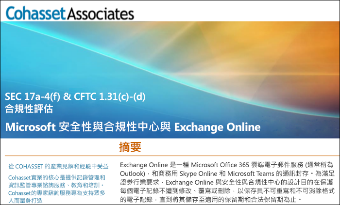

# 使用 Exchange Online 和安全性與合規性中心以符合 SEC Rule 17a-4Use Exchange Online and the Security & Compliance Center to comply with SEC Rule 17a-4

>*[Microsoft 365 安全性與合規性的授權指引](https://aka.ms/ComplianceSD)。**[Microsoft 365 licensing guidance for security & compliance](https://aka.ms/ComplianceSD).*

如果組織需要遵守資料保留的法規標準，安全性與合規性中心可提供多項功能，讓您管理 Exchange Online 中的資料生命週期。其中包括保留、稽核、搜尋和匯出資料的功能。這些功能足以滿足大多數組織的需求。If your organization needs to comply with regulatory standards for retaining your data, the Security & Compliance Center provides features to manage the lifecycle of your data in Exchange Online. This includes the ability to retain, audit, search, and export your data. These capabilities are sufficient to meet the needs of most organizations.

不過，有些組織是受高度管制的產業，且須受更嚴格的法規要求拘束。例如，銀行或證券經紀公司等金融機構須受美國證券交易委員會 (SEC) 頒佈的 Rule 17a-4 拘束。Rule 17a-4 針對電子資料儲存有特定的要求，包括記錄管理的許多層面，例如持續時間、格式、品質、可用性，以及記錄保留的責任歸屬。However, some organizations in highly regulated industries are subject to more stringent regulatory requirements. For example, financial institutions such as banks or broker dealers are subject to Rule 17a-4 issued by the Securities and Exchange Commission (SEC). Rule 17a-4 has specific requirements for electronic data storage, including many aspects of record management, such as the duration, format, quality, availability, and accountability of records retention.

為協助組織更了解如何運用安全性與合規性中心來符合其 Exchange Online 法規義務 (具體而言是與 Rule 17a-4 要求有關)，我們已與 Cohasset Associates 合作發佈評估。To help these organizations better understand how the Security & Compliance Center can be leveraged to meet their regulatory obligations for Exchange Online, specifically in relation to Rule 17a-4 requirements, we have released an assessment in partnership with Cohasset Associates.

Cohasset 已驗證當 Exchange Online 和安全性與合規性中心依建議設定時，則會符合 CFTC Rule 1.31(c)-(d)、FINRA Rule 4511 和 SEC Rule 17a-4 的相關儲存要求。我們將目標鎖定在這組規則，因為它們代表全球最適用於金融機構記錄保留的規定指導方針。Cohasset validated that when Exchange Online and the Security & Compliance Center are configured as recommended, they meet the relevant storage requirements of CFTC Rule 1.31(c)-(d), FINRA Rule 4511, and SEC Rule 17a-4. We targeted this set of rules because they represent the most prescriptive guidance globally for records retention for financial institutions.

## 下載 Cohasset 評估Download the Cohasset assessment

您可以[在這裡下載 Cohasset 評估](https://servicetrust.microsoft.com/ViewPage/TrustDocuments?command=Download&downloadType=Document&downloadId=9fa8349d-a0c9-47d9-93ad-472aa0fa44ec&docTab=6d000410-c9e9-11e7-9a91-892aae8839ad_FAQ_and_White_Papers)。You can [download the Cohasset assessment here](https://servicetrust.microsoft.com/ViewPage/TrustDocuments?command=Download&downloadType=Document&downloadId=9fa8349d-a0c9-47d9-93ad-472aa0fa44ec&docTab=6d000410-c9e9-11e7-9a91-892aae8839ad_FAQ_and_White_Papers).

## 這項評估是針對 Exchange OnlineThis assessment is specific to Exchange Online

請注意，這項評估是針對 Exchange Online。這項評估不包含其他 Microsoft 365 服務 (例如 SharePoint Online 或商務用 OneDrive)，儘管我們正在規劃未來在這些服務中提供 SEC 17a-4 的相關支援。Note that this assessment is specific to Exchange Online. The assessment does not include other Microsoft 365 services such as SharePoint Online or OneDrive for Business, although we are planning support for those services with respect to SEC 17a-4 in the future.

請務必了解商務用 Skype 和 Teams 也會將資料儲存在 Exchange Online 中。因此，這項評估確實會包含來自商務用 Skype 的訊息，以及來自 Teams 的頻道和聊天訊息。It's important to understand that Skype for Business and Teams also store data in Exchange Online. Therefore, the assessment does cover messages from Skype for Business and channel and chat messages from Teams.

## 使用保留鎖定是建議設定的關鍵Using Preservation Lock is key to the recommended configuration

受高度管制的產業通常必須儲存電子通訊內容，以符合 WORM (單寫多讀) 要求。在 WORM 要求指定的儲存解決方案中，記錄必須：Highly regulated industries are often required to store electronic communications to meet the WORM (write once, read many) requirement. The WORM requirement dictates a storage solution in which a record must be:

- 保留一段要求的保留期間，該期間無法縮短，只能增加。Retained for a required retention period that cannot be shortened, only increased.
- 固定，也就是說，在要求的保留期間內，記錄無法覆寫、清除或變更。Immutable, meaning that the record cannot be overwritten, erased, or altered during the required retention period.

在 Exchange Online 中，將[保留原則](retention.md)套用到使用者的信箱時，該使用者的所有內容都會根據原則的準則保留。事實上，如果使用者嘗試刪除或修改電子郵件，會將進行變更前的電子郵件複本保存在使用者信箱中的安全、隱藏的位置。保留原則可確保組織保留電子通訊內容，但可以修改這些原則。In Exchange Online, when a [retention policy](retention.md) is applied to a user's mailbox, all the user's content will be retained based on the criteria of the policy. In fact, if a user attempts to delete or modify an email, a copy of the email before the change is made will be preserved in a secure, hidden location in the user's mailbox. Retention policies can help ensure that an organization retains electronic communications, but those policies can be modified.

組織可以透過在保留原則上設定保留鎖定的方式，確保無法修改原則。事實上，保留鎖定套用到保留原則之後，下列動作會受到限制：By placing a Preservation Lock on a retention policy, an organization ensures that the policy cannot be modified. In fact, after a Preservation Lock is applied to a retention policy, the following actions are restricted:

- 原則的保留期間只能增加，無法縮短。The retention period of the policy can only be increased, not shortened.
- 可將使用者新增到原則中，但無法移除任何使用者。Users can be added to the policy, but no user can be removed.
- 系統管理員無法刪除保留原則。The retention policy cannot be deleted by an administrator.

保留鎖定可協助您符合 SEC 17a-4 法規要求。Preservation Lock can help you meet the SEC 17a-4 regulatory requirements.

## 如何設定保留鎖定How to set up Preservation Lock

您可以使用 PowerShell 鎖定保留原則。You can lock a retention policy by using PowerShell. 如需詳細資訊，請參閱[使用保留鎖定以符合法規需求](retention.md#use-preservation-lock-to-comply-with-regulatory-requirements)。For more information, see [Use Preservation Lock to comply with regulatory requirements](retention.md#use-preservation-lock-to-comply-with-regulatory-requirements).

