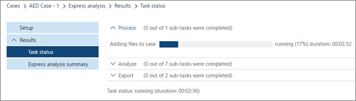
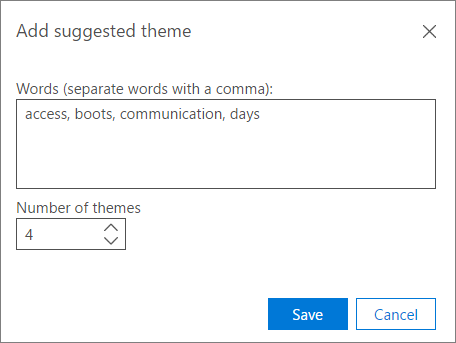

# 在高級 eDiscovery (傳統) 中使用快速分析Use Express Analysis in Advanced eDiscovery (classic) 

> [!NOTE]
> 進階電子文件探索需要具有進階合規性附加元件的 Office 365 E3，或適用於您組織的 E5 訂閱。如果您沒有該方案，且想要嘗試進階電子文件探索，您可以[註冊 Office 365 企業版 E5 試用版](https://go.microsoft.com/fwlink/p/?LinkID=698279)。Advanced eDiscovery requires an Office 365 E3 with the Advanced Compliance add-on or an E5 subscription for your organization. If you don't have that plan and want to try Advanced eDiscovery, you can [sign up for a trial of Office 365 Enterprise E5](https://go.microsoft.com/fwlink/p/?LinkID=698279). 
  
您可以使用 **快速分析** 來快速分析案例，並匯出結果。You can use **Express analysis** to quickly analyze a case and export the results. 
  
您可以使用快速分析來計算接近重複專案和電子郵件執行緒，以及計算主題。You can use express analysis to calculate near-duplicates and email threads and calculate themes. 您也可以在 [快速分析] 的 [ [高級設定](use-express-analysis-in-advanced-ediscovery.md#BK_AdvancedSettings)] 中，設定主題、檔相似性和匯出檔案的特定參數。You can also set certain parameters for themes, document similarity and the export files in the [Advanced settings for Express analysis](use-express-analysis-in-advanced-ediscovery.md#BK_AdvancedSettings).
  
## 執行快速分析Run Express analysis

1. 在 [ **Express analysis** (1) ] 索引標籤中，選取要啟用 \* \* Express analysis \* \* (2) 及 [ **高級設定** ] 按鈕的容器。In the **Express analysis** (1) tab, select a container to enable the \*\* Express analysis \*\* (2), and **Advanced settings** buttons. 
    
    
  
2. 在 [ **分析參數**] 底下：Under **Analyze parameters**:
    
  - 如果您想要執行分析，請選取 [ **計算近乎重複的和電子郵件執行緒** ]。Check **Calculate near-duplicates and email threads** if you want to run the analysis. 此為預設選取的選項。It is selected by default. 
    
  - 檢查 [ **計算主題** ] 以處理所有檔案，並將主題指派給這些檔案。Check **Calculate Themes** to process all files and assign themes to them. 此為預設選取的選項。It is selected by default. 
    
3. 在 [ **匯出目的地**：] 下：Under **Export destination**:
    
  - 選取 [ **下載到本機** 電腦] 以下載到本機電腦。Check **Download to local machine** to download to your local computer. 
    
  - 如果您檢查 **匯出至使用者定義的 Azure blob** ，您也可以指定容器 URL 和 SAS 權杖。If you check **Export to user-defined Azure blob** then you can also specify a container URL and SAS token. 
    
    > [!NOTE]
    > 匯出套件儲存至使用者定義的 Azure blob 之後，就不會再透過「高級 eDiscovery」管理該資料。Once an export package is stored to the user defined Azure blob, the data is no longer managed by Advanced eDiscovery. 它是由 Azure blob 所管理。it is managed by the Azure blob. 這表示如果您刪除此案例，匯出的檔案仍會保留在 Azure blob 上。This means if you delete the case, the exported files will still remain on the Azure blob. 
  
  - **儲存 sas token 以供未來匯出會話**：如果檢查，則會在高級 eDiscovery 的內部資料庫中加密 sas 權杖，以供日後使用。**Save SAS token for future export session**: If checked, the SAS token will be encrypted in the Advanced eDiscovery's internal database for future use.
    
    > [!NOTE]
    > 目前的 SAS 權杖會在每月後到期。Currently the SAS token expires after a month. 如果您嘗試在數個月後下載，您必須撤銷上一個會話，然後再匯出一次。If you try to download after more than a month you have to undo last session, then export again. 
  
4. 若要以預設設定啟動 express 分析，請選擇 [ **快速分析**]，[ **任務狀態** ] 頁面會顯示To start the express analysis with default settings, choose **Express analysis**, and the **Task status** page will display 
    
    在 [**任務狀態**] 頁面上，您可以展開 [程式 **]、[\*\*\*\*分析**] 及 [**匯出**] 索引標籤，以顯示快速執行的詳細資料On the **Task status** page you can expand the **Process**, **Analyze** and **Export** tabs to display details about the express run. 
    
    
  
5. 選擇 [ **快速分析摘要** ] 頁面，列出有關執行的詳細資訊。Choose the **Express analysis summary** page to list detailed information about the run. 
    
    在 [ **Express 分析摘要** ] 頁面的底部，選擇 [ **下載上一個會話** ]，以在您的本機電腦上下載分析檔 tp。On the bottom of the **Express analysis summary** page, choose **Download last session** to download the analysis files tp your local computer. 您必須先下載 eDiscovery 匯出工具，並將匯出機碼貼到 eDiscovery 匯出工具。You will first have to download eDiscovery Export tool and paste the Export key to the eDiscovery Export tool. 
    
## 快速分析的高級設定Advanced settings for Express analysis

您可以選擇性地設定 [ **高級設定** ]，以變更預設的 Express 分析參數。You can optionally set **Advanced settings** to change the default Express analysis parameters. 
  
1. 在 [ **分析** ] 區段中：In the **Analyze** section: 
    
  - 在 **接近的重複和電子郵件執行緒** 中，輸入 **檔相似性** 值，或接受預設值65%。In the **Near duplicates and email threads**, enter the **Document similarity** value, or accept the default of 65%. 
    
  - 在 [ **主題數目上限** ] 中輸入或選取要建立的主題數目值。In the **Max number of themes** enter or select a value for the number of themes to create. 預設值為 200。The default is 200. 
    
    > [!NOTE]
    > 增加主題數目會影響效能，以及將主題的功能歸納為一般化。Increasing the number of themes affects performance, as well as the ability of a theme to generalize. 主題的數量越高，其程度就越細微。The higher the number of themes, the more granular they are. 例如，如果一組50主題包含 "籃球，Spurs，Clippers，Lakers" 等主題，則300主題可以包含不同的主題： "Spurs"、"Clippers"、"Lakers"。For example, if a set of 50 themes include a theme such as "Basketball, Spurs, Clippers, Lakers"; 300 themes may include separate themes: "Spurs", "Clippers", "Lakers". 如果您不知道主題「籃球」，並將此功能用於 ECA，請參閱主題「籃球」會非常有用。If you had no awareness of the theme "Basketball" and use this feature for ECA, seeing the theme "Basketball" could be useful. 不過，如果處理過程中有太多主題，您可能永遠看不到「籃球」一詞，也可能不知道 Spurs 及 Clippers 是好的籃球主題可供審閱，而不是在開始時和用於頭髮的專案。But, if the processing had too many themes, you may never see the word "Basketball" and may not know that Spurs and Clippers are good Basketball themes to review, rather than items that go on boots and used for hair. 
  
  - 在 **建議的主題** 中，選擇 [ **修改** ] 以建議主題文字，以控制主題處理。In the **Suggested themes** choose **Modify** to suggest theme words to control Themes processing. 「高級 eDiscovery」會將重點放在這些建議的文字上，並根據「主題最大數目」設定，嘗試建立一個或多個相關主題。Advanced eDiscovery will focus on these suggested words and try to create one or more relevant themes, based on the "Max number of themes" settings. 
    
    例如，如果建議的字為 "computer"，而您指定 "2" 做為「主題的最大數目」，則高級 eDiscovery 會嘗試產生與「電腦」有關的兩個主題。For example, if the suggested word is "computer", and you specified "2" as the "Max number of Themes", Advanced eDiscovery will try to generate two themes that relate to the word "computer". 例如，這兩個主題可能是 "電腦軟體" 和 "電腦硬體"。The two themes might be "computer software" and "computer hardware", for example.
    
    
  
  - **模式** 從下拉式清單中，選取 [ **主題** ] 選項：**Mode** From the drop-down list, select a **Themes** option: 
    
  - **建立及套用模型**：從一段檔的模型計算主題，然後在這些檔案之間散佈檔。**Create and apply model**: Calculates themes by models from a segment of the files and then distributes files among them.
    
  - **建立模型**：計算來自一段檔的主題模型。**Create model**: Calculates a themes model from a segment of the files. [套用分割檔] 的處理常式會個別于另一次完成。The Apply process of dividing files is done separately at another time.
    
  - 套用 **模型**：只有在先前建立的模型和尚未套用的模型時，才會顯示此選項。**Apply model**: This option is only shown if a model was created previously and not yet applied. 這會根據主題來分割檔案。This will divide the files based on the themes.
    
2. 在 [ **匯出** ] 區段中：In the **Export** section: 
    
1. 在 [ **選取匯出批次**：In the **Select export batch**:
    
  - 從 [ **匯出批次** ] 清單中，選取批次名稱或匯出結果以匯出批次01， (預設批次) 。From the **Export batch** list, select the batch name or export results to Export batch 01, (the default batch). 
    
  - 若要匯出您新增至現有案例的新檔案的結果，請繼續使用目前的批次。To export results for new files that you added to an existing case, continue with your current batch. 若要在批次中建立會話，請選取相同的批次號碼，然後按一下 [ **建立匯出會話** ] 您可以使用此選項，以增量方式匯出與上一個批次相同的參數。To create a session in the batch, select the same batch number and click **Create export session** You can use this option to export the same parameters as the previous batch, in an incremental manner. 
    
  - 若要匯出至新的批次，請按一下 [ **新增** ![ 加入圖示]， ](../media/c2dd8b3a-5a22-412c-a7fa-143f5b2b5612.png) 然後在 [ **批次名稱** ] 中輸入新的名稱 (或接受) [ **批次描述**] 中的描述。To export to a new batch, click **Add**  and enter a new name in **Batch name** (or accept the default) and a description in **Batch description**. 按一下 [確定]。Click **OK**.
    
  - 若要編輯批次名稱或描述，請選取 [ **匯出批次**] 中的名稱，然後按一下 [ **編輯** ![ 編輯圖示] ](../media/3d613660-7602-4df2-bdb9-14e9ca2f9cf2.png) ，然後修改欄位。To edit a batch name or description, select the name in **Export batch**, click **Edit** , and then modify the fields.
    
    > [!NOTE]
    > 在您執行匯出批次的會話後，便無法將其刪除。After you've run sessions for an export batch, they cannot be deleted. 此外，在執行第一個會話後，只可編輯部分參數。In addition, only some parameters can be edited once the first session is run. 
  
  - 若要建立重複的匯出批次，請選擇 [ **重複匯出批次** ![ 建立重複的匯出批次圖示]， ](../media/3f6d5f59-e842-4946-a493-473528af0119.jpg) 然後在 [面板] 中輸入重複批次的名稱和描述。To create a duplicate export batch, choose **Duplicate export batch**  and enter a name and a description for the duplicate batch in the panel. 
    
  - 若要刪除匯出批次，請選擇 [ **刪除**] [ ![ 刪除匯出批次圖示] ](../media/92a9f8e0-d469-48da-addb-69365e7ffb6f.jpg) 。To delete an export batch, choose **Delete** .
    
  - 若要查看批次的記錄，請選擇 [ **批次記錄**]  。To view the history of a batch, choose **Batch history** .
    
2. 在 [定義 p **opulation：** ] 底下，選取 [ **僅包含相關性切出分數** 和/或 **調整輸出批次** 以上的檔案] （如果您要微調匯出批次的設定）。Under Define p **opulation:** Select **Include only files above Relevance cut-off score** and/or **Refine export batch** if you want to fine-tune the settings for your export batch. 如果您選取 [只包含相關的檔案] [ **只包含相關** 的檔案]，則會啟用該 **問題** ，而且如果檔案的相關性分數高於所選取問題的切削分數，就會匯出檔案。If you select **Include only files above Relevance cut-off score**, then the **Issue** is enabled, and if the file's relevance score is higher than the cut-off score for the selected issue, then the file is exported. 除非 [ **供審閱** 篩選] 排除該檔案，否則會將其匯出。The file will be exported unless it's excluded by the ' **For review** filter. 如果您選取 [ **調整匯出批次**]，則會啟用 [ **取消重復資料** 刪除] 和 [ **依審核篩選] 欄位** 選項按鈕。If you select **Refine export batch**, then the **De-dupe** and **Filter by 'For review' field** radio buttons are enabled. 如果您選擇 [ **重復資料** 刪除]，則會根據定義的原則，將重複的檔案篩選掉： [Case level (default) ：從整個案例中的每一組重複檔案，除了一個檔案，都將會解除 duped。If you choose **De-dupe**, then duplicates files will be filtered-out according to the policy defined: [Case level (default): from every set of duplicate files in the entire case, all but one file will be de-duped. 保管人層級：從相同保管人中的每一組重複檔案，除了一個檔案之外，還會解除 duped。Custodian level: from every set of duplicate files of the same custodian, all but one file will be de-duped. 匯出輸出中提供所有重複檔案的記錄。A record of all duplicate files is available in export output. 如果您選擇 [ **依審閱篩選** ] 欄位，請選取 [ **中繼資料** ] 底下的 [修改]，以輸入您的「做 **為審閱**」欄位設定。If you choose **Filter by 'For review'** field, select **Modify under Metadata** to enter your **'For review'** field settings. 選取 [ **包含輸入檔**]，以在套件內容中包含來源檔案。Select **Include input files** to include source files in the package content. 您可以清除此選項，以加速匯出程式。You can clear this option to speed up the export process. 請注意，在任何情況下都會匯出原生檔案。Note that the Native files will be exported in any case.
    
3. 在 [ **定義中繼資料**] 底下，從 [ **匯出範本** ] 清單中的下列選項中選取 [ (每個會話) 一次。Under **Define metadata**, select from the following options in the **Export template** list (once per session). 
    
  - **Standard**：一組基本的資料項目目、中繼資料和屬性。**Standard**: Basic set of data items, metadata, and properties. 當匯入資料已在高級 eDiscovery 中處理，並將匯出資料上傳至已包含檔案的系統時，請使用此選項。Use this option when import data was already processed in Advanced eDiscovery and export data is uploaded to a system that already contains the files. [匯出範本] 欄預設會建立並填滿。By default, export template columns are created and filled.
    
  - **All**：完整的標準元資料集（包括所有的處理資料），以及分析與相關性分數。**All**: Full set of standard metadata including all processing data, as well as Analyze and Relevance scores. 當 Advanced eDiscovery 執行第一次上傳至外部系統的處理及檔資料時，此範本是必要的。This template is required when Advanced eDiscovery performs the processing and file data is uploaded to an external system for the first time.
    
  - **問題**：請選取 **所有問題** ，或選取您建立的特定問題。**Issues**: Select **All Issues** or select a particular issue you have created. 
    
選擇 **[確定]** 以儲存高級設定、 **還原預設** 值以使用預設值，或按一下 [ **取消** ] 取消設定高級設定。Choose **OK** to save the advanced settings, **Restore defaults** to use default values, or **Cancel** to cancel setting the advanced settings. 
  
## 另請參閱See also

[Office 365 進階電子文件探索 (傳統版)Advanced eDiscovery (classic)](office-365-advanced-ediscovery.md)

