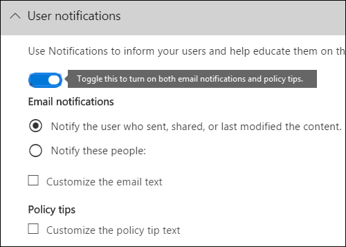
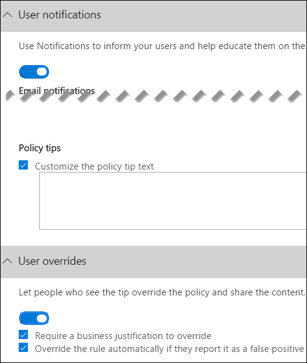
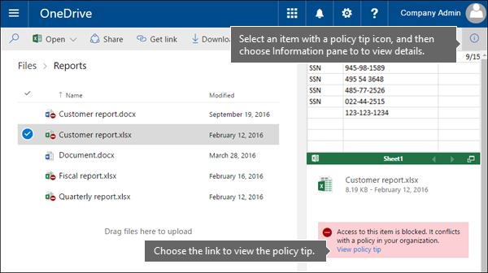
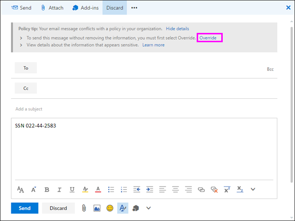

# 針對 DLP 原則傳送電子郵件通知並顯示原則提示Send email notifications and show policy tips for DLP policies

您可以使用資料遺失防護（DLP）原則，識別、監視和保護 Office 365 中的機密資訊。You can use a data loss prevention (DLP) policy to identify, monitor, and protect sensitive information across Office 365. 您想要使用此機密資訊的組織中的人員保持與 DLP 原則的相容性，但是您不想要將它們封鎖，而不需要讓他們完成工作。You want people in your organization who work with this sensitive information to stay compliant with your DLP policies, but you don't want to block them unnecessarily from getting their work done. 這是電子郵件通知和原則提示可助您做的地方。This is where email notifications and policy tips can help.
  

  
原則提示是指當有人使用與 DLP 原則衝突的內容時所顯示的通知或警告，例如，Excel 活頁簿位於包含個人身分識別資訊（PII）且與外部使用者共用的 OneDrive 商務網站上的內容。A policy tip is a notification or warning that appears when someone is working with content that conflicts with a DLP policy—for example, content like an Excel workbook on a OneDrive for Business site that contains personally identifiable information (PII) and is shared with an external user.
  
您可以使用電子郵件通知和原則提示來增加知名度，協助教育組織的原則。You can use email notifications and policy tips to increase awareness and help educate people about your organization's policies. 您也可以讓使用者選擇覆寫原則，以便在有有效的業務需求或原則偵測到誤報時，不會封鎖這些原則。You can also give people the option to override the policy, so that they're not blocked if they have a valid business need or if the policy is detecting a false positive.
  
在安全性&amp;與合規性中心中，當您建立 DLP 原則時，您可以將使用者通知設定為：In the Security &amp; Compliance Center, when you create a DLP policy, you can configure the user notifications to:
  
- 傳送電子郵件通知給您選擇的描述問題的人員。Send an email notification to the people you choose that describes the issue.
    
- 顯示與 DLP 原則衝突之內容的原則提示：Display a policy tip for content that conflicts with the DLP policy:
    
  - 針對 Outlook 網頁版和 Outlook 2013 和更新版本中的電子郵件，原則提示會出現在撰寫郵件的收件者上方的郵件上方。For email in Outlook on the web and Outlook 2013 and later, the policy tip appears at the top of a message above the recipients while the message is being composed.
    
  - 對於商務用 OneDrive 的商務帳戶或 SharePoint 線上網站，原則提示會以顯示在專案上的警告圖示表示。For documents in a OneDrive for Business account or SharePoint Online site, the policy tip is indicated by a warning icon that appears on the item. 若要查看詳細資訊，您可以選取專案，然後選擇**Information**  [資訊資訊窗格] 圖示，以開啟 [詳細資料] 窗格。To view more information, you can select an item and then choose **Information**  in the upper-right corner of the page to open the details pane. 
    
  - 針對儲存在 OneDrive for Business site or SharePoint Online 網站（包含在 DLP 原則中）的 Excel、PowerPoint 和 Word 檔，原則提示會出現在訊息列和 Backstage**視圖（[** 檔案] 功能表\> **資訊**）。For Excel, PowerPoint, and Word documents that are stored on a OneDrive for Business site or SharePoint Online site that's included in the DLP policy, the policy tip appears on the Message Bar and the Backstage view ( **File** menu \> **Info**).
    
## 將使用者通知新增至 DLP 原則Add user notifications to a DLP policy

當您建立 DLP 原則時，您可以啟用**使用者通知**。When you create a DLP policy, you can enable **User notifications**. 啟用使用者通知時，Microsoft 365 會同時傳送電子郵件通知和原則提示。When user notifications are enabled, Microsoft 365 sends out both email notifications and policy tips. 您可以自訂傳送通知電子郵件的寄件者、電子郵件文字和原則提示文字。You can customize who notification emails are sent to, the email text and the policy tip text.
  
1. 請移至 [https://protection.office.com](https://protection.office.com)。Go to [https://protection.office.com](https://protection.office.com).
    
2. 使用您的公司或學校帳戶登入。Sign in using your work or school account. 現在您已在安全性&amp;與合規性中心。You're now in the Security &amp; Compliance Center.
    
3. 在 [安全性&amp;與合規\>性中心\> ] 左側導覽**資料遺失防護** \> **原則** \>中，**建立原則**。In the Security &amp; Compliance Center \> left navigation \> **Data loss prevention** \> **Policy** \> **+ Create a policy**.
    
    
  
4. 選擇 DLP 原則範本，以保護您\> **下一步**所需的敏感資訊類型。Choose the DLP policy template that protects the types of sensitive information that you need \> **Next**.
    
    若要從空白範本開始，請**選擇** \> **Custom policy** \> **[下一步]**。To start with an empty template, choose **Custom** \> **Custom policy** \> **Next**.
    
5. 將原則\>命名為 **[下一步]**。Name the policy \> **Next**.
    
6. 若要選擇您想要 DLP 原則保護的位置，請執行下列其中一項操作：To choose the locations that you want the DLP policy to protect, do one of the following:
    
   - 在\> **[下一步]\*\*\*\*中選擇 Office 365 的所有位置**。Choose **All locations in Office 365** \> **Next**.
    
   - 選擇 [**讓我選擇特定位置** \> **] [下一步]**。Choose **Let me choose specific locations** \> **Next**.
    
   若要包含或排除整個位置（例如所有 Exchange 電子郵件或所有 OneDrive 帳戶），請切換該位置的**狀態**。To include or exclude an entire location such as all Exchange email or all OneDrive accounts, switch the **Status** of that location on or off. 
    
   若只要包含特定的 SharePoint 網站或 OneDrive 帳戶，請將**狀態**切換為 [開啟]，然後按一下 [**包含**] 底下的連結，選擇特定的網站或帳戶。To include only specific SharePoint sites or OneDrive accounts, switch the **Status** to on, and then click the links under **Include** to choose specific sites or accounts. 
    
7. 選擇 [**使用高級設定** \> **] [下一步]**。Choose **Use advanced settings** \> **Next**.
    
8. 選擇 [ **+ 新規則**]。Choose **+ New rule**.
    
9. 在規則編輯器的 [**使用者通知**] 下，切換狀態 [開啟]。In the rule editor, under **User notifications**, switch the status on.
    
    

> [!NOTE]
> DLP 原則適用于符合原則的所有檔，不論這些檔是新的或現有的。DLP policies apply to all documents that match the policy, whether those documents are new or existing. 不過，只有當新內容符合現有的 DLP 原則時，才會產生電子郵件通知。However, an email notification is only generated when new content matches an existing DLP policy. 現有內容受到保護，但不會透過電子郵件產生使用者通知。Existing content is protected, but will not generate a user notification via email.
  
## 設定電子郵件通知的選項Options for configuring email notifications

針對 DLP 原則中的每個規則，您可以：For each rule in a DLP policy, you can:
  
- 將通知傳送給您所選擇的人員。Send the notification to the people you choose. 這些人員可以包含內容的擁有者、上次修改內容的人員、內容儲存所在網站的擁有者，或特定使用者。These people can include the owner of the content, the person who last modified the content, the owner of the site where the content is stored, or a specific user.
    
- 使用 HTML 或標記自訂通知中所包含的文字。Customize the text that's included in the notification by using HTML or tokens. 詳細資訊請參閱下一小節。See the section below for more information.
    
> [!NOTE]
>  電子郵件通知只能傳送給個別收件者，而不能傳送至群組或通訊群組清單。Email notifications can be sent only to individual recipients—not groups or distribution lists. 只有新的內容會觸發電子郵件通知。Only new content will trigger an email notification. 編輯現有內容將會觸發原則秘訣，但不會觸發電子郵件通知。Editing existing content will trigger policy tips, but not an email notification. 
  

  
### 預設電子郵件通知Default email notification

通知有一個以所採取動作為開頭的主旨行，例如「通知」、「郵件封鎖」（表示電子郵件），或是檔的「拒絕存取」。Notifications have a Subject line that begins with the action taken, such as "Notification", "Message Blocked" for email, or "Access Blocked" for documents. 如果通知與檔有關，通知訊息內文會包含連結，讓您前往儲存檔的網站，並開啟檔的原則提示，您可以在其中解決任何問題（請參閱下列有關原則提示的章節）。If the notification is about a document, the notification message body includes a link that takes you to the site where the document's stored and opens the policy tip for the document, where you can resolve any issues (see the section below about policy tips). 如果通知是關於郵件的通知，則通知會將符合 DLP 原則的郵件包含為附件。If the notification is about a message, the notification includes as an attachment the message that matches a DLP policy.
  

  
根據預設，通知會顯示網站上專案類似下列的文字。By default, notifications display text similar to the following for an item on a site. 通知文字會個別針對每個規則進行設定，因此顯示的文字會隨相符的規則而有所不同。The notification text is configured separately for each rule, so the text that's displayed differs depending on which rule is matched.

|**如果 DLP 原則規則執行此動作 .。。****If the DLP policy rule does this…**|**否則，SharePoint 或 OneDrive 商務檔的預設通知即會指出 .。。****Then the default notification for SharePoint or OneDrive for Business documents says this…**|**否則，Outlook 郵件的預設通知就會指出 .。。****Then the default notification for Outlook messages says this…**|
|:-----|:-----|:-----|
|傳送通知但不允許覆寫Sends a notification but doesn't allow override    |此專案與您組織中的原則相衝突。This item conflicts with a policy in your organization.    |您的電子郵件與您組織中的原則相衝突。Your email message conflicts with a policy in your organization.    |
|封鎖存取、傳送通知及允許覆寫Blocks access, sends a notification, and allows override    |此專案與您組織中的原則相衝突。This item conflicts with a policy in your organization. 如果您未解決此衝突，則可能會封鎖對此檔案的存取。If you don't resolve this conflict, access to this file might be blocked.    |您的電子郵件與您組織中的原則相衝突。Your email message conflicts with a policy in your organization. 郵件未傳遞給所有收件者。The message wasn't delivered to all recipients.    |
|封鎖存取及傳送通知Blocks access and sends a notification    |此專案與您組織中的原則相衝突。This item conflicts with a policy in your organization. 除了其擁有者、最後一個修改者及主要網站集合管理員之外，還會封鎖所有使用者對此專案的存取。Access to this item is blocked for everyone except its owner, last modifier, and the primary site collection administrator.    |您的電子郵件與您組織中的原則相衝突。Your email message conflicts with a policy in your organization. 郵件未傳遞給所有收件者。The message wasn't delivered to all recipients.    |
   
### 自訂電子郵件通知Custom email notification

您可以建立自訂的電子郵件通知，而不是傳送預設的電子郵件通知給您的使用者或系統管理員。You can create a custom email notification instead of sending the default email notification to your end users or admins. 自訂電子郵件通知支援 HTML，且具有5000個字元的限制。The custom email notification supports HTML and has a 5,000-character limit. 您可以使用 HTML，在通知中包含影像、格式及其他商標。You can use HTML to include images, formatting, and other branding in the notification.
  
您也可以使用下列標記，協助自訂電子郵件通知。You can also use the following tokens to help customize the email notification. 這些標記是以傳送之通知中的特定資訊所取代的變數。These tokens are variables that are replaced by specific information in the notification that's sent.

|**令 牌****Token**|**描述****Description**|
|:-----|:-----|
|%%AppliedActions%%%%AppliedActions%%    |套用至內容的動作。The actions applied to the content.    |
|%%ContentURL%%%%ContentURL%%    |SharePoint Online 網站上的檔或商務用 OneDrive 的網站 URL。The URL of the document on the SharePoint Online site or OneDrive for Business site.    |
|%%MatchedConditions%%%%MatchedConditions%%    |內容所符合的條件。The conditions that were matched by the content. 使用此權杖，向人員告知內容可能的問題。Use this token to inform people of possible issues with the content.    |
   

  
## 設定原則提示的選項Options for configuring policy tips

針對 DLP 原則中的每個規則，您可以將原則提示設定為：For each rule in a DLP policy, you can configure policy tips to:
  
- 只要通知人員該內容與 DLP 原則衝突，就可以採取動作來解決衝突。Simply notify the person that the content conflicts with a DLP policy, so that they can take action to resolve the conflict. 您可以使用預設文字（請參閱下表）或輸入有關組織特定原則的自訂文字。You can use the default text (see the tables below) or enter custom text about your organization's specific policies.
    
- 允許人員覆寫 DLP 原則。Allow the person to override the DLP policy. 您也可以：Optionally, you can:
    
  - 要求人員輸入用於覆寫原則的業務理由。Require the person to enter a business justification for overriding the policy. 這項資訊會記錄下來，您可以在安全性&amp;與合規性中心的 [**報告**] 區段中的 [DLP 報告] 中查看。This information is logged and you can view it in the DLP reports in the **Reports** section of the Security &amp; Compliance Center. 
    
  - 允許人員報告誤報，並覆寫 DLP 原則。Allow the person to report a false positive and override the DLP policy. 此資訊也會記錄報告，所以您可以使用誤報來微調您的規則。This information is also logged for reporting, so that you can use false positives to fine tune your rules.
    

  
例如，您可以針對偵測個人身分識別資訊（PII）的商務網站套用一個 DLP 原則 OneDrive，而這個原則有三個規則：For example, you may have a DLP policy applied to OneDrive for Business sites that detects personally identifiable information (PII), and this policy has three rules:
  
1. 第一個規則：如果在檔中偵測到此敏感資訊的實例少於五個，且該檔與組織內的人員共用，則 [**傳送通知**] 動作會顯示原則提示。First rule: If fewer than five instances of this sensitive information are detected in a document, and the document is shared with people inside the organization, the **Send a notification** action displays a policy tip. 針對原則提示，不需要覆寫選項，因為此規則只是通知人員，而不會封鎖存取。For policy tips, no override options are necessary because this rule is simply notifying people and not blocking access. 
    
2. 第二個規則：如果在檔中偵測到此機密資訊有五個以上的實例，且該檔與組織內的人員共用，則 [**封鎖存取內容**] 動作會限制檔案的許可權，而 [**傳送通知**] 動作可讓使用者透過提供業務理由，以覆寫此規則中的動作。Second rule: If greater than five instances of this sensitive information are detected in a document, and the document is shared with people inside the organization, the **Block access to content** action restricts the permissions for the file, and the **Send a notification** action allows people to override the actions in this rule by providing a business justification. 貴組織的業務有時候會要求內部人員共用 PII 資料，而您不想讓 DLP 原則封鎖這種工作。Your organization's business sometimes requires internal people to share PII data, and you don't want your DLP policy to block this work. 
    
3. 第三個規則：如果在檔中偵測到此機密資訊有五個以上的實例，且該檔與組織外部的人員共用，則 [**封鎖存取內容**] 動作會限制檔案的許可權，而 [**傳送通知**] 動作不允許使用者覆寫此規則中的動作，因為該資訊是從外部共用。Third rule: If greater than five instances of this sensitive information are detected in a document, and the document is shared with people outside the organization, the **Block access to content** action restricts the permissions for the file, and the **Send a notification** action does not allow people to override the actions in this rule because the information is shared externally. 在任何情況下，您組織中的人員都不應該允許在組織外共用 PII 資料。Under no circumstances should people in your organization be allowed to share PII data outside the organization. 
    
以下是瞭解如何使用原則提示來覆寫規則的一些細微點：Here are some fine points to understand about using a policy tip to override a rule:
  
- 覆寫的選項是依據規則，它會覆寫規則中的所有動作（傳送通知，但不能覆寫）。The option to override is per rule, and it overrides all of the actions in the rule (except sending a notification, which can't be overridden).
    
- 您可以將內容與 DLP 原則中的數個規則相符，但是只會顯示來自最具限制性的最高優先順序規則的原則提示。It's possible for content to match several rules in a DLP policy, but only the policy tip from the most restrictive, highest-priority rule will be shown. 例如，會封鎖內容存取權的規則與僅傳送通知的規則，只會顯示前者的原則提示。For example, a policy tip from a rule that blocks access to content will be shown over a policy tip from a rule that simply sends a notification. 這樣可避免使用者看到重疊顯示的原則提示。This prevents people from seeing a cascade of policy tips.
    
- 如果最嚴格規則中的原則提示允許人員覆寫規則，則覆寫此規則也將會覆寫內容符合的任何其他規則。If the policy tips in the most restrictive rule allow people to override the rule, then overriding this rule also overrides any other rules that the content matched.
    
## 商務網站 OneDrive 和 SharePoint Online 網站的原則提示Policy tips on OneDrive for Business sites and SharePoint Online sites

當商務用 OneDrive 或 SharePoint Online 網站上的檔符合 DLP 原則中的規則，且該規則使用原則提示時，原則提示會在檔上顯示特殊的圖示：When a document on a OneDrive for Business site or SharePoint Online site matches a rule in a DLP policy, and that rule uses policy tips, the policy tips display special icons on the document:
  
1. 如果規則傳送有關檔案的通知，就會顯示警告圖示。If the rule sends a notification about the file, the warning icon appears.
    
2. 如果規則封鎖對檔的存取，便會顯示封鎖的圖示。If the rule blocks access to the document, the blocked icon appears.
    
   
  
若要對檔採取動作，您可以選取\>專案在頁面的右上角選擇 [**資訊** ![資訊] 窗格圖示](../media/50b6d51b-92b4-4c5f-bb4b-4ca2d4aa3d04.png) ，以開啟 [詳細資料] 窗格\>的 [詳細資料] 窗格的 [**顯示原則提示**]。To take action on a document, you can select an item \> choose **Information**  in the upper-right corner of the page to open the details pane \> **View policy tip**.
  
原則提示會列出內容的問題，而且如果使用這些選項設定原則提示，您可以選擇 [**解決**]，然後覆**寫**原則提示或**報告**誤報。The policy tip lists the issues with the content, and if the policy tips are configured with these options, you can choose **Resolve**, and then **Override** the policy tip or **Report** a false positive. 
  

  

  
DLP 原則同步處理至網站，而且會定期及非同步評估 contented，因此您建立 DLP 原則的時間與開始查看原則提示的時間之間可能會有短暫的延遲。DLP policies are synced to sites and contented is evaluated against them periodically and asynchronously, so there may be a short delay between the time you create the DLP policy and the time you begin to see policy tips. 當您解決或覆寫網站上的檔圖示時，可能會有類似的延遲。There may be a similar delay from when you resolve or override a policy tip to when the icon on the document on the site goes away.
  
### 網站上原則提示的預設文字Default text for policy tips on sites

原則提示預設會針對網站上的專案，顯示類似下列的文字。By default, policy tips display text similar to the following for an item on a site. 通知文字會個別針對每個規則進行設定，因此顯示的文字會隨相符的規則而有所不同。The notification text is configured separately for each rule, so the text that's displayed differs depending on which rule is matched.

|**如果 DLP 原則規則執行此動作 .。。****If the DLP policy rule does this…**|**預設原則提示會說 .。。****Then the default policy tip says this…**|
|:-----|:-----|
|傳送通知但不允許覆寫Sends a notification but doesn't allow override    |此專案與您組織中的原則相衝突。This item conflicts with a policy in your organization.    |
|封鎖存取、傳送通知及允許覆寫Blocks access, sends a notification, and allows override    |此專案與您組織中的原則相衝突。This item conflicts with a policy in your organization. 如果您未解決此衝突，則可能會封鎖對此檔案的存取。If you don't resolve this conflict, access to this file might be blocked.    |
|封鎖存取及傳送通知Blocks access and sends a notification    |此專案與您組織中的原則相衝突。This item conflicts with a policy in your organization. 除了其擁有者、最後一個修改者及主要網站集合管理員之外，還會封鎖所有使用者對此專案的存取。Access to this item is blocked for everyone except its owner, last modifier, and the primary site collection administrator.    |
   
### 網站上的原則提示的自訂文字Custom text for policy tips on sites

您可以從電子郵件通知中單獨自訂原則提示的文字。You can customize the text for policy tips separately from the email notification. 與電子郵件通知的自訂文字（請參閱上一節）不同的是原則提示的自訂文字不接受 HTML 或標記。Unlike custom text for email notifications (see above section), custom text for policy tips does not accept HTML or tokens. 相反地，[原則提示] 的自訂文字只會以256個字元的限制顯示純文字。Instead, custom text for policy tips is plain text only with a 256-character limit.
  
## Outlook 網頁版和 Outlook 2013 和更新版本中的原則提示Policy tips in Outlook on the web and Outlook 2013 and later

當您在 web 和 Outlook 2013 和更新版本的 Outlook 中撰寫新的電子郵件時，如果您在 DLP 原則中新增符合規則的內容，則會看到原則提示，而且該規則會使用原則提示。When you compose a new email in Outlook on the web and Outlook 2013 and later, you'll see a policy tip if you add content that matches a rule in a DLP policy, and that rule uses policy tips. 原則提示會出現在郵件上方，收件者的上方，郵件會撰寫中。The policy tip appears at the top of the message, above the recipients, while the message is being composed.
  

  
原則提示會在郵件內文、主旨行或郵件附件中顯示機密資訊，如下所示。Policy tips work whether the sensitive information appears in the message body, subject line, or even a message attachment as shown here.
  

  
若原則提示設定為允許**覆寫，** \>您可以選擇 [**顯示詳細資料** \> ]。請輸入業務理由或報告誤報\> **。**If the policy tips are configured to allow override, you can choose **Show Details** \> **Override** \> enter a business justification or report a false positive \> **Override**.
  

  
![[原則提示] 對話方塊，您可以在其中覆寫原則提示](../media/f97e836c-04bd-44b4-aec6-ed9526ea31f8.png)
  
請注意，當您將敏感資訊新增至電子郵件時，新增敏感資訊和顯示原則提示之間可能會有延遲。Note that when you add sensitive information to an email, there may be latency between when the sensitive information is added and when the policy tip appears.

### Outlook 2013 和更新版本支援只顯示某些條件的原則提示Outlook 2013 and later supports showing policy tips for only some conditions

目前，Outlook 2013 和更新版本支援只顯示這些狀況的原則提示：Currently, Outlook 2013 and later supports showing policy tips only for these conditions:

- 內容包含Content contains
- 內容已共用Content is shared

請注意，所有這些條件都是在 Outlook 中運作，其將會符合內容，並強制執行內容的保護動作。Note that all of these conditions work in Outlook, where they will match content and enforce protective actions on content. 但尚未支援使用者顯示原則提示。But showing policy tips to users is not yet supported.
  
### Exchange 系統管理中心與安全性&amp;與合規性中心的原則提示Policy tips in the Exchange admin center vs. the Security &amp; Compliance Center

原則秘訣可以搭配在 Exchange 系統管理中心中建立的 DLP 原則和郵件流程規則，或是在安全性&amp;與合規性中心建立的 dlp 原則使用，但不能同時使用這兩者。Policy tips can work either with DLP policies and mail flow rules created in the Exchange admin center, or with DLP policies created in the Security &amp; Compliance Center, but not both. 這是因為這些原則儲存在不同的位置，但是原則秘訣只能從單一位置進行繪製。This is because these policies are stored in different locations, but policy tips can draw only from a single location.
  
如果您已在 Exchange 系統管理中心中設定原則提示，在 [安全性&amp;與合規性中心] 中所設定的任何原則提示，都不會顯示在網頁和 outlook 2013 和更新版本中 outlook 的使用者，直到您關閉 Exchange 系統管理中心中的秘訣。If you've configured policy tips in the Exchange admin center, any policy tips that you configure in the Security &amp; Compliance Center won't appear to users in Outlook on the web and Outlook 2013 and later until you turn off the tips in the Exchange admin center. 這可確保您目前的 Exchange 郵件流程規則（也稱為傳輸規則）可以繼續運作，直到您選擇切換到 [安全性&amp;與合規性中心] 為止。This ensures that your current Exchange mail flow rules (also known as transport rules) will continue to work until you choose to switch over to the Security &amp; Compliance Center.
  
請注意，當原則提示只能從單一位置繪製時，系統會永遠傳送電子郵件通知，即使您同時在安全性&amp;與合規性中心和 Exchange 系統管理中心中使用 DLP 原則也是一樣。Note that while policy tips can draw only from a single location, email notifications are always sent, even if you're using DLP policies in both the Security &amp; Compliance Center and the Exchange admin center.
  
### 電子郵件中原則提示的預設文字Default text for policy tips in email

原則提示預設會針對電子郵件顯示類似下列的文字。By default, policy tips display text similar to the following for email.

|**如果 DLP 原則規則執行此動作 .。。****If the DLP policy rule does this…**|**預設原則提示會說 .。。****Then the default policy tip says this…**|
|:-----|:-----|
|傳送通知但不允許覆寫Sends a notification but doesn't allow override    |您的電子郵件與您組織中的原則相衝突。Your email conflicts with a policy in your organization.    |
|封鎖存取、傳送通知及允許覆寫Blocks access, sends a notification, and allows override    |您的電子郵件與您組織中的原則相衝突。Your email conflicts with a policy in your organization.    |
|封鎖存取及傳送通知Blocks access and sends a notification    |您的電子郵件與您組織中的原則相衝突。Your email conflicts with a policy in your organization.    |
   
## Excel、PowerPoint 及 Word 中的原則提示Policy tips in Excel, PowerPoint, and Word

當人員使用 Excel 的桌上出版本中的機密內容，PowerPoint 和 Word 時，原則秘訣可以即時通知內容與 DLP 原則衝突。When people work with sensitive content in the desktop versions of Excel, PowerPoint, and Word, policy tips can notify them in real time that the content conflicts with a DLP policy. 這需要：This requires that:
  
- Office 檔儲存在商務網站的 OneDrive 或 SharePoint 線上網站上。The Office document is stored on a OneDrive for Business site or SharePoint Online site.
    
- 此網站包含在設定為使用原則提示的 DLP 原則中。The site is included in a DLP policy that's configured to use policy tips.
    
Office 桌面程式會直接從 Office 365 自動同步處理 DLP 原則，然後掃描檔，以確保它們不會與您的 DLP 原則和即時顯示原則提示產生衝突。Office desktop programs automatically sync DLP policies directly from Office 365, and then scan your documents to ensure that they don't conflict with your DLP policies and display policy tips in real time.
  
根據您設定 DLP 原則中原則提示的方式，使用者可以選擇乾脆忽略原則提示、覆寫具有或沒有業務理由的原則，或報告誤報。Depending on how you configure the policy tips in the DLP policy, people can choose to simply ignore the policy tip, override the policy with or without a business justification, or report a false positive.
  
原則提示會出現在訊息欄上。Policy tips appear on the Message Bar.
  

  
原則提示也會出現在 Backstage 檢視中 **（在 [檔案] 索引**標籤上）。And policy tips also appear in the Backstage view (on the **File** tab). 
  

  
如果已使用這些選項設定 DLP 原則中的原則提示，您可以選擇 [**解決**]，以覆**寫**原則提示或**報告**誤報。If policy tips in the DLP policy are configured with these options, you can choose **Resolve** to **Override** a policy tip or **Report** a false positive. 
  

  
在每個 Office 桌面程式中，使用者都可以選擇關閉原則提示。In each of these Office desktop programs, people can choose to turn off policy tips. 關閉時，簡單通知的原則提示不會出現在訊息列或 Backstage 檢視（[檔案] 索引卷**標上）** 。If turned off, policy tips that are simple notifications will not appear on the Message Bar or Backstage view (on the **File** tab). 不過，有關封鎖和覆寫的原則秘訣仍會出現，而且他們仍會收到電子郵件通知。However, policy tips about blocking and overriding will still appear, and they will still receive the email notification. 此外，關閉原則提示不會從套用的任何 DLP 原則中免除檔。In addition, turning off policy tips does not exempt the document from any DLP policies that have been applied to it. 
  
### Excel 2016、PowerPoint 2016 及 Word 2016 中原則提示的預設文字Default text for policy tips in Excel 2016, PowerPoint 2016, and Word 2016

原則提示預設會在已開啟檔的郵件列和 Backstage 檢視上顯示類似下列的文字。By default, policy tips display text similar to the following on the Message Bar and Backstage view of an open document. 通知文字會個別針對每個規則進行設定，因此顯示的文字會隨相符的規則而有所不同。The notification text is configured separately for each rule, so the text that's displayed differs depending on which rule is matched.

|**如果 DLP 原則規則執行此動作 .。。****If the DLP policy rule does this…**|**預設原則提示會說 .。。****Then the default policy tip says this…**|
|:-----|:-----|
|傳送通知但不允許覆寫Sends a notification but doesn't allow override    |此檔案與您組織中的原則相衝突。This file conflicts with a policy in your organization. 移**至 [檔案**] 功能表以取得詳細資訊。Go to the **File** menu for more information.    |
|封鎖存取、傳送通知及允許覆寫Blocks access, sends a notification, and allows override    |此檔案與您組織中的原則相衝突。This file conflicts with a policy in your organization. 如果您未解決此衝突，則可能會封鎖對此檔案的存取。If you don't resolve this conflict, access to this file might be blocked. 移**至 [檔案**] 功能表以取得詳細資訊。Go to the **File** menu for more information.    |
|封鎖存取及傳送通知Blocks access and sends a notification    |此檔案與您組織中的原則相衝突。This file conflicts with a policy in your organization. 如果您未解決此衝突，則可能會封鎖對此檔案的存取。If you don't resolve this conflict, access to this file might be blocked. 移**至 [檔案**] 功能表以取得詳細資訊。Go to the **File** menu for more information.    |
   
### Excel、PowerPoint 及 Word 中的原則提示的自訂文字Custom text for policy tips in Excel, PowerPoint, and Word

您可以從電子郵件通知中單獨自訂原則提示的文字。You can customize the text for policy tips separately from the email notification. 與電子郵件通知的自訂文字（請參閱上一節）不同的是原則提示的自訂文字不接受 HTML 或標記。Unlike custom text for email notifications (see above section), custom text for policy tips does not accept HTML or tokens. 相反地，[原則提示] 的自訂文字只會以256個字元的限制顯示純文字。Instead, custom text for policy tips is plain text only with a 256-character limit.
  
## 詳細資訊More information

- [資料外洩防護原則概觀Overview of data loss prevention policies](data-loss-prevention-policies.md)
    
- [從範本建立 DLP 原則Create a DLP policy from a template](create-a-dlp-policy-from-a-template.md)
    
- [建立 DLP 原則來保護具有 FCI 或其他屬性的文件Create a DLP policy to protect documents with FCI or other properties](protect-documents-that-have-fci-or-other-properties.md)
    
- [DLP 原則範本包含哪些內容What the DLP policy templates include](what-the-dlp-policy-templates-include.md)
    
- [敏感性資訊類型在找什麼What the sensitive information types look for](what-the-sensitive-information-types-look-for.md)
