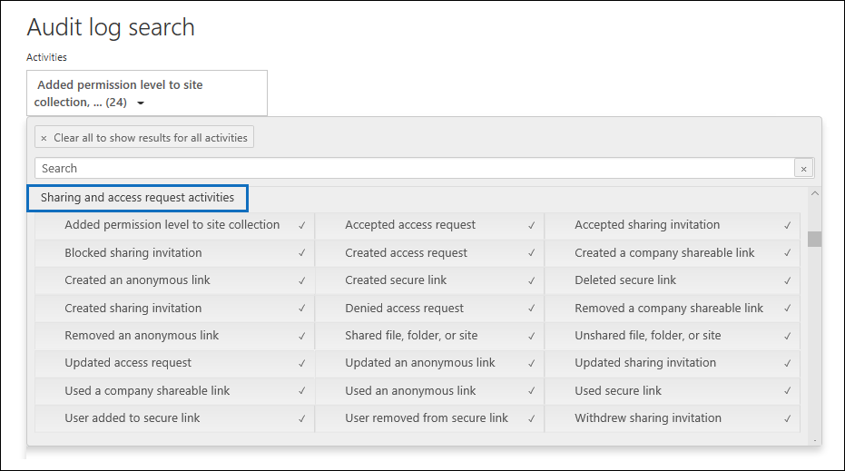

# 稽核共用來找出與外部使用者共用的資源Use sharing auditing in the Office 365 audit log

共享是 SharePoint 在线和 OneDrive 业务中的一项关键活动，在 Office 365 组织中广泛使用。Sharing is a key activity in SharePoint Online and OneDrive for Business, and it's widely used in Office 365 organizations. 管理员可以在 Office 365 审核日志中使用共享审核来确定在其组织中如何使用共享。Administrators can use sharing auditing in the Office 365 audit log to determine how sharing is used in their organization. 
  
## 共享点共享架构The SharePoint Sharing schema

共享事件（不包括与共享策略和共享链接相关的事件）以一种主要方式与文件和文件夹相关事件不同：一个用户正在执行对另一个用户有影响的操作。Sharing events (not including events related to sharing policy and sharing links) are different from file- and folder-related events in one primary way: one user is performing an action that has an effect on another user. 例如，当资源用户 A 授予用户 B 对文件的访问权限时。For example, when a resource User A gives User B access to a file. 在此示例中，用户 A 是*代理用户，* 用户 B 是*目标用户。*In this example, User A is the  *acting user*  and User B is the  *target user*. 在 SharePoint 文件架构中，代理用户的操作仅影响文件本身。In the SharePoint File schema, the acting user's action only affects the file itself. 当用户 A 打开文件时，"**文件访问"** 事件中所需的唯一信息是代理用户。When User A opens a file, the only information needed in the **FileAccessed** event is the acting user. 为了解决这种差异，有一个单独的架构，称为*SharePoint 共享架构，* 用于捕获有关共享事件的详细信息。To address this difference, there is a separate schema, called the  *SharePoint Sharing schema*, that captures more information about sharing events. 这可确保管理员能够了解共享资源的人员以及共享资源的用户。This ensures that administrators have visibility into who shared a resource and the user the resource was shared with. 
  
共享架构在审核记录中提供了与共享事件相关的两个附加字段：The Sharing schema provides two additional fields in an audit record related to sharing events: 
  
- **目标用户或组类型：** 标识目标用户或组是成员、来宾、SharePoint 组、安全组还是合作伙伴。**TargetUserOrGroupType:** Identifies whether the target user or group is a Member, Guest, SharePointGroup, SecurityGroup, or Partner.

- **目标用户或组名称：** 存储与资源共享的资源的目标用户或组（上例中的用户 B）的 UPN 或名称。**TargetUserOrGroupName:** Stores the UPN or name of the target user or group that a resource was shared with (User B in the previous example). 

除了 Office 365 审核日志架构（如"用户、操作"和"日期"）中的其他属性外，这两个字段还可以讲述*有关哪些*用户与*谁*共享*哪些*资源以及*何时*共享资源的完整故事。These two fields, in addition to other properties from the Office 365 audit log schema such as User, Operation, and Date can tell the full story about  *which*  user shared  *what*  resource with  *whom*  and  *when*. 
  
还有另一个架构属性对共享故事很重要。There's another schema property that's important to the sharing story. 导出审核日志搜索结果时，导出的 CSV 文件中的**AuditData**列会存储有关共享事件的信息。When you export audit log search results, the **AuditData** column in the exported CSV file stores information about sharing events. 例如，当用户与另一个用户共享网站时，这是通过将目标用户添加到 SharePoint 组来实现的。For example, when a user shares a site with another user, this is accomplished by adding the target user to a SharePoint group. "**审核数据"** 列捕获此信息，为管理员提供上下文。The **AuditData** column captures this information to provide context for administrators. 有关如何分析**AuditData**列中的信息的说明，请参阅[步骤 2。](#step-2-use-the-powerquery-editor-to-format-the-exported-audit-log)See [Step 2](#step-2-use-the-powerquery-editor-to-format-the-exported-audit-log) for instructions on how to parse the information in the **AuditData** column.

## 共享点共享事件SharePoint sharing events

共享由用户（*代理*用户）希望与其他用户（*目标*用户）共享资源时定义。Sharing is defined by when a user (the *acting* user) wants to share a resource with another user (the *target* user). 与与外部用户共享资源相关的审核记录（组织外部且在组织的 Azure 活动目录中没有来宾帐户的用户）由以下事件标识，这些事件记录在 Office 365 中审核日志：Audit records related to sharing a resource with an external user (a user who is outside of your organization and doesn't have a guest account in your organization's Azure Active Directory) are identified by the following events, which are logged in the Office 365 audit log:

- **共享邀请已创建：** 组织中的用户尝试与外部用户共享资源（可能是站点）。**SharingInvitationCreated:** A user in your organization tried to share a resource (likely a site) with an external user. 这将导致向目标用户发送外部共享邀请。This results in an external sharing invitation sent to the target user. 此时不授予对资源的访问权限。No access to the resource is granted at this point.

- **共享邀请接受：** 外部用户已接受代理用户发送的共享邀请，现在有权访问该资源。**SharingInvitationAccepted:** The external user has accepted the sharing invitation sent by the acting user and now has access to the resource.

- **匿名链接已创建：** 为资源创建匿名链接（也称为"任何人"链接）。**AnonymousLinkCreated:** An anonymous link (also called an "Anyone" link) is created for a resource. 由于可以创建匿名链接，然后复制匿名链接，因此可以合理地假定具有匿名链接的任何文档都已与目标用户共享。Because an anonymous link can be created and then copied, it's reasonable to assume that any document that has an anonymous link has been shared with a target user.

- **匿名链接已使用：** 顾名思义，当使用匿名链接访问资源时，将记录此事件。**AnonymousLinkUsed:** As the name implies, this event is logged when an anonymous link is used to access a resource. 

- **已创建安全链接：** 用户已创建"特定人员链接"，以便与特定人员共享资源。**SecureLinkCreated:** A user has created a "specific people link" to share a resource with a specific person. 此目标用户可能是组织外部的人员。This target user may be someone who is external to your organization. 与资源共享的人员**在"添加到安全链接"** 事件的审核记录中标识。The person that the resource is shared with is identified in the audit record for the **AddedToSecureLink** event. 这两个事件的时间戳几乎相同。The time stamps for these two events are nearly identical.

- **添加到安全链接：** 用户已添加到特定人员链接。**AddedToSecureLink:** A user was added to a specific people link. 在此事件中**使用"目标用户或组名"** 字段来标识添加到相应特定人员链接的用户。Use the **TargetUserOrGroupName** field in this event to identify the user added to the corresponding specific people link. 此目标用户可能是组织外部的人员。This target user may be someone who is external to your organization.

## 共享审核工作流Sharing auditing work flow
  
当用户（代理用户）希望与其他用户（目标用户）共享资源时，SharePoint（或企业 OneDrive）首先检查目标用户的电子邮件地址是否已与组织目录中的用户帐户关联。When a user (the acting user) wants to share a resource with another user (the target user), SharePoint (or OneDrive for Business) first checks if the email address of the target user is already associated with a user account in the organization's directory. 如果目标用户位于目录中（并且具有相应的来宾用户帐户），则 SharePoint 执行以下操作：If the target user is in the directory (and has a corresponding guest user account), SharePoint does the following things:
  
-  通过将目标用户添加到相应的 SharePoint 组，立即分配目标用户访问资源的权限，并**记录"添加到组"** 事件。Immediately assigns the target user permissions to access the resource by adding the target user to the appropriate SharePoint group, and logs an **AddedToGroup** event. 
    
- 向目标用户的电子邮件地址发送共享通知。Sends a sharing notification to the email address of the target user.
    
- 记录**共享集**事件。Logs a **SharingSet** event. 此事件在审核日志搜索工具的活动选取器**中的"共享**文件、文件夹或站点"下具有"共享文件、文件夹或站点"的友好名称。This event has a friendly name of "Shared file, folder, or site" under **Sharing and access request activities** in the activities picker of the audit log search tool. 请参阅[步骤 1](#step-1-search-for-sharing-events-and-export-the-results-to-a-csv-file)中的屏幕截图。See the screenshot in [Step 1](#step-1-search-for-sharing-events-and-export-the-results-to-a-csv-file). 
    
如果目标用户的用户帐户不在目录中，SharePoint 将执行以下操作：If a user account for the target user isn't in the directory, SharePoint does the following: 
    
   - 根据资源的共享方式记录以下事件之一：Logs one of the following events, based on how the resource is shared:
   
      - **匿名链接已创建****AnonymousLinkCreated**
   
      - **已创建安全链接****SecureLinkCreated**
   
      - **添加到安全链接****AddedToSecureLink** 

      - **共享邀请已创建**（仅当共享资源是站点时，才会记录此事件）**SharingInvitationCreated** (this event is logged only when the shared resource is a site)
    
   - 当目标用户接受发送给他们的共享邀请时（通过单击邀请中的链接），SharePoint 会记录**共享邀请接受**事件，并分配目标用户访问资源的权限。When the target user accepts the sharing invitation that's sent to them (by clicking the link in the invitation), SharePoint logs a **SharingInvitationAccepted** event and assigns the target user permissions to access the resource. 如果向目标用户发送匿名链接，则在目标用户使用该链接访问资源后，将记录**匿名链接事件。**If the target user is sent an anonymous link, the **AnonymousLinkUsed** event is logged after the target user uses the link to access the resource. 对于安全链接，当外部用户使用链接访问资源时，将记录**FileAccess 事件。**For secure links, a **FileAccessed** event is logged when an external user uses the link to access the resource.

还会记录有关目标用户的其他信息，例如邀请对象的用户的身份和接受邀请的用户的身份。Additional information about the target user is also logged, such as the identity of the user the invitation is to and the user who accepts the invitation. 在某些情况下，这些用户（或电子邮件地址）可能不同。In some case, these users (or email addresses) can be different. 

## 如何识别与外部用户共享的资源How to identify resources shared with external users

管理员的一个常见要求是创建与组织外部用户共享的所有资源的列表。A common requirement for administrators is creating a list of all resources that have been shared with users outside of the organization. 通过在 Office 365 中使用共享审核，管理员可以生成此列表。By using sharing auditing in Office 365, administrators can generate this list. 方法如下。Here's how.
  
### 步骤 1：搜索共享事件并将结果导出到 CSV 文件Step 1: Search for sharing events and export the results to a CSV file

第一步是搜索 Office 365 审核日志以查找共享事件。The first step is to search the Office 365 audit log for sharing events. 有关搜索审核日志的详细信息（包括所需的权限），请参阅[在安全&合规性中心中搜索审核日志。](search-the-audit-log-in-security-and-compliance.md)For more information (including the required permissions) about searching the audit log, see [Search the audit log in the Security & Compliance Center](search-the-audit-log-in-security-and-compliance.md).
  
1. 移至 [https://protection.office.com](https://protection.office.com)。Go to [https://protection.office.com](https://protection.office.com).
    
2. 使用公司或學校帳戶登入 Office 365。Sign in to Office 365 using your work or school account.
    
3. 在"安全&合规性中心"的左侧窗格中，**单击"搜索**  > **审核日志搜索"。**In the left pane of the Security & Compliance Center, click **Search**  > **Audit log search**.
    
    将显示**审核日志搜索**页。The **Audit log search** page is displayed. 
    
4. 在"**活动"** 下，**单击"共享"和"访问请求活动"** 以搜索与共享相关的事件。Under **Activities**, click **Sharing and access request activities** to search for sharing-related events. 
    
    
  
5.  选择日期和时间范围以查找该时间段内发生的共享事件。Select a date and time range to find the sharing events that occurred within that period. 
    
6. **单击"搜索"** 以运行搜索。Click **Search** to run the search. 
    
7. 当搜索完成运行并显示结果时，**单击"导出结果**\>**下载所有结果"。**When the search is finished running and the results are displayed, click **Export results** \> **Download all results**.
    
    选择导出选项后，窗口底部的一条消息将提示您打开或保存 CSV 文件。After you select the export option, a message at the bottom of the window prompts you to open or save the CSV file.
    
8. **单击"另存**\>**为"，** 将 CSV 文件保存到本地计算机上的文件夹中。Click **Save** \> **Save as** and save the CSV file to a folder on your local computer. 

### 第 2 步：使用 PowerQuery 编辑器格式化导出的审核日志Step 2: Use the PowerQuery Editor to format the exported audit log

下一步是使用 Excel 中的电源查询编辑器中的 JSON 转换功能将**AuditData**列中的每个属性（由多属性 JSON 对象组成）拆分为自己的列。The next step is to use the JSON transform feature in the Power Query Editor in Excel to split each property in the **AuditData** column (which consists of a multi-property JSON object) into its own column. 这允许您筛选列以查看与共享相关的记录This lets you filter columns to view records related to sharing

有关分步说明，请参阅"步骤 2：使用 Power 查询编辑器格式化导出的审核[日志"，请参阅导出、配置和查看审核日志记录。](export-view-audit-log-records.md#step-2-format-the-exported-audit-log-using-the-power-query-editor)For step-by-step instructions, see "Step 2: Format the exported audit log using the Power Query Editor" in [Export, configure, and view audit log records](export-view-audit-log-records.md#step-2-format-the-exported-audit-log-using-the-power-query-editor).

### 步骤 3：筛选 CSV 文件，以便与外部用户共享资源Step 3: Filter the CSV file for resources shared with external users

下一步是筛选以前在[SharePoint 共享事件](#sharepoint-sharing-events)部分中描述的不同共享相关事件的 CSV。The next step is to filter the CSV for the different sharing-related events that were previously described in the [SharePoint sharing events](#sharepoint-sharing-events) section. 或者，您可以**筛选"目标用户或组类型"** 列以显示此属性的值为**来宾**的所有记录。Alternatively, you can filter the **TargetUserOrGroupType** column to display all records where the value of this property is **Guest**. 

按照上一步中的说明使用 PowerQuery 编辑器准备 CSV 文件后，请执行以下操作：After you've followed the instructions in the previous step to prepare the CSV file by using the PowerQuery editor, do the following:
    
1. 打开您在步骤 2 中创建的 Excel 文件。Open the Excel file that you created in Step 2. 

2. 在"**主页"** 选项卡上，**单击"排序&筛选器，** 然后单击"**筛选"。**On the **Home** tab, click **Sort & Filter**, and then click **Filter**.
    
3. **在"操作"** 列的"**排序&筛选器"** 下拉列表中，清除所有选择，然后选择以下一个或多个与共享相关的事件，然后单击"**确定**"。In the **Sort & Filter** dropdown list on the **Operations** column, clear all selections, then select one or more the following sharing-related events and then click **Ok**.
 
   - **共享邀请已创建****SharingInvitationCreated**
   
   - **匿名链接已创建****AnonymousLinkCreated**
   
   - **已创建安全链接****SecureLinkCreated**
   
   - **添加到安全链接****AddedToSecureLink** 
    
    Excel 显示所选事件的行。Excel displays the rows for the events you selected.
    
4. 转到**名为"目标用户或组类型"** 的列并选择它。Go to the column named **TargetUserOrGroupType** and select it. 
    
5. 在"**排序&筛选器下**拉列表中，清除所有选择，然后**选择"目标用户或组类型：来宾"，** 然后单击"**确定"。**In the **Sort & Filter** dropdown list, clear all selections, then select **TargetUserOrGroupType:Guest**, and click **Ok**.
    
    现在，Excel 显示用于共享事件的行和目标用户在组织之外的位置，因为外部用户由**值"目标用户"或"类型：来宾"** 标识。Now Excel displays the rows for sharing events AND where the target user is outside of your organization, because external users are identified by the value **TargetUserOrGroupType:Guest**. 
  
> [!TIP]
> 对于显示的审核**记录，"ObjectId"** 列标识与目标用户共享的资源;对于"目标 Id"列，将标识与目标用户共享的资源。例如`ObjectId:https:\/\/contoso-my.sharepoint.com\/personal\/sarad_contoso_com\/Documents\/Southwater Proposal.docx`.For the audit records that are displayed, the **ObjectId** column identifies the resource that was shared with the target user; for example  `ObjectId:https:\/\/contoso-my.sharepoint.com\/personal\/sarad_contoso_com\/Documents\/Southwater Proposal.docx`.
