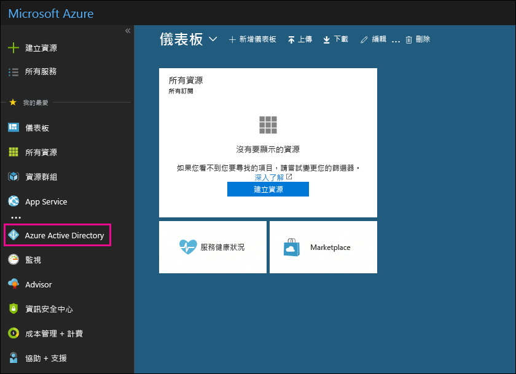

# 使用您的免費 Azure Active Directory 訂閱Use your free Azure Active Directory subscription

如果貴組織有 Microsoft 365、Microsoft Dynamics CRM Online、Enterprise Mobility Suite 或其他 Microsoft 服務的付費訂閱，則您有 Microsoft Azure Active Directory 的免費訂閱。您和其他系統管理員可以使用 Azure AD，來建立並管理使用者和群組帳戶。若要使用 Azure AD，只需移至 Azure 入口網站，然後登入您的帳戶。If your organization has a paid subscription to Microsoft 365, Microsoft Dynamics CRM Online, Enterprise Mobility Suite, or other Microsoft services, you have a free subscription to Microsoft Azure Active Directory. You and other admins can use Azure AD to create and manage user and group accounts. To use Azure AD, just go to the Azure portal and sign in to your account.

## 開啟私人瀏覽會話Open a private browsing session

您可以使用私密瀏覽工作階段 (而非一般工作階段) 存取 Azure 入口網站 (在以下的步驟 1)。如此可避免您目前登入的認證傳送至 Azure。若要開啟私密瀏覽工作階段：Use a private browsing session (not a regular session) to access the Azure portal (in step 1 below). This prevents the credentials that you're currently logged on with from being passed to Azure. To open a private browsing session:

- 在 Microsoft Edge (舊版)、Internet Explorer 或 Mozilla FireFox 中，請按 `CTRL+SHIFT+P`。In Microsoft Edge (legacy version), Internet Explorer, or Mozilla FireFox, press `CTRL+SHIFT+P`.

- 在 Microsoft Edge (最新版本) 或 Google Chrome 中，請按 `CTRL+SHIFT+N`。In Microsoft Edge (newest version) or Google Chrome, press `CTRL+SHIFT+N`.

## 存取 Azure Active DirectoryAccess Azure Active Directory

1. 移至 [portal.azure.com](https://portal.azure.com) 並使用您的公司或學生帳戶登入。Go to [portal.azure.com](https://portal.azure.com) and sign in with your work or student account.

2. 在 Azure 入口網站的左導覽窗格中，按一下 [Azure Active Directory]。In the left navigation pane in the Azure portal, click **Azure Active Directory**.

    

    即會顯示 [Azure Active Directory] 系統管理中心。The **Azure Active Directory** admin center is displayed.

## 詳細資訊More information

- 免費的 Azure Active Directory 訂用帳戶不包含登入活動報告。A free Azure Active Directory subscription does not include the Sign-ins activity report. 若要記錄登入活動 (發生資料外洩時相當實用)，您必須擁有 Azure Active Directory Premium 訂用帳戶。To record sign-in activity (which can be useful in a data breach), you need an Azure Active Directory Premium subscription. 如需詳細資訊，請參閱 [Azure AD 會將資料儲存多久？](/azure/active-directory/reports-monitoring/reference-reports-data-retention#how-long-does-azure-ad-store-the-data).For more information, see [How long does Azure AD store the data?](/azure/active-directory/reports-monitoring/reference-reports-data-retention#how-long-does-azure-ad-store-the-data).

- 您也可以從 Microsoft 365 系統管理中心存取 **Azure Active Directory**。You can also access the **Azure Active Directory** admin center from the Microsoft 365 admin center. 在 Microsoft 365 系統管理中心左側瀏覽窗格，按一下 [系統管理中心] \> [Azure Active Directory]。In the left navigation pane of the Microsoft 365 admin center, click **Admin centers** \> **Azure Active Directory**.

- 如需管理使用者和群組以及執行其他目錄管理工作的詳細資訊，請參閱[管理 Azure AD 目錄](/azure/active-directory/active-directory-administer)。For information about managing users and groups and performing other directory management tasks, see [Manage your Azure AD directory](/azure/active-directory/active-directory-administer).