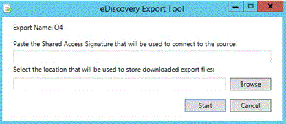

# 在高級 eDiscovery （古典）中查看批次歷史記錄並匯出超過的結果View batch history and export past results in Advanced eDiscovery (classic)

> [!NOTE]
> 進階電子文件探索需要具有進階合規性附加元件的 Office 365 E3，或適用於您組織的 E5 訂閱。如果您沒有該方案，且想要嘗試進階電子文件探索，您可以[註冊 Office 365 企業版 E5 試用版](https://go.microsoft.com/fwlink/p/?LinkID=698279)。Advanced eDiscovery requires an Office 365 E3 with the Advanced Compliance add-on or an E5 subscription for your organization. If you don't have that plan and want to try Advanced eDiscovery, you can [sign up for a trial of Office 365 Enterprise E5](https://go.microsoft.com/fwlink/p/?LinkID=698279). 
  
下列章節說明在高級 eDiscovery 中批次查看和匯出資料的其他選項。The following section describes additional options for batch viewing and export of data in Advanced eDiscovery. 
  
## 查看匯出批次歷史記錄及匯出先前批次Viewing Export batch history and exporting previous batches

[匯出記錄檔] 對話方塊會提供所選匯出批次會話的詳細資訊，也可讓您撤銷上一個會話。The Export history dialog provides detailed information of selected export batch sessions and also provides the ability to undo the last session.
  
1. 在 [**匯出 \> 設定**] 中，從 [**匯出批次**] 下拉式清單中選取批次名稱。In **Export \> Setup**, select the batch name from the **Export batch** drop-down list. 
    
2. 在匯出批次名稱的右側，選取 [**批次記錄**] 圖示：To the right of the export batch name, select the **Batch history** icon: 
    
    
  
    隨即會顯示 [批次歷程記錄] 對話方塊。The Batch history dialog is displayed.
    
    
  
3. 若有必要回復前一個會話，請按一下 [**撤銷上一個會話**]。If it is necessary to roll back a previous session, click **Undo last session**. 可以多次執行 Rollback，這會取消最後一個會話。Rollback can be performed multiple times, which cancels the last session.
    
4. 如果您想要從先前執行的匯出批次會話中隨時下載資料，請按一下要匯出之所需匯出批次旁邊的 [**下載**] 圖示 [  ]。If you want to download data at any time from a previously executed export batch session, click the **Download** icon  next to the desired export batch to be exported. 
    
5. 當 [**共用存取**簽章] 對話方塊顯示時，按一下 [**複製到剪貼簿**]，將匯出會話資料複製到本機電腦，然後按一下 [**關閉**]。When the **Shared access signature** dialog is displayed, click **Copy to clipboard** to copy the export session data to the local machine, and then click **Close**. [安全性與 &amp; 規範中心**EDiscovery 匯出工具**] 對話方塊隨即顯示。The Security &amp; Compliance Center **eDiscovery Export Tool** dialog is displayed. 
    
    
  
6. 在 [ **EDiscovery 匯出工具**] 對話方塊中：In the **eDiscovery Export Tool** dialog: 
    
1. 在 [**貼上用來連線至來源的共用存取簽名]** 中，貼上先前複製到 [剪貼簿] 的「**共用存取簽名**」值。In **Paste the Shared Access Signature that will be used to connect to the source**, paste the **Shared access signature** value, which was previously copied to the clipboard. 
    
2. 按一下 **[流覽]** ，以選取在本機電腦上儲存已下載之匯出檔案的目標位置。Click **Browse** to select the target location for storing the downloaded export files on a local machine. 
    
3. 按一下 **[開始]**。Click **Start**. 匯出檔案會下載到本機電腦。The export files are downloaded to the local machine. 
    
## 相關主題Related topics

[進階電子文件探索 (傳統版)Advanced eDiscovery (classic)](office-365-advanced-ediscovery.md)
  
[匯出結果Exporting results ](export-results-in-advanced-ediscovery.md)

[匯出報告欄位Export report fields](export-report-fields-in-advanced-ediscovery.md)

