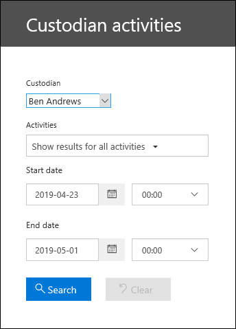
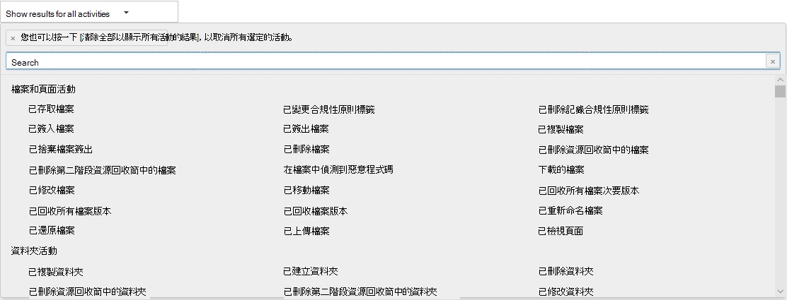

# 查看保管人審核活動

需要了解是否有使用者已檢視特定文件或清除信箱中的項目嗎？ 「高級 eDiscovery」現在已與安全性 & 合規性中心內的現有「審核記錄」搜尋工具整合。 使用此內嵌經驗，您可以使用「高級 eDiscovery 保管人管理」工具，輕鬆地存取和搜尋您案例中的保管人活動，以協助您進行調查。

## 取得許可權

您必須在 Exchange Online 中獲派為 [僅限檢視稽核記錄] 或 [稽核記錄] 角色，才能搜尋稽核記錄。 根據預設，這些角色會在 Exchange 系統管理員中心的 [權限] 頁面上，指派給 [法務遵循管理] 和 [組織管理] 角色群組。 若要讓使用者能夠使用最低的許可權層級來搜尋高級 eDiscovery 審核記錄，您可以在 Exchange Online 中建立自訂角色群組、新增 View-Only 的「審核記錄檔」或「審核記錄」角色，然後將該使用者新增為新角色群組的成員。 如需詳細資訊，請參閱管理 Exchange Online 中的角色群組。

> [!IMPORTANT]
> 如果您在安全性 & 規範中心的 [許可權] 頁面上指派使用者 View-Only 的「審核記錄」或「審核記錄」角色，他們將無法搜尋審核記錄。 您必須在 Exchange Online 中指派權限。 這是因為用來搜尋稽核記錄的基礎 Cmdlet 是 Exchange Online Cmdlet。

## 步驟1：搜尋針對保管人所執行之活動的審計記錄

1. 請移至**eDiscovery > Advanced ediscovery** ，然後開啟案例。
  
2. 按一下 [**來源**] 索引標籤。
  
3. 在 [**保管人**] 頁面上，從清單中選取管理員，然後按一下彈出頁面上的 [**查看保管人活動**]。

    [保管人活動搜尋] 頁面隨即顯示。 附注您在上一個步驟中選取的系統管理員會顯示在 [**保管人**] 下拉式方塊中。 您可以在下拉式方塊中選取不同的保管人，但是一次只能搜尋一個保管人的活動。

    
   
4. 設定下列搜尋準則：
      
   1. **活動**-按一下下拉式清單，以顯示您可以搜尋的活動。 執行搜尋後，只會顯示所選活動的審計記錄。 選取 [**顯示所有活動的結果**]，會顯示由系統管理員執行且符合其他搜尋準則之所有活動的結果。

      
      
   1. **開始日期和結束日期**-選取日期和時間範圍，以顯示在該期間內發生的事件。 預設會選取最後七天。 日期和時間以國際標準時間 (UTC) 格式表示。 您可以指定的最大日期範圍是一年。
      
   1. **保管人**-按一下此方塊，然後選取特定保管人以顯示搜尋結果。 您在此方塊中選取之使用者所執行之選取活動的審計記錄會顯示在結果清單中。
      
5. 按一下   使用您的搜尋準則執行搜尋。 搜尋結果會在載入之後，然後在 [保管人活動搜尋] 頁面的 [結果] 底下出現片刻。 

## 步驟2：查看審核記錄搜尋結果

審核記錄搜尋的結果會顯示在 [保管人審核記錄] 頁面的 [結果] 底下。 最多5000（最新）事件會以150事件的倍數顯示。 若要顯示更多事件，您可以在 [結果] 窗格中使用捲軸列，或按 Shift + End 顯示後續 150 個事件。

結果包含搜尋傳回之每個事件的下列相關資訊。
- **日期：** 事件發生時的日期和時間 (以 UTC 格式顯示)。

- **IP 位址：** 記錄活動時所使用的裝置之 IP 位址。 IP 位址會以 IPv4 或 IPv6 位址格式顯示。

- **使用者**：執行動作並觸發事件的使用者 (或服務帳戶)。

- **活動**：使用者執行的活動。 這個值對應您在 [活動] 下拉式清單中選取的活動。 若是來自 Exchange 系統管理員稽核記錄的事件，此欄中的這個值則是 Exchange Cmdlet。

- **項目**：已建立或修改為對應活動結果的物件。 例如，已檢視或修改的檔案或已更新的使用者帳戶。 並非所有活動在此資料行中都具有值。

- **詳細**資訊：有關活動的其他詳細資料。 同樣地，並非所有活動都具有值。

## 步驟 3：篩選搜尋結果

除了排序，您也可以篩選稽核記錄搜尋的結果。 這可協助您快速篩選特定使用者或活動的結果。 

若要篩選結果：

 1. 建立並執行審核記錄搜尋。
  
2. 當顯示結果時，按一下 [篩選結果]****。
 
3. 關鍵字方塊隨即顯示在每個欄標頭底下。
  
4. 按一下欄標頭底下的其中一個方塊，然後輸入字詞或片語 (視您正在篩選的欄而定)。 結果將動態重新調整為顯示與您的篩選相符之事件。
  
5. 若要清除篩選，請按一下 [篩選] 方塊中的**X**或只按一下 [**隱藏篩選**]。

## 將搜尋結果匯出至檔案

您可以將審核記錄搜尋的結果匯出至本機電腦上的逗點分隔值（CSV）檔案。 您可以在 Microsoft Excel 中開啟此檔案，並使用諸如搜尋、排序、篩選和分割單一欄（包含多值儲存格）的功能分為多個欄。

1. 執行稽核記錄搜尋，然後修改搜尋準則，直到您獲得想要的結果為止。
  
2. 按一下 [匯出結果]，然後選取下列其中一個選項：

    - **儲存載入的結果：** 選擇此選項，只會匯出在「**保管人審核記錄搜尋**」頁面的 [**結果**] 下顯示的專案。 下載的 CSV 檔案會包含與頁面上顯示相同的欄 (及資料) (日期、使用者、活動、項目及詳細資料)。 包含來自審計記錄專案的詳細資訊的 CSV 檔案中包含其他欄（名為**More**）。 因為您正在匯出 [稽核記錄搜尋] 頁面上所載入的相同結果 (且可檢視)，因此最多可匯出 5,000 個項目。
        
    - **下載所有結果：** 選擇此選項可從符合搜尋準則的審計記錄中匯出所有專案。 針對大型搜尋結果集，請選擇此選項，從審核記錄中下載所有專案，除了可顯示在 [**保管人審核記錄**搜尋] 頁面上的5000結果。 此選項會從審核記錄檔下載原始資料到 CSV 檔案，並包含來自名為 AuditData 的欄中的審計記錄專案的其他資訊。 如果您選擇此匯出選項，下載檔案可能需要較久的時間。這是因為如果您選擇其他選項，檔案可能會遠大於下載的檔案。
    
      > [!IMPORTANT]
      > 您可以從單一稽核記錄搜尋下載最多 50,000 個項目至 CSV 檔案。 如果已下載 50,000 個項目至 CSV 檔案，您可能可以假設有超過 50,000 個符合搜尋準則的事件。 若要匯出的內容超過此限制，請嘗試使用日期範圍來縮小稽核記錄項目的數量。 您可能需要使用較小的日期範圍執行多次搜尋，以匯出 50,000 個以上的項目。
        

3. 選取匯出選項之後，會在視窗底部顯示一則訊息，提示您開啟 CSV 檔、將其儲存至 [下載] 資料夾，或將其儲存至特定資料夾。

如需查看、篩選或匯出審計記錄搜尋結果的詳細資訊，請參閱在[安全性 & 規範中心搜尋審核記錄](search-the-audit-log-in-security-and-compliance.md)檔。
