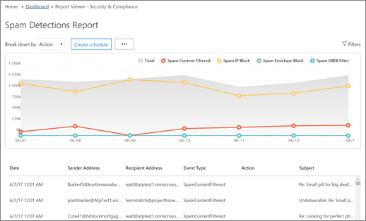

# 在安全&amp;合规性中心查看电子邮件安全报告

[&amp;安全合规性中心](https://protection.office.com)提供了各种报告，可帮助您了解 Office 365 中的电子邮件安全功能（如反垃圾邮件、反恶意软件和加密功能）如何保护您的组织。 如果您具有[必要的权限，](#what-permissions-are-needed-to-view-these-reports)则可以通过&amp;**访问"报表**\>**仪表板"** 在安全合规性中心查看这些报告。
  

  
您的电子邮件安全报告包括以下内容：
- [加密报告](#encryption-report)（新！
- [威胁防护状态报告](#threat-protection-status-report) 
- [恶意软件检测报告](#malware-detections-report) 
- [热门恶意软件报告](#top-malware-report)
- [热门发件人和收件人报告](#top-senders-and-recipients-report)
- [欺骗检测报告](#spoof-detections-report)
- [垃圾邮件检测报告](#spam-detections-report)
- [已发送和接收的电子邮件报告](#sent-and-received-email-report)
- [用户报告的消息报告](#user-reported-messages-report)
    
## 加密报告

（**新！**）"**加密"报表**显示有关通过组织策略或通过最终用户控件加密的电子邮件的信息。 组织的安全团队可以使用此报告中的信息来识别模式，并主动应用或调整敏感电子邮件的策略。

要查看此报告，在安全&合规性中心，转到**报表**\>**仪表板**\>**加密报告**。

 

首次打开报表时，您将看到有关过去七 （7） 天在电子邮件中使用的加密方法的数据。 您可以通过单击屏幕右上角**的"筛选器"** 来更改报表中显示的日期范围和详细信息。

   

**您还可以使用"按菜单细分"** 按加密模板（或方法）查看数据。

而且，您可以使用"**按"菜单查看数据"** 来更改视图，以查看加密邮件计数到前五个收件人域。

借助新的加密报告的灵活性，您可以查看趋势并采取相应操作。 例如，如果您看到大量由用户加密的电子邮件，则可能需要添加加密策略以自动加密某些用例。 （要获取有关这一点的帮助，请参阅[定义邮件流规则以加密 Office 365 中的电子邮件。](define-mail-flow-rules-to-encrypt-email.md)另一个示例是，如果您有许多可用的加密模板，但没有人使用它们，则可以了解用户是否需要针对该功能进行培训。 

使用此报告可使组织的安全和合规性团队能够监视消息加密的使用方式，以及是否需要进一步操作。 要了解有关加密详细信息，请参阅[Office 365 中的电子邮件加密。](email-encryption.md)

## 威胁防护状态报告

**威胁保护状态**报告是一个智能报告，显示由 Exchange 在线保护检测到和阻止的恶意电子邮件。 此报告可用于查看一段时间内标识为恶意软件或网络钓鱼尝试的电子邮件（最多 90 天），并使安全管理员能够识别趋势或确定策略是否需要调整。

> [!NOTE]
> 具有[Office 365 ATP](/security/office-365-security/office-365-atp.md)或[Exchange 在线保护](/security/office-365-security/exchange-online-protection-eop.md)（EOP） 的客户可以使用威胁保护状态报告;但是，ATP 客户的威胁防护状态报告中显示的信息可能包含与 EOP 客户可能看到的数据不同的数据。 例如，EOP 客户可以查看有关电子邮件中检测到的恶意软件的信息，但不能查看有关[在 SharePoint Online、OneDrive 或 Microsoft Teams 中检测到的恶意文件](/security/office-365-security/atp-for-spo-odb-and-teams.md)的信息，这些恶意文件是 ATP 特定的功能。 （[了解有关 ATP 报告的更多详细信息。](/security/office-365-security/view-reports-for-atp.md)
  
要查看此报告，在[&amp;安全合规性中心](https://protection.office.com)中，转到**报表**\>**仪表板**\>**威胁保护状态**。
  

  
首次打开威胁保护状态报告时，默认情况下，该报告显示过去七天的数据;如果显示过去 7 天的数据，则显示过去 7 天的数据。但是，您可以**单击"筛选器"** 并更改最多 90 天的详细信息的日期范围。 （如果您使用的是试用订阅，则数据可能限制为 30 天。

此报告可用于查看组织的[Exchange 在线保护功能](/security/office-365-security//eop-features.md)的有效性和影响，以及长期趋势。 
  

  
您还可以选择是查看标识为恶意的电子邮件、标识为网络钓鱼尝试的电子邮件还是标识为包含恶意软件的电子邮件的数据。
  

  
## 恶意软件检测报告

恶意软件**检测**报告显示检测到有多少传入和传出邮件包含组织的恶意软件。 
  
要查看此报告，在[安全&amp;合规性中心](https://protection.office.com)中，转到**报表**\>**仪表板**\>**恶意软件检测**。
  

  
与其他报告（如[威胁保护状态报告）](#threat-protection-status-report)类似，默认情况下，该报表显示过去七天的数据。 但是，**您可以选择"筛选器"** 来更改日期范围。 
  
## 热门恶意软件报告

**热门恶意软件**报告显示[由 Exchange 在线](/security/office-365-security/eop-features.md)检测到的各种恶意软件。 
  
要查看此报告，在[&amp;安全合规性中心](https://protection.office.com)中，**转到"报表**\>**仪表板**\>**顶部恶意软件"。**
  

  
当您将鼠标悬停在饼图中的楔块上时，您可以看到某种恶意软件的名称以及检测到有多少消息具有该恶意软件。
  
单击（或点击）报表以在新的浏览器窗口中打开报表，您可以在其中获取报表的更详细视图。
  

  
在图表下方，您将看到检测到的恶意软件列表，以及检测到有多少邮件具有该恶意软件。
  
## 热门发件人和收件人报告

**"热门发件人和收件人"** 报表是显示您电子邮件发件人热门邮件的饼图。 
  
要查看此报告，在[安全&amp;合规性中心](https://protection.office.com)中，转到**报表**\>**仪表板**\>**顶部发件人和收件人**。
  

  
将鼠标悬停在饼图中的楔块上时，可以看到发送或接收的消息计数。
  
单击（或点击）报表以在新的浏览器窗口中打开报表，您可以在其中获取报表的更详细视图。
  
使用"**显示数据"** 列表可选择是否查看顶级发件人、收件人、垃圾邮件收件人和恶意软件收件人的数据。 您还可以查看谁收到了[由 Exchange 在线保护](/security/office-365-security/exchange-online-protection-overview.md)检测到的恶意软件。 
  

  
在图表下方，您将看到热门电子邮件发件人或收件人是谁，以及给定时间段内发送或接收的邮件计数。
  
## 欺骗检测报告

"**欺骗检测"** 报告显示检测到的欺骗邮件数量，以及其中哪些邮件被视为"良好"（出于合法业务原因执行的欺骗邮件）。 
  
要查看此报告，在[安全&amp;合规性中心](https://protection.office.com)中，转到**报表**\>**仪表板**\>**欺骗邮件**。
  

  
当您在图表中将鼠标悬停在一天上时，您可以看到有多少欺骗性邮件通过。
  
单击（或点击）报表以在新的浏览器窗口中打开报表，您可以在其中获取报表的更详细视图。 要了解有关反欺骗保护详细信息，请参阅[Office 365 中的反欺骗保护。](/security/office-365-security/anti-spoofing-protection.md)
  
## 垃圾邮件检测报告

**垃圾邮件检测**报告显示所有垃圾邮件内容被 Exchange 在线阻止。 邮件按邮件计数，而不是按收件人计数。 例如，如果向组织中的 100 个收件人发送了电子邮件，则会将其计为一条消息。
  
要查看此报告，在[安全&amp;合规性中心](https://protection.office.com)中，转到**报表**\>**仪表板**\>**垃圾邮件检测**。
  

  
当您在图表中将鼠标悬停在一天上时，您可以看到当天被阻止的项目数，以及这些项目的分类方式。 例如，您可以看到筛选了垃圾邮件数，以及来自阻止的 Internet 协议 （IP） 地址的项目数。
  
单击（或点击）报表以在新的浏览器窗口中打开报表，您可以在其中获取报表的更详细视图。
  

  
在图表下方，您将看到检测到的垃圾邮件项目的列表。 选择项目以查看其他信息，例如垃圾邮件项目是入站还是出站、邮件 ID 及其收件人。 要了解有关反垃圾邮件保护的更多内容，请参阅[Office 365 电子邮件反垃圾邮件保护](/security/office-365-security/anti-spam-protection.md)。
  
## 已发送和接收的电子邮件报告

**已发送和接收的电子邮件**报告是一个智能报告，显示有关传入和传出电子邮件的信息，包括垃圾邮件检测、恶意软件和标识为"良好"的电子邮件。 
  
要查看此报告，在[&amp;安全合规性中心](https://protection.office.com)中，\>**转到"已发送和接收的电子邮件"****仪表板。** \> ****
  

  
当您在图表中将鼠标悬停在一天上时，您可以看到有多少消息进入，以及这些消息的分类方式。 例如，您可以看到检测到包含恶意软件的邮件数，以及有多少邮件被标识为垃圾邮件。
  
单击（或点击）报表以在新的浏览器窗口中打开报表，您可以在其中获取报表的更详细视图。
  
您可以使用"按列表**细分"** 按类型或方向（传入和传出）查看信息。 
  

  
在图表下方，您将看到电子邮件类别的列表，如**GoodMail、****垃圾邮件内容筛选**等。 选择类别以查看其他信息，例如针对恶意软件执行的操作，以及电子邮件是传入还是传出。
  

要了解有关电子邮件智能的更多详细信息，请参阅[Office 365 中的"邮件流智能"。](/security/office-365-security/mail-flow-intelligence-in-office-365.md)
  
## 用户报告的消息报告

**用户报告的邮件**报告显示有关用户[通过使用"报告邮件"外接程序](/security/office-365-security/enable-the-report-message-add-in.md)报告为垃圾邮件、网络钓鱼尝试或良好邮件的电子邮件的信息。
  
有关每封邮件的详细信息，包括传递原因，例如为您的组织配置的垃圾邮件策略异常或邮件流规则。 要查看详细信息，请在用户报告列表中选择一个项目，然后**查看"摘要"** 和"**详细信息"** 选项卡上的信息。 
  

  
要查看此报告，在[&amp;安全合规性中心](https://protection.office.com)中，执行以下操作之一：
  
- 转到**威胁管理**\>**仪表板**\>**用户报告的消息。**
    
- 转到**威胁管理**\>**审核**\>**用户报告的消息**。
    

  
> [!IMPORTANT]
> 为了使用户报告的消息报告正常工作，必须为 Office 365 环境**打开审核日志记录。** 这通常由在 Exchange 联机中分配审核日志角色的人员完成。 有关详细信息，请参阅[打开或关闭 Office 365 审核日志搜索。](turn-audit-log-search-on-or-off.md) 
  
## 查看这些报告需要哪些权限？

为了查看和使用本文中描述的报告，**您必须为安全&amp;合规性中心和 Exchange 管理中心分配适当的角色。**

- 对于安全&amp;合规性中心，您必须分配以下角色之一：
    - 組織管理
    - 安全管理员（可在 Azure 活动目录管理中心 （[https://aad.portal.azure.com](https://aad.portal.azure.com)） 中分配
    - 安全读取器

- 对于 Exchange 在线，您必须在 Exchange 管理中心 （ ） 或 PowerShell cmdlet 中分配以下角色之一（[https://outlook.office365.com/ecp](https://outlook.office365.com/ecp)请参阅 Exchange 在线[PowerShell](https://docs.microsoft.com/powershell/exchange/exchange-online/exchange-online-powershell?view=exchange-ps)）：
    - 組織管理
    - 僅檢視組織管理
    - 僅檢視收件者角色
    - 合規性管理

要了解更多信息，请参阅以下资源：

- [Permissions in the Office 365 Security &amp; Compliance Center](/security/office-365-security/protect-against-threats.md)

- [Exchange Online 中的功能權限](https://docs.microsoft.com/exchange/permissions-exo/feature-permissions)
   
   
## 如果报表未显示数据，该怎么办？

如果报表中未看到数据，请仔细检查策略设置是否正确。 要了解更多信息，请参阅[Office 365 中的"防止威胁"。](/security/office-365-security/protect-against-threats.md)
  
## 相關主題

[Office 365 電子郵件的反垃圾郵件保護](/security/office-365-security/anti-spam-protection.md)
  
[Office 365 安全&amp;合规性中心的报告和见解](/security/office-365-security/reports-and-insights-in-security-and-compliance.md)
  
[在安全&amp;合规性中心为报表创建计划](/security/office-365-security/create-a-schedule-for-a-report.md)
  
[在安全&amp;合规性中心设置和下载自定义报告](/security/office-365-security/set-up-and-download-a-custom-report.md)
  

