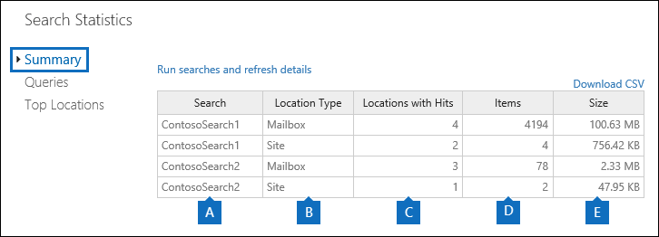

# 檢視內容搜尋結果的關鍵字統計資料

在您建立並執行內容搜尋之後，您可以查看預估搜尋結果的統計資料。 這包括搜尋結果摘要 (類似于詳細資料窗格中所顯示之預計搜尋結果的摘要) 、查詢統計資料（如包含符合搜尋查詢的專案的內容位置數），以及具有最相符專案的內容位置的名稱。 您可以顯示一或多個內容搜尋的統計資料。 這可讓您快速比較多個搜尋的結果，並針對搜尋查詢的有效性作出決定。
  
此外，您可以設定新的和現有的搜尋，以傳回搜尋查詢中每個關鍵字的統計資料。 這可讓您比較查詢中每個關鍵字的結果數，以及比較多個搜尋中的關鍵字統計資料。
  
您也可以將搜尋統計資料和關鍵字統計資料下載至 CSV 檔案。 如此可讓您使用 Excel 中的篩選和排序功能來比較結果，並為您的搜尋結果準備報告。
  
## 取得內容搜尋的統計資料

若要顯示內容搜尋的統計資料：
  
1. 在 Microsoft 365 規範中心內，移至 [**顯示所有**  >  **內容搜尋**]。

2. 在搜尋清單中，選取兩個或多個搜尋，然後按一下 [**大量動作**] 飛出頁面上的 [**搜尋統計資料]** 。
    
    ![選取 [多個搜尋]，然後按一下 [搜尋統計資料]](../media/1195c6c3-2e00-469d-8c29-85c1c7ebe6c7.png)
  
3. 在 [ **搜尋統計資料]** 頁面上，按一下下列其中一個連結，以顯示所選搜尋的統計資料。 
    
    **摘要**
    
    此頁面顯示的統計資料，類似于 **內容搜尋** 頁面上的詳細資料窗格中顯示的統計資料。 顯示所有選取之搜尋的統計資料。 請注意，您也可以從這個頁面重新執行選取的搜尋，以更新統計資料。 
    
    
  
    a.  內容搜尋的名稱。 如先前所述，您可以顯示並比較多個搜尋的統計資料。
    
    b. 搜尋的內容位置類型。 每一列都顯示指定搜尋的信箱、網站和公用資料夾的統計資料。
    
    c. 內容位置的數目，包含符合搜尋查詢的專案。 若為信箱，此統計資料也會包含包含符合搜尋查詢之專案的封存信箱數目。
    
    d. 符合搜尋查詢的所有指定內容位置的專案總數。 專案類型的範例包括電子郵件、行事曆專案和檔。 如果專案包含要搜尋之關鍵字的多個實例，它只會在總專案數中計算一次。 例如，如果您正在搜尋 "stock" 或「欺詐」文字，而且電子郵件訊息包含三個字 "stock" 的實例，它只會在 [ **專案** ] 欄中計算一次。 
    
    e. 在指定內容位置中找到的所有符合搜尋查詢的專案總大小。 
    
    **Queries**
    
    此頁面會顯示搜尋查詢的統計資料。
    
    
  
    a. 資料列中包含查詢統計資料之內容搜尋的名稱。
    
    b. 查詢統計資料適用的內容位置類型。
    
    c. 此欄指出統計資料適用的搜尋查詢部分。 **主要** 表示整個搜尋查詢。 當您建立或編輯搜尋查詢時使用關鍵字清單時，此表格會包含每個查詢元件的統計資料。 如需詳細資訊，請參閱本文中的 [取得內容搜尋的關鍵字統計資料](#get-keyword-statistics-for-content-searches) 一節。 
    
    d. 此欄包含內容搜尋工具所執行的實際搜尋查詢。 請注意，此工具會自動將一些額外的元件新增至您所建立的查詢。 

    - 當您搜尋信箱中的所有內容 (但未指定任何關鍵字) 時，實際的關鍵字字查詢就是要  `size>=0` 傳回所有專案。 
    
     - 當您搜尋商務網站的線上 SharePoint 和 OneDrive 時，會新增下列兩個元件：
    
          **不 IsExternalContent:1** -排除內部部署 SharePoint 組織中的任何內容。 
    
          **非 IsOneNotePage： 1** -排除所有的 OneNote 檔案，因為這些檔案會是符合搜尋查詢的任何檔的重複專案。 

    
    e. 內容位置的數目 (所指定的 * * 位置類型 * * 欄) ，包含符合 [ **查詢** ] 欄中所列之搜尋查詢的專案。 
    
    f. 從指定的內容位置 (的專案數，) 符合 **查詢** 欄中所列的搜尋查詢。 如先前所述，如果專案包含要搜尋之關鍵字的多個實例，它只會在此欄位中計算一次。 
    
    g. 在指定內容位置中 (的所有專案總大小) ，符合 **查詢** 欄中的搜尋查詢。 
    
    **主要位置**
    
    此頁面會顯示每個搜尋的內容位置中符合搜尋查詢之專案數目的統計資料。 會顯示前 1,000 個位置。 如果您查看多個搜尋的統計資料，就會顯示每個搜尋的前1000個位置。 請注意，如果不包含任何符合搜尋查詢的專案，則此頁面上不會包含內容位置。
    
    
  
    a. 內容位置的名稱。
    
    b. 位置統計資料適用的內容位置類型。
    
    c. 每個搜尋的欄都是您要顯示的統計資料。 此欄顯示每個內容位置中符合搜尋查詢之專案的數目 (及總大小) 。 請注意，當您要顯示多個搜尋的統計資料時，此欄中的「NA」表示該搜尋中並未包含內容位置。 

## 取得內容搜尋的關鍵字統計資料

如先前所述，[ **查詢** ] 頁面會顯示搜尋查詢，以及符合查詢的專案 (和大小) 。 如果您在建立或編輯搜尋查詢時使用關鍵字清單，您可以取得增強的統計資料，顯示與每個關鍵字或關鍵字片語相符的專案數目。 這可協助您快速識別查詢的哪些部分是最 (及最低的) 有效。 例如，如果關鍵字會傳回大量的專案，您可以選擇縮小關鍵字查詢以縮小搜尋結果。 您可以在建立或編輯內容搜尋時設定關鍵字清單。 

若要建立關鍵字清單及查看內容搜尋的關鍵字統計資料：
  
1. 在 Microsoft 365 規範中心內，移至 [**顯示所有**  >  **內容搜尋**]。
    
2. 在內容搜尋清單中，按一下 [和搜尋]，然後按一下 [ **編輯** ![ 編輯圖示] ](../media/ebd260e4-3556-4fb0-b0bb-cc489773042c.gif) 。
    
3. 按一下 [ **查詢** ]，然後執行下列操作： 
    
    ![按一下 [顯示關鍵字清單] 核取方塊，然後在每一列中輸入關鍵字。](../media/73ef46dd-3d5c-415d-b5e7-c3559caaafe2.png)
  
    a. 按一下 [ **顯示關鍵字清單** ] 核取方塊。 
    
    b. 在 [關鍵字] 表格的列中輸入關鍵字或關鍵字階段。 例如，在第一列中輸入 [ **預算** ]，然後在第二列中輸入 **security** 。 
    
4. 新增您要搜尋並取得統計資料的關鍵字之後，按一下 [ **搜尋** ] 以執行修正的搜尋。 
    
5. 當搜尋完成時，請在搜尋清單中進行選取，然後按一下 [ **搜尋統計資料** ![ 搜尋統計資料] 按鈕 ](../media/9bf56d43-25bf-4f53-a4be-f4d55102310c.png) 。 您也可以顯示和比較多個搜尋的關鍵字統計資料。
    
6. 在 [ **搜尋統計資料]** 頁面上，按一下 [ **查詢** ]，以顯示所選搜尋的關鍵字統計資料。 
    
    
  
    如先前的螢幕擷取畫面所示，會顯示每個關鍵字的統計資料。這包括： 
    
    - 搜尋中包含的每個內容位置類型的關鍵字統計資料。
    
    - 每個關鍵字的實際搜尋查詢，包含搜尋查詢的任何條件。 
    
    - 完整的搜尋查詢 (會在 **Part** 欄) 中識別為 **主要** 的，以及完整查詢的統計資料。 請注意，[ **摘要** ] 頁面上顯示的是相同的統計資料。 

> [!NOTE]
> 為了避免大型關鍵字清單所造成的問題，您目前限制在搜尋查詢的關鍵字清單中，最多可有20列。
