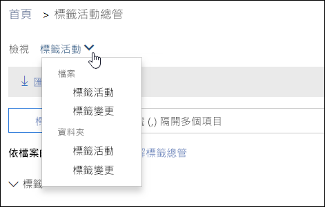

# 檢視文件的標籤活動View label activity for documents

After you create your labels, you'll want to verify that they're being applied to content as you intended.After you create your labels, you'll want to verify that they're being applied to content as you intended. With the Label Activity Explorer in the Security &amp; Compliance Center, you can quickly search and view label activity for all content across SharePoint and OneDrive for Business over the past 30 days.With the Label Activity Explorer in the Security &amp; Compliance Center, you can quickly search and view label activity for all content across SharePoint and OneDrive for Business over the past 30 days. This is real-time data that gives you a clear view into what's happening in your tenant.This is real-time data that gives you a clear view into what's happening in your tenant.
  
例如，使用標籤活動總管，您可以：For example, with the Label Activity Explorer, you can:
  
- 檢視每天 (最多 30 天) 套用每個標籤的次數。View how many times each label was applied on each day (up to 30 days).
    
- 查看誰已確切標示哪個日期上的哪個檔案，以及該檔案所在之網站的連結。See who labeled exactly which file on which date, along with a link to the site where that file resides.
    
- 檢視哪些檔案具有已變更或已移除標籤、舊標籤和新標籤是什麼，以及誰做了變更。View which files had labels changed or removed, what the old and new labels are, and who made the change.
    
- Filter the data to see all the label activity for a specific label, file, or user.Filter the data to see all the label activity for a specific label, file, or user. You can also filter label activity by location (SharePoint or OneDrive for Business) and whether the label was applied manually or auto-applied.You can also filter label activity by location (SharePoint or OneDrive for Business) and whether the label was applied manually or auto-applied.
    
- View label activity for folders as well as individual documents.View label activity for folders as well as individual documents. Coming soon is the ability to show how many files inside that folder got labeled as a result of the folder getting labeled.Coming soon is the ability to show how many files inside that folder got labeled as a result of the folder getting labeled.
    
您可以在 &amp;[安全性與合規性中心] > **[資訊控管]**  > **[標籤活動總管]** 中找到標籤活動總管。You can find the Label Activity Explorer in the Security &amp; Compliance Center > **Information governance** > **Label activity explorer**.
  
請注意，標籤活動總管需要 Office 365 企業版 E5 訂閱。Note that the Label Activity Explorer requires an Office 365 Enterprise E5 subscription.
  

  
## 檢視檔案或資料夾的標籤活動View label activities for files or folders

At the top of the Label Activity Explorer, you can choose whether to view activities for files or folders.At the top of the Label Activity Explorer, you can choose whether to view activities for files or folders. Note that folder activity includes only the folder itself, not the files inside the folder.Note that folder activity includes only the folder itself, not the files inside the folder.
  
You might want to see label activity for folders because if you label a folder, all files inside that folder also get that label (except for files that have had a label applied explicitly to them).You might want to see label activity for folders because if you label a folder, all files inside that folder also get that label (except for files that have had a label applied explicitly to them). Therefore, labeling folders might affect a significant number of files.Therefore, labeling folders might affect a significant number of files. For more information, see [Applying a default retention label to all content in a SharePoint library, folder, or document set](create-apply-retention-labels.md#applying-a-default-retention-label-to-all-content-in-a-sharepoint-library-folder-or-document-set).For more information, see [Applying a default retention label to all content in a SharePoint library, folder, or document set](create-apply-retention-labels.md#applying-a-default-retention-label-to-all-content-in-a-sharepoint-library-folder-or-document-set).
  

  
### 標籤活動Label activities

 **Label activities** includes all label actions: **adding**, **removing**, or **changing** a label.**Label activities** includes all label actions: **adding**, **removing**, or **changing** a label. You can use this view to get a comprehensive look at how many files each label's been applied to per day.You can use this view to get a comprehensive look at how many files each label's been applied to per day. 
  
### 標籤變更Label changes

 **Label changes** includes the potentially risky actions of **removing** or **changing** a label.**Label changes** includes the potentially risky actions of **removing** or **changing** a label. You can use this view to quickly see such risky actions and the user who performed them.You can use this view to quickly see such risky actions and the user who performed them. In the activity list below the chart, you can select a file, and then click a link to that file in the details pane on the right.In the activity list below the chart, you can select a file, and then click a link to that file in the details pane on the right. 
  

  
## 篩選標籤活動Filter label activity

You can quickly filter the data to see all the label activity for a specific label, file, or user.You can quickly filter the data to see all the label activity for a specific label, file, or user. You can also filter label activity by location (SharePoint or OneDrive for Business) and whether the label was applied manually or auto-applied.You can also filter label activity by location (SharePoint or OneDrive for Business) and whether the label was applied manually or auto-applied.
  

  

