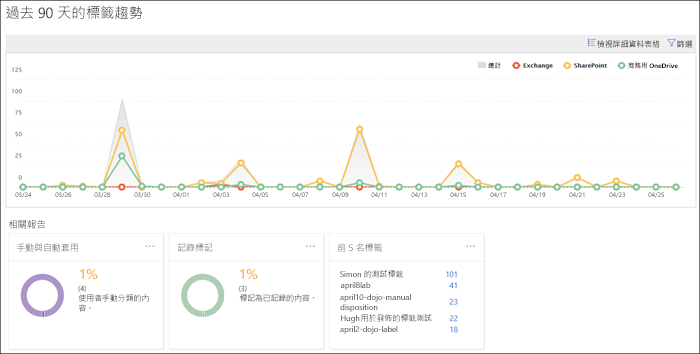
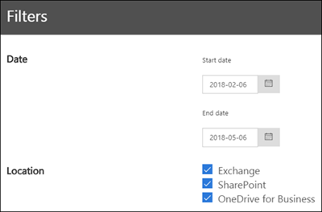

# 檢視資料控管報告

After you create your labels, you'll want to verify that they're being applied to content as you intended. With the data governance reports in the Security &amp; Compliance Center, you can quickly view:
  
- **Top 5 labels** This report shows the count of the top 5 labels that have been applied to content. Click this report to view a list of all labels that have been recently applied to content. You can see each label's count, location, how it was applied, its retention actions, whether it's a record, and its disposition type. 
    
- **手動與自動套用** 這份報告會顯示已手動或自動標示之所有內容的計數，以及已手動標示與自動標示之內容的百分比。 
    
- **記錄標記** 這份報告會顯示已標記為記錄或非記錄之所有內容的計數，以及已標記為記錄與非記錄之內容的百分比。 
    
- **過去 90 天的標籤趨勢** 這份報告會顯示過去 90 天已套用之所有標籤的計數和位置。 
    
所有這些報告都會顯示來自 Exchange、SharePoint 和商務用 OneDrive 的已標示內容。
  
您可以在 [安全性與合規性中心] \> [資訊控管]**** \> [儀表板]**** 中找到這些報告。&amp;
  

  
You can filter the data governance reports by date (up to 90 days) and location (Exchange, SharePoint, and OneDrive for Business). The most recent data can take up to 24 hours to appear in the reports.
  

  

