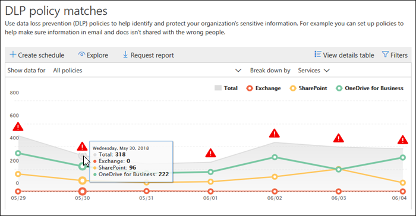

# 檢視資料外洩防護報告

在您建立資料遺失防護 (DLP) 原則之後，您會想要確認他們的運作是否正常，並協助您保持相容。 透過安全性與 &amp; 合規性中心的 DLP 報告，您可以快速查看：
  
- **DLP 原則相符** 專案此報告顯示一段時間的 DLP 原則相符計數。 您可以根據日期、位置、原則或動作篩選報告。 您可以將此報告用於： 
    
  - 當您在測試模式中執行 DLP 時，請調整或縮小這些原則。 您可以檢視符合內容的特定規則。
    
  - 將重點放在特定時段，以了解尖峰和趨勢的原因。
    
  - 探索違反貴組織 DLP 原則的商務程序。
    
  - 查看套用至內容的動作，以了解 DLP 原則的業務影響。
    
  - 顯示該原則的任何符合項目以驗證與特定 DLP 原則的合規性。
    
  - 檢視熱門使用者清單，並重複組織中造成事件的使用者。
    
  - 檢視貴組織中敏感性資訊的熱門類型清單。
    
- **DLP 事件** 此報告也顯示一段時間的原則相符專案，就像原則符合報表。 不過，原則符合報表會顯示規則層級的相符專案;例如，如果電子郵件符合三個不同的規則，則原則符合報表會顯示三個不同的行專案。 相反地，附隨報告會顯示專案層級的相符專案;例如，如果電子郵件符合三個不同的規則，則附隨報告會顯示該部分內容的單一行專案。 
    
  由於報告計數的匯總方式不同，因此原則比對報告更適合識別與特定規則的相符專案，以及微調 DLP 原則。 事件報告更適合用於識別 DLP 原則有問題的特定内容。
    
- **DLP 錯誤正值和 overrides** 如果您的 DLP 原則允許使用者覆寫它或報告誤報，此報告會顯示一段時間的這類實例計數。 您可以根據日期、位置或原則篩選報告。 您可以將此報告用於： 
    
  - 查看哪些政策會產生大量的誤判，以調整或縮小您的 DLP 原則。
    
  - 檢視當使用者藉由覆寫原則解析原則秘訣時，他們所提交的理由。
    
  - 藉由產生大量使用者覆寫，探索 DLP 原則與有效商務程序衝突的地方。
    
所有 DLP 報告都可以顯示最近四個月的資料。 最新的資料最多需要 24 小時就會在報告中顯示。
  
您可以在安全性與 &amp; 合規性中心 \> **報告** \> **儀表板** 中找到這些報告。
  

  
## 查看使用者為覆寫而提交的理由

如果您的 DLP 原則允許使用者覆寫，您可以使用誤判和覆寫報告來檢視使用者在原則提示中呈交的文字。
  

  
## 對真知灼見和建議採取動作

報告可顯示洞察力和建議，您可以在其中按一下紅色的警告圖示，以查看有關潛在問題的詳細資訊，並採取可能的補救措施。
  

  
## DLP 報告的許可權

若要在安全性 & 規範中心中查看 DLP 報告，您必須被指派下列專案：

- Exchange 系統管理中心的 **安全性讀取器** 角色。 根據預設，此角色會指派給 Exchange 系統管理中心的「組織管理」和「安全性讀者」角色群組。

- 在安全性 & 規範中心 **VIEW-ONLY DLP 合規性管理** 角色。 根據預設，此角色會指派給安全性 & 合規性中心內的合規性管理員、組織管理、安全性管理員及安全性讀者角色群組。

- Exchange 系統管理中心的 **View-Only** 收件者角色。 根據預設，此角色會指派給 Exchange 系統管理中心中的規範管理、組織管理和 View-Only 組織管理角色群組。

## 尋找 DLP 報告的 Cmdlet

若要對安全性與合規性中心使用大部分 Cmdlet，您必須：
  
1. [使用遠端 PowerShell 連線至安全性與 &amp; 合規性中心](/powershell/exchange/connect-to-scc-powershell&amp;clcid=0x409)
    
2. 使用這些安全性與[ &amp; 合規性中心 Cmdlet](/powershell/exchange/exchange-online-powershell)中的任何一個
    
不過，DLP 報告需要從整個 Office 365 擷取資料，包含 Exchange Online。 因此，您可以在 Exchange Online Powershell 中使用 DLP 報告的 Cmdlet，而不是在安全性與 &amp; 合規性中心 Powershell 中使用。 因此，若要為 DLP 報告使用 Cmdlet，您需要︰
  
1. [使用遠端 PowerShell 連線到 Exchange Online](/powershell/exchange/connect-to-exchange-online-powershell)
    
2. 為 DLP 報告使用下列任何 Cmdlet：
    
      - [Get-DlpDetectionsReport](/powershell/module/exchange/get-dlpdetectionsreport)
    
      - [Get-DlpDetailReport](/powershell/module/exchange/get-dlpdetailreport)
