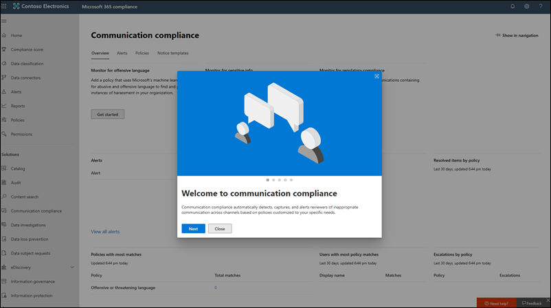

# Microsoft 365 規範中心的新功能What's new in the Microsoft 365 compliance center

我們不斷將新功能新增至[Microsoft 365 規範中心](microsoft-365-compliance-center.md)，以修正我們所學的問題，並根據您的意見反應進行變更。We're continuously adding new features to the [Microsoft 365 compliance center](microsoft-365-compliance-center.md), fixing issues we learn about, and making changes based on your feedback. 請參閱下列內容，以查看今天可提供的功能。Take a look below to see what's available for you today. 有些功能會以不同的速度向客戶推出。Some features get rolled out at different speeds to our customers. 如果您還沒有看到功能，請嘗試將您新增至[目標版本](https://docs.microsoft.com/office365/admin/manage/release-options-in-office-365)。If you aren't seeing a feature yet, try adding yourself to [targeted release](https://docs.microsoft.com/office365/admin/manage/release-options-in-office-365).

> [!TIP]
> 對其他系統管理中心的進展感興趣嗎？Interested in what's going on in other admin centers? 請參閱下列文章：Check out these articles: [Microsoft 365 系統管理中心的新功能What's new in the Microsoft 365 admin center](https://docs.microsoft.com/office365/admin/whats-new-in-preview?view=o365-worldwide) [SharePoint 系統管理中心的新功能What's new in the SharePoint admin center](https://docs.microsoft.com/sharepoint/what-s-new-in-admin-center)  
請造訪[microsoft 365 藍圖](https://www.microsoft.com/en-us/microsoft-365/roadmap)，以瞭解已啟動、已開發、已取消或先前發佈的 microsoft 365 功能。And visit the [Microsoft 365 Roadmap](https://www.microsoft.com/en-us/microsoft-365/roadmap) to learn about Microsoft 365 features that were launched, are rolling out, are in development, have been cancelled, or previously released.

## 2020 年 2 月February 2020

### 已正式發行內幕風險管理Insider risk management is officially released

鼓滾，請 .。。Drum roll, please... 「內部人員風險管理」現在可供組織使用下列訂閱：Insider risk management is now available to organizations with the following subscriptions:

- [Microsoft 365 E5](https://go.microsoft.com/fwlink/?linkid=2120431) （付費或試用版）[Microsoft 365 E5](https://go.microsoft.com/fwlink/?linkid=2120431) (paid or trial)
- Microsoft 365 Enterprise E3 訂閱與[Microsoft E5 合規性附加](https://go.microsoft.com/fwlink/?linkid=2120432)元件Microsoft 365 Enterprise E3 subscription with the [Microsoft E5 Compliance add-on](https://go.microsoft.com/fwlink/?linkid=2120432)

請注意，自預覽發行後我們進行了一些改進，包括[新的角色群組](insider-risk-management-configure.md#step-1-required-enable-permissions-for-insider-risk-management)和[全方案設定](insider-risk-management-configure.md#step-4-required-configure-insider-risk-settings)。Heads up that we made some improvements since the preview release, including [new role groups](insider-risk-management-configure.md#step-1-required-enable-permissions-for-insider-risk-management) and [solution-wide settings](insider-risk-management-configure.md#step-4-required-configure-insider-risk-settings).

一如既往，請在您使用解決方案時留下意見反應，讓我們能夠繼續進行改進。As always, please leave feedback as you use the solution so we can continue to make improvements.

### 記錄管理Records management

這個新的解決方案會將所有記錄管理功能置於單一傘底下。This new solution brings all the records management capabilities under a single umbrella. 要聞包括記錄的 SharePoint 和 OneDrive 的記錄版本，以及記錄的處置證明。Highlights include the introduction of records versioning for SharePoint and OneDrive and proof of disposal for records.

[深入瞭解記錄管理Learn more about records management](records-management.md)

### 解決方案聚光燈： Facebook 和 Twitter 的資料連線器Solution spotlight: Data connectors for Facebook and Twitter

[最後一個月發行](#just-launched)的資料連線器，我們正在尋找您的協助，以測試下列連接器。Data connectors [released last month](#just-launched) and we're looking for your help in testing out the following connectors.

- [Facebook 商務頁面](archive-facebook-data-with-sample-connector.md)。[Facebook business pages](archive-facebook-data-with-sample-connector.md). 將 Facebook 商務頁面上的資料匯入及封存至 Microsoft 365。Imports and archives data from Facebook business pages to Microsoft 365. 有益性解決方案（如記錄管理和 eDiscovery）。Beneficial for compliance solutions such as records management and eDiscovery.
- [Twitter](archive-twitter-data-with-sample-connector.md)。[Twitter](archive-twitter-data-with-sample-connector.md). 從 Twitter 將資料匯入並封存至 Microsoft 365。Imports and archives data from Twitter to Microsoft 365. 有益性解決方案（如記錄管理和 eDiscovery）。Beneficial for compliance solutions such as records management and eDiscovery.

當您設定和驗證這些連接器時，請讓我們對問題的反應提供反應，哪些是未的，以及我們可如何進行以改進體驗的意見。As you set up and validate these connectors, please leave us feedback about what went well, what didn't, and what we can do to improve the experience.

## 2020 年 1 月January 2020

等候已過。The wait is over. 我們很樂意宣告 Microsoft 365 規範中心可供所有使用 Microsoft 365、Office 365、企業行動性 + 安全性（EMS）和 Windows 10 企業版方案的客戶使用。We're pleased to announce that the Microsoft 365 compliance center is available to all customers with Microsoft 365, Office 365, Enterprise Mobility + Security (EMS), and Windows 10 Enterprise plans. 您在安全性 & 合規性中心內管理的任何資料或原則都是在「規範中心」中提供，所以不需要來回跳轉。Any data or policies you were managing in the Security & Compliance Center are available in the compliance center, so no need to jump back and forth.

> [!TIP]
> 請再次閱讀去年的更新，以取得我們最近預覽之一些[新方案](#new-compliance-solutions)的複習，以及顯示安全性 & 合規性中心的相容性功能目前在 Microsoft 365 中的活動[藍圖](#updated-compliance-solutions)。Read through last month's update again for a refresher on some of the [new solutions](#new-compliance-solutions) we previewed recently, as well as a [roadmap](#updated-compliance-solutions) showing where compliance features from the Security & Compliance Center now live in Microsoft 365.

[書簽和頭部]， [https://compliance.microsoft.com](https://compliance.microsoft.com) 以導覽您在整個組織中管理法規遵從性的單一光圈。您也可以[閱讀本文](microsoft-365-compliance-center.md)以進一步深入。Bookmark and head over now to [https://compliance.microsoft.com](https://compliance.microsoft.com) to tour your one-stop-shop for managing compliance across your org...or [read this article](microsoft-365-compliance-center.md) to dig in a bit more.

我們也在本月發佈新的和更新的解決方案。We also released new and updated solutions this month. 以下是重點講述的快捷流覽。Here's a quick glance at the highlights.

### 現在預覽Now in preview

**有問必答風險管理（預覽）****Insider risk management (preview)**

我們很樂意宣告，我們的有問必答風險管理解決方案現在是公開預覽。We're happy to announce that our insider risk management solution is now in public preview. 簡而言之，有問必答風險管理可協助您的組織，透過提供下列各項，以智慧識別並採取對內幕程式風險的動作：In a nutshell, insider risk management helps your organization intelligently identify and take action on insider risks by providing:

- 匿名控制，以協助確保使用者的隱私權。Anonymity controls to help ensure user privacy.
- 智慧原則範本，具有可識別內部攻擊的原生和協力廠商指示符，例如資料洩漏。Intelligent policy templates with native and third-party indicators that identify insider threats, such as data leaks.
- 跨 IT、HR 和法律團隊的整合端對端調查工作流程。Integrated end-to-end investigation workflows that span across IT, HR and legal teams.

我們很樂意聽到您想像的專案。We'd love to hear what you think. 當您使用方案時，請留下我們的意見反應，讓我們能確定，我們在提供一般可用性的情況下，滿足您的需求。As you use the solution, leave us feedback so we can make sure we're meeting your needs as we head toward general availability.

[深入瞭解內幕人士風險管理Learn more about insider risk management](insider-risk-management.md)

### 剛啟動Just launched

**通訊合規性****Communication compliance**

從預覽階段 Graduating 為 [完整可用性]，通訊相容性是我們新的有問必答風險方案集中的重要元件。Graduating from the preview phase to full availability, communication compliance is a key component of our new insider risk solution set. 這種強大的解決方案可協助將使用工作流程的通訊風險降到最低，以偵測、調查和採取針對不符合組織標準的郵件進行修正動作。This robust solution helps minimize communication risks using workflows for detecting, investigating, and taking remediation actions for messages that don't meet your organization's standards.

預覽期間的客戶意見反應極棒。Customer feedback during the preview was fantastic. 它會產生數種增強功能，包括初次執行體驗，讓您開始、調查和修正動作的增強功能等等。It resulted in several enhancements, including a first-run experience to get you started, improvements to investigation and remediation actions, and more.

[深入瞭解通訊法規遵從性Learn more about communication compliance](communication-compliance.md)

**資料連線器****Data connectors**

先前與 Office 365 安全性 & 合規性中心中的其他「匯入」功能共用空間，資料連線器現在在 Microsoft 365 規範中心擁有其專屬的家用。Formerly sharing space with other 'Import' features in the Office 365 Security & Compliance Center, data connectors now have their very own home in the Microsoft 365 compliance center. 使用新的「資料連線器」頁面，從組織的人力資源（HR）檔案和各種協力廠商平臺（如 Facebook、LinkedIn、Twitter 及立即 Bloomberg）匯入和封存您的 Microsoft 365 組織中的信箱資料。Use the new 'Data connectors' page to import and archive data from your organization's human resources (HR) files and various third-party platforms (like Facebook, LinkedIn, Twitter, and Instant Bloomberg) to mailboxes in your Microsoft 365 organization. 一旦匯入之後，就可以透過數個規範解決方案管理此資料，包括 eDiscovery、內幕風險管理、通訊相容性、審核、保留原則等等。Once imported, this data can be managed in several compliance solutions, including eDiscovery, insider risk management, communication compliance, audit, retention policies, and more.

[深入瞭解資料連線器Learn more about data connectors](archiving-third-party-data.md)

### 值得注意的更新Noteworthy updates

**遵循規範評分的新評估範本（預覽）****New assessment templates for Compliance Score (preview)**

永遠致力於協助您走出不斷發展的合規性形勢，我們的合規性分數小組已提供一組新的範本，協助您評估組織對最近法規的相容性狀況，並取得如何實施更有效率的控制的指導。Always working hard to help you get ahead of the ever-evolving compliance landscape, our Compliance Score team shipped a new set of templates to help you assess your organization's compliance posture against recent regulations and get guidance on how to implement more effective controls. 您會看到新的範本：You'll see new templates for:

- ISO/IEC 27701:2019ISO/IEC 27701:2019
- 加州消費者隱私法 (CCPA)California Consumer Privacy Act (CCPA)
- 巴西一般資料保護法（Lei Geral de Proteção de Dados-LGPD）Brazil General Data Protection Law (Lei Geral de Proteção de Dados - LGPD)
- SOC 1 Type 2 和 SOC 2 Type 2SOC 1 Type 2 and SOC 2 Type 2

[深入瞭解合規性分數範本Learn more about Compliance Score templates](compliance-score.md#templates)

## 11月 & 2019 月November & December 2019

透過節日，我們已開始推出 Ignite 中示範的所有極佳規範解決方案。Over the holidays, we started rolling out all the great compliance solutions that were demo'd at Ignite. 大多數是以預覽狀態進行測試，因此請在規範中心的右下方，開啟回饋卡片，以進行測試，並確定讓我們知道您的想法。Most are in a preview state, so test them out and be sure to let us know what you think by opening the Feedback card at the bottom right of the compliance center.

### 瞭解新的鄰居Get to know the new neighborhood

新的 Microsoft 365 規範中心包括全新的解決方案，以及您從 Office 365 安全性 & 規範中心所知道和喜愛的規範功能。The new Microsoft 365 compliance center includes brand new solutions as well as the compliance features you know and love from the Office 365 Security & Compliance Center. 讓我們進一步深入探討 .。。Let's dig in a bit more…

#### 新的規範解決方案New compliance solutions

您可能會想知道*解決方案*的含義。You might be wondering what a *solution* is. 只要雲端已徹底增加業務的方式，也就是針對新的資料竊取及欺詐和要求新規定的方法開啟門。As much as the cloud has revolutionized the way business is done, it's also opened the door for new methods of data theft and fraud and necessitated new regulations. 我們的規範解決方案是整合功能的集合，可協助您協助您管理這些不斷演化的合規性需求。Our compliance solutions are collections of integrated capabilities that can help you help you manage these evolving compliance requirements. 方案的功能可能包括原則、警示、報告等的組合。A solution's capabilities might include a combination of policies, alerts, reports, and more.

以下是您將會發現的新解決方案摘要。Here's a summary of the new solutions you'll find. 請留意即將推出的其他人員。Keep an eye out for others coming soon.

> [!NOTE]
> 這些解決方案僅位於 Microsoft 365 規範中心。These solutions are located only in the Microsoft 365 compliance center. 它們無法在 Office 365 安全性 & 規範中心內進行管理。They can't be managed in the Office 365 Security & Compliance Center.
 

|**新方案****New solution**|**描述****Description**|**深入了解****Learn more**|
|:-----|:-----|:-----|
|Microsoft 合規性分數（預覽）Microsoft Compliance Score (preview)  |從[合規性管理員](compliance-manager-overview.md)內建，相容性分數是一項獨立的功能，具有簡化、便於使用使用者的設計，可協助您瞭解及改善組織的合規性狀況。Built from [Compliance Manager](compliance-manager-overview.md), Compliance Score is a standalone feature with a simpler, more user-friendly design that helps you understand and improve your organization's compliance posture. 它會計算以風險為基礎的分數，用以衡量您在完成動作方面的進展，以協助降低資料保護和法規標準的風險。It calculates a risk-based score measuring your progress in completing actions that help reduce risks around data protection and regulatory standards.  |[Microsoft 合規性分數概述（預覽）Overview of Microsoft Compliance Score (preview)](compliance-score.md)|
|方案目錄（預覽）Solution catalog (preview)  |方案目錄是一種可讓您探索、深入瞭解及快速開始使用我們的合規性和風險管理解決方案的單一停止車間。The solution catalog is your one-stop-shop for discovering, learning about, and quickly getting started with our compliance and risk management solutions. 目錄會組織成三個符合性類別，每個類別包含組成該類別之解決方案的詳細資料。The catalog is organized into three compliance categories, each containing details about the solutions that make up that category. 類別包括資訊保護 & 控管、內幕風險管理，以及探索 & 回應Categories include Information protection & governance, Insider risk management, and Discovery & response  |[方案目錄的概覽（預覽）Overview of the solution catalog (preview)](microsoft-365-solution-catalog.md)|
|通訊相容性（預覽）Communication compliance (preview)  |通訊相容性是新的有問必答風險管理類別的一部分，可協助您針對組織中的不適當郵件偵測、捕獲和採取補救措施，以協助將通訊風險降到最低。Communication compliance is part of the new insider risk management category that helps minimize communication risks by helping you detect, capture, and take remediation actions for inappropriate messages in your organization. 此方案透過引進一些新的增強功能（如智慧範本、彈性修復工作流程及可行動的觀點），擴充 Office 365 中監管原則的功能。The solution extends the capabilities of supervision policies in Office 365 by introducing several new enhancements such as intelligent templates, flexible remediation workflows, and actionable insights.  |[Microsoft 365 中的通訊法規遵從性（預覽）Communication compliance in Microsoft 365 (preview)](communication-compliance.md)|
|資料分類（預覽）Data classification (preview)  |我們新的資料分類頁面包含強大的洞察力和工具，可協助您探索和評估敏感資訊和標籤（保留和敏感度）在組織中的內容中的使用方式。Our new Data classification page contains powerful insights and tools to help you discover and evaluate how sensitive info and labels (retention and sensitivity) are being used in content across your organization. 回顧包含機密資訊或已套用標籤的內容、探索各個 Microsoft 365 位置的標籤活動、建立自訂機密資訊類型，以及更多。Review content that contains sensitive info or has labels applied, explore label activity across Microsoft 365 locations, create custom sensitive info types, and much more. |[資料分類概觀 (預覽)Data classification overview (preview)](data-classification-overview.md)|
|Trainable 分類器（預覽）Trainable classifiers (preview)  |這個強大的新工具使用我們的機器學習引擎，協助識別您的組織中的內容類別別，例如法規檔或員工合約。This powerful new tool uses our machine learning engine to help identify categories of content in your org, like regulatory docs or employee agreements. 建立後，可使用多個規範方案中的分類器來偵測相關的內容，並加以分類、保護、保留，等等。Once created, classifiers can be used in several compliance solutions to detect related content and classify it, protect it, retain it, and more. |[開始使用可訓練的分類器 (預覽)Getting started with trainable classifiers (preview)](classifier-getting-started-with.md)|

#### 更新的規範解決方案Updated compliance solutions

如果您已使用 Office 365 的安全性 & 規範中心來滿足您的規範需求，您可能會想要讓某些功能在新的 Microsoft 365 規範中心中的功能成為現實。If you've been using the Office 365 Security & Compliance Center for your compliance needs, you might wonder where some features now live in the new Microsoft 365 compliance center. 以下是協助您尋找新家的快速藍圖。Here's a quick roadmap to help find their new homes.

> [!NOTE]
> 有些功能仍可用於 Office 365 安全性 & 規範中心-以下說明。Some features are still available only in the Office 365 Security & Compliance Center – these are noted below. 不過，我們現在致力於在 Microsoft 365 規範中心預覽這些功能，以繼續調整更新。But we're working hard to preview these in the Microsoft 365 compliance center, so stay tuned for updates. 
 

|**功能****Feature**|**Office 365 安全性與合規性中心****Office 365 Security & Compliance Center**|**Microsoft 365 合規性中心****Microsoft 365 compliance center**|**深入了解****Learn more**|
|:-----|:-----|:-----|:-----|
|進階電子文件探索Advanced eDiscovery|eDiscovery > Advanced eDiscoveryeDiscovery > Advanced eDiscovery   https://protection.office.com/advancedediscoverycases |eDiscovery > 高級eDiscovery > Advanced   https://compliance.microsoft.com/advancedediscovery | [Microsoft 365 中的高級 eDiscovery 解決方案概述Overview of the Advanced eDiscovery solution in Microsoft 365](overview-ediscovery-20.md) |
|警示原則Alert policies|警示原則 > 警示原則Alerts > Alert policies   https://protection.office.com/alertpolicies |此時，只會在 Office 365 安全性 & 合規性中心管理警示原則。At this time, alert policies are managed only in the Office 365 Security & Compliance Center. |[安全性與合規性中心的警示原則Alert policies in the security and compliance center](alert-policies.md) |
|警示Alerts|警示 > View alertsAlerts > View alerts   https://protection.office.com/viewalerts |警示Alerts   https://compliance.microsoft.com/compliancealerts |[查看提醒Viewing alerts](alert-policies.md#viewing-alerts)|
|封存Archive|資訊管理 > 封存Information governance > Archive   https://protection.office.com/archiving |資訊管理 > 封存] 索引標籤Information governance > Archive tab   https://compliance.microsoft.com/informationgovernance?viewid=archive |[啟用封存信箱Enable archive mailboxes](enable-archive-mailboxes.md)|
|稽核記錄檔搜尋Audit log search|搜尋 > 審計記錄搜尋Search > Audit log search   https://protection.office.com/unifiedauditlog |審計Audit   https://compliance.microsoft.com/auditlogsearch | [在安全性 & 規範中心搜尋審核記錄檔Search the audit log in the Security & Compliance Center](search-the-audit-log-in-security-and-compliance.md)|
|內容搜尋Content search|搜尋 > 內容搜尋Search > Content search   https://protection.office.com/contentsearchbeta?ContentOnly=1 | 內容搜尋Content search   https://compliance.microsoft.com/contentsearch |[在 Office 365 中搜尋內容Search for content in Office 365](search-for-content.md) |
|資料連線器Data connectors|資訊管理 > 封存協力廠商資料Information governance > Archive third-party data   https://protection.office.com/nativeconnector | 資料連線器Data connectors   https://compliance.microsoft.com/connectorlanding |[封存第三方資料Archive third-party data](archiving-third-party-data.md)|
|資料外洩防護Data loss prevention|資料外洩防護Data loss prevention   https://protection.office.com/datalossprevention |資料外洩防護Data loss prevention   https://compliance.microsoft.com/datalossprevention |[資料外洩防護概觀Overview of data loss prevention](data-loss-prevention-policies.md)|
|資料主體要求Data subject requests |資料隱私權 > 資料主體要求Data privacy > Data subject requests   https://protection.office.com/dsrcases |資料主體要求Data subject requests   https://compliance.microsoft.com/datasubjectrequest |[使用 DSR 案例工具管理 GDPR 資料主體要求Manage GDPR data subject requests with the DSR case tool](manage-gdpr-data-subject-requests-with-the-dsr-case-tool.md)|
|電子文件探索eDiscovery|eDiscovery > eDiscoveryeDiscovery > eDiscovery   https://protection.office.com/ediscoveryv1 |eDiscovery > 核心eDiscovery > Core   https://compliance.microsoft.com/classicediscovery |[管理電子文件探索案例Manage eDiscovery cases](ediscovery-cases.md) |
|事件Events|記錄管理 > 事件Records management > Events   https://protection.office.com/events |記錄管理 > 事件] 索引標籤Records management > Events tab   https://compliance.microsoft.com/recordsmanagement?viewid=events |[事件導向保留的概觀Overview of event-driven retention](event-driven-retention.md)|
|檔案計畫File plan|記錄管理 > 檔計畫Records management > File plan   https://protection.office.com/fileplan |記錄管理 > 檔計畫] 索引標籤Records management > File plan tab   https://compliance.microsoft.com/recordsmanagement?viewid=fileplan |[使用檔計畫管理保留標籤Use file plan to manage retention labels](file-plan-manager.md)|
|匯入 PST 檔案Import PST files|資訊管理 > 匯入 PST 檔案Information governance > Import PST files   https://protection.office.com/importV2 |資訊控管 > 匯入] 索引標籤Information governance > Import tab   https://compliance.microsoft.com/informationgovernance?viewid=import |[將組織的 PST 檔案匯入的概觀Overview of importing your organization's PST files](importing-pst-files-to-office-365.md)|
|標籤活動瀏覽器Label activity explorer|資訊控管 > 標籤活動瀏覽器Information governance > Label activity explorer   https://protection.office.com/labelexplorer |資料分類 > 活動流覽] 索引標籤Data classification > Activity explorer tab   https://compliance.microsoft.com/dataclassification?viewid=activitiesexplorer |[檢視套用標籤的內容上的活動 (預覽)View activity on your labeled content (preview)](data-classification-activity-explorer.md)|
|保留標籤及標籤原則Retention labels and label policies |分類 > 保留標籤 > 標籤及標籤原則] 索引標籤Classification > Retention labels > Labels and Label policies tabs   https://protection.office.com/retentionlabels |資訊控管 > 標籤及標籤原則] 索引標籤Information governance > Labels and Label policies tabs   https://compliance.microsoft.com/informationgovernance?viewid=labels   https://compliance.microsoft.com/informationgovernance?viewid=labelpolicies | [保留標籤概觀Overview of retention labels](labels.md)|
|保留原則Retention policies|資訊管理 > 保留Information governance > Retention   https://protection.office.com/retention |資訊管理 > 保留] 索引標籤Information governance > Retention tab   https://compliance.microsoft.com/informationgovernance?viewid=retention |[保留原則概觀Overview of retention policies](retention-policies.md)|
|敏感資訊類型Sensitive info types|分類 > 敏感資訊類型Classification > Sensitive info types   https://protection.office.com/sensitivetypes |資料分類 > 敏感度資訊類型] 索引標籤Data classification > Sensitive info types tab   https://compliance.microsoft.com/dataclassification?viewid=sensitiveinfotypes |[敏感性資訊類型實體定義Sensitive information type entity definitions](sensitive-information-type-entity-definitions.md)|
|敏感度標籤及標籤原則Sensitivity labels and label policies|分類 > 敏感度標籤 > 標籤及標籤原則] 索引標籤Classification > Sensitivity labels > Labels and Label policies tabs   https://protection.office.com/sensitivity |資訊保護 > 標籤及標籤原則] 索引標籤Information protection > Labels and Label policies tabs   https://compliance.microsoft.com/informationprotection?viewid=sensitivitylabels   https://compliance.microsoft.com/informationprotection?viewid=sensitivitylabelpolicies |[了解敏感度標籤Learn about sensitivity labels](sensitivity-labels.md) |
|服務保證Service assurance|服務保證Service assurance   https://protection.office.com/serviceassurance/dashboard |目前，服務保障資源只可在 Office 365 安全性 & 規範中心存取。At this time, service assurance resources can only be accessed in the Office 365 Security & Compliance Center. |[安全性 & 規範中心的服務保證Service assurance in the Security & Compliance Center](service-assurance.md)|
|監督Supervision|監督Supervision   https://protection.office.com/supervisoryreviewv2 |通訊合規性Communication compliance   https://compliance.microsoft.com/supervisoryreview |[Microsoft 365 中的通訊法規遵從性（預覽）Communication compliance in Microsoft 365 (preview)](communication-compliance.md) |

## 2019 年 9 月September 2019

想知道為何在這個月的發行前靜音？Wondering why it's quiet on the release front this month? 我們的頭部是建立新的創新規範解決方案，該解決方案會在11月 unveiled [Microsoft Ignite](https://www.microsoft.com/ignite) 。We're heads down building new, innovative compliance solutions that'll be unveiled at [Microsoft Ignite](https://www.microsoft.com/ignite) in November. 敬請關注！Stay tuned!

### 敏感度標籤的新加密選項New encryption options for sensitivity labels 

設定敏感度標籤的加密時，您現在有兩個選項可讓使用者在手動將標籤套用至電子郵件及檔時，指派許可權：When configuring encryption for a sensitivity label, you now have two options that lets users assign permissions when they manually apply the label to email and docs: 
- 將標籤套用至**Outlook 電子郵件**時，使用者可強制執行與 [不要轉寄] 選項同等的限制。When applying the label to **Outlook email**, users can enforce restrictions equivalent to the Do Not Forward option. 收件者將可以讀取郵件，但不能轉寄、列印或複製內容。Recipients will be able to read the message but not forward, print, or copy the content.
- 將標籤套用至**Word、PowerPoint 及 Excel**檔案時，系統會提示使用者將存取權限指派給特定的使用者和群組。When applying the label to **Word, PowerPoint, and Excel files**, users will be prompted to assign access permissions to specific users and groups.

移至 [[使用敏感度標籤來限制存取內容](encryption-sensitivity-labels.md#let-users-assign-permissions)] 以深入瞭解內容。Go to [Restrict access to content by using sensitivity labels to apply encryption](encryption-sensitivity-labels.md#let-users-assign-permissions) to learn more.

## 2019 年 8 月August 2019

### 更新資料調查Update to data investigations

在執行資料調查時，您現在可以從原始位置刪除專案。When performing a data investigation, you can now delete items from their original locations. 這表示您可以在組織內刪除 Exchange 信箱、SharePoint 網站和 OneDrive 帳戶中的專案。This means you can delete items from Exchange mailboxes, SharePoint sites, and OneDrive accounts across your organization. 因為您已將專案收集為證據，所以您可以在證據集中保留這些專案的副本，以進行進一步調查或只保留為參考。Because you collected the items as evidence, you'll have copies of them retained in the evidence set to you can investigate further or just keep as a reference. 移至 [[管理 Microsoft 365 中的資料外泄事件](manage-data-spillage-incidents.md#step-4-delete-the-spilled-data)] 以深入瞭解。Go to [Manage a data spillage incident in Microsoft 365](manage-data-spillage-incidents.md#step-4-delete-the-spilled-data) to learn more. 

## 2019 年 7 月July 2019

### 新系統管理員角色New admin roles

我們發行兩個新的系統管理員角色，以協助管理您組織中的安全性和合規性。請告訴您的所有朋友。We released two new admin roles to help manage security and compliance in your org. Tell all your friends.

- **合規性資料管理員**。具有此角色的使用者具有在 Microsoft 365 規範中心、Microsoft 365 系統管理中心和 Azure 中保護和追蹤資料的許可權。**Compliance data admin**. Users with this role have permissions to protect and track data in the Microsoft 365 compliance center, Microsoft 365 admin center, and Azure. 他們也可以管理 Exchange 系統管理中心、合規性管理員、小組 & 商務用 Skype 系統管理中心的所有專案，以及建立 Azure 和 Microsoft 365 的支援票證。They can also manage everything the Exchange admin center, Compliance Manager, Teams & Skype for Business admin center and create support tickets for Azure and Microsoft 365.
- **Security 運算子**。**Security operator**. 具有此角色的使用者可以管理提醒，並具有安全相關功能的全域唯讀許可權，包括 Microsoft 365 安全性中心、Azure Active Directory、Identity Protection、特權身分識別管理和 Office 365 安全性 & 合規性中心的所有專案。Users with this role can manage alerts and have global read-only access to security-related features, including everything in the Microsoft 365 security center, Azure Active Directory, Identity Protection, Privileged Identity Management and Office 365 Security & Compliance Center.

[深入瞭解這些角色Learn more about these roles](https://docs.microsoft.com/microsoft-365/security//office-365-security/permissions-microsoft-365-compliance-security)

### 搜尋及篩選報表Search and filtering for reports

不會在報表的海洋中向內滾動，以找出您想要的專案。No more scrolling through a sea of reports to find the ones you want. 您現在可以搜尋報告（根據其標題），並篩選類別如「標籤」和「符合性」，以及「Office 365」和「Microsoft Cloud App Security」之類的來源。You can now search for reports (based on their titles) and filter on categories like 'Labels' and 'Compliance' and sources like 'Office 365' and 'Microsoft Cloud App Security'.

