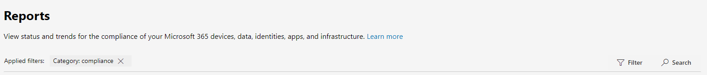

# What's new in Microsoft 365 合規性中心What's new in the Microsoft 365 compliance center

我們持續正在新增至[Microsoft 365 合規性中心](microsoft-365-compliance-center.md)的新功能、 修正的問題我們了解，並變更根據您的意見反應。We're continuously adding new features to the [Microsoft 365 compliance center](microsoft-365-compliance-center.md), fixing issues we learn about, and making changes based on your feedback. 看看下列請參閱什麼是可供您立即。Take a look below to see what's available for you today. 某些功能取得導入不同的速度我們的客戶。Some features get rolled out at different speeds to our customers. 如果沒有看到一種功能，請嘗試將自己新增至[目標版本](https://docs.microsoft.com/office365/admin/manage/release-options-in-office-365)。If you aren't seeing a feature yet, try adding yourself to [targeted release](https://docs.microsoft.com/office365/admin/manage/release-options-in-office-365).

> [!TIP]
> 感興趣其他系統管理中心中運作？Interested in what's going on in other admin centers? 請參閱下列文章：Check out these articles: [What's new in Microsoft 365 系統管理中心What's new in the Microsoft 365 admin center](https://docs.microsoft.com/office365/admin/whats-new-in-preview?view=o365-worldwide) [什麼是 SharePoint 系統管理中心新增What's new in the SharePoint admin center](https://docs.microsoft.com/sharepoint/what-s-new-in-admin-center)  
請造訪[Microsoft 365 藍圖](https://www.microsoft.com/en-us/microsoft-365/roadmap)以了解 Microsoft 365 功能已啟動、 已推出、 開發中、 已取消或先前發行。And visit the [Microsoft 365 Roadmap](https://www.microsoft.com/en-us/microsoft-365/roadmap) to learn about Microsoft 365 features that were launched, are rolling out, are in development, have been cancelled, or previously released.

## 2020 年 2 月February 2020

### 正式發行測試人員風險管理Insider risk management is officially released

請擊鼓，請...]測試人員風險管理是現在可具有下列訂閱的組織：Drum roll, please...Insider risk management is now available to organizations with the following subscriptions:

- [Microsoft 365 E5](https://go.microsoft.com/fwlink/?linkid=2120431) （付費或試用版）[Microsoft 365 E5](https://go.microsoft.com/fwlink/?linkid=2120431) (paid or trial)
- Microsoft 365 企業版 E3 訂用帳戶包含[Microsoft E5 合規性的附加元件](https://go.microsoft.com/fwlink/?linkid=2120432)Microsoft 365 Enterprise E3 subscription with the [Microsoft E5 Compliance add-on](https://go.microsoft.com/fwlink/?linkid=2120432)

設定的標題我們在自預覽版本中，包括[新的角色群組](insider-risk-management-configure.md#step-1-required-enable-permissions-for-insider-risk-management)和[整個解決方案的設定](insider-risk-management-configure.md#step-4-required-configure-insider-risk-settings)後所進行的一些加強功能。Heads up that we made some improvements since the preview release, including [new role groups](insider-risk-management-configure.md#step-1-required-enable-permissions-for-insider-risk-management) and [solution-wide settings](insider-risk-management-configure.md#step-4-required-configure-insider-risk-settings).

當然，請提供意見反應當您使用解決方案，讓我們才能繼續改進。As always, please leave feedback as you use the solution so we can continue to make improvements.

### 記錄管理Records management

將所有的記錄管理功能帶下單一雨傘這個新的解決方案。This new solution bringing all the records management capabilities under a single umbrella. 重點包括的記錄 SharePoint 和 OneDrive 的版本設定簡介及證明的記錄處置。Highlights include the introduction of records versioning for SharePoint and OneDrive and proof of disposal for records.

![在 Microsoft 365 合規性中心中的記錄管理] 頁面](../media/mcc-records-management-page.png)

[深入了解記錄管理Learn more about records management](records-management.md)

### 解決方案焦點： Facebook 和 Twitter 資料連接器Solution spotlight: Data connectors for Facebook and Twitter

資料連接器[發行上個月](#just-launched)，我們要尋找您測試下列連接器來驗證其運作如預期般出中的協助。Data connectors [released last month](#just-launched) and we're looking for your help in testing out the following connectors to validate their working as expected.

- [Facebook 商務頁面](archive-facebook-data-with-sample-connector.md)。[Facebook business pages](archive-facebook-data-with-sample-connector.md). 匯入和封存 Facebook 商務頁面至 Microsoft 365 的資料。Imports and archives data from Facebook business pages to Microsoft 365. 有所幫助例如記錄管理和 eDiscovery 的合規性解決方案。Beneficial for compliance solutions such as records management and eDiscovery.
- [Twitter](archive-twitter-data-with-sample-connector.md)。[Twitter](archive-twitter-data-with-sample-connector.md). 匯入和封存 Twitter 至 Microsoft 365 的資料。Imports and archives data from Twitter to Microsoft 365. 有所幫助例如記錄管理和 eDiscovery 的合規性解決方案。Beneficial for compliance solutions such as records management and eDiscovery.

在您設定並驗證這些連接器之後，請提供意見反應與我們連絡相關功能順利，哪些沒有，我們可以怎麼做以改善的經驗。As you set up and validate these connectors, please leave us feedback about what went well, what didn't, and what we can do to improve the experience.

## 2020 年 1 月January 2020

等候是透過。The wait is over. 對我們感感到滿意宣佈 Microsoft 365 合規性中心 」 是可供所有客戶使用 Microsoft 365、 Office 365、 Enterprise Mobility + Security (EMS) 和 Windows 10 企業版計劃。We're pleased to announce that the Microsoft 365 compliance center is available to all customers with Microsoft 365, Office 365, Enterprise Mobility + Security (EMS), and Windows 10 Enterprise plans. 任何資料或原則所管理 Office 365 安全性 & 合規性中心中可用的合規性中心，因此不需要在來回跳轉。Any data or policies you were managing in the Office 365 Security & Compliance Center are available in the compliance center, so no need to jump back and forth.

> [!TIP]
> 讀取到上個月的更新一次重新整理程式一些我們在預覽最近，以及顯示從 Office 365 安全性 & 合規性中心的符合性功能現在居住在 Microsoft 365[藍圖](#updated-compliance-solutions)的[新的解決方案](#new-compliance-solutions)。Read through last month's update again for a refresher on some of the [new solutions](#new-compliance-solutions) we previewed recently, as well as a [roadmap](#updated-compliance-solutions) showing where compliance features from the Office 365 Security & Compliance Center now live in Microsoft 365.

書籤，請前往透過現在以[https://compliance.microsoft.com](https://compliance.microsoft.com)若要巡覽您一個停駐點商店規範管理跨貴..若要深入了解更多的位元[： 閱讀本篇文章](microsoft-365-compliance-center.md)或者。Bookmark and head over now to [https://compliance.microsoft.com](https://compliance.microsoft.com) to tour your one-stop-shop for managing compliance across your org...or [read this article](microsoft-365-compliance-center.md) to dig in a bit more.

我們也發行最新及更新解決方案這個月。We also released new and updated solutions this month. 以下是的快速概覽，反白顯示。Here's a quick glance at the highlights.

### 現在存在於預覽Now in preview

**測試人員風險管理 （預覽）****Insider risk management (preview)**

我們很樂於宣布，我們測試人員風險管理解決方案現在是公開預覽。We're happy to announce that our insider risk management solution is now in public preview. 總而言之，測試人員風險管理可協助組織聰明地識別並採取測試人員風險中的動作，藉由提供：In a nutshell, insider risk management helps your organization intelligently identify and take action on insider risks by providing:

- 匿名控制，以協助確保使用者的隱私權。Anonymity controls to help ensure user privacy.
- 原生和第三方識別測試人員威脅，例如資料外洩的指標的智慧型原則範本。Intelligent policy templates with native and third-party indicators that identify insider threats, such as data leaks.
- 整合跨越的端對端調查工作流程 IT，HR 和法務小組。Integrated end-to-end investigation workflows that span across IT, HR and legal teams.

我們很樂於聽到您的想法。We'd love to hear what you think. 當您使用解決方案，提供意見反應給我們因此我們可以確保我們正在會議您的需求，我們為 head 聚集一般可用性。As you use the solution, leave us feedback so we can make sure we're meeting your needs as we head toward general availability.

[深入了解測試人員風險管理Learn more about insider risk management](insider-risk-management.md)

### 只要啟動Just launched

**通訊合規性****Communication compliance**

從 「 預覽 」 階段畢業完整的可用性，通訊的合規性是我們測試人員風險解決方案一組新的主要元件。Graduating from the preview phase to full availability, communication compliance is a key component of our new insider risk solution set. 此健全的解決方案可協助使用工作流程來偵測、 調查，並採取補救動作的郵件不符合您組織的標準的通訊風險降到最低。This robust solution helps minimize communication risks using workflows for detecting, investigating, and taking remediation actions for messages that don't meet your organization's standards.

客戶的意見反應，在預覽期間已創造精彩。Customer feedback during the preview was fantastic. 它會導致幾個增強功能，包括您快速上手，初次執行體驗調查並修復動作及更多的改良功能。It resulted in several enhancements, including a first-run experience to get you started, improvements to investigation and remediation actions, and more.

[深入了解通訊合規性Learn more about communication compliance](communication-compliance.md)

![通訊 Microsoft 365 合規性中心顯示第一個卡中的歡迎使用經驗的符合性] 頁面上](../media/mcc-communication-compliance-page-with-fre.png)

**資料連接器****Data connectors**

先前共用的空間與其他 Office 365 安全性 & 合規性中心中的 '匯入' 功能] 中，資料連接器現在有其自己的首頁在 Microsoft 365 合規性中心。Formerly sharing space with other 'Import' features in the Office 365 Security & Compliance Center, data connectors now have their very own home in the Microsoft 365 compliance center. 使用新的 「 資料連接器' 頁面來匯入和封存信箱您 Microsoft 365 組織中將資料從貴組織的人力資源 (HR) 檔案和各種協力廠商平台 （例如 Facebook、 LinkedIn、 Twitter 和立即 Bloomberg）。Use the new 'Data connectors' page to import and archive data from your organization's human resources (HR) files and various third-party platforms (like Facebook, LinkedIn, Twitter, and Instant Bloomberg) to mailboxes in your Microsoft 365 organization. 匯入之後，此資料可以管理在數個合規性解決方案，包括電子文件探索、 測試人員風險管理、 通訊合規性、 稽核、 保留原則等等。Once imported, this data can be managed in several compliance solutions, including eDiscovery, insider risk management, communication compliance, audit, retention policies, and more.

[深入了解資料連接器Learn more about data connectors](archiving-third-party-data.md)

![在 Microsoft 365 合規性中心中的資料連接器] 頁面上](../media/mcc-data-connectors-page.png)

### 值得注意的更新Noteworthy updates

**合規性分數 （預覽） 的新評估範本****New assessment templates for Compliance Score (preview)**

努力硬式項目可協助您開始之前不斷演變規範橫向中，我們的合規性分數小組運送一組新的範本，可協助您評估您的組織針對最近法規合規性狀態，並取得如何實作指南更有效率的控制項。Always working hard to help you get ahead of the ever-evolving compliance landscape, our Compliance Score team shipped a new set of templates to help you assess your organization's compliance posture against recent regulations and get guidance on how to implement more effective controls. 您會看到新範本：You'll see new templates for:

- ISO/IEC 27701:2019ISO/IEC 27701:2019
- 加州消費者隱私法 (CCPA)California Consumer Privacy Act (CCPA)
- 一般資料保護法律巴西 (Lei Geral de Proteção de Dados-LGPD)Brazil General Data Protection Law (Lei Geral de Proteção de Dados - LGPD)
- SOC 1 2 類型和 SOC 2 輸入 2SOC 1 Type 2 and SOC 2 Type 2

[深入了解合規性分數範本Learn more about Compliance Score templates](compliance-score.md#templates)

## 11 月 # A0 年 12 月 2019November & December 2019

透過假日] 下，我們已啟動推行解決方案已示範固然 Ignite 處的所有絕佳合規性。Over the holidays, we started rolling out all the great compliance solutions that were demo'd at Ignite. 大部分都是處於預覽狀態，因此進行測試時，請務必讓我們知道您的想法開啟在右下角的合規性中心的 [意見反應] 卡片。Most are in a preview state, so test them out and be sure to let us know what you think by opening the Feedback card at the bottom right of the compliance center.

### 認識新上的芳鄰]Get to know the new neighborhood

新的 Microsoft 365 合規性中心包含全新的解決方案，以及您知道，告訴 Office 365 安全性 & 合規性中心的符合性功能。The new Microsoft 365 compliance center includes brand new solutions as well as the compliance features you know and love from the Office 365 Security & Compliance Center. 讓我們來深入了解更多的位元...]Let's dig in a bit more…

#### 新的合規性解決方案New compliance solutions

您可能想知道哪些*解決方案*。You might be wondering what a *solution* is. 盡可能雲端革新完成商務的方式，也已開啟的門竊取和詐騙的新方法，並需要新的法規。As much as the cloud has revolutionized the way business is done, it's also opened the door for new methods of data theft and fraud and necessitated new regulations. 我們合規性解決方案是整合式功能，可協助您幫助您管理這些發展規範需求的集合。Our compliance solutions are collections of integrated capabilities that can help you help you manage these evolving compliance requirements. 方案的功能可能包含的原則、 提醒、 報表及更多的組合。A solution's capabilities might include a combination of policies, alerts, reports, and more.

以下是您會發現新解決方案的摘要。Here's a summary of the new solutions you'll find. 保留的其他人出眼即將推出。Keep an eye out for others coming soon.

> [!NOTE]
> 這些解決方案只有位於 Microsoft 365 合規性中心。These solutions are located only in the Microsoft 365 compliance center. 他們無法管理 Office 365 安全性 & 合規性中心。They can't be managed in the Office 365 Security & Compliance Center.
 

|**新的解決方案****New solution**|**描述****Description**|**深入了解****Learn more**|
|:-----|:-----|:-----|
|Microsoft 合規性分數 （預覽）Microsoft Compliance Score (preview)  |從[合規性管理員](compliance-manager-overview.md)為建置基礎，合規性分數是獨立功能與更簡單，更方便使用的設計，可協助您了解並改善貴組織的合規性狀態。Built from [Compliance Manager](compliance-manager-overview.md), Compliance Score is a standalone feature with a simpler, more user-friendly design that helps you understand and improve your organization's compliance posture. 它會計算測量中完成協助減少資料保護和法規的標準周圍的風險的動作您進行風險分數。It calculates a risk-based score measuring your progress in completing actions that help reduce risks around data protection and regulatory standards.  |[Microsoft 合規性分數 （預覽） 的概觀Overview of Microsoft Compliance Score (preview)](compliance-score.md)|
|解決方案目錄 （預覽）Solution catalog (preview)  |解決方案目錄是您其中一個停駐點商店探索、 學習，以及快速入門我們的合規性和風險管理解決方案。The solution catalog is your one-stop-shop for discovering, learning about, and quickly getting started with our compliance and risk management solutions. 目錄被分成三個規範類別，每個包含構成該類別的解決方案詳細資料。The catalog is organized into three compliance categories, each containing details about the solutions that make up that category. 類別包含資訊保護 & 控管、 測試人員風險管理和探索 & 回應Categories include Information protection & governance, Insider risk management, and Discovery & response  |[解決方案目錄 （預覽） 的概觀Overview of the solution catalog (preview)](microsoft-365-solution-catalog.md)|
|通訊規範 （預覽）Communication compliance (preview)  |通訊合規性是新測試人員風險管理類別，可協助通訊風險降到最低，以協助您偵測、 擷取，並採取補救動作不適當的郵件在組織中的一部分。Communication compliance is part of the new insider risk management category that helps minimize communication risks by helping you detect, capture, and take remediation actions for inappropriate messages in your organization. 解決方案擴充 Office 365 中的監督原則的功能簡介智慧型範本、 彈性修復工作流程等洞察力幾個新的增強功能。The solution extends the capabilities of supervision policies in Office 365 by introducing several new enhancements such as intelligent templates, flexible remediation workflows, and actionable insights.  |[Microsoft 365 （預覽） 的通訊合規性Communication compliance in Microsoft 365 (preview)](communication-compliance.md)|
|資料分類 （預覽）Data classification (preview)  |我們新資料分類] 頁面包含強大的見解和工具，以協助您找出並評估如何機密資訊及標籤 （保留和敏感度） 中所使用的內容整個組織。Our new Data classification page contains powerful insights and tools to help you discover and evaluate how sensitive info and labels (retention and sensitivity) are being used in content across your organization. 檢閱內容包含機密資訊，或必須套用的標籤、 標籤活動探索 Microsoft 365 位置不同，建立自訂機密資訊類型，以及執行更多功能。Review content that contains sensitive info or has labels applied, explore label activity across Microsoft 365 locations, create custom sensitive info types, and much more. |[資料分類概觀 (預覽)Data classification overview (preview)](data-classification-overview.md)|
|Trainable 相關性 （預覽）Trainable classifiers (preview)  |此功能強大新工具會使用我們機器學習引擎協助識別您的組織，例如法規文件或員工協議中的內容類別。This powerful new tool uses our machine learning engine to help identify categories of content in your org, like regulatory docs or employee agreements. 建立之後，可以使用相關性數個合規性解決方案中偵測相關的內容和分類、 保護其、 保留，以及更多。Once created, classifiers can be used in several compliance solutions to detect related content and classify it, protect it, retain it, and more. |[開始使用可訓練的分類器 (預覽)Getting started with trainable classifiers (preview)](classifier-getting-started-with.md)|

#### 更新的合規性解決方案Updated compliance solutions

如果您已為您的法務遵循需求使用 Office 365 安全性 & 合規性中心，您可能會覺得奇怪，其中部分功能現在 live 中新的 Microsoft 365 合規性中心。If you've been using the Office 365 Security & Compliance Center for your compliance needs, you might wonder where some features now live in the new Microsoft 365 compliance center. 以下是可以協助您尋找新家裡快速藍圖。Here's a quick roadmap to help find their new homes.

> [!NOTE]
> 一些功能包括： 只在 Office 365 安全性 & 規範中心 – 仍然可以使用這些會記下下方。Some features are still available only in the Office 365 Security & Compliance Center – these are noted below. 但致力預覽這些在 Microsoft 365 合規性中心，因此請密切注意更新。But we're working hard to preview these in the Microsoft 365 compliance center, so stay tuned for updates. 
 

|**功能****Feature**|**Office 365 安全性與合規性中心****Office 365 Security & Compliance Center**|**Microsoft 365 合規性中心****Microsoft 365 compliance center**|**深入了解****Learn more**|
|:-----|:-----|:-----|:-----|
|進階電子文件探索Advanced eDiscovery|eDiscovery > 進階電子文件eDiscovery > Advanced eDiscovery   https://protection.office.com/advancedediscoverycases |eDiscovery # A0 進階eDiscovery > Advanced   https://compliance.microsoft.com/advancedediscovery | [在 Microsoft 365 進階電子文件解決方案的概觀Overview of the Advanced eDiscovery solution in Microsoft 365](overview-ediscovery-20.md) |
|警示原則Alert policies|在提醒 > 警示原則Alerts > Alert policies   https://protection.office.com/alertpolicies |在這個階段中，只能在 Office 365 安全性 & 合規性中心中管理警示原則。At this time, alert policies are managed only in the Office 365 Security & Compliance Center. |[在安全性與合規性中心中的警示原則Alert policies in the security and compliance center](alert-policies.md) |
|警示Alerts|警示 > 檢視警示Alerts > View alerts   https://protection.office.com/viewalerts |警示Alerts   https://compliance.microsoft.com/compliancealerts |[檢視警示Viewing alerts](alert-policies.md#viewing-alerts)|
|封存Archive|資訊控管 # A0 封存Information governance > Archive   https://protection.office.com/archiving |資訊控管 > 封存] 索引標籤Information governance > Archive tab   https://compliance.microsoft.com/informationgovernance?viewid=archive |[啟用封存信箱Enable archive mailboxes](enable-archive-mailboxes.md)|
|稽核記錄檔搜尋Audit log search|搜尋 > 稽核記錄搜尋Search > Audit log search   https://protection.office.com/unifiedauditlog |稽核Audit   https://compliance.microsoft.com/auditlogsearch | [在安全性 & 規範中心搜尋稽核記錄Search the audit log in the Security & Compliance Center](search-the-audit-log-in-security-and-compliance.md)|
|內容搜尋Content search|搜尋 > 內容搜尋Search > Content search   https://protection.office.com/contentsearchbeta?ContentOnly=1 | 內容搜尋Content search   https://compliance.microsoft.com/contentsearch |[在 Office 365 中搜尋內容Search for content in Office 365](search-for-content.md) |
|資料連接器Data connectors|資訊控管 # A0 封存協力廠商資料Information governance > Archive third-party data   https://protection.office.com/nativeconnector | 資料連接器Data connectors   https://compliance.microsoft.com/connectorlanding |[封存協力廠商資料Archive third-party data](archiving-third-party-data.md)|
|資料外洩防護Data loss prevention|資料外洩防護Data loss prevention   https://protection.office.com/datalossprevention |資料外洩防護Data loss prevention   https://compliance.microsoft.com/datalossprevention |[資料外洩防護概觀Overview of data loss prevention](data-loss-prevention-policies.md)|
|資料主體要求Data subject requests |資料隱私權 > 資料主體要求Data privacy > Data subject requests   https://protection.office.com/dsrcases |資料主體要求Data subject requests   https://compliance.microsoft.com/datasubjectrequest |[管理 GDPR 資料主體要求使用 DSR 案例工具Manage GDPR data subject requests with the DSR case tool](manage-gdpr-data-subject-requests-with-the-dsr-case-tool.md)|
|電子文件探索eDiscovery|eDiscovery > eDiscoveryeDiscovery > eDiscovery   https://protection.office.com/ediscoveryv1 |eDiscovery # A0 核心eDiscovery > Core   https://compliance.microsoft.com/classicediscovery |[管理電子文件探索案例Manage eDiscovery cases](ediscovery-cases.md) |
|EventsEvents|記錄管理 # A0 事件Records management > Events   https://protection.office.com/events |記錄管理 > 事件] 索引標籤Records management > Events tab   https://compliance.microsoft.com/recordsmanagement?viewid=events |[事件導向保留的概觀Overview of event-driven retention](event-driven-retention.md)|
|檔案計畫File plan|記錄管理 > 檔案計劃Records management > File plan   https://protection.office.com/fileplan |記錄管理 > 檔案計劃] 索引標籤Records management > File plan tab   https://compliance.microsoft.com/recordsmanagement?viewid=fileplan |[檔案計劃管理員的概觀Overview of file plan manager](file-plan-manager.md)|
|匯入 PST 檔案Import PST files|資訊控管 > 匯入 PST 檔案Information governance > Import PST files   https://protection.office.com/importV2 |資訊控管 > 匯入] 索引標籤Information governance > Import tab   https://compliance.microsoft.com/informationgovernance?viewid=import |[匯入組織的 PST 檔案的概觀Overview of importing your organization's PST files](importing-pst-files-to-office-365.md)|
|標籤活動總管Label activity explorer|資訊控管 > 標籤活動總管Information governance > Label activity explorer   https://protection.office.com/labelexplorer |資料分類 > 活動總管] 索引標籤Data classification > Activity explorer tab   https://compliance.microsoft.com/dataclassification?viewid=activitiesexplorer |[檢視套用標籤的內容上的活動 (預覽)View activity on your labeled content (preview)](data-classification-activity-explorer.md)|
|保留標籤和標籤原則Retention labels and label policies |分類 > 保留標籤 > 標籤和標籤原則] 索引標籤Classification > Retention labels > Labels and Label policies tabs   https://protection.office.com/retentionlabels |資訊控管 > 標籤並將標籤原則] 索引標籤Information governance > Labels and Label policies tabs   https://compliance.microsoft.com/informationgovernance?viewid=labels   https://compliance.microsoft.com/informationgovernance?viewid=labelpolicies | [保留標籤概觀Overview of retention labels](labels.md)|
|保留原則Retention policies|資訊控管 # A0 保留Information governance > Retention   https://protection.office.com/retention |資訊控管 > 保留] 索引標籤Information governance > Retention tab   https://compliance.microsoft.com/informationgovernance?viewid=retention |[保留原則概觀Overview of retention policies](retention-policies.md)|
|機密資訊類型Sensitive info types|分類 > 機密資訊類型Classification > Sensitive info types   https://protection.office.com/sensitivetypes |資料分類 > 機密資訊類型] 索引標籤Data classification > Sensitive info types tab   https://compliance.microsoft.com/dataclassification?viewid=sensitiveinfotypes |[敏感性資訊類型在找什麼What the sensitive information types look for](what-the-sensitive-information-types-look-for.md)|
|敏感度標籤和標籤原則Sensitivity labels and label policies|分類 > 敏感度標籤 > 標籤和標籤原則] 索引標籤Classification > Sensitivity labels > Labels and Label policies tabs   https://protection.office.com/sensitivity |資訊保護 > 標籤並將標籤原則] 索引標籤Information protection > Labels and Label policies tabs   https://compliance.microsoft.com/informationprotection?viewid=sensitivitylabels   https://compliance.microsoft.com/informationprotection?viewid=sensitivitylabelpolicies |[了解敏感度標籤Learn about sensitivity labels](sensitivity-labels.md) |
|服務保證Service assurance|服務保證Service assurance   https://protection.office.com/serviceassurance/dashboard |在這個階段中，服務保證資源只可以存取 Office 365 安全性 & 合規性中心。At this time, service assurance resources can only be accessed in the Office 365 Security & Compliance Center. |[安全性 & 合規性中心中的服務保證Service assurance in the Security & Compliance Center](service-assurance.md)|
|監督Supervision|監督Supervision   https://protection.office.com/supervisoryreviewv2 |通訊合規性Communication compliance   https://compliance.microsoft.com/supervisoryreview |[Microsoft 365 （預覽） 的通訊合規性Communication compliance in Microsoft 365 (preview)](communication-compliance.md) |

## 2019 年 9 月September 2019

想知道為何在發行前方安靜本月嗎？Wondering why it's quiet on the release front this month? 我們向下建立新的創新合規性解決方案，將會在[Microsoft Ignite](https://www.microsoft.com/ignite)市年 11 月中的標題。We're heads down building new, innovative compliance solutions that'll be unveiled at [Microsoft Ignite](https://www.microsoft.com/ignite) in November. 持續關注 ！Stay tuned!

### 敏感度標籤的新的加密選項New encryption options for sensitivity labels 

當設定敏感度標籤的加密，您現在有兩個選項，可讓它們以手動方式將標籤套用至電子郵件和文件時，指派權限的使用者：When configuring encryption for a sensitivity label, you now have two options that lets users assign permissions when they manually apply the label to email and docs: 
- 當將標籤套用至**Outlook 電子郵件**，使用者可以強制執行相當於 [不要轉寄] 選項的限制。When applying the label to **Outlook email**, users can enforce restrictions equivalent to the Do Not Forward option. 收件者無法閱讀郵件，但不可轉寄、 列印或複製內容。Recipients will be able to read the message but not forward, print, or copy the content.
- 當將標籤套用至**Word、 PowerPoint 和 Excel 檔案**，將會提示使用者將存取權限指派給特定使用者和群組。When applying the label to **Word, PowerPoint, and Excel files**, users will be prompted to assign access permissions to specific users and groups.

[深入了解Learn more](encryption-sensitivity-labels.md#let-users-assign-permissions)

## 2019 年 8 月August 2019

### 更新資料調查Update to data investigations

當執行資料調查，您現在可以從其原始位置刪除項目。When performing a data investigation, you can now delete items from their original locations. 這表示您可以從 Exchange 信箱、 SharePoint 網站與 OneDrive 帳戶刪除項目，整個組織。This means you can delete items from Exchange mailboxes, SharePoint sites, and OneDrive accounts across your organization. 因為您以作為證據收集項目，您必須複製這些保留在辨識項設為您可以進一步調查，或只保留做為參考。Because you collected the items as evidence, you'll have copies of them retained in the evidence set to you can investigate further or just keep as a reference. [深入了解Learn more](manage-data-spillage-incidents.md#step-4-delete-the-spilled-data) 

## 2019 年 7 月July 2019

### 新的系統管理員角色New admin roles

我們已發行兩個新系統管理員角色，以協助您管理安全性與合規性貴操作說明搜尋組織中的所有您的朋友。We released two new admin roles to help manage security and compliance in your org. Tell all your friends.

- **合規性資料系統管理員**。與此角色的使用者有權限保護，並追蹤 Microsoft 365 合規性中心、 Microsoft 365 系統管理中心，以及 Azure 中的資料。**Compliance data admin**. Users with this role have permissions to protect and track data in the Microsoft 365 compliance center, Microsoft 365 admin center, and Azure. 他們也可以管理每個項目在 Exchange 系統管理中心，合規性管理員中，商務版系統管理中心的 Teams & Skype，並建立 Azure 和 Microsoft 365 的支援票證。They can also manage everything the Exchange admin center, Compliance Manager, Teams & Skype for Business admin center and create support tickets for Azure and Microsoft 365.
- **安全性運算子**。**Security operator**. 與此角色的使用者可以管理警示，讓全域唯讀存取的安全性相關的功能，包括 Microsoft 365 安全中心]，[Azure Active Directory，Identity Protection、 特殊權限的身分識別管理和 Office 365 安全性 & 規範中心中的所有項目。Users with this role can manage alerts and have global read-only access to security-related features, including everything in the Microsoft 365 security center, Azure Active Directory, Identity Protection, Privileged Identity Management and Office 365 Security & Compliance Center.

[深入了解這些角色Learn more about these roles](https://docs.microsoft.com/microsoft-365/security//office-365-security/permissions-microsoft-365-compliance-security)

### 搜尋和篩選，以便報告Search and filtering for reports

不需捲動 sea 的報告，找出您想。No more scrolling through a sea of reports to find the ones you want. 您可以現在 （根據其標題） 的報告和類別篩選搜尋 like '標籤' 和 '規範' 和 'Office 365' 和' Microsoft Cloud App Security' 等的來源。You can now search for reports (based on their titles) and filter on categories like 'Labels' and 'Compliance' and sources like 'Office 365' and 'Microsoft Cloud App Security'.

