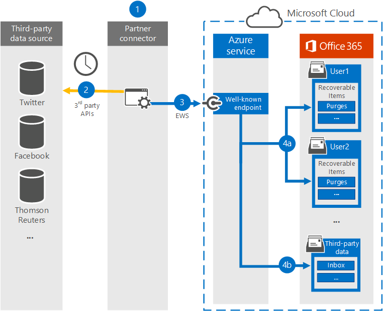

# <a name="work-with-a-partner-to-archive-third-party-data"></a><span data-ttu-id="fef1f-104">與合作夥伴配合來封存第三方資料</span><span class="sxs-lookup"><span data-stu-id="fef1f-104">Work with a partner to archive third-party data</span></span>

<span data-ttu-id="fef1f-105">您可以與 Microsoft 合作夥伴合作，匯入協力廠商資料來源中的資料，並將其封存至 Microsoft 365。</span><span class="sxs-lookup"><span data-stu-id="fef1f-105">You can work with a Microsoft Partner to import and archive data from a third-party data source to Microsoft 365.</span></span> <span data-ttu-id="fef1f-106">協力廠商可為您提供自訂連接器，以設定為從協力廠商資料來源提取專案（定期），然後匯入這些專案。</span><span class="sxs-lookup"><span data-stu-id="fef1f-106">A partner can provide you with a custom connector that is configured to extract items from the third-party data source (on a regular basis) and then import those items.</span></span> <span data-ttu-id="fef1f-107">夥伴連接器會將專案的內容從資料來源轉換成電子郵件訊息格式，然後將專案儲存在信箱中。</span><span class="sxs-lookup"><span data-stu-id="fef1f-107">The partner connector converts the content of an item from the data source to an email message format and then stores the items in mailboxes.</span></span> <span data-ttu-id="fef1f-108">匯入協力廠商資料後，您可以將 Microsoft 365 規範功能（例如訴訟暫止、內容搜尋、In-Place 封存、審核和 Microsoft 365 保留原則）套用至此資料。</span><span class="sxs-lookup"><span data-stu-id="fef1f-108">After third-party data is imported, you can apply Microsoft 365 compliance features such as Litigation Hold, Content Search, In-Place Archiving, Auditing, and Microsoft 365 retention policies to this data.</span></span>
  
<span data-ttu-id="fef1f-109">以下是與 Microsoft 合作夥伴合作以匯入協力廠商資料所需的程式和步驟。</span><span class="sxs-lookup"><span data-stu-id="fef1f-109">Here's an overview of the process and the steps necessary to work with a Microsoft Partner to import third-party data.</span></span>

[<span data-ttu-id="fef1f-110">Step 1: Find a third-party data partner</span><span class="sxs-lookup"><span data-stu-id="fef1f-110">Step 1: Find a third-party data partner</span></span>](#step-1-find-a-third-party-data-partner)

[<span data-ttu-id="fef1f-111">步驟2：建立並設定協力廠商資料信箱</span><span class="sxs-lookup"><span data-stu-id="fef1f-111">Step 2: Create and configure a third-party data mailbox</span></span>](#step-2-create-and-configure-a-third-party-data-mailbox-in-office-365)

[<span data-ttu-id="fef1f-112">Step 3: Configure user mailboxes for third-party data</span><span class="sxs-lookup"><span data-stu-id="fef1f-112">Step 3: Configure user mailboxes for third-party data</span></span>](#step-3-configure-user-mailboxes-for-third-party-data)

[<span data-ttu-id="fef1f-113">步驟 4：提供資訊給合作夥伴</span><span class="sxs-lookup"><span data-stu-id="fef1f-113">Step 4: Provide your partner with information</span></span>](#step-4-provide-your-partner-with-information)

[<span data-ttu-id="fef1f-114">步驟5：在 Azure Active Directory 中註冊協力廠商資料連線器</span><span class="sxs-lookup"><span data-stu-id="fef1f-114">Step 5: Register the third-party data connector in Azure Active Directory</span></span>](#step-5-register-the-third-party-data-connector-in-azure-active-directory)

## <a name="how-the-third-party-data-import-process-works"></a><span data-ttu-id="fef1f-115">協力廠商資料匯入程序的運作方式</span><span class="sxs-lookup"><span data-stu-id="fef1f-115">How the third-party data import process works</span></span>

<span data-ttu-id="fef1f-116">下列圖例和描述說明協力廠商資料匯入程式在使用合作夥伴時的運作方式。</span><span class="sxs-lookup"><span data-stu-id="fef1f-116">The following illustration and description explain how the third-party data import process works when working with a partner.</span></span>
  

  
1. <span data-ttu-id="fef1f-118">客戶可以使用其選擇的合作夥伴，設定將從協力廠商資料來源提取專案的連接器，然後將這些專案匯入至 Microsoft 365。</span><span class="sxs-lookup"><span data-stu-id="fef1f-118">Customer works with their partner of choice to configure a connector that will extract items from the third-party data source and then import those items to Microsoft 365.</span></span>
    
2. <span data-ttu-id="fef1f-119">夥伴連接器會透過協力廠商 API （根據排程或設定的基礎）連線至協力廠商資料來源，並從資料來源提取專案。</span><span class="sxs-lookup"><span data-stu-id="fef1f-119">The partner connector connects to third-party data sources via a third-party API (on a scheduled or as-configured basis) and extracts items from the data source.</span></span> <span data-ttu-id="fef1f-120">協力廠商連接器會將項目的內容轉換為電子郵件訊息格式。</span><span class="sxs-lookup"><span data-stu-id="fef1f-120">The partner connector converts the content of an item to an email message format.</span></span> <span data-ttu-id="fef1f-121">請參閱[More information](#more-information)一節以取得郵件格式架構的描述。</span><span class="sxs-lookup"><span data-stu-id="fef1f-121">See the [More information](#more-information) section for a description of the message-format schema.</span></span> 
    
3. <span data-ttu-id="fef1f-122">夥伴連接器會透過已知端點透過 Exchange Web 服務（EWS），連接至 Microsoft 365 中的 Azure 服務。</span><span class="sxs-lookup"><span data-stu-id="fef1f-122">Partner connector connects to the Azure service in Microsoft 365 by using Exchange Web Service (EWS) via a well-known end point.</span></span>
    
4. <span data-ttu-id="fef1f-p104">項目是匯入至特定使用者的信箱或「全部擷取」協力廠商資料信箱。項目匯入至特定使用者信箱還是協力廠商資料信箱，是根據下列準則：</span><span class="sxs-lookup"><span data-stu-id="fef1f-p104">Items are imported into the mailbox of a specific user or into a "catch-all" third-party data mailbox. Whether an item is imported into a specific user mailbox or to the third-party data mailbox is based on the following criteria:</span></span>
    
    <span data-ttu-id="fef1f-125">a.</span><span class="sxs-lookup"><span data-stu-id="fef1f-125">a.</span></span> <span data-ttu-id="fef1f-126">**具有對應至使用者帳戶之使用者識別碼的專案：** 如果夥伴連接器可將協力廠商資料來源中專案的使用者識別碼對應至 Office 365 中的特定使用者識別碼，該專案會複製到使用者的 [可復原的專案] 資料夾中的 [**清除**] 資料夾。</span><span class="sxs-lookup"><span data-stu-id="fef1f-126">**Items that have a user ID that corresponds to an user account:** If the partner connector can map the user ID of the item in the third-party data source to a specific user ID in Office 365, the item is copied to the **Purges** folder in the user's Recoverable Items folder.</span></span> <span data-ttu-id="fef1f-127">使用者無法存取 [清除] 資料夾中的項目。</span><span class="sxs-lookup"><span data-stu-id="fef1f-127">Users can't access items in the Purges folder.</span></span> <span data-ttu-id="fef1f-128">不過，您可以使用 eDiscovery 工具來搜尋 [清除] 資料夾中的專案。</span><span class="sxs-lookup"><span data-stu-id="fef1f-128">However, you can use eDiscovery tools to search for items in the Purges folder.</span></span>
    
    <span data-ttu-id="fef1f-129">b.</span><span class="sxs-lookup"><span data-stu-id="fef1f-129">b.</span></span> <span data-ttu-id="fef1f-130">**沒有對應至使用者帳戶的使用者識別碼的專案：** 如果 partner connector 無法將專案的使用者識別碼對應至特定的使用者識別碼，該專案會複製到協力廠商資料信箱的 [**收件**匣] 資料夾。</span><span class="sxs-lookup"><span data-stu-id="fef1f-130">**Items that don't have a user ID that corresponds to an user account:** If the partner connector can't map the user ID of an item to a specific user ID, the item is copied to the **Inbox** folder of the third-party data mailbox.</span></span> <span data-ttu-id="fef1f-131">將項目匯入至收件匣可讓您或組織中的某個人登入協力廠商信箱來檢視和管理這些項目，並查看是否需要在協力廠商連接器組態中進行任何調整。</span><span class="sxs-lookup"><span data-stu-id="fef1f-131">Importing items to the inbox allows you or someone in your organization to sign in to the third-party mailbox to view and manage these items, and see if any adjustments need to be made in the partner connector configuration.</span></span>
 
## <a name="step-1-find-a-third-party-data-partner"></a><span data-ttu-id="fef1f-132">步驟 1：尋找協力廠商資料合作夥伴</span><span class="sxs-lookup"><span data-stu-id="fef1f-132">Step 1: Find a third-party data partner</span></span>

<span data-ttu-id="fef1f-133">在 Microsoft 365 中封存協力廠商資料的主要元件，是尋找和使用專用於從協力廠商資料來源捕獲資料，並將資料匯入 Office 365 的 Microsoft 合作夥伴。</span><span class="sxs-lookup"><span data-stu-id="fef1f-133">A key component for archiving third-party data in Microsoft 365 is finding and working with a Microsoft partner that specializes in capturing data from a third-party data source and importing it to Office 365.</span></span> <span data-ttu-id="fef1f-134">在匯入資料之後，可以將其封存及保留，以及組織的其他 Microsoft 資料，例如來自 Exchange 的電子郵件，以及來自 SharePoint 和 OneDrive 商務的檔。</span><span class="sxs-lookup"><span data-stu-id="fef1f-134">After the data is imported, it can be archived and preserved along with your organization's other Microsoft data, such as email from Exchange and documents from SharePoint and OneDrive for Business.</span></span> <span data-ttu-id="fef1f-135">合作夥伴會建立從您組織的協力廠商資料來源（例如 BlackBerry、Facebook、Google +、Thomson Reuters、Twitter 及 YouTube）提取資料的連接器，並將該資料傳遞到以電子郵件形式將專案匯入 Exchange 信箱的 Office 365 API。</span><span class="sxs-lookup"><span data-stu-id="fef1f-135">A partner creates a connector that extracts data from your organization's third-party data sources (such as BlackBerry, Facebook, Google+, Thomson Reuters, Twitter, and YouTube) and passes that data to an Office 365 API that imports items to Exchange mailboxes as email messages.</span></span> 
  
<span data-ttu-id="fef1f-136">下列各節列出參與程式以在 Office 365 中封存協力廠商資料的 Microsoft 合作夥伴（和其所支援的協力廠商資料來源）。</span><span class="sxs-lookup"><span data-stu-id="fef1f-136">The following sections list the Microsoft partners (and the third-party data sources they support) that are participating in the program for archiving third-party data in Office 365.</span></span>

[<span data-ttu-id="fef1f-137">17a-4 LLC</span><span class="sxs-lookup"><span data-stu-id="fef1f-137">17a-4 LLC</span></span>](#17a-4-llc)
  
[<span data-ttu-id="fef1f-138">ArchiveSocial</span><span class="sxs-lookup"><span data-stu-id="fef1f-138">ArchiveSocial</span></span>](#archivesocial)
  
[<span data-ttu-id="fef1f-139">Globanet</span><span class="sxs-lookup"><span data-stu-id="fef1f-139">Globanet</span></span>](#globanet)
  
[<span data-ttu-id="fef1f-140">OpenText</span><span class="sxs-lookup"><span data-stu-id="fef1f-140">OpenText</span></span>](#opentext)
  
[<span data-ttu-id="fef1f-141">Smarsh</span><span class="sxs-lookup"><span data-stu-id="fef1f-141">Smarsh</span></span>](#smarsh)

[<span data-ttu-id="fef1f-142">Verba</span><span class="sxs-lookup"><span data-stu-id="fef1f-142">Verba</span></span>](#verba)
  
### <a name="17a-4-llc"></a><span data-ttu-id="fef1f-143">17a-4 LLC</span><span class="sxs-lookup"><span data-stu-id="fef1f-143">17a-4 LLC</span></span>

<span data-ttu-id="fef1f-144">[17A-4 LLC](https://www.17a-4.com)支援下列協力廠商資料來源：</span><span class="sxs-lookup"><span data-stu-id="fef1f-144">[17a-4 LLC](https://www.17a-4.com) supports the following third-party data sources:</span></span>
  
- <span data-ttu-id="fef1f-145">BlackBerry</span><span class="sxs-lookup"><span data-stu-id="fef1f-145">BlackBerry</span></span>
    
- <span data-ttu-id="fef1f-146">Bloomberg 資料流</span><span class="sxs-lookup"><span data-stu-id="fef1f-146">Bloomberg Data Streams</span></span>
    
- <span data-ttu-id="fef1f-147">Cisco Jabber</span><span class="sxs-lookup"><span data-stu-id="fef1f-147">Cisco Jabber</span></span>
    
- <span data-ttu-id="fef1f-148">FactSet</span><span class="sxs-lookup"><span data-stu-id="fef1f-148">FactSet</span></span>
    
- <span data-ttu-id="fef1f-149">HipChat</span><span class="sxs-lookup"><span data-stu-id="fef1f-149">HipChat</span></span>
    
- <span data-ttu-id="fef1f-150">InvestEdge</span><span class="sxs-lookup"><span data-stu-id="fef1f-150">InvestEdge</span></span>
    
- <span data-ttu-id="fef1f-151">LivePerson</span><span class="sxs-lookup"><span data-stu-id="fef1f-151">LivePerson</span></span>
    
- <span data-ttu-id="fef1f-152">MessageLabs 資料流</span><span class="sxs-lookup"><span data-stu-id="fef1f-152">MessageLabs Data Streams</span></span>
    
- <span data-ttu-id="fef1f-153">OpenText</span><span class="sxs-lookup"><span data-stu-id="fef1f-153">OpenText</span></span>
    
- <span data-ttu-id="fef1f-154">Oracle/ATG 'click-to-call' 即時說明</span><span class="sxs-lookup"><span data-stu-id="fef1f-154">Oracle/ATG 'click-to-call' Live Help</span></span>
    
- <span data-ttu-id="fef1f-155">樞紐分析 IMTRADER</span><span class="sxs-lookup"><span data-stu-id="fef1f-155">Pivot IMTRADER</span></span>
    
- <span data-ttu-id="fef1f-156">Microsoft SharePoint</span><span class="sxs-lookup"><span data-stu-id="fef1f-156">Microsoft SharePoint</span></span>
    
- <span data-ttu-id="fef1f-157">MindAlign</span><span class="sxs-lookup"><span data-stu-id="fef1f-157">MindAlign</span></span>
    
- <span data-ttu-id="fef1f-158">Sitrion One (Newsgator)</span><span class="sxs-lookup"><span data-stu-id="fef1f-158">Sitrion One (Newsgator)</span></span>
    
- <span data-ttu-id="fef1f-159">商務用 Skype (Lync/OCS)</span><span class="sxs-lookup"><span data-stu-id="fef1f-159">Skype for Business (Lync/OCS)</span></span>
    
- <span data-ttu-id="fef1f-160">商務用 Skype Online (Lync Online)</span><span class="sxs-lookup"><span data-stu-id="fef1f-160">Skype for Business Online (Lync Online)</span></span>
    
- <span data-ttu-id="fef1f-161">SQL 資料庫</span><span class="sxs-lookup"><span data-stu-id="fef1f-161">SQL Databases</span></span>
    
- <span data-ttu-id="fef1f-162">Squawker</span><span class="sxs-lookup"><span data-stu-id="fef1f-162">Squawker</span></span>
    
- <span data-ttu-id="fef1f-163">Thomson Reuters Eikon Messenger</span><span class="sxs-lookup"><span data-stu-id="fef1f-163">Thomson Reuters Eikon Messenger</span></span>
  

  
### <a name="archivesocial"></a><span data-ttu-id="fef1f-164">ArchiveSocial</span><span class="sxs-lookup"><span data-stu-id="fef1f-164">ArchiveSocial</span></span>

<span data-ttu-id="fef1f-165">[ArchiveSocial](https://www.archivesocial.com)支援下列協力廠商資料來源：</span><span class="sxs-lookup"><span data-stu-id="fef1f-165">[ArchiveSocial ](https://www.archivesocial.com) supports the following third-party data sources:</span></span> 
  
- <span data-ttu-id="fef1f-166">Facebook</span><span class="sxs-lookup"><span data-stu-id="fef1f-166">Facebook</span></span>
    
- <span data-ttu-id="fef1f-167">Flickr</span><span class="sxs-lookup"><span data-stu-id="fef1f-167">Flickr</span></span>
    
- <span data-ttu-id="fef1f-168">Instagram</span><span class="sxs-lookup"><span data-stu-id="fef1f-168">Instagram</span></span>
    
- <span data-ttu-id="fef1f-169">LinkedIn</span><span class="sxs-lookup"><span data-stu-id="fef1f-169">LinkedIn</span></span>
    
- <span data-ttu-id="fef1f-170">Pinterest</span><span class="sxs-lookup"><span data-stu-id="fef1f-170">Pinterest</span></span>
    
- <span data-ttu-id="fef1f-171">Twitter</span><span class="sxs-lookup"><span data-stu-id="fef1f-171">Twitter</span></span>
    
- <span data-ttu-id="fef1f-172">YouTube</span><span class="sxs-lookup"><span data-stu-id="fef1f-172">YouTube</span></span>
    
- <span data-ttu-id="fef1f-173">Vimeo</span><span class="sxs-lookup"><span data-stu-id="fef1f-173">Vimeo</span></span>
  
### <a name="globanet"></a><span data-ttu-id="fef1f-174">Globanet</span><span class="sxs-lookup"><span data-stu-id="fef1f-174">Globanet</span></span>

<span data-ttu-id="fef1f-175">[Globanet](https://www.globanet.com)支援下列協力廠商資料來源：</span><span class="sxs-lookup"><span data-stu-id="fef1f-175">[Globanet](https://www.globanet.com) supports the following third-party data sources:</span></span> 
  
- <span data-ttu-id="fef1f-176">含樞紐分析用戶端的 AOL</span><span class="sxs-lookup"><span data-stu-id="fef1f-176">AOL with Pivot Client</span></span> 
    
- <span data-ttu-id="fef1f-177">BlackBerry Call Logs (v5、v10、v12)</span><span class="sxs-lookup"><span data-stu-id="fef1f-177">BlackBerry Call Logs (v5, v10, v12)</span></span>
    
- <span data-ttu-id="fef1f-178">BlackBerry Messenger (v5、v10、v12)</span><span class="sxs-lookup"><span data-stu-id="fef1f-178">BlackBerry Messenger (v5, v10, v12)</span></span>
    
- <span data-ttu-id="fef1f-179">BlackBerry PIN (v5、v10、v12)</span><span class="sxs-lookup"><span data-stu-id="fef1f-179">BlackBerry PIN (v5, v10, v12)</span></span>
    
- <span data-ttu-id="fef1f-180">BlackBerry SMS (v5、v10、v12)</span><span class="sxs-lookup"><span data-stu-id="fef1f-180">BlackBerry SMS (v5, v10, v12)</span></span>
    
- <span data-ttu-id="fef1f-181">Bloomberg Chat</span><span class="sxs-lookup"><span data-stu-id="fef1f-181">Bloomberg Chat</span></span>
    
- <span data-ttu-id="fef1f-182">Bloomberg 郵件</span><span class="sxs-lookup"><span data-stu-id="fef1f-182">Bloomberg Mail</span></span>
    
- <span data-ttu-id="fef1f-183">Box</span><span class="sxs-lookup"><span data-stu-id="fef1f-183">Box</span></span>
    
- <span data-ttu-id="fef1f-184">CipherCloud for Salesforce Chatter</span><span class="sxs-lookup"><span data-stu-id="fef1f-184">CipherCloud for Salesforce Chatter</span></span>
    
- <span data-ttu-id="fef1f-185">Cisco IM &amp;顯示伺服器（v10，v v10.5.1 SU1，v 11.0，v 11.5 SU2）</span><span class="sxs-lookup"><span data-stu-id="fef1f-185">Cisco IM &amp; Presence Server (v10, v10.5.1 SU1, v11.0, v11.5 SU2)</span></span>

- <span data-ttu-id="fef1f-186">Cisco Webex 小組</span><span class="sxs-lookup"><span data-stu-id="fef1f-186">Cisco Webex Teams</span></span>

- <span data-ttu-id="fef1f-187">Citrix 工作&amp;區 ShareFile</span><span class="sxs-lookup"><span data-stu-id="fef1f-187">Citrix Workspace &amp; ShareFile</span></span>

- <span data-ttu-id="fef1f-188">CrowdCompass</span><span class="sxs-lookup"><span data-stu-id="fef1f-188">CrowdCompass</span></span>

- <span data-ttu-id="fef1f-189">自訂分隔的文字檔</span><span class="sxs-lookup"><span data-stu-id="fef1f-189">Custom-delimited text files</span></span>
    
- <span data-ttu-id="fef1f-190">自訂 XML 檔案</span><span class="sxs-lookup"><span data-stu-id="fef1f-190">Custom XML files</span></span>
    
- <span data-ttu-id="fef1f-191">Facebook （頁面）</span><span class="sxs-lookup"><span data-stu-id="fef1f-191">Facebook (Pages)</span></span>
    
- <span data-ttu-id="fef1f-192">Factset</span><span class="sxs-lookup"><span data-stu-id="fef1f-192">Factset</span></span>
    
- <span data-ttu-id="fef1f-193">FXConnect</span><span class="sxs-lookup"><span data-stu-id="fef1f-193">FXConnect</span></span>
    
- <span data-ttu-id="fef1f-194">ICE Chat/YellowJacket</span><span class="sxs-lookup"><span data-stu-id="fef1f-194">ICE Chat/YellowJacket</span></span>
    
- <span data-ttu-id="fef1f-195">搖擺</span><span class="sxs-lookup"><span data-stu-id="fef1f-195">Jive</span></span>
    
- <span data-ttu-id="fef1f-196">Macgregor XIP</span><span class="sxs-lookup"><span data-stu-id="fef1f-196">Macgregor XIP</span></span>

- <span data-ttu-id="fef1f-197">Microsoft Exchange Server</span><span class="sxs-lookup"><span data-stu-id="fef1f-197">Microsoft Exchange Server</span></span>
    
- <span data-ttu-id="fef1f-198">Microsoft OneDrive for Business</span><span class="sxs-lookup"><span data-stu-id="fef1f-198">Microsoft OneDrive for Business</span></span>

- <span data-ttu-id="fef1f-199">Microsoft Teams</span><span class="sxs-lookup"><span data-stu-id="fef1f-199">Microsoft Teams</span></span>
       
- <span data-ttu-id="fef1f-200">Microsoft Yammer</span><span class="sxs-lookup"><span data-stu-id="fef1f-200">Microsoft Yammer</span></span>
    
- <span data-ttu-id="fef1f-201">Mobile Guard</span><span class="sxs-lookup"><span data-stu-id="fef1f-201">Mobile Guard</span></span>
    
- <span data-ttu-id="fef1f-202">樞紐</span><span class="sxs-lookup"><span data-stu-id="fef1f-202">Pivot</span></span>
    
- <span data-ttu-id="fef1f-203">Salesforce Chatter</span><span class="sxs-lookup"><span data-stu-id="fef1f-203">Salesforce Chatter</span></span>

- <span data-ttu-id="fef1f-204">商務用 Skype Online</span><span class="sxs-lookup"><span data-stu-id="fef1f-204">Skype for Business Online</span></span>
    
- <span data-ttu-id="fef1f-205">商務用 Skype 2007 版 R2 - 2016 (內部部署)</span><span class="sxs-lookup"><span data-stu-id="fef1f-205">Skype for Business, versions 2007 R2 - 2016 (on-premises)</span></span>
    
- <span data-ttu-id="fef1f-206">Slack Enterprise Grid</span><span class="sxs-lookup"><span data-stu-id="fef1f-206">Slack Enterprise Grid</span></span>
    
- <span data-ttu-id="fef1f-207">交響樂</span><span class="sxs-lookup"><span data-stu-id="fef1f-207">Symphony</span></span>
    
- <span data-ttu-id="fef1f-208">Thomson Reuters Eikon</span><span class="sxs-lookup"><span data-stu-id="fef1f-208">Thomson Reuters Eikon</span></span>
    
- <span data-ttu-id="fef1f-209">Thomson Reuters Messenger</span><span class="sxs-lookup"><span data-stu-id="fef1f-209">Thomson Reuters Messenger</span></span>
    
- <span data-ttu-id="fef1f-210">Thomson Reuters Dealings 3000 / FX Trading</span><span class="sxs-lookup"><span data-stu-id="fef1f-210">Thomson Reuters Dealings 3000 / FX Trading</span></span>
    
- <span data-ttu-id="fef1f-211">Twitter</span><span class="sxs-lookup"><span data-stu-id="fef1f-211">Twitter</span></span>
    
- <span data-ttu-id="fef1f-212">UBS Chat</span><span class="sxs-lookup"><span data-stu-id="fef1f-212">UBS Chat</span></span>
    
- <span data-ttu-id="fef1f-213">YouTube</span><span class="sxs-lookup"><span data-stu-id="fef1f-213">YouTube</span></span>
  
### <a name="opentext"></a><span data-ttu-id="fef1f-214">OpenText</span><span class="sxs-lookup"><span data-stu-id="fef1f-214">OpenText</span></span>

<span data-ttu-id="fef1f-215">[OpenText](https://www.opentext.com/what-we-do/products/opentext-product-offerings-catalog/rebranded-products/daegis)支援下列協力廠商資料來源：</span><span class="sxs-lookup"><span data-stu-id="fef1f-215">[OpenText](https://www.opentext.com/what-we-do/products/opentext-product-offerings-catalog/rebranded-products/daegis) supports the following third-party data sources:</span></span> 
  
- <span data-ttu-id="fef1f-216">Axs Encrypted</span><span class="sxs-lookup"><span data-stu-id="fef1f-216">Axs Encrypted</span></span>
    
- <span data-ttu-id="fef1f-217">Axs Exchange</span><span class="sxs-lookup"><span data-stu-id="fef1f-217">Axs Exchange</span></span>
    
- <span data-ttu-id="fef1f-218">Axs Local Archive</span><span class="sxs-lookup"><span data-stu-id="fef1f-218">Axs Local Archive</span></span>
    
- <span data-ttu-id="fef1f-219">Axs PlaceHolder</span><span class="sxs-lookup"><span data-stu-id="fef1f-219">Axs PlaceHolder</span></span>
    
- <span data-ttu-id="fef1f-220">Axs Signed</span><span class="sxs-lookup"><span data-stu-id="fef1f-220">Axs Signed</span></span>
    
- <span data-ttu-id="fef1f-221">彭博</span><span class="sxs-lookup"><span data-stu-id="fef1f-221">Bloomberg</span></span>
    
- <span data-ttu-id="fef1f-222">Thomson Reuters</span><span class="sxs-lookup"><span data-stu-id="fef1f-222">Thomson Reuters</span></span>
  
### <a name="smarsh"></a><span data-ttu-id="fef1f-223">Smarsh</span><span class="sxs-lookup"><span data-stu-id="fef1f-223">Smarsh</span></span>

<span data-ttu-id="fef1f-224">[Smarsh](https://www.smarsh.com)支援下列協力廠商資料來源：</span><span class="sxs-lookup"><span data-stu-id="fef1f-224">[Smarsh](https://www.smarsh.com) supports the following third-party data sources:</span></span> 
  
- <span data-ttu-id="fef1f-225">目的</span><span class="sxs-lookup"><span data-stu-id="fef1f-225">AIM</span></span>
    
- <span data-ttu-id="fef1f-226">American Idol</span><span class="sxs-lookup"><span data-stu-id="fef1f-226">American Idol</span></span>
    
- <span data-ttu-id="fef1f-227">Apple Juice</span><span class="sxs-lookup"><span data-stu-id="fef1f-227">Apple Juice</span></span>
    
- <span data-ttu-id="fef1f-228">含樞紐分析用戶端的 AOL</span><span class="sxs-lookup"><span data-stu-id="fef1f-228">AOL with Pivot client</span></span>
    
- <span data-ttu-id="fef1f-229">阿瑞斯</span><span class="sxs-lookup"><span data-stu-id="fef1f-229">Ares</span></span>
    
- <span data-ttu-id="fef1f-230">Bazaar Voice</span><span class="sxs-lookup"><span data-stu-id="fef1f-230">Bazaar Voice</span></span>
    
- <span data-ttu-id="fef1f-231">Bear Share</span><span class="sxs-lookup"><span data-stu-id="fef1f-231">Bear Share</span></span>
    
- <span data-ttu-id="fef1f-232">Bit Torrent</span><span class="sxs-lookup"><span data-stu-id="fef1f-232">Bit Torrent</span></span>
    
- <span data-ttu-id="fef1f-233">BlackBerry Call Logs (v5、v10、v12)</span><span class="sxs-lookup"><span data-stu-id="fef1f-233">BlackBerry Call Logs (v5, v10, v12)</span></span>
    
- <span data-ttu-id="fef1f-234">BlackBerry Messenger (v5、v10、v12)</span><span class="sxs-lookup"><span data-stu-id="fef1f-234">BlackBerry Messenger (v5, v10, v12)</span></span>
    
- <span data-ttu-id="fef1f-235">BlackBerry PIN (v5、v10、v12)</span><span class="sxs-lookup"><span data-stu-id="fef1f-235">BlackBerry PIN (v5, v10, v12)</span></span>
    
- <span data-ttu-id="fef1f-236">BlackBerry SMS (v5、v10、v12)</span><span class="sxs-lookup"><span data-stu-id="fef1f-236">BlackBerry SMS (v5, v10, v12)</span></span>
    
- <span data-ttu-id="fef1f-237">Bloomberg 郵件</span><span class="sxs-lookup"><span data-stu-id="fef1f-237">Bloomberg Mail</span></span>
    
- <span data-ttu-id="fef1f-238">CellTrust</span><span class="sxs-lookup"><span data-stu-id="fef1f-238">CellTrust</span></span>
    
- <span data-ttu-id="fef1f-239">Chat Import</span><span class="sxs-lookup"><span data-stu-id="fef1f-239">Chat Import</span></span>
    
- <span data-ttu-id="fef1f-240">Chat Real Time Logging and Policy</span><span class="sxs-lookup"><span data-stu-id="fef1f-240">Chat Real Time Logging and Policy</span></span>
    
- <span data-ttu-id="fef1f-241">顫 振</span><span class="sxs-lookup"><span data-stu-id="fef1f-241">Chatter</span></span>
    
- <span data-ttu-id="fef1f-242">Cisco IM &amp;顯示伺服器（v 9.0.1、v 9.1、v 9.1.1 SU1、v10、v v10.5.1 SU1）</span><span class="sxs-lookup"><span data-stu-id="fef1f-242">Cisco IM &amp; Presence Server (v9.0.1, v9.1, v9.1.1 SU1, v10, v10.5.1 SU1)</span></span>
    
- <span data-ttu-id="fef1f-243">Cisco Unified Presence Server (v8.6.3、v8.6.4、v8.6.5)</span><span class="sxs-lookup"><span data-stu-id="fef1f-243">Cisco Unified Presence Server (v8.6.3, v8.6.4, v8.6.5)</span></span>
    
- <span data-ttu-id="fef1f-244">Collaboration Import</span><span class="sxs-lookup"><span data-stu-id="fef1f-244">Collaboration Import</span></span>
    
- <span data-ttu-id="fef1f-245">Collaboration Real Time Logging</span><span class="sxs-lookup"><span data-stu-id="fef1f-245">Collaboration Real Time Logging</span></span>
    
- <span data-ttu-id="fef1f-246">Direct Connect</span><span class="sxs-lookup"><span data-stu-id="fef1f-246">Direct Connect</span></span>
    
- <span data-ttu-id="fef1f-247">Facebook</span><span class="sxs-lookup"><span data-stu-id="fef1f-247">Facebook</span></span>
    
- <span data-ttu-id="fef1f-248">FactSet</span><span class="sxs-lookup"><span data-stu-id="fef1f-248">FactSet</span></span>
    
- <span data-ttu-id="fef1f-249">FastTrack</span><span class="sxs-lookup"><span data-stu-id="fef1f-249">FastTrack</span></span>
    
- <span data-ttu-id="fef1f-250">Gnutella</span><span class="sxs-lookup"><span data-stu-id="fef1f-250">Gnutella</span></span>
    
- <span data-ttu-id="fef1f-251">Google +</span><span class="sxs-lookup"><span data-stu-id="fef1f-251">Google+</span></span>
    
- <span data-ttu-id="fef1f-252">GoToMyPC</span><span class="sxs-lookup"><span data-stu-id="fef1f-252">GoToMyPC</span></span>
    
- <span data-ttu-id="fef1f-253">Hopster</span><span class="sxs-lookup"><span data-stu-id="fef1f-253">Hopster</span></span>
    
- <span data-ttu-id="fef1f-254">HubConnex</span><span class="sxs-lookup"><span data-stu-id="fef1f-254">HubConnex</span></span>
    
- <span data-ttu-id="fef1f-255">IBM Connections (v3.0.1、v4.0、v4.5、v4.5 CR3、v5)</span><span class="sxs-lookup"><span data-stu-id="fef1f-255">IBM Connections (v3.0.1, v4.0, v4.5, v4.5 CR3, v5)</span></span>
    
- <span data-ttu-id="fef1f-256">IBM Connections Chat Cloud</span><span class="sxs-lookup"><span data-stu-id="fef1f-256">IBM Connections Chat Cloud</span></span>
    
- <span data-ttu-id="fef1f-257">IBM Connections Social Cloud</span><span class="sxs-lookup"><span data-stu-id="fef1f-257">IBM Connections Social Cloud</span></span>
    
- <span data-ttu-id="fef1f-258">IBM SameTime Advanced 8.5.2 IFR1</span><span class="sxs-lookup"><span data-stu-id="fef1f-258">IBM SameTime Advanced 8.5.2 IFR1</span></span>
    
- <span data-ttu-id="fef1f-259">IBM SameTime Communicate 9.0</span><span class="sxs-lookup"><span data-stu-id="fef1f-259">IBM SameTime Communicate 9.0</span></span>
    
- <span data-ttu-id="fef1f-260">IBM SameTime Community (v8.0.2、v8.5.1 IFR2、v8.5.2 IFR1、v9.1)</span><span class="sxs-lookup"><span data-stu-id="fef1f-260">IBM SameTime Community (v8.0.2, v8.5.1 IFR2, v8.5.2 IFR1, v9.1)</span></span>
    
- <span data-ttu-id="fef1f-261">IBM SameTime Complete 9.0</span><span class="sxs-lookup"><span data-stu-id="fef1f-261">IBM SameTime Complete 9.0</span></span>
    
- <span data-ttu-id="fef1f-262">IBM SameTime Conference 9.0</span><span class="sxs-lookup"><span data-stu-id="fef1f-262">IBM SameTime Conference 9.0</span></span>
    
- <span data-ttu-id="fef1f-263">IBM SameTime Meeting 8.5.2 IFR1</span><span class="sxs-lookup"><span data-stu-id="fef1f-263">IBM SameTime Meeting 8.5.2 IFR1</span></span>
    
- <span data-ttu-id="fef1f-264">冰/YellowJacket</span><span class="sxs-lookup"><span data-stu-id="fef1f-264">ICE/YellowJacket</span></span>
    
- <span data-ttu-id="fef1f-265">IM Import</span><span class="sxs-lookup"><span data-stu-id="fef1f-265">IM Import</span></span>
    
- <span data-ttu-id="fef1f-266">IM Real Time Logging and Policy</span><span class="sxs-lookup"><span data-stu-id="fef1f-266">IM Real Time Logging and Policy</span></span>
    
- <span data-ttu-id="fef1f-267">Indii Messenger</span><span class="sxs-lookup"><span data-stu-id="fef1f-267">Indii Messenger</span></span>
    
- <span data-ttu-id="fef1f-268">Instant Bloomberg</span><span class="sxs-lookup"><span data-stu-id="fef1f-268">Instant Bloomberg</span></span>
    
- <span data-ttu-id="fef1f-269">Irc</span><span class="sxs-lookup"><span data-stu-id="fef1f-269">IRC</span></span>
    
- <span data-ttu-id="fef1f-270">搖擺</span><span class="sxs-lookup"><span data-stu-id="fef1f-270">Jive</span></span>
    
- <span data-ttu-id="fef1f-271">Jive 6 Real Time Logging (v6、v7)</span><span class="sxs-lookup"><span data-stu-id="fef1f-271">Jive 6 Real Time Logging (v6, v7)</span></span>
    
- <span data-ttu-id="fef1f-272">Jive Import</span><span class="sxs-lookup"><span data-stu-id="fef1f-272">Jive Import</span></span>
    
- <span data-ttu-id="fef1f-273">Jxta</span><span class="sxs-lookup"><span data-stu-id="fef1f-273">JXTA</span></span>
    
- <span data-ttu-id="fef1f-274">LinkedIn</span><span class="sxs-lookup"><span data-stu-id="fef1f-274">LinkedIn</span></span>
    
- <span data-ttu-id="fef1f-275">Microsoft Lync (2010、2013)</span><span class="sxs-lookup"><span data-stu-id="fef1f-275">Microsoft Lync (2010, 2013)</span></span>
    
- <span data-ttu-id="fef1f-276">MFTP</span><span class="sxs-lookup"><span data-stu-id="fef1f-276">MFTP</span></span>
    
- <span data-ttu-id="fef1f-277">Microsoft Lync 2013 Voice</span><span class="sxs-lookup"><span data-stu-id="fef1f-277">Microsoft Lync 2013 Voice</span></span>
    
- <span data-ttu-id="fef1f-278">Microsoft SharePoint (2010、2013)</span><span class="sxs-lookup"><span data-stu-id="fef1f-278">Microsoft SharePoint (2010, 2013)</span></span>
    
- <span data-ttu-id="fef1f-279">Microsoft SharePoint Online</span><span class="sxs-lookup"><span data-stu-id="fef1f-279">Microsoft SharePoint Online</span></span>
    
- <span data-ttu-id="fef1f-280">Microsoft UC (Unified Communications)</span><span class="sxs-lookup"><span data-stu-id="fef1f-280">Microsoft UC (Unified Communications)</span></span>
    
- <span data-ttu-id="fef1f-281">MindAlign</span><span class="sxs-lookup"><span data-stu-id="fef1f-281">MindAlign</span></span>
    
- <span data-ttu-id="fef1f-282">Mobile Guard</span><span class="sxs-lookup"><span data-stu-id="fef1f-282">Mobile Guard</span></span>
    
- <span data-ttu-id="fef1f-283">Msn</span><span class="sxs-lookup"><span data-stu-id="fef1f-283">MSN</span></span>
    
- <span data-ttu-id="fef1f-284">My Space</span><span class="sxs-lookup"><span data-stu-id="fef1f-284">My Space</span></span>
    
- <span data-ttu-id="fef1f-285">NEONetwork</span><span class="sxs-lookup"><span data-stu-id="fef1f-285">NEONetwork</span></span>
    
- <span data-ttu-id="fef1f-286">Office 365 Lync Dedicated</span><span class="sxs-lookup"><span data-stu-id="fef1f-286">Office 365 Lync Dedicated</span></span>
    
- <span data-ttu-id="fef1f-287">Office 365 Shared IM</span><span class="sxs-lookup"><span data-stu-id="fef1f-287">Office 365 Shared IM</span></span>
    
- <span data-ttu-id="fef1f-288">Pinterest</span><span class="sxs-lookup"><span data-stu-id="fef1f-288">Pinterest</span></span>
    
- <span data-ttu-id="fef1f-289">樞紐</span><span class="sxs-lookup"><span data-stu-id="fef1f-289">Pivot</span></span>
    
- <span data-ttu-id="fef1f-290">Qq</span><span class="sxs-lookup"><span data-stu-id="fef1f-290">QQ</span></span>
    
- <span data-ttu-id="fef1f-291">商務用 Skype 2015</span><span class="sxs-lookup"><span data-stu-id="fef1f-291">Skype for Business 2015</span></span>
    
- <span data-ttu-id="fef1f-292">SoftEther</span><span class="sxs-lookup"><span data-stu-id="fef1f-292">SoftEther</span></span>
    
- <span data-ttu-id="fef1f-293">交響樂</span><span class="sxs-lookup"><span data-stu-id="fef1f-293">Symphony</span></span>
    
- <span data-ttu-id="fef1f-294">Thomson Reuters Eikon</span><span class="sxs-lookup"><span data-stu-id="fef1f-294">Thomson Reuters Eikon</span></span>
    
- <span data-ttu-id="fef1f-295">Thomson Reuters Messenger</span><span class="sxs-lookup"><span data-stu-id="fef1f-295">Thomson Reuters Messenger</span></span>
    
- <span data-ttu-id="fef1f-296">Tor</span><span class="sxs-lookup"><span data-stu-id="fef1f-296">Tor</span></span>
    
- <span data-ttu-id="fef1f-297">TTT</span><span class="sxs-lookup"><span data-stu-id="fef1f-297">TTT</span></span>
    
- <span data-ttu-id="fef1f-298">Twitter</span><span class="sxs-lookup"><span data-stu-id="fef1f-298">Twitter</span></span>
    
- <span data-ttu-id="fef1f-299">WinMX</span><span class="sxs-lookup"><span data-stu-id="fef1f-299">WinMX</span></span>
    
- <span data-ttu-id="fef1f-300">Winny</span><span class="sxs-lookup"><span data-stu-id="fef1f-300">Winny</span></span>
    
- <span data-ttu-id="fef1f-301">雅虎</span><span class="sxs-lookup"><span data-stu-id="fef1f-301">Yahoo</span></span>
    
- <span data-ttu-id="fef1f-302">Yammer</span><span class="sxs-lookup"><span data-stu-id="fef1f-302">Yammer</span></span>
    
- <span data-ttu-id="fef1f-303">YouTube</span><span class="sxs-lookup"><span data-stu-id="fef1f-303">YouTube</span></span>
    

### <a name="verba"></a><span data-ttu-id="fef1f-304">Verba</span><span class="sxs-lookup"><span data-stu-id="fef1f-304">Verba</span></span>

<span data-ttu-id="fef1f-305">[Verba](https://www.verba.com)支援下列協力廠商資料來源：</span><span class="sxs-lookup"><span data-stu-id="fef1f-305">[Verba](https://www.verba.com) supports the following third-party data sources:</span></span> 
  
- <span data-ttu-id="fef1f-306">Avaya Aura Video</span><span class="sxs-lookup"><span data-stu-id="fef1f-306">Avaya Aura Video</span></span>
    
- <span data-ttu-id="fef1f-307">Avaya Aura Voice</span><span class="sxs-lookup"><span data-stu-id="fef1f-307">Avaya Aura Voice</span></span>
    
- <span data-ttu-id="fef1f-308">Avtec Radio</span><span class="sxs-lookup"><span data-stu-id="fef1f-308">Avtec Radio</span></span>
    
- <span data-ttu-id="fef1f-309">Bosch/Telex Radio</span><span class="sxs-lookup"><span data-stu-id="fef1f-309">Bosch/Telex Radio</span></span>
    
- <span data-ttu-id="fef1f-310">BroadSoft Video</span><span class="sxs-lookup"><span data-stu-id="fef1f-310">BroadSoft Video</span></span>
    
- <span data-ttu-id="fef1f-311">BroadSoft Voice</span><span class="sxs-lookup"><span data-stu-id="fef1f-311">BroadSoft Voice</span></span>
    
- <span data-ttu-id="fef1f-312">Centile Voice</span><span class="sxs-lookup"><span data-stu-id="fef1f-312">Centile Voice</span></span>
    
- <span data-ttu-id="fef1f-313">Cisco Jabber IM</span><span class="sxs-lookup"><span data-stu-id="fef1f-313">Cisco Jabber IM</span></span>
    
- <span data-ttu-id="fef1f-314">Cisco UC Video</span><span class="sxs-lookup"><span data-stu-id="fef1f-314">Cisco UC Video</span></span>
    
- <span data-ttu-id="fef1f-315">Cisco UC Voice</span><span class="sxs-lookup"><span data-stu-id="fef1f-315">Cisco UC Voice</span></span>
    
- <span data-ttu-id="fef1f-316">Cisco UCCX/UCCE 影片</span><span class="sxs-lookup"><span data-stu-id="fef1f-316">Cisco UCCX/UCCE Video</span></span>
    
- <span data-ttu-id="fef1f-317">Cisco UCCX/UCCE 語音</span><span class="sxs-lookup"><span data-stu-id="fef1f-317">Cisco UCCX/UCCE Voice</span></span>
    
- <span data-ttu-id="fef1f-318">ESChat Radio</span><span class="sxs-lookup"><span data-stu-id="fef1f-318">ESChat Radio</span></span>
    
- <span data-ttu-id="fef1f-319">Geoman Contact Expert</span><span class="sxs-lookup"><span data-stu-id="fef1f-319">Geoman Contact Expert</span></span>
    
- <span data-ttu-id="fef1f-320">IP Trade Voice</span><span class="sxs-lookup"><span data-stu-id="fef1f-320">IP Trade Voice</span></span>
    
- <span data-ttu-id="fef1f-321">Luware LUCS Contact Center</span><span class="sxs-lookup"><span data-stu-id="fef1f-321">Luware LUCS Contact Center</span></span>
    
- <span data-ttu-id="fef1f-322">Microsoft UC (Unified Communications)</span><span class="sxs-lookup"><span data-stu-id="fef1f-322">Microsoft UC (Unified Communications)</span></span>
    
- <span data-ttu-id="fef1f-323">Mitel MiContact Center for Lync (prairieFyre)</span><span class="sxs-lookup"><span data-stu-id="fef1f-323">Mitel MiContact Center for Lync (prairieFyre)</span></span>
    
- <span data-ttu-id="fef1f-324">Oracle / Acme Packet Session Border Controller Video</span><span class="sxs-lookup"><span data-stu-id="fef1f-324">Oracle / Acme Packet Session Border Controller Video</span></span>
    
- <span data-ttu-id="fef1f-325">Oracle / Acme Packet Session Border Controller Voice</span><span class="sxs-lookup"><span data-stu-id="fef1f-325">Oracle / Acme Packet Session Border Controller Voice</span></span>
    
- <span data-ttu-id="fef1f-326">Singtel Mobile Voice</span><span class="sxs-lookup"><span data-stu-id="fef1f-326">Singtel Mobile Voice</span></span>
    
- <span data-ttu-id="fef1f-327">SIPREC Video</span><span class="sxs-lookup"><span data-stu-id="fef1f-327">SIPREC Video</span></span>
    
-  <span data-ttu-id="fef1f-328">SIPREC Voice</span><span class="sxs-lookup"><span data-stu-id="fef1f-328">SIPREC Voice</span></span> 
    
- <span data-ttu-id="fef1f-329">商務用 Skype/Lync IM</span><span class="sxs-lookup"><span data-stu-id="fef1f-329">Skype for Business / Lync IM</span></span>
    
- <span data-ttu-id="fef1f-330">商務用 Skype/Lync Video</span><span class="sxs-lookup"><span data-stu-id="fef1f-330">Skype for Business / Lync Video</span></span>
    
- <span data-ttu-id="fef1f-331">商務用 Skype/Lync Voice</span><span class="sxs-lookup"><span data-stu-id="fef1f-331">Skype for Business / Lync Voice</span></span>
    
- <span data-ttu-id="fef1f-332">Speakerbus Voice</span><span class="sxs-lookup"><span data-stu-id="fef1f-332">Speakerbus Voice</span></span>
    
- <span data-ttu-id="fef1f-333">Standard SIP/H.323 Video</span><span class="sxs-lookup"><span data-stu-id="fef1f-333">Standard SIP/H.323 Video</span></span>
    
- <span data-ttu-id="fef1f-334">Standard SIP/H.323 Voice</span><span class="sxs-lookup"><span data-stu-id="fef1f-334">Standard SIP/H.323 Voice</span></span>
    
- <span data-ttu-id="fef1f-335">Truphone Voice</span><span class="sxs-lookup"><span data-stu-id="fef1f-335">Truphone Voice</span></span>
    
- <span data-ttu-id="fef1f-336">TwistedPair Radio</span><span class="sxs-lookup"><span data-stu-id="fef1f-336">TwistedPair Radio</span></span>
    
- <span data-ttu-id="fef1f-337">Windows Desktop Computer Screen</span><span class="sxs-lookup"><span data-stu-id="fef1f-337">Windows Desktop Computer Screen</span></span>
  
## <a name="step-2-create-and-configure-a-third-party-data-mailbox-in-office-365"></a><span data-ttu-id="fef1f-338">步驟 2：在 Office 365 中建立及設定協力廠商資料信箱</span><span class="sxs-lookup"><span data-stu-id="fef1f-338">Step 2: Create and configure a third-party data mailbox in Office 365</span></span>

<span data-ttu-id="fef1f-339">以下是建立及設定協力廠商資料信箱以將資料匯入 Office 365 的步驟。</span><span class="sxs-lookup"><span data-stu-id="fef1f-339">Here are the steps for creating and configuring a third-party data mailbox for importing data to Office 365.</span></span> <span data-ttu-id="fef1f-340">如先前所述，如果夥伴連接器無法將專案的使用者識別碼對應至使用者帳戶，便會將專案匯入此信箱。</span><span class="sxs-lookup"><span data-stu-id="fef1f-340">As previous explained, items are imported to this mailbox if the partner connector can't map the user ID of the item to an user account.</span></span>
  
 <span data-ttu-id="fef1f-341">**在 Microsoft 365 系統管理中心完成這些工作**</span><span class="sxs-lookup"><span data-stu-id="fef1f-341">**Complete these tasks in the Microsoft 365 admin center**</span></span>
  
1. <span data-ttu-id="fef1f-342">建立使用者帳戶並指派 Exchange Online Plan 2 授權;請參閱[將使用者新增至 Office 365](https://go.microsoft.com/fwlink/p/?LinkId=692098)。</span><span class="sxs-lookup"><span data-stu-id="fef1f-342">Create a user account and assign it an Exchange Online Plan 2 license; see [Add users to Office 365](https://go.microsoft.com/fwlink/p/?LinkId=692098).</span></span> <span data-ttu-id="fef1f-343">若要將信箱設為訴訟暫止或啟用具有無限儲存配額的封存信箱，則需要 Plan 2 授權。</span><span class="sxs-lookup"><span data-stu-id="fef1f-343">A Plan 2 license is required to place the mailbox on Litigation Hold or enable an archive mailbox that has an unlimited storage quota.</span></span>
    
2. <span data-ttu-id="fef1f-344">將協力廠商資料信箱的使用者帳戶新增至 Office 365 中的**Exchange 管理員系統管理員**角色。請參閱[在 Office 365 中指派系統管理員角色](https://go.microsoft.com/fwlink/p/?LinkId=532393)。</span><span class="sxs-lookup"><span data-stu-id="fef1f-344">Add the user account for the third-party data mailbox to the **Exchange administrator** admin role in Office 365; see [Assign admin roles in Office 365](https://go.microsoft.com/fwlink/p/?LinkId=532393).</span></span>
    
    > [!TIP]
    > <span data-ttu-id="fef1f-345">請寫下此使用者帳戶的認證。</span><span class="sxs-lookup"><span data-stu-id="fef1f-345">Write down the credentials for this user account.</span></span> <span data-ttu-id="fef1f-346">您需要將它們提供給您的合作夥伴 (如步驟 4 中所述)。</span><span class="sxs-lookup"><span data-stu-id="fef1f-346">You need to provide them to your partner, as described in Step 4.</span></span> 
  
 <span data-ttu-id="fef1f-347">**在 Exchange 系統管理中心完成這些工作**</span><span class="sxs-lookup"><span data-stu-id="fef1f-347">**Complete these tasks in the Exchange admin center**</span></span>
  
1. <span data-ttu-id="fef1f-348">從組織中的通訊錄和其他通訊清單中隱藏協力廠商資料信箱;請參閱[管理使用者信箱](https://go.microsoft.com/fwlink/p/?LinkId=616058)。</span><span class="sxs-lookup"><span data-stu-id="fef1f-348">Hide the third-party data mailbox from the address book and other address lists in your organization; see [Manage user mailboxes](https://go.microsoft.com/fwlink/p/?LinkId=616058).</span></span> <span data-ttu-id="fef1f-349">或者，您也可以執行下列 PowerShell 命令：</span><span class="sxs-lookup"><span data-stu-id="fef1f-349">Alternatively, you can run the following PowerShell command:</span></span>
    
    ```powershell
    Set-Mailbox -Identity <identity of third-party data mailbox> -HiddenFromAddressListsEnabled $true
    ```

2. <span data-ttu-id="fef1f-350">指派協力廠商資料信箱的**FullAccess**許可權，讓系統管理員或合規性監察官可以在 Outlook 桌面用戶端中開啟協力廠商資料信箱。請參閱管理收件者[的許可權](https://go.microsoft.com/fwlink/p/?LinkId=692104)。</span><span class="sxs-lookup"><span data-stu-id="fef1f-350">Assign the **FullAccess** permission to the third-party data mailbox so that administrators or compliance officers can open the third-party data mailbox in the Outlook desktop client; see [Manage permissions for recipients](https://go.microsoft.com/fwlink/p/?LinkId=692104).</span></span>
    
3. <span data-ttu-id="fef1f-351">針對協力廠商資料信箱啟用下列與規範相關的功能：</span><span class="sxs-lookup"><span data-stu-id="fef1f-351">Enable the following compliance-related features for the third-party data mailbox:</span></span>
    
    - <span data-ttu-id="fef1f-352">啟用封存信箱;請參閱[啟用封存信箱](enable-archive-mailboxes.md)及[啟用無限](enable-unlimited-archiving.md)封存。</span><span class="sxs-lookup"><span data-stu-id="fef1f-352">Enable the archive mailbox; see [Enable archive mailboxes](enable-archive-mailboxes.md) and [Enable unlimited archiving](enable-unlimited-archiving.md).</span></span> <span data-ttu-id="fef1f-353">這可讓您透過設定將協力廠商資料項目目移至封存信箱的封存原則，以釋放主要信箱中的儲存空間。</span><span class="sxs-lookup"><span data-stu-id="fef1f-353">This lets you free-up storage space in the primary mailbox by setting up an archive policy that moves third-party data items to the archive mailbox.</span></span> <span data-ttu-id="fef1f-354">這可讓您在協力廠商資料上使用無限制的儲存體。</span><span class="sxs-lookup"><span data-stu-id="fef1f-354">This provides you with unlimited storage for third-party data.</span></span>
    
    - <span data-ttu-id="fef1f-355">將協力廠商資料信箱處於 [訴訟暫止] 狀態。</span><span class="sxs-lookup"><span data-stu-id="fef1f-355">Place the third-party data mailbox on Litigation Hold.</span></span> <span data-ttu-id="fef1f-356">您也可以在安全性與合規性中心套用 Microsoft 365 保留原則。</span><span class="sxs-lookup"><span data-stu-id="fef1f-356">You can also apply a Microsoft 365 retention policy in the security and compliance center.</span></span> <span data-ttu-id="fef1f-357">保留此信箱會保留協力廠商資料項目（無限期或在指定期間內），並防止其從信箱中清除。</span><span class="sxs-lookup"><span data-stu-id="fef1f-357">Placing this mailbox on hold retains third-party data items (indefinitely or for a specified duration) and prevent them from being purged from the mailbox.</span></span> <span data-ttu-id="fef1f-358">請參閱下列其中一個主題：</span><span class="sxs-lookup"><span data-stu-id="fef1f-358">See one of the following topics:</span></span>
    
      - [<span data-ttu-id="fef1f-359">將信箱設定為訴訟資料暫留狀態</span><span class="sxs-lookup"><span data-stu-id="fef1f-359">Place a mailbox on Litigation Hold</span></span>](https://go.microsoft.com/fwlink/p/?LinkId=404420)
    
      - [<span data-ttu-id="fef1f-360">保留原則概觀</span><span class="sxs-lookup"><span data-stu-id="fef1f-360">Overview of retention policies</span></span>](retention-policies.md)
    
    - <span data-ttu-id="fef1f-361">針對協力廠商資料信箱的擁有者、委派及系統管理存取啟用信箱審計記錄;請參閱[啟用信箱審核](enable-mailbox-auditing.md)。</span><span class="sxs-lookup"><span data-stu-id="fef1f-361">Enable mailbox audit logging for owner, delegate, and admin access to the third-party data mailbox; see [Enable mailbox auditing](enable-mailbox-auditing.md).</span></span> <span data-ttu-id="fef1f-362">這可讓您審核任何可存取協力廠商資料信箱之使用者執行的所有活動。</span><span class="sxs-lookup"><span data-stu-id="fef1f-362">This allows you to audit all activity performed by any user who has access to the third-party data mailbox.</span></span>

## <a name="step-3-configure-user-mailboxes-for-third-party-data"></a><span data-ttu-id="fef1f-363">步驟 3：設定協力廠商資料的使用者信箱</span><span class="sxs-lookup"><span data-stu-id="fef1f-363">Step 3: Configure user mailboxes for third-party data</span></span>

<span data-ttu-id="fef1f-364">下一步是設定使用者信箱以支援協力廠商資料。</span><span class="sxs-lookup"><span data-stu-id="fef1f-364">The next step is to configure user mailboxes to support third-party data.</span></span> <span data-ttu-id="fef1f-365">使用 Exchange 系統管理中心或使用對應的 Windows PowerShell Cmdlet，完成這些工作。</span><span class="sxs-lookup"><span data-stu-id="fef1f-365">Complete these tasks by using the Exchange admin center or by using the corresponding Windows PowerShell cmdlets.</span></span>
  
1. <span data-ttu-id="fef1f-366">為每位使用者啟用封存信箱;請參閱[啟用封存信箱](enable-archive-mailboxes.md)及[啟用無限](enable-unlimited-archiving.md)封存。</span><span class="sxs-lookup"><span data-stu-id="fef1f-366">Enable the archive mailbox for each user; see [Enable archive mailboxes](enable-archive-mailboxes.md) and [Enable unlimited archiving](enable-unlimited-archiving.md).</span></span>
    
2. <span data-ttu-id="fef1f-367">將使用者信箱設為訴訟暫止，或套用 Microsoft 365 保留原則;請參閱下列其中一個主題：</span><span class="sxs-lookup"><span data-stu-id="fef1f-367">Place user mailboxes on Litigation Hold or apply a Microsoft 365 retention policy; see one of the following topics:</span></span> 
    
    - [<span data-ttu-id="fef1f-368">將信箱設定為訴訟資料暫留狀態</span><span class="sxs-lookup"><span data-stu-id="fef1f-368">Place a mailbox on Litigation Hold</span></span>](https://go.microsoft.com/fwlink/p/?LinkId=404420)
    
    - [<span data-ttu-id="fef1f-369">保留原則概觀</span><span class="sxs-lookup"><span data-stu-id="fef1f-369">Overview of retention policies</span></span>](retention-policies.md)
    
    <span data-ttu-id="fef1f-370">如先前所述，將信箱置於保留狀態時，您可以設定從協力廠商資料來源保留項目多久的持續時間，或者您可以選擇無限期地保留項目。</span><span class="sxs-lookup"><span data-stu-id="fef1f-370">As previously stated, when you place mailboxes on hold, you can set a duration for how long to hold items from the third-party data source or you can choose to hold items indefinitely.</span></span>

## <a name="step-4-provide-your-partner-with-information"></a><span data-ttu-id="fef1f-371">步驟 4：提供資訊給合作夥伴</span><span class="sxs-lookup"><span data-stu-id="fef1f-371">Step 4: Provide your partner with information</span></span>

<span data-ttu-id="fef1f-372">最後一個步驟是向您的合作夥伴提供下列資訊，讓他們可以設定連接器，以連線至您的組織，將資料匯入至使用者信箱和協力廠商資料信箱。</span><span class="sxs-lookup"><span data-stu-id="fef1f-372">The final step is to provide your partner with the following information so they can configure the connector to connect to your organization to import data to user mailboxes and to the third-party data mailbox.</span></span> 
  
- <span data-ttu-id="fef1f-373">用來連線至 Office 365 中之 Azure 服務的端點：</span><span class="sxs-lookup"><span data-stu-id="fef1f-373">The endpoint used to connect to the Azure service in Office 365:</span></span>

    ```text
    https://office365ingestionsvc.gble1.protection.outlook.com/service/ThirdPartyIngestionService.svc
    ```

- <span data-ttu-id="fef1f-374">您在步驟2中建立之協力廠商資料信箱的登入認證（Microsoft 365 使用者識別碼和密碼）。</span><span class="sxs-lookup"><span data-stu-id="fef1f-374">The sign-in credentials (Microsoft 365 user ID and password) of the third-party data mailbox that you created in Step 2.</span></span> <span data-ttu-id="fef1f-375">協力廠商連接器需要這些認證才能存取項目以及將其匯入至使用者信箱和協力廠商資料信箱。</span><span class="sxs-lookup"><span data-stu-id="fef1f-375">These credentials are required so that the partner connector can access and import items to user mailboxes and to the third-party data mailbox.</span></span>
 
## <a name="step-5-register-the-third-party-data-connector-in-azure-active-directory"></a><span data-ttu-id="fef1f-376">步驟5：在 Azure Active Directory 中註冊協力廠商資料連線器</span><span class="sxs-lookup"><span data-stu-id="fef1f-376">Step 5: Register the third-party data connector in Azure Active Directory</span></span>

<span data-ttu-id="fef1f-377">從2018年9月30日起，Office 365 中的 Azure 服務會開始使用 Exchange Online 中的新式驗證，以驗證嘗試連線至組織以匯入資料的協力廠商資料連線器。</span><span class="sxs-lookup"><span data-stu-id="fef1f-377">Starting September 30, 2018, the Azure service in Office 365 will begin using modern authentication in Exchange Online to authenticate third-party data connectors that attempt to connect to your organization to import data.</span></span> <span data-ttu-id="fef1f-378">這種變更的原因是，新式驗證提供的安全性高於目前的方法，這是以使用先前所述的端點來連接至 Azure 服務的 whitelisting 協力廠商連接器為基礎。</span><span class="sxs-lookup"><span data-stu-id="fef1f-378">The reason for this change is that modern authentication provides more security than the current method, which was based on whitelisting third-party connectors that use the previously described endpoint to connect to the Azure service.</span></span>

<span data-ttu-id="fef1f-379">若要讓協力廠商資料連線器使用全新的新式驗證方法來連線至 Office 365，您組織中的系統管理員必須同意在 Azure Active Directory 中將連接器註冊為受信任的服務應用程式。</span><span class="sxs-lookup"><span data-stu-id="fef1f-379">To enable a third-party data connector to connect to Office 365 using the new modern authentication method, an administrator in your organization must consent to register the connector as a trusted service application in Azure Active Directory.</span></span> <span data-ttu-id="fef1f-380">若要允許連接器在 Azure Active Directory 中存取組織的資料，請接受許可權要求，以進行這項操作。</span><span class="sxs-lookup"><span data-stu-id="fef1f-380">This is done by accepting a permission request to allow the connector to access your organization's data in Azure Active Directory.</span></span> <span data-ttu-id="fef1f-381">在您接受此要求之後，協力廠商資料連線器會新增為 Azure Active Directory 中的企業應用程式，並表示為服務主體。</span><span class="sxs-lookup"><span data-stu-id="fef1f-381">After you accept this request, the third-party data connector is added as an enterprise application to Azure Active Directory and represented as a service principal.</span></span> <span data-ttu-id="fef1f-382">如需同意程式的詳細資訊，請參閱[租使用者管理員同意](https://docs.microsoft.com/skype-sdk/trusted-application-api/docs/tenantadminconsent)。</span><span class="sxs-lookup"><span data-stu-id="fef1f-382">For more information the consent process, see  [Tenant Admin Consent](https://docs.microsoft.com/skype-sdk/trusted-application-api/docs/tenantadminconsent).</span></span>

<span data-ttu-id="fef1f-383">以下是存取及接受註冊連接器要求的步驟：</span><span class="sxs-lookup"><span data-stu-id="fef1f-383">Here are the steps to access and accept the request to register the connector:</span></span>

1. <span data-ttu-id="fef1f-384">移[至此頁面](https://login.microsoftonline.com/common/oauth2/authorize?client_id=8dfbc50b-2111-4d03-9b4d-dd0d00aae7a2&response_type=code&redirect_uri=https://portal.azure.com/&nonce=1234&prompt=admin_consent)，並使用全域管理員的認證登入。</span><span class="sxs-lookup"><span data-stu-id="fef1f-384">Go to [this page](https://login.microsoftonline.com/common/oauth2/authorize?client_id=8dfbc50b-2111-4d03-9b4d-dd0d00aae7a2&response_type=code&redirect_uri=https://portal.azure.com/&nonce=1234&prompt=admin_consent) and sign in using the credentials of a global administrator.</span></span>

   <span data-ttu-id="fef1f-385">隨即顯示下列對話方塊。</span><span class="sxs-lookup"><span data-stu-id="fef1f-385">The following dialog box is displayed.</span></span> <span data-ttu-id="fef1f-386">您可以展開 carets，以複查將指派給連接器的許可權。</span><span class="sxs-lookup"><span data-stu-id="fef1f-386">You can expand the carets to review the permissions that will be assigned to the connector.</span></span>

   ![顯示 [許可權要求] 對話方塊](../media/O365-ThirdPartyDataConnector-OptIn1.png)

2. <span data-ttu-id="fef1f-388">按一下 [接受]\*\*\*\*。</span><span class="sxs-lookup"><span data-stu-id="fef1f-388">Click **Accept**.</span></span>

<span data-ttu-id="fef1f-389">在您接受要求之後，就會顯示[Azure 入口網站](https://portal.azure.com)。</span><span class="sxs-lookup"><span data-stu-id="fef1f-389">After you accept the request, the [Azure portal](https://portal.azure.com) is displayed.</span></span> <span data-ttu-id="fef1f-390">若要查看組織的應用程式清單，請按一下 [ **Azure Active Directory** > **企業應用程式**]。</span><span class="sxs-lookup"><span data-stu-id="fef1f-390">To view the list of applications for your organization, click **Azure Active Directory** > **Enterprise applications**.</span></span> <span data-ttu-id="fef1f-391">Office 365 協力廠商資料連線器會列在**企業應用程式**blade 上。</span><span class="sxs-lookup"><span data-stu-id="fef1f-391">The Office 365 third-party data connector is listed on the **Enterprise applications** blade.</span></span>

> [!IMPORTANT]
> <span data-ttu-id="fef1f-392">在2018年9月30日之後，如果您未在 Azure Active Directory 中註冊協力廠商資料連線器，協力廠商資料將無法再匯入您組織中的信箱。</span><span class="sxs-lookup"><span data-stu-id="fef1f-392">After September 30, 2018, third-party data will no longer be imported into mailboxes in your organization if you don't register a third-party data connector in Azure Active Directory.</span></span> <span data-ttu-id="fef1f-393">請注意，在 Azure Active Directory 中建立的協力廠商資料連線器（在2018年9月30日之前所建立），必須先在 Azure Active Directory 中註冊，請遵循步驟5中的程式。</span><span class="sxs-lookup"><span data-stu-id="fef1f-393">Note existing third-party data connectors (those created before September 30, 2018) must also be registered in Azure Active Directory by following the procedure in Step 5.</span></span>

### <a name="revoking-consent-for-a-third-party-data-connector"></a><span data-ttu-id="fef1f-394">撤銷協力廠商資料連線器的同意</span><span class="sxs-lookup"><span data-stu-id="fef1f-394">Revoking consent for a third-party data connector</span></span>

<span data-ttu-id="fef1f-395">在您的組織 consents 至許可權要求後，若要在 Azure Active Directory 中註冊協力廠商資料連線器，您的組織可以隨時撤銷該同意。</span><span class="sxs-lookup"><span data-stu-id="fef1f-395">After your organization consents to the permissions request to register a third-party data connector in Azure Active Directory, your organization can revoke that consent at any time.</span></span> <span data-ttu-id="fef1f-396">不過，撤銷連接器的同意表示將不再將協力廠商資料來源的資料匯入 Office 365。</span><span class="sxs-lookup"><span data-stu-id="fef1f-396">However, revoking the consent for a connector means that data from the third-party data source will no longer be imported into Office 365.</span></span>

<span data-ttu-id="fef1f-397">若要撤銷協力廠商資料連線器的同意，您可以使用 Azure 入口網站中的**Enterprise** application blade，或是使用 Office 365 PowerShell 中的 [[移除-new-msolserviceprincipal](https://docs.microsoft.com/powershell/module/msonline/remove-msolserviceprincipal) ]，從 azure Active Directory 中刪除應用程式（透過刪除對應的服務主體）。</span><span class="sxs-lookup"><span data-stu-id="fef1f-397">To revoke consent for a third-party data connector, you can delete the application (by deleting the corresponding service principal) from Azure Active Directory using the **Enterprise applications** blade in the Azure portal, or by using the [Remove-MsolServicePrincipal](https://docs.microsoft.com/powershell/module/msonline/remove-msolserviceprincipal) in Office 365 PowerShell.</span></span> <span data-ttu-id="fef1f-398">您也可以在 Azure Active Directory PowerShell 中使用[Remove-AzureADServicePrincipal](https://docs.microsoft.com/powershell/module/azuread/remove-azureadserviceprincipal) Cmdlet。</span><span class="sxs-lookup"><span data-stu-id="fef1f-398">You can also use the [Remove-AzureADServicePrincipal](https://docs.microsoft.com/powershell/module/azuread/remove-azureadserviceprincipal) cmdlet in Azure Active Directory PowerShell.</span></span>
  
## <a name="more-information"></a><span data-ttu-id="fef1f-399">詳細資訊</span><span class="sxs-lookup"><span data-stu-id="fef1f-399">More information</span></span>

- <span data-ttu-id="fef1f-400">如先前所述，協力廠商資料來源的項目是匯入至 Exchange 信箱做為電子郵件訊息。</span><span class="sxs-lookup"><span data-stu-id="fef1f-400">As previous explained, items from third-party data sources are imported to Exchange mailboxes as email messages.</span></span> <span data-ttu-id="fef1f-401">夥伴連接器會使用 Office 365 API 所需的架構，匯入專案。</span><span class="sxs-lookup"><span data-stu-id="fef1f-401">The partner connector imports the item using a schema required by the Office 365 API.</span></span> <span data-ttu-id="fef1f-402">下表說明協力廠商資料來源的項目在匯入至 Exchange 信箱當做為電子郵件之後的郵件屬性。</span><span class="sxs-lookup"><span data-stu-id="fef1f-402">The following table describes the message properties of an item from a third-party data source after it's imported to an Exchange mailbox as an email message.</span></span> <span data-ttu-id="fef1f-403">表格也會指出郵件屬性是否為必要的。</span><span class="sxs-lookup"><span data-stu-id="fef1f-403">The table also indicates if the message property is mandatory.</span></span> <span data-ttu-id="fef1f-404">必須填入必要屬性。</span><span class="sxs-lookup"><span data-stu-id="fef1f-404">Mandatory properties must be populated.</span></span> <span data-ttu-id="fef1f-405">如果專案缺少強制的屬性，則不會將它匯入至 Office 365。</span><span class="sxs-lookup"><span data-stu-id="fef1f-405">If an item is missing a mandatory property, it won't be imported to Office 365.</span></span> <span data-ttu-id="fef1f-406">匯入程式會傳回一則錯誤訊息，說明未匯入專案的原因，以及遺漏的屬性。</span><span class="sxs-lookup"><span data-stu-id="fef1f-406">The import process returns an error message explaining why an item wasn't imported and which property is missing.</span></span>
    
    |<span data-ttu-id="fef1f-407">**郵件屬性**</span><span class="sxs-lookup"><span data-stu-id="fef1f-407">**Message property**</span></span>|<span data-ttu-id="fef1f-408">**強制性？**</span><span class="sxs-lookup"><span data-stu-id="fef1f-408">**Mandatory?**</span></span>|<span data-ttu-id="fef1f-409">**描述**</span><span class="sxs-lookup"><span data-stu-id="fef1f-409">**Description**</span></span>|<span data-ttu-id="fef1f-410">**範例值**</span><span class="sxs-lookup"><span data-stu-id="fef1f-410">**Example value**</span></span>|
    |:-----|:-----|:-----|:-----|
    |<span data-ttu-id="fef1f-411">**FROM**</span><span class="sxs-lookup"><span data-stu-id="fef1f-411">**FROM**</span></span> <br/> |<span data-ttu-id="fef1f-412">是</span><span class="sxs-lookup"><span data-stu-id="fef1f-412">Yes</span></span>  <br/> |<span data-ttu-id="fef1f-413">最初在協力廠商資料來源中建立或傳送項目的使用者。</span><span class="sxs-lookup"><span data-stu-id="fef1f-413">The user who originally created or sent the item in the third-party data source.</span></span> <span data-ttu-id="fef1f-414">夥伴連接器會嘗試將使用者識別碼從來源專案（例如 Twitter 控制碼）對應至所有參與者（[寄件者] 和 [至] 欄位中的使用者）的使用者帳戶。</span><span class="sxs-lookup"><span data-stu-id="fef1f-414">The partner connector attempts to map the user ID from the source item (for example a Twitter handle) to an user account for all participants (users in the FROM and TO fields).</span></span> <span data-ttu-id="fef1f-415">郵件副本會匯入至每個參與者的信箱。</span><span class="sxs-lookup"><span data-stu-id="fef1f-415">A copy of the message will be imported to the mailbox of every participant.</span></span> <span data-ttu-id="fef1f-416">如果無法將專案的任何參與者對應至使用者帳戶，該專案就會匯入至 Office 365 中的協力廠商封存信箱。</span><span class="sxs-lookup"><span data-stu-id="fef1f-416">If none of the participants from the item can be mapped to an user account, the item will be imported to the third-party archiving mailbox in Office 365.</span></span>  <br/> <br/> <span data-ttu-id="fef1f-417">識別為專案之寄件者的參與者必須在組織中有一個使用中的信箱，且該專案要匯入到該組織中。</span><span class="sxs-lookup"><span data-stu-id="fef1f-417">The participant who's identified as the sender of the item must have an active mailbox in the organization that the item is being imported to.</span></span> <span data-ttu-id="fef1f-418">如果寄件者沒有作用中的信箱，則會傳回下列錯誤︰</span><span class="sxs-lookup"><span data-stu-id="fef1f-418">If the sender doesn't have an active mailbox, the following error is returned:</span></span><br/><br/>  `One or more messages in the Request failed to be delivered to either From or Sender email address. You will need to resend your entire Request. Error: The request failed. The remote server returned an error: (401) Unauthorized.`  | `bob@contoso.com` <br/> |
    |<span data-ttu-id="fef1f-419">**TO**</span><span class="sxs-lookup"><span data-stu-id="fef1f-419">**TO**</span></span> <br/> |<span data-ttu-id="fef1f-420">是</span><span class="sxs-lookup"><span data-stu-id="fef1f-420">Yes</span></span>  <br/> |<span data-ttu-id="fef1f-421">接收項目的使用者，如果適用於資料來源中的項目。</span><span class="sxs-lookup"><span data-stu-id="fef1f-421">The user who received an item, if applicable for an item in the data source.</span></span>  <br/> | `bob@contoso.com` <br/> |
    |<span data-ttu-id="fef1f-422">**主題**</span><span class="sxs-lookup"><span data-stu-id="fef1f-422">**SUBJECT**</span></span> <br/> |<span data-ttu-id="fef1f-423">否</span><span class="sxs-lookup"><span data-stu-id="fef1f-423">No</span></span>  <br/> |<span data-ttu-id="fef1f-424">來源項目的主旨。</span><span class="sxs-lookup"><span data-stu-id="fef1f-424">The subject from the source item.</span></span>  <br/> | `"Mega deals with Contoso coming your way! #ContosoHolidayDeals"` <br/> |
    |<span data-ttu-id="fef1f-425">**日期**</span><span class="sxs-lookup"><span data-stu-id="fef1f-425">**DATE**</span></span> <br/> |<span data-ttu-id="fef1f-426">是</span><span class="sxs-lookup"><span data-stu-id="fef1f-426">Yes</span></span>  <br/> |<span data-ttu-id="fef1f-427">在客戶資料來源中，最初建立或張貼專案的日期。</span><span class="sxs-lookup"><span data-stu-id="fef1f-427">The date the item was originally created or posted in the customer data source.</span></span> <span data-ttu-id="fef1f-428">例如，Twitter 郵件的日期日期。</span><span class="sxs-lookup"><span data-stu-id="fef1f-428">For example, that date when a Twitter message was tweeted.</span></span>  <br/> | `01 NOV 2015` <br/> |
    |<span data-ttu-id="fef1f-429">**身體**</span><span class="sxs-lookup"><span data-stu-id="fef1f-429">**BODY**</span></span> <br/> |<span data-ttu-id="fef1f-430">否</span><span class="sxs-lookup"><span data-stu-id="fef1f-430">No</span></span>  <br/> |<span data-ttu-id="fef1f-431">訊息或文章的內容。</span><span class="sxs-lookup"><span data-stu-id="fef1f-431">The contents of the message or post.</span></span> <span data-ttu-id="fef1f-432">對於某些資料來源，這個屬性的內容可能與 **SUBJECT** 屬性的內容相同。</span><span class="sxs-lookup"><span data-stu-id="fef1f-432">For some data sources, the contents of this property could be the same as the content for the **SUBJECT** property.</span></span> <span data-ttu-id="fef1f-433">在匯入程式期間，協力廠商連接器會嘗試盡可能從內容來源保持完全保真。</span><span class="sxs-lookup"><span data-stu-id="fef1f-433">During the import process, the partner connector attempts to maintain full fidelity from the content source as possible.</span></span> <span data-ttu-id="fef1f-434">如果可能的話，來源項目的內文中的檔案、圖形或其他內容會包含在此屬性中。</span><span class="sxs-lookup"><span data-stu-id="fef1f-434">If possible files, graphics, or other content from the body of the source item is included in this property.</span></span> <span data-ttu-id="fef1f-435">否則，來源項目的內容會包含在 **ATTACHMENT** 屬性。</span><span class="sxs-lookup"><span data-stu-id="fef1f-435">Otherwise, content from the source item is included in the **ATTACHMENT** property.</span></span> <span data-ttu-id="fef1f-436">此屬性的內容取決於夥伴連接器和來源平臺的功能。</span><span class="sxs-lookup"><span data-stu-id="fef1f-436">The contents of this property depends on the partner connector and on the capability of the source platform.</span></span>  <br/> | `Author: bob@contoso.com` <br/>  `Date: 10 DEC 2014` <br/>  `Tweet: "Mega deals with Contoso coming your way! #ContosoHolidayDeals"` <br/>  `Date: 01 NOV 2015` <br/> |
    |<span data-ttu-id="fef1f-437">**附件**</span><span class="sxs-lookup"><span data-stu-id="fef1f-437">**ATTACHMENT**</span></span> <br/> |<span data-ttu-id="fef1f-438">否</span><span class="sxs-lookup"><span data-stu-id="fef1f-438">No</span></span>  <br/> |<span data-ttu-id="fef1f-439">如果資料來源中的專案（例如 Twitter 或立即訊息交談中的 tweet）具有附加的檔案或包括影像，則協力廠商連線會先嘗試在**BODY**屬性中包含附件。</span><span class="sxs-lookup"><span data-stu-id="fef1f-439">If an item in the data source (such as a tweet in Twitter or an instant messaging conversation) has an attached file or include images, the partner connect will first attempt to include attachments in the **BODY** property.</span></span> <span data-ttu-id="fef1f-440">如果無法這樣做，它會新增至 \* \* 附件 \* \* 屬性。</span><span class="sxs-lookup"><span data-stu-id="fef1f-440">If that isn't possible, then it's added to the \*\* ATTACHMENT \*\* property.</span></span> <span data-ttu-id="fef1f-441">其他附件範例包括 Facebook 的「讚」、內容來源的中繼資料和訊息或文章的回應。</span><span class="sxs-lookup"><span data-stu-id="fef1f-441">Other examples of attachments include Likes in Facebook, metadata from the content source, and responses to a message or post.</span></span>  <br/> | `image.gif` <br/> |
    |<span data-ttu-id="fef1f-442">**MESSAGECLASS**</span><span class="sxs-lookup"><span data-stu-id="fef1f-442">**MESSAGECLASS**</span></span> <br/> |<span data-ttu-id="fef1f-443">是</span><span class="sxs-lookup"><span data-stu-id="fef1f-443">Yes</span></span>  <br/> | <span data-ttu-id="fef1f-444">這是多重值屬性，由合作夥伴連接器建立並填入。</span><span class="sxs-lookup"><span data-stu-id="fef1f-444">This is a multi-value property, which is created and populated by partner connector.</span></span> <span data-ttu-id="fef1f-445">此屬性的格式為`IPM.NOTE.Source.Event`。</span><span class="sxs-lookup"><span data-stu-id="fef1f-445">The format of this property is  `IPM.NOTE.Source.Event`.</span></span> <span data-ttu-id="fef1f-446">（此屬性必須以開頭`IPM.NOTE`。</span><span class="sxs-lookup"><span data-stu-id="fef1f-446">(This property must begin with  `IPM.NOTE`.</span></span> <span data-ttu-id="fef1f-447">這種格式與`IPM.NOTE.X`郵件類別的格式類似。）此屬性包含下列資訊：</span><span class="sxs-lookup"><span data-stu-id="fef1f-447">This format is similar to the one for the  `IPM.NOTE.X` message class.) This property includes the following information:</span></span>  <br/><br/><span data-ttu-id="fef1f-448">`Source`：指出協力廠商資料來源;例如，Twitter、Facebook 或 BlackBerry。</span><span class="sxs-lookup"><span data-stu-id="fef1f-448">`Source`: Indicates the third-party data source; for example, Twitter, Facebook, or BlackBerry.</span></span>  <br/> <br/>  <span data-ttu-id="fef1f-449">`Event`：指出在產生專案的協力廠商資料來源中所執行的活動類型。例如，在 Twitter 中的 tweet 或在 Facebook 中的文章。</span><span class="sxs-lookup"><span data-stu-id="fef1f-449">`Event`: Indicates the type of activity that was performed in the third-party data source that produced the items; for example, a tweet in Twitter or a post in Facebook.</span></span> <span data-ttu-id="fef1f-450">事件是資料來源特有的。</span><span class="sxs-lookup"><span data-stu-id="fef1f-450">Events are specific to the data source.</span></span>  <br/> <br/>  <span data-ttu-id="fef1f-451">此屬性的其中一個用途是要根據項目產生來源位置的資料來源或根據事件類型，篩選特定項目。</span><span class="sxs-lookup"><span data-stu-id="fef1f-451">One purpose of this property is to filter specific items based on the data source where an item originated or based on the type of event.</span></span> <span data-ttu-id="fef1f-452">例如，在 eDiscovery 搜尋中，您可以建立搜尋查詢來尋找特定使用者所張貼的所有推文。</span><span class="sxs-lookup"><span data-stu-id="fef1f-452">For example, in an eDiscovery search you could create a search query to find all the tweets that were posted by a specific user.</span></span>  <br/> | `IPM.NOTE.Twitter.Tweet` <br/> |
   
- <span data-ttu-id="fef1f-453">當專案順利匯入至 Office 365 中的信箱時，會將唯一識別碼傳回回來電者做為 HTTP 回應的一部分。</span><span class="sxs-lookup"><span data-stu-id="fef1f-453">When items are successfully imported to mailboxes in Office 365, a unique identifier is returned back to the caller as part of the HTTP response.</span></span> <span data-ttu-id="fef1f-454">這個識別碼（稱為`x-IngestionCorrelationID`）可以用於後續疑難排解，供合作夥伴進行專案的端對端追蹤。</span><span class="sxs-lookup"><span data-stu-id="fef1f-454">This identifier, called  `x-IngestionCorrelationID`, can be used for subsequent troubleshooting purposes by partners for end-to-end tracking of items.</span></span> <span data-ttu-id="fef1f-455">建議夥伴擷取這項資訊並加以記錄。</span><span class="sxs-lookup"><span data-stu-id="fef1f-455">It's recommended that partners capture this information and log it accordingly at their end.</span></span> <span data-ttu-id="fef1f-456">以下是顯示此識別碼之 HTTP 回應的範例：</span><span class="sxs-lookup"><span data-stu-id="fef1f-456">Here's an example of an HTTP response showing this identifier:</span></span>

    ```text
    HTTP/1.1 200 OK
    Content-Type: text/xml; charset=utf-8
    Server: Microsoft-IIS/8.5
    x-IngestionCorrelationID: 1ec7667d-f097-47fe-a9a2-bc7ab0a7552b
    X-AspNet-Version: 4.0.30319
    X-Powered-By: ASP.NET
    Date: Tue, 02 Feb 2016 22:55:33 GMT 
    ```

- <span data-ttu-id="fef1f-457">您可以使用安全性與合規性中心的內容搜尋工具，搜尋從協力廠商資料來源匯入信箱的專案。</span><span class="sxs-lookup"><span data-stu-id="fef1f-457">You can use the Content Search tool in the security and compliance center to search for items that were imported to mailboxes from a third-party data source.</span></span> <span data-ttu-id="fef1f-458">若要特別針對這些匯入的專案進行搜尋，您可以在內容搜尋的關鍵字方塊中使用下列郵件屬性-值對。</span><span class="sxs-lookup"><span data-stu-id="fef1f-458">To search specifically for these imported items, you can use the following message property-value pairs in the keyword box for a Content Search.</span></span>
    
  - <span data-ttu-id="fef1f-459">**`kind:externaldata`**：使用此屬性-值對可搜尋所有協力廠商資料類型。</span><span class="sxs-lookup"><span data-stu-id="fef1f-459">**`kind:externaldata`**: Use this property-value pair to search all third-party data types.</span></span> <span data-ttu-id="fef1f-460">例如，若要搜尋從協力廠商資料來源匯入的專案，並在匯入專案的 Subject 屬性中包含 "contoso" 一詞，您可以使用關鍵字查詢`kind:externaldata AND subject:contoso`。</span><span class="sxs-lookup"><span data-stu-id="fef1f-460">For example, to search for items that were imported from a third-party data source and contained the word "contoso" in the Subject property of the imported item, you would use the keyword query  `kind:externaldata AND subject:contoso`.</span></span>
    
  - <span data-ttu-id="fef1f-461">**`itemclass:ipm.externaldata.<third-party data type>`**：使用此屬性-值對只搜尋協力廠商資料的指定類型。</span><span class="sxs-lookup"><span data-stu-id="fef1f-461">**`itemclass:ipm.externaldata.<third-party data type>`**: Use this property-value pair to only search a specify type of third-party data.</span></span> <span data-ttu-id="fef1f-462">例如，若要在 Subject 屬性中只搜尋包含 "contoso" 一詞的 Facebook 資料，您可以使用關鍵字查詢`itemclass:ipm.externaldata.Facebook* AND subject:contoso`。</span><span class="sxs-lookup"><span data-stu-id="fef1f-462">For example, to only search Facebook data that contains the word "contoso" in the Subject property, you would use the keyword query  `itemclass:ipm.externaldata.Facebook* AND subject:contoso`.</span></span> 

  <span data-ttu-id="fef1f-463">如需用於`itemclass`屬性的協力廠商資料類型的完整值清單，請參閱[使用內容搜尋來搜尋匯入至 Office 365 的協力廠商資料](use-content-search-to-search-third-party-data-that-was-imported.md)</span><span class="sxs-lookup"><span data-stu-id="fef1f-463">For a complete list of values to use for third-party data types for the  `itemclass` property, see [Use Content Search to search third-party data that was imported to Office 365](use-content-search-to-search-third-party-data-that-was-imported.md)</span></span>
    
   <span data-ttu-id="fef1f-464">如需有關使用內容搜尋和建立關鍵字搜尋查詢的詳細資訊，請參閱︰</span><span class="sxs-lookup"><span data-stu-id="fef1f-464">For more information about using Content Search and creating keyword search queries, see:</span></span>
    
  - [<span data-ttu-id="fef1f-465">Office 365 中的內容搜尋</span><span class="sxs-lookup"><span data-stu-id="fef1f-465">Content Search in Office 365</span></span>](content-search.md)
    
  - [<span data-ttu-id="fef1f-466">內容搜尋的關鍵字查詢與搜尋條件</span><span class="sxs-lookup"><span data-stu-id="fef1f-466">Keyword queries and search conditions for Content Search</span></span>](keyword-queries-and-search-conditions.md)
 
