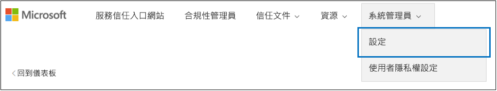

# <a name="work-with-microsoft-compliance-manager-preview"></a><span data-ttu-id="e9309-104">搭配使用 Microsoft Compliance Manager （預覽）</span><span class="sxs-lookup"><span data-stu-id="e9309-104">Work with Microsoft Compliance Manager (Preview)</span></span>

> [!IMPORTANT]
> <span data-ttu-id="e9309-105">Microsoft Compliance Manager 是提供資料保護和合規性成長與建議，以提升資料保護和合規性的摘要儀表板和管理工具。</span><span class="sxs-lookup"><span data-stu-id="e9309-105">Microsoft Compliance Manager is a dashboard and management tool that provides a summary of your data protection and compliance stature and recommendations to improve data protection and compliance.</span></span> <span data-ttu-id="e9309-106">提供合規性管理員中的客戶動作是建議;它是由您的組織來評估在其各自的法規環境之前實作這些建議的有效性。</span><span class="sxs-lookup"><span data-stu-id="e9309-106">The customer actions provided in Compliance Manager are recommendations; it is up to your organization to evaluate the effectiveness of these recommendations in their respective regulatory environment prior to implementation.</span></span> <span data-ttu-id="e9309-107">找到合規性管理員中的建議不應該解譯成保證郵件可以合規性。</span><span class="sxs-lookup"><span data-stu-id="e9309-107">Recommendations found in Compliance Manager should not be interpreted as a guarantee of compliance.</span></span>

## <a name="access-compliance-manager"></a><span data-ttu-id="e9309-108">存取合規性管理員</span><span class="sxs-lookup"><span data-stu-id="e9309-108">Access Compliance Manager</span></span>

<span data-ttu-id="e9309-p103">您可以從服務信任入口網站存取合規性管理員。任何人只要有 Microsoft 帳戶或 Azure Active Directory 組織帳戶都可以存取合規性管理員。</span><span class="sxs-lookup"><span data-stu-id="e9309-p103">You access Compliance Manager from the Service Trust Portal. Anyone with a Microsoft account or Azure Active Directory organizational account can access Compliance Manager.</span></span>
  
1. <span data-ttu-id="e9309-111">請移至 [https://servicetrust.microsoft.com](https://servicetrust.microsoft.com/)。</span><span class="sxs-lookup"><span data-stu-id="e9309-111">Go to [https://servicetrust.microsoft.com](https://servicetrust.microsoft.com/).</span></span>

2. <span data-ttu-id="e9309-112">使用您的 Microsoft 服務帳戶登入。</span><span class="sxs-lookup"><span data-stu-id="e9309-112">Sign in with your Microsoft service account.</span></span> <span data-ttu-id="e9309-113">這是您 Office 365、 Microsoft 365 或 Azure Active Directory (Azure AD) 的使用者帳戶。</span><span class="sxs-lookup"><span data-stu-id="e9309-113">This is your Office 365, Microsoft 365, or Azure Active Directory (Azure AD) user account.</span></span>

3. <span data-ttu-id="e9309-114">在服務信任入口網站中，選取 [**合規性管理員**]。</span><span class="sxs-lookup"><span data-stu-id="e9309-114">In the Service Trust Portal, select **Compliance Manager**.</span></span> <span data-ttu-id="e9309-115">這是合規性管理員的預覽版本。</span><span class="sxs-lookup"><span data-stu-id="e9309-115">This is the preview version of Compliance Manager.</span></span> <span data-ttu-id="e9309-116">**合規性管理員 （傳統）** 是舊版合規性管理員的連結。</span><span class="sxs-lookup"><span data-stu-id="e9309-116">**Compliance Manager (Classic)** is the link to the previous version of Compliance Manager.</span></span>

4. <span data-ttu-id="e9309-117">顯示非洩漏合約時，讀取它，然後選取 [**同意**才能繼續。</span><span class="sxs-lookup"><span data-stu-id="e9309-117">When the Non-Disclosure Agreement is displayed, read it, and select **Agree** to continue.</span></span> <span data-ttu-id="e9309-118">您必須同意一次，則會顯示在合規性管理員儀表板。</span><span class="sxs-lookup"><span data-stu-id="e9309-118">You must agree once, and then the Compliance Manager dashboard is displayed.</span></span>

<span data-ttu-id="e9309-119">若要取得您快速上手，ISO/IEC 27001:2103 運作的 Office 365 評定，預設會出現為您的組織。</span><span class="sxs-lookup"><span data-stu-id="e9309-119">To get you started, an ISO/IEC 27001:2103 Assessment for Office 365 appears by default for your organization.</span></span>

## <a name="administration"></a><span data-ttu-id="e9309-120">系統管理</span><span class="sxs-lookup"><span data-stu-id="e9309-120">Administration</span></span>

<span data-ttu-id="e9309-121">有特定的系統管理功能，且僅供全域系統管理員時全域系統管理員帳戶登入時，只顯示。</span><span class="sxs-lookup"><span data-stu-id="e9309-121">There are specific administrative functions that are only available to the global administrator and only visible when logged in with a global administrator account.</span></span> <span data-ttu-id="e9309-122">全域系統管理員可以指派使用者權限，並可開啟 [自動安全分數更新的所有動作。</span><span class="sxs-lookup"><span data-stu-id="e9309-122">The global administrator can assign user permissions, and can turn on automatic Secure Score updates for all actions.</span></span>
  
### <a name="assigning-compliance-manager-roles-to-users"></a><span data-ttu-id="e9309-123">將合規性管理員角色指派給使用者</span><span class="sxs-lookup"><span data-stu-id="e9309-123">Assigning Compliance Manager roles to users</span></span>

<span data-ttu-id="e9309-124">一旦系統管理員將合規性管理員角色指派給其他使用者，這些使用者可以檢視資料合規性管理員中，並執行動作取決於其角色。</span><span class="sxs-lookup"><span data-stu-id="e9309-124">Once the administrator assigns Compliance Manager roles to other users, those users can view data in Compliance Manager and perform actions determined by their role.</span></span> <span data-ttu-id="e9309-125">系統管理員可以也提供的唯讀權限到合規性管理員藉由指定使用者[在 Azure Active Directory (Azure AD) 中的全域讀者角色](https://docs.microsoft.com/azure/active-directory/users-groups-roles/directory-assign-admin-roles#global-reader)。</span><span class="sxs-lookup"><span data-stu-id="e9309-125">The administrator can also give read-only access to Compliance Manager by assigning the user the [Global Reader role in Azure Active Directory (Azure AD)](https://docs.microsoft.com/azure/active-directory/users-groups-roles/directory-assign-admin-roles#global-reader).</span></span>

<span data-ttu-id="e9309-126">每個合規性管理員角色具有稍有不同的權限。</span><span class="sxs-lookup"><span data-stu-id="e9309-126">Each Compliance Manager role has slightly different permissions.</span></span> <span data-ttu-id="e9309-127">您可以檢視指派給每個角色的權限，請參閱哪些使用者位於哪些角色，並從新增或移除使用者在服務信任入口網站透過該角色。</span><span class="sxs-lookup"><span data-stu-id="e9309-127">You can view the permissions assigned to each role, see which users are in which roles, and add or remove users from that role through the Service Trust Portal.</span></span> <span data-ttu-id="e9309-128">選取 [**系統管理**功能表項目，然後選擇 [**設定**]，以檢視。</span><span class="sxs-lookup"><span data-stu-id="e9309-128">Select the **Admin** menu item, and choose **Settings** to view.</span></span>
  

  
<span data-ttu-id="e9309-130">若要新增使用者或從合規性管理員角色中移除使用者。</span><span class="sxs-lookup"><span data-stu-id="e9309-130">To add or remove users from Compliance Manager roles.</span></span>
  
1. <span data-ttu-id="e9309-131">請移至 [https://servicetrust.microsoft.com](https://servicetrust.microsoft.com)。</span><span class="sxs-lookup"><span data-stu-id="e9309-131">Go to [https://servicetrust.microsoft.com](https://servicetrust.microsoft.com).</span></span>

2. <span data-ttu-id="e9309-132">使用您的 Azure Active Directory 全域系統管理員帳戶登入。</span><span class="sxs-lookup"><span data-stu-id="e9309-132">Sign in with your Azure Active Directory global administrator account.</span></span>

3. <span data-ttu-id="e9309-133">在服務信任入口網站上方的功能表列中，選取 [**系統管理員**，然後選擇**設定**。</span><span class="sxs-lookup"><span data-stu-id="e9309-133">On the Service Trust Portal top menu bar, select **Admin** and then choose **Settings**.</span></span>

4. <span data-ttu-id="e9309-134">在 [**選取角色**] 下拉式清單中，選取您想要管理的角色。</span><span class="sxs-lookup"><span data-stu-id="e9309-134">In the **Select Role** drop-down list, select the role that you want to manage.</span></span>

5. <span data-ttu-id="e9309-135">新增至每個角色的使用者會列在 [選取角色]\*\*\*\* 頁面上。</span><span class="sxs-lookup"><span data-stu-id="e9309-135">Users added to each role are listed on the **Select Role** page.</span></span>

6. <span data-ttu-id="e9309-136">將使用者新增至這個角色，選取 [**新增]**。</span><span class="sxs-lookup"><span data-stu-id="e9309-136">To add users to this role, select **Add**.</span></span> <span data-ttu-id="e9309-137">在 [**新增使用者**] 對話方塊中，選取 [使用者] 欄位。</span><span class="sxs-lookup"><span data-stu-id="e9309-137">In the **Add Users** dialog, select the user field.</span></span> <span data-ttu-id="e9309-138">您可以逐一捲動查看可用的使用者清單，或開始輸入使用者名稱來篩選清單，根據您的搜尋字詞。</span><span class="sxs-lookup"><span data-stu-id="e9309-138">You can scroll through the list of available users or begin typing the user name to filter the list based on your search term.</span></span> <span data-ttu-id="e9309-139">選取使用者，將該帳戶新增至該角色使用佈建的 [**新增使用者**] 清單。</span><span class="sxs-lookup"><span data-stu-id="e9309-139">Select the user to add that account to the **Add Users** list provisioned with that role.</span></span> <span data-ttu-id="e9309-140">如果您想要新增多個使用者同時，開始輸入使用者名稱，以篩選] 清單中，，，然後選取要新增至清單的使用者。</span><span class="sxs-lookup"><span data-stu-id="e9309-140">If you would like to add multiple users concurrently, begin typing a user name to filter the list, and then select the user to add to the list.</span></span> <span data-ttu-id="e9309-141">選取 [**儲存**] 以佈建到這些使用者選取的角色。</span><span class="sxs-lookup"><span data-stu-id="e9309-141">Select **Save** to provision the selected role to these users.</span></span> 

    
  
7. <span data-ttu-id="e9309-143">若要移除此角色的使用者，請選取的使用者，然後選取 [**刪除**]。</span><span class="sxs-lookup"><span data-stu-id="e9309-143">To remove users from this role, select the users and select **Delete**.</span></span>

    

### <a name="controlling-automatic-secure-score-updates"></a><span data-ttu-id="e9309-145">控制自動安全分數更新</span><span class="sxs-lookup"><span data-stu-id="e9309-145">Controlling automatic Secure Score updates</span></span>

<span data-ttu-id="e9309-146">安全分數更新可以開啟自動的所有動作、 可以關閉的所有動作，或可以設定個別的動作。</span><span class="sxs-lookup"><span data-stu-id="e9309-146">Secure Score updates can be turned on automatically for all actions, can be turned off for all actions, or can be set by individual action.</span></span>

1. <span data-ttu-id="e9309-147">[服務信任入口網站](https://servicetrust.microsoft.com)以全域管理員帳戶登入。</span><span class="sxs-lookup"><span data-stu-id="e9309-147">Sign in to the [Service Trust Portal](https://servicetrust.microsoft.com) with your global administrator account.</span></span>

2. <span data-ttu-id="e9309-148">在服務信任入口網站上方的功能表列中，選取 [**系統管理員**，然後選擇**設定**。</span><span class="sxs-lookup"><span data-stu-id="e9309-148">On the Service Trust Portal top menu bar, select **Admin** and then choose **Settings**.</span></span>

4. <span data-ttu-id="e9309-149">在 [**安全分數**] 索引標籤中，選取適當的按鈕為您選擇設定。</span><span class="sxs-lookup"><span data-stu-id="e9309-149">In the **Secure Score** tab, select the appropriate button for you chosen setting.</span></span>

<span data-ttu-id="e9309-150">**附註：** 只有全域系統管理員可以開啟或關閉自動更新的所有動作。</span><span class="sxs-lookup"><span data-stu-id="e9309-150">**Note:** Only the global administrator can turn on or off automatic updates for all actions.</span></span> <span data-ttu-id="e9309-151">合規性管理員中系統管理員可以全域開啟 [自動更新的個別的動作，但不適用於所有動作。</span><span class="sxs-lookup"><span data-stu-id="e9309-151">The Compliance Manager administrator can turn on automatic updates for individual actions, but not for all actions globally.</span></span>

## <a name="groups"></a><span data-ttu-id="e9309-152">群組</span><span class="sxs-lookup"><span data-stu-id="e9309-152">Groups</span></span>

<span data-ttu-id="e9309-153">群組可讓您以邏輯方式組織評估以及該共用一般資訊及工作流程工作之間具有相同或相關客戶管理控制項的評定。</span><span class="sxs-lookup"><span data-stu-id="e9309-153">Groups allow you to logically organize Assessments and that share common information and workflow tasks between Assessments that have the same or related customer-managed controls.</span></span> <span data-ttu-id="e9309-154">若要協助降低客戶管理動作組織內，您可以藉由年、 標準、 服務、 小組、 部門或行政機關群組評估：</span><span class="sxs-lookup"><span data-stu-id="e9309-154">You can group Assessments by year, standard, service, team, division, or agencies within your organization to help minimize customer-managed Actions:</span></span>
  
- <span data-ttu-id="e9309-155">**FFIEC 是評估 2019**</span><span class="sxs-lookup"><span data-stu-id="e9309-155">**FFIEC IS Assessments 2019**</span></span>
  - <span data-ttu-id="e9309-156">Office 365 + FFIEC IS</span><span class="sxs-lookup"><span data-stu-id="e9309-156">Office 365 + FFIEC IS</span></span>
  - <span data-ttu-id="e9309-157">Intune + FFIEC IS</span><span class="sxs-lookup"><span data-stu-id="e9309-157">Intune + FFIEC IS</span></span>
- <span data-ttu-id="e9309-158">**資料安全性與隱私權評估**</span><span class="sxs-lookup"><span data-stu-id="e9309-158">**Data Security and Privacy Assessments**</span></span>
  - <span data-ttu-id="e9309-159">Office 365 + ISO 27001:2013</span><span class="sxs-lookup"><span data-stu-id="e9309-159">Office 365 + ISO 27001:2013</span></span>
  - <span data-ttu-id="e9309-160">Office 365 + ISO 27018:2014</span><span class="sxs-lookup"><span data-stu-id="e9309-160">Office 365 + ISO 27018:2014</span></span>

<span data-ttu-id="e9309-161">當您建立新的 「 評估時，您必須建立新的群組評估或指派給現有群組的評估。</span><span class="sxs-lookup"><span data-stu-id="e9309-161">When you create a new Assessment, you must create a new group for the Assessment or assign the Assessment to an existing group.</span></span> <span data-ttu-id="e9309-162">群組無法被建立為獨立的實體。</span><span class="sxs-lookup"><span data-stu-id="e9309-162">Groups cannot be created as stand-alone entities.</span></span> <span data-ttu-id="e9309-163">建議您判斷的群組策略，針對您的組織*之前*新增新的評估。</span><span class="sxs-lookup"><span data-stu-id="e9309-163">It's recommended that you determine a grouping strategy for your organization *before* adding new assessments.</span></span> <span data-ttu-id="e9309-164">根據預設，名為 「 預設群組 」 的群組是供您初始評估。</span><span class="sxs-lookup"><span data-stu-id="e9309-164">By default, a Group named "Default Group" is available for your initial Assessments.</span></span> <span data-ttu-id="e9309-165">群組沒有任何安全性屬性。</span><span class="sxs-lookup"><span data-stu-id="e9309-165">Groups do not have any security properties.</span></span> <span data-ttu-id="e9309-166">評估與所有的權限相關聯。</span><span class="sxs-lookup"><span data-stu-id="e9309-166">All permissions are associated with Assessments.</span></span>

<span data-ttu-id="e9309-167">當您使用的群組時，請記得：</span><span class="sxs-lookup"><span data-stu-id="e9309-167">When you work with groups, remember:</span></span>
  
- <span data-ttu-id="e9309-168">當完成時，自動更新中相同群組中的不同評估相關的評估控制項。</span><span class="sxs-lookup"><span data-stu-id="e9309-168">Related assessment controls in different assessments within the same Group automatically update when completed.</span></span>
- <span data-ttu-id="e9309-169">當您建立新的 「 評估新的群組可以從現存的 group 複製資訊。</span><span class="sxs-lookup"><span data-stu-id="e9309-169">New groups can copy information from an existing group when you create a new Assessment.</span></span> <span data-ttu-id="e9309-170">在新從 「 評估 」 新增至實作詳細資料和客戶管理控制措施的測試計劃和管理回應] 欄位中的群組，您要複製的任何資訊複製到相同 （或相關） 客戶管理控制評量。</span><span class="sxs-lookup"><span data-stu-id="e9309-170">Any information added to the Implementation Details and Test Plan and Management Response fields of customer-managed controls from Assessments in the group that you're copying from are copied to the same (or related) customer-managed controls in the new Assessment.</span></span> <span data-ttu-id="e9309-171">如果您正在加入新的 「 評估至現有的群組，請從評估中該群組的一般資訊複製到新的評估。</span><span class="sxs-lookup"><span data-stu-id="e9309-171">If you're adding a new Assessment to an existing group, common information from Assessments in that group are copied to the new Assessment.</span></span>
- <span data-ttu-id="e9309-172">群組名稱 （也稱為 「*群組 Id*」） 必須是唯一組織內。</span><span class="sxs-lookup"><span data-stu-id="e9309-172">Group names (also called *Group IDs*) must be unique within your organization.</span></span>
- <span data-ttu-id="e9309-173">群組可以為相同的憑證/規定，包含 「 評估 」，但每個群組僅能包含一個評估為特定的雲端服務/憑證配對。</span><span class="sxs-lookup"><span data-stu-id="e9309-173">Groups can contain Assessments for the same certification/regulation, but each group can only contain one Assessment for a specific cloud service/certification pair.</span></span> <span data-ttu-id="e9309-174">例如，群組不能包含兩個 Office 365 和 NIST CSF 評估。</span><span class="sxs-lookup"><span data-stu-id="e9309-174">For example, a group can't contain two Assessments for Office 365 and NIST CSF.</span></span> <span data-ttu-id="e9309-175">只有在相對應的每一個憑證/規定為不同的群組可以包含多個評定之相同雲端服務。</span><span class="sxs-lookup"><span data-stu-id="e9309-175">A group can contain multiple Assessments for the same cloud service only if the corresponding certification/regulation for each one is different.</span></span>
- <span data-ttu-id="e9309-176">一旦評估已新增至評估群組中，無法變更群組。</span><span class="sxs-lookup"><span data-stu-id="e9309-176">Once an assessment has been added to an assessment group, the grouping cannot be changed.</span></span> <span data-ttu-id="e9309-177">您可以重新命名評估群組，將變更的群組該群組相關聯的所有 「 評估 」 的 「 評估名稱。</span><span class="sxs-lookup"><span data-stu-id="e9309-177">You can rename the assessment group, which changes the name of the assessment grouping for all the assessments associated with that group.</span></span> <span data-ttu-id="e9309-178">您可以建立評定和新評定群組，並且從現有評定複製資訊，這會在不同的評定群組中有效地建立該評定的重複項目。</span><span class="sxs-lookup"><span data-stu-id="e9309-178">You can create an assessment and a new assessment group and copy information from an existing assessment, which effectively creates a duplicate of that assessment in a different assessment group.</span></span>
- <span data-ttu-id="e9309-179">封存評估會中斷該評估及群組之間的關係。</span><span class="sxs-lookup"><span data-stu-id="e9309-179">Archiving an assessment breaks the relationship between that assessment and the group.</span></span> <span data-ttu-id="e9309-180">其他相關評定的任何進一步更新不會再反映於已封存評定中。</span><span class="sxs-lookup"><span data-stu-id="e9309-180">Any further updates to other related assessments are no longer reflected in the archived assessment.</span></span>

## <a name="tenant-management"></a><span data-ttu-id="e9309-181">租用戶管理</span><span class="sxs-lookup"><span data-stu-id="e9309-181">Tenant Management</span></span>

<span data-ttu-id="e9309-182">合規性管理員 （預覽） 包含管理呼叫**租用戶管理**新的資料元素的新介面。</span><span class="sxs-lookup"><span data-stu-id="e9309-182">Compliance Manager (Preview) includes a new interface for managing new data elements called **Tenant Management**.</span></span> <span data-ttu-id="e9309-183">此介面可讓您管理租用戶整體設定：</span><span class="sxs-lookup"><span data-stu-id="e9309-183">This interface enables you to manage tenant-wide settings:</span></span>

- <span data-ttu-id="e9309-184">**維度：** 檢視範本、 評估以及動作項目，可讓您建立自訂的樞紐分析表的篩選器的中繼資料。</span><span class="sxs-lookup"><span data-stu-id="e9309-184">**Dimensions:** View metadata for Templates, Assessments, and Action Items that allow you to create custom pivots for filters.</span></span>
- <span data-ttu-id="e9309-185">**擁有者：** 指定每個動作項目擁有者。</span><span class="sxs-lookup"><span data-stu-id="e9309-185">**Owners:** Specify an owner for each Action Item.</span></span>
- <span data-ttu-id="e9309-186">**客戶動作：** 管理動作項目包含在合規性管理員 （預覽） 的完整清單，並啟用/停用安全分數監視整合在一起安全分數的動作。</span><span class="sxs-lookup"><span data-stu-id="e9309-186">**Customer Actions:** Manage the complete list of Actions Items included in Compliance Manager (Preview) and enable/disable Secure Score monitoring for Actions that are integrated with Secure Score.</span></span>

<span data-ttu-id="e9309-187">選取**租用戶管理**]，以開啟管理介面，並使用下列步驟來管理**維度**、**擁有者**，以及**客戶動作**。</span><span class="sxs-lookup"><span data-stu-id="e9309-187">Select **Tenant Management** to open the management interface, and use the following steps to manage **Dimensions**, **Owners**, and **Customer Actions**.</span></span>

### <a name="dimensions"></a><span data-ttu-id="e9309-188">Dimensions</span><span class="sxs-lookup"><span data-stu-id="e9309-188">Dimensions</span></span>

<span data-ttu-id="e9309-189">維度都是中繼資料集提供範本、 評估或動作項目相關資訊。</span><span class="sxs-lookup"><span data-stu-id="e9309-189">Dimensions are sets of metadata that provide information about a Template, an Assessment, or an Action Item.</span></span> <span data-ttu-id="e9309-190">維度使用機碼和值，其中維度索引鍵代表屬性，而維度值代表屬性的有效值的概念。</span><span class="sxs-lookup"><span data-stu-id="e9309-190">Dimensions use the concept of Keys and Values, where the Dimension Key represents a property, and Dimension Value represents valid values for the property.</span></span> <span data-ttu-id="e9309-191">例如，合規性管理員中有三種類型的動作。</span><span class="sxs-lookup"><span data-stu-id="e9309-191">For example, in Compliance Manager there are three types of Actions.</span></span> <span data-ttu-id="e9309-192">這些是由維度按鍵的**動作類型**和**文件**、**操作**，以及**技術**的維度值定義。</span><span class="sxs-lookup"><span data-stu-id="e9309-192">They are defined by a Dimension Key of **Action Type** and Dimension Values of **Documentation**, **Operational**, and **Technical**.</span></span> <span data-ttu-id="e9309-193">您可以編輯或刪除現有的維度。</span><span class="sxs-lookup"><span data-stu-id="e9309-193">You can edit or delete existing Dimensions.</span></span>

> [!IMPORTANT]
> <span data-ttu-id="e9309-194">您可以新增新的維度，和他們可以指派給您已匯入的範本。</span><span class="sxs-lookup"><span data-stu-id="e9309-194">You can add new dimensions, and they can be assigned to Templates that you have already imported.</span></span> <span data-ttu-id="e9309-195">您也可以新增新的維度您建立任何新範本。</span><span class="sxs-lookup"><span data-stu-id="e9309-195">You can also add new dimensions to any new Templates you create.</span></span>

### <a name="owners"></a><span data-ttu-id="e9309-196">擁有者</span><span class="sxs-lookup"><span data-stu-id="e9309-196">Owners</span></span>

<span data-ttu-id="e9309-197">擁有者用來識別每個控制項負責合作對象。</span><span class="sxs-lookup"><span data-stu-id="e9309-197">Owners are used to identify the responsible party for each control.</span></span> <span data-ttu-id="e9309-198">Microsoft、 客戶，或是兩者都擁有所有內建的控制項。</span><span class="sxs-lookup"><span data-stu-id="e9309-198">All built-in controls are owned by Microsoft, by customers, or by both.</span></span> <span data-ttu-id="e9309-199">您可以建立自訂值的擁有者可以用來指定組織內更細微的責任。</span><span class="sxs-lookup"><span data-stu-id="e9309-199">You can create custom values for Owners that can be used to specify more granular responsibilities within your organization.</span></span> <span data-ttu-id="e9309-200">例如，您可以建立代表特定群組、 小組或組織內的業務單位的擁有者。</span><span class="sxs-lookup"><span data-stu-id="e9309-200">For example, you could create Owners that represent specific groups, teams, or business units within your organization.</span></span>

#### <a name="add-an-owner"></a><span data-ttu-id="e9309-201">新增擁有者</span><span class="sxs-lookup"><span data-stu-id="e9309-201">Add an Owner</span></span>

1. <span data-ttu-id="e9309-202">開啟 [**租用戶管理**]，然後選取 [**擁有者**。</span><span class="sxs-lookup"><span data-stu-id="e9309-202">Open **Tenant Management** and select **Owners**.</span></span>
2. <span data-ttu-id="e9309-203">選取 [ **+ 新增擁有者**]。</span><span class="sxs-lookup"><span data-stu-id="e9309-203">Select **+ Add owner**.</span></span>
3. <span data-ttu-id="e9309-204">提供的名稱和描述的擁有者，並選取 [**儲存**]。</span><span class="sxs-lookup"><span data-stu-id="e9309-204">Provide a Name and Description for the Owner and select **Save**.</span></span> <span data-ttu-id="e9309-205">描述會顯示在 [擁有者] 欄位。</span><span class="sxs-lookup"><span data-stu-id="e9309-205">The description is displayed in the Owner column.</span></span>

#### <a name="edit-an-owner"></a><span data-ttu-id="e9309-206">編輯擁有者</span><span class="sxs-lookup"><span data-stu-id="e9309-206">Edit an Owner</span></span>

<span data-ttu-id="e9309-207">您無法編輯擁有者名稱，但您可以修改 [擁有者] 欄中顯示的描述。</span><span class="sxs-lookup"><span data-stu-id="e9309-207">You can’t edit an Owner name, but you can modify the description that is displayed in the Owner column.</span></span>

1. <span data-ttu-id="e9309-208">開啟 [**租用戶管理**]，然後選取 [**擁有者**。</span><span class="sxs-lookup"><span data-stu-id="e9309-208">Open **Tenant Management** and select **Owners**.</span></span>
2. <span data-ttu-id="e9309-209">找出您想要編輯、 選取它旁的省略符號 （...），選取 [**編輯**擁有的者。</span><span class="sxs-lookup"><span data-stu-id="e9309-209">Locate the Owner you want to edit, select the ellipses (…) next to it, and select **Edit**.</span></span>
3. <span data-ttu-id="e9309-210">視需要修改描述，並選取 [**儲存**]。</span><span class="sxs-lookup"><span data-stu-id="e9309-210">Modify the Description as needed and select **Save**.</span></span>

#### <a name="delete-an-owner"></a><span data-ttu-id="e9309-211">刪除擁有者</span><span class="sxs-lookup"><span data-stu-id="e9309-211">Delete an Owner</span></span>

1. <span data-ttu-id="e9309-212">開啟 [**租用戶管理**]，然後選取 [**擁有者**。</span><span class="sxs-lookup"><span data-stu-id="e9309-212">Open **Tenant Management** and select **Owners**.</span></span>
2. <span data-ttu-id="e9309-213">找出您想要刪除，請選取其，旁邊的省略符號 （...），然後選取 [**刪除**的擁有者。</span><span class="sxs-lookup"><span data-stu-id="e9309-213">Locate the Owner you want to delete, select the ellipses (…) next to it, and select **Delete**.</span></span>
3. <span data-ttu-id="e9309-214">出現確認訊息時，選取 [**刪除**]。</span><span class="sxs-lookup"><span data-stu-id="e9309-214">When the confirmation message appears, select **Delete**.</span></span>

### <a name="customer-actions"></a><span data-ttu-id="e9309-215">客戶動作</span><span class="sxs-lookup"><span data-stu-id="e9309-215">Customer Actions</span></span>

<span data-ttu-id="e9309-216">客戶動作區域顯示所有客戶的所有範本及評估動作合規性管理員中 （預覽）。</span><span class="sxs-lookup"><span data-stu-id="e9309-216">The Customer Actions area shows all the customer actions for all Templates and Assessments in Compliance Manager (Preview).</span></span>


<span data-ttu-id="e9309-218">在快速，您可以請參閱巨集指令的標題、 擁有者、 類別、 強制執行 >，以及分數，並判斷是否它整合安全分數。</span><span class="sxs-lookup"><span data-stu-id="e9309-218">At-a-glance, you can see an Action’s title, owner, category, enforcement, and score, and determine if it is integrated with Secure Score.</span></span> <span data-ttu-id="e9309-219">您可以依序展開 [巨集指令，然後選取 [**更多讀取**閱讀動作的描述，並存取任何說明中的連結。</span><span class="sxs-lookup"><span data-stu-id="e9309-219">You can expand an Action and select **Read More** to read the Action’s description and access any links in the description.</span></span> <span data-ttu-id="e9309-220">啟用及停用安全分數整合，根據每個巨集指令，以及新增自訂動作，您也可以使用此介面。</span><span class="sxs-lookup"><span data-stu-id="e9309-220">You can also use this interface to enable and disable Secure Score integration on a per-action basis, and to add custom actions.</span></span> <span data-ttu-id="e9309-221">具有安全分數整合功能的動作有這些 （請注意，自訂動作也會有旁邊的省略符號） 旁的省略符號 （...）。</span><span class="sxs-lookup"><span data-stu-id="e9309-221">Actions that have Secure Score integration capabilities have an ellipsis (…) next to them (note that custom actions also have an ellipsis next to them).</span></span>

#### <a name="enable-or-disable-secure-score-integration"></a><span data-ttu-id="e9309-222">啟用或停用安全分數整合</span><span class="sxs-lookup"><span data-stu-id="e9309-222">Enable or disable Secure Score integration</span></span>

1. <span data-ttu-id="e9309-223">選取您要修改，然後選取 [**編輯**巨集的指令的省略符號 （...）。</span><span class="sxs-lookup"><span data-stu-id="e9309-223">Select the ellipses (…) for the Action you want to modify and select **Edit**.</span></span>
2. <span data-ttu-id="e9309-224">切換開啟或關閉安全分數連續更新的參數來啟用或停用連續監視透過安全分數。</span><span class="sxs-lookup"><span data-stu-id="e9309-224">Toggle the switch for Secure Score continuous update to On or Off to enable or disable continuous monitoring through Secure Score.</span></span>
3. <span data-ttu-id="e9309-225">選取 [儲存]\*\*\*\*。</span><span class="sxs-lookup"><span data-stu-id="e9309-225">Select **Save**.</span></span>

#### <a name="add-a-customer-action"></a><span data-ttu-id="e9309-226">新增客戶巨集指令</span><span class="sxs-lookup"><span data-stu-id="e9309-226">Add a customer action</span></span>

1. <span data-ttu-id="e9309-227">選取 [ **+ 新增客戶巨集指令**。</span><span class="sxs-lookup"><span data-stu-id="e9309-227">Select **+ Add Customer Action**.</span></span>
2. <span data-ttu-id="e9309-228">提供在 [**標題**] 欄位中的巨集指令重複的標題。</span><span class="sxs-lookup"><span data-stu-id="e9309-228">Provide a unique title for the Action in the **Title** field.</span></span>
3. <span data-ttu-id="e9309-229">提供 「 合規性分數 （這可以是任何介於 1-99） 的**最大的合規性分數**欄位中的巨集指令。</span><span class="sxs-lookup"><span data-stu-id="e9309-229">Provide a Compliance Score for the Action in the **Maximum Compliance Score** field (this can be any number from 1-99).</span></span>
4. <span data-ttu-id="e9309-230">使用 [**巨集指令類型**] 下拉式清單來指定您要新增的動作類型。</span><span class="sxs-lookup"><span data-stu-id="e9309-230">Use the **Action Type** dropdown to specify the type of Action you are adding.</span></span> <span data-ttu-id="e9309-231">如果不存在的動作類型，您可以將它新增將值新增至的動作類型維度索引鍵。</span><span class="sxs-lookup"><span data-stu-id="e9309-231">If the Action Type does not exist, you can add it by adding the value to the Action Type dimension key.</span></span>
5. <span data-ttu-id="e9309-232">使用 [**維度**] 下拉式清單來指定或巨集指令新增維度機碼和值。</span><span class="sxs-lookup"><span data-stu-id="e9309-232">Use the **Dimensions** dropdown to specify or add dimension keys and values for the Action.</span></span>
6. <span data-ttu-id="e9309-233">使用 [**擁有者**] 下拉式清單來指定巨集指令的擁有者。</span><span class="sxs-lookup"><span data-stu-id="e9309-233">Use the **Owner** dropdown to specify the owner for Action.</span></span>
7. <span data-ttu-id="e9309-234">選取 [**+** 新增描述和說明，標題巨集指令。</span><span class="sxs-lookup"><span data-stu-id="e9309-234">Select **+** to add a description and description title for the Action.</span></span>
8. <span data-ttu-id="e9309-235">選取**X** ] 來關閉 [說明] 刀鋒視窗。</span><span class="sxs-lookup"><span data-stu-id="e9309-235">Select the **X** to close the Description blade.</span></span>
9. <span data-ttu-id="e9309-236">選取 [**儲存**] 以儲存客戶巨集指令。</span><span class="sxs-lookup"><span data-stu-id="e9309-236">Select **Save** to save the Customer Action.</span></span>

#### <a name="delete-a-customer-action"></a><span data-ttu-id="e9309-237">刪除客戶巨集指令</span><span class="sxs-lookup"><span data-stu-id="e9309-237">Delete a customer action</span></span>

1. <span data-ttu-id="e9309-238">選取您要修改，然後選取 [**刪除**的巨集指令的省略符號 （...）。</span><span class="sxs-lookup"><span data-stu-id="e9309-238">Select the ellipses (…) for the Action you want to modify and select **Delete**.</span></span>
2. <span data-ttu-id="e9309-239">出現確認訊息時，選取 [**刪除**]。</span><span class="sxs-lookup"><span data-stu-id="e9309-239">When the confirmation message appears, select **Delete**.</span></span>

## <a name="assessments"></a><span data-ttu-id="e9309-240">「 評估 」</span><span class="sxs-lookup"><span data-stu-id="e9309-240">Assessments</span></span>

### <a name="add-an-assessment"></a><span data-ttu-id="e9309-241">新增評估</span><span class="sxs-lookup"><span data-stu-id="e9309-241">Add an Assessment</span></span>
  
1. <span data-ttu-id="e9309-242">在評估儀表板中，選取 [ **+ 新增評估**]。</span><span class="sxs-lookup"><span data-stu-id="e9309-242">In the Assessments dashboard, select **+ Add Assessment**.</span></span>

2. <span data-ttu-id="e9309-243">[] 刀鋒視窗開啟時，請輸入下列資訊：</span><span class="sxs-lookup"><span data-stu-id="e9309-243">When the blade opens, enter the following information:</span></span>

    - <span data-ttu-id="e9309-244">**標題 （必要）：** 輸入您的評估的標題</span><span class="sxs-lookup"><span data-stu-id="e9309-244">**Title (required):** Enter a title for your Assessment</span></span>
    - <span data-ttu-id="e9309-245">**請選取範本 （必要）：** 選取標準或自訂範本</span><span class="sxs-lookup"><span data-stu-id="e9309-245">**Please select a template (required):** Select a standard or custom template</span></span>
    - <span data-ttu-id="e9309-246">**請選取群組或加入新的群組 （必要）：** 選取現有的群組，或選擇新增新的群組，並提供唯一的群組名稱</span><span class="sxs-lookup"><span data-stu-id="e9309-246">**Please select a group or add a new group (required):** Select an existing group or choose to add a new group, and provide a unique group name</span></span>
    - <span data-ttu-id="e9309-247">**您想要將資料複製從現有的群組？（選用）：** 切換要啟用群組複本的控制項，然後：</span><span class="sxs-lookup"><span data-stu-id="e9309-247">**Would you like to copy the data from an existing group? (optional):** Toggle the control to enable group copy and then:</span></span>
        - <span data-ttu-id="e9309-248">**選取群組 （選用）：** 如果啟用群組複本時，選取要複製之群組</span><span class="sxs-lookup"><span data-stu-id="e9309-248">**Select a group (optional):** If group copy is enabled, select the group to copy from</span></span>
            - <span data-ttu-id="e9309-249">**實作詳細資料 （選用）：** 選取 [將實作詳細資料複製到新的群組</span><span class="sxs-lookup"><span data-stu-id="e9309-249">**Implementation Details (optional):** Select to copy implementation details to the new group</span></span>
            - <span data-ttu-id="e9309-250">**測試計劃 & 其他資訊 （選用）：** 選取 [複製測試計劃及其他資訊詳細資料] 以新的群組</span><span class="sxs-lookup"><span data-stu-id="e9309-250">**Test plan & additional information (optional):** Select to copy test plan and additional information details to the new group</span></span>
            - <span data-ttu-id="e9309-251">**文件 （選用）：** 選取 [將文件複製到新的群組</span><span class="sxs-lookup"><span data-stu-id="e9309-251">**Documents (optional):** Select to copy documents to the new group</span></span>

3. <span data-ttu-id="e9309-252">選取 [**儲存**] 以建立評估。</span><span class="sxs-lookup"><span data-stu-id="e9309-252">Select **Save** to create the Assessment.</span></span>

 <span data-ttu-id="e9309-253">新的評估會出現在評估儀表板上，並顯示下列資訊：</span><span class="sxs-lookup"><span data-stu-id="e9309-253">The new Assessment appears on the Assessment dashboard and displays the following information:</span></span>

- <span data-ttu-id="e9309-254">評估的標題。</span><span class="sxs-lookup"><span data-stu-id="e9309-254">The title of the Assessment.</span></span>
- <span data-ttu-id="e9309-255">評估，包括憑證、 環境及用於評估產品的尺寸。</span><span class="sxs-lookup"><span data-stu-id="e9309-255">The dimensions of the Assessment, including certification, environment, and product applied to the Assessment.</span></span>
- <span data-ttu-id="e9309-256">上次修改的日期和它的建立的日期。</span><span class="sxs-lookup"><span data-stu-id="e9309-256">The date it was created and date when it was last modified.</span></span>
- <span data-ttu-id="e9309-257">顯示百分比評估分數。</span><span class="sxs-lookup"><span data-stu-id="e9309-257">The Assessment Score shown as a percentage.</span></span> <span data-ttu-id="e9309-258">此分數會自動包含您從 Microsoft 管理控制措施和安全分數的分數。</span><span class="sxs-lookup"><span data-stu-id="e9309-258">This score automatically includes your scores from Microsoft-managed controls and from Secure Score.</span></span>
- <span data-ttu-id="e9309-259">顯示 Microsoft 受管理] 和 [客戶所管理的評估控制項的數字的進度指標。</span><span class="sxs-lookup"><span data-stu-id="e9309-259">Progress indicators that show the number of assessed Microsoft-managed and customer-manged controls.</span></span>

### <a name="copying-information-from-existing-assessments"></a><span data-ttu-id="e9309-260">從現有「評定」複製資訊</span><span class="sxs-lookup"><span data-stu-id="e9309-260">Copying information from existing Assessments</span></span>

<span data-ttu-id="e9309-261">當您建立評估時，您必須從現存的 group 複製資訊的選項。</span><span class="sxs-lookup"><span data-stu-id="e9309-261">When you create an Assessment, you have the option to copy information from an existing group.</span></span> <span data-ttu-id="e9309-262">這可讓您可以套用至相同的控制項中新的 「 評估複製評估輸入的資訊。</span><span class="sxs-lookup"><span data-stu-id="e9309-262">This allows you to apply the information entered into the copied assessment to the same controls in the new Assessment.</span></span> <span data-ttu-id="e9309-263">例如，如果您有一組所有 FFIEC 相關評估貴組織中，您可以從現有 「 評估 」 複製下列資訊：</span><span class="sxs-lookup"><span data-stu-id="e9309-263">For example, if you have a group for all FFIEC-related Assessments in your organization, you can copy the following information from existing assessments:</span></span>

- <span data-ttu-id="e9309-264">實作詳細資料</span><span class="sxs-lookup"><span data-stu-id="e9309-264">Implementation Details</span></span>
- <span data-ttu-id="e9309-265">測試計劃 & 其他資訊</span><span class="sxs-lookup"><span data-stu-id="e9309-265">Test Plan & Additional Information</span></span>
- <span data-ttu-id="e9309-266">文件</span><span class="sxs-lookup"><span data-stu-id="e9309-266">Documents</span></span>

#### <a name="copy-information-from-an-existing-assessment-to-a-new-assessment"></a><span data-ttu-id="e9309-267">將資訊從現有評估複製到新的 「 評估</span><span class="sxs-lookup"><span data-stu-id="e9309-267">Copy information from an existing Assessment to a new Assessment</span></span>
  
1. <span data-ttu-id="e9309-268">在評估儀表板中，選取 [ **+ 新增評估**]。</span><span class="sxs-lookup"><span data-stu-id="e9309-268">In the Assessment dashboard, select **+ Add Assessment**.</span></span>
    
2. <span data-ttu-id="e9309-269">在 [**新增評估**] 視窗中，完成下列的資訊</span><span class="sxs-lookup"><span data-stu-id="e9309-269">In the **Add an Assessment** window, complete the following information</span></span>

    - <span data-ttu-id="e9309-270">**標題 （必要）：** 輸入您的評估的標題。</span><span class="sxs-lookup"><span data-stu-id="e9309-270">**Title (required):** Enter a title for your Assessment.</span></span>
    - <span data-ttu-id="e9309-271">**請選取範本 （必要）：** 選取一個標準或自訂的範本。</span><span class="sxs-lookup"><span data-stu-id="e9309-271">**Please select a template (required):** Select a standard or custom template.</span></span>
    - <span data-ttu-id="e9309-272">**請選取群組或加入新的群組 （必要）：** 選擇 [**加入新的群組**，並提供唯一的群組名稱。</span><span class="sxs-lookup"><span data-stu-id="e9309-272">**Please select a group or add a new group (required):** Choose **Add a new group** and provide a unique group name.</span></span>
    - <span data-ttu-id="e9309-273">**您想要將資料複製從現有的群組？（選用）：** 切換入啟用群組複製到控制項，然後:-**選取群組 （選用）：** 如果啟用群組複本時，選取要複製之群組。</span><span class="sxs-lookup"><span data-stu-id="e9309-273">**Would you like to copy the data from an existing group? (optional):** Toggle the control to On to enable group copy and then: - **Select a group (optional):** If group copy is enabled, select the group to copy from.</span></span>
            <span data-ttu-id="e9309-274">- **實作詳細資料 （選用）：** 選取 [將實作詳細資料複製到新的群組。</span><span class="sxs-lookup"><span data-stu-id="e9309-274">- **Implementation Details (optional):** Select to copy implementation details to the new group.</span></span>
            <span data-ttu-id="e9309-275">- **測試計劃 & 其他資訊 （選用）：** 選取 [複製測試計劃及其他資訊詳細資料] 以新的群組。</span><span class="sxs-lookup"><span data-stu-id="e9309-275">- **Test plan & additional information (optional):** Select to copy test plan and additional information details to the new group.</span></span>
            <span data-ttu-id="e9309-276">- **文件 （選用）：** 選取 [將文件複製到新的群組。</span><span class="sxs-lookup"><span data-stu-id="e9309-276">- **Documents (optional):** Select to copy documents to the new group.</span></span>

3. <span data-ttu-id="e9309-277">選取 [**儲存**] 以建立評估。</span><span class="sxs-lookup"><span data-stu-id="e9309-277">Select **Save** to create the Assessment.</span></span>

### <a name="view-an-assessment"></a><span data-ttu-id="e9309-278">檢視評估</span><span class="sxs-lookup"><span data-stu-id="e9309-278">View an Assessment</span></span>
  
1. <span data-ttu-id="e9309-279">在評估儀表板中，選取評估名稱以開啟它，檢視動作項目和控制項資訊。</span><span class="sxs-lookup"><span data-stu-id="e9309-279">In the Assessments dashboard, select the assessment name to open it and view the Action Items and Controls Info.</span></span>

<span data-ttu-id="e9309-280">以下是 Office 365 和 ISO 27001 評估的範例。</span><span class="sxs-lookup"><span data-stu-id="e9309-280">Here's an example of the Assessment for Office 365 and ISO 27001.</span></span> <span data-ttu-id="e9309-281">第一個檢視說明新的動作項目檢視合規性管理員中 （預覽）。</span><span class="sxs-lookup"><span data-stu-id="e9309-281">The first view illustrates the new Action Items view in Compliance Manager (Preview).</span></span>


<span data-ttu-id="e9309-283">動作會依字母順序列出和每個巨集指令會指派分數以及擁有者。</span><span class="sxs-lookup"><span data-stu-id="e9309-283">The Actions are listed in alphabetical order, and each Action is assigned a score and an owner.</span></span> <span data-ttu-id="e9309-284">選取**更多讀取**連結至讀取每個動作的詳細資料。</span><span class="sxs-lookup"><span data-stu-id="e9309-284">Select  the **Read More** link to read the details of each Action.</span></span> 


<span data-ttu-id="e9309-286">選取來管理、 指派、 實作和測試巨集指令的 [**檢閱**] 連結。</span><span class="sxs-lookup"><span data-stu-id="e9309-286">Select the **Review** link to manage, assign, implement, and test the action.</span></span> <span data-ttu-id="e9309-287">以下是範例巨集指令。</span><span class="sxs-lookup"><span data-stu-id="e9309-287">Below is an example Action.</span></span>


<span data-ttu-id="e9309-289">在舊版的合規性管理員中，實作需求的工作流程執行控制層級。</span><span class="sxs-lookup"><span data-stu-id="e9309-289">In previous versions of Compliance Manager, the workflow for implementing requirements was performed at the Control level.</span></span> <span data-ttu-id="e9309-290">法務人員會指派給某人實作控制項的控制項。</span><span class="sxs-lookup"><span data-stu-id="e9309-290">A compliance officer would assign a control to someone to implement the control.</span></span> <span data-ttu-id="e9309-291">有了這兩個缺點：</span><span class="sxs-lookup"><span data-stu-id="e9309-291">There were two drawbacks to this:</span></span>

- <span data-ttu-id="e9309-292">控制項通常有多個動作，以及向誰控制項已指派，可能無法適當人員來完成實作控制項所需的所有動作的使用者相關聯</span><span class="sxs-lookup"><span data-stu-id="e9309-292">Controls often had multiple actions associated with them, and the user to whom a control was assigned, might not be the right person to complete all actions that were required to implement the control</span></span>
- <span data-ttu-id="e9309-293">將個別工作結合成單一動作禁止的訊號和遙測用來自動記錄在合規性管理員 （預覽） 租用戶組態變更的集合。</span><span class="sxs-lookup"><span data-stu-id="e9309-293">Combining separate tasks into a single Action prevented the collection of the signals and telemetry that is used to automatically record tenant configuration changes in Compliance Manager (Preview).</span></span>

<span data-ttu-id="e9309-294">合規性管理員中 （預覽），工作流程程序已經從 「 控制層級的巨集指令層級。</span><span class="sxs-lookup"><span data-stu-id="e9309-294">In Compliance Manager (Preview), the workflow process has moved from the Control level to the Action level.</span></span> <span data-ttu-id="e9309-295">當檢閱巨集指令，下列欄位可用於管理巨集指令的工作流程：</span><span class="sxs-lookup"><span data-stu-id="e9309-295">When reviewing an Action, the following fields can be used to manage the Action workflow:</span></span>

- <span data-ttu-id="e9309-296">**指派給使用者：** 選取 [選擇或輸入應該要指派此巨集指令的使用者名稱此欄位。</span><span class="sxs-lookup"><span data-stu-id="e9309-296">**Assign User:** Select this field to choose or enter the user to whom this Action should be assigned.</span></span> <span data-ttu-id="e9309-297">您可以捲動清單，或輸入要尋找它的名稱，然後選取它。</span><span class="sxs-lookup"><span data-stu-id="e9309-297">You can scroll through the list, or type a name to find it, and then select it.</span></span>
- <span data-ttu-id="e9309-298">**管理文件：** 您可以上傳 Office 文件、 影像檔和螢幕擷取畫面，在 CSV 或 TXT，與 Pdf PowerShell 輸出的表單中實作的證據。</span><span class="sxs-lookup"><span data-stu-id="e9309-298">**Manage Documents:** You can upload evidence of implementation in the form of Office documents, image files and screenshots, PowerShell output in CSV or TXT, and PDFs.</span></span>
- <span data-ttu-id="e9309-299">**實作狀態：** 用來指出目前實作狀態的巨集指令。</span><span class="sxs-lookup"><span data-stu-id="e9309-299">**Implementation Status:** Used to indicate the Action’s current implementation status.</span></span> <span data-ttu-id="e9309-300">可能的值為不實作、 Implemented、 替代實作、 計劃，而不是在範圍。</span><span class="sxs-lookup"><span data-stu-id="e9309-300">Possible values are Not Implemented, Implemented, Alternative Implementation, Planned, and Not in Scope.</span></span>
- <span data-ttu-id="e9309-301">**實作日期：** 採取動作時的日期。</span><span class="sxs-lookup"><span data-stu-id="e9309-301">**Implementation Date:** The date on which the Action was taken.</span></span>
- <span data-ttu-id="e9309-302">**測試結果：** 用來表示實作驗證的結果。</span><span class="sxs-lookup"><span data-stu-id="e9309-302">**Test Result:** Used to indicate the results of implementation validation.</span></span> <span data-ttu-id="e9309-303">可能的值為不評估、 Passed、 失敗低風險、 失敗中度風險、 失敗高風險，而不是在範圍。</span><span class="sxs-lookup"><span data-stu-id="e9309-303">Possible values are Not Assessed, Passed, Failed-Low Risk, Failed-Medium Risk, Failed-High Risk, and Not in Scope.</span></span>
- <span data-ttu-id="e9309-304">**測試日期：** 發生驗證日期。</span><span class="sxs-lookup"><span data-stu-id="e9309-304">**Test Date:** The date on which validation occurred.</span></span>
- <span data-ttu-id="e9309-305">**實作附註：** 輸入您的組織，以及您想要包含任何備忘稿實作詳細資料。</span><span class="sxs-lookup"><span data-stu-id="e9309-305">**Implementation Notes:** Enter implementation details for your organization, along with any notes that you want to include.</span></span>
- <span data-ttu-id="e9309-306">**測試計劃：** 輸入此巨集指令，以及您想要包含任何備忘稿的測試計劃詳細資料。</span><span class="sxs-lookup"><span data-stu-id="e9309-306">**Test Plan:** Enter the test plan details for this action, along with any notes that you want to include.</span></span>
- <span data-ttu-id="e9309-307">**的其他資訊：** 輸入此巨集指令或如何實作您的組織，以及任何您想要包含的附註中的任何其他資訊。</span><span class="sxs-lookup"><span data-stu-id="e9309-307">**Additional Information:** Enter any additional information about this Action or how it was implemented in your organization, along with any notes you want to include.</span></span>

<span data-ttu-id="e9309-308">合規性管理員 （預覽） 也會包含在舊版中找到控制項為基礎的樞紐分析表。</span><span class="sxs-lookup"><span data-stu-id="e9309-308">Compliance Manager (Preview) also includes the control-based pivot found in previous versions.</span></span> <span data-ttu-id="e9309-309">選取 [檢視它的**控制項資訊**儀表板]。</span><span class="sxs-lookup"><span data-stu-id="e9309-309">Select the **Controls Info** dashboard to view it.</span></span> <span data-ttu-id="e9309-310">您可以檢視在評估與範本的層級的控制項的資訊。</span><span class="sxs-lookup"><span data-stu-id="e9309-310">You can view information for controls at the Assessment and Template level.</span></span> <span data-ttu-id="e9309-311">以下是範例控制項資訊儀表板的 「 評估 」。</span><span class="sxs-lookup"><span data-stu-id="e9309-311">Below is an example of the Controls Info dashboard for Assessments.</span></span>


<span data-ttu-id="e9309-313">針對評估，會顯示在控制項資訊儀表板：</span><span class="sxs-lookup"><span data-stu-id="e9309-313">For Assessments, the Controls Info dashboard displays:</span></span>

- <span data-ttu-id="e9309-314">若要選取的群組，以檢視 （當使用多個群組） 的 [**群組**] 下拉式清單。</span><span class="sxs-lookup"><span data-stu-id="e9309-314">A **Group** dropdown to select which Group to view (when using multiple groups).</span></span>
- <span data-ttu-id="e9309-315">選取要檢視哪些評估**評估**] 下拉式清單中。</span><span class="sxs-lookup"><span data-stu-id="e9309-315">An **Assessment** dropdown to select which Assessment to view.</span></span>
- <span data-ttu-id="e9309-316">有關所選的評估、 中繼資料包括：</span><span class="sxs-lookup"><span data-stu-id="e9309-316">Metadata about the selected Assessment, including:</span></span>
    - <span data-ttu-id="e9309-317">**評估控制項**顯示控制項的總數透過評估控制項數目進度列指示器。</span><span class="sxs-lookup"><span data-stu-id="e9309-317">A progress indicator for **Assessed Controls** showing the number of assessed controls over the total number of controls.</span></span>
    - <span data-ttu-id="e9309-318">評估，以百分比來顯示目前**合規性分數**。</span><span class="sxs-lookup"><span data-stu-id="e9309-318">The current **Compliance Score** for the Assessment, shown as a percentage.</span></span>
    - <span data-ttu-id="e9309-319">**憑證**和用於評估**產品**詳細資料。</span><span class="sxs-lookup"><span data-stu-id="e9309-319">Details about the **Certification** and **Product** used in the Assessment.</span></span>
    - <span data-ttu-id="e9309-320">目前**狀態**和評估的上次**修改**日期。</span><span class="sxs-lookup"><span data-stu-id="e9309-320">The current **Status** of and last **Modified** date for the Assessment.</span></span>
- <span data-ttu-id="e9309-321">評估**範圍 Services 中**的清單。</span><span class="sxs-lookup"><span data-stu-id="e9309-321">A list of **In Scope Services** for the Assessment.</span></span>
- <span data-ttu-id="e9309-322">依據控制項系列，客戶動作和 Microsoft 實作詳細資料的連結，將控制項的詳細資料：</span><span class="sxs-lookup"><span data-stu-id="e9309-322">Details of the controls, grouped by Control Family, with links to customer actions and Microsoft implementation details:</span></span>
    - <span data-ttu-id="e9309-323">**您的動作**會顯示您可以執行以滿足某些或所有控制項的需求的客戶動作。</span><span class="sxs-lookup"><span data-stu-id="e9309-323">**Your Actions** displays the customer actions that you can perform to satisfy some or all the control’s requirements.</span></span> <span data-ttu-id="e9309-324">多個控制項都有與其，相關聯的多個動作和控制項相關聯的所有動作都顯示在此處。</span><span class="sxs-lookup"><span data-stu-id="e9309-324">Many controls have multiple Actions associated with them, and all Actions associated with a control are displayed here.</span></span> <span data-ttu-id="e9309-325">以下的動作有相同 UI 中的以動作儀表板中所列。</span><span class="sxs-lookup"><span data-stu-id="e9309-325">The Actions here have the same UI as those listed in the Actions dashboard.</span></span>
    - <span data-ttu-id="e9309-326">**Microsoft 動作**會顯示來自 Microsoft 的內部架構套用至選取的憑證控制項的控制項的清單。</span><span class="sxs-lookup"><span data-stu-id="e9309-326">**Microsoft Actions** displays the list of controls from Microsoft’s internal framework that apply to the selected certification control.</span></span> <span data-ttu-id="e9309-327">針對每個內部的控制項，選取 [ **Implemented**查看 Microsoft 的實作和測試詳細資料，以及測試結果和測試的日期，如下所示。</span><span class="sxs-lookup"><span data-stu-id="e9309-327">For each internal control, select **Implemented** to see Microsoft’s implementation and test details, along with the test result and test date, as shown below.</span></span>


### <a name="export-an-assessment"></a><span data-ttu-id="e9309-329">匯出評估</span><span class="sxs-lookup"><span data-stu-id="e9309-329">Export an Assessment</span></span>

<span data-ttu-id="e9309-330">您的組織中的符合性專案關係人或外部稽核者及管理者，您可以評估匯出至 Excel 檔案。</span><span class="sxs-lookup"><span data-stu-id="e9309-330">You can export an Assessment to an Excel file for compliance stakeholders in your organization or for external auditors and regulators.</span></span> <span data-ttu-id="e9309-331">報表會建立報告的時間與日期起評估的快照集。</span><span class="sxs-lookup"><span data-stu-id="e9309-331">The report is a snapshot of the Assessment as of the date and time that the report is created.</span></span> <span data-ttu-id="e9309-332">報表包含所有的 Microsoft 和客戶管理控制措施詳細資料，評估，控制項實作狀態] 控制項測試日期、 測試結果，並提供連結上傳的辨識項的文件。</span><span class="sxs-lookup"><span data-stu-id="e9309-332">The report contains the details for all Microsoft and customer-managed controls for the Assessment, control implementation status, control test date, test results, and provides links to uploaded evidence documents.</span></span> <span data-ttu-id="e9309-333">您應該匯出評估報告之前封存評估，因為封存的評估不會保留上傳的文件的連結。</span><span class="sxs-lookup"><span data-stu-id="e9309-333">You should export the Assessment report prior to archiving an assessment because archived assessments do not retain links to uploaded documents.</span></span>
  
### <a name="export-an-assessment-report"></a><span data-ttu-id="e9309-334">匯出評估報告</span><span class="sxs-lookup"><span data-stu-id="e9309-334">Export an Assessment report</span></span>
  
1. <span data-ttu-id="e9309-335">合規性管理員儀表板上選取**控制項資訊**] 索引標籤。</span><span class="sxs-lookup"><span data-stu-id="e9309-335">On the Compliance Manager dashboard, select **Controls Info** tab.</span></span>
2. <span data-ttu-id="e9309-336">**群組**及**評估**在下拉式功能表中選取您想要匯出的評估。</span><span class="sxs-lookup"><span data-stu-id="e9309-336">Select the **Group** and **Assessment** in the drop-down menus for the Assessment you want to export.</span></span>
3. <span data-ttu-id="e9309-337">選取 [**匯出**] 按鈕。</span><span class="sxs-lookup"><span data-stu-id="e9309-337">Select the **Export** button.</span></span>

<span data-ttu-id="e9309-338">評估報告是在您的瀏覽器工作階段中下載為 Excel 檔案。</span><span class="sxs-lookup"><span data-stu-id="e9309-338">The assessment report is downloaded as an Excel file in your browser session.</span></span> <span data-ttu-id="e9309-339">Excel 檔案的檔案名稱預設為評估的標題。</span><span class="sxs-lookup"><span data-stu-id="e9309-339">The files name for the Excel file defaults to the title of the Assessment.</span></span>

### <a name="hide-a-template-or-an-assessment"></a><span data-ttu-id="e9309-340">隱藏範本或評估</span><span class="sxs-lookup"><span data-stu-id="e9309-340">Hide a Template or an Assessment</span></span>

<span data-ttu-id="e9309-341">當您完成與範本或評估，不再需要以便符合規範時，您可以從檢視中將其隱藏。</span><span class="sxs-lookup"><span data-stu-id="e9309-341">When you are finished with a Template or Assessment and no longer need it for compliance purposes, you can hide it from your view.</span></span> <span data-ttu-id="e9309-342">隱藏的範本或評估時，則會從預設檢視，移除，而且您必須選取**包含隱藏的**核取方塊可顯示它。</span><span class="sxs-lookup"><span data-stu-id="e9309-342">When a Template or Assessment is hidden, it is removed from the default view, and you must select **Include Hidden** checkbox to display it.</span></span>

<span data-ttu-id="e9309-343"></span><span class="sxs-lookup"><span data-stu-id="e9309-343"></span></span>

> [!IMPORTANT]
> <span data-ttu-id="e9309-344">隱藏 「 評估 」 不會保留其上傳的辨識項文件的連結。</span><span class="sxs-lookup"><span data-stu-id="e9309-344">Hidden Assessments do not retain their links to uploaded evidence documents.</span></span> <span data-ttu-id="e9309-345">強烈建議您將匯出的評估之前隱藏它保留在報表中的辨識項文件的連結。</span><span class="sxs-lookup"><span data-stu-id="e9309-345">It is highly recommended that you export the Assessment before hiding it to retain links to the evidence documents in the report.</span></span>
  
#### <a name="hiding-a-template"></a><span data-ttu-id="e9309-346">隱藏範本</span><span class="sxs-lookup"><span data-stu-id="e9309-346">Hiding a Template</span></span>

1. <span data-ttu-id="e9309-347">開啟**範本**儀表板。</span><span class="sxs-lookup"><span data-stu-id="e9309-347">Open the **Templates** dashboard.</span></span>
2. <span data-ttu-id="e9309-348">找出您想要隱藏和在其資料列中的省略符號，選取 [**隱藏**的範本。</span><span class="sxs-lookup"><span data-stu-id="e9309-348">Locate the Template you want to hide and at the ellipses in its row, select **Hide**.</span></span>
3. <span data-ttu-id="e9309-349">當您看到確認訊息時，選取 [**隱藏**]。</span><span class="sxs-lookup"><span data-stu-id="e9309-349">When you see the confirmation message, select **Hide**.</span></span>

#### <a name="hide-an-assessment"></a><span data-ttu-id="e9309-350">隱藏評估</span><span class="sxs-lookup"><span data-stu-id="e9309-350">Hide an Assessment</span></span>

1. <span data-ttu-id="e9309-351">開啟 [**評估**儀表板]。</span><span class="sxs-lookup"><span data-stu-id="e9309-351">Open the **Assessments** dashboard.</span></span>
2. <span data-ttu-id="e9309-352">從下拉式清單，其中包含您想要隱藏的評估選取的**群組**。</span><span class="sxs-lookup"><span data-stu-id="e9309-352">Select the **Group** from the dropdown that contains the Assessment you want to hide.</span></span>
3. <span data-ttu-id="e9309-353">找出您想要隱藏和在省略符號，選取 [**隱藏**的評估。</span><span class="sxs-lookup"><span data-stu-id="e9309-353">Locate the Assessment you want to hide and at the ellipses, select **Hide**.</span></span>
4. <span data-ttu-id="e9309-354">當您看到確認訊息時，選取 [**隱藏**]。</span><span class="sxs-lookup"><span data-stu-id="e9309-354">When you see the confirmation message, select **Hide**.</span></span>

#### <a name="view-hidden-assessments"></a><span data-ttu-id="e9309-355">檢視隱藏的評估</span><span class="sxs-lookup"><span data-stu-id="e9309-355">View hidden Assessments</span></span>
  
1. <span data-ttu-id="e9309-356">開啟 [**評估**儀表板] 索引標籤，然後選取 [**包含隱藏**] 核取方塊。</span><span class="sxs-lookup"><span data-stu-id="e9309-356">Open the **Assessments** dashboard tab and select the **Include Hidden** checkbox.</span></span>
2. <span data-ttu-id="e9309-357">隱藏的評估會出現在**隱藏 「 評估 」** 一節。</span><span class="sxs-lookup"><span data-stu-id="e9309-357">The hidden assessments appear in the **Hidden Assessments** section.</span></span>

#### <a name="unhide-an-assessment"></a><span data-ttu-id="e9309-358">取消隱藏評估</span><span class="sxs-lookup"><span data-stu-id="e9309-358">Unhide an Assessment</span></span>

1. <span data-ttu-id="e9309-359">在 [**評估**] 索引標籤中，選取**包含隱藏**] 核取方塊。</span><span class="sxs-lookup"><span data-stu-id="e9309-359">On the **Assessments** tab, select the **Include Hidden** checkbox.</span></span>
2. <span data-ttu-id="e9309-360">隱藏的評估會出現在**隱藏 「 評估 」** 一節。</span><span class="sxs-lookup"><span data-stu-id="e9309-360">The hidden assessments appear in the **Hidden Assessments** section.</span></span>
3. <span data-ttu-id="e9309-361">找出您想要取消隱藏在省略符號，選取 [**取消隱藏**的評估。</span><span class="sxs-lookup"><span data-stu-id="e9309-361">Locate the Assessment you want to unhide and at the ellipses, select **Unhide**.</span></span>
4. <span data-ttu-id="e9309-362">當您看到確認訊息時，選取 [**取消隱藏**]。</span><span class="sxs-lookup"><span data-stu-id="e9309-362">When you see the confirmation message, select **Unhide**.</span></span>

## <a name="controls-and-actions"></a><span data-ttu-id="e9309-363">控制項和動作</span><span class="sxs-lookup"><span data-stu-id="e9309-363">Controls and Actions</span></span>

<span data-ttu-id="e9309-364">控制項和動作都是使用合規性管理員中 （預覽） 主要資料樞紐分析表。</span><span class="sxs-lookup"><span data-stu-id="e9309-364">Controls and Actions are the primary data pivots used in Compliance Manager (Preview).</span></span> <span data-ttu-id="e9309-365">控制項樞紐分析表，存在於舊版合規性管理員中，已增強，可以在相同的控制項系列中顯示 [Microsoft] 和 [客戶控制項。</span><span class="sxs-lookup"><span data-stu-id="e9309-365">The Control pivot, which existed in previous versions of Compliance Manager, has been enhanced to show the Microsoft and customer controls in the same control families.</span></span> <span data-ttu-id="e9309-366">此合併的檢視讓您更容易查看完整共同分擔每個控制項為基礎。</span><span class="sxs-lookup"><span data-stu-id="e9309-366">This consolidated view makes it easier to see the complete shared responsibility model on a per-control basis.</span></span> <span data-ttu-id="e9309-367">巨集指令樞紐分析表的新合規性管理員中 （預覽），其設計旨在提供簡化的檢視所有 Microsoft 建議的動作。</span><span class="sxs-lookup"><span data-stu-id="e9309-367">The Action pivot is new in Compliance Manager (Preview) and it is designed to provide a streamlined view of all of actions recommended by Microsoft.</span></span>

### <a name="controls"></a><span data-ttu-id="e9309-368">控制項</span><span class="sxs-lookup"><span data-stu-id="e9309-368">Controls</span></span>

<span data-ttu-id="e9309-369">控制項可以從控制項資訊儀表板檢視。</span><span class="sxs-lookup"><span data-stu-id="e9309-369">Controls can be viewed from the Controls Info dashboard.</span></span> <span data-ttu-id="e9309-370">控制項代表從標準、 憑證、 規定或架構的需求。</span><span class="sxs-lookup"><span data-stu-id="e9309-370">Controls represent the requirements from a standard, certification, regulation, or framework.</span></span> <span data-ttu-id="e9309-371">若要將這些需求對應跨多個標準、 法規等等，並關聯動作，每個項目都會被視為是控制項架構。</span><span class="sxs-lookup"><span data-stu-id="e9309-371">To map these requirements across multiple standards, regulations, etc., and to associate them with Actions, everything is treated as if it were a control framework.</span></span> <span data-ttu-id="e9309-372">例如，控制架構，例如] 區段中，由已細分規定，例如 HIPAA，並用 HIPAA 控制項合規性管理員中相同的編號配置為那些] 區段中，如下所示：</span><span class="sxs-lookup"><span data-stu-id="e9309-372">For example, like a control framework, regulations, such as HIPAA, have been broken down by section, and the HIPAA controls in Compliance Manager use the same numbering scheme as those sections, as shown below:</span></span>


<span data-ttu-id="e9309-374">有三種類型的控制項：</span><span class="sxs-lookup"><span data-stu-id="e9309-374">There are three types of controls:</span></span>

1. <span data-ttu-id="e9309-375">**Microsoft 管理控制措施：** 這些都是控制項，只有 Microsoft 具有責任。</span><span class="sxs-lookup"><span data-stu-id="e9309-375">**Microsoft-managed controls:** these are controls for which only Microsoft has responsibility.</span></span> <span data-ttu-id="e9309-376">它們會出現在方塊中的範本，並由 Microsoft 所加入到合規性管理員。</span><span class="sxs-lookup"><span data-stu-id="e9309-376">They appear in the in-box Templates and are added to Compliance Manager by Microsoft.</span></span>
2. <span data-ttu-id="e9309-377">**客戶管理控制措施：** 這些都是控制項，僅客戶有責任。</span><span class="sxs-lookup"><span data-stu-id="e9309-377">**Customer-managed controls:** these are controls for which only customers have responsibility.</span></span> <span data-ttu-id="e9309-378">它們會出現在方塊中的範本，並會新增到合規性管理員的客戶。</span><span class="sxs-lookup"><span data-stu-id="e9309-378">They appear in the in-box Templates and are added to Compliance Manager by customers.</span></span>
3. <span data-ttu-id="e9309-379">**共用管理控制：** 這些是控制項責任 Microsoft 與客戶之間的共用位置。</span><span class="sxs-lookup"><span data-stu-id="e9309-379">**Shared management controls:** these are controls where responsibility is shared between Microsoft and the customer.</span></span> <span data-ttu-id="e9309-380">這些會出現在方塊中的範本，並由 Microsoft 新增到合規性管理員。</span><span class="sxs-lookup"><span data-stu-id="e9309-380">These appear in the in-box Templates and are added to Compliance Manager by Microsoft.</span></span> <span data-ttu-id="e9309-381">客戶也可以編輯或停用 Microsoft 管理控制項。</span><span class="sxs-lookup"><span data-stu-id="e9309-381">The customer can also edit or disable Microsoft-managed controls.</span></span>

### <a name="actions-items"></a><span data-ttu-id="e9309-382">動作項目</span><span class="sxs-lookup"><span data-stu-id="e9309-382">Actions Items</span></span>

<span data-ttu-id="e9309-383">動作項目是建議的工作的實作需求的標準或法規，或若要測試，確認，請確定並記錄貴組織的實作需求。</span><span class="sxs-lookup"><span data-stu-id="e9309-383">Actions Items are the recommended tasks for implementing the requirements of a standard or regulation, or to test, verify, and document your organization's implementation requirements.</span></span> <span data-ttu-id="e9309-384">一或多個控制項與動作相關聯。</span><span class="sxs-lookup"><span data-stu-id="e9309-384">Actions are associated with one or more Controls.</span></span> <span data-ttu-id="e9309-385">每個控制項都有一或多個動作相關聯，以及每個動作可與一或多個控制項相關聯。</span><span class="sxs-lookup"><span data-stu-id="e9309-385">Each Control has one or more Action associated with it, and each Action can be associated with one or more Controls.</span></span> <span data-ttu-id="e9309-386">動作是核心工作流程在合規性管理員 （預覽） 的一部分，因為它們是已指派、 追蹤，並驗證您的組織的物件。</span><span class="sxs-lookup"><span data-stu-id="e9309-386">Actions are part of the core workflow in Compliance Manager (Preview), as they are the objects that are assigned, tracked, and validated by your organization.</span></span>

#### <a name="assign-action-items"></a><span data-ttu-id="e9309-387">指派動作項目</span><span class="sxs-lookup"><span data-stu-id="e9309-387">Assign Action Items</span></span>
  
1. <span data-ttu-id="e9309-388">在**動作項目**儀表板中，選取包含您想要指派其動作評估工作的**群組**。</span><span class="sxs-lookup"><span data-stu-id="e9309-388">On the **Action Items** dashboard, select the **Group** containing the Assessment(s) whose Action you want to assign.</span></span>
2. <span data-ttu-id="e9309-389">在 [**評估**] 下拉式清單中，選取您想要指派，其巨集指令的評估或從若要查看所有可用的動作] 下拉式清單中選取 [**全部]** 。</span><span class="sxs-lookup"><span data-stu-id="e9309-389">In the **Assessment** dropdown, select the Assessment whose Action you want to assign, or select **All** from the dropdown to see all available Actions.</span></span>
3. <span data-ttu-id="e9309-390">找出您想要指派，巨集的指令，在 [**擁有者**] 欄中，選取 [**檢閱**、 **Implemented**或**測試**的連結。</span><span class="sxs-lookup"><span data-stu-id="e9309-390">Locate the Action you want to assign, and in the **Owner** column, select the link for **Review**, **Implemented** or **Test**.</span></span>
4. <span data-ttu-id="e9309-391">選取 [**指派的使用者**] 欄位中，並會出現在組織中的使用者清單。</span><span class="sxs-lookup"><span data-stu-id="e9309-391">Select the **Assign User** field, and a list of users in your organization appear.</span></span> <span data-ttu-id="e9309-392">捲動清單，並選取使用者或篩選來選取使用者所輸入的使用者名稱的清單。</span><span class="sxs-lookup"><span data-stu-id="e9309-392">Scroll the list and select user or filter the list to select a user by typing in the user’s name.</span></span>
5. <span data-ttu-id="e9309-393">在實作附註] 欄位中，輸入您想要傳達指派的使用者任何附註。</span><span class="sxs-lookup"><span data-stu-id="e9309-393">In the Implementation Notes field, enter any notes you wish to convey to the assigned user.</span></span>
6. <span data-ttu-id="e9309-394">選取 [**儲存**] 以指派巨集指令。</span><span class="sxs-lookup"><span data-stu-id="e9309-394">Select **Save** to assign the Action.</span></span>

#### <a name="reassign-action-items"></a><span data-ttu-id="e9309-395">重新指派動作項目</span><span class="sxs-lookup"><span data-stu-id="e9309-395">Reassign Action Items</span></span>

<span data-ttu-id="e9309-396">此函數可讓組織能夠移除任何使用中或未完成相依性的使用者帳戶，只要重新指派給新的使用者動作。</span><span class="sxs-lookup"><span data-stu-id="e9309-396">This function enables an organization to remove any active or outstanding dependencies on the user account by reassigning an Action to a new user.</span></span>

1. <span data-ttu-id="e9309-397">在**動作項目**儀表板中，選取包含您想要重新指派其動作評估工作的**群組**。</span><span class="sxs-lookup"><span data-stu-id="e9309-397">On the **Action Items** dashboard, select the **Group** containing the Assessment(s) whose Action you want to reassign.</span></span>
2. <span data-ttu-id="e9309-398">在 [**評估**] 下拉式清單中，選取您想要重新指派，其巨集指令的評估或從 [若要查看所有可用的動作] 下拉式清單中選取 [**所有**。</span><span class="sxs-lookup"><span data-stu-id="e9309-398">In the **Assessment** dropdown, select the Assessment whose Action you want to reassign, or select **All** from the dropdown to see all available Actions.</span></span>
3. <span data-ttu-id="e9309-399">找出您想要重新指派，巨集的指令，在 [**擁有者**] 欄中，選取 [**檢閱**、 **Implemented**，或**測試**的連結。</span><span class="sxs-lookup"><span data-stu-id="e9309-399">Locate the Action you want to reassign, and in the **Owner** column, select the link for **Review**, **Implemented**, or **Test**.</span></span>
4. <span data-ttu-id="e9309-400">從**指派的使用者**] 欄位中，刪除現有的使用者與 [從使用者的清單中選擇不同的使用者或篩選來選取使用者所輸入的使用者名稱的清單。</span><span class="sxs-lookup"><span data-stu-id="e9309-400">Delete the existing user from the **Assign User** field, and either choose a different user from the list of users or filter the list to select a user by typing in the user’s name.</span></span>
5. <span data-ttu-id="e9309-401">在實作附註] 欄位中，輸入您要向使用者傳達任何附註。</span><span class="sxs-lookup"><span data-stu-id="e9309-401">In the Implementation Notes field, enter any notes you wish to convey to the user.</span></span>
6. <span data-ttu-id="e9309-402">選取 [**儲存**] 以重新指派動作。</span><span class="sxs-lookup"><span data-stu-id="e9309-402">Select **Save** to reassign the Action.</span></span>

## <a name="templates"></a><span data-ttu-id="e9309-403">範本</span><span class="sxs-lookup"><span data-stu-id="e9309-403">Templates</span></span>

<span data-ttu-id="e9309-404">範本為基礎物件合規性管理員中 （預覽） 相關聯的產品與憑證 （例如標準、 法規、 控制項 framework 等等）。</span><span class="sxs-lookup"><span data-stu-id="e9309-404">A Template is the base object in Compliance Manager (Preview) that is associated with a Product and a Certification (for example, standard, regulation, control framework, etc.).</span></span> <span data-ttu-id="e9309-405">範本可檢視及新增範本儀表板。</span><span class="sxs-lookup"><span data-stu-id="e9309-405">Templates can be viewed and added from the Templates dashboard.</span></span>


 
<span data-ttu-id="e9309-407">儀表板會顯示每個範本，以及憑證並產品與相關聯範本，的日期所在範本建立以及上次修改日期，客戶及 Microsoft 管理的控制措施，最大合規性分數的數目範本，以及範本 （例如，已核准擱置核准、 匯入） 的狀態。</span><span class="sxs-lookup"><span data-stu-id="e9309-407">The dashboard displays each Template, along with the Certification and Product associated with the Template, the dates on which the Template was created and last modified, the number of customer and Microsoft-managed controls, the maximum Compliance Score for the Template, and the status of the Template (for example, Approved, Pending Approval, Imported).</span></span>

<span data-ttu-id="e9309-408">內建的範本每個具有內建評估與其相關聯，但您可以建立其他內建範本為基礎的 「 評估 」 和您可以匯入您自己的範本，並建立自訂關閉這些基礎的 「 評估 」。</span><span class="sxs-lookup"><span data-stu-id="e9309-408">The built-in Templates each have a built-in Assessment associated with them, but you can create additional Assessments based on built-in Templates, and you can import your own Templates, and create custom Assessments based off those.</span></span>

### <a name="create-a-template"></a><span data-ttu-id="e9309-409">建立範本</span><span class="sxs-lookup"><span data-stu-id="e9309-409">Create a Template</span></span>

<span data-ttu-id="e9309-410">藉由複製現有的範本或匯入自訂的範本，您可以建立範本。</span><span class="sxs-lookup"><span data-stu-id="e9309-410">You can create a Template by copying an existing Template or by importing a custom Template.</span></span> <span data-ttu-id="e9309-411">沒有特定的格式和範本的資料，必須使用的結構描述或其不會匯入到合規性管理員。</span><span class="sxs-lookup"><span data-stu-id="e9309-411">There is a specific format and schema that must be used for Template data or it will not import into Compliance Manager.</span></span> <span data-ttu-id="e9309-412">可以在此處下載與正確的結構描述及資料範例檔案。</span><span class="sxs-lookup"><span data-stu-id="e9309-412">A file with the correct schema and sample data can be downloaded from here.</span></span>
<span data-ttu-id="e9309-413">每個自訂的範本應為個別 Excel 中的活頁簿 （.xls 或.xlsx 格式），其中包含五個索引標籤：</span><span class="sxs-lookup"><span data-stu-id="e9309-413">Each custom Template should be in a separate Excel workbook (in .xls or .xlsx format) that contains five tabs:</span></span>

1. <span data-ttu-id="e9309-414">範本評估</span><span class="sxs-lookup"><span data-stu-id="e9309-414">Template-Assessment</span></span>
2. <span data-ttu-id="e9309-415">ControlFamily</span><span class="sxs-lookup"><span data-stu-id="e9309-415">ControlFamily</span></span>
3. <span data-ttu-id="e9309-416">動作</span><span class="sxs-lookup"><span data-stu-id="e9309-416">Actions</span></span>
4. <span data-ttu-id="e9309-417">擁有權</span><span class="sxs-lookup"><span data-stu-id="e9309-417">Ownership</span></span>
5. <span data-ttu-id="e9309-418">Dimensions</span><span class="sxs-lookup"><span data-stu-id="e9309-418">Dimensions</span></span>

<span data-ttu-id="e9309-419">下面會使用每個索引標籤內的結構描述。</span><span class="sxs-lookup"><span data-stu-id="e9309-419">The schema used within each tab is detailed below.</span></span>

#### <a name="template-assessment-tab"></a><span data-ttu-id="e9309-420">範本評估] 索引標籤</span><span class="sxs-lookup"><span data-stu-id="e9309-420">Template-Assessment tab</span></span>

<span data-ttu-id="e9309-421">此索引標籤具有單一資料行：</span><span class="sxs-lookup"><span data-stu-id="e9309-421">This tab has a single column:</span></span>

- <span data-ttu-id="e9309-422">**inScopeServices**： 產品或服務範圍內的逗號分隔的清單範本。</span><span class="sxs-lookup"><span data-stu-id="e9309-422">**inScopeServices**: Comma-delimited list of products or services that are in-scope for the Template.</span></span>

#### <a name="controlfamily-tab"></a><span data-ttu-id="e9309-423">ControlFamily] 索引標籤</span><span class="sxs-lookup"><span data-stu-id="e9309-423">ControlFamily tab</span></span>

<span data-ttu-id="e9309-424">此索引標籤包含定義對應至列在 [動作] 索引標籤上的動作控制項的資料行，並包含像是控制項名稱、 系列、 標題和描述的詳細資訊。</span><span class="sxs-lookup"><span data-stu-id="e9309-424">This tab includes columns that define the controls that are mapped to the Actions listed on the Actions tab, and includes details like control name, family, title, and description.</span></span>  <span data-ttu-id="e9309-425">此索引標籤的順序必須 Excel 內下方所列順序，資料行是：</span><span class="sxs-lookup"><span data-stu-id="e9309-425">The columns for this tab, which must be ordered within Excel in the order listed below, are:</span></span> 

- <span data-ttu-id="e9309-426">**controlName:** 從憑證/標準/規定] 等的控制項名稱。</span><span class="sxs-lookup"><span data-stu-id="e9309-426">**controlName:** Control name from certification/standard/regulation, etc.</span></span>
- <span data-ttu-id="e9309-427">**controlFamily:** 從憑證/標準、 規定等控制項系列。</span><span class="sxs-lookup"><span data-stu-id="e9309-427">**controlFamily:** Control family from certification/standard, regulation, etc.</span></span>
- <span data-ttu-id="e9309-428">**controlTitle:** 從憑證/標準/規定等控制項標題。</span><span class="sxs-lookup"><span data-stu-id="e9309-428">**controlTitle:** Control title from certification/standard/regulation, etc.</span></span>
- <span data-ttu-id="e9309-429">**controlDescription:** 控制從憑證/標準/規定等等的描述。</span><span class="sxs-lookup"><span data-stu-id="e9309-429">**controlDescription:** Control description from certification/standard/regulation, etc.</span></span>
- <span data-ttu-id="e9309-430">**controlVersion:** 選用的控制項的版本資訊。</span><span class="sxs-lookup"><span data-stu-id="e9309-430">**controlVersion:** Optional control version info.</span></span>  <span data-ttu-id="e9309-431">範例： NIST 800-53 的目前值是反轉 4，因此 controlVersion 為 4。</span><span class="sxs-lookup"><span data-stu-id="e9309-431">Example: for NIST 800-53, the current value is Rev 4, so the controlVersion is 4.</span></span>  <span data-ttu-id="e9309-432">對於 CSA CCM，通常是 3.0.1。</span><span class="sxs-lookup"><span data-stu-id="e9309-432">For CSA CCM, it is 3.0.1.</span></span>
- <span data-ttu-id="e9309-433">**isDisabled:** 使用 TRUE 或 FALSE，指出是否已停用控制項。</span><span class="sxs-lookup"><span data-stu-id="e9309-433">**isDisabled:** Use TRUE or FALSE to indicate whether the control has been disabled.</span></span>
- <span data-ttu-id="e9309-434">**controlType:** 使用 [副本] 表示這些是客戶管理控制措施。</span><span class="sxs-lookup"><span data-stu-id="e9309-434">**controlType:** Use CC to indicate these are customer-managed controls.</span></span>
- <span data-ttu-id="e9309-435">**controlComplianceScore:** 指派給控制項的所有動作的分數的總和。</span><span class="sxs-lookup"><span data-stu-id="e9309-435">**controlComplianceScore:** Sum of the score of all Actions assigned to the Control.</span></span>
- <span data-ttu-id="e9309-436">**controlActionTitle:** 雙 semi colon 分隔清單的所有 actionTitles 此所列在 [動作] 索引標籤上的控制項。</span><span class="sxs-lookup"><span data-stu-id="e9309-436">**controlActionTitle:** Double semi-colon-delimited list of all actionTitles for this control as listed on the Actions tab.</span></span> 

#### <a name="actions-tab"></a><span data-ttu-id="e9309-437">動作] 索引標籤</span><span class="sxs-lookup"><span data-stu-id="e9309-437">Actions tab</span></span>

<span data-ttu-id="e9309-438">此索引標籤包含定義個別的動作，資料行，其包含巨集指令標題、 擁有權和維度等的詳細資訊。</span><span class="sxs-lookup"><span data-stu-id="e9309-438">This tab includes columns that define individual Actions, and it includes details like action title, ownership, and dimensions.</span></span> <span data-ttu-id="e9309-439">此索引標籤的順序必須 Excel 內下方所列順序，資料行是：</span><span class="sxs-lookup"><span data-stu-id="e9309-439">The columns for this tab, which must be ordered within Excel in the order listed below, are:</span></span> 

- <span data-ttu-id="e9309-440">**actionTitle:** 巨集指令的標題。</span><span class="sxs-lookup"><span data-stu-id="e9309-440">**actionTitle:** Title of the action.</span></span> <span data-ttu-id="e9309-441">每個標題必須是唯一的並建議使用 Pascal 案例。</span><span class="sxs-lookup"><span data-stu-id="e9309-441">Each title must be unique, and we recommend using Pascal case.</span></span>
- <span data-ttu-id="e9309-442">**actionRelatedODVs:** 雙以分號分隔的清單是父項 actionTitle] 欄中列出的子系的 actionTitles。</span><span class="sxs-lookup"><span data-stu-id="e9309-442">**actionRelatedODVs:** Double semicolon-delimited list of actionTitles that are parents of the child listed in the actionTitle column.</span></span> <span data-ttu-id="e9309-443">在父/子關聯性，父項會代表高浮水印。</span><span class="sxs-lookup"><span data-stu-id="e9309-443">In a parent/child relationship, the parent represents the high watermark.</span></span> <span data-ttu-id="e9309-444">因此，如果您完成父巨集指令時，您也完成所有的子系動作。</span><span class="sxs-lookup"><span data-stu-id="e9309-444">Thus, if you complete a parent action, you also complete all child actions.</span></span> <span data-ttu-id="e9309-445">例如，當您有類似的需求，但不同標準定義的值，例如密碼長度] 中，其中的 15 個字元，至少需要一個標準/規定，而另一個需要至少要有 12 或 10。</span><span class="sxs-lookup"><span data-stu-id="e9309-445">For example, when you have similar requirements but different standard-defined values, such as password length, where one standard/regulation requires a minimum of 15 characters, and another requires a minimum of 12 or 10.</span></span> <span data-ttu-id="e9309-446">15 是在這個範例中，父，如果您設定最少的 15 個字元，您也可以滿足建議中其他評估 12 或 10 個字元的動作。</span><span class="sxs-lookup"><span data-stu-id="e9309-446">15 would be the parent in this example, and if you configure a minimum of 15 characters, you also satisfy the actions that recommend 12 or 10 characters in other assessments.</span></span>

    > [!NOTE]
    > <span data-ttu-id="e9309-447">ActionRelatedODVs 欄是必要的資料行結構描述。不過，不提供在合規性管理員 （預覽） 功能 （相關動作）。</span><span class="sxs-lookup"><span data-stu-id="e9309-447">The actionRelatedODVs column is a required column for the schema; however, the feature (related actions) is not available in Compliance Manager (Preview).</span></span>  <span data-ttu-id="e9309-448">它已排定在後續版本中新增。</span><span class="sxs-lookup"><span data-stu-id="e9309-448">It is scheduled to be added in a later release.</span></span>

- <span data-ttu-id="e9309-449">**actionDimensionValues:** 雙以分號分隔的清單適用維度的維度] 索引標籤上，使用下列格式：</span><span class="sxs-lookup"><span data-stu-id="e9309-449">**actionDimensionValues:** Double semicolon-delimited list of applicable dimensions from the Dimensions tab, using the following format:</span></span>

    ```Markdown
    Dimension Key::Dimension Value;;Dimension Key::Dimension Value.
    ```
    
    <span data-ttu-id="e9309-450">例如：</span><span class="sxs-lookup"><span data-stu-id="e9309-450">For example:</span></span>

    ```Markdown
    Product::Office 365;;Certification::NIST CSF
    ```

    <span data-ttu-id="e9309-451">即使已列出維度儀表板上，必須匯入檔案中，[維度] 索引標籤上列出所有的自訂範本中所使用的維度。</span><span class="sxs-lookup"><span data-stu-id="e9309-451">All Dimensions that are used in a custom Template must be listed on the Dimensions tab of the import file, even if they are already listed on the Dimensions dashboard.</span></span>
- <span data-ttu-id="e9309-452">**actionScore:** 每個巨集指令，代表該動作的分數的數值。</span><span class="sxs-lookup"><span data-stu-id="e9309-452">**actionScore:** Numeric value for each Action, which represents the score for that action.</span></span> <span data-ttu-id="e9309-453">我們建議的下列計分模型使用內建的評估，根據每個巨集指令的用途和強制執行。</span><span class="sxs-lookup"><span data-stu-id="e9309-453">We recommend following the scoring model used by the built-in assessments, which is based on each Action’s purpose and enforcement.</span></span>
- <span data-ttu-id="e9309-454">**actionOwnership:** 雙以分號分隔的清單擁有人。</span><span class="sxs-lookup"><span data-stu-id="e9309-454">**actionOwnership:** Double semicolon-delimited list of Owners.</span></span> <span data-ttu-id="e9309-455">在 [擁有權] 索引標籤上都必須包含所有列出的擁有者。</span><span class="sxs-lookup"><span data-stu-id="e9309-455">All listed Owners must be included on the Ownership tab.</span></span>
- <span data-ttu-id="e9309-456">**actionDescription:** 每個動作，這必須是唯一的文字。</span><span class="sxs-lookup"><span data-stu-id="e9309-456">**actionDescription:** Text of each Action, which must be unique.</span></span> <span data-ttu-id="e9309-457">此欄位支援 Markdown 語言，如下所示。</span><span class="sxs-lookup"><span data-stu-id="e9309-457">This field supports Markdown Language as described below.</span></span>

#### <a name="ownership-tab"></a><span data-ttu-id="e9309-458">擁有權] 索引標籤</span><span class="sxs-lookup"><span data-stu-id="e9309-458">Ownership tab</span></span>

<span data-ttu-id="e9309-459">此索引標籤包含定義每個動作的擁有者的欄。</span><span class="sxs-lookup"><span data-stu-id="e9309-459">This tab includes columns that define owners for each action.</span></span>  <span data-ttu-id="e9309-460">此索引標籤的順序必須 Excel 內下方所列順序，資料行是：</span><span class="sxs-lookup"><span data-stu-id="e9309-460">The columns for this tab, which must be ordered within Excel in the order listed below, are:</span></span>

- <span data-ttu-id="e9309-461">**ownershipName:** 擁有者/負責廠商唯一名稱。</span><span class="sxs-lookup"><span data-stu-id="e9309-461">**ownershipName:** Unique name of owner/responsible party.</span></span>
- <span data-ttu-id="e9309-462">**ownershipDescription:** 擁有者/負責廠商的描述。</span><span class="sxs-lookup"><span data-stu-id="e9309-462">**ownershipDescription:** Description of the owner/responsible party.</span></span>

#### <a name="dimensions-tab"></a><span data-ttu-id="e9309-463">維度] 索引標籤</span><span class="sxs-lookup"><span data-stu-id="e9309-463">Dimensions tab</span></span>

<span data-ttu-id="e9309-464">此索引標籤包含定義可與動作相關聯的維度的欄。</span><span class="sxs-lookup"><span data-stu-id="e9309-464">This tab includes columns that define the Dimensions that can be associated with an Action.</span></span>  <span data-ttu-id="e9309-465">此索引標籤的順序必須 Excel 內下方所列順序，資料行是：</span><span class="sxs-lookup"><span data-stu-id="e9309-465">The columns for this tab, which must be ordered within Excel in the order listed below, are:</span></span>

- <span data-ttu-id="e9309-466">**dimensionKey:** 用於維度的金鑰的清單。</span><span class="sxs-lookup"><span data-stu-id="e9309-466">**dimensionKey:** List of Keys used for Dimensions.</span></span> <span data-ttu-id="e9309-467">例如，產品，憑證，等等。</span><span class="sxs-lookup"><span data-stu-id="e9309-467">For example, Product, Certification, etc.</span></span>
- <span data-ttu-id="e9309-468">**dimensionValue:** 每個維度機碼的唯一值。</span><span class="sxs-lookup"><span data-stu-id="e9309-468">**dimensionValue:** Unique value for each dimension key.</span></span> <span data-ttu-id="e9309-469">例如，Office 365、 Intune、 Azure、 自訂的產品，等等。</span><span class="sxs-lookup"><span data-stu-id="e9309-469">For example, Office 365, Intune, Azure, Custom Product, etc.</span></span>
- <span data-ttu-id="e9309-470">**allowMultiSelect:** 多個維度值表示可以選取單一維度機碼中使用 TRUE 或 FALSE。</span><span class="sxs-lookup"><span data-stu-id="e9309-470">**allowMultiSelect:** Use TRUE or FALSE to indicate that multiple dimension values can be selected for a single dimension key.</span></span>

#### <a name="using-markdown-language-in-description-fields"></a><span data-ttu-id="e9309-471">描述欄位中使用 Markdown 語言</span><span class="sxs-lookup"><span data-stu-id="e9309-471">Using Markdown Language in Description Fields</span></span>

<span data-ttu-id="e9309-472">範本和評估支援 Markdown 語言使用的一些文字項目和格式設定。</span><span class="sxs-lookup"><span data-stu-id="e9309-472">Templates and Assessments support the use of Markdown language for some text elements and formatting.</span></span>  <span data-ttu-id="e9309-473">有三種格式的項目 Markdown 語言使用合規性管理員中：</span><span class="sxs-lookup"><span data-stu-id="e9309-473">There are three formatting elements of Markdown language that are used in Compliance Manager:</span></span>

- <span data-ttu-id="e9309-474">項目符號及編號清單</span><span class="sxs-lookup"><span data-stu-id="e9309-474">Bullets and Numbered lists</span></span>
- <span data-ttu-id="e9309-475">Hyperlinks</span><span class="sxs-lookup"><span data-stu-id="e9309-475">Hyperlinks</span></span>
- <span data-ttu-id="e9309-476">粗體</span><span class="sxs-lookup"><span data-stu-id="e9309-476">Boldface</span></span>

<span data-ttu-id="e9309-477">項目符號被當成星號，而不是 Word 或 Excel 項目符號。</span><span class="sxs-lookup"><span data-stu-id="e9309-477">Bullets are represented as asterisks instead of Word or Excel bullets.</span></span> <span data-ttu-id="e9309-478">例如：</span><span class="sxs-lookup"><span data-stu-id="e9309-478">For example:</span></span>

```Markdown
* Item A
* Item B
* Item C
```

<span data-ttu-id="e9309-479">以數字，但有空格的縮排 （每層級的三個空格） 及僅用於所有子層級 （例如，沒有字母） 的數字表示數字。</span><span class="sxs-lookup"><span data-stu-id="e9309-479">Numbers are represented as numbers, but with spaces for indentation (three spaces per level) and only numbers used for all sublevels (for example, no letters).</span></span>  <span data-ttu-id="e9309-480">例如：</span><span class="sxs-lookup"><span data-stu-id="e9309-480">For example:</span></span>
   1. <span data-ttu-id="e9309-481">項目 A</span><span class="sxs-lookup"><span data-stu-id="e9309-481">Item A</span></span>
   2. <span data-ttu-id="e9309-482">項目 B</span><span class="sxs-lookup"><span data-stu-id="e9309-482">Item B</span></span>
      1. <span data-ttu-id="e9309-483">子項目 A</span><span class="sxs-lookup"><span data-stu-id="e9309-483">Sub-item A</span></span>
      2. <span data-ttu-id="e9309-484">子項目 B</span><span class="sxs-lookup"><span data-stu-id="e9309-484">Sub-item B</span></span>
   3. <span data-ttu-id="e9309-485">項目 C</span><span class="sxs-lookup"><span data-stu-id="e9309-485">Item C</span></span>
   4. <span data-ttu-id="e9309-486">項目 D</span><span class="sxs-lookup"><span data-stu-id="e9309-486">Item D</span></span>
      1. <span data-ttu-id="e9309-487">子項目 A</span><span class="sxs-lookup"><span data-stu-id="e9309-487">Sub-item A</span></span>
      2. <span data-ttu-id="e9309-488">子項目 B</span><span class="sxs-lookup"><span data-stu-id="e9309-488">Sub-item B</span></span>
   5. <span data-ttu-id="e9309-489">項目 E</span><span class="sxs-lookup"><span data-stu-id="e9309-489">Item E</span></span>

<span data-ttu-id="e9309-490">超連結所建構方式置於立即旁 close 括號括號括住的超連結文字和本身的超連結。</span><span class="sxs-lookup"><span data-stu-id="e9309-490">Hyperlinks are constructed by placing brackets around the hyperlink text and the hyperlink itself in parentheses immediately next to the close bracket.</span></span>  <span data-ttu-id="e9309-491">例如：</span><span class="sxs-lookup"><span data-stu-id="e9309-491">For example:</span></span>

```Markdown
Click [here](https://www.microsoft.com) to go to Microsoft’s home page.
```
<span data-ttu-id="e9309-492">這段文字轉譯，如下所示： 按一下[這裡](https://www.microsoft.com)以移至 Microsoft 的首頁。</span><span class="sxs-lookup"><span data-stu-id="e9309-492">This text renders as follows:  Click [here](https://www.microsoft.com) to go to Microsoft’s home page.</span></span>

<span data-ttu-id="e9309-493">在上述範例所示，合規性管理員中不會呈現 Url 與底線。</span><span class="sxs-lookup"><span data-stu-id="e9309-493">As shown in the above example, Compliance Manager does not render URLs with underlining.</span></span>

<span data-ttu-id="e9309-494">粗體文字是設為粗體文字的每一邊的兩個星號。</span><span class="sxs-lookup"><span data-stu-id="e9309-494">Boldface text is two asterisks on each side of the text to be bolded.</span></span>  <span data-ttu-id="e9309-495">例如：</span><span class="sxs-lookup"><span data-stu-id="e9309-495">For example:</span></span>

```Markdown
**This text will render in bold**
```
<span data-ttu-id="e9309-496">**此文字會以粗體顯示呈現**</span><span class="sxs-lookup"><span data-stu-id="e9309-496">**This text renders in bold**</span></span>

### <a name="create-a-template"></a><span data-ttu-id="e9309-497">建立範本</span><span class="sxs-lookup"><span data-stu-id="e9309-497">Create a Template</span></span>

<span data-ttu-id="e9309-498">藉由複製現有的範本，或藉由從 Excel 匯入範本資料，您可以建立範本。</span><span class="sxs-lookup"><span data-stu-id="e9309-498">You can create a Template by copying an existing Template or by importing Template data from Excel.</span></span> <span data-ttu-id="e9309-499">當從 Excel 匯入資料，範本會需要兩個不同的合規性管理員中系統管理員，若要發佈的資料 （若要發行，其中並核准一個）。</span><span class="sxs-lookup"><span data-stu-id="e9309-499">When importing data from Excel, the Template requires two different Compliance Manager Administrators to publish the data (one to publish, and one to approve).</span></span>

#### <a name="create-a-template-by-copying-an-existing-template"></a><span data-ttu-id="e9309-500">藉由複製現有的範本建立範本</span><span class="sxs-lookup"><span data-stu-id="e9309-500">Create a Template by copying an existing Template</span></span>

1. <span data-ttu-id="e9309-501">開啟**範本**儀表板，然後選取 [ **+ 新增範本**。</span><span class="sxs-lookup"><span data-stu-id="e9309-501">Open the **Templates** dashboard and select **+ Add Template**.</span></span>
2. <span data-ttu-id="e9309-502">在 [**輸入範本名稱**] 欄位中，提供範本的唯一名稱。</span><span class="sxs-lookup"><span data-stu-id="e9309-502">In the **Enter template name** field, provide a unique name for the Template.</span></span>
3. <span data-ttu-id="e9309-503">檢查**複製從現有的範本**] 核取方塊，然後選取您想要複製從下拉式清單的範本。</span><span class="sxs-lookup"><span data-stu-id="e9309-503">Check the **Copy from an existing template** checkbox and select the template you want to copy from the dropdown.</span></span>
4. <span data-ttu-id="e9309-504">選擇性地新增任何其他的維度。</span><span class="sxs-lookup"><span data-stu-id="e9309-504">Optionally add any additional Dimensions.</span></span>
5. <span data-ttu-id="e9309-505">選取 [**新增至儀表板**]。</span><span class="sxs-lookup"><span data-stu-id="e9309-505">Select **Add to Dashboard**.</span></span>

#### <a name="create-a-template-by-importing-data"></a><span data-ttu-id="e9309-506">建立範本匯入資料</span><span class="sxs-lookup"><span data-stu-id="e9309-506">Create a Template by importing data</span></span>

1. <span data-ttu-id="e9309-507">開啟**範本**儀表板，然後選取 [ **+ 新增範本**。</span><span class="sxs-lookup"><span data-stu-id="e9309-507">Open the **Templates** dashboard and select **+ Add Template**.</span></span>
2. <span data-ttu-id="e9309-508">在 [**輸入範本名稱**] 欄位中，提供範本的唯一名稱。</span><span class="sxs-lookup"><span data-stu-id="e9309-508">In the **Enter template name** field, provide a unique name for the Template.</span></span>
3. <span data-ttu-id="e9309-509">從可用清單中選取至少一個維度。</span><span class="sxs-lookup"><span data-stu-id="e9309-509">Select at least one Dimension from the available list.</span></span>
4. <span data-ttu-id="e9309-510">選取 [**瀏覽]** 以瀏覽至匯入檔案的位置，加以選取，然後選取 [**開啟**]。</span><span class="sxs-lookup"><span data-stu-id="e9309-510">Select **Browse** to navigate to the location of the import file, select it, and select **Open**.</span></span>
5. <span data-ttu-id="e9309-511">匯入檔案將會進行驗證，並指出控制項和已偵測到的控制項系列的數目。</span><span class="sxs-lookup"><span data-stu-id="e9309-511">The import file will be validated and indicate the number of controls and control families that were detected.</span></span> <span data-ttu-id="e9309-512">如果沒有錯誤，連結會提供給已修改的舊版匯入檔案，其中包含錯誤的詳細資料。</span><span class="sxs-lookup"><span data-stu-id="e9309-512">If there are errors, a link will be provided to a modified version of the import file that includes error details.</span></span> <span data-ttu-id="e9309-513">將匯入資料之前，必須先解決所有錯誤。</span><span class="sxs-lookup"><span data-stu-id="e9309-513">All errors must be resolved before the data will be imported.</span></span>
6. <span data-ttu-id="e9309-514">一旦資料會通過驗證，請選取 [**新增至儀表板**。</span><span class="sxs-lookup"><span data-stu-id="e9309-514">Once the data passes validation, select **Add to Dashboard**.</span></span>
7. <span data-ttu-id="e9309-515">匯入的範本會出現在 [**範本**儀表板上，且其具有**匯入**的狀態。</span><span class="sxs-lookup"><span data-stu-id="e9309-515">The imported Template appears on the **Templates** dashboard and it has a status of **Imported**.</span></span> <span data-ttu-id="e9309-516">選取的省略符號 （...），然後選取 [**發佈**到發佈範本。</span><span class="sxs-lookup"><span data-stu-id="e9309-516">Select the ellipses (…) and select **Publish** to publish the Template.</span></span> <span data-ttu-id="e9309-517">出現確認訊息時，選取 [**發行**。</span><span class="sxs-lookup"><span data-stu-id="e9309-517">When the confirmation message appears, select **Publish**.</span></span> <span data-ttu-id="e9309-518">**等待核准**範本狀態變更。</span><span class="sxs-lookup"><span data-stu-id="e9309-518">The Template status changes to **Pending Approval**.</span></span>
8. <span data-ttu-id="e9309-519">合規性管理員中系統管理員角色與另一位使用者必須核准的範本儀表板中的範本。</span><span class="sxs-lookup"><span data-stu-id="e9309-519">Another user with the Compliance Manager Administrator role must approve the Template in the Templates dashboard.</span></span> <span data-ttu-id="e9309-520">他們必須選取省略符號 （...），然後選取 [**核准**。</span><span class="sxs-lookup"><span data-stu-id="e9309-520">They must select the ellipses (…) and select **Approve**.</span></span> <span data-ttu-id="e9309-521">出現確認訊息時，選取 [**核准**]。</span><span class="sxs-lookup"><span data-stu-id="e9309-521">When the confirmation message appears, select **Approve**.</span></span> <span data-ttu-id="e9309-522">範本現已可供使用。</span><span class="sxs-lookup"><span data-stu-id="e9309-522">The Template is now ready for use.</span></span>

> [!IMPORTANT]
> <span data-ttu-id="e9309-523">在建立範本時，您必須包含維度這兩個**產品**和**憑證**以確保您的範本會顯示在 [合規性分數。</span><span class="sxs-lookup"><span data-stu-id="e9309-523">When creating a template, you must include Dimensions for both **Product** and **Certification** to ensure your template displays in Compliance Score.</span></span>

### <a name="customize-a-template"></a><span data-ttu-id="e9309-524">自訂範本</span><span class="sxs-lookup"><span data-stu-id="e9309-524">Customize a Template</span></span>

<span data-ttu-id="e9309-525">可透過其他自訂控制項的自訂範本。</span><span class="sxs-lookup"><span data-stu-id="e9309-525">Templates can be customized through the additional of custom controls.</span></span> <span data-ttu-id="e9309-526">所有自訂控制項視為客戶管理控制措施。</span><span class="sxs-lookup"><span data-stu-id="e9309-526">All custom controls are considered customer-managed Controls.</span></span>

#### <a name="add-a-custom-control-to-a-template"></a><span data-ttu-id="e9309-527">將自訂控制項新增至範本。</span><span class="sxs-lookup"><span data-stu-id="e9309-527">Add a custom control to a Template</span></span>

1. <span data-ttu-id="e9309-528">開啟您要修改的**範本**。</span><span class="sxs-lookup"><span data-stu-id="e9309-528">Open the **Template** you want to modify.</span></span>
2. <span data-ttu-id="e9309-529">選取 [ **+ 新增**自訂控制項。</span><span class="sxs-lookup"><span data-stu-id="e9309-529">Select **+ Add** custom control.</span></span>
3. <span data-ttu-id="e9309-530">從下拉式清單選取**控制項系列**，或如果它不存在，請輸入新的控制項系列。</span><span class="sxs-lookup"><span data-stu-id="e9309-530">Select a **Control Family** from the dropdown or enter a new control family if it does not exist.</span></span>
4. <span data-ttu-id="e9309-531">提供唯一的名稱或 ID 的**控制項識別碼**] 欄位中的控制項。</span><span class="sxs-lookup"><span data-stu-id="e9309-531">Provide a unique name or ID for the control in the **Control ID** field.</span></span>
5. <span data-ttu-id="e9309-532">提供在 [**標題**] 欄位中的控制項標題。</span><span class="sxs-lookup"><span data-stu-id="e9309-532">Provide the control title in the **Title** field.</span></span>
6. <span data-ttu-id="e9309-533">提供需求和在 [**描述**] 欄位中的控制項的其他資訊。</span><span class="sxs-lookup"><span data-stu-id="e9309-533">Provide the requirements and other information for the control in the **Description** field.</span></span>
7. <span data-ttu-id="e9309-534">選取 [**指派客戶**巨集指令。</span><span class="sxs-lookup"><span data-stu-id="e9309-534">Select **Assign Customer** Action.</span></span>
8. <span data-ttu-id="e9309-535">找出您想要指派給控制項的動作：</span><span class="sxs-lookup"><span data-stu-id="e9309-535">Locate the Action(s) you want to assign to the control:</span></span>
    - <span data-ttu-id="e9309-536">使用**篩選維度**可使用指派給動作的維度，找出，並列出。</span><span class="sxs-lookup"><span data-stu-id="e9309-536">Use **Filter by Dimension** to use dimensions assigned to the Action(s) to locate and list them.</span></span>
    - <span data-ttu-id="e9309-537">使用**篩選擁有者**可使用指派給動作而後，找出，並列出。</span><span class="sxs-lookup"><span data-stu-id="e9309-537">Use **Filter by Owner** to use the owner(s) assigned to the Action(s) to locate and list them.</span></span>
    - <span data-ttu-id="e9309-538">清單類型的動作，從下拉式清單選取**動作類型**。</span><span class="sxs-lookup"><span data-stu-id="e9309-538">Select an **Action Type** from the dropdown to list Actions by type.</span></span>
    - <span data-ttu-id="e9309-539">輸入動作來找出，並將它的標題。</span><span class="sxs-lookup"><span data-stu-id="e9309-539">Enter the title of the Action to locate and list it.</span></span>
9. <span data-ttu-id="e9309-540">步驟 8 中使用的準則，會出現的**比對的動作**清單。</span><span class="sxs-lookup"><span data-stu-id="e9309-540">Using the criteria in Step 8, a list of **Matching Action(s)** will appear.</span></span> <span data-ttu-id="e9309-541">選取您想要指派給控制項的第一個巨集指令。</span><span class="sxs-lookup"><span data-stu-id="e9309-541">Select the first Action you want to assign to the control.</span></span>
10. <span data-ttu-id="e9309-542">動作的詳細資料會出現。</span><span class="sxs-lookup"><span data-stu-id="e9309-542">The details of the Action appear.</span></span> <span data-ttu-id="e9309-543">選取您想要使用並選取 [**完成**] 的**描述**。</span><span class="sxs-lookup"><span data-stu-id="e9309-543">Select the **Description** you want to use and select **Done**.</span></span>
11. <span data-ttu-id="e9309-544">針對您想要指派每個額外動作重複步驟 9 到 10。</span><span class="sxs-lookup"><span data-stu-id="e9309-544">Repeat Steps 9 and 10 for each additional Action you want to assign.</span></span>
12. <span data-ttu-id="e9309-545">當已選取所有適用的動作，請選取 [**指派**。</span><span class="sxs-lookup"><span data-stu-id="e9309-545">When all applicable Actions have been selected, select **Assign**.</span></span>
13. <span data-ttu-id="e9309-546">選取 [**儲存**] 以儲存新的控制項。</span><span class="sxs-lookup"><span data-stu-id="e9309-546">Select **Save** to save the new control.</span></span>

> [!NOTE]
> <span data-ttu-id="e9309-547">範本所做的任何變更將不會反映在現有 「 評估 」。</span><span class="sxs-lookup"><span data-stu-id="e9309-547">Any changes made to a template will not be reflected in existing assessments.</span></span> <span data-ttu-id="e9309-548">範本更新必須進行第一次，，然後套用至新的評估、，變更才會出現的順序。</span><span class="sxs-lookup"><span data-stu-id="e9309-548">Template updates must be made first, and then applied to a new assessment, in order for the changes to be seen.</span></span>

### <a name="export-a-template-to-json"></a><span data-ttu-id="e9309-549">將範本匯出至 JSON</span><span class="sxs-lookup"><span data-stu-id="e9309-549">Export a Template to JSON</span></span>

<span data-ttu-id="e9309-550">合規性管理員 （預覽） 也支援將範本匯出至 JavaScript Object Notation (JSON) 格式。</span><span class="sxs-lookup"><span data-stu-id="e9309-550">Compliance Manager (Preview) also supports exporting Templates to JavaScript Object Notation (JSON) format.</span></span> <span data-ttu-id="e9309-551">這可讓您的 exchange 支援 JSON 其他系統的合規性管理員資料。</span><span class="sxs-lookup"><span data-stu-id="e9309-551">This enables you to exchange Compliance Manager data with other systems that support JSON.</span></span>

## <a name="reports"></a><span data-ttu-id="e9309-552">報表</span><span class="sxs-lookup"><span data-stu-id="e9309-552">Reports</span></span>

<span data-ttu-id="e9309-553">您的組織中的符合性專案關係人或外部稽核者及管理者，您可以評估匯出至 Excel 檔案。</span><span class="sxs-lookup"><span data-stu-id="e9309-553">You can export an Assessment to an Excel file for compliance stakeholders in your organization or for external auditors and regulators.</span></span> <span data-ttu-id="e9309-554">報表是日期起評估的快照集與匯出的時間。</span><span class="sxs-lookup"><span data-stu-id="e9309-554">The report is a snapshot of the Assessment as of the date and time of the export.</span></span> <span data-ttu-id="e9309-555">報表會包含 Microsoft 和客戶管理控制措施詳細資料，如評估、 控制項實作狀態、 日期控制項測試、 測試結果與上傳的辨識項文件的連結。</span><span class="sxs-lookup"><span data-stu-id="e9309-555">The report contains the details for Microsoft and customer-managed controls for the Assessment, control implementation status, control test date, test results, and links to uploaded evidence documents.</span></span> <span data-ttu-id="e9309-556">封存它們，因為封存的評估不會保留到連結上傳文件之前，您應將匯出的評估。</span><span class="sxs-lookup"><span data-stu-id="e9309-556">You should export Assessments before archiving them because archived Assessments do not retain links to uploaded documents.</span></span>

### <a name="export-an-assessment"></a><span data-ttu-id="e9309-557">匯出評估</span><span class="sxs-lookup"><span data-stu-id="e9309-557">Export an Assessment</span></span>

1. <span data-ttu-id="e9309-558">合規性管理員儀表板上選取**控制項資訊**] 索引標籤。</span><span class="sxs-lookup"><span data-stu-id="e9309-558">On the Compliance Manager dashboard, select **Controls Info** tab.</span></span>
2. <span data-ttu-id="e9309-559">評估與群組] 下拉式清單功能表中選取您想要匯出的評估。</span><span class="sxs-lookup"><span data-stu-id="e9309-559">Select the Group and Assessment in the dropdown menus for the Assessment you want to export.</span></span>
3. <span data-ttu-id="e9309-560">選取 [匯出]。</span><span class="sxs-lookup"><span data-stu-id="e9309-560">Select Export.</span></span> <span data-ttu-id="e9309-561">評估匯出為 Excel 檔案下載。</span><span class="sxs-lookup"><span data-stu-id="e9309-561">The Assessment export is downloaded as an Excel file.</span></span>


## <a name="permissions"></a><span data-ttu-id="e9309-563">權限</span><span class="sxs-lookup"><span data-stu-id="e9309-563">Permissions</span></span>

<span data-ttu-id="e9309-564">下表說明每個合規性管理員權限，並可讓使用者執行。</span><span class="sxs-lookup"><span data-stu-id="e9309-564">The following table describes each Compliance Manager permission and what it allows the user do.</span></span> <span data-ttu-id="e9309-565">表也會指出每個權限指派的角色。</span><span class="sxs-lookup"><span data-stu-id="e9309-565">The table also indicates the role that each permission is assigned.</span></span>

||<span data-ttu-id="e9309-566">**Azure AD 全域讀者**</span><span class="sxs-lookup"><span data-stu-id="e9309-566">**Azure AD Global Reader**</span></span>|<span data-ttu-id="e9309-567">**合規性管理員讀取者**</span><span class="sxs-lookup"><span data-stu-id="e9309-567">**Compliance Manager Reader**</span></span>|<span data-ttu-id="e9309-568">**合規性參與者**</span><span class="sxs-lookup"><span data-stu-id="e9309-568">**Compliance Manager Contributor**</span></span>|<span data-ttu-id="e9309-569">**合規性管理員評估者**</span><span class="sxs-lookup"><span data-stu-id="e9309-569">**Compliance Manager Assessor**</span></span>|<span data-ttu-id="e9309-570">**合規性管理員管理者**</span><span class="sxs-lookup"><span data-stu-id="e9309-570">**Compliance Manager Administrator**</span></span>|<span data-ttu-id="e9309-571">**入口網站管理員**</span><span class="sxs-lookup"><span data-stu-id="e9309-571">**Portal Admin**</span></span>|
|:-----|:-----|:-----|:-----|:-----|:-----|:-----|
|<span data-ttu-id="e9309-572">**讀取資料：** 使用者可以讀取但無法編輯資料 （但不包括範本資料和租用戶管理）。</span><span class="sxs-lookup"><span data-stu-id="e9309-572">**Read data:** Users can read but not edit data (except for Template data and Tenant Management).</span></span>  <br> | <span data-ttu-id="e9309-573">X</span><span class="sxs-lookup"><span data-stu-id="e9309-573">X</span></span> | <span data-ttu-id="e9309-574">X</span><span class="sxs-lookup"><span data-stu-id="e9309-574">X</span></span> | <span data-ttu-id="e9309-575">X</span><span class="sxs-lookup"><span data-stu-id="e9309-575">X</span></span> | <span data-ttu-id="e9309-576">X</span><span class="sxs-lookup"><span data-stu-id="e9309-576">X</span></span> | <span data-ttu-id="e9309-577">X</span><span class="sxs-lookup"><span data-stu-id="e9309-577">X</span></span>  | <span data-ttu-id="e9309-578">X</span><span class="sxs-lookup"><span data-stu-id="e9309-578">X</span></span> |
|<span data-ttu-id="e9309-579">**編輯資料：** 使用者可以編輯除了 （但不包括範本資料和租用戶管理） 的測試結果] 和 [測試日期欄位以外的所有欄位。</span><span class="sxs-lookup"><span data-stu-id="e9309-579">**Edit data:** Users can edit all fields, except the Test Result and Test Date fields (except for Template data and Tenant Management).</span></span>  <br> ||| <span data-ttu-id="e9309-580">X</span><span class="sxs-lookup"><span data-stu-id="e9309-580">X</span></span> | <span data-ttu-id="e9309-581">X</span><span class="sxs-lookup"><span data-stu-id="e9309-581">X</span></span>  | <span data-ttu-id="e9309-582">X</span><span class="sxs-lookup"><span data-stu-id="e9309-582">X</span></span> | <span data-ttu-id="e9309-583">X</span><span class="sxs-lookup"><span data-stu-id="e9309-583">X</span></span> |
|<span data-ttu-id="e9309-584">**編輯測試結果：** 使用者可以編輯 [測試結果和測試日期] 欄位。</span><span class="sxs-lookup"><span data-stu-id="e9309-584">**Edit test results:** Users can edit the Test Result and Test Date fields.</span></span>  <br> |||| <span data-ttu-id="e9309-585">X</span><span class="sxs-lookup"><span data-stu-id="e9309-585">X</span></span> | <span data-ttu-id="e9309-586">X</span><span class="sxs-lookup"><span data-stu-id="e9309-586">X</span></span> | <span data-ttu-id="e9309-587">X</span><span class="sxs-lookup"><span data-stu-id="e9309-587">X</span></span> |
|<span data-ttu-id="e9309-588">**管理評估：** 使用者可以建立、 封存和刪除 「 評估 」。</span><span class="sxs-lookup"><span data-stu-id="e9309-588">**Manage assessments:** Users can create, archive, and delete Assessments.</span></span>  <br> ||||| <span data-ttu-id="e9309-589">X</span><span class="sxs-lookup"><span data-stu-id="e9309-589">X</span></span> | <span data-ttu-id="e9309-590">X</span><span class="sxs-lookup"><span data-stu-id="e9309-590">X</span></span> |
|<span data-ttu-id="e9309-591">**管理主要資料：** 使用者可以檢視、 編輯和刪除範本資料和承租人管理資料。</span><span class="sxs-lookup"><span data-stu-id="e9309-591">**Manage master data:** Users can view, edit, and delete template data and tenant management data.</span></span>  <br> ||||| <span data-ttu-id="e9309-592">X</span><span class="sxs-lookup"><span data-stu-id="e9309-592">X</span></span> | <span data-ttu-id="e9309-593">X</span><span class="sxs-lookup"><span data-stu-id="e9309-593">X</span></span> |
|<span data-ttu-id="e9309-594">**管理使用者：** 使用者可以將其他使用者新增至 「 助讀程式、 參與者、 評估者，與系統管理員角色其組織中。</span><span class="sxs-lookup"><span data-stu-id="e9309-594">**Manage users:** Users can add other users in their organization to the Reader, Contributor, Assessor, and Administrator roles.</span></span> <span data-ttu-id="e9309-595">只有那些與您的組織中的全域系統管理員角色的使用者可以新增或移除入口網站系統管理員角色的使用者。</span><span class="sxs-lookup"><span data-stu-id="e9309-595">Only those users with the Global Administrator role in your organization can add or remove users from the Portal Admin role.</span></span>  <br> |||||| <span data-ttu-id="e9309-596">X</span><span class="sxs-lookup"><span data-stu-id="e9309-596">X</span></span> |
