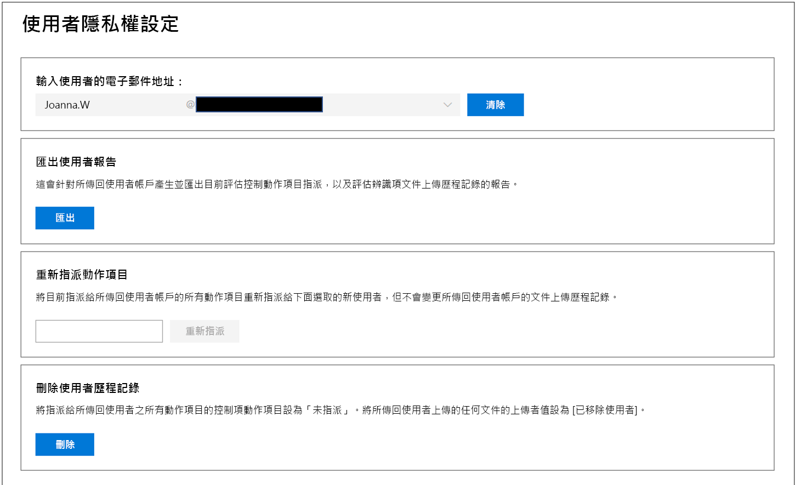

# 使用 Microsoft 合規性管理員（預覽）Working with Microsoft Compliance Manager (preview)

> [!IMPORTANT]
> Microsoft 合規性管理員是一種儀表板和管理工具，可提供您的資料保護和合規性 stature 的摘要，以及改善資料保護和合規性的建議。Microsoft Compliance Manager is a dashboard and management tool that provides a summary of your data protection and compliance stature and recommendations to improve data protection and compliance. 合規性管理員中提供的客戶動作為建議。The customer actions provided in Compliance Manager are recommendations. 在實施之前，您的組織可以評估這些建議在其各項法規環境中的效能。It is up to your organization to evaluate the effectiveness of these recommendations in their respective regulatory environment prior to implementation. 您不應將合規性管理員中找到的建議視為合規性的保證。Recommendations found in Compliance Manager should not be interpreted as a guarantee of compliance.

## Access 合規性管理員Access Compliance Manager

合規性管理員可以從 Microsoft 服務信任入口網站存取。Compliance Manager is accessible from the Microsoft Service Trust Portal. 任何具有 Microsoft 帳戶或 Azure Active Directory 組織帳戶的人都可以存取合規性管理員。Anyone with a Microsoft account or Azure Active Directory organizational account can access Compliance Manager.

1. 請移至 [https://servicetrust.microsoft.com/ComplianceManager/V3](https://servicetrust.microsoft.com/ComplianceManager/V3)。Go to [https://servicetrust.microsoft.com/ComplianceManager/V3](https://servicetrust.microsoft.com/ComplianceManager/V3).

2. 使用您的 Microsoft 服務帳戶登入，這是您的 Office 365、Microsoft 365 或 Azure Active Directory （Azure AD）使用者帳戶。Sign in with your Microsoft service account, which is your Office 365, Microsoft 365, or Azure Active Directory (Azure AD) user account.

> [!NOTE]
> 在服務信任入口網站中，選取 [**合規性管理員**]，這是具有最新功能的預覽版本。In the Service Trust Portal, select **Compliance Manager**, which is the preview version with the most current features. 請勿選取 **[合規性管理員（經典）**]，其中包含本檔尚未涵蓋的早期版本功能。Do not select **Compliance Manager (classic)**, which contains early-release features not covered by this documentation.

## 系統管理Administration

只有全域系統管理員可以使用特定的管理功能，而且只有當以全域系統管理員帳戶登入時才會顯示。There are specific administrative functions that are only available to the global administrator and only visible when logged in with a global administrator account. 全域管理員可以：The global administrator can:
- [指派使用者角色Assign user roles](#assigning-compliance-manager-roles-to-users)
- [開啟和關閉自動安全分數更新Turn on and off automatic Secure Score updates](#controlling-automatic-secure-score-updates)
- [設定使用者隱私權設定Configure user privacy settings](#configuring-user-privacy-settings)
  
### 將合規性管理員角色指派給使用者Assigning Compliance Manager roles to users

一旦管理員將合規性管理員角色指派給其他使用者，這些使用者便可在合規性管理員中查看資料，並執行其角色所決定的動作。Once the administrator assigns Compliance Manager roles to other users, those users can view data in Compliance Manager and perform actions determined by their role. 管理員也可以在[Azure Active Directory （AZURE AD）中](https://docs.microsoft.com/azure/active-directory/users-groups-roles/directory-assign-admin-roles#global-reader)指派使用者的全域讀取者角色，授與合規性管理員的唯讀存取權。The administrator can also give read-only access to Compliance Manager by assigning the user the [Global Reader role in Azure Active Directory (Azure AD)](https://docs.microsoft.com/azure/active-directory/users-groups-roles/directory-assign-admin-roles#global-reader).

每個合規性管理員角色都具有稍有不同的許可權。Each Compliance Manager role has slightly different permissions. 您可以查看指派給每個角色的許可權、查看哪些使用者屬於哪些角色，以及透過服務信任入口網站新增或移除該角色中的使用者。You can view the permissions assigned to each role, see which users are in which roles, and add or remove users from that role through the Service Trust Portal. 選取 [**管理**] 功能表項目目，然後選擇 [要查看的**設定**]。Select the **Admin** menu item, and choose **Settings** to view.
  

  
若要新增使用者或從合規性管理員角色中移除使用者。To add or remove users from Compliance Manager roles.
  
1. 請移至 [https://servicetrust.microsoft.com](https://servicetrust.microsoft.com)。Go to [https://servicetrust.microsoft.com](https://servicetrust.microsoft.com).

2. 使用您的 Azure Active Directory 全域系統管理員帳戶登入。Sign in with your Azure Active Directory global administrator account.

3. 在服務信任入口網站頂端功能表列上，選取 [系統**管理員**]，然後選擇 [**設定**]。On the Service Trust Portal top menu bar, select **Admin** and then choose **Settings**.

4. 在 [**選取角色**] 下拉式清單中，選取您要管理的角色。In the **Select Role** drop-down list, select the role that you want to manage.

5. 新增至每個角色的使用者會列在 [選取角色]\*\*\*\* 頁面上。Users added to each role are listed on the **Select Role** page.

6. 若要將使用者新增至此角色，請選取 [**新增**]。To add users to this role, select **Add**. 在 [**新增使用者**] 對話方塊中，選取 [使用者] 欄位。In the **Add Users** dialog, select the user field. 您可以在可用的使用者清單中向內移動，或是開始輸入使用者名稱，以根據您的搜尋字詞篩選清單。You can scroll through the list of available users or begin typing the user name to filter the list based on your search term. 選取要將該帳戶新增至以該角色布建的 [**新增使用者**] 清單中的使用者。Select the user to add that account to the **Add Users** list provisioned with that role. 如果您想要同時新增多個使用者，請開始輸入使用者名稱以篩選清單，然後選取要新增至清單的使用者。If you would like to add multiple users concurrently, begin typing a user name to filter the list, and then select the user to add to the list. 選取 [**儲存**]，將選取的角色布建給這些使用者。Select **Save** to provision the selected role to these users. 

    
  
7. 若要移除此角色中的使用者，請選取使用者，然後選取 [**刪除**]。To remove users from this role, select the users and select **Delete**.

    

### 控制自動安全分數更新Controlling automatic Secure Score updates

您可以使用下列步驟，針對所有動作，關閉所有動作，關閉所有動作，或透過個別動作設定安全分數更新。Secure Score updates can be turned on automatically for all actions, turned off for all actions, or set by individual action by following these steps.

1. 使用您的全域系統管理員帳戶登入[服務信任入口網站](https://servicetrust.microsoft.com)。Sign in to the [Service Trust Portal](https://servicetrust.microsoft.com) with your global administrator account.

2. 在服務信任入口網站頂端功能表列上，按一下 [**其他**] 下的 [系統**管理員**]，然後選擇 [**設定**]。On the Service Trust Portal top menu bar, under **More**, select **Admin** and then choose **Settings**.

3. 在 [**安全分數**] 索引標籤中，選取對應的按鈕來**開啟所有動作**、**關閉所有動作**，或**設定每個動作。**In the **Secure Score** tab, select the corresponding button to either **turn on for all actions**, **turn off for all actions**, or **set per action.**

如果您選擇 [**依動作設定]，請**採取下列額外步驟，為個別動作開啟安全分數更新：If you choose **set per action,** take these additional steps to turn on Secure Score updates for individual actions:

4. 從上方功能表中選取 [**合規性管理員**] （附注：不要選取「合規性管理員（古典）」）。Select **Compliance Manager** from the top menu (note: do not select "Compliance Manager (classic)").

5. 在螢幕的右上角選取 [**租使用者管理**]。Select **Tenant Management** in the upper-right corner of your screen.

6. 在 [**客戶動作**] 窗格上，在 [**受影響的動作**] 欄下，以省略號（**...**）尋找您的預定動作。On the **Customer Actions** pane, find your intended action with an ellipsis (**...**) under the **Affected Actions** column. 按一下省略號，然後選取 [**編輯]。**Click on the ellipses and select **Edit.**

7. 將**安全分數連續更新**切換開關切換為 [**開啟]。**Switch the **Secure Score continuous update** toggle switch to **On.**

8. 選取 [**儲存]。**Select **Save.** 安全分數連續監控現在已開啟該動作。Secure Score continuous monitoring is now turned on for that action.

**附注：** 只有全域系統管理員才能開啟或關閉所有動作的自動更新。**Note:** Only the global administrator can turn on or off automatic updates for all actions. 合規性管理員可以為個別動作開啟自動更新，但不能為全域動作開啟所有動作。The Compliance Manager administrator can turn on automatic updates for individual actions, but not for all actions globally.

### 設定使用者隱私權設定Configuring user privacy settings

某些法規要求組織能夠刪除使用者的記錄資料。Certain regulations require an organization to be able to delete user history data. 若要啟用此功能，**使用者隱私權設定**功能可讓系統管理員：To enable this, the **User Privacy Settings** functions allow administrators to:
  
- [使用者搜尋Search for a user](#search-for-a-user)

- [匯出帳戶資料歷程記錄的報告Export a report of account data history](#export-a-report-of-account-data-history)

- [重新指派動作項目Reassign action items](#reassign-action-items)

- [刪除使用者資料歷程記錄Delete user data history](#delete-user-data-history)
    

  
#### 搜尋使用者Search for a user

若要搜尋使用者帳戶：To search for a user account:
  
1. 輸入使用者電子郵件地址的別名 (位在 @ 符號左邊的資訊)，然後按一下右邊的網域尾碼清單以選擇網域名稱。Enter the user email address by typing in the alias (the information to the left of the @ symbol) and choosing the domain name by clicking the domain suffix list on the right. 如果您的組織有多個註冊的網域，您可以加倍檢查電子郵件地址功能變數名稱尾碼，以確定其是否正確。If your organization has multiple registered domains, you can double check the email address domain name suffix to ensure that it is correct.
    
2. 當您輸入正確的使用者名稱時，請選取 [**搜尋**]。When you have the username correctly entered, select **Search**.
    
3. 如果找不到使用者帳戶，將會在頁面上顯示「找不到使用者」錯誤訊息。If the user account is not found, the error message 'User not found' will be displayed on the page. 請檢查使用者的電子郵件地址資訊，必要時進行修正，然後選取 [**搜尋**] 再試一次。Check the user's email address information, make corrections as necessary and select **Search** to try again.
    
4. 找到使用者帳戶時，按鈕的文字會從 [搜尋]\*\*\*\* 變更為 [清除]\*\*\*\*，這表示傳回的使用者帳戶是額外功能的作業內容，將會顯示在下面，且執行這些功能將會套用到這個使用者帳戶。If user account is found, the text of the button changes from **Search** to **Clear**, which indicates that the returned user account is the operating context for the additional functions that will be displayed below, that running those functions will apply to this user account.
    
5. 若要清除搜尋結果並搜尋不同的使用者，請選取 [**清除**]。To clear search results and search for a different user, select **Clear**.
    
#### 匯出帳戶資料歷程記錄的報告Export a report of account data history

識別使用者帳戶之後，您可能會想要產生一份與此帳戶相關的相依性報告。Once the user account has been identified, you may wish to generate a report of dependencies that exist linked to this account. 這個資訊可以讓您重新指派開放的動作項目，或是確保存取先前上傳的證明。This information allows you to reassign open action items or ensure access to previously uploaded evidence.
  
 若要產生並匯出報告：To generate and export a report:
  
1. 選取 [**匯出**]，以產生及下載目前指派給傳回之使用者帳戶的合規性管理員控制項動作專案，以及該使用者上傳的檔案清單。select **Export** to generate and download a report of the Compliance Manager control action items currently assigned to the returned user account and the list of documents uploaded by that user. 如果沒有任何指派的動作或上傳的檔，錯誤訊息就會顯示「沒有此使用者的資料」。If there are no assigned actions or uploaded documents, an error message displays "No data for this user."

2. 報告會在使用中瀏覽器視窗的背景下載。The report downloads in the background of the active browser window. 如果您看不到下載快顯視窗，請檢查您的瀏覽器下載歷程記錄。If you don't see a download pop up, check your browser download history.

3. 開啟文件以檢視報告資料。Open the document to review the report data.

> [!NOTE]
> 這並不是歷程記錄報告，會保留並顯示動作項目作業歷程記錄的狀態變更。所產生的報告是報告執行時所指派項目的控制項動作項目 (寫入報表的日期和時間戳記) 的快照。例如，如果針對相同的使用者重新產生此報告，動作項目的任何後續重新指派都將會導致不同的快照報告資料。This is not a historical report that retains and displays state changes to action item assignment history. The generated report is a snapshot of the control action items assigned at the time that the report is run (date and time stamp written into the report). For instance, any subsequent reassignment of action items will result in different snapshot report data if this report is generated again for the same user.
  
#### 重新指派動作項目Reassign action items

這項功能可讓組織移除使用者帳戶上任何使用中或未完成的相依性，方法是將所傳回使用者帳戶的所有動作項目擁有權 (其中同時包含作用中和已完成的動作項目) 重新指派給下面選取的新使用者。此動作不會變更已傳回使用者帳戶的文件上傳歷程記錄。This function enables an organization to remove any active or outstanding dependencies on the user account by reassigning all action item ownership (which includes both active and completed action items) from the returned user account to a new user selected below. This action does not change document upload history for the returned user account.
  
 若要將動作項目重新指派給其他使用者：To reassign action items to another user:
  
1. 按一下輸入方塊以瀏覽並選取所傳回使用者的動作項目應被指派的組織中的另一位使用者。Click the input box to browse for and select another user within the organization to whom the returned user's action items should be assigned.
    
2. 選取 [取代]\*\*\*\* 以將所傳回使用者的所有控制項動作項目重新指派給新選取的使用者。Select **Replace** to reassign all control action items from the returned user to the newly selected user.
    
3. 隨即會顯示確認對話方塊，「這會將目前使用者的所有控制動作專案重新指派給選取的使用者。A confirmation dialog box appears stating, "This will reassign all control action items from the current user to the selected user. 這個動作無法復原。This action cannot be undone. 您確定要繼續？」Are you sure you want to continue?"
    
4. 若要繼續，請選取 **[確定]**，否則請選取 [**取消**]。To continue, select **OK**, otherwise select **Cancel**.
    
> [!NOTE]
> 所有的動作項目 (作用中及已完成) 將會指派給新選取的使用者。不過，此動作不會影響文件上傳歷程記；先前指派使用者所上傳的任何文件仍會顯示日期/時間和先前指派使用者的名稱。All action items (both active and completed) will be assigned to the newly selected user. However, this action does not affect the document upload history; any documents uploaded by the previously assigned user will still show the date/time and name of the previously assigned user. 
  
變更文件上傳歷程記錄以移除先前指派的使用者必須以手動程序執行。在這種情況下，系統管理員必須：Changing the document upload history to remove the previously assigned user will have to be done as a manual process. In that case, the administrator will need to:
  
1. 開啟先前已下載的 [匯出] 報告。Open the previously downloaded Export report.
  
2. 找出並瀏覽至所需的控制項動作項目。Identify and navigate to the desired control action item.
  
3. 選取 [**管理檔**] 以流覽至該控制項的證據存放庫。Select **Manage Documents** to navigate to the evidence repository for that control.
  
4. 下載文件。Download the document.
  
5. 刪除辨識存放庫中的文件。Delete the document in the evidence repository.
  
6. 重新上傳檔。Re-upload the document. 現在檔會有新的上傳日期、時間及「上傳者」的使用者名稱。The document will now have a new upload date, time, and "Uploaded by" username.
  
#### 刪除使用者資料歷程記錄Delete user data history

這會將指派給所傳回使用者之所有動作項目的控制項動作項目設為「未指派」。這也會將所傳回使用者上傳的任何文件的上傳者值設為 [已移除使用者]This sets control action items to 'unassigned' for all action items assigned to the returned user. This also sets uploaded by value to 'user removed' for any documents uploaded by the returned user
  
 若要刪除使用者帳戶動作項目和文件上傳記錄：To delete the user account action item and document upload history:
  
1. 選取 [刪除]\*\*\*\*。Select **Delete**.

2. 確認對話方塊隨即顯示：「這會移除所有控制項動作專案指派，以及所選使用者的檔上傳記錄。A confirmation dialog displays: "This will remove all control action item assignments and the document upload history for the selected user. 這個動作無法復原。This action cannot be undone. 您確定要繼續？」Are you sure you want to continue?"
    
3. 若要繼續，請選取 **[確定]**，否則請選取 [**取消**]。To continue, select **OK**, otherwise select **Cancel**.

## 群組Groups

群組是容器，可讓您組織評估，並在具有相同或相關客戶管理控制措施的評估之間共用一般資訊和工作流程工作。Groups are containers that allow you to organize Assessments and share common information and workflow tasks between Assessments that have the same or related customer-managed controls.

您可以根據對您邏輯的方式來群組評估，例如依年、標準、服務或組織的小組、部門或地理區域。You can group Assessments in a way that is logical to you, such as by year, standard, service, or based on your organization's teams, divisions, or geographies. 以下是兩個群組和其基礎評估的範例：Below are examples of two groups and their underlying Assessments:
  
- **FFIEC 是評估2020****FFIEC IS Assessments 2020**
  - Office 365 + FFIEC 是Office 365 + FFIEC IS
  - Intune + FFIEC 是Intune + FFIEC IS
- **資料安全性與隱私權評估****Data Security and Privacy Assessments**
  - Office 365 + ISO 27001:2013Office 365 + ISO 27001:2013
  - Office 365 + ISO 27018:2014Office 365 + ISO 27018:2014

> [!NOTE]
> 建議您先判斷貴組織的群群組原則，*然後再*新增新的評估。We recommend determining a grouping strategy for your organization *before* adding new Assessments.

為了讓您開始，您會為您設定一個包含資料保護基準的**預設**群組。To get you started, a **Default** group is set up for you that contains the Data Protection Baseline. 此基準是一組包含常見工業法規和標準的控制項（[深入瞭解](compliance-score-methodology.md#initial-score-based-on-microsoft-365-data-protection-baseline)）。This baseline is a set of controls that includes common industry regulations and standards ([learn more](compliance-score-methodology.md#initial-score-based-on-microsoft-365-data-protection-baseline)).

### 如何建立群組How to create a group

群組無法建立為獨立實體。Groups cannot be created as standalone entities. 群組必須至少包含一個評估，因此若要建立群組，您必須先建立評估以放置在群組中。A group must always contain at least one Assessment, so in order to create a group, you must first create an Assessment to put in the group.

請遵循下列步驟建立群組：Follow the steps below to create a group:

1. 您可以在儀表板頂端的附近，選取 [新增**評估**]，以建立新的評估。Create a new Assessment by selecting **+ Add Assessment** near the top of your dashboard.
2. 在 [**評估**] 快顯視窗中，輸入評估的標題，然後從下拉式功能表中選取範本。From the **Assessment** flyout pane, enter a title for your Assessment and select a template from the drop-down menu.
3. 在 [**請選取群組或新增**群組] 中，選取 [**新增群組**]，然後在下欄欄位中輸入您的組名。At **Please select a group or add a new group**, select **Add a new group** and enter your group name in the field below.
4. 若要複製現有群組中的資訊，請切換 [**您想要從現有的群組複製資料嗎？** ] 切換至 [**開啟]。**To copy information from an existing group, toggle the **Would you like to copy the data from an existing group?** switch to **On.** 從下拉式功能表中選取您要複製的群組，然後選取您想要在新群組中執行新評估的任何欄位核取方塊。Select the group you want to copy from the drop-down menu underneath, and select the checkboxes of any fields you want to carry over to the new Assessment in your new group.
5. 選取 **[儲存]**。Select **Save**. 完成後，就會關閉彈出窗格，您會在儀表板上看到您的新群組。When completed, the flyout pane closes and you'll see your new group on your dashboard.

使用群組時所知道的事項：What to know when working with groups:
  
- 組名（也稱為「*群組 IDs*）在您的組織中必須是唯一的。Group names (also called *Group IDs*) must be unique within your organization.
- 群組沒有任何安全性屬性。Groups do not have any security properties. 擁有權限都與評估相關聯。All permissions are associated with Assessments.
- 將評估新增至群組之後，就無法變更該群組。Once you add an Assessment to a group, the grouping cannot be changed. 您可以重新命名評估群組，這會變更與該群組相關之所有評估的評估群組名稱。You can rename the assessment group, which changes the name of the assessment grouping for all the assessments associated with that group.
- 完成時，相同群組內的相關評估控制項會自動更新。Related Assessment controls in different Assessments within the same group automatically update when completed.
- 如果您將新的評估新增至現有的群組，則會將該群組中評估的一般資訊複製到新的評估。If you add a new Assessment to an existing group, common information from Assessments in that group are copied to the new Assessment.
- 群組可以包含同一個憑證或法規的評估，但是每個群組只能包含特定產品認證組的一個評估。Groups can contain Assessments for the same certification or regulation, but each group can only contain one Assessment for a specific product-certification pair. 例如，群組不可包含針對 Office 365 和 NIST CSF 的兩項評估。For example, a group can't contain two Assessments for Office 365 and NIST CSF. 只有在每個群組的對應憑證或法規不同時，群組才可以包含同一個產品的多項評估。A group can contain multiple Assessments for the same product only if the corresponding certification or regulation for each one is different.
- 隱藏評估會中斷這種評估與群組之間的關係。Hiding an Assessment breaks the relationship between that Assessment and the group. 其他相關評估的任何進一步更新都會不再反映在隱藏評估中。Any further updates to other related Assessments are no longer reflected in the hidden assessment. （[瞭解如何隱藏評估。](#hide-a-template-or-an-assessment)）([Learn how to hide Assessments.](#hide-a-template-or-an-assessment))
- 無法刪除群組。Groups cannot be deleted.
- 當對出現于多個群組中的動作專案進行變更時，該變更會反映在該動作專案的所有實例中。When a change is made to an Action Item that appears in multiple Groups, that change is reflected in all instances of that Action Item.

## 對維度、擁有者、& 客戶動作的承租人管理Tenant management of dimensions, owners, & customer actions

**承租人管理**介面可讓您管理這些組織範圍的設定：The **Tenant Management** interface enables you to manage these organization-wide settings:

- **維度：** View 可讓您建立自訂樞軸篩選的範本、評估及動作專案的中繼資料。**Dimensions:** View metadata for Templates, Assessments, and Action Items that allow you to create custom pivots for filters.
- **擁有者：** 填入可與動作相關聯的責任方清單。**Owners:** Populate a list of responsible parties that can be associated with actions.
- **客戶動作：** 管理合規性管理員（預覽）中包含的完整動作專案清單，並啟用/停用以安全分數整合之動作的安全評分監控。**Customer Actions:** Manage the complete list of Actions Items included in Compliance Manager (Preview) and enable/disable Secure Score monitoring for Actions that are integrated with Secure Score.

從畫面的右上角選取 [**租使用者管理**] 以開啟管理介面，並使用下列步驟來管理**維度**、**擁有**者及**客戶動作**。Select **Tenant Management** from the upper-right corner of your screen to open the management interface, and use the steps below to manage  **Dimensions**, **Owners**, and **Customer Actions**.

### DimensionsDimensions

維度是一組中繼資料，可提供範本、評估或交辦事項的相關資訊。Dimensions are sets of metadata that provide information about a Template, an Assessment, or an Action Item. 維度使用索引鍵和值的概念，其中維度索引鍵代表屬性，維度值代表屬性的有效值。Dimensions use the concept of Keys and Values, where the Dimension Key represents a property, and Dimension Value represents valid values for the property. 例如，在合規性管理員中，有三種類型的動作。For example, in Compliance Manager there are three types of Actions. 它們是由**動作目的**的維度鍵和**預防**、**偵探**和**修正**的維度值所定義。They are defined by a Dimension Key of **Action Purpose** and Dimension Values of **Preventative**, **Detective**, and **Corrective**.

### 擁有者Owners

擁有者可用於識別每個控制項的負責人。Owners are used to identify the person responsible for each control. 所有內建的控制項都是由 Microsoft、客戶或兩者所擁有。All built-in controls are owned by Microsoft, by customers, or by both. 您可以為擁有者建立自訂值，以用於在組織中指定更細微的責任。You can create custom values for Owners that can be used to specify more granular responsibilities within your organization. 例如，您可以建立代表組織內特定群組、小組或業務單位的擁有者。For example, you could create Owners that represent specific groups, teams, or business units within your organization.

#### 新增擁有者Add an Owner

1. 開啟**租使用者管理**，然後選取 [**擁有**者]。Open **Tenant Management** and select **Owners**.
2. 選取 [ **+ 新增擁有**者]。Select **+ Add owner**.
3. 提供擁有者的名稱和描述，然後選取 [**儲存**]。Provide a Name and Description for the Owner and select **Save**. 描述會顯示在 [擁有者] 欄中。The description is displayed in the Owner column.

#### 編輯擁有者Edit an Owner

您無法編輯擁有者名稱，但您可以修改顯示在 [擁有者] 欄中的描述。You can't edit an Owner name, but you can modify the description that is displayed in the Owner column.

1. 開啟**租使用者管理**，然後選取 [**擁有**者]。Open **Tenant Management** and select **Owners**.
2. 找到您要編輯的擁有者，選取其旁邊的省略號（...），然後選取 [**編輯**]。Locate the Owner you want to edit, select the ellipses (…) next to it, and select **Edit**.
3. 視需要修改描述，然後選取 [**儲存**]。Modify the Description as needed and select **Save**.

#### 刪除擁有者Delete an Owner

1. 開啟**租使用者管理**，然後選取 [**擁有**者]。Open **Tenant Management** and select **Owners**.
2. 找到您想要刪除的擁有者，選取其旁邊的省略號（...），然後選取 [**刪除**]。Locate the Owner you want to delete, select the ellipses (…) next to it, and select **Delete**.
3. 出現確認訊息時，請選取 [**刪除**]。When the confirmation message appears, select **Delete**.

### 客戶動作Customer Actions

[客戶動作] 區域會顯示合規性管理員（預覽）中所有範本及評估的所有客戶動作。The Customer Actions area shows all the customer actions for all Templates and Assessments in Compliance Manager (Preview).

您可以快速查看動作的標題、擁有者、類別、強制執行和評分，並判斷是否與安全分數整合。At a glance, you can see an Action's title, owner, category, enforcement, and score, and determine if it is integrated with Secure Score. 您可以展開動作並選取 [**讀取**]，以閱讀動作的描述並存取描述中的任何連結。You can expand an Action and select **Read More** to read the Action's description and access any links in the description. 您也可以使用此介面來啟用及停用以每個動作為基礎的安全分數整合，以及新增自訂動作。You can also use this interface to enable and disable Secure Score integration on a per-action basis, and to add custom actions. 具有安全計分整合功能的動作旁會有省略號（...）（請注意，自訂動作旁邊也有省略號）。Actions that have Secure Score integration capabilities have an ellipsis (…) next to them (note that custom actions also have an ellipsis next to them).

#### 啟用或停用安全分數整合Enable or disable Secure Score integration

1. 針對您要修改的動作選取省略號（...），然後選取 [**編輯**]。Select the ellipses (…) for the Action you want to modify and select **Edit**.
2. 切換切換參數，以取得安全分數連續更新為開啟或關閉，以啟用或停用透過安全分數的連續監控。Toggle the switch for Secure Score continuous update to On or Off to enable or disable continuous monitoring through Secure Score.
3. 選取 **[儲存]**。Select **Save**.

當組織第一次部署 Microsoft 365 或 Office 365 時，會花大約7天的時間進行保護，以完全收集資料，並將其劃分為您的分數。When organizations first deploy Microsoft 365 or Office 365, it takes approximately seven days for Secure Score to fully collect data and factor it into your score. 在這段時間內，將安全計分連續更新參數設定為**Off** ，並手動設定所要**執行**的動作，就會將該動作計算為您的分數。During that time, setting the Secure Score continuous update switch to **Off** and manually setting an action to **implemented** will count that action toward your score. 在最初7天后，開啟安全分數連續更新會啟用從該點繼續進行監視。After the initial seven days, turning Secure Score continuous update back on will enable continuous monitoring from that point forward.

安全分數整合不支援的任何動作都可以手動實施。Any actions that are not supported by Secure Score integration can be manually implemented. 手動執行將會考慮該動作群組的分數。A manual implementation will factor into the score for that action's group.

## 評估Assessments

本節說明如何查看和使用評估，包括如何新增、匯出、複製現有評估中的資訊，以及透過版本設定將其更新。This section explains how to view and work with your Assessments, including how to add new ones, export them, copy information from existing Assessments, and keep them updated through versioning.

> [!NOTE]
> 您現在可以在合規性分數中建立評估。You can now create assessments in Compliance Score. [查看指導方針和指示](compliance-score-assessments.md)。[View guidance and instructions](compliance-score-assessments.md).

### 查看評估和動作詳細資料View an Assessment and Action details
  
在 [**評估**] 儀表板中，選取 [評估名稱] 以開啟它，然後查看 [動作專案] 和 [控制項] 資訊。In the **Assessments** dashboard, select the assessment name to open it and view the Action Items and Controls Info.

以下是 Office 365 及 ISO 27001 評估的範例。Here's an example of the Assessment for Office 365 and ISO 27001. 第一個視圖說明合規性管理員（預覽）中的新動作專案視圖。The first view illustrates the new Action Items view in Compliance Manager (Preview).

動作會以字母順序列出，而且每個動作都會被指派分數和擁有者。The Actions are listed in alphabetical order, and each Action is assigned a score and an owner. 選取 [**讀取其他**] 連結，以閱讀每個動作的詳細資料。Select  the **Read More** link to read the details of each Action.

選取 [**檢查**] 連結，以管理、指派、實施及測試動作。Select the **Review** link to manage, assign, implement, and test the action. 以下是範例動作。Below is an example Action.

使用下欄欄位來管理動作工作流程：Use the following fields to manage the Action workflow:

- **指派使用者：** 選取此欄位，以選擇或輸入應指派此動作的使用者。**Assign User:** Select this field to choose or enter the user to whom this Action should be assigned. 您可以在清單中滾動，或輸入名稱來尋找，然後選取它。You can scroll through the list, or type a name to find it, and then select it.
- **管理檔：** 您可以以 Office 檔、圖像檔案及螢幕擷取畫面的形式上傳執行證據，在 CSV 或 TXT 中 PowerShell 輸出，以及 Pdf。**Manage Documents:** You can upload evidence of implementation in the form of Office documents, image files and screenshots, PowerShell output in CSV or TXT, and PDFs.
- **實施狀態：** 用來指出動作目前的執行狀態。**Implementation Status:** Used to indicate the Action's current implementation status. 可能的值尚未實現、已實現、替代的實施、規劃中和不在範圍內。Possible values are Not Implemented, Implemented, Alternative Implementation, Planned, and Not in Scope.
- **實施日期：** 採取動作的日期。**Implementation Date:** The date on which the Action was taken.
- **測試結果：** 用來指出實施驗證的結果。**Test Result:** Used to indicate the results of implementation validation. 可能的值不會評估、傳遞、失敗-低風險、失敗-中低風險、失敗-高風險，而且不在範圍內。Possible values are Not Assessed, Passed, Failed-Low Risk, Failed-Medium Risk, Failed-High Risk, and Not in Scope.
- **測試日期：** 驗證發生的日期。**Test Date:** The date on which validation occurred.
- **執行附注：** 輸入組織的執行詳細資料，以及您想要包含的任何附注。**Implementation Notes:** Enter implementation details for your organization, along with any notes that you want to include.
- **測試方案：** 輸入此動作的測試計劃詳細資料，以及您要包含的任何附注。**Test Plan:** Enter the test plan details for this action, along with any notes that you want to include.
- **其他資訊：** 輸入有關此動作或其在組織中實施方式的任何其他資訊，以及您想要加入的任何附注。**Additional Information:** Enter any additional information about this Action or how it was implemented in your organization, along with any notes you want to include.

在 [**控制項資訊**] 儀表板上，您可以在評估與範本層級查看控制項資訊。On the **Controls Info** dashboard, you can view information for controls at the Assessment and Template level. 以下是評估的控制項資訊儀表板的範例。Below is an example of the Controls Info dashboard for Assessments.

針對評估，[控制項資訊] 儀表板會顯示下列資訊：For Assessments, the Controls Info dashboard displays the following information:

- **群組**下拉式清單，可選取要查看的群組（使用多個群組時）。A **Group** dropdown to select which Group to view (when using multiple groups).
- **評估**下拉式功能表，以選取要查看的評估。An **Assessment** dropdown to select which Assessment to view.
- 所選評估的中繼資料，包括：Metadata about the selected Assessment, including:
    - **評估控制項**的進度指標，顯示超過控制項總數的評估的控制項數目。A progress indicator for **Assessed Controls** showing the number of assessed controls over the total number of controls.
    - 評估的目前**符合性分數**，顯示為百分數。The current **Compliance Score** for the Assessment, shown as a percentage.
    - 評估中所用之**憑證及\*\*\*\*產品**的詳細資料。Details about the **Certification** and **Product** used in the Assessment.
    - 評估的目前**狀態**和上次**修改**日期。The current **Status** of and last **Modified** date for the Assessment.
- 評估的**範圍服務**清單。A list of **In Scope Services** for the Assessment.
- 控制項的詳細資料，依控制項系列分組，包含客戶動作和 Microsoft 執行詳細資料的連結：Details of the controls, grouped by Control Family, with links to customer actions and Microsoft implementation details:
    - **您的動作**會顯示您可以執行的客戶動作，以滿足部分或所有控制項的需求。**Your Actions** displays the customer actions that you can perform to satisfy some or all the control's requirements. 許多控制項具有多個與其相關聯的動作，而且所有與控制項關聯的動作都會顯示在這裡。Many controls have multiple Actions associated with them, and all Actions associated with a control are displayed here. 這裡的動作與動作儀表板中所列的 UI 相同。The Actions here have the same UI as those listed in the Actions dashboard.
    - **Microsoft 動作**會顯示 Microsoft 內部架構中套用至所選認證控制項的控制項清單。**Microsoft Actions** displays the list of controls from Microsoft's internal framework that apply to the selected certification control. 針對每個內部控制，選取 [已**執行**]，以查看 Microsoft 的執行和測試詳細資料，以及測試結果和測試日期，如下所示。For each internal control, select **Implemented** to see Microsoft's implementation and test details, along with the test result and test date, as shown below.

### 新增評估Add an Assessment
  
1. 在 [評估] 儀表板中，選取 [ **+ Add 評估**]。In the Assessments dashboard, select **+ Add Assessment**.

2. 當刀片式伺服器開啟時，請輸入下列資訊：When the blade opens, enter the following information:

    - **職稱（必要）：** 輸入評估的標題**Title (required):** Enter a title for your Assessment
    - **請選取範本（必要）：** 選取標準或自訂範本**Please select a template (required):** Select a standard or custom template
    - **請選取群組或新增新的群組（必要）：** 選取現有的群組，或選擇新增群組，並提供唯一的組名**Please select a group or add a new group (required):** Select an existing group or choose to add a new group, and provide a unique group name
    - **您要複製現有群組中的資料嗎？（選用）：** 切換控制項以啟用群組副本，然後：**Would you like to copy the data from an existing group? (optional):** Toggle the control to enable group copy and then:
        - **選取群組（選用）：** 如果已啟用群組副本，請選取要複製的群組**Select a group (optional):** If group copy is enabled, select the group to copy from
            - **執行詳細資料（選用）：** 選取以將實現詳細資料複製到新的群組**Implementation Details (optional):** Select to copy implementation details to the new group
            - **測試計劃 & 其他資訊（選用）：** 選取以將測試計劃及其他資訊詳細資料複製到新的群組**Test plan & additional information (optional):** Select to copy test plan and additional information details to the new group
            - **檔（選用）：** 選取以將檔案複製到新的群組**Documents (optional):** Select to copy documents to the new group

3. 選取 [**儲存**] 以建立評估。Select **Save** to create the Assessment.

 評估儀表板上會顯示新的評估，並顯示下列資訊：The new Assessment appears on the Assessment dashboard and displays the following information:

- 評估的標題。The title of the Assessment.
- 評估的維度，包括憑證、環境和套用至評估的產品。The dimensions of the Assessment, including certification, environment, and product applied to the Assessment.
- 其建立日期和上次修改日期的日期。The date it was created and date when it was last modified.
- 評估分數顯示為百分比。The Assessment Score shown as a percentage. 這個分數會自動包含您的分數從 Microsoft 管理的控制項，以及從安全得分。This score automatically includes your scores from Microsoft-managed controls and from Secure Score.
- 顯示已評估的 Microsoft 管理和客戶管理控制措施數目的進度指標。Progress indicators that show the number of assessed Microsoft-managed and customer-managed controls.

### 從現有「評定」複製資訊Copying information from existing Assessments

當您建立評估時，您可以選擇複製現有群組中的資訊。When you create an Assessment, you have the option to copy information from an existing group. 複製功能可讓您將輸入到複製評估中的資訊套用到新評估中的相同控制項。Copying allows you to apply the information entered into the copied assessment to the same controls in the new Assessment. 例如，如果您的組織中有所有 FFIEC 相關評估的群組，您可以從現有評估中複製下列資訊：For example, if you have a group for all FFIEC-related Assessments in your organization, you can copy the following information from existing assessments:

- 執行詳細資料Implementation Details
- 測試計劃 & 其他資訊Test Plan & Additional Information
- 文件Documents

#### 將現有評估的資訊複製到新的評估Copy information from an existing Assessment to a new Assessment
  
1. 在 [評估] 儀表板中，選取 [ **+ Add 評估**]。In the Assessment dashboard, select **+ Add Assessment**.
    
2. 在 [**新增評估**] 視窗中，完成下列資訊：In the **Add an Assessment** window, complete the following information

    - **職稱（必要）：** 輸入評估的標題。**Title (required):** Enter a title for your Assessment.
    - **請選取範本（必要）：** 選取標準或自訂的範本。**Please select a template (required):** Select a standard or custom template.
    - **請選取群組或新增新的群組（必要）：** 選擇 [新增**群組**]，並提供唯一的組名。**Please select a group or add a new group (required):** Choose **Add a new group** and provide a unique group name.
    - **您要複製現有群組中的資料嗎？（選用）：** 將控制項切換至開啟以啟用群組副本，然後：**選取群組（選用）：** 如果已啟用群組副本，請選取要複製的群組。**Would you like to copy the data from an existing group? (optional):** Toggle the control to On to enable group copy and then: - **Select a group (optional):** If group copy is enabled, select the group to copy from.
            - **執行詳細資料（選用）：** 選取可將實現詳細資料複製到新的群組。- **Implementation Details (optional):** Select to copy implementation details to the new group.
            - **測試計劃 & 其他資訊（選用）：** 選取以將測試計劃及其他資訊詳細資料複製到新群組。- **Test plan & additional information (optional):** Select to copy test plan and additional information details to the new group.
            - **檔（選用）：** 選取以將檔案複製到新的群組。- **Documents (optional):** Select to copy documents to the new group.

3. 選取 [**儲存**] 以建立評估。Select **Save** to create the Assessment.

### 評估更新的版本設定警示Versioning alerts for Assessment updates

當評估有可用的更新時，提醒圖示會通知您有更新準備就緒。When an update is available for an Assessment, an alert icon notifies you that an update is ready. 當您按一下該圖示時，會快顯視窗來說明更新，並提示您接受。When you click on that icon, a pop-up window explains the update and prompts you to accept. 以下是評估的版本設定警示範例：Below is an example of the versioning alert for an Assessment:

選取警示圖示會顯示彈出窗格，說明更新並提示您接受：Selecting the alert icon reveals a flyout pane explaining the update and prompting you to accept:

我們強烈建議您在收到更新通知時接受所有更新。We strongly recommend accepting all updates when you receive update notifications.

### 匯出評估Export an Assessment

您可以將評估匯出至您組織中或外部審計員和主管的符合性專案關係人的 Excel 檔。You can export an Assessment to an Excel file for compliance stakeholders in your organization or for external auditors and regulators. 報表是指報表建立日期和時間的評估快照。The report is a snapshot of the Assessment as of the date and time that the report is created. 報告包含針對評估、控制執行狀態、控制測試日期、測試結果，以及提供上傳的證據檔連結的所有 Microsoft 及客戶管理控制項的詳細資料。The report contains the details for all Microsoft and customer-managed controls for the Assessment, control implementation status, control test date, test results, and provides links to uploaded evidence documents.
  
### 匯出評估報告Export an Assessment report
  
1. 在 [合規性管理員] 儀表板上，選取 [**控制項資訊**] 索引標籤。On the Compliance Manager dashboard, select **Controls Info** tab.
2. 在下拉式功能表中，選取您要匯出之評估的**群組**和**評估**。Select the **Group** and **Assessment** in the drop-down menus for the Assessment you want to export.
3. 選取 [**匯出**] 按鈕。Select the **Export** button.

在您的瀏覽器會話中，會將評估報告當做 Excel 檔案下載。The assessment report is downloaded as an Excel file in your browser session. Excel 檔案的 files 名稱預設為評估的標題。The files name for the Excel file defaults to the title of the Assessment.

### 隱藏範本或評估Hide a Template or an Assessment

當您完成範本或評估，但是不再因相容性目的而需要時，您可以將它從您的視圖中隱藏。When you are finished with a Template or Assessment and no longer need it for compliance purposes, you can hide it from your view. 當範本或評估隱藏時，它會從預設視圖中移除，您必須選取 [**包含隱藏**] 核取方塊加以顯示。When a Template or Assessment is hidden, it is removed from the default view, and you must select **Include Hidden** checkbox to display it.

> [!IMPORTANT]
> 隱藏評估不會保留其上傳的證據檔的連結。Hidden Assessments don't retain their links to uploaded evidence documents. 強烈建議您在隱藏評估之前先將其匯出，以保留報告中的證據檔連結。We highly recommended that you export an Assessment before hiding it to retain links to evidence documents in the report.
  
#### 隱藏範本Hiding a Template

1. 開啟 [**範本**] 儀表板。Open the **Templates** dashboard.
2. 找到您想要隱藏的範本，並在其列的省略號上，選取 [**隱藏**]。Locate the Template you want to hide and at the ellipses in its row, select **Hide**.
3. 當您看到確認訊息時，請選取 [**隱藏**]。When you see the confirmation message, select **Hide**.

#### 隱藏評估Hide an Assessment

1. 開啟 [**評估**儀表板]。Open the **Assessments** dashboard.
2. 從下拉式清單中，選取包含您想要隱藏之評估的**群組**。Select the **Group** from the dropdown that contains the Assessment you want to hide.
3. 找到您想要隱藏的評估，並選取省略號，選取 [**隱藏**]。Locate the Assessment you want to hide and at the ellipses, select **Hide**.
4. 當您看到確認訊息時，請選取 [**隱藏**]。When you see the confirmation message, select **Hide**.

#### 查看隱藏評估View hidden Assessments
  
1. 開啟 [**評估**儀表板] 索引標籤，然後選取 [**包含隱藏**] 核取方塊。Open the **Assessments** dashboard tab and select the **Include Hidden** checkbox.
2. 隱藏評估會顯示在 [**隱藏評估**] 區段中。The hidden assessments appear in the **Hidden Assessments** section.

#### 取消隱藏評估Unhide an Assessment

1. 在 [**評估**] 索引標籤上，選取 [**包含隱藏**] 核取方塊。On the **Assessments** tab, select the **Include Hidden** checkbox.
2. 隱藏評估會顯示在 [**隱藏評估**] 區段中。The hidden assessments appear in the **Hidden Assessments** section.
3. 找到您想要取消隱藏的評估，並選取省略號，選取 [**取消隱藏**]。Locate the Assessment you want to unhide and at the ellipses, select **Unhide**.
4. 當您看到確認訊息時，請選取 [**取消隱藏**]。When you see the confirmation message, select **Unhide**.

## 控制項和動作Controls and Actions

控制項和動作是合規性管理員（預覽）中所使用的主要資料轉動。Controls and Actions are the primary data pivots used in Compliance Manager (Preview). 在舊版本的合規性管理員中，控制項 pivot 已增強，可在相同的控制系列中顯示 Microsoft 和客戶控制項。The Control pivot, which existed in previous versions of Compliance Manager, has been enhanced to show the Microsoft and customer controls in the same control families. 這種合併的視圖可讓您更容易查看每個控制項的完整共用責任模型。This consolidated view makes it easier to see the complete shared responsibility model on a per-control basis. Action pivot 是合規性管理員（預覽）中的新功能，其設計目的是為了提供 Microsoft 建議的所有動作的簡潔觀點。The Action pivot is new in Compliance Manager (Preview) and it is designed to provide a streamlined view of all of actions recommended by Microsoft.

### 控制項Controls

控制項可以從 [控制項資訊] 儀表板中查看。Controls can be viewed from the Controls Info dashboard. 控制項代表標準、認證、法規或架構中的需求。Controls represent the requirements from a standard, certification, regulation, or framework. 若要將這些需求對應至多個標準、法規等專案，並將這些需求與動作相關聯，請將所有專案視為控制項框架。To map these requirements across multiple standards, regulations, etc., and to associate them with Actions, everything is treated as if it were a control framework. 例如，像是控制架構之外，規章（如 HIPAA）已細分為一節，合規性管理員中的 HIPAA 控制項使用與這些區段相同的編號配置，如下所示：For example, like a control framework, regulations, such as HIPAA, have been broken down by section, and the HIPAA controls in Compliance Manager use the same numbering scheme as those sections, as shown below:

控制項有三種類型：There are three types of controls:

1. **Microsoft 受管理的控制項：** 這些是只有 Microsoft 有責任的控制項。**Microsoft-managed controls:** these are controls for which only Microsoft has responsibility. 它們會顯示在 box 範本中，並由 Microsoft 新增至合規性管理員。They appear in the in-box Templates and are added to Compliance Manager by Microsoft.
2. **客戶管理的控制項：** 這些是只有客戶具有責任的控制項。**Customer-managed controls:** these are controls for which only customers have responsibility. 它們會顯示在 box 範本中，並由客戶新增至合規性管理員。They appear in the in-box Templates and are added to Compliance Manager by customers.
3. **共用管理控制措施：** 這些是在 Microsoft 與客戶之間共用責任的控制。**Shared management controls:** these are controls where responsibility is shared between Microsoft and the customer. 這些範本會出現在 box 範本中，並由 Microsoft 新增至合規性管理員。These appear in the in-box Templates and are added to Compliance Manager by Microsoft. 客戶也可以編輯或停用 Microsoft 管理的控制項。The customer can also edit or disable Microsoft-managed controls.

### Actions 專案Actions Items

動作專案是實施標準或法規需求的建議工作，或是用來測試、驗證及記錄組織的執行需求。Actions Items are the recommended tasks for implementing the requirements of a standard or regulation, or to test, verify, and document your organization's implementation requirements. 動作與一個或多個控制項相關聯。Actions are associated with one or more Controls. 每個控制項都有一個或多個與其相關聯的動作，而且每個動作都可以與一個或多個控制項產生關聯。Each Control has one or more Action associated with it, and each Action can be associated with one or more Controls. 動作是合規性管理員（預覽）中核心工作流程的一部分，因為它們是指派、追蹤及驗證組織的物件。Actions are part of the core workflow in Compliance Manager (Preview), as they are the objects that are assigned, tracked, and validated by your organization.

#### 指派動作專案Assign Action Items
  
1. 在 [**動作專案**] 儀表板上，選取包含要指派其動作之評估的**群組**。On the **Action Items** dashboard, select the **Group** containing the Assessment(s) whose Action you want to assign.
2. 在 [**評估**] 下拉式清單中，選取您要指派其動作的評估，或從下拉式清單中選取 [**全部**]，以查看所有可用的動作。In the **Assessment** dropdown, select the Assessment whose Action you want to assign, or select **All** from the dropdown to see all available Actions.
3. 找到您要指派的動作，然後在 [**擁有**者] 欄位中，選取要**複查**的連結、\* \* 已執行或**測試**。Locate the Action you want to assign, and in the **Owner** column, select the link for **Review**, \*\*Implemented, or **Test**.
4. 選取 [**指派使用者**] 欄位，並顯示您組織中的使用者清單。Select the **Assign User** field, and a list of users in your organization appear. 滾動清單並選取使用者或篩選清單，以選取使用者的名稱來選取使用者。Scroll the list and select user or filter the list to select a user by typing in the user's name.
5. 在 [執行附注] 欄位中，輸入您想要傳遞給指派使用者的任何附注。In the Implementation Notes field, enter any notes you wish to convey to the assigned user.
6. 選取 [**儲存**] 以指派動作。Select **Save** to assign the Action.

#### 重新指派動作專案Reassign Action Items

此功能可讓組織將動作重新指派給新使用者，以移除使用者帳戶上任何使用中或尚未完成的相關性。This function enables an organization to remove any active or outstanding dependencies on the user account by reassigning an Action to a new user.

1. 在 [**動作專案**] 儀表板上，選取包含您想要重新指派其動作之評估的**群組**。On the **Action Items** dashboard, select the **Group** containing the Assessment(s) whose Action you want to reassign.
2. 在 [**評估**] 下拉式清單中，選取您要重新指派其動作的評估，或從下拉式清單中選取 [**全部**]，以查看所有可用的動作。In the **Assessment** dropdown, select the Assessment whose Action you want to reassign, or select **All** from the dropdown to see all available Actions.
3. 找到您想要重新指派的動作，然後在 [**擁有**者] 欄中，選取要**複查**、**實施**或**測試**的連結。Locate the Action you want to reassign, and in the **Owner** column, select the link for **Review**, **Implemented**, or **Test**.
4. 從 [**指派使用者**] 欄位中刪除現有的使用者，並從使用者清單中選擇不同的使用者，或透過輸入使用者的名稱來篩選清單，以選取使用者。Delete the existing user from the **Assign User** field, and either choose a different user from the list of users or filter the list to select a user by typing in the user's name.
5. 在 [執行附注] 欄位中，輸入您想要傳遞給使用者的任何附注。In the Implementation Notes field, enter any notes you wish to convey to the user.
6. 選取 [**儲存**] 以重新指派動作。Select **Save** to reassign the Action.

#### 不同群組的常見動作專案同步狀態Common Action Items synch status across Groups

如果您的組織有多個評估群組，則會有技術動作（也就是影響整個組織的動作）的行為。If your organization has multiple groups of assessments, there is a behavior of Technical actions (that is, actions affecting your entire organization). 群組間的任何重複動作現在會合並成一個單一動作。Any duplicate actions across groups are now combined into one single action. 單一巨集指令包含先前重複的版本中所有上傳的記事及證據。That single action contains all uploaded notes and evidence from previously duplicate versions. 在一個群組或評估中對動作所做的任何變更，都會反映在該動作的所有實例中。Any change made to the action in one group or assessment will be reflected in all instances of that action. 「**實施狀態**」、「**實施日期**」、「**測試狀態**」及「**測試日期**」欄位會反映最新的更新。The **Implementation Status**, **Implementation Date**, **Test Status**, and **Test Date** fields reflect the most recent updates.

## 範本Templates

範本是合規性管理員（預覽）中與產品及認證（例如，standard、管制、控制架構等）相關聯的基礎物件。A Template is the base object in Compliance Manager (Preview) that is associated with a product and a certification (for example, standard, regulation, control framework, etc.). 您可以從 [**範本**] 儀表板中查看及新增範本。Templates can be viewed and added from the **Templates** dashboard.

 
儀表板會顯示每個範本，以及與範本相關聯的憑證及產品、客戶的範本建立和上次修改的日期、客戶和 Microsoft 管理的控制項數目、範本的最大合規性分數，以及範本的狀態（例如，已核准、待定核准、匯入）。The dashboard displays each Template, along with the Certification and Product associated with the Template, the dates on which the Template was created and last modified, the number of customer and Microsoft-managed controls, the maximum Compliance Score for the Template, and the status of the Template (for example, Approved, Pending Approval, Imported).

### 建立範本Create a Template

使用範本來建立評估的方法有三種：There are three ways to work with Templates to create Assessments:

1. 使用其中一種準備使用 Microsoft 提供的範本。Use one of the ready to use Templates provided by Microsoft.
2. 透過擴充程式，自訂現成的動作和控制項的可使用範本。Customize a ready to use Template with your own actions and controls through the extension process.
3. 建立您自己的範本，並將其匯入合規性管理員。Create your own Template and import it into Compliance Manager.

> [!NOTE]
> 當您將範本上傳到合規性管理員時，必須透過保留系統管理員角色的兩位使用者核准它，然後才可使用。When you upload a template into Compliance Manager, it must be approved by two users who hold an admin role before it is published and available for use.

#### 使用準備使用的範本Use a ready to use Template

您可以在**範本**儀表板上使用範本。Ready to use templates are available on your **Templates** dashboard. 查看目前的[範本清單](compliance-score-templates.md)，該清單會在每次新的範本可用時更新。View the current [list of templates](compliance-score-templates.md), which is updated each time a new template is available.

#### 透過擴充處理常式自訂範本Customize a Template through the extension process

1. 開啟 [**範本**] 儀表板，然後選取 [ **+ 新增範本**]。Open the **Templates** dashboard and select **+ Add Template**.
2. 在 [範本] 飛入窗格上，選取 [**從通用範本建立副檔名**] 核取方塊。On the Template flyout pane, select the **Create extension from global template** checkbox.
3. 從下拉式功能表中選取您要擴充的範本。Select the template you want to extend from the drop-down menu.
4. 若尚未在 Excel 中格式化範本資料，請選取彈出窗格中的連結，以下載 Excel 檔案。If you have not already formatted your template data in Excel, select the link in the flyout pane to download an Excel file. 請根據下列[Excel](#import-template-data-with-excel)指示填寫試算表，並將其儲存至您的本機磁片磁碟機。Fill out the spreadsheet according to the [Import Template data with Excel](#import-template-data-with-excel) instructions below and save it to your local drive.
5. 選取 **[流覽]** 以上傳您的 Excel 檔案，以匯入自訂的範本資料。Import your customized template data by selecting **Browse** to upload your Excel file.
6. 選取 [**新增至儀表板**]。Select **Add to Dashboard**.
7. 對範本所做的變更需要有兩個擁有系統管理員角色的使用者核准。The changes to the template require approval of two users who hold an admin role. 這些使用者會收到範本更新的通知。Those users receive a notification of the template updates. 有兩個系統管理員核准變更，您會在 [**範本**] 儀表板上看到更新的範本。One the changes are approved by two admins, you'll see your updated template on your **Templates** dashboard.

#### 建立您自己的範本，並將其匯入合規性管理員Create your own Template and import it into Compliance Manager

1. 開啟 [**範本**] 儀表板，然後選取 [ **+ 新增範本**]。Open the **Templates** dashboard and select **+ Add Template**.
2. 在 [範本] 飛入窗格上，選取 [**建立新的範本**]。On the Template flyout pane, select **Create a new template**.
3. 選取 **[流覽]** 以上傳包含資料的 Excel 檔案（請參閱下列[Excel 的匯入範本資料](#import-template-data-with-excel)），以匯入範本資料。Import your template data by selecting **Browse** to upload your Excel file containing the data (see [Import Template data with Excel](#import-template-data-with-excel) below).
4. 選取 [**新增至儀表板**]。Select **Add to Dashboard**.
5. 新的範本需要有兩個擁有系統管理員角色的使用者核准。The new template requires approval of two users who hold an admin role. 這些使用者接收新範本可供核准的通知。Those users receive a notification that a new template is ready for approval. 一個範本已由兩個系統管理員核准，您會在 [**範本**] 儀表板上看到新的範本。One the template is approved by two admins, you'll see your new template on your **Templates** dashboard.

#### 使用 Excel 匯入範本資料Import Template data with Excel

若要修改範本或建立您自己的範本，您會使用[Excel 試算表](https://go.microsoft.com/fwlink/?linkid=2124865)來捕獲必要的資料，並將其上傳到合規性管理員。To modify a template or create your own template, you'll use an [Excel spreadsheet](https://go.microsoft.com/fwlink/?linkid=2124865) to capture the necessary data and upload it to Compliance Manager. 這個試算表範本具有必須使用的特定格式和架構，否則將不會匯入至合規性管理員。This spreadsheet template has a specific format and schema that must be used or it will not import into Compliance Manager.

> [!IMPORTANT]
> 如果您先前已在合規性管理員中建立或自訂範本，則**此程式最近已更新。請仔細閱讀本節。**If you've created or customized templates in Compliance Manager before, **this process has been recently updated. Please review this section carefully.**

試算表包含四個選項卡，其中三個是必要的：The spreadsheet contains four tabs, three of which are required:

1. 範本（必要）Template (required)
2. ControlFamily （必要）ControlFamily (required)
3. 動作（必要）Actions (required)
4. 維度（選用）Dimensions (optional)

您的試算表**必須依此順序包含**索引標籤，否則您的資料將無法成功匯入至範本。Your spreadsheet **must include the tabs in this order**, otherwise your data won't successfully import to a template.

##### 範本] 索引標籤Template tab

[**範本**] 索引標籤是必要的。The **Template** tab is required. 此索引標籤中的資訊提供範本的中繼資料。The information in this tab provides metadata about the template. 有四個必要的欄。There are four required columns. 欄必須保留在 Excel 工作表上如下所列的順序。The columns must retain the order on the Excel sheet as listed below. 您可以在四欄**後**新增您自己的欄，以提供您自己的維度。You can add your own column **after** the four columns to provide your own dimensions. 如果您這麼做，請務必使用[下列指示](#dimensions-tab)將其新增至 [**維度**] 索引標籤。If you do this, be sure to add them to the **Dimensions** tab using the [instructions below](#dimensions-tab).

- **職稱**：這是範本的標題，必須是唯一的。**title**: This is the title for your template, which must be unique. 您可以在合規性管理員中與其他範本共用名稱稱，不論它是您已建立的範本，還是由 Microsoft 提供的預先設定的範本。It can't share a name with another template you have in Compliance Manager, whether it's a template you already created, or a pre-configured template provided by Microsoft.

- **產品**：這是必要的維度。**product**: This is a required dimension. 列出與範本相關聯的產品。List the product associated with the template.

- **認證**：這是您用來做為範本的規章。**certification**: This is the regulation you're using for the template.

- **inScopeServices**：這些是此項評估所定址之產品中的服務（例如，如果您列為 Office 365 做為產品，則 Microsoft 團隊可能是一個範圍內的服務）。**inScopeServices**: These are the services within the product that this assessment addresses (for example, if you listed Office 365 as the product, Microsoft Teams could be an in-scope service). 您可以列出多個以兩個分號分隔的服務。You can list multiple services separated by two semi-colons.

> [!NOTE]
> 關於產品和憑證：在您匯入試算表以建立或自訂範本之後，您在 [**產品**] 和 [憑證 **] 儲存格中**插入的資料將無法編輯。Regarding product and certification: The data you insert in the **product** and **certification** cells cannot be edited after you import the spreadsheet to create or customize a template. 此外，群組不能包含兩個具有相同**產品/認證**組合的評估。Also, a group cannot contain two assessments that have the same **product/certification** combination. 您可以有多個範本具有相同的產品/認證組合。You can have multiple templates that have the same product/certification combination.

##### ControlFamily] 索引標籤ControlFamily tab

[ **ControlFamily** ] 索引標籤是必要的。The **ControlFamily** tab is required.  此索引標籤中的必要欄（必須遵循範例試算表中提供的順序）為：The required columns in this tab, which must follow the order provided in the sample spreadsheet, are:

- **controlName**：這是來自憑證、標準或法規（通常是某些類型的 ID）的控制項名稱。**controlName**: This is the control name from the certification, standard, or regulation, which is typically some type of ID. 控制項名稱在範本內必須是唯一的。Control names must be unique within a template. 試算表中不可以有多個具有相同名稱的控制項。You can't have multiple controls with the same name in the spreadsheet.

- **controlFamily**：提供 controlFamily 的單字或片語，它會識別控制項的廣泛群組。**controlFamily**: Provide a word or phrase for the controlFamily, which identifies a broad grouping of controls. ControlFamily 不必是唯一的;它可以在試算表中列出一次以上。A controlFamily doesn't have to be unique; it can be listed more than once in a spreadsheet. 同一個 controlFamily 也可以列于多個範本中，但彼此之間彼此沒有關系。The same controlFamily can also be listed in multiple templates, though they have no relation to each other. 每個 controlFamily 都必須對應至至少一個控制項。Every controlFamily must be mapped to at least one control.

- **controlTitle**：提供控制項的標題。**controlTitle**: Provide a title for the control. 雖然 controlName 是參考碼，但標題是一般會出現在規章中的 rtf 文字格式。Whereas the controlName is a reference code, the title is a rich text format typically seen in the regulations.

- **controlDescription**：提供控制項的描述。**controlDescription**: Provide a description of the control.

- **controlActionTitle**：這是您想要與此控制項相關之動作的標題。**controlActionTitle**: This is the title of an action that you want to relate to this control. 您可以新增多個分號，並以兩個分號隔開，中間沒有空格。You can add multiple actions by separating by two semi-colons with no space in between. 您清單中的每個控制項都必須至少包含一個動作，且該動作必須存在（這表示您可以在相同試算表的 [**動作**] 索引標籤上列出的動作，也就是 Microsoft 所建立的動作）。Every control you list must include at least one action, and the action must exist (which means you can list an action that you list on the **Actions** tab of the same spreadsheet, an action that exists in a different template, or an action created by Microsoft). 不同的控制項可以參照相同的動作。Different controls can reference the same action.

##### 動作] 索引標籤Actions tab

[**動作**] 索引標籤是必要的。The **Actions** tab is required.  它會指定您組織的動作，而不是 Microsoft 的動作，該動作已存在於合規性管理員中。It designates actions of your organization and not the actions of Microsoft, which already exist in Compliance Manager. 此索引標籤的必要欄（必須遵循範例試算表中提供的順序）為：The required columns for this tab, which must follow the order provided in the sample spreadsheet, are:

- **actionTitle**：這是您動作的標題，而且是必要的欄位。**actionTitle**: This is the title for your action and is a required field. 您提供的標題必須是唯一的。The title you provide must be unique. **重要**：如果您參考的是已存在的動作（例如另一個範本），並在後續欄中修改其任何元素，這些變更將會傳播至其他範本中的相同動作。**Important**: if you reference an action you own that already exists (such as in another template) and you modify any of its elements in the subsequent columns, those changes will propagate to the same action in other templates.

- **implementationType**：在此必要欄位中，列出下列三種實施類型之一：**implementationType**: In this required field, list one of the three implementation types below:
    - **操作**-由人員和程式所執行的動作，以保護組織系統、資產、資料和人員的機密性、完整性和可用性（範例：安全性意識和訓練）**Operational** - actions implemented by people and processes to protect the confidentiality, integrity, and availability of organizational systems, assets, data, and personnel (example: security awareness and training)
    - **技術**-透過使用資訊系統的硬體、軟體或固件元件所包含的技術和機制完成的動作，以保護組織系統和資料的機密性、完整性和可用性（範例：多重要素驗證）**Technical** - actions completed through the use of technology and mechanisms contained in the hardware, software, or firmware components of the information system to protect the confidentiality, integrity, and availability of organizational systems and data (example: multi-factor authentication)
    - **檔**-透過記錄的原則及程式所實施的動作，建立及定義保護組織系統、資產、資料和人員的機密性、完整性和可用性所需的控制項（範例：資訊安全性原則）**Documentation** - actions implemented through documented policies and procedures establishing and defining the controls required to protect the confidentiality, integrity, and availability of organizational systems, assets, data, and personnel (example: an information security policy)

- **actionScore**：在這個必要的欄位中，為您的動作提供數值分數值。**actionScore**: In this required field, provide a numeric score value for your action. 它必須是介於1到99的整數。它不得為0、null 或空白。It must be a whole number ranging from 1 to 99; it cannot be 0, null, or blank. 數位越高，其價值越高，以改善您的相容性狀況。The higher the number, the greater its value toward improving your compliance posture. 如需相關指引，請參閱 Microsoft 如何評分其控制項：For guidance, see below how Microsoft scores its controls:

- **actionDescriptionTitle**：這是描述的標題，而且是必要專案。**actionDescriptionTitle**: This is the title of the description and is required. 此描述標題可讓您在多個範本中使用相同的動作，並在每個範本中呈現不同的描述。This description title allows you to have the same action in multiple templates and surface a different description in each template.  此欄位可協助您澄清描述所參照的範本。This field helps you clarify what template the description is referencing. 在大多數情況下，您可以在此欄位中放置您建立的範本名稱。In most cases, you can put the name of the template you're creating in this field.

- **actionDescription**：提供動作的描述。**actionDescription**: Provide a description of the action. 您可以套用粗體文字和超連結等格式。You can apply formatting such as bold text and hyperlinks. 這是必要欄位。This is required field.

- **維度-動作目的**：這是選用的欄位。**dimension-Action Purpose**: This is an optional field. 如果包含此標頭，則標頭必須包含 "dimension" 前置詞。If you include it, the header must include the "dimension-" prefix. 您將在此處包含的任何維度，都將做為[符合性分數中的篩選器](compliance-score-setup.md#filtering-your-dashboard-view)，並顯示在合規性分數的「改進動作詳細資料」頁面Any dimensions you include here will be used as [filters in Compliance Score](compliance-score-setup.md#filtering-your-dashboard-view) and appear on the improvement actions details page in Compliance Score.

##### 維度] 索引標籤Dimensions tab

[**維度**] 索引標籤是選用的。The **Dimensions** tab is optional. 不過，如果您在其他位置參照維度，但如果它不存在於您已建立的範本或在 Microsoft 範本中，則需要在這裡加以指定。However, if you reference a dimension elsewhere, you need to specify it here if it does not exist in a template you've already created or in a Microsoft template. 此索引標籤的欄如下所示：The columns for this tab are listed below:

- **dimensionKey**：清單為 "product"，"認證，" 「動作目的」**dimensionKey**: list as "product", "certifications," "action purpose"
- **dimensionValue**：範例： Office 365、HIPPA、預防性、偵探**dimensionValue**: examples: Office 365, HIPPA, Preventative, Detective

您可以前往**租使用者管理**，然後選取 [**維度**] 索引標籤，以查看現有的維度。此外，當您匯出現有的範本時，匯出的試算表會有 [**維度**] 索引標籤，該索引標籤會列出範本中所用的所有維度。You can view your existing dimensions by going to **Tenant Management** and selecting the **Dimensions** tab. Also, anytime you export an existing template, the exported spreadsheet will have the **Dimensions** tab, which lists all the dimensions used in the template.

### 修改現有範本Modify an existing Template

若要使用以上所述的匯入程式，對您建立或自訂的範本進行變更，您可以使用相同的程式，將這些變更匯入至您的範本。To make changes to a Template you created or customized using the import process outlined above, you use the same process to import those changes into your Template.

> [!NOTE]
> 編輯範本元件時，請注意許多重要因素，因此請仔細閱讀本節。There are several important factors to be aware of as you edit template components, so please review this section carefully.

#### 修改範本的一般程式General process for modifying a Template

若要變更組織的現有範本之一，一般處理常式如下：To make changes to one of your organization's existing templates, the general process is:

1. 從您的**範本**儀表板中，選取您要修改的範本，它會彈出您的 [**控制項資訊**] 儀表板，顯示**範本**索引標籤。From your **Templates** dashboard, select the Template you want to modify, which brings up your **Controls Info** dashboard showing your **Template** tab.
2. 從這裡，選取 [**匯出**]。From here, select **Export**. 將下載所有範本資料的 Excel 工作表。An Excel sheet with all your template data will download.
3. 若要編輯、新增或移除動作，請參閱下列各節。To edit, add, or remove an action, see the sections below.
4. 當您完成 Excel 檔案的變更後，請從儀表板選取範本，然後選取 [匯入]，將檔案匯入**範本。**When you're done making changes to your Excel file, import the file back into the template by selecting the template from your dashboard and selecting **Import**. 您的範本現在會包含您所做的變更。Your template will now include the changes you made.

#### 編輯範本屬性To edit Template attributes

在 [**範本**] 索引標籤上，您可以編輯 [**標題**] 欄中的任何專案、[ **inScopeServices** ] 欄，以及您可能新增的任何其他欄位。On the **Templates** tab, you can edit anything in the **title** column, the **inScopeServices** column, and in any other column you may have added. 不過，您無法在 [**產品**] 或 [**認證**] 欄中編輯任何專案。However, you can't edit anything in the **product** or **certification** columns.

#### 若要將動作新增至範本To add an action to a Template

1. 移至 [**動作**] 索引標籤，並將您的資訊新增至現有動作下方第一個空白列的必要欄位中。Go to the **Actions** tab and add your information in the required fields in the first empty row underneath your existing actions.
2. 移至 [ **ControlFamily** ] 索引標籤。找到包含您動作所對應之控制項的列。Go to your **ControlFamily** tab. Find the row containing the control your action maps to. 將您的新動作新增至該資料列中的 [ **controlActionTitle** ] 欄（請記得在此欄位中分隔多個動作，並使用兩個分號，其間沒有間距）。Add your new action to the **controlActionTitle** column in that row (remember to separate multiple actions in this field with two semi-colons, no space in between).
3. 將試算表儲存至您的本機電腦。Save your spreadsheet to your local machine.

#### 編輯動作的資訊To edit an action's information

您可以變更*其標題以外*的任何動作的資訊。You can change any action's information *except for its title*. 您可以編輯來自 B + + 的任何儲存格，當您將檔案重新匯入範本時，該範本中的動作現在會包含更新的資料。You can edit any cell from columns B onward, and when you import the file back into the template, the actions in that template will now contain the updated data.

您無法編輯**actionTitle** （A 欄），因為如果您這麼做，合規性管理員會將此項視為新的動作。You cannot edit the **actionTitle** (column A) because if you do, Compliance Manager considers this to be a new action. 如果您想要變更動作的名稱，請參閱下列直接的指示。If you want to change an action's name, see the instructions immediately below.

#### 變更動作名稱To change the name of an action

如果您想要變更動作名稱，您必須在試算表中明確指定您要以新名稱取代現有名稱。If you want to change the name of an action, you have to explicitly designate in the spreadsheet that you are replacing an existing name with a new name. 若要變更動作的名稱，請遵循下列步驟：To change an action's name, follow these steps:

1. 在試算表的 [**動作**] 索引標籤中，將新欄新增至 a 欄後的試算表中。In the **Actions** tab of your spreadsheet, add a new column to the spreadsheet after column A.
2. 在這個新欄中（現在是 B 欄），置於第1列： **oldActionTitle**中的標題。In this new column, which is now column B, put as its header in row 1: **oldActionTitle**.
3. 複製欄 A 的內容，並將其貼到 B 欄中。這會將您現有的動作標題（即您想變更的專案）放入 B 欄中。Copy the contents of column A and paste them into column B. This puts your existing action titles, which are what you want to change, into column B.
4. 在 [欄位 A] 中， **actionTitle**] 刪除舊名稱，並以新名稱取代為您的動作。In column A, **actionTitle**, delete the old name and replace it with the new name for your action.

#### 移除範本中的動作To remove an action from a Template

從試算表中刪除某列的動作，**並不會**從您正在編輯的範本中移除動作。Deleting an action from a row in a spreadsheet **does not** remove the action from the template you're editing. 相反地，請遵循下列程式移除動作：Instead, follow the process below to remove an action:

1. 在 [**動作**] 索引標籤上，插入新欄做為 a 欄位，並將**作業放在**標題列中，也就是第一個資料行。On the **Actions** tab, insert a new column as column A and put **Operation** in the header row, which is row number one.
2. 在您要移除之動作的列上，在該列的 A 欄中將**Delete**放入該資料行。On the row for the action you want to remove, put **Delete** in column A for that row.
3. 請確定此巨集指令不再是控制項的參照。Ensure that this action is no longer referenced by a control. 移至 [ **ControlFamily** ] 索引標籤，並在 F 欄中尋找動作的標題，也就是**controlActionTitle**。Go to the **ControlFamily** tab and look for your action's title in column F, which is **controlActionTitle**.
4. 當您找到您列在 [ **controlActionTitle** ] 欄中的動作時，請加以刪除。When you find your action listed in the **controlActionTitle** column, delete it.
5. 將試算表儲存至您的本機電腦。Save your spreadsheet to your local machine.

當您將試算表重新匯入範本時，您的動作將會從範本移除。When you import your spreadsheet back into the template, your action will be removed from the template. 從範本移除動作不會完全移除動作。Removing an action from a template does not completely remove the action. 該動作仍可由另一個範本參照。That action can still be referenced by another template.

如果您要移除控制項所參照的最後一個動作，您必須移除該控制項。If you are removing the last action that a control references, then you need to remove the control.

> [!NOTE]
> 若要移除控制項：請遵循相同的程式移除如上所述的動作。To remove a control: Follow the same process for removing an action as outlined above. 在 [ **ControlFamily** ] 索引標籤中，新增 [作業 **] 欄，** 並將 [**刪除**] 放在您要移除的控制項旁。In the **ControlFamily** tab, add an **Operation** column and put **Delete** next to the control you want to remove.

### 範本的更新Updates to Templates

每次透過版本設定程式更新評估時，您的自訂評估會繼承這些更新，並保留您的自訂控制項。Each time an Assessment is updated through the versioning process, your customized Assessment will inherit those updates and keep your custom controls. 請參閱「[評估更新的版本設定警示](#versioning-alerts-for-assessment-updates)」。See [Versioning alerts for Assessment updates](#versioning-alerts-for-assessment-updates).

### 將範本匯出至 JSONExport a Template to JSON

合規性管理員（預覽）支援將範本匯出為 JavaScript 物件標記法（JSON）格式。Compliance Manager (Preview) supports exporting Templates to JavaScript Object Notation (JSON) format. 這可讓您將合規性管理員資料與其他支援 JSON 的系統交換。This enables you to exchange Compliance Manager data with other systems that support JSON.

## 報告Reports

您可以將評估匯出至您組織中或外部審計員和主管的符合性專案關係人的 Excel 檔。You can export an Assessment to an Excel file for compliance stakeholders in your organization or for external auditors and regulators. 報表是指匯出之日期和時間為止的評估快照。The report is a snapshot of the Assessment as of the date and time of the export. 報告包含 Microsoft 及客戶管理控制項的詳細資料，以供評估、控制執行狀態、控制測試日期、測試結果和上傳的證據檔的連結。The report contains the details for Microsoft and customer-managed controls for the Assessment, control implementation status, control test date, test results, and links to uploaded evidence documents. 因為隱藏評估未保留上載檔的連結，所以您應該先匯出評估，再將其隱藏。Because hidden Assessments don't retain links to uploaded documents, you should export the Assessment before you hide it.

### 匯出評估Export an Assessment

1. 在 [合規性管理員] 儀表板上，選取 [**控制項資訊**] 索引標籤。On the Compliance Manager dashboard, select **Controls Info** tab.
2. 在下拉式功能表中，選取您要匯出之評估的群組和評估。Select the Group and Assessment in the dropdown menus for the Assessment you want to export.
3. 選取 [匯出]。Select Export. 評估匯出會下載成 Excel 檔案。The Assessment export is downloaded as an Excel file.

## 權限Permissions

下表說明每個合規性管理員許可權及其允許使用者執行的動作。The following table describes each Compliance Manager permission and what it allows the user do. 該表也會指出指派每個許可權的角色。The table also indicates the role that each permission is assigned.

||**Azure AD 全域讀取器****Azure AD Global Reader**|**合規性管理員讀取者****Compliance Manager Reader**|**合規性參與者****Compliance Manager Contributor**|**合規性管理員評估者****Compliance Manager Assessor**|**合規性管理員管理者****Compliance Manager Administrator**|**入口網站管理員****Portal Admin**|
|:-----|:-----|:-----|:-----|:-----|:-----|:-----|
|**讀取資料：** 使用者可以讀取但不能編輯資料（範本資料和租使用者管理除外）。**Read data:** Users can read but not edit data (except for Template data and Tenant Management).    | XX | XX | XX | XX | XX  | XX |
|**編輯資料：** 除了 [測試結果] 和 [測試日期] 欄位（範本資料和租使用者管理以外）以外，使用者可以編輯所有欄位。**Edit data:** Users can edit all fields, except the Test Result and Test Date fields (except for Template data and Tenant Management).    ||| XX | XX  | XX | XX |
|**編輯測試結果：** 使用者可以編輯 [測試結果] 和 [測試日期] 欄位。**Edit test results:** Users can edit the Test Result and Test Date fields.    |||| XX | XX | XX |
|**管理評估：** 使用者可以建立、封存和刪除評估。**Manage assessments:** Users can create, archive, and delete Assessments.    ||||| XX | XX |
|**管理主資料：** 使用者可以查看、編輯和刪除範本資料及承租人管理資料。**Manage master data:** Users can view, edit, and delete template data and tenant management data.    ||||| XX | XX |
|**管理使用者：** 使用者可以將組織中的其他使用者新增至讀者、投稿人、Assessor 及系統管理員角色。**Manage users:** Users can add other users in their organization to the Reader, Contributor, Assessor, and Administrator roles. 只有在您組織中具有全域系統管理員角色的使用者，才可以從入口網站管理員角色新增或移除使用者。Only those users with the Global Administrator role in your organization can add or remove users from the Portal Admin role.    |||||| XX |