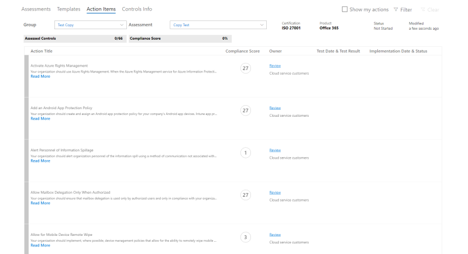
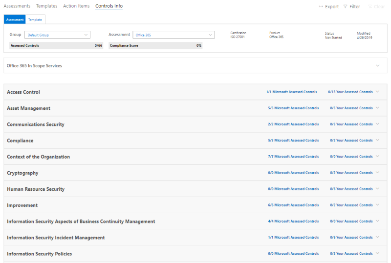
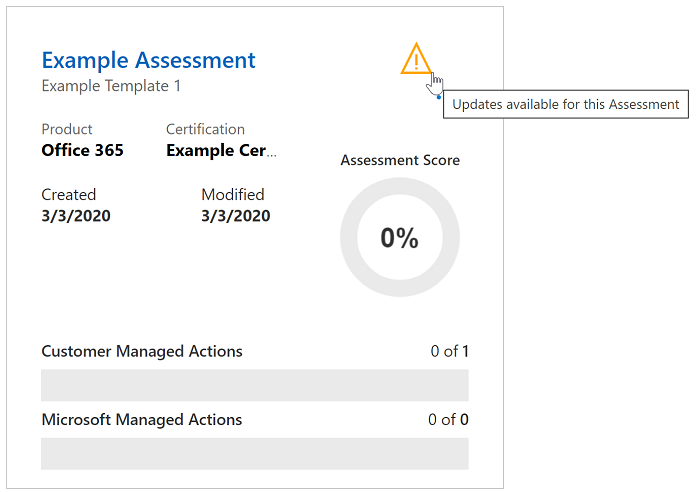

# 使用 Microsoft 合規性管理員（預覽）

> [!IMPORTANT]
> Microsoft 合規性管理員是一種儀表板和管理工具，可提供您的資料保護和合規性 stature 的摘要，以及改善資料保護和合規性的建議。 合規性管理員中提供的客戶動作為建議。 在實施之前，您的組織可以評估這些建議在其各項法規環境中的效能。 您不應將合規性管理員中找到的建議視為合規性的保證。

## Access 合規性管理員

合規性管理員可以從 Microsoft 服務信任入口網站存取。 任何具有 Microsoft 帳戶或 Azure Active Directory 組織帳戶的人都可以存取合規性管理員。

1. 請移至 [https://servicetrust.microsoft.com/ComplianceManager/V3](https://servicetrust.microsoft.com/ComplianceManager/V3)。

2. 使用您的 Microsoft 服務帳戶登入，這是您的 Office 365、Microsoft 365 或 Azure Active Directory （Azure AD）使用者帳戶。

> [!NOTE]
> 在服務信任入口網站中，選取 [**合規性管理員**]，這是具有最新功能的預覽版本。 請勿選取 **[合規性管理員（經典）**]，其中包含本檔尚未涵蓋的早期版本功能。

## 系統管理

只有全域系統管理員可以使用特定的管理功能，而且只有當以全域系統管理員帳戶登入時才會顯示。 全域管理員可以指派使用者權限並開啟自動安全分數更新。
  
### 將合規性管理員角色指派給使用者

一旦管理員將合規性管理員角色指派給其他使用者，這些使用者便可在合規性管理員中查看資料，並執行其角色所決定的動作。 管理員也可以在[Azure Active Directory （AZURE AD）中](https://docs.microsoft.com/azure/active-directory/users-groups-roles/directory-assign-admin-roles#global-reader)指派使用者的全域讀取者角色，授與合規性管理員的唯讀存取權。

每個合規性管理員角色都具有稍有不同的許可權。 您可以查看指派給每個角色的許可權、查看哪些使用者屬於哪些角色，以及透過服務信任入口網站新增或移除該角色中的使用者。 選取 [**管理**] 功能表項目目，然後選擇 [要查看的**設定**]。
  

  
若要新增使用者或從合規性管理員角色中移除使用者。
  
1. 請移至 [https://servicetrust.microsoft.com](https://servicetrust.microsoft.com)。

2. 使用您的 Azure Active Directory 全域系統管理員帳戶登入。

3. 在服務信任入口網站頂端功能表列上，選取 [系統**管理員**]，然後選擇 [**設定**]。

4. 在 [**選取角色**] 下拉式清單中，選取您要管理的角色。

5. 新增至每個角色的使用者會列在 [選取角色]**** 頁面上。

6. 若要將使用者新增至此角色，請選取 [**新增**]。 在 [**新增使用者**] 對話方塊中，選取 [使用者] 欄位。 您可以在可用的使用者清單中向內移動，或是開始輸入使用者名稱，以根據您的搜尋字詞篩選清單。 選取要將該帳戶新增至以該角色布建的 [**新增使用者**] 清單中的使用者。 如果您想要同時新增多個使用者，請開始輸入使用者名稱以篩選清單，然後選取要新增至清單的使用者。 選取 [**儲存**]，將選取的角色布建給這些使用者。 

    
  
7. 若要移除此角色中的使用者，請選取使用者，然後選取 [**刪除**]。

    

### 控制自動安全分數更新

您可以使用下列步驟，針對所有動作，關閉所有動作，關閉所有動作，或透過個別動作設定安全分數更新。

1. 使用您的全域系統管理員帳戶登入[服務信任入口網站](https://servicetrust.microsoft.com)。

2. 在服務信任入口網站頂端功能表列上，按一下 [**其他**] 下的 [系統**管理員**]，然後選擇 [**設定**]。

3. 在 [**安全分數**] 索引標籤中，選取對應的按鈕來**開啟所有動作**、**關閉所有動作**，或**設定每個動作。**

如果您選擇 [**依動作設定]，請**採取下列額外步驟，為個別動作開啟安全分數更新：

4. 從上方功能表中選取 [**合規性管理員**] （附注：不要選取「合規性管理員（古典）」）。

5. 在螢幕的右上角選取 [**租使用者管理**]。

6. 在 [**客戶動作**] 窗格上，在 [**受影響的動作**] 欄下，以省略號（**...**）尋找您的預定動作。 按一下省略號，然後選取 [**編輯]。**

7. 將**安全分數連續更新**切換開關切換為 [**開啟]。**

8. 選取 [**儲存]。** 安全分數連續監控現在已開啟該動作。

**附注：** 只有全域系統管理員才能開啟或關閉所有動作的自動更新。 合規性管理員可以為個別動作開啟自動更新，但不能為全域動作開啟所有動作。

## 群組

群組是容器，可讓您組織評估，並在具有相同或相關客戶管理控制措施的評估之間共用一般資訊和工作流程工作。

您可以根據對您邏輯的方式來群組評估，例如依年、標準、服務或組織的小組、部門或地理區域。 以下是兩個群組和其基礎評估的範例：
  
- **FFIEC 是評估2020**
  - Office 365 + FFIEC 是
  - Intune + FFIEC 是
- **資料安全性與隱私權評估**
  - Office 365 + ISO 27001:2013
  - Office 365 + ISO 27018:2014

> [!NOTE]
> 建議您先判斷貴組織的群群組原則，*然後再*新增新的評估。

為了讓您開始，您會為您設定一個包含資料保護基準的**預設**群組。 此基準是一組包含常見工業法規和標準的控制項（[深入瞭解](compliance-score-methodology.md#initial-score-based-on-microsoft-365-data-protection-baseline)）。

### 如何建立群組

群組無法建立為獨立實體。 群組必須至少包含一個評估，因此若要建立群組，您必須先建立評估以放置在群組中。

請遵循下列步驟建立群組：

1. 您可以在儀表板頂端的附近，選取 [新增**評估**]，以建立新的評估。
2. 在 [**評估**] 快顯視窗中，輸入評估的標題，然後從下拉式功能表中選取範本。
3. 在 [**請選取群組或新增**群組] 中，選取 [**新增群組**]，然後在下欄欄位中輸入您的組名。
4. 若要複製現有群組中的資訊，請切換 [**您想要從現有的群組複製資料嗎？** ] 切換至 [**開啟]。** 從下拉式功能表中選取您要複製的群組，然後選取您想要在新群組中執行新評估的任何欄位核取方塊。
5. 選取 **[儲存]**。 完成後，就會關閉彈出窗格，您會在儀表板上看到您的新群組。

使用群組時所知道的事項：
  
- 組名（也稱為「*群組 IDs*）在您的組織中必須是唯一的。
- 群組沒有任何安全性屬性。 擁有權限都與評估相關聯。
- 將評估新增至群組之後，就無法變更該群組。 您可以重新命名評估群組，這會變更與該群組相關之所有評估的評估群組名稱。
- 完成時，相同群組內的相關評估控制項會自動更新。
- 如果您將新的評估新增至現有的群組，則會將該群組中評估的一般資訊複製到新的評估。
- 群組可以包含同一個憑證或法規的評估，但是每個群組只能包含特定產品認證組的一個評估。 例如，群組不可包含針對 Office 365 和 NIST CSF 的兩項評估。 只有在每個群組的對應憑證或法規不同時，群組才可以包含同一個產品的多項評估。
- 隱藏評估會中斷這種評估與群組之間的關係。 其他相關評估的任何進一步更新都會不再反映在隱藏評估中。 （[瞭解如何隱藏評估。](#hide-a-template-or-an-assessment)）
- 無法刪除群組。
- 當對出現于多個群組中的動作專案進行變更時，該變更會反映在該動作專案的所有實例中。

## 對維度、擁有者、& 客戶動作的承租人管理

**承租人管理**介面可讓您管理這些組織範圍的設定：

- **維度：** View 可讓您建立自訂樞軸篩選的範本、評估及動作專案的中繼資料。
- **擁有者：** 填入可與動作相關聯的責任方清單。
- **客戶動作：** 管理合規性管理員（預覽）中包含的完整動作專案清單，並啟用/停用以安全分數整合之動作的安全評分監控。

從畫面的右上角選取 [**租使用者管理**] 以開啟管理介面，並使用下列步驟來管理**維度**、**擁有**者及**客戶動作**。

### Dimensions

維度是一組中繼資料，可提供範本、評估或交辦事項的相關資訊。 維度使用索引鍵和值的概念，其中維度索引鍵代表屬性，維度值代表屬性的有效值。 例如，在合規性管理員中，有三種類型的動作。 它們是由**動作目的**的維度鍵和**預防**、**偵探**和**修正**的維度值所定義。

### 擁有者

擁有者可用於識別每個控制項的負責人。 所有內建的控制項都是由 Microsoft、客戶或兩者所擁有。 您可以為擁有者建立自訂值，以用於在組織中指定更細微的責任。 例如，您可以建立代表組織內特定群組、小組或業務單位的擁有者。

#### 新增擁有者

1. 開啟**租使用者管理**，然後選取 [**擁有**者]。
2. 選取 [ **+ 新增擁有**者]。
3. 提供擁有者的名稱和描述，然後選取 [**儲存**]。 描述會顯示在 [擁有者] 欄中。

#### 編輯擁有者

您無法編輯擁有者名稱，但您可以修改顯示在 [擁有者] 欄中的描述。

1. 開啟**租使用者管理**，然後選取 [**擁有**者]。
2. 找到您要編輯的擁有者，選取其旁邊的省略號（...），然後選取 [**編輯**]。
3. 視需要修改描述，然後選取 [**儲存**]。

#### 刪除擁有者

1. 開啟**租使用者管理**，然後選取 [**擁有**者]。
2. 找到您想要刪除的擁有者，選取其旁邊的省略號（...），然後選取 [**刪除**]。
3. 出現確認訊息時，請選取 [**刪除**]。

### 客戶動作

[客戶動作] 區域會顯示合規性管理員（預覽）中所有範本及評估的所有客戶動作。

您可以快速查看動作的標題、擁有者、類別、強制執行和評分，並判斷是否與安全分數整合。 您可以展開動作並選取 [**讀取**]，以閱讀動作的描述並存取描述中的任何連結。 您也可以使用此介面來啟用及停用以每個動作為基礎的安全分數整合，以及新增自訂動作。 具有安全計分整合功能的動作旁會有省略號（...）（請注意，自訂動作旁邊也有省略號）。

#### 啟用或停用安全分數整合

1. 針對您要修改的動作選取省略號（...），然後選取 [**編輯**]。
2. 切換切換參數，以取得安全分數連續更新為開啟或關閉，以啟用或停用透過安全分數的連續監控。
3. 選取 **[儲存]**。

當組織第一次部署 Microsoft 365 或 Office 365 時，會花大約7天的時間進行保護，以完全收集資料，並將其劃分為您的分數。 在這段時間內，將安全計分連續更新參數設定為**Off** ，並手動設定所要**執行**的動作，就會將該動作計算為您的分數。 在最初7天后，開啟安全分數連續更新會啟用從該點繼續進行監視。

安全分數整合不支援的任何動作都可以手動實施。 手動執行將會考慮該動作群組的分數。

## 評估

本節說明如何查看和使用評估，包括如何新增、匯出、複製現有評估中的資訊，以及透過版本設定將其更新。

### 查看評估和動作詳細資料
  
在 [**評估**] 儀表板中，選取 [評估名稱] 以開啟它，然後查看 [動作專案] 和 [控制項] 資訊。

以下是 Office 365 及 ISO 27001 評估的範例。 第一個視圖說明合規性管理員（預覽）中的新動作專案視圖。

動作會以字母順序列出，而且每個動作都會被指派分數和擁有者。 選取 [**讀取其他**] 連結，以閱讀每個動作的詳細資料。

選取 [**檢查**] 連結，以管理、指派、實施及測試動作。 以下是範例動作。

使用下欄欄位來管理動作工作流程：

- **指派使用者：** 選取此欄位，以選擇或輸入應指派此動作的使用者。 您可以在清單中滾動，或輸入名稱來尋找，然後選取它。
- **管理檔：** 您可以以 Office 檔、圖像檔案及螢幕擷取畫面的形式上傳執行證據，在 CSV 或 TXT 中 PowerShell 輸出，以及 Pdf。
- **實施狀態：** 用來指出動作目前的執行狀態。 可能的值尚未實現、已實現、替代的實施、規劃中和不在範圍內。
- **實施日期：** 採取動作的日期。
- **測試結果：** 用來指出實施驗證的結果。 可能的值不會評估、傳遞、失敗-低風險、失敗-中低風險、失敗-高風險，而且不在範圍內。
- **測試日期：** 驗證發生的日期。
- **執行附注：** 輸入組織的執行詳細資料，以及您想要包含的任何附注。
- **測試方案：** 輸入此動作的測試計劃詳細資料，以及您要包含的任何附注。
- **其他資訊：** 輸入有關此動作或其在組織中實施方式的任何其他資訊，以及您想要加入的任何附注。

在 [**控制項資訊**] 儀表板上，您可以在評估與範本層級查看控制項資訊。 以下是評估的控制項資訊儀表板的範例。

針對評估，[控制項資訊] 儀表板會顯示下列資訊：

- **群組**下拉式清單，可選取要查看的群組（使用多個群組時）。
- **評估**下拉式功能表，以選取要查看的評估。
- 所選評估的中繼資料，包括：
    - **評估控制項**的進度指標，顯示超過控制項總數的評估的控制項數目。
    - 評估的目前**符合性分數**，顯示為百分數。
    - 評估中所用之**憑證及****產品**的詳細資料。
    - 評估的目前**狀態**和上次**修改**日期。
- 評估的**範圍服務**清單。
- 控制項的詳細資料，依控制項系列分組，包含客戶動作和 Microsoft 執行詳細資料的連結：
    - **您的動作**會顯示您可以執行的客戶動作，以滿足部分或所有控制項的需求。 許多控制項具有多個與其相關聯的動作，而且所有與控制項關聯的動作都會顯示在這裡。 這裡的動作與動作儀表板中所列的 UI 相同。
    - **Microsoft 動作**會顯示 Microsoft 內部架構中套用至所選認證控制項的控制項清單。 針對每個內部控制，選取 [已**執行**]，以查看 Microsoft 的執行和測試詳細資料，以及測試結果和測試日期，如下所示。

### 新增評估
  
1. 在 [評估] 儀表板中，選取 [ **+ Add 評估**]。

2. 當刀片式伺服器開啟時，請輸入下列資訊：

    - **職稱（必要）：** 輸入評估的標題
    - **請選取範本（必要）：** 選取標準或自訂範本
    - **請選取群組或新增新的群組（必要）：** 選取現有的群組，或選擇新增群組，並提供唯一的組名
    - **您要複製現有群組中的資料嗎？（選用）：** 切換控制項以啟用群組副本，然後：
        - **選取群組（選用）：** 如果已啟用群組副本，請選取要複製的群組
            - **執行詳細資料（選用）：** 選取以將實現詳細資料複製到新的群組
            - **測試計劃 & 其他資訊（選用）：** 選取以將測試計劃及其他資訊詳細資料複製到新的群組
            - **檔（選用）：** 選取以將檔案複製到新的群組

3. 選取 [**儲存**] 以建立評估。

 評估儀表板上會顯示新的評估，並顯示下列資訊：

- 評估的標題。
- 評估的維度，包括憑證、環境和套用至評估的產品。
- 其建立日期和上次修改日期的日期。
- 評估分數顯示為百分比。 這個分數會自動包含您的分數從 Microsoft 管理的控制項，以及從安全得分。
- 顯示已評估的 Microsoft 管理和客戶管理控制措施數目的進度指標。

### 從現有「評定」複製資訊

當您建立評估時，您可以選擇複製現有群組中的資訊。 複製功能可讓您將輸入到複製評估中的資訊套用到新評估中的相同控制項。 例如，如果您的組織中有所有 FFIEC 相關評估的群組，您可以從現有評估中複製下列資訊：

- 執行詳細資料
- 測試計劃 & 其他資訊
- 文件

#### 將現有評估的資訊複製到新的評估
  
1. 在 [評估] 儀表板中，選取 [ **+ Add 評估**]。
    
2. 在 [**新增評估**] 視窗中，完成下列資訊：

    - **職稱（必要）：** 輸入評估的標題。
    - **請選取範本（必要）：** 選取標準或自訂的範本。
    - **請選取群組或新增新的群組（必要）：** 選擇 [新增**群組**]，並提供唯一的組名。
    - **您要複製現有群組中的資料嗎？（選用）：** 將控制項切換至開啟以啟用群組副本，然後：**選取群組（選用）：** 如果已啟用群組副本，請選取要複製的群組。
            - **執行詳細資料（選用）：** 選取可將實現詳細資料複製到新的群組。
            - **測試計劃 & 其他資訊（選用）：** 選取以將測試計劃及其他資訊詳細資料複製到新群組。
            - **檔（選用）：** 選取以將檔案複製到新的群組。

3. 選取 [**儲存**] 以建立評估。

### 評估更新的版本設定警示

當評估有可用的更新時，提醒圖示會通知您有更新準備就緒。 當您按一下該圖示時，會快顯視窗來說明更新，並提示您接受。 以下是評估的版本設定警示範例：

選取警示圖示會顯示彈出窗格，說明更新並提示您接受：

我們強烈建議您在收到更新通知時接受所有更新。

### 匯出評估

您可以將評估匯出至您組織中或外部審計員和主管的符合性專案關係人的 Excel 檔。 報表是指報表建立日期和時間的評估快照。 報告包含針對評估、控制執行狀態、控制測試日期、測試結果，以及提供上傳的證據檔連結的所有 Microsoft 及客戶管理控制項的詳細資料。
  
### 匯出評估報告
  
1. 在 [合規性管理員] 儀表板上，選取 [**控制項資訊**] 索引標籤。
2. 在下拉式功能表中，選取您要匯出之評估的**群組**和**評估**。
3. 選取 [**匯出**] 按鈕。

在您的瀏覽器會話中，會將評估報告當做 Excel 檔案下載。 Excel 檔案的 files 名稱預設為評估的標題。

### 隱藏範本或評估

當您完成範本或評估，但是不再因相容性目的而需要時，您可以將它從您的視圖中隱藏。 當範本或評估隱藏時，它會從預設視圖中移除，您必須選取 [**包含隱藏**] 核取方塊加以顯示。

> [!IMPORTANT]
> 隱藏評估不會保留其上傳的證據檔的連結。 強烈建議您在隱藏評估之前先將其匯出，以保留報告中的證據檔連結。
  
#### 隱藏範本

1. 開啟 [**範本**] 儀表板。
2. 找到您想要隱藏的範本，並在其列的省略號上，選取 [**隱藏**]。
3. 當您看到確認訊息時，請選取 [**隱藏**]。

#### 隱藏評估

1. 開啟 [**評估**儀表板]。
2. 從下拉式清單中，選取包含您想要隱藏之評估的**群組**。
3. 找到您想要隱藏的評估，並選取省略號，選取 [**隱藏**]。
4. 當您看到確認訊息時，請選取 [**隱藏**]。

#### 查看隱藏評估
  
1. 開啟 [**評估**儀表板] 索引標籤，然後選取 [**包含隱藏**] 核取方塊。
2. 隱藏評估會顯示在 [**隱藏評估**] 區段中。

#### 取消隱藏評估

1. 在 [**評估**] 索引標籤上，選取 [**包含隱藏**] 核取方塊。
2. 隱藏評估會顯示在 [**隱藏評估**] 區段中。
3. 找到您想要取消隱藏的評估，並選取省略號，選取 [**取消隱藏**]。
4. 當您看到確認訊息時，請選取 [**取消隱藏**]。

## 控制項和動作

控制項和動作是合規性管理員（預覽）中所使用的主要資料轉動。 在舊版本的合規性管理員中，控制項 pivot 已增強，可在相同的控制系列中顯示 Microsoft 和客戶控制項。 這種合併的視圖可讓您更容易查看每個控制項的完整共用責任模型。 Action pivot 是合規性管理員（預覽）中的新功能，其設計目的是為了提供 Microsoft 建議的所有動作的簡潔觀點。

### 控制項

控制項可以從 [控制項資訊] 儀表板中查看。 控制項代表標準、認證、法規或架構中的需求。 若要將這些需求對應至多個標準、法規等專案，並將這些需求與動作相關聯，請將所有專案視為控制項框架。 例如，像是控制架構之外，規章（如 HIPAA）已細分為一節，合規性管理員中的 HIPAA 控制項使用與這些區段相同的編號配置，如下所示：

控制項有三種類型：

1. **Microsoft 受管理的控制項：** 這些是只有 Microsoft 有責任的控制項。 它們會顯示在 box 範本中，並由 Microsoft 新增至合規性管理員。
2. **客戶管理的控制項：** 這些是只有客戶具有責任的控制項。 它們會顯示在 box 範本中，並由客戶新增至合規性管理員。
3. **共用管理控制措施：** 這些是在 Microsoft 與客戶之間共用責任的控制。 這些範本會出現在 box 範本中，並由 Microsoft 新增至合規性管理員。 客戶也可以編輯或停用 Microsoft 管理的控制項。

### Actions 專案

動作專案是實施標準或法規需求的建議工作，或是用來測試、驗證及記錄組織的執行需求。 動作與一個或多個控制項相關聯。 每個控制項都有一個或多個與其相關聯的動作，而且每個動作都可以與一個或多個控制項產生關聯。 動作是合規性管理員（預覽）中核心工作流程的一部分，因為它們是指派、追蹤及驗證組織的物件。

#### 指派動作專案
  
1. 在 [**動作專案**] 儀表板上，選取包含要指派其動作之評估的**群組**。
2. 在 [**評估**] 下拉式清單中，選取您要指派其動作的評估，或從下拉式清單中選取 [**全部**]，以查看所有可用的動作。
3. 找到您要指派的動作，然後在 [**擁有**者] 欄位中，選取要**複查**的連結、* * 已執行或**測試**。
4. 選取 [**指派使用者**] 欄位，並顯示您組織中的使用者清單。 滾動清單並選取使用者或篩選清單，以選取使用者的名稱來選取使用者。
5. 在 [執行附注] 欄位中，輸入您想要傳遞給指派使用者的任何附注。
6. 選取 [**儲存**] 以指派動作。

#### 重新指派動作專案

此功能可讓組織將動作重新指派給新使用者，以移除使用者帳戶上任何使用中或尚未完成的相關性。

1. 在 [**動作專案**] 儀表板上，選取包含您想要重新指派其動作之評估的**群組**。
2. 在 [**評估**] 下拉式清單中，選取您要重新指派其動作的評估，或從下拉式清單中選取 [**全部**]，以查看所有可用的動作。
3. 找到您想要重新指派的動作，然後在 [**擁有**者] 欄中，選取要**複查**、**實施**或**測試**的連結。
4. 從 [**指派使用者**] 欄位中刪除現有的使用者，並從使用者清單中選擇不同的使用者，或透過輸入使用者的名稱來篩選清單，以選取使用者。
5. 在 [執行附注] 欄位中，輸入您想要傳遞給使用者的任何附注。
6. 選取 [**儲存**] 以重新指派動作。

#### 不同群組的常見動作專案同步狀態

如果您的組織有多個評估群組，則會有技術動作（也就是影響整個組織的動作）的行為。 群組間的任何重複動作現在會合並成一個單一動作。 單一巨集指令包含先前重複的版本中所有上傳的記事及證據。 在一個群組或評估中對動作所做的任何變更，都會反映在該動作的所有實例中。 「**實施狀態**」、「**實施日期**」、「**測試狀態**」及「**測試日期**」欄位會反映最新的更新。

## 範本

範本是合規性管理員（預覽）中與產品及認證（例如，standard、管制、控制架構等）相關聯的基礎物件。 您可以從 [**範本**] 儀表板中查看及新增範本。

 
儀表板會顯示每個範本，以及與範本相關聯的憑證及產品、客戶的範本建立和上次修改的日期、客戶和 Microsoft 管理的控制項數目、範本的最大合規性分數，以及範本的狀態（例如，已核准、待定核准、匯入）。

### 建立範本

使用範本來建立評估的方法有三種：

1. 使用 Microsoft 提供的預先設定的範本之一。
2. 透過擴充程式，自訂預先設定的範本和您自己的動作和控制項。
3. 建立您自己的範本，並將其匯入合規性管理員。

#### 使用 Microsoft 預先設定的範本

預先設定的範本可在您的**範本**儀表板上使用。 查看目前的[範本清單](compliance-manager-overview.md#templates)，該清單會在每次新的範本可用時更新。

#### 透過擴充處理常式自訂範本

1. 開啟 [**範本**] 儀表板，然後選取 [ **+ 新增範本**]。
2. 在 [範本] 飛入窗格上，選取 [**從通用範本建立副檔名**] 核取方塊。
3. 從下拉式功能表中選取您要擴充的範本。
4. 若尚未在 Excel 中格式化範本資料，請選取彈出窗格中的連結，以下載 Excel 檔案。 請根據下列[Excel](#import-template-data-with-excel)指示填寫試算表，並將其儲存至您的本機磁片磁碟機。
5. 選取 **[流覽]** 以上傳您的 Excel 檔案，以匯入自訂的範本資料。
6. 選取 [**新增至儀表板**]。 然後您會看到新的範本新增至您的**範本**儀表板。

#### 建立您自己的範本，並將其匯入合規性管理員

1. 開啟 [**範本**] 儀表板，然後選取 [ **+ 新增範本**]。
2. 在 [範本] 飛入窗格上，選取 [**建立新的範本**]。
3. 選取 **[流覽]** 以上傳包含資料的 Excel 檔案（請參閱下列[Excel 的匯入範本資料](#import-template-data-with-excel)），以匯入範本資料。
4. 選取 [**新增至儀表板**]。 然後您會看到新的範本新增至您的**範本**儀表板。

#### 使用 Excel 匯入範本資料

若要修改範本或建立您自己的範本，您會使用[Excel 試算表](https://go.microsoft.com/fwlink/?linkid=2124865)來捕獲必要的資料，並將其上傳到合規性管理員。 這個試算表範本具有必須使用的特定格式和架構，否則將不會匯入至合規性管理員。

> [!IMPORTANT]
> 如果您先前已在合規性管理員中建立或自訂範本，此程式會在2020年4月的合規性管理員（預覽）版本中**更新**。 **請仔細閱讀本節。**

試算表包含四個選項卡，其中三個是必要的：

1. 範本（必要）
2. ControlFamily （必要）
3. 動作（必要）
4. 維度（選用）

您的試算表**必須依此順序包含**索引標籤，否則您的資料將無法成功匯入至範本。

##### 範本] 索引標籤

[**範本**] 索引標籤是必要的。 此索引標籤中的資訊提供範本的中繼資料。 有四個必要的欄。 欄必須保留在 Excel 工作表上如下所列的順序。 您可以在四欄**後**新增您自己的欄，以提供您自己的維度。 如果您這麼做，請務必使用[下列指示](#dimensions-tab)將其新增至 [**維度**] 索引標籤。

- **職稱**：這是範本的標題，必須是唯一的。 您可以在合規性管理員中與其他範本共用名稱稱，不論它是您已建立的範本，還是由 Microsoft 提供的預先設定的範本。

- **產品**：這是必要的維度。 列出與範本相關聯的產品。

- **認證**：這是您用來做為範本的規章。

- **inScopeServices**：這些是此項評估所定址之產品中的服務（例如，如果您列為 Office 365 做為產品，則 Microsoft 團隊可能是一個範圍內的服務）。 您可以列出多個以兩個分號分隔的服務。

> [!NOTE]
> 關於產品和憑證：在您匯入試算表以建立或自訂範本之後，您在 [**產品**] 和 [憑證 **] 儲存格中**插入的資料將無法編輯。 此外，群組不能包含兩個具有相同**產品/認證**組合的評估。 您可以有多個範本具有相同的產品/認證組合。

##### ControlFamily] 索引標籤

[ **ControlFamily** ] 索引標籤是必要的。  此索引標籤中的必要欄（必須遵循範例試算表中提供的順序）為：

- **controlName**：這是來自憑證、標準或法規（通常是某些類型的 ID）的控制項名稱。 控制項名稱在範本內必須是唯一的。 試算表中不可以有多個具有相同名稱的控制項。

- **controlFamily**：提供 controlFamily 的單字或片語，它會識別控制項的廣泛群組。 ControlFamily 不必是唯一的;它可以在試算表中列出一次以上。 同一個 controlFamily 也可以列于多個範本中，但彼此之間彼此沒有關系。 每個 controlFamily 都必須對應至至少一個控制項。

- **controlTitle**：提供控制項的標題。 雖然 controlName 是參考碼，但標題是一般會出現在規章中的 rtf 文字格式。

- **controlDescription**：提供控制項的描述。

- **controlActionTitle**：這是您想要與此控制項相關之動作的標題。 您可以新增多個分號，並以兩個分號隔開，中間沒有空格。 您清單中的每個控制項都必須至少包含一個動作，且該動作必須存在（這表示您可以在相同試算表的 [**動作**] 索引標籤上列出的動作，也就是 Microsoft 所建立的動作）。 不同的控制項可以參照相同的動作。

##### 動作] 索引標籤

[**動作**] 索引標籤是必要的。  它會指定您組織的動作，而不是 Microsoft 的動作，該動作已存在於合規性管理員中。 此索引標籤的必要欄（必須遵循範例試算表中提供的順序）為：

- **actionTitle**：這是您動作的標題，而且是必要的欄位。 您提供的標題必須是唯一的。 **重要**：如果您參考的是已存在的動作（例如另一個範本），並在後續欄中修改其任何元素，這些變更將會傳播至其他範本中的相同動作。

- **implementationType**：在此必要欄位中，列出下列三種實施類型之一：
    - **操作**-由人員和程式所執行的動作，以保護組織系統、資產、資料和人員的機密性、完整性和可用性（範例：安全性意識和訓練）
    - **技術**-透過使用資訊系統的硬體、軟體或固件元件所包含的技術和機制完成的動作，以保護組織系統和資料的機密性、完整性和可用性（範例：多重要素驗證）
    - **檔**-透過記錄的原則及程式所實施的動作，建立及定義保護組織系統、資產、資料和人員的機密性、完整性和可用性所需的控制項（範例：資訊安全性原則）

- **actionScore**：在這個必要的欄位中，為您的動作提供數值分數值。 它必須是介於1到99的整數。它不得為0、null 或空白。 數位越高，其價值越高，以改善您的相容性狀況。 如需相關指引，請參閱 Microsoft 如何評分其控制項：

- **actionDescriptionTitle**：這是描述的標題，而且是必要專案。 此描述標題可讓您在多個範本中使用相同的動作，並在每個範本中呈現不同的描述。  此欄位可協助您澄清描述所參照的範本。 在大多數情況下，您可以在此欄位中放置您建立的範本名稱。

- **actionDescription**：提供動作的描述。 您可以套用粗體文字和超連結等格式。 這是必要欄位。

- **維度-動作目的**：這是選用的欄位。 如果包含此標頭，則標頭必須包含 "dimension" 前置詞。 您將在此處包含的任何維度，都將做為[符合性分數中的篩選器](compliance-score-setup.md#filtering-your-dashboard-view)，並顯示在[合規性分數的「改進動作詳細資料」頁面](working-with-compliance-score.md#view-your-improvement-actions)

##### 維度] 索引標籤

[**維度**] 索引標籤是選用的。 不過，如果您在其他位置參照維度，但如果它不存在於您已建立的範本或在 Microsoft 範本中，則需要在這裡加以指定。 此索引標籤的欄如下所示：

- **dimensionKey**：清單為 "product"，"認證，" 「動作目的」
- **dimensionValue**：範例： Office 365、HIPPA、預防性、偵探

您可以前往**租使用者管理**，然後選取 [**維度**] 索引標籤，以查看現有的維度。此外，當您匯出現有的範本時，匯出的試算表會有 [**維度**] 索引標籤，該索引標籤會列出範本中所用的所有維度。

### 修改現有範本

若要使用以上所述的匯入程式，對您建立或自訂的範本進行變更，您可以使用相同的程式，將這些變更匯入至您的範本。

> [!NOTE]
> 編輯範本元件時，請注意許多重要因素，因此請仔細閱讀本節。

#### 修改範本的一般程式

若要變更組織的現有範本之一，一般處理常式如下：

1. 從您的**範本**儀表板中，選取您要修改的範本，它會彈出您的 [**控制項資訊**] 儀表板，顯示**範本**索引標籤。
2. 從這裡，選取 [**匯出**]。 將下載所有範本資料的 Excel 工作表。
3. 若要編輯、新增或移除動作，請參閱下列各節。
4. 當您完成 Excel 檔案的變更後，請從儀表板選取範本，然後選取 [匯入]，將檔案匯入**範本。** 您的範本現在會包含您所做的變更。

#### 編輯範本屬性

在 [**範本**] 索引標籤上，您可以編輯 [**標題**] 欄中的任何專案、[ **inScopeServices** ] 欄，以及您可能新增的任何其他欄位。 不過，您無法在 [**產品**] 或 [**認證**] 欄中編輯任何專案。

#### 若要將動作新增至範本

1. 移至 [**動作**] 索引標籤，並將您的資訊新增至現有動作下方第一個空白列的必要欄位中。
2. 移至 [ **ControlFamily** ] 索引標籤。找到包含您動作所對應之控制項的列。 將您的新動作新增至該資料列中的 [ **controlActionTitle** ] 欄（請記得在此欄位中分隔多個動作，並使用兩個分號，其間沒有間距）。
3. 將試算表儲存至您的本機電腦。

#### 編輯動作的資訊

您可以變更*其標題以外*的任何動作的資訊。 您可以編輯來自 B + + 的任何儲存格，當您將檔案重新匯入範本時，該範本中的動作現在會包含更新的資料。

您無法編輯**actionTitle** （A 欄），因為如果您這麼做，合規性管理員會將此項視為新的動作。 如果您想要變更動作的名稱，請參閱下列直接的指示。

#### 變更動作名稱

如果您想要變更動作名稱，您必須在試算表中明確指定您要以新名稱取代現有名稱。 若要變更動作的名稱，請遵循下列步驟：

1. 在試算表的 [**動作**] 索引標籤中，將新欄新增至 a 欄後的試算表中。
2. 在這個新欄中（現在是 B 欄），置於第1列： **oldActionTitle**中的標題。
3. 複製欄 A 的內容，並將其貼到 B 欄中。這會將您現有的動作標題（即您想變更的專案）放入 B 欄中。
4. 在 [欄位 A] 中， **actionTitle**] 刪除舊名稱，並以新名稱取代為您的動作。

#### 移除範本中的動作

從試算表中刪除某列的動作，**並不會**從您正在編輯的範本中移除動作。 相反地，請遵循下列程式移除動作：

1. 在 [**動作**] 索引標籤上，插入新欄做為 a 欄位，並將**作業放在**標題列中，也就是第一個資料行。
2. 在您要移除之動作的列上，在該列的 A 欄中將**Delete**放入該資料行。
3. 請確定此巨集指令不再是控制項的參照。 移至 [ **ControlFamily** ] 索引標籤，並在 F 欄中尋找動作的標題，也就是**controlActionTitle**。
4. 當您找到您列在 [ **controlActionTitle** ] 欄中的動作時，請加以刪除。
5. 將試算表儲存至您的本機電腦。

當您將試算表重新匯入範本時，您的動作將會從範本移除。 從範本移除動作不會完全移除動作。 該動作仍可由另一個範本參照。

如果您要移除控制項所參照的最後一個動作，您必須移除該控制項。

> [!NOTE]
> 若要移除控制項：請遵循相同的程式移除如上所述的動作。 在 [ **ControlFamily** ] 索引標籤中，新增 [作業 **] 欄，** 並將 [**刪除**] 放在您要移除的控制項旁。

### 範本的更新

每次透過版本設定程式更新評估時，您的自訂評估會繼承這些更新，並保留您的自訂控制項。 請參閱「[評估更新的版本設定警示](#versioning-alerts-for-assessment-updates)」。

### 將範本匯出至 JSON

合規性管理員（預覽）支援將範本匯出為 JavaScript 物件標記法（JSON）格式。 這可讓您將合規性管理員資料與其他支援 JSON 的系統交換。

## 報告

您可以將評估匯出至您組織中或外部審計員和主管的符合性專案關係人的 Excel 檔。 報表是指匯出之日期和時間為止的評估快照。 報告包含 Microsoft 及客戶管理控制項的詳細資料，以供評估、控制執行狀態、控制測試日期、測試結果和上傳的證據檔的連結。 因為隱藏評估未保留上載檔的連結，所以您應該先匯出評估，再將其隱藏。

### 匯出評估

1. 在 [合規性管理員] 儀表板上，選取 [**控制項資訊**] 索引標籤。
2. 在下拉式功能表中，選取您要匯出之評估的群組和評估。
3. 選取 [匯出]。 評估匯出會下載成 Excel 檔案。

## 權限

下表說明每個合規性管理員許可權及其允許使用者執行的動作。 該表也會指出指派每個許可權的角色。

||**Azure AD 全域讀取器**|**合規性管理員讀取者**|**合規性參與者**|**合規性管理員評估者**|**合規性管理員管理者**|**入口網站管理員**|
|:-----|:-----|:-----|:-----|:-----|:-----|:-----|
|**讀取資料：** 使用者可以讀取但不能編輯資料（範本資料和租使用者管理除外）。    | X | X | X | X | X  | X |
|**編輯資料：** 除了 [測試結果] 和 [測試日期] 欄位（範本資料和租使用者管理以外）以外，使用者可以編輯所有欄位。    ||| X | X  | X | X |
|**編輯測試結果：** 使用者可以編輯 [測試結果] 和 [測試日期] 欄位。    |||| X | X | X |
|**管理評估：** 使用者可以建立、封存和刪除評估。    ||||| X | X |
|**管理主資料：** 使用者可以查看、編輯和刪除範本資料及承租人管理資料。    ||||| X | X |
|**管理使用者：** 使用者可以將組織中的其他使用者新增至讀者、投稿人、Assessor 及系統管理員角色。 只有在您組織中具有全域系統管理員角色的使用者，才可以從入口網站管理員角色新增或移除使用者。    |||||| X |