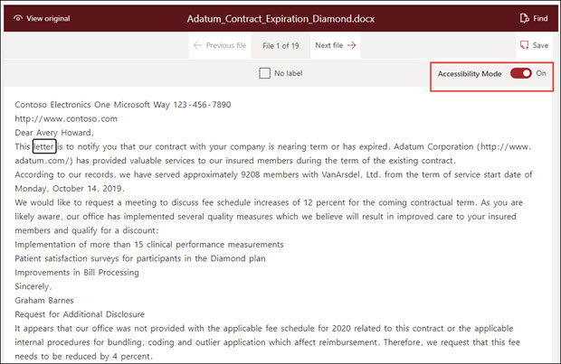

# SharePoint Syntex 協助工具模式SharePoint Syntex accessibility mode

在 [SharePoint Syntex](index.md)中，使用者可以在使用範例檔時，在模型訓練 (標籤、訓練、測試) 的各個階段中開啟協助工具模式。In [SharePoint Syntex](index.md), users can turn on accessibility mode in all stages of model training (label, train, test) when working with example documents. 使用協助工具模式可協助弱視使用者在流覽及標示檔檢視器中的專案時，獲得更輕鬆的鍵盤協助工具。Using accessibility mode can help low-sight users to have easier keyboard accessibility as they navigate and label items in the document viewer.

這可協助使用者使用其鍵盤來流覽檔檢視器中的文字，並聽出旁白的旁白，不僅包括選取的) 文字，也包含巨集指令 (例如標記或移除選取文字中的標籤，或是在您訓練模型時使用其他範例檔的標記值。This helps users to use their keyboards to navigate through text in the document viewer and to hear a narration of not only the selected values, but also of actions (such as labeling or removing labeling from selected text), or predicted label values as you train the model with additional example documents. 

## 需求Requirements

若要聽到旁白的音訊，請務必在 Windows 10 系統的 [講述人] 設定中開啟「 [講述人」應用程式](https://support.microsoft.com/windows/complete-guide-to-narrator-e4397a0d-ef4f-b386-d8ae-c172f109bdb1) 。To hear the audio of the narration, make sure to turn on the [Narrator App](https://support.microsoft.com/windows/complete-guide-to-narrator-e4397a0d-ef4f-b386-d8ae-c172f109bdb1) in your Narrator settings on your Windows 10 system.

![開啟 [朗讀程式]](../media/content-understanding/narrator-settings.png)

## 鍵盤使用者的標籤Labeling for keyboard users

針對使用協助工具模式的鍵盤使用者，如果在檢視器的範例檔中標記文字，您可以使用下列按鍵：For keyboard users using accessibility mode, if you are labeling text in an example document in the viewer, you can use the following keys:

- 索引標籤：向前移動並選取下一個字。Tab: Moves you forward and selects the next word.
- Tab + Shift：向後移動並選取上一個字。Tab + Shift: Moves you backwards and selects the previous word.
- Enter：標籤或從選取的單字移除標籤。Enter: Label or removes a label from the selected word.
- 向右鍵：向內移動選取的單字中的個別字元。Right arrow: Moves you forward through individual characters in a selected word.
- 向左鍵：向後移動選取的單字中的個別字元。Left arrow: Moves you backward through individual characters in a selected word.

> [!NOTE]
> 如果您要為單一標籤標記多個字，您必須為每個單字加上標籤。If you are labeling multiple words for a single label, you need to label each word.

## 敘事Narration

針對使用協助工具模式的講述人使用者，請使用相同的鍵盤導覽，以供鍵盤使用者流覽檢視器中的範例檔。For Narrator users using accessibility mode, use the same keyboard navigation described for keyboard users to go through the example document in the viewer.

當您流覽範例檔及標籤字串值時，「講述人」會為使用者提供下列音訊提示：As you navigate through the sample documents and label string values, Narrator will give user the following audio prompts:

- 當您使用鍵盤流覽檔檢視器時，[講述人] 音訊會將選取的字串狀態。When you use the keyboard to navigate through the document viewer, Narrator audio will state the selected string.
- 在選取的字串內，[講述人] 音訊會在您使用向左鍵或向右鍵來選取字串中的每個字元時，為您陳述該字串。Within a selected string, Narrator audio will state each character in the string as you select them by using the left or right arrow keys.
- 如果您選取一個已標示的字串，則「講述人」會指出值，然後再「標示」。If you select a string that has been labeled, Narrator will state the value and then "labeled".  例如，如果標籤值為 "Contoso"，它會將 "Costoso 標示" 狀態。For example, if the label value is "Contoso", it will state "Costoso labeled". 
- 在 [訓練] 索引標籤中，如果您在 [檔檢視器] 中選取只有預測的字串，則 [講述人] 音訊會指出值，然後「預測」。In the training tab, if you select a string in the document viewer that has only been predicted, Narrator audio will state the value, and then "predicted". 當訓練會在檔中預測的值不符合使用者所標示的值時，就會發生這種情況。This occurs when training predicts a value in the file that does not match what has been labeled by the user.
- 在 [訓練] 索引標籤中，如果您在已標示及預測的檔檢視器中選取字串，[講述人] 音訊會指出值，然後「標籤及預測」。In the training tab, if you select a string in the document viewer that has been labeled and predicted, Narrator audio will state the value, and then "labeled and predicted". 當訓練成功而且預測值和使用者標籤之間有相符的情況時，就會發生這種情況。This occurs when training is successful and there is a match between a predicted value and the user label.

在查看字串標籤或已移除標籤中的標籤之後，在您結束之前，「朗讀程式音訊」會警告您儲存您的變更。After a string is labeled or a label has been removed in the viewer, Narrator audio will warn you to save your changes before you exit.

## 另請參閱See Also

[建立擷取器Create an extractor](create-an-extractor.md) 

[建立分類器Create a classifier](create-a-classifier.md) 

 

  
  

