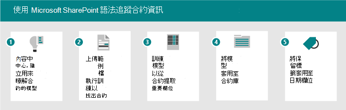
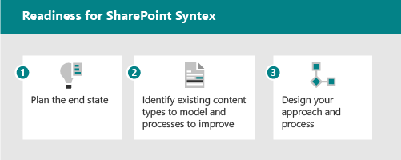

# Microsoft SharePoint Syntex 採用：快速入門

請將 SharePoint Syntex 中可用的智慧內容服務看作有三個部分：

- **內容瞭解：** 建立無程式碼 AI 模型，以分類及提取內容中的資訊，以自動套用中繼資料以進行知識探索和重複使用。 深入瞭解 [內容瞭解](document-understanding-overview.md)。
- **內容處理：** 自動化內容的捕獲、攝取和分類，並使用 Power 自動化簡化以內容為中心的程式。 深入瞭解 [內容處理](form-processing-overview.md)。
- **內容規範：** 控制和管理內容，以改進安全性和管理與 Microsoft 資訊保護的整合。

透過全新的 AI 服務和功能，您可以使用 SharePoint Syntex，將內容瞭解和分類應用程式直接建立到內容管理流程中：

|手動輸入| 表單處理 | 檔瞭解 |
|:-------|:--------|:--------|
| 任何內容的資料錄入和勞動密集型 | 處理數位內容-相片、掃描、回執、名片、含 OCR 的影片 & 文字 |  從合約、簡歷及其他結構化檔捕獲內容類型和中繼資料 |
| Interactive   | 預先構建、自動化   | 自訂、協助   | 自訂、相容性 |
| 工作中的人員 | 由主題專家教授 (Sme) 。 從合約、簡歷、其他非結構化檔捕獲內容類型和中繼資料。 | Sme 的相關程度較低。 從採購訂單、應用程式、其他半結構化及結構化檔 |

下表說明當您使用 SharePoint Syntex 時所獲得的功能：

| 表單處理 | 檔瞭解 |
|:-------|:-------|
| 適用于 APAC，澳大利亞，加拿大，EU，日本，拉丁美洲，UK，US | 可用於所有地區 |
| 使用 AI Builder 學分-1M 學分 = 2000 頁面;消耗額是大約2000個發票 = 2 個單位。 需要電源自動化-如果您需要更多您可以新增它。 為購買的300個以上的授權所指派的1M 學分。 您也可以個別購買學分。 | 模型在所有拉丁字母表語言上都可以運作。 除了英文：德文、瑞典文、法文、西班牙文、義大利文和葡萄牙文。 |
| 針對預設的一般資料服務環境進行布建| 不具備容量限制。 |

有兩種不同的方式可以瞭解您的內容。 您使用的模型類型是以檔案格式和使用案例為基礎：

| 表單處理 | 檔瞭解 |
|:-------|:-------|
| 從文件庫建立 | 在內容中心建立，SharePoint Syntex 的一部分 |
| 在 AI 產生器中建立的模型 | 在原生介面中建立的模型 |
| 用於半結構化檔案格式 | 用於非結構化檔案格式 |
| 可設定的分類器 | Trainable 具有選用擷取器的分類器 |
| 限制于單一文件庫 | 可套用至多個文件庫 |
| 在 PDF，JPG，PNG 格式，總 50 MB/500 pp 進行訓練 | 5-10 PDF、Office 或電子郵件檔案的火車，包含消極的範例 |

SharePoint Syntex 與 Microsoft 365 規範功能整合，例如：

- 根據檔保留或外來事件定義記錄原則的保留標籤。
- 敏感度標籤，可設定 DLP、加密、共用及條件式存取原則。

使用者可以套用標籤，也可以 SharePoint Syntex AI 模型自動套用標籤。 分析和檔計畫提供標籤用法和原則的縮放式管理。

## 識別試驗性商務案例以進行優化

若要準備在組織中使用 SharePoint Syntex，您必須先瞭解其有用的案例。 原因可協助決定所需的模型，以及如何根據要套用模型的位置來組織組織。 以下是一些檔理解可協助貴組織的案例：

- 內容處理：處理合約、工作說明及其他類似表單的檔。 使用表單，訓練模型以瞭解和對應欄位，然後執行表單以自動收集資料。 如需詳細資訊，請參閱 [表單處理一覽](form-processing-overview.md)。
- 發票分析：從發票拔出相關的詳細資料，確定他們遵循原則或進行適當處理。

請思考 SharePoint Syntex 可如何協助您的組織的方式：

- 自動化商務程式
- 提高搜尋精確度
- 管理規範風險

### 表單處理案例範例

例如，您可以使用 SharePoint Syntex 和電源自動化功能來設定處理常式，以追蹤和監控發票。

1. 設定儲存發票檔的文件庫。
1. 訓練模型，以辨識檔中的欄位。
1. 將您要追蹤的欄位解壓縮到清單中。
1. 設定流程以通知您特定的事件，例如：
    - 新增新的發票。
    - 發票超過其到期日。
    - 發票的數量大於您的自動核准金額。

當您自動化此案例時，您可以：

- 從發票自動提取資料，而不是手動提取資料，以節省時間和金錢。
- 使用工作流程對發票採取動作，以減少潛在的錯誤並確保更好的相容性，並通知您有任何問題。

### 檔瞭解案例範例

在另一個範例中，您可以設定處理常式來識別貴公司與其他公司或個人的合約。 您可以設定模型，以從這些合約提取重要資訊，例如用戶端名稱、費用、日期或其他重要資訊，並將其新增到文件庫中，您可以快速查看。 您也可以在文件庫上套用保留標籤，以確保合約在特定時間長度之前不能刪除，以符合您的商務法規。

1. 從內容中心開始，並建立新的檔瞭解合約模型。
1. 上傳範例檔，以取得正值和消極的範例，然後執行訓練以識別合同檔，並檢查結果。
1. 訓練解壓縮程式以識別合同中的欄位，例如用戶端名稱、費用和日期，然後測試解壓縮程式。
1. 模型完成時，將模型套用至您可以上傳合同的文件庫。
1. 將保留標籤套用至 date 功能變數，以便在您的組織需要合同時，將合同保留在文件庫中。

當您自動化此案例時，您可以：

- 自動從合約提取資料，而不是手動提取資料，以節省時間和金錢。
- 使用保留標籤確保合約已正確保留，以確保更好地相容。

### 識別案例的秘訣

當您考慮要考慮的商務案例時，請詢問您下列問題：

- 是否會解決實際的問題？
- 是否會廣泛使用或會影響整體效果？
- 是否可獲得？
- 您可以衡量是否成功？

根據影響和簡化的執行排定案例的優先順序。 讓您的初始焦點區域可輕鬆實施，也是較高的影響案例。 取消的優先順序較低的影響案例很難實施。

## 識別角色 & 責任

決定貴組織中誰將建立及管理模型？ 可能包含下列角色：

| SharePoint/知識系統管理員 | 電源平臺管理員 | 知識管理員 | 模型擁有者 |
|:-------|:-------|:-------|:-------|
| AAD 角色| 新增角色 | AAD 角色 | 風雲人物 |
| 設定表單處理 | 設定一般資料服務環境進行表單處理 | 收集使用案例 | 收集商務使用案例 |
| 管理內容中心和許可權| 購買及分派 AIB 學分 | 建立最佳作法並回顧模型分析 | 建立及套用模型 |

知識管理員、商務程式擁有人和內容模型擁有者建立組織的範例模型和冠軍採用。
其他可能參與的人員：合規性管理員、分類法管理員。

他們會在何處建立及套用模型？ 是否有現有的進程或存放庫可以增強？

- 表單處理：決定將取得表單處理動作的網站。
- 檔瞭解：您可以為不同的業務區域建立多個內容中心。

## 戰略定位

與相關者合作，確定他們已對齊使用 SharePoint Syntex 的策略。 調查並提供下列資源，以協助此位置：

- 商務成果：
  - 潛在的會計結果
  - 潛在的靈活性結果
  - 商務成果範本
- 專案關係人/Exec 承辦人購買/對齊
  - 業務案例卡座
  - 財務模型
  - 公司就緒性-文化

## 識別專案關係人

識別專案的利益關係人。

|角色 |責任 |部門 |
|:-------|:-------|:--------|
| 執行贊助者 (s)    | 向公司傳達高層遠景和價值   |  執行領導   |
| 專案負責人 (s)  | 監督整個啟動執行和部署程式 | 專案管理 |
| 知識管理員| 建立及管理內容中心 | IT 或其他部門|
| 內容管理員和模型擁有人| 收集使用案例及建立及套用模型 | 任何部門|
| 風雲人物 | 協助 evangelize 及管理異議處理 | 任何部門 (人員)  |
| 承租人管理員 | 設定租使用者層級設定 | IT 部門|
| Power Platform 系統管理員| 設定一般資料服務環境 | IT 部門|

> [!Note]
> 雖然我們建議您在整個部署中完成上述每個角色，但您可能會發現您不需要所有這些角色即可開始使用已識別的解決方案。

## 準備工作表

若要準備好執行 SharePoint Syntex，您必須執行下列作業：

1. 規劃結束狀態
    - 檔理解模型是指這種方式，而不是結束。
    - 規劃如何利用下列各項所提取之中繼資料的價值：
      - 搜尋
      - 篩選和查看格式設定
      - 合規性
      - 自動化
2. 識別
    - 瞭解現有的資訊架構和內容管理功能使用。
    - 是否有任何現有的內容類型適合模型？
    - 中繼資料會改善哪些現有的處理常式？
3. Design
    - 設計您的資訊架構、受管理的中繼資料和內容類型的方法
    - 設計定義、建立、管理的程式。

## 與您的組織合作

1. 找出有序的持有者、確認案例，以及制定專案計劃。
1. 設定並套用授權。
1. 開始認知與訓練–招聘冠軍。
1. 分階段進行。  
1. 收集意見反應並進行迴圈。
1. 根據需要，隨著流量成長對任何 AI 產生器的使用。
