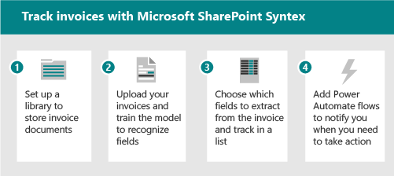

# Microsoft SharePoint Syntex 採用：快速入門Microsoft SharePoint Syntex adoption: Get started

請將 SharePoint Syntex 中可用的智慧內容服務看作有三個部分：Think of the intelligent content services available in SharePoint Syntex as having three parts:

- **內容瞭解：** 建立無程式碼 AI 模型，以分類及提取內容中的資訊，以自動套用中繼資料以進行知識探索和重複使用。**Content understanding:** create no-code AI models to classify and extract information from content to automatically apply metadata for knowledge discovery and reuse. 深入瞭解 [內容瞭解](document-understanding-overview.md)。Learn more about [content understanding](document-understanding-overview.md).
- **內容處理：** 自動化內容的捕獲、攝取和分類，並使用 Power 自動化簡化以內容為中心的程式。**Content processing:** Automate capture, ingestion and categorization of content and streamline content-centric processes using Power Automate. 深入瞭解 [內容處理](form-processing-overview.md)。Learn more about [content processing](form-processing-overview.md).
- **內容規範：** 控制和管理內容，以改進安全性和管理與 Microsoft 資訊保護的整合。**Content compliance:** Control and manage content to improve security and governance with integration to Microsoft Information Protection.

透過全新的 AI 服務和功能，您可以使用 SharePoint Syntex，將內容瞭解和分類應用程式直接建立到內容管理流程中：With new AI services and capabilities, you can build content understanding and classification apps directly into the content management flow using SharePoint Syntex:

|手動輸入Manual entry| 表單處理Form processing | 檔瞭解Document understanding |
|:-------|:--------|:--------|
| 任何內容的資料錄入和勞動密集型Data entry and labor-intensive on any content | 處理數位內容-相片、掃描、回執、名片、含 OCR 的影片 & 文字Process digital content - photos, scans, receipts, business cards, videos with OCR & text |  從合約、簡歷及其他結構化檔捕獲內容類型和中繼資料Capture content types and  metadata from contracts, resumes, and other structured documents |
| InteractiveInteractive   | 預先構建、自動化Pre-built, automated   | 自訂、協助Custom, assisted   | 自訂、相容性Custom, compliant |
| 工作中的人員People doing the work | 由主題專家教授 (Sme) 。Taught by your subject matter experts (SMEs). 從合約、簡歷、其他非結構化檔捕獲內容類型和中繼資料。Capture content types and  metadata from contracts, resumes, other unstructured documents. | Sme 的相關程度較低。SMEs are less involved. 從採購訂單、應用程式、其他半結構化及結構化檔from purchase orders, applications, other semi structured and structured documents |

下表說明當您使用 SharePoint Syntex 時所獲得的功能：The following table explains what you get when you use SharePoint Syntex:

| 表單處理Form processing | 檔瞭解Document understanding |
|:-------|:-------|
| 適用于 APAC，澳大利亞，加拿大，EU，日本，拉丁美洲，UK，USAvailable in APAC, Australia, Canada, EU, JP, LATAM, UK, US | 可用於所有地區Available in all regions |
| 使用 AI Builder 學分-1M 學分 = 2000 頁面;消耗額是大約2000個發票 = 2 個單位。Uses AI Builder credits - 1M credits = 2000 pages; Consumption is about 2000 invoices=2 units. 需要電源自動化-如果您需要更多您可以新增它。Power Automate is required - if you need more you can add it. 為購買的300個以上的授權所指派的1M 學分。1M credits allocated for 300+ licenses purchased. 您也可以個別購買學分。You can also purchase credits separately. | 模型在所有拉丁字母表語言上都可以運作。Models work on all latin alphabet languages. 除了英文：德文、瑞典文、法文、西班牙文、義大利文和葡萄牙文。In addition to English: German, Swedish, French, Spanish, Italian, and Portuguese. |
| 針對預設的一般資料服務環境進行布建Provisioned against the default common data service environment| 不具備容量限制。Does not have capacity restrictions. |

有兩種不同的方式可以瞭解您的內容。There are two different ways of understanding your content. 您使用的模型類型是以檔案格式和使用案例為基礎：The model type you use is based on file format and use case:

| 表單處理Form processing | 檔瞭解Document understanding |
|:-------|:-------|
| 從文件庫建立Created from document library | 在內容中心建立，SharePoint Syntex 的一部分Created in the content center, part of SharePoint Syntex |
| 在 AI 產生器中建立的模型Model created in AI builder | 在原生介面中建立的模型Model created in native interface |
| 用於半結構化檔案格式Used for semi-structured file formats | 用於非結構化檔案格式Used for unstructured file formats |
| 可設定的分類器Settable classifier | Trainable 具有選用擷取器的分類器Trainable classifier with optional extractors |
| 限制于單一文件庫Restricted to a single library | 可套用至多個文件庫Can be applied to multiple libraries |
| 在 PDF，JPG，PNG 格式，總 50 MB/500 pp 進行訓練Train on PDF, JPG, PNG format, total 50 MB/500 pp | 5-10 PDF、Office 或電子郵件檔案的火車，包含消極的範例Train on 5-10 PDF, Office, or email files, including negative examples |

SharePoint Syntex 與 Microsoft 365 規範功能整合，例如：SharePoint Syntex integrates with Microsoft 365 compliance features like:

- 根據檔保留或外來事件定義記錄原則的保留標籤。Retention labels that define records policy based on document age or external events.
- 敏感度標籤，可設定 DLP、加密、共用及條件式存取原則。Sensitivity labels that set DLP, encryption, sharing, and conditional access policies.

使用者可以套用標籤，也可以 SharePoint Syntex AI 模型自動套用標籤。Users can apply labels, or they can be applied automatically by SharePoint Syntex AI models. 分析和檔計畫提供標籤用法和原則的縮放式管理。Analytics and file plans provide scaled management of label usage and policies.

## 識別試驗性商務案例以進行優化Identify pilot business scenarios to optimize

若要準備在組織中使用 SharePoint Syntex，您必須先瞭解其有用的案例。To prepare for using SharePoint Syntex in your organization, you first need to understand the scenarios in which it will be useful. 原因可協助決定所需的模型，以及如何根據要套用模型的位置來組織組織。The why helps determine what model will be needed, and how to structure your org based on where the model will be applied. 以下是一些檔理解可協助貴組織的案例：Here are a few scenarios where document understanding can help your organization:

- 內容處理：處理合約、工作說明及其他類似表單的檔。Content processing: Process contracts, statements of work, and other form-like documents. 使用表單，訓練模型以瞭解和對應欄位，然後執行表單以自動收集資料。Intake the forms, train the model to understand and map the fields, and then run your forms through to automatically collect the data. 如需詳細資訊，請參閱 [表單處理一覽](form-processing-overview.md)。For more information, see [Form processing overview](form-processing-overview.md).
- 發票分析：從發票拔出相關的詳細資料，確定他們遵循原則或進行適當處理。Invoice analysis: Pull out the relevant details from your invoices and make sure they're complying with policy or are being processed appropriately.

請思考 SharePoint Syntex 可如何協助您的組織的方式：Think about ways that SharePoint Syntex can help your organization:

- 自動化商務程式Automate business processes
- 提高搜尋精確度Improve search accuracy
- 管理規範風險Manage compliance risk

### 表單處理案例範例Form processing scenario example

例如，您可以使用 SharePoint Syntex 和電源自動化功能來設定處理常式，以追蹤和監控發票。For example, you can set up a process using SharePoint Syntex and Power Automate features to track and monitor invoices.

1. 設定儲存發票檔的文件庫。Set up a library to store the invoice documents.
1. 訓練模型，以辨識檔中的欄位。Train the model to recognize fields in the documents.
1. 將您要追蹤的欄位解壓縮到清單中。Extract the fields you want to track into a list.
1. 設定流程以通知您特定的事件，例如：Set up a flow to notify you for specific events, such as:
    - 新增新的發票。A new invoice is added.
    - 發票超過其到期日。An invoice is past its due date.
    - 發票的數量大於您的自動核准金額。An invoice is for an amount that's larger than your automatic approval amount.

當您自動化此案例時，您可以：When you automate this scenario, you can:

- 從發票自動提取資料，而不是手動提取資料，以節省時間和金錢。Save time and money by automatically extracting data from the invoices instead of doing it manually.
- 使用工作流程對發票採取動作，以減少潛在的錯誤並確保更好的相容性，並通知您有任何問題。Reduce potential errors and ensure better compliance by using workflows to act on the invoices and notify you of any issues.

### 檔瞭解案例範例Document understanding scenario example

在另一個範例中，您可以設定處理常式來識別貴公司與其他公司或個人的合約。As another example, you can set up a process to identify contracts that your company has with other companies or individuals. 您可以設定模型，以從這些合約提取重要資訊，例如用戶端名稱、費用、日期或其他重要資訊，並將其新增到文件庫中，您可以快速查看。You can set up a model to extract key information from those contracts, such as the client name, fees, dates, or other important information, and add that to the library as fields you can quickly view. 您也可以在文件庫上套用保留標籤，以確保合約在特定時間長度之前不能刪除，以符合您的商務法規。And you can apply a retention label on the document library to ensure that contracts cannot be deleted before a specific length of time for appropriate compliance with your business regulations.

1. 從內容中心開始，並建立新的檔瞭解合約模型。Start at the content center and create a new document understanding model for contracts.
1. 上傳範例檔，以取得正值和消極的範例，然後執行訓練以識別合同檔，並檢查結果。Upload sample documents for positive and negative examples, then run the training to identify contract documents and review the results.
1. 訓練解壓縮程式以識別合同中的欄位，例如用戶端名稱、費用和日期，然後測試解壓縮程式。Train the extractor to identify fields in the contracts, such as the client name, fee, and date, and then test the extractor.
1. 模型完成時，將模型套用至您可以上傳合同的文件庫。When the model is complete, apply the model to a library where you can upload contracts.
1. 將保留標籤套用至 date 功能變數，以便在您的組織需要合同時，將合同保留在文件庫中。Apply a retention label to the date field, so that contracts are retained in the library for the length of time your organization requires for contracts.

當您自動化此案例時，您可以：When you automate this scenario, you can:

- 自動從合約提取資料，而不是手動提取資料，以節省時間和金錢。Save time and money by automatically extracting data from the contracts instead of doing it manually.
- 使用保留標籤確保合約已正確保留，以確保更好地相容。Ensure better compliance by using retention labels to ensure that the contracts are retained appropriately.

### 識別案例的秘訣Tips for identifying scenarios

當您考慮要考慮的商務案例時，請詢問您下列問題：When thinking about which business scenarios to consider, ask yourself the following questions:

- 是否會解決實際的問題？Does it solve a real problem?
- 是否會廣泛使用或會影響整體效果？Will it be widely used or have broad impact?
- 是否可獲得？Is it obtainable?
- 您可以衡量是否成功？Can you measure success?

根據影響和簡化的執行排定案例的優先順序。Prioritize scenarios based on impact and ease of implementation. 讓您的初始焦點區域可輕鬆實施，也是較高的影響案例。Make your initial focus area higher impact scenarios that can also be easily implemented. 取消的優先順序較低的影響案例很難實施。De-prioritize lower impact scenarios that are hard to implement.

## 識別角色 & 責任Identify roles & responsibilities

決定貴組織中誰將建立及管理模型？Determine who in your organization will build and manage the models? 可能包含下列角色：The following roles might be involved:

| SharePoint/知識系統管理員SharePoint/Knowledge admin | 電源平臺管理員Power Platform admin | 知識管理員Knowledge manager | 模型擁有者Model owner |
|:-------|:-------|:-------|:-------|
| AAD 角色AAD role| 新增角色ADD role | AAD 角色AAD role | 風雲人物Champions |
| 設定表單處理Configure form processing | 設定一般資料服務環境進行表單處理Configure Common data service environment for form processing | 收集使用案例Gather use cases | 收集商務使用案例Gather business use cases |
| 管理內容中心和許可權Manage content centers and permissions| 購買及分派 AIB 學分Purchase and allocate AIB credits | 建立最佳作法並回顧模型分析Establish best practices and review model analytics | 建立及套用模型Create and apply models |

知識管理員、商務程式擁有人和內容模型擁有者建立組織的範例模型和冠軍採用。Knowledge manager, Business Process Owner and Content model owner create sample models and champion adoption in the organization.
其他可能參與的人員：合規性管理員、分類法管理員。Others who may be involved: Compliance admin, Taxonomy managers.

他們會在何處建立及套用模型？Where will they build and apply the models? 是否有現有的進程或存放庫可以增強？Are there existing processes or repositories that could be enhanced?

- 表單處理：決定將取得表單處理動作的網站。Form processing: Decide which sites will get Form processing action.
- 檔瞭解：您可以為不同的業務區域建立多個內容中心。Document understanding: You can create multiple content centers for different business areas.

## 戰略定位Strategic positioning

與相關者合作，確定他們已對齊使用 SharePoint Syntex 的策略。Work with stakeholders to make sure they are aligned on the strategy for using SharePoint Syntex. 調查並提供下列資源，以協助此位置：Research and provide the following resources to help with this positioning:

- 商務成果：Business outcomes:
  - 潛在的會計結果Potential fiscal outcomes
  - 潛在的靈活性結果Potential agility outcomes
  - 商務成果範本Business outcome template
- 專案關係人/Exec 承辦人購買/對齊Stakeholders/Exec sponsor buy-in/alignment
  - 業務案例卡座Business case decks
  - 財務模型Financial models
  - 公司就緒性-文化Company readiness - culture

## 識別專案關係人Identify stakeholders

識別專案的利益關係人。Identify the stakeholders for your project.

|角色Role |責任Responsibilities |部門Department |
|:-------|:-------|:--------|
| 執行贊助者 (s) Executive sponsor(s)   | 向公司傳達高層遠景和價值Communicate high-level vision and values to the company   |  執行領導Executive leadership   |
| 專案負責人 (s) Project lead(s) | 監督整個啟動執行和部署程式Oversee the entire launch execution and rollout process | 專案管理Project management |
| 知識管理員Knowledge administrators| 建立及管理內容中心Create and manage the content centers | IT 或其他部門IT or other department|
| 內容管理員和模型擁有人Content managers and model owners| 收集使用案例及建立及套用模型Gather use cases and create and apply models | 任何部門Any department|
| 風雲人物Champions | 協助 evangelize 及管理異議處理Help evangelize and manage objection handling | 任何部門 (人員) Any department (staff) |
| 承租人管理員Tenant administrator | 設定租使用者層級設定Configure tenant-level settings | IT 部門IT department|
| Power Platform 系統管理員Power Platform administrator| 設定一般資料服務環境Configure common data services environment | IT 部門IT department|

> [!Note]
> 雖然我們建議您在整個部署中完成上述每個角色，但您可能會發現您不需要所有這些角色即可開始使用已識別的解決方案。Though we recommend having each of these roles fulfilled throughout your rollout, you may find that you don't require them all to get started with your identified solution.

## 準備工作表Readiness checklist

若要準備好執行 SharePoint Syntex，您必須執行下列作業：To get ready for implementing SharePoint Syntex, you need to:

1. 規劃結束狀態Plan the end state
    - 檔理解模型是指這種方式，而不是結束。Document understanding models are the means, not the end.
    - 規劃如何利用下列各項所提取之中繼資料的價值：Plan for harnessing the value of extracted metadata with:
      - 搜尋Search
      - 篩選和查看格式設定Filtering and view formatting
      - 合規性Compliance
      - 自動化Automation
2. 識別Identify
    - 瞭解現有的資訊架構和內容管理功能使用。Understand existing information architecture and content management feature use.
    - 是否有任何現有的內容類型適合模型？Are any existing content types good candidates for models?
    - 中繼資料會改善哪些現有的處理常式？What existing processes would be improved by metadata?
3. DesignDesign
    - 設計您的資訊架構、受管理的中繼資料和內容類型的方法Design your approach to information architecture, managed metadata and content types
    - 設計定義、建立、管理的程式。Design the process for definition, creation, management.

## 與您的組織合作Engage your organization

1. 找出有序的持有者、確認案例，以及制定專案計劃。Identify stake holders, confirm scenarios, and develop project plan.
1. 設定並套用授權。Configure settings and apply licenses.
1. 開始認知與訓練–招聘冠軍。Begin awareness and training – Recruit Champions.
1. 分階段進行。Roll out in stages.  
1. 收集意見反應並進行迴圈。Gather feedback and iterate.
1. 根據需要，隨著流量成長對任何 AI 產生器的使用。As usage grows plan for any AI Builder credits as needed.
