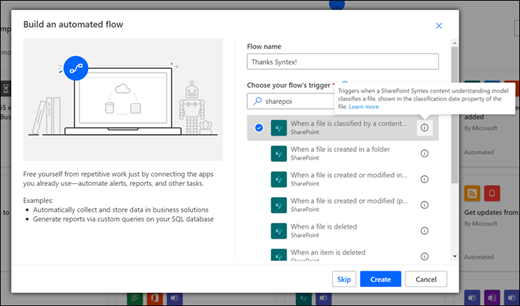

# 在 Microsoft SharePoint Syntex 中套用文件瞭解模型。Apply a document understanding model in Microsoft SharePoint Syntex

 

> [!VIDEO https://www.microsoft.com/videoplayer/embed/RE4CSoL]

 

在發佈檔文件瞭解模型之後，您可以將它套用至 Microsoft 365 租用戶中的一或多個 SharePoint 文件庫。After publishing your document understanding model, you can apply it to one or more SharePoint document library in your Microsoft 365 tenant.

> [!NOTE]
> 您只能將模型套用到您有權存取的文件庫。You are only able to apply the model to document libraries that you have access to.

## 將您的模型套用至文件庫。Apply your model to a document library.

若要將您的模型套用至 SharePoint 文件庫：To apply your model to to a SharePoint document library:

1. 在 [模型] 首頁的 **[將模型套用至文件庫]** 磚上，選取 **[發佈模型]**。On model home page, on the **Apply model to libraries** tile, select **Publish model**. 或者您也可以在 **[有此模型的文件庫]** 中選取 **[+ 新增文件庫]**。Or you can select  **+Add Library** in the **Libraries with this model** section.  

     

2. 然後您可以選取包含您要套用模型之文件庫的 SharePoint 網站。You can then select the SharePoint site that contains the document library that you want to apply the model to. 如果網站沒有顯示在清單中，請使用搜尋方塊尋找。If the site does not show in the list, use the search box to find it. 

     

    > [!NOTE]
    > 您必須要有您將套用模型的文件庫的 *管理清單* 權限或 *編輯* 權限。You must have *Manage List* permissions or *Edit* rights to the document library you are applying the model to. 

3. 選取網站之後，選取您要套用模型的文件庫。After selecting the site, select the document library to which you want to apply the model. 在範例中，從 *Contoso 案列追蹤* 網站中選取 *檔案* 文件庫。In the sample, select the *Documents* document library from the *Contoso Case Tracking* site. 

     

4. 由於模型與內容類型相關聯，因此當您將它套用到文件庫時，會新增內容類型及其檢視，並將您所擷取的標籤顯示為欄。Since the model is associated to a content type, when you apply it to the library it will add the content type and its view with the labels you extracted showing as columns. 這個檢視為文件庫的預設檢視，但您也可以選擇不將它設為預設檢視，只需要選擇 **[進階設定]** ，然後取消選擇 **[將這個新檢視設為預設]** 即可。This view is the library's default view by default, but you can optionally choose to not have it be the default view by selecting **Advanced settings** and deselecting **Set this new view as default**. 

     

5. 選取 **[新增]** 將模型套用到文件庫。Select **Add** to apply the model to the library. 
6. 在模型首頁上的 **[有此模型的文件庫]** 章節，您應該會看到列出 SharePoint 網站的 URL。On the model home page, in the **Libraries with this model** section, you should see the URL to the SharePoint site listed. 

     

7. 移至您的文件庫，並確定您使用的是模型的文件庫檢視。Go to your document library and make sure you are in the model's document library view. 請注意，如果您選取文件庫名稱旁邊的 [資訊] 按鈕，會出現一則訊息，指出您的模型已套用至文件庫。Notice that if you select the information button next to the document library name, a message notes that the document library has a model applied to it.

      

    您可以選取 **[查看活動模型]** ，查看任何套用至文件庫的模型詳細資料。You can the select **View active models** to see details about any models that are applied to the document library.

8. 在 **活動模型** 窗格中，您可以查看套用至文件庫的模型。In the **Active models** pane, you can see the models that are applied to the document library. 選取模型以查看更多詳細資料，例如模型的描述、發佈模型的人員，以及該模型是否將保留標籤套用至所分類的檔案。Select a model to see more details about it, such as a description of the model, who published the model, and if the model applies a retention label to the files it classifies.

      

將模型套用到文件庫之後，您就可以開始將文件上傳至網站，然後查看結果。After applying the model to the document library, you can begin uploading documents to the site and see the results.

模型會識別任何含有模型相關內容類型的檔案，並在您的檢視中列出這些檔案。The model identifies any files with model’s associated content type and lists them in your view. 如果您的模型有任何擷取器，則該檢視會將您從每個檔案中擷取的資料顯示為欄。If your model has any extractors, the view displays columns for the data you are extracting from each file.

### 將模型套用至已在文件庫中的檔案Apply the model to files already in the document library

雖然在模型套用以後，套用的模型會處理所有上傳到文件庫的檔案，但您也可以執行下列動作，以將模型套用在文件庫中已存的檔案上：While an applied model processes all files uploaded to the document library after it is applied, you can also do the following to run the model on files that already exists in the document library prior to the model being applied:

1. 在您的文件庫中，選取您希望由模型處理的檔案。In your document library, select the files that you want to be processed by your model.
2. 選取檔案之後，文件庫功能區將會出現 **[分類和擷取]** 。After selecting your files, **Classify and extract** will appear in the document library ribbon. 選取 **[分類和擷取]**。Select **Classify and extract**.
3. 您選取的檔案會新增到佇列中，以便進行處理。The files you selected will be added to the queue to be processed.

        

> [!NOTE]
> 您可以複製個別檔案到文件庫並套用至模型，而非資料夾。You can copy individual files to a library and apply them to a model, but not folders.

### 分類日期欄位The Classification Date field

當 SharePoint Syntex 文件瞭解或表單處理模型套用到文件庫時，文件庫結構描述中會包含 <b> 分類日期 </b> 欄位。When a SharePoint Syntex document understanding or form processing model is applied to a document library, a <b> Classification date </b> field is included in the library schema. 根據預設，這個欄位是空白的，但當您以模型處理並分類文件時，會更新此欄位的完成的日期-時間戳記。By default this field is empty, but when documents are processed and classified by a model, this field is updated with a date-time stamp of completion. 

     

[<b>在 Syntex 內容瞭解模型處理完檔案並更新 [分類日期] 欄位後，透過</b> 觸發](/connectors/sharepointonline/#when-a-file-is-classified-by-a-content-understanding-model)執行 Power Automate 流程來分類文件時，使用 [分類日期] 欄位。The Classification date field is used by the [<b>When a file is classified by a content understanding model</b> trigger](/connectors/sharepointonline/#when-a-file-is-classified-by-a-content-understanding-model) to run a Power Automate flow after a Syntex content understanding model has finished processing a file and updated the "Classification date" field.

    

<b>在內容瞭解模型</b> 分類文件之後，您就可以使用檔案中的任何摘錄資訊以啟動並觸發另一個工作流程。The <b>When a file is classified by a content understanding model</b> trigger can then be used to start another workflow using any  extracted information from the file.

## 另請參閱See Also
[建立分類器Create a classifier](create-a-classifier.md)

[建立擷取器Create an extractor](create-an-extractor.md)

[文件瞭解概觀Document Understanding overview](document-understanding-overview.md)