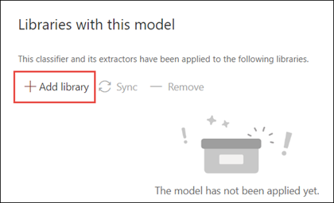
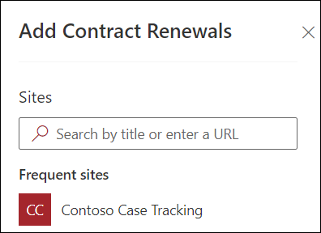

# 套用檔理解模型 (預覽) Apply a document understanding model (Preview)

> [!Note] 
> 本文內容適用于 Project Cortex 私人預覽。The content in this article is for Project Cortex Private Preview. [進一步瞭解專案 Cortex](https://aka.ms/projectcortex)。[Find out more about Project Cortex](https://aka.ms/projectcortex).

 

> [!VIDEO https://www.microsoft.com/videoplayer/embed/RE4CSoL]

 

在發佈檔理解模型之後，您可以將它套用至 Microsoft 365 租使用者中的 SharePoint 文件庫。After publishing your document understanding model, you can apply it to a SharePoint document library in your Microsoft 365 tenant.

> [!Note]
> 您只能將模型套用至您具有存取權的文件庫。You will only be able to apply the model to document libraries that you have access to.

## 將您的模型套用至文件庫。Apply your model to a document library.

若要將模型套用至 SharePoint 文件庫：To apply your model to to a SharePoint document library:

1. 在模型首頁上，在 [ **將模型套用至文件庫** ] 磚上，選取 [ **發行模型**]。On the model home page, on the **Apply model to libraries** tile, select **Publish model**. 或者，您可以選取 [**使用此模型**的文件庫中**新增文件庫**] 區段。Or you can  select  **+Add Library** in the **Libraries with this model** section.  

     

2. 然後，您可以選取包含您要套用模型之文件庫的 SharePoint 網站。You can then select the SharePoint site that contains the document library that you want to apply the model to. 如果網站未顯示在清單中，請使用搜尋方塊加以尋找。If the site does not show in the list, use the search box to find it. 

     

    > [!Note]
    > 您必須具有您要套用模型之文件庫的「 *管理清單* 」許可權或「 *編輯* 」許可權。You must have *Manage List* permissions or *Edit* rights to the document library you are applying the model to. 

3. 選取網站後，您必須選取要套用模型的文件庫。After selecting the site, you then need to select the document library to which you want to apply the model. 在此範例中，我們會從*Contoso 案例追蹤*網站選取*檔*文件庫。In the example, we are selecting the *Documents* document library from the *Contoso Case Tracking* site. 

     

4. 由於模型會與內容類型相關聯，因此當您將其套用至文件庫時，它會建立內容類型的視圖，並以您已解壓縮的標籤顯示為欄。Since the model is associated to a content type, when you apply it to the library it will create a view for the content type with the labels you extracted showing as columns. 這個視圖預設會是文件庫的預設視圖，但是您可以選擇 [ **高級設定** ] 並取消選取 [ **將這個新的視圖設定為預設**值]，以選擇不讓它成為預設的視圖。This view will be the library's default view by default, but you can optionally choose to not have it be the default view by selecting **Advanced settings** and deselecting **Set this new view as default**. 

     

5. 選取 [ **新增** ]，將模型套用至文件庫。Select **Add** to apply the model to the library. 
6. 在模型首頁上，在 [ **此模型** 的文件庫] 區段中，您會看到所列 SharePoint 網站的 URL。On the model home page, in the **Libraries with this model** section, you will see the URL to the SharePoint site listed. 

     

7. 移至您的文件庫，並確定您位於模型的文件庫視圖中。Go to your document library and make sure you are in the model's document library view. 請注意，如果您選取文件庫名稱旁邊的 [資訊] 按鈕，會出現一則訊息，指出您的模型已套用至文件庫。You'll notice that if you select the information button next to the document library name, a message will note that your model has been applied to the document library.

      

將模型套用至文件庫之後，您可以開始將檔上傳至網站並查看結果。After applying the model to the document library, you can begin uploading documents to the site and see the results.

模型會識別任何具有模型關聯內容類型的檔案，並將這些檔案列在您的視圖中。The model will identify any files with model’s associated content type and will list them in your view. 如果您的模型有任何擷取器，則 view 會顯示您要從每個檔案提取之資料的欄。If your model has any extractors, the view will display columns for the data you are extracting from each file.

### 將模型套用至文件庫中已存在的檔案Apply the model to files already in the document library

雖然套用的模型會處理所有檔案上傳至文件庫之後，您也可以執行下列動作，針對已存在於文件庫中的檔案執行模型，然後再執行該模型：While an applied model will process all files uploaded to the document library after it is applied, you can also do the following to run the model on files that already existed in the document library prior to the model being applied:

1. 在您的文件庫中，選取您要由模型處理的檔案。In your document library, select the files that you want to be processed by your model.
2. 選取檔案之後， **分類及解壓縮** 會出現在文件庫功能區中。After selecting your files, **Classify and extract** will appear in the document library ribbon. 選取 [ **分類及解壓縮**]。Select **Classify and extract**.
3. 您選取的檔案會新增至佇列進行處理。The files you selected will be added to the queue to be processed.

        

## 另請參閱See Also
[建立分類器Create a classifier](create-a-classifier.md) 
[建立提取程式Create an extractor](create-an-extractor.md) 
[檔理解概述Document Understanding overview](document-understanding-overview.md) 
[建立表單處理模型Create a form processing model](create-a-form-processing-model.md)  

