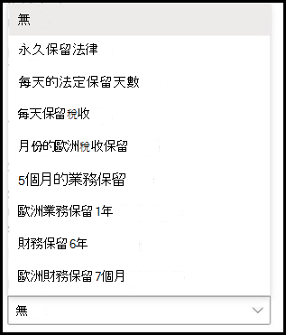

# 在 SharePoint Syntex 中將保留標籤套用至模型Apply a retention label to a model in SharePoint Syntex

 

> [!VIDEO https://www.microsoft.com/videoplayer/embed/RE4GydO]  

 

您可以在 Microsoft SharePoint Syntex 中輕鬆將[保留標籤](https://docs.microsoft.com/microsoft-365/compliance/retention)套用至模型。You can easily apply a [retention label](https://docs.microsoft.com/microsoft-365/compliance/retention) to a model in Microsoft SharePoint Syntex. 您可以為文件瞭解和表單處理模型都執行這個操作。You can do this for both document understanding and form processing models.

保留標籤讓您可以將保留設定套用至模型識別的文件。Retention labels let you apply retention settings to the documents that your models identify.  例如，您希望您的模型不僅識別上傳到文件庫的任何 *保險通知* 文件，而且還要對其應用 *商務* 保留標記，以便在指定的時間段（例如，接下來的五個月）內無法從文件庫中删除這些檔案。For example, you want your model to not only identify any *Insurance notice* documents that are uploaded to your document library, but to also apply a *Business* retention tag to them so that these documents cannot be deleted from the document library for the specified time period (the next five months, for example).

透過模型首頁上的模型設定，可以將預存的保留標籤套用至模型。You can apply a pre-existing retention label to your model through your model settings on your model's home page. 

> [!Important]
> 若要讓保留標籤可以套用至您的文件瞭解模型，需要[在 Microsoft 365 合規性中心中建立並發佈它們](https://docs.microsoft.com/microsoft-365/compliance/create-apply-retention-labels#how-to-create-and-publish-retention-labels)。For retention labels to be available to apply to your document understanding models, they need to be [created and published in the Microsoft 365 Compliance Center](https://docs.microsoft.com/microsoft-365/compliance/create-apply-retention-labels#how-to-create-and-publish-retention-labels).

## 新增保留標籤至文件瞭解模型To add a retention label to a document understanding model

1. 從模型首頁中，選取 **[模型設定]**。From the model home page, select **Model settings**. 
2. 在 **[模型設定]** 的 **[安全性和合規性]** 部分中，選取 **[保留標籤]** 選單，以查看可用於模型的保留標籤清單。In **Model settings**, in the **Security and compliance** section, select the **Retention label** menu to see a list of retention labels that are available for your to apply to the model. 
   
3. 選取您要套用至模型的保留標籤，然後選取 **[儲存]**。Select the retention label you want to apply to the model, and then select **Save**. 

將保留標籤套用至您的模型後，您可以將它套用至：After applying the retention label to your model, you are able to apply it to a:
- 新增文件庫New document library
- 已套用模型的文件庫Document library to which the model is already applied
 
## 將保留標籤套用至已應用模型的文件庫Apply the retention label to a document library to which the model is already applied

如果文件瞭解模型已套用至文件庫，則可以執行以下動作來同步保留標籤更新以將其套用至文件庫：If your document understanding model has already been applied to a document library, you can do the following to sync your retention label update to apply it to the document library: 

1. 在模型主頁的 **[具有此模型的庫]** 部分中，選取要套用保留標籤更新的文件庫。On your model home page, in the **Libraries with this model** section, select the document library to which you want to apply the retention label update.   
2. 選取 **[同步處理]**。Select **Sync**.  
   

套用更新並將其同步到模型後，可以透過執行以下動作來確認已套用更新：After applying the update and syncing it to your model, you can confirm that it has been applied by doing the following:

1. 在内容中心的 **[具有此模型的庫]** 部分中，按一下已套用更新模型的庫。In the content center, in the **Libraries with this model** section, click on the library to which your updated model was applied.  
2. 在您的文件庫檢視中，選取 [資訊] 圖示以檢查模型屬性。In your document library view, select the information icon to check the model properties.   
3. 在 **[使用中模型]** 清單中，選取您的更新模型。In the **Active models** list, select your updated model. 
4. 在 **[保留標籤]** 部分中，您會看到已套用保留標籤的名稱。In the **Retention label** section you will see the name of the applied retention label. 

在文件庫中模型的檢視頁面上，將顯示新的 **[保留標籤]** 欄。On your model's view page in your document library, a new **Retention label** column will display.  當模型對其識別為屬於其內容類型的檔案進行分類並在庫視圖中列出這些檔案時，[保留標籤] 欄還將顯示透過模型套用至它的保留標籤的名稱。As your model classifies files it identifies as belonging to it's content type and lists them in the library view, the Retention label column will also display the name of the retention label that has been applied to it through the model.

例如，您的模型識別的所有 *保險通知* 文件也將套用 *[商務]* 保留標籤，以防止它們在五個月內從文件庫中删除。For example, all *Insurance notice* documents that your model identifies will also have the *Business* retention label applied to them, preventing them from being deleted from the document library for five months. 如果試圖從文件庫中删除該檔案，系統將顯示錯誤訊息，指出由於套用了保留標籤而不允許此動作。If an attempt is made to delete the file from the document library, an error will display saying it is not allowed because of the applied retention label.

## 將保留標籤新增至表單處理模型To add a retention label to a form processing model

> [!Important]
> 若要讓保留標籤可以套用至您的表單處理模型，需要[在 Microsoft 365 合規性中心中建立並發佈它們](https://docs.microsoft.com/microsoft-365/compliance/create-apply-retention-labels#how-to-create-and-publish-retention-labels)。For retention labels to be available to apply to your form processing model, they need to be [created and published in the Microsoft 365 Compliance Center](https://docs.microsoft.com/microsoft-365/compliance/create-apply-retention-labels#how-to-create-and-publish-retention-labels).

您可以在建立模型時將保留標籤套用至表單處理模型，或將它套用至現有模型。You can either apply a retention label to a form processing model when you are creating a model, or apply it to an existing model.

### 若要在您建立表單處理模型時新增保留標籤To add a retention label when you create a form processing model

1. 當您[建立新的表單處理模型](https://docs.microsoft.com/microsoft-365/contentunderstanding/create-a-form-processing-model)時，選取 [<b>進階設定</b>]。When you are [creating a new form processing model](https://docs.microsoft.com/microsoft-365/contentunderstanding/create-a-form-processing-model), select <b>Advanced settings.</b>
2. 在 [<b>進階設定</b>] 的 [<b>保留標籤</b>] 區段中，選取功能表，然後選取您想要套用至模型的保留標籤。</b>In <b>Advanced settings</b>, in the <b>Retention label</b> section, select the menu and then select the retention label you want to apply to the model.</b>

 
      

3.  完成其餘模型設定之後，請選取 [<b>建立</b>] 以建立您的模型。After you've completed your remaining model settings, select <b>Create</b> to build your model.

### 將保留標籤新增至現有表單處理模型To add a retention label to an existing form processing model

您可以使用下列不同方法，將保留標籤新增至現有表單處理模型：You can add a retention label to an existing form processing model in different ways:
- 透過文件庫中的 [自動化] 功能表Through the Automate menu in the document library
- 透過文件庫中的 [使用中] 模型設定Through the Active model settings in the document library 

#### 透過 [自動化] 功能表將保留標籤新增至現有表單處理模型To add a retention label to an existing form processing model through the Automate menu

您可以透過已在其中套用模型之文件庫中的 [自動化] 功能表，將保留標籤新增至您擁有的表單處理模型。You can add a retention label to an existing form processing model that you own through the Automate menu in the document library in which the model is applied.

1. 在要將表單處理模型套用至其中的文件庫中，選取 [<b>自動化</b>] 功能表，選取 [<b>AI Builder</b>]，然後選取 [<b>檢視表單處理模型詳細資料</b>]。In your document library to which the form processing model is applied, select the <b>Automate</b> menu, select <b>AI Builder</b>, then select <b>View form processing model details</b>.

    

2. 在模型詳細資料的 [<b>保留標籤</b>] 區段中，選取您想要套用的保留標籤。In the model details, in the <b>Retention Label</b> section, select the retention label you want to apply.  然後選取 [<b>儲存</b>]。Then select <b>Save</b>.

       

#### 若要在使用中模型設定中將保留標籤新增至現有表單處理模型To add a retention label to an existing form processing model in the active model settings

您可以透過已在其中套用模型之文件庫中的 [使用中] 模型設定，將保留標籤新增至您擁有的表單處理模型。You can add a retention label to an existing form processing model that you own through the Active model settings in the document library in which the model is applied.

1. 在其中套用模型的 SharePoint 文件庫中，選取 [<b>檢視使用中模型</b>] 圖示，然後選取 [<b>檢視使用中模型</b>]。</b>In the SharePoint document library in which the model is applied, select the <b>View active models</b> icon, and then select <b>View active models</b>.</b>

     

2. 在 [<b>使用中模型</b>] 中，選取您要在其中套用保留標籤的表單處理模型。In <b>Active models</b>, select the form processing model to which you want to apply the retention label.

       

3. 在模型詳細資料的 [<b>保留標籤</b>] 區段中，選取您想要套用的保留標籤。In the model details, in the <b>Retention Label</b> section, select the retention label you want to apply.  然後選取 [<b>儲存</b>]。Then select <b>Save</b>.

> [!NOTE]
> 您必須是模型擁有者，才能編輯模型設定窗格。You must be the model owner for the model settings pane to be editable. 

## 另請參閱See Also
[建立分類器Create a classifier](create-a-classifier.md)

[建立擷取器Create an extractor](create-an-extractor.md)

[文件瞭解概觀Document Understanding overview](document-understanding-overview.md)

