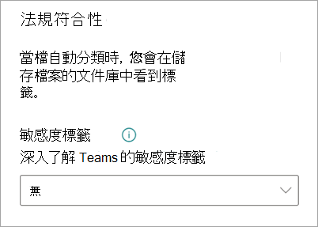

# 在 Microsoft SharePoint Syntex 中將敏感度標籤套用至模型

您可以在 Microsoft SharePoint Syntex 中輕鬆套用 [敏感度標籤](../compliance/sensitivity-labels.md) 到文件瞭解模型。 表單處理模型尚未能使用此功能。

敏感度等級讓您可以在您的模型識別的文件中套用加密、共用及條件式存取原則。 例如，您希望您的模型不僅識別將上傳到您文檔庫且包含銀行帳號或信用卡號的任何財務文件，而且還對它們套用 *加密* 敏感度標籤，以限制誰可以存取該內容以及可以如何使用它。

透過模型首頁上的模型設定，您可以將現有的敏感度標籤套用至你的模型。 標籤必須已發佈，並可以在模型設定中選取。

> [!Important]
> 若要讓敏感度等級可以套用至您的文件瞭解模型，需要[在 Microsoft 365 合規性中心中建立並發佈它們](../business-video/create-sensitivity-labels.md)。

## 新增保留標籤至文件瞭解模型

1. 從模型首頁中，選取 **[模型設定]**。

   ![模型頁面的螢幕擷取畫面，[模型設定] 選項已突出顯示。](../media/content-understanding/sensitivity-model-settings.png)

2. 在 **[模型設定]** 窗格的 **[合規性]** 章節，選取 **[敏感度標籤]** 選單，以查看可用於模型的敏感度標籤清單。

    

3. 選取您要套用至模型的敏感度標籤，然後選取 **[儲存]**。

當您在模型上套用了敏感度標籤之後，您可以將它套用至:

- 新增文件庫
- 已套用模型的文件庫
 
### 將敏感度標籤套用至已套用模型的文件庫

如果文件瞭解模型已套用至文件庫，則可以執行以下動作來同步敏感度標籤更新以將其套用至文件庫:

1. 在模型主頁的 **[具有此模型的文件庫]** 章節，選取要套用敏感度標籤更新的文件庫。

2. 選取 **[同步處理]**。

   

套用更新並將其與模型同步後，可以透過執行以下動作來確認已套用更新:

1. 在内容中心的 **[具有此模型的文件庫]** 章節，選取已套用更新模型的文件庫。 

2. 在您的文件庫檢視中，選取 [資訊] 圖示以檢查模型屬性。

3. 在 **[使用中模型]** 清單中，選取您的更新模型。

4. 在 **敏感度標籤** 章節，您將看得到已套用的敏感度標籤的名稱。

在文件庫中的模型檢視頁面上，將顯示新的 **[敏感度標籤]** 資料行。 當模型對其識別為屬於其內容類型的檔案進行分類，並在文件庫檢視中列出這些檔案時，**[敏感度標籤]** 資料行還將顯示透過模型套用至它的敏感度標籤的名稱。

例如，您的模型識別的所有財務文件也將套用 *加密* 敏感度標籤，以防止未經授權的人員存取它們。 如果未經授權的人員試圖從文件庫中存取該檔案，系統將顯示錯誤訊息，指出由於套用了敏感度標籤而不允許此動作。

<!---
## Add a sensitivity label to a form processing model

> [!Important]
> For sensitivity labels to be available to apply to your form processing model, they need to be [created and published in the Microsoft 365 Compliance Center](../business-video/create-sensitivity-labels.md).

You can either apply a sensitivity label to a form processing model when you are creating a model, or apply it to an existing model.

### Add a sensitivity label when you create a form processing model

1. When you [create a new form processing model](create-a-form-processing-model.md), select **Advanced settings**.

2. In **Advanced settings**, in the **Sensitivity label** section, select the menu and then select the sensitivity label you want to apply to the model.

3.  After you've completed your remaining model settings, select **Create** to build your model.

### Add a sensitivity label to an existing form processing model

You can add a sensitivity label to an existing form processing model in different ways:

- Through the **Automate** menu in the document library
- Through the **Active model** settings in the document library 

#### Add a sensitivity label to an existing form processing model through the Automate menu

You can add a sensitivity label to an existing form processing model that you own through the **Automate** menu in the document library in which the model is applied.

1. In your document library to which the form processing model is applied, select the **Automate** menu, select **AI Builder**, and then select **View form processing model details**.

2. On the **Model details** pane, in the **Sensitivity label** section, select the sensitivity label you want to apply. Then select **Save**.

#### Add a sensitivity label to an existing form processing model in the active model settings

You can add a sensitivity label to an existing form processing model that you own through the **Active model** settings in the document library in which the model is applied.

1. In the SharePoint document library in which the model is applied, select the **View active models** icon, and then select **View active models**.

2. In **Active models**, select the form processing model to which you want to apply the sensitivity label.

3. On the **Model details** pane, in the **Sensitivity label** section, select the sensitivity label you want to apply. Then select **Save**.

   > [!NOTE]
   > You must be the model owner for the **Model settings** pane to be editable. 
--->

## 另請參閱

[套用保留標籤](apply-a-retention-label-to-a-model.md)

[建立分類器](create-a-classifier.md)

[建立擷取器](create-an-extractor.md)

[文件瞭解概觀](document-understanding-overview.md)