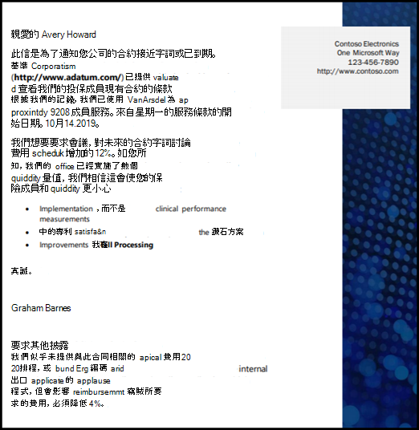
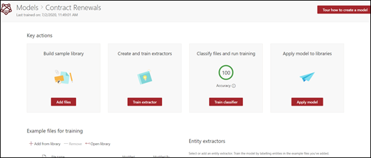
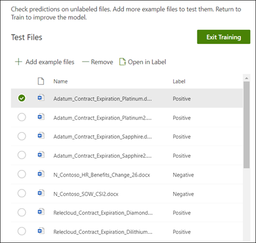

# 在 Microsoft SharePoint Syntex 中建立分類器Create a classifier in Microsoft SharePoint Syntex

 

> [!VIDEO https://www.microsoft.com/videoplayer/embed/RE4CL0R]  

 

分類器是一種模型類型，可用來自動化文件類型的識別和分類。A classifier is a type of model that you can use to automate identification and classification of a document type. 例如，您可能想要找出新增至文件庫的所有*合約續約*文件，例如如下圖所示。For example, you may want to identify all *Contract Renewal* documents that are added to your document library, such as is shown in the following illustration.

建立分類器可讓您建立將與該模型相關聯的新 [SharePoint 內容類型](https://docs.microsoft.com/sharepoint/governance/content-type-and-workflow-planning#content-type-overview)。Creating a classifier enables you to create a new [SharePoint Content Type](https://docs.microsoft.com/sharepoint/governance/content-type-and-workflow-planning#content-type-overview) that will be associated to the model.

建立分類器時，您必須建立*說明*以定義模型。When creating the classifier, you need to create *explanations* to define the model. 這可讓您記錄預期會持續發現此文件類型的常見資料。This enables you to note common data that you would expect to consistently find this document type. 

使用文件類型的範例 (「範例檔」) 來「訓練」您的模型，以找出擁有相同內容類型的檔案。Use examples of the document type ("example files") to "train" your model to identify files that have the same content type.

若要建立分類器，您必須：To create a classifier, you need to:
1. 為模型命名。Name your model.
2. 新增範例檔案。Add your example files.
3. 為範例檔案加上標籤。Label your example files.
4. 建立說明。Create an explanation.
5. 測試您的模型。Test your model.

> [!NOTE]
> 當您的模型使用分類器來識別和分類文件類型時，您也可以選擇從模型所識別的每個檔案中提取特定資訊。While your model uses a classifier to identify and classify document types, you can also choose to pull specific pieces of information from each file identified by the model. 方法是建立要新增至模型的 **[擷取器]**。Do this by creating an **extractor** to add to your model. 請參閱[建立擷取器](create-an-extractor.md)。See [Create an extractor](create-an-extractor.md).

## 為模型命名Name your model

建立模型的第一個步驟是為其命名：The first step to create your model is to give it a name:

1. 從 [內容中心] 選取 **[新增]**，然後選取 **[建立模型]**。From the Content Center, select **New**, and then **Create a model**.
2. 在 **[新增文件瞭解模型]** 窗格的 **[名稱]** 欄位中，輸入模型的名稱。In the **New document understanding model** pane, in the **Name** field type the name of the model. 例如，如果您想要識別合約續約文件，可以將模型命名為 *[合約續約]*。For example, if you want to identify contract renewal documents, you could name the model *Contract Renewal*.
3. 選擇 **[建立]**。Choose **Create**. 這會為模型建立首頁。This creates a home page for the model. 

    

當您建立模型時，您也會建立新的網站內容類型。When you create a model, you are also creating a new site content type. 內容類型代表具有共同特徵及共用特定內容的欄或中繼資料屬性集合的文件類別。A content type represents a category of documents that have common characteristics and share a collection of columns or metadata properties for that particular content. 透過[內容類型資源庫](https://support.microsoft.com/office/create-or-customize-a-site-content-type-27eb6551-9867-4201-a819-620c5658a60f)管理 [SharePoint 內容類型]。SharePoint Content Types are managed through the [Content types gallery](https://support.microsoft.com/office/create-or-customize-a-site-content-type-27eb6551-9867-4201-a819-620c5658a60f). 在此範例中，當您建立模型時，您會建立新的 *[合約續約]* 內容類型。For this example, when you create the model, you are creating a new *Contract Renewal* content type.

如果您想要將這個模型對應到 SharePoint 內容類型資源庫中現有的企業內容類型以使用其結構描述，請選取 **[進階設定]**。Select **Advanced settings** if you want to map this model to an existing enterprise content type in the SharePoint Content types gallery to use its schema. 企業內容類型儲存在 SharePoint 系統管理中心的內容類型中樞中，並與租用戶中的所有網站整合。Enterprise content types are stored in the Content Type Hub in the SharePoint admin center and are syndicated to all sites in the tenant. 請注意，雖然您可以使用現有的內容類型來運用其結構描述以協助識別和分類，您仍然需要訓練模型，以從所識別的檔案擷取資訊。Note that while you can use an existing content type to leverage its schema to help with identification and classification, you still need to train your model to extract information from files it identifies. 

## 新增範例檔案Add your example files

在模型首頁上，新增您的範例檔案，您需要協助訓練模型以識別您的文件類型。On the model home page, add your examples files you will need to help train the model to identify your document type.  
 

> [!VIDEO https://www.microsoft.com/videoplayer/embed/RE4D0iX] 

 

> [!NOTE]
> 您應將相同檔案用於分類器和[擷取器訓練](create-an-extractor.md)。You should use the same files for both classifier and [extractor training](create-an-extractor.md). 您隨時都可以選擇稍後再新增，但通常您會新增一整套範例檔案。You always have the option to add more later, but typically you add a full set of example files. 標記一些以訓練您的模型，並測試其餘未標記的項目，以評估模型適用性。Label some to train your model, and test the remaining unlabeled ones to evaluate model fitness. 

針對訓練集，您會想要使用正面和負面的範例：For your training set, you want to use both positive and negative examples:
- 正面範例：代表檔案類型的文件。Positive example: Documents that represent the document type. 這些包含的字串和資訊永遠存在於這種文件類型。These contain strings and information that would always be in this type of document.
- 負面範例：任何不代表您要分類之文件的其他文件。Negative example: Any other document that does not represent the document you want to classify. 

請務必使用至少五個正面範例，以及至少一個負面範例來訓練您的模型。Be sure to use at least five positive examples and at least one negative example to train your model.  您想要在訓練程序之後建立其他範本來測試模型。You want to create additional ones to test your model after the training process.

若要新增範例檔案：To add example files:

1. 在模型首頁上的 **[新增範例檔案]** 磚中，按一下 **[新增檔案]**。On the model home page, in the **Add example files** tile, click **Add files**.
2. 在 **[選取您模型的範例檔案]** 頁面上，選取內容中心中 [訓練檔] 文件庫的範例檔案。On the **Select example files for your model** page, select your example files from the Training files library in the content center. 如果您還沒有將檔案上傳到該處，請按一下 **[上傳]**，將檔案複製到 [訓練檔] 文件庫，選擇立即上傳。If you had not already uploaded them there, choose to upload them now by clicking **Upload** to copy them to the Training files library.
3. 選取您要用來訓練模型的範例檔案之後，請按一下 **[新增]**。After selecting your example files to use to train the model, click **Add**.

     

## 為範例檔案加上標籤Label your example files

新增範例檔案之後，您必須將其標記為正面或負面範例。After adding your example files, you need to label them as either positive or negative examples.

1. 在模型首頁的 **[分類檔案和執行訓練]** 磚中，按一下 **[訓練分類器]**。From the model home page, on the **Classify files and run training** tile, click **Train Classifier**.
   這會顯示 [標籤] 頁面，該頁面顯示範例檔案清單，並在檢視器中顯示第一個檔案。This displays the label page that shows a listing of your example files, with the first file visible in the viewer.
2. 在第一個範例檔案頂端的檢視器中，您應該會看到一些文字，詢問該檔案是否為您剛建立的模型範例。In the viewer on the top of the first example file, you should see text asking if the file is an example of the model you just created. 如果是正面範例，請選取 **[是]**。If it is a positive example, select **Yes**. 如果是負面範例，請選取 **[否]**。If it is a negative example, select **No**.
3. 在左邊的 **[已標記範例]** 清單中，選取您想要做為範例的其他檔案，然後為其標記。From the **Labeled examples** list on the left, select additional files that you want to use as examples, and label them. 

     

> [!NOTE]
> 至少標記五個正面範例。Label at least five positive examples. 您也必須標記至少一個負面範例。You must also label at least one negative example. 

## 建立說明。Create an explanation

下一個步驟是在 [訓練] 頁面建立說明。The next step is for you to create an explanation on the Train page. 說明可協助模型瞭解如何辨識文件。An explanation helps the model understand how to recognize the document. 例如，合約續約文件始終包含 *[要求其他公開揭示]* 文字字串。For example, the Contract Renewal documents always contain a *Request for additional disclosure* text string.

> [!Note]
> 與擷取程式搭配使用時，說明會識別您要從文件中提取的字串。When used with extractors, an explanation identifies the string that you want to extract from the document. 

若要建立說明：To create an explanation:

1. 從模型首頁中，選取 **[訓練]** 索引標籤，以移至 [訓練] 頁面。From the model home page, select the **Train** tab to go to the Train page.
2. 在 [訓練] 頁面的 **[已訓練檔案]** 區段中，您應該會看到您之前已標記的範例檔案清單。On the Train page, in the **Trained files** section you should see a list of the sample files that you previously labeled. 從清單中選取其中一個正向檔案，它會顯示在檢視器中。Select one of the positive files from the list, and it displays in the viewer.
3. 在 [說明] 區段中，選取 **[新增]**，然後選取 **[空白]**。In the Explanation section, select **New** and then **Blank**.
4. 在 **[建立說明]** 頁面：On the **Create an explanation** page: 
    a.a. 輸入 **[名稱]** (例如「公開揭示封鎖」)。Type the **Name** (for example, "Disclosure Block"). 
    b.b. 選取 **[類型]**。Select the **Type**. 針對此範例，請選取 **[片語清單]**，因為您新增的是文字字串。For the sample, select **Phrase list**, since you add a text string. 
    c.c. 在 **[在這裡輸入]** 方塊中，輸入字串。In the **Type here** box, type the string. 針對此範例，請新增「要求其他公開揭示」。For the sample, add "Request for additional disclosure". 如果字串必須區分大小寫，您可以選取 **[區分大小寫]**。You can select **Case sensitive** if the string needs to be case sensitive. 
    d.d. 按一下 **[儲存]**。Click **Save**.

     
    
 
5. 現在，模型會檢查您所建立的說明是否夠好，以便將剩餘的已標記範例檔案正確識別為正面和負面範例。The model now checks to see if the explanation you created was good enough to identify the remaining labeled example files correctly, as positive and negative examples. 訓練完成之後，在 [已訓練檔案] 區段中檢查 **[評估]** 資料行，以查看結果。In the Trained Files section, check the **Evaluation** column after the training has completed to see the results. 如果您建立的說明足以符合您標記為正面或負面的結果，檔案就會顯示 **[符合]** 的值。The files show a value of **Match**, if the explanations you created was enough to match what you labeled as positive or negative.

     

如果您在已標記檔案上接收到 **[不符合]**，您可能需要建立額外的說明，以提供模型更多資訊來識別文件類型。If you receive a **Mismatch** on the labeled files, you may need to create an additional explanation to provide the model more information to identify the document type. 如果發生這種情況，請按一下檔案，以取得為什麼發生不相符的詳細資訊。If this happens, click on the file to get more information about why the mismatch occurred.

## 測試您的模型Test your model

如果您在已標記的範例檔案上收到符合，您現在可以在尚未顯示模型的剩餘未標記範例檔案上測試模型。If you received a match on your labeled sample files, you can now  test your model on your remaining unlabeled example files that the model has not seen before.  這是一個選用但有用的步驟，可透過在模型以前從未見過的檔案中進行測試來評估模型的「適合性」或就緒狀態。This is optional, but a useful step to evaluate the “fitness” or readiness of the model before using it, by testing it on files the model hasn’t seen before.

1. 從模型首頁中，選取 **[測試]** 索引標籤。這會在未標記的範例檔案上執行模型。From the model home page, select the **Test** tab.  This runs the model on your unlabeled sample files.
2. 在 **[測試檔案]** 清單中，您的範例檔案會呈現並顯示模型預測其為正面或負面範例。In the **Test files** list, your example files display and shows if the model predicted them to be positive or negative. 使用這項資訊可協助您判斷分類器的效能，以找出您的文件。Use this information to help determine the effectiveness of your classifier in identifying your documents.

     

## 另請參閱See Also
[建立擷取器Create an extractor](create-an-extractor.md)

[文件瞭解概觀Document Understanding overview](document-understanding-overview.md)

[說明類型Explanation types](explanation-types-overview.md)

[套用模型Apply a model](apply-a-model.md) 
