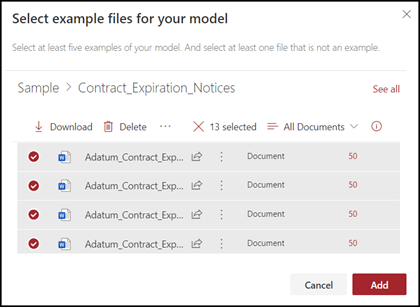

# 在 Microsoft SharePoint Syntex 中建立分類器Create a classifier in Microsoft SharePoint Syntex

本文內容適用于 Project Cortex 私人預覽。The content in this article is for the Project Cortex Private Preview. [進一步瞭解專案 Cortex](https://aka.ms/projectcortex)。[Find out more about Project Cortex](https://aka.ms/projectcortex).

 

> [!VIDEO https://www.microsoft.com/videoplayer/embed/RE4CL0R]  

 

分類器是一種模型，可讓您用來自動化檔案類型的身分識別和分類。A classifier is a type of model that you can use to automate identification and classification of a document type. 例如，您可能想要識別所有已新增至文件庫的 *合約更新* 檔，如下圖所示。For example, you may want to identify all *Contract Renewal* documents that are added to your document library, such as is shown in the following illustration.

建立分類程式可讓您建立新的 [SharePoint 內容類型](https://docs.microsoft.com/sharepoint/governance/content-type-and-workflow-planning#content-type-overview) ，將會與模型產生關聯。Creating a classifier enables you to create a new [SharePoint Content Type](https://docs.microsoft.com/sharepoint/governance/content-type-and-workflow-planning#content-type-overview) that will be associated to the model.

建立分類器時，您必須建立 *說明* 以定義模型。When creating the classifier, you need to create *explanations* to define the model. 這可讓您記下您預期會始終如一地找到這種檔案類型的常見資料。This enables you to note common data that you would expect to consistently find this document type. 

使用檔案類型的範例 ( "範例檔案" ) 以 "訓練" 您的模型來識別具有相同內容類型的檔案。Use examples of the document type ("example files") to "train" your model to identify files that have the same content type.

若要建立分類符，您必須：To create a classifier, you need to:
1. 命名模型。Name your model.
2. 新增您的範例檔案。Add your example files.
3. 為範例檔案加上標籤。Label your example files.
4. 建立說明。Create an explanation.
5. 測試您的模型。Test your model.

> [!NOTE]
> 雖然您的模型使用分類器來識別和分類檔案類型，您也可以選擇從模型所識別的每個檔案中提取特定的資訊片段。While your model uses a classifier to identify and classify document types, you can also choose to pull specific pieces of information from each file identified by the model. 建立 **解壓縮** 程式以新增至您的模型。Do this by creating an **extractor** to add to your model. 請參閱 [建立提取程式](create-an-extractor.md)。See [Create an extractor](create-an-extractor.md).

## 命名模型Name your model

建立模型的第一個步驟是為其命名：The first step to create your model is to give it a name:

1. 從內容中心選取 [ **新增**]，然後 **建立模型**。From the Content Center, select **New**, and then **Create a model**.
2. 在 [ **新增檔瞭解模型** ] 窗格的 [ **名稱** ] 欄位中，輸入模型的名稱。In the **New document understanding model** pane, in the **Name** field type the name of the model. 例如，如果您想要識別合同更新檔，您可以命名模型 *合約更新*。For example, if you want to identify contract renewal documents, you could name the model *Contract Renewal*.
3. 	選擇 *\*[建立]*\*。Choose **Create**. 這會為模型建立首頁。This creates a home page for the model. 

    

當您建立模型時，您也是建立新的 SharePoint 內容類型。When you create a model, you are also creating a new SharePoint content type. SharePoint 內容類型代表具有共同特性並共用該特定內容之一組欄或中繼資料屬性的檔類別。A SharePoint content type represents a category of documents that have common characteristics and share a collection of columns or metadata properties for that particular content. SharePoint 內容類型是透過 [內容類型庫](https://support.microsoft.com/office/create-or-customize-a-site-content-type-27eb6551-9867-4201-a819-620c5658a60f)進行管理。SharePoint Content Types are managed through the [Content types gallery](https://support.microsoft.com/office/create-or-customize-a-site-content-type-27eb6551-9867-4201-a819-620c5658a60f). 在此範例中，當您建立模型時，會建立新的 *合約更新* 內容類型。For this example, when you create the model, you are creating a new *Contract Renewal* content type.

如果您想要將此模型對應至 SharePoint 內容類型庫中的現有內容類型，以使用其架構，請選取 [ **高級設定** ]。Select **Advanced settings** if you want to map this model to an existing content type in the SharePoint Content types gallery to use its schema. 請注意，雖然您可以使用現有的內容類型來利用其架構來協助識別和分類，但您仍然需要訓練模型，以從識別的檔案提取資訊。Note that while you can use an existing content type to leverage its schema to help with identification and classification, you still need to train your model to extract information from files it identifies. 

## 新增您的範例檔案Add your example files

在模型首頁上，新增您所需的範例檔案，以協助訓練模型識別檔案類型。On the model home page, add your examples files you will need to help train the model to identify your document type.  
 

> [!VIDEO https://www.microsoft.com/videoplayer/embed/RE4D0iX] 

 

> [!NOTE]
> 您應該針對分類器和 [提取程式訓練](create-an-extractor.md)使用相同的檔案。You should use the same files for both classifier and [extractor training](create-an-extractor.md). 您可以選擇稍後新增更多，但通常您會新增一組完整的範例檔案。You always have the option to add more later, but typically you add a full set of sample files. 標示部分以訓練模型，並測試其餘未標記的專案，以評估模型健身。Label some to train your model, and test the remaining unlabeled ones to evaluate model fitness. 

針對您的訓練集，您想要使用正和負的範例：For your training set, you want to use both positive and negative examples:
- 肯定範例：代表檔案類型的檔。Positive example: Documents that represent the document type. 這些包含的字串和資訊永遠都屬於這種檔案類型。These contain strings and information that would always be in this type of document.
- 負數範例：不代表檔案類型的檔。Negative example: Documents that do not represent the document type. 這些是遺失的字串和資訊，必須存在於這種檔案類型中。These are missing strings and information that needs to be present in this type of document.

請務必使用至少五個正值，以及至少一個否定性的範例訓練您的模型。Be sure to use at least five positive examples and at least one negative example to train your model.  您想要建立其他專案，以在訓練程式之後測試您的模型。You want to create additional ones to test your model after the training process.

若要新增範例檔案：To add sample files:

1. 從模型首頁的 [ **建立範例文件庫** ] 磚中，按一下 [ **新增**檔案]。From the model home page, in the **Build sample library** tile, click **Add files**.
2. 在 [ **選取模型的範例** 檔案] 頁面上，從內容中心的範例檔案庫中選取範例檔案。On the **Select sample files for your model** page, select your example files from the Sample files library in the Content Center. 如果您還沒有上傳它們，請按一下 [ **上傳** ]，將其移至範例檔案庫中，選擇立即上傳。If you had not already uploaded them there, choose to upload them now by clicking **Upload** to move them the Sample file library.
3. 選取用來訓練模型的範例檔案之後，請按一下 [ **新增**]。After selecting your example files to use to train the model, click **Add**.

     

## 標記範例檔案Label your example files

在新增範例檔案之後，您必須將它們標示為正數或負數範例。After adding your example files, you need to label them as either positive or negative examples.

1. 從模型首頁的 [ **分類檔案及執行訓練** ] 磚上，按一下 [ **訓練分類器**]。From the model home page, on the **Classify files and run training** tile, click **Train Classifier**.
   這會顯示 [標籤] 頁面，顯示範例檔案的清單，第一個檔案會顯示在檢視器中。This displays the label page that shows a listing of your example files, with the first file visible in the viewer.
2. 在第一個範例檔案頂端的檢視器中，您應該會看到文字，詢問檔案是否為您剛才建立的模型範例。In the viewer on the top of the first example file, you should see text asking if the file is an example of the model you just created. 如果是正範例，請選取 **[是]**。If it is a positive example, select **Yes**. 如果是負數範例，請選取 [ **否**]。If it is a negative example, select **No**.
3. 從左側的 [已 **標記的範例** ] 清單中，選取您要做為範例的其他檔案，然後將它們標示。From the **Labeled examples** list on the left, select additional files that you want to use as examples, and label them. 

     

> [!NOTE]
> 標籤至少五個正範例，另一個為負的範例。Label at least five positive examples, and one negative example. 

## 建立說明Create an explanation

下一步是讓您在訓練頁面上建立說明。The next step is for you to create an explanation on the Train page. 說明可協助模型瞭解如何辨識檔。An explanation helps the model understand how to recognize the document. 例如，合約更新檔一定會包含 *其他披露文字字串的要求* 。For example, the Contract Renewal documents always contain a *Request for additional disclosure* text string.

> [!Note]
> 與擷取器搭配使用時，說明您要從檔中解壓縮的字串。When used with extractors, an explanation identifies the string that you want to extract from the document. 

若要建立說明：To create an explanation:

1. 從模型首頁，選取 [ **訓練** ] 索引標籤以移至 [訓練] 頁面。From the model home page, select the **Train** tab to go to the Train page.
2. 在 [訓練] 頁面的 [ **訓練有素** 的檔案] 區段中，您應該會看到先前標示的範例檔案清單。On the Train page, in the **Trained files** section you should see a list of the sample files that you previously labeled. 從清單中選取其中一個正的檔案，然後在檢視器中顯示。Select one of the positive files from the list, and it displays in the viewer.
3. 在 [說明] 區段中，選取 [ **新增** ]，然後選取 [ **空白**]。In the Explanation section, select **New** and then **Blank**.
4. 在 [ **建立說明** ] 頁面上：On the **Create an explanation** page: 
    a.a. 輸入 **名稱** (例如，"披露 Block" ) 。Type the **Name** (for example, "Disclosure Block"). 
    b.b. 選取 **類型**。Select the **Type**. 若為範例，請選取 [ **片語] 清單**，因為您新增了文字字串。For the sample, select **Phrase list**, since you add a text string. 
    c.c. 在 [ **請輸入此文字** ] 方塊中，輸入字串。In the **Type here** box, type the string. 在範例中，新增「要求其他披露」。For the sample, add "Request for additional disclosure". 若字串必須區分大小寫，您可以選取 [區分 **大小寫** ]。You can select **Case sensitive** if the string needs to be case sensitive. 
    d.d. 按一下 **[儲存]**。Click **Save**.

     
    
 
5. 模型現在會檢查您建立的釋義是否足夠好，可正確識別其餘標示的範例檔案，如正值及負數範例。The model now checks to see if the explanation you created was good enough to identify the remaining labeled example files correctly, as positive and negative examples. 在 [訓練有素的檔案] 區段中，檢查訓練已經完成之後，查看結果的 **評估** 欄。In the Trained Files section, check the **Evaluation** column after the training has completed to see the results. 如果您建立的說明足以符合您標示為正或負數的專案，則檔案會顯示 [ **符合**專案的值]。The files show a value of **Match**, if the explanations you created was enough to match what you labeled as positive or negative.

     

如果您收到的標籤檔 **不相符** ，您可能需要建立其他說明，以提供模型詳細資訊，以識別檔案類型。If you receive a **Mismatch** on the labeled files, you may need to create an additional explanation to provide the model more information to identify the document type. 如果發生這種情況，請按一下檔案，以取得未相符之原因的詳細資訊。If this happens, click on the file to get more information about why the mismatch occurred.

## 測試您的模型Test your model

如果您收到的標記的範例檔案的相符，您現在可以在其餘未標記的範例檔案上測試模型。If you received a match on your labeled sample files, you can now test your model on your remaining unlabeled example files.

1. 從模型的首頁中，選取 [ **測試** ] 索引標籤。 這會在未標記的範例檔案上執行模型。From the model home page, select the **Test** tab.  This runs the model on your unlabeled sample files.
2. 在 [ **測試** 檔案] 清單中，會顯示您的範例檔案，並顯示模型是否預測為正值或負數。In the **Test files** list, your example files display and shows if the model predicted them to be positive or negative. 使用此資訊有助於決定您的分類程式在識別檔時的效能。Use this information to help determine the effectiveness of your classifier in identifying your documents.

     

## 另請參閱See Also
[建立提取程式Create an extractor](create-an-extractor.md) 
[檔理解概述Document Understanding overview](document-understanding-overview.md) 
[建立表單處理模型Create a form processing model](create-a-form-processing-model.md) 
[套用模型Apply a model](apply-a-model.md) 
