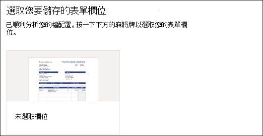
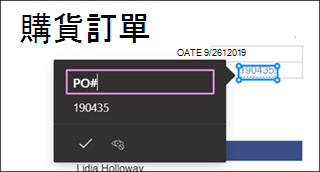
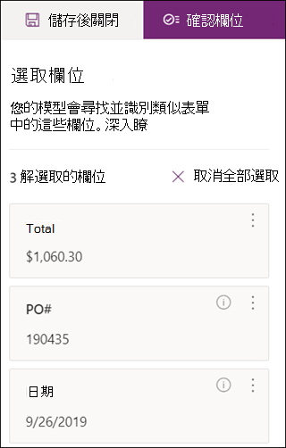

# 在 Microsoft SharePoint Syntex 中建立表單處理模型

 

> [!VIDEO https://www.microsoft.com/videoplayer/embed/RE4GnhN]  

 

使用 [AI Builder](https://docs.microsoft.com/ai-builder/overview) - Microsoft PowerApps 中的功能- SharePoint Syntex 使用者可以直接從 SharePoint 文件庫建立[表單處理模型](form-processing-overview.md)。 

建立表單處理模型涉及以下內容：
 - 步驟 1：建立表單處理模型以建立內容類型
 - 步驟 2：新增和分析範例檔案
 - 步驟 3：選取您的表單欄位
 - 步驟 4：訓練和測試您的模型
 - 步驟 5：發佈您的模型
 - 步驟 6：使用您的模型

## 需求

您只能在啟用此表單的 SharePoint 文件庫中建立表單處理模型。如果已啟用表單處理，您可在文件庫的 [自動化 **]** 功能表底下看到 **AI Builder** **「建立表單處理模型」**。如果您需要在文件庫啟用處理，您必須連絡您的 SharePoint 系統管理員。

  

## 步驟 1：建立表單處理模型

建立表單處理模型的第一步是命名並建立定義新內容類型，並為其建立新文件庫檢視。

1. 從文件庫中，選取 **[自動化]** 選單，選取 **[AI Builder]**，然後選取 **[建立表單處理模型]**。

     

2. 在 **[新表單處理模型]** 窗格的 **[名稱]** 欄位中，輸入您的模型名稱（例如 *[採購單]*）。

      

3. 建立表單處理模型時，您將建立新的 SharePoint 內容類型。SharePoint 內容類型表示具有共通特質並共用該特定內容的欄或中繼資料屬性集合的文件類別。SharePoint 內容類型會透過[內容類型資源庫]()管理。

    如果您想要將這個模型對應到 SharePoint 內容類型庫中現有的內容類型以使用其結構描述，請選取 [進階設定 **]**。 

4. 您的模型會在文件庫中為您擷取的資料建立新的檢視。如果不希望它成為預設檢視，請取消選取 [將檢視設定為預設檢視 **]**。

5. 選取 [建立 **]**。

## 步驟 2：新增和分析文件

建立新表單處理模型後，瀏覽器將打開新的 PowerApps AI Builder 表單處理模型頁面。您可以在這個頁面上新增及分析範例文件。  

> [!NOTE]
> 尋找要使用的範例檔案時，請參閱[表單處理模型輸入文件需求和最佳化提示](https://docs.microsoft.com/ai-builder/form-processing-model-requirements)。 

     
 
1. 選取 [新增文件 **]** 以開始新增分析的範例文件，以決定可擷取的命名值組。然後，您可以選擇 [從本機儲存空間 **]**、**SharePoint** 或 [Azure Blob 儲存體 **]** 上傳。您至少需要使用五個檔案進行訓練。

2. 新增檔案後，選取 [分析 **]**，以檢查所有檔案的任何共通資訊。這可能需要數分鐘的時間來完成。  
 
      

3. 檔案分析完成之後，在 **[選取您要儲存的表單欄位]** 頁面選取檔案以檢視檢測到的欄位。 

      

## 步驟 3：選取您的表單欄位

分析完文件的欄位之後，您現在可以查看找到的欄位，並識別您要儲存的欄位。已儲存的欄位會顯示為模型文件庫檢視中的欄，並顯示從每個文件擷取的值。

1. 下一頁將顯示其中一個範例檔案，並且將系統自動偵測到的所有共通欄位醒目顯示。  

      

2. 選取您要儲存的欄位，然後選取該核取方塊以確認您的選擇。例如，在採購單模型中，選擇以選取 [日期 *]*、[PO *]* 以及 [總計 *]* 欄位。請注意，可以隨您意願選擇重新命名欄位。 

      

3. 如果分析未偵測到欄位，您仍然可以選擇新增它。將您要擷取的資訊醒目提示，然後在名稱方塊中輸入您想要的名稱。然後選取核取方塊。請注意，您需要確認其餘範例檔案中未偵測到的欄位。

4. 選取您要儲存的欄位之後，請按一下 [確認欄位 **]**。  
 
      
 
5. 在 [選取您要儲存的表單欄位 **]** 頁面上，會顯示您選取的欄位數量。選取 [完成 **]**。

## 步驟 4：訓練和測試您的模型

選取您要儲存的欄位之後，[模型摘要 **]** 頁面可讓您訓練和測試您的模型。

1. 在 [模型摘要 **]** 頁面上，已儲存的欄位會顯示在 [選取的欄位 **]** 區段中。選取 [訓練 **]**，開始訓練您的範例檔案。請注意，這可能需要幾分鐘的時間才能完成。 

       

2. 當您看到訓練已完成的通知時，選取 [移至詳細資訊頁面 **]**。 

3. 在 [模型詳細資料 **]** 頁面上，您可以選取 [快速測試 **]** 來選擇測試模型的運作方式。這可讓您將檔案拖放至頁面，並查看是否已偵測到欄位。

      

2. 當您看到訓練已完成的通知時，選取 [移至詳細資訊頁面 **]**。 

3. 在 [模型詳細資料 **]** 頁面上，選取 [快速測試 **]** 來選擇測試模型的運作方式。這可讓您將檔案拖放至頁面，並查看是否已偵測到欄位。

## 步驟 5：發佈您的模型

1. 如果您對模型結果感到滿意，請選取 [發佈 **]** 以使其可用。

2. 在發佈模型之後，選取 [使用模型 **]**。這將建立一個可以在您的 SharePoint 文件庫中執行的 PowerAutomate 流程，並擷取已在模型中識別的欄位，然後選取 [建立流程 **]**。
  
3. 完成時，您會看到 [流程已成功建立 **]** 訊息。
 
## 步驟 6：使用您的模型

發佈模型並建立 PowerAutomate 流程之後，您就可以在 SharePoint 文件庫中使用您的模型。

1. 發佈模型之後，請選取 **[移至 SharePoint]** 以移至您的文件庫。

2. 請注意，在 [文件庫模型] 檢視中，您選取的欄位目前顯示為欄。 

      

3. 請注意，**[文件]** 旁邊的資訊連結注釋表單處理模型已套用至此文件庫。

    ![[資訊] 按鈕](../media/content-understanding/info-button.png)   

4. 將檔案上傳至您的文件庫。模型識別為其內容類型的任何檔案都會在您的檢視中列出檔案，並在欄中顯示擷取的資料。 

       

## 另請參閱
  
[Power Automate 文件](https://docs.microsoft.com/power-automate/)

[訓練：使用 AI Builder 改善商務效能](https://docs.microsoft.com/learn/paths/improve-business-performance-ai-builder/?source=learn)
