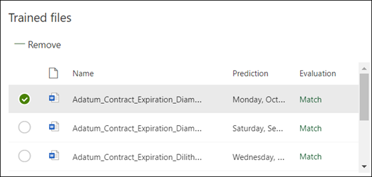

# 在 Microsoft SharePoint Syntex 中建立擷取器Create an extractor in Microsoft SharePoint Syntex

 

> [!VIDEO https://www.microsoft.com/videoplayer/embed/RE4CL2G]

  

在建立分類器模型以自動識別和分類特定文件類型之前或之後，您可以選擇將擷取器新增至模型，以從這些文件中提取特定資訊。Before or after you create a classifier model to automate identification and classification of specific document types, you can optionally choose to add extractors to your model to pull out specific information from these documents. 例如，您可能會想要模型不僅能識別新增至文件庫的所有 *續約* 文件，還能在文件庫中將每份文件的 *服務開始日期* 顯示為欄值。For example, you may want your model not only to identify all *Contract Renewal* documents added to your document library, but also to display the *Service Start date* for each document as a column value in the document library.

您必須為要擷取之文件的每個實體建立擷取器。You need to create an extractor for each entity in the document that you want to extract. 在我們的範例中，我們想要擷取由模型所識別之每份 **續約** 文件的 **服務開始日期** 。In our example, we want to extract the **Service Start Date** for each **Contract Renewal** document that is identified by the model. 我們希望能夠在所有  **續約** 文件的文件庫中看到一個檢視，並有欄位顯示每份文件的 **服務開始** 日期值。We want to be able to see a view in the document library of all  **Contract Renewal** documents, with a column that shows the **Service Start** date value of each document. 

> [!NOTE]
> 若要建立擷取器，您可以使用先前上傳來訓練分類程式的同一個檔案。In order to create an extractor, you use the same files you previously uploaded to train the classifier. 

## 為您的擷取器命名Name your extractor

1. 在模型首頁的 **[建立及訓練擷取器]** 磚中，按一下 **[訓練擷取器]**。From the model home page, in the **Create and train extractors** tile, click **Train extractor**.
2. 在 **[新增實體擷取器]** 畫面的 **[新擷取器名稱]** 欄位中輸入您的擷取器名稱。On the **New entity extractor** screen, type the name of your extractor in the **New extractor name** field. 例如，如果您想要從每個續約文件擷取服務開始日期，請將它命名為 **服務開始日期**。For example, name it **Service Start Date** if you want to extract the service start date from each Contract Renewal document. 您也可以選擇重複使用之前建立的欄位 (例如受管理的中繼資料欄)。You can also choose to reuse a previously created column (for example, a managed metadata column).
3. 按一下 **[建立]**。Click **Create**.

## 新增標籤Add a label

下一個步驟是在範例訓練檔案中，將您要擷取的實體加上標籤。The next step is to label the entity you want to extract in your example training files.

建立擷取器會開啟 [擷取] 頁面。Creating the extractor opens the extractor page. 您會在這裡看到範例檔案清單，而清單上的第一個檔案會顯示在檢視器中。Here you see a list of your sample files, with the first file on the list displayed in the viewer.

1. 從檢視器中，選取您要從檔案中擷取的資料。From the viewer, select the data that you want to extract from the files. 例如，如果您想要擷取 *[開始服務日期]*，請醒目提示第一個檔案中的日期值 (*[2019 年 10 月 14 日星期一]*)。For example, if you want to extract the *Start Service Date*, you highlight the date value in the first file (*Monday, October 14, 2019*). 然後按一下 **[儲存]**。and then click **Save**.  您應該會在 **[標籤]** 欄下的 [標籤範例清單] 中看到檔案的值。You should see the value display from the file in the Labeled examples list, under the **Label** column.
2. 選取 **[下一個檔案]** 以自動儲存，並開啟檢視器清單中的下一個檔案。Select **Next file** to auto save and open the next file in the list in the viewer. 或者，選取 **[儲存]**，然後從 **[標籤範例]** 清單中選取另一個檔案。Or select **Save** and then select another file from the **Labeled examples** list.
3. 在檢視器中，重複步驟 1 和 2，直到您將標籤儲存在所有五個檔案中。In the viewer, repeat steps 1 and 2, then repeat until you saved the label in all five files.

     

 
當您在五個檔案上加上標籤後，系統會顯示通知橫幅，通知您移至 [訓練]。Once you labeled five files, a notification banner displays informing you to move to training. 您可以選擇將更多文件加上標籤，或繼續前往訓練。You can choose to more label more documents or advance to training. 

## 新增說明Add an explanation

針對我們的範例，我們將建立一個說明，提供有關實體格式本身及其在範例文件中可能具有的變化的提示。For our example, we are going to create an explanation that provides a hint about the entity format itself and variations it may have in the sample documents. 例如，日期值可以採用多種不同的格式，例如：For example, a date value can be in a number of different formats, such as:
- 10/14/201910/14/2019
- 2019 年 10 月 14 日October 14, 2019
- 2019 年 10 月 14 日星期一Monday, October 14, 2019
 

若要協助識別 *服務開始日期*，您可以建立模式說明。To help identify the *Service Start Date* you can create a pattern explanation.

1. 在 [說明] 區段中，選取 **[新增]**，然後輸入名稱 (例如 *[日期]*)。In the Explanation section, select **New** and type a name (for example, *Date*).
2. 在 [類型] 中，選取 **[模式清單]**。For Type, select **Pattern list**.
3. 對於值，請提供其在範例檔案中顯示的日期變化。For Value, provide the date variation as they appear in the sample files. 例如，如果日期格式顯示為 0/00/0000，則輸入出現在文件中的所有變化，例如：For example, if you have date formats that appear as 0/00/0000, you enter any variations that appear in your documents, such as:
    - 0/0/00000/0/0000
    - 0/00/00000/00/0000
    - 00/0/000000/0/0000
    - 00/00/000000/00/0000
4. 選取 **[儲存]**。Select **Save**.

> [!NOTE]
> 如需深入了解說明類型，請參閱[說明類型](https://docs.microsoft.com/microsoft-365/contentunderstanding/explanation-types-overview)。For more learn more about explanation types, see [Explanation types](https://docs.microsoft.com/microsoft-365/contentunderstanding/explanation-types-overview).  

### 使用說明文件庫Use the Explanation library

若要建立日期等項目的說明，[使用說明文件庫](https://docs.microsoft.com/microsoft-365/contentunderstanding/explanation-types-overview#use-the-explanation-library)比手動輸入所有變化要容易得多。For creating explanations for items such as dates, it is easier to [use the explanation library](https://docs.microsoft.com/microsoft-365/contentunderstanding/explanation-types-overview#use-the-explanation-library) than to manually enter all variations. 說明文件庫是一組內建的片語和模式說明。The explanation library is a set of pre-built phrase and pattern explanations. 文件庫會嘗試提供所有格式的常用片語或模式清單，例如日期、電話號碼、郵遞區號等等。The library tries to provides all formats for common phrase or pattern lists, such as dates, phone numbers, zip codes, and many others. 

在 *[服務開始日期]* 範例中，使用說明文件庫中，*[日期]* 的內建說明更有效率：For the *Service Start Date* sample, it is more efficient to use the pre-built explanation for *Date* in the explanation library:

1. 在 **[說明]** 區段中，選取 **[新增]**，然後選取 **[從說明文件庫]**。In the **Explanation section**, select **New**, and then select **From explanation library**.
2. 從說明文件庫，選取 **[日期]**。From the explanation library, select **Date**. 您可以檢視已辨識的所有日期變化。You can view all variations of date that are recognized.
3. 選取 **[新增]**。Select **Add**. 

     

4. 在 **[建立說明]** 頁面上，說明文件庫中的 *[日期]* 資訊會自動填入欄位。On the **Create an explanation** page, the *Date* information from the explanation library auto fills the fields. 選取 **[儲存]**。Select **Save**. 

     

## 訓練模型Train the model 

儲存說明後即會開始訓練。Saving your explanation start the training. 如果您的模型有足夠的資訊可以從標籤的範例檔案擷取資料，您將會看到每個標示為 **[相符]** 的檔案。If your model has enough information to extract the data from your labeled example files, you will see each file labeled with **Match**.  

 

如果說明所需的資訊不足，無法找到您想要擷取的資料，每個檔案將會標籤為 **[不相符]**。If the explanation does not have enough information to find the data you want to extract, each file will be labeled with **Mismatch**. 您可以按一下 **[不相符]** 檔案，以查看更多不相符原因的資訊。You can click on the **Mismatched** files to see more information about why there was a mismatch.

## 新增其他說明Add another explanation

通常不相符是因為我們所提供的說明並未提供足夠的資訊，無法擷取服務開始日期值來符合我們加上標籤的檔案。Often the mismatch is an indication that the explanation we provided did not provide enough information to extract the service start date value to match our labeled files. 您可能需要編輯，或新增其他說明。You may need to edit it, or add another explanation.

在我們的範例中，請注意，文字字串 *開始服務日期* 始終位於實際值之前。For our example, notice that the text string *Start Service date of* always precedes the actual value. 若要協助識別服務開始日期，您必須建立片語說明。To help identify the Service Start Date, you need to create a phrase explanation.

1. 在 [說明] 區段中，選取 **[新增]**，然後輸入名稱 (例如 *[前置詞字串]*)。In the Explanation section, select **New**, and then type a name (for example, *Prefix String*).
2. 在 [類型] 中，選取 **[片語清單]**。For the Type, select **Phrase list**.
3. 使用 *[服務開始日期]* 做為值。Use *Service Start Date of* as the value.
4. 選取 **[儲存]**。Select **Save**.

     

## 再次訓練模型Train the model again

儲存說明之後即會再次開始訓練，這次使用範例中的兩個說明。Saving the explanation starts the training again, this time using both explanations in the example. 如果您的模型有足夠的資訊可以從標籤的範例檔案擷取資料，您會看到每個標示為 **[相符]** 的檔案。If your model has enough information to extract the data from the labeled example files, you see each file labeled with **Match**. 

如果您在標籤的檔案上再次收到 **[不相符]**，您可能需要建立其他說明，以提供模型以取得更多資訊來識別文件類型，或考慮變更現有的文件類型。If you again receive a **Mismatch** on your labeled files, you likely need to create another explanation to provide the model more information to identify the document type, or consider making changes to your existing ones.

## 測試您的模型Test your model

如果您在標籤的範例檔案上收到 [相符]，您現在可以在剩餘未標籤的範例檔案上測試模型。If you receive a match on your labeled sample files, you can now test your model on the remaining unlabeled example files. 這是一個選用但有用的步驟，可透過在模型以前從未見過的檔案中進行測試來評估模型的「適合性」或就緒狀態。This is optional, but a useful step to evaluate the “fitness” or readiness of the model before using it, by testing it on files the model hasn’t seen before.

1. 從模型首頁中，按一下 **[測試]** 索引標籤。這會在未標籤的範例檔案上執行模型。From the model home page, click the **Test** tab.  This runs the model on your unlabeled sample files.
2. 如果模型可以擷取所需的資訊，就會在 **[測試檔案]** 清單中顯示您的範例檔案。In the **Test files** list, your example files display to show if the model is able to extract the information you need. 使用這項資訊可協助您判斷分類器識別文件的效能。Use this information to help determine the effectiveness of your classifier in identifying your documents.

     

## 另請參閱See Also
[建立分類器Create a classifier](create-a-classifier.md)

[說明類型Explanation types](explanation-types-overview.md)

[在建立擷取器時運用字詞庫分類法Leverage term store taxonomy when creating an extractor](leverage-term-store-taxonomy.md)

[文件了解概觀Document Understanding overview](document-understanding-overview.md)

[套用模型Apply a model](apply-a-model.md) 
