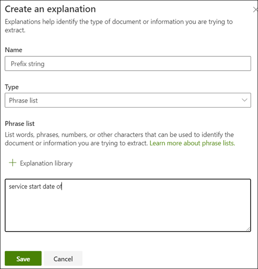

# 建立解壓縮程式 (預覽) Create an extractor (Preview)

本文內容適用于 Project Cortex 私人預覽。The content in this article is for the Project Cortex Private Preview. [進一步瞭解專案 Cortex](https://aka.ms/projectcortex)。[Find out more about Project Cortex](https://aka.ms/projectcortex).

 

> [!VIDEO https://www.microsoft.com/videoplayer/embed/RE4CL2G]

  

在您建立分類器模型以自動化特定檔案類型的識別和分類之前或之後，您可以選擇將擷取器新增至您的模型，以提取這些檔中的特定資訊。Before or after you create a classifier model to automate identification and classification of specific document types, you can optionally choose to add extractors to your model to pull out specific information from these documents. 例如，您可能想要模型不僅識別所有已新增至文件庫的 *合約更新* 檔，還會將每個檔的 *服務開始日期* 顯示為文件庫中的欄。For example, you may want your model not only to identify all *Contract Renewal* documents added to your document library, but also to display the *Service Start date* for each document as a column in the document library.

您必須為想要提取之檔中的每個實體建立解壓縮程式。You need to create an extractor for each entity in the document that you want to extract. 在此範例中，您想要針對模型所識別的每個*合約更新*檔，解壓縮*服務的開始日期*。In the sample, you want to extract the *Service Start Date* for each *Contract Renewal* document that is identified by the model. 當您想要查看所有 *合約更新* 檔的文件庫中的視圖，但該列顯示每個檔的服務開始日期值時，就必須執行此動作。This must happen when you want to see a view in the document library of all the *Contract Renewal* documents with a column showing the Service Start date value for each document.

> [!NOTE]
> 在建立提取程式之前，您必須 [新增範例](https://docs.microsoft.com/microsoft-365/contentunderstanding/create-a-classifier#add-your-example-files) 檔案，以協助訓練模型識別您想要提取的資訊。Before creating an extractor, you need to [add your example files](https://docs.microsoft.com/microsoft-365/contentunderstanding/create-a-classifier#add-your-example-files) to help train the model to identify the information you want to extract. 使用您用來建立分類器的相同範例檔案。Use the same sample files you used to create your classifier.

## 命名解壓縮程式Name your extractor

1. 從模型首頁的 [ **建立及火車擷取器** ] 磚中，按一下 [ **訓練提取**程式]。From the model home page, in the **Create and train extractors** tile, click **Train extractor**.
2. 在 [ **新增實體解壓縮** 程式] 畫面上，在 [ **新的解壓縮程式名稱** ] 欄位中輸入解壓縮程式的名稱。On the **New entity extractor** screen, type the name of your extractor in the **New extractor name** field. 例如，如果您想要從每個合約更新檔中解壓縮服務的開始日期，請將 [名稱 **服務開始日期** ] 命名為 [名稱]。For example, name it **Service Start Date** if you want to extract the service start date from each Contract Renewal document.
3. 按一下 **[建立]**。Click **Create**.

## 新增標籤Add a label

下一步是將您想要在範例訓練檔案中解壓縮的資訊加上標籤。The next step is to label the information you want to extract in your sample training files.

建立解壓縮程式會開啟 [解壓縮程式] 頁面。Creating the extractor opens the extractor page. 在這裡，您會看到範例檔案的清單，並在檢視器中顯示清單上的第一個檔案。Here you see a list of your sample files, with the first file on the list displayed in the viewer.

1. 從檢視器中，選取您要從檔案中解壓縮的資料。From the viewer, select the data that you want to extract from the files. 例如，如果您想要解壓縮 *開始服務日期*，您會在第一個檔案 (*星期一，10月14日，2019*) 中，反白顯示日期值。For example, if you want to extract the *Start Service Date*, you highlight the date value in the first file (*Monday, October 14, 2019*). ，然後按一下 [ **儲存**]。and then click **Save**.  您應該會在 [ **卷** 標] 欄下方，看到 [標籤範例] 清單中的檔案顯示的值。You should see the value display from the file in the Labeled examples list, under the **Label** column.
2. 選取 **[下一檔]** 以自動儲存並開啟檢視器清單中的下一個檔案。Select **Next file** to auto save and open the next file in the list in the viewer. 或選取 [ **儲存** ]，然後從 [ **標記的範例** ] 清單中選取另一個檔案。Or select **Save** and then select another file from the **Labeled examples** list.
3. 在檢視器中重複步驟1和2，然後重複步驟1到5，直到您在所有五個檔案中儲存標籤為止。In the viewer, repeat steps 1 and 2, then repeat until you saved the label in all five files.

     

### 新增負數範例Add a negative example

類似于在建立分類器時新增否定性範例檔案的方式，您需要為提取程式新增否定性範例。Similar to how you add a negative sample file when creating a classifier, you need to add a negative sample for the extractor. 它應該是一個不含「Service Start」 date 值的檔案。It should be a file that does not contain a "Service Start" date value.

1. 從 [ **標示的範例** ] 清單中，選取負數範例。From the **Labeled examples** list, select a negative example.
2. 在文章頂端的檢視器中，選取 [ **不顯示標籤**]。In the viewer on the top of the article, select **No label present**.
3. 按一下 **[儲存]**。Click **Save**.
 
當您標示五個檔案之後，就會顯示通知橫幅，告知您移至訓練。Once you labeled five files, a notification banner displays informing you to move to training. 您可以選擇更多檔或換片訓練。You can choose to more documents or advance to training. 

## 新增說明Add an explanation

在此範例中，您會建立說明，提供實體格式本身的提示，以及它在範例檔中可能具有的變化。For the example, you create an explanation that provides a hint about the entity format itself and variations it may have in the sample documents. 例如，date 值可以是多種不同的格式，例如：For example, a date value can be in a number of different formats, such as:
- 10/14/201910/14/2019
- 2019 年 10 月 14 日October 14, 2019
- 2019年10月14日星期一Monday, October 14, 2019
 

為了協助識別 *服務的開始日期* ，您建立了一個模式說明。To help identify the *Service Start Date* you create a pattern explanation.

1. 在 [說明] 區段中，選取 [ **新增** ]，然後輸入名稱 (例如， *Date*) 。In the Explanation section, select **New** and type a name (for example, *Date*).
2. 針對 [類型]，選取 [ **圖案清單**]。For Type, select **Pattern list**.
3. 針對 Value，提供日期變化顯示在範例檔案中。For Value, provide the date variation as they appear in the sample files. 例如，如果您的日期格式顯示為0/00/0000，您會輸入出現在檔中的任何變化，例如：For example, if you have date formats that appear as 0/00/0000, you enter any variations that appear in your documents, such as:
    - 0/0/00000/0/0000
    - 0/00/00000/00/0000
    - 00/0/000000/0/0000
    - 00/00/000000/00/0000
4. 選取 **[儲存]**。Select **Save**.

### 使用說明程式庫Use the Explanation library

若要建立諸如日期等專案的說明，使用 [說明] 程式庫比手動輸入所有變化更為容易。For creating explanations for items such as dates, it is easier to use the explanation library than to manually enter all variations. 說明庫是一組預先建立的片語和模式說明。The explanation library is a set of pre-built phrase and pattern explanations. 文件庫提供一般片語或模式清單的所有格式，例如日期、電話號碼、郵遞區號等等。The library provides all formats for common phrase or pattern lists, such as dates, phone numbers, zip code, etc. 

在 [ *服務開始日期* ] 範例中，使用 [說明] 程式庫中的 [ *日期* 預先建立的說明]，會比較有效率：For the *Service Start Date* sample, it is more efficient to use the pre-built explanation for *Date* in the explanation library:

1. 在 [ **說明] 區段**中，選取 [ **新增**]，然後選取 [ **從解釋程式庫**]。In the **Explanation section**, select **New**, and then select **From explanation library**.
2. 從 [說明] 程式庫中，選取 [ **日期**]。From the explanation library, select **Date**. 您可以查看所識別的日期所有變化。You can view all variations of date that are recognized.
3. 選取 **[新增]**。Select **Add**. 

     

4. 在 [ **建立說明** ] 頁面上，[說明] 文件庫中的 *日期* 資訊會自動填滿欄位。On the **Create an explanation** page, the *Date* information from the explanation library auto fills the fields. 選取 **[儲存]**。Select **Save**. 

     

## 訓練模型Train the model 

儲存您的說明開始訓練。Saving your explanation start the training. 如果您的模型有足夠的資訊可從標示的範例檔案中解壓縮資料，您將會看到每個標示為 [ **相符**] 的檔案。If your model has enough information to extract the data from your labeled example files, you will see each file labeled with **Match**.  

 

如果說明沒有足夠的資訊可找出您想要解壓縮的資料，則每個檔案都會以 **不相符**的方式標示。If the explanation does not have enough information to find the data you want to extract, each file will be labeled with **Mismatch**. 您可以按一下不 **匹配** 的檔案，以查看有關為何不符的詳細資訊。You can click on the **Mismatched** files to see more information about why there was a mismatch.

## 新增其他說明Add another explanation

通常不相符是指我們所提供的說明並未提供足夠的資訊來解壓縮服務的開始日期值，以符合我們標示的檔案。Often the mismatch is an indication that the explanation we provided did not provide enough information to extract the service start date value to match our labeled files. 您可能需要編輯它，或新增另一個說明。You may need to edit it, or add another explanation.

在此範例中，請注意文字字串的 *開始服務日期* 一定會在實際值之前。For the sample, notice that the text string *Start Service date of* always precedes the actual value. 為了協助識別服務的開始日期，您需要建立片語說明。To help identify the Service Start Date, you need ot create a phrase explanation.

1. 在 [說明] 區段中，選取 [ **新增**]，然後輸入名稱 (例如， *首碼字串*) 。In the Explanation section, select **New**, and then type a name (for example, *Prefix String*).
2. 在 [類型] 中，選取 [ **片語] 清單**。For the Type, select **Phrase list**.
3. 使用 *服務的開始日期* 做為值。Use *Service Start Date of* as the value.
4. 選取 **[儲存]**。Select **Save**.

     

## 重新訓練模型Train the model again

儲存說明重新開始訓練，這次會在範例中使用這兩個說明。Saving the explanation starts the training again, this time using both explanations in the sample. 如果您的模型有足夠的資訊可從標示的範例檔案中解壓縮資料，您會看到每個標示為 [ **相符**] 的檔案。If your model has enough information to extract the data from the labeled sample files, you see each file labeled with **Match**. 

如果您再次收到已標示的檔案 **不相符** 之處，您可能需要建立其他說明，以提供模型以進一步識別檔案類型的資訊，或考慮對您的範例模型進行變更。If you again receive a **Mismatch** on your labeled files, you likely need to create another explanation to provide the model more information to identify the document type, or consider making changes to your sample model.

## 測試您的模型Test your model

如果您接收到已標記的範例檔案的相符，您現在可以在其餘未標記的範例檔案上測試模型。If you receive a match on your labeled sample files, you can now test your model on the remaining unlabeled sample files.

1. 從模型首頁，按一下 [ **測試** ] 索引標籤。 這會在未標記的範例檔案上執行模型。From the model home page, click the **Test** tab.  This runs the model on your unlabeled sample files.
2. 在 [ **測試** 檔案] 清單中，當模型能夠解壓縮您所需的資訊時，就會顯示您的範例檔案。In the **Test files** list, your example files display to show if the model is able to extract the information you need. 使用此資訊有助於決定您的分類程式在識別檔時的效能。Use this information to help determine the effectiveness of your classifier in identifying your documents.

     
