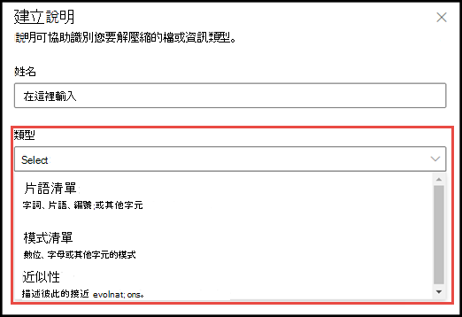

# 說明類型簡介

說明可用來協助您定義要在 Microsoft SharePoint Syntex 中於您的文件瞭解模型中加標籤及摘錄的資訊。 建立說明時，您必須選取說明類型。 本文協助您了解不同的說明類型及其使用方式。 

    
   
以下為可用的說明類型：

- **片語清單**：您可以在要摘錄的文件或資訊中使用的單字、片語、數字或其他字元的清單。 例如，文字字串 **轉診醫生** 位於所有您要識別的「醫學轉診」文件中。 

- **模式清單**：列出可用來識別您要摘錄的資訊的數字、字母或其他字元的模式。 例如，您可以從您要識別的所有「醫學轉診」文件中，摘錄轉診醫生的 **電話號碼**。 

- **鄰近**：描述說明彼此之間的相近程度。 例如，*街道號碼* 模式清單會位於 *街道名稱* 片語之前，它們之間沒有權杖 (您將在本文稍後了解權杖)。 使用鄰近類型時，要求在您的模型中至少有兩個說明，否則將停用該選項。 
 
## 片語清單

片語清單說明類型通常是用來透過您的模型來識別和分類文件。 如 *轉診醫生* 標籤範例中所述，它是在您要識別的文件中一致的單字、片語、數字或字元的字串。

雖然這並非一項要求，但如果您要擷取的片語位於您文件中的一致位置，則使用您的說明可以更成功。 例如，*轉診醫生* 標籤可能會一致地位於文件的第一個段落。

如果識別標籤時要求區分大小寫，使用片語清單類型可讓您在說明中加以指定，方法是選取 [僅完全符合大寫 **]** 核取方塊。

    

## 模式清單

建立可識別及摘錄文件中資訊的說明時，模式清單類型特別實用。 它通常會以不同的格式呈現，例如日期、電話號碼和信用卡號碼。 例如，日期可以以許多不同的格式顯示 (1/1/2020、1-1-2020、01/01/20、01/01/2020、Jan 1,2020 等)。 定義模式清單可讓您的說明更有效率，方法是擷取您想要識別及摘錄的資料中的任何可能變化。 

針對 **電話號碼** 範例，則會從模型識別的所有「醫學轉診」文件中，摘錄每位轉診醫生的電話號碼。 建立說明時，請選取 [模式清單] 類型，以允許您預期傳回的不同格式。

   

在這個範例中，請選取 **從 0 至 9 的任何數字**，核取方塊，以將模式清單中使用的每個「0」值，識別為 0 到 9 之間的任何數字。

   

同樣地，如果您建立包含文字字元的模式清單，請選取 **從 a 至 z 的任何字母** 核取方塊，以將模式清單中使用的每個「a」字元，識別為「a」到「z」的任何字元。

例如，如果您建立 **日期** 模式清單，而您想要確認可辨識日期格式 *Jan 1, 2020*，您必須：
- 將 *aaa 0, 0000* 和 *aaa 00, 0000* 新增至您的模式清單。
- 確認您也已選取 [從 a-z 的任何字母 **]**。

   

此外，如果您在模式清單中有大小寫需求，則會有選項可選取 [僅完全符合大寫 **]** 核取方塊。 對於日期範例，如果您需要月份的第一個字母為大寫，您必須：

- 將 *Aaa 0, 0000* 和 *Aaa 00, 0000* 新增至您的模式清單。
- 確認也選取 [僅完全符合大寫 **]**。

   

> [!NOTE]
> 不要手動建立模式清單說明，而是使用 [說明文件庫](https://docs.microsoft.com/microsoft-365/contentunderstanding/explanation-types-overview#use-explanation-templates) (英文) 來使用針對常見模式清單的模式清單範本，例如 *日期*、*電話號碼*、*信用卡號碼* 等等。

## 鄰近 

鄰近說明類型可協助您的模型識別資料，方法是透過定義另一個資料片段與其相似程度。 例如，在您的模型中，您定義了兩個說明，可標記客戶的 *街道地址號碼* 和 *電話號碼*。 

請注意，客戶的電話號碼永遠都出現在街道地址的前面。 

Alex Wilburn 
555-555-5555 
One Microsoft Way 
Redmond, WA 98034 

使用鄰近說明來定義電話號碼說明的距離，以便更好地識別文件中的街道地址號碼。

    

#### 什麼是權杖？

若要使用鄰近說明類型，您需要瞭解權杖的含義，因為權杖的編號是鄰近說明測量一個說明與另一個說明之間距離的方式。 權杖是字母和數字的連續範圍 (不含空格或標點符號)。 

下表顯示如何判斷片語中權杖數目的範例。

|片語|權杖數目|說明|
|--|--|--|
|`Dog`|1|沒有標點符號或空格的單字。|
|`RMT33W`|1|記錄定位器號碼。 其中可能含有數字和字母，但沒有標點符號。|
|`425-555-5555`|5|電話號碼。 每個標點符號都是單一權杖，因此 `425-555-5555` 會是 5 個權杖： `425` `-` `555` `-` `5555` |
|`https://luis.ai`|7|`https` `:` `/` `/` `luis` `.` `ai` |

#### 設定鄰近說明類型

針對此範例，請設定鄰近設定，以定義來自 *街道地址號碼* 說明的 *電話號碼* 說明之權杖數目的範圍。 請注意，最小範圍為「0」，因為電話號碼和街道地址號碼之間沒有權杖。

但範例文件中的部分電話號碼會附加 *(行動裝置)*。

Nestor Wilke 
111-111-1111 (行動電話) 
One Microsoft Way 
Redmond, WA 98034 

*(行動裝置)* 中有三個權杖：

|片語|權杖計數|
|--|--|
|(|1|
|行動電話|2|
|)|3|

將鄰近設定設為範圍 0 到 3。

    

## 設定文件中出現片語的位置

當您建立說明時，系統預設在整份文件中搜尋您要摘錄的片語。 不過，您可以使用 <b>這些片語出現的位置</b> [進階設定]，協助隔離文件中片語出現的特定位置。 當片語的類似實例可能出現在文件中的其他位置，而您想要確認已正確選取時，這是很實用的方法。 參照我們的醫學轉診文件範例，本文件第一段每次都稱為 **「轉診醫生」**。 使用 <b>這些片語出現的位置</b> 設定，在這個範例中，您可以設定您的說明，只在文件的開頭一節，或其他任何可能出現的位置搜尋此標籤。

    

此設定有以下三個選項供您選擇：

- 檔案中的任何位置：搜尋整份文件中的片語。
- 檔案開頭：從開頭到片語位置搜尋文件。  
    
在檢視器中，您可以手動調整 [選取] 方塊，以包含該階段所在的位置。 <b>結束位置</b> 值將會更新，以顯示您選取區域包含的權杖數目。 請注意，您可以更新 [結束位置] 值，並調整選取的區域。 
   ![[檔案位置的開頭] 方塊](../media/content-understanding/beginning-box.png) 

- 檔案結尾：從結尾到片語位置搜尋文件。  
    
在檢視器中，您可以手動調整 [選取] 方塊，以包含該階段所在的位置。 <b>起始位置</b> 值將會更新，以顯示您選取區域包含的權杖數目。 請注意，您可以更新 [起始位置] 值，並調整選取的區域。  
   ![[檔案結尾] 方塊](../media/content-understanding/end-box.png) 
- 自訂範圍：在文件中的指定範圍搜尋該文件中的 [片語] 位置。  
   。 
在檢視器中，您可以手動調整 [選取] 方塊，以包含該階段所在的位置。 在此設定中，您必須選取 <b>開始</b> ，以及 <b>結束</b> 位置。 這些值代表文件 begging 的權杖數目。 當您可以手動輸入這些值，在檢視器中手動調整選取方塊就變得更容易。  
   

## 使用說明範本

雖然您可以為您的說明手動新增各種模式清單值，但使用說明文件庫中所提供的範本會輕鬆得多。

例如，不要手動新增 *日期* 的所有變化，而是可以使用 *日期* 的模式清單範本，因為其中已包含一些模式清單值： 

    
 
說明文件庫包含常用的模式清單說明，包括： 

- 日期 
- 日期 (數字) 
- 時間 
- 數字 
- 電話號碼 
- 郵遞區號 
- 句子的第一個單字 
- 信用卡 
- 社會安全編號 

請注意，說明文件庫也包含用於片語清單說明的範本：
- 句子結尾
- 貨幣

#### 使用來自說明文件庫的範本

1. 從模型 [訓練 **]** 頁面的 [說明 **]** 區段，選取 [新增 **]**，然後選取 [從範本 **]**。 

    

2.  在 [說明範本 **]** 頁面上，選取您要使用的說明，然後選取 [新增 **]**。 

        

3. 您選取的範本資訊會顯示在 [建立說明 **]** 頁面上。 視需要編輯說明名稱，然後從模式清單新增或移除項目。   

    

4. 完成後，選取 [儲存 **]**。
