# Microsoft SharePoint Syntex 中的說明類型

說明可用來協助您定義要在 Microsoft SharePoint Syntex 中於您的文件瞭解模型中加標籤及摘錄的資訊。 建立說明時，您必須選取說明類型。 本文可協助您了解不同的說明類型及其使用方式。

![[建立說明] 窗格的螢幕擷取畫面顯示出三種說明類型。](../media/content-understanding/explanation-types.png) 
   
以下為可用的說明類型：

- [**片語清單**](#phrase-list)：您可以在要摘錄的文件或資訊中使用的單字、片語、數字或其他字元的清單。 例如，文字字串 *[轉診醫生]* 位於所有您要識別的「醫學轉診」文件中。 或者來自您要識別的所有「醫學轉診」文件中，轉診醫生的 *電話號碼*。

- [**規則運算式**](#regular-expression)：使用模式比對的標記法來尋找特定字元模式。 例如，您可以使用規則運算式來尋找一組文件中的 *電子郵件地址* 模式的所有實例。

- [**鄰近**](#proximity): 描述彼此之間的說明有多接近。 例如，*街道號碼* 片語清單會位於 *街道名稱* 片語清單之前，它們之間沒有權杖 (您將在本文稍後了解權杖)。 使用鄰近類型時，要求在您的模型中至少有兩個說明，否則將停用該選項。 

## 片語清單

片語清單說明類型通常是用來透過您的模型來識別和分類文件。 如 *[轉診醫生]* 標籤範例中所述，它是在您要識別的文件中一致的單字、片語、數字或字元的字串。

雖然這並非一項要求，但如果您要擷取的片語位於您文件中的一致位置，則使用您的說明可以更成功。 例如，*[轉診醫生]* 標籤可能會一致地位於文件的第一個段落。 您也可以使用 **[[設定片語在文件中出現的位置]](https://docs.microsoft.com/microsoft-365/contentunderstanding/explanation-types-overview#configure-where-phrases-occur-in-the-document)** 的進階設定來選取片語所在的特定區域，尤其是當片語可能出現在文件中多個位置時。

如果識別標籤時要求區分大小寫，使用片語清單類型可讓您在說明中加以指定，方法是選取 [僅完全符合大寫 **]** 核取方塊。

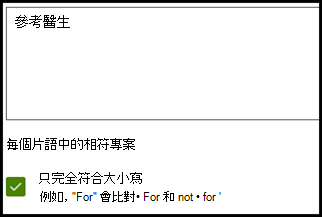 

片語類型在建立說明時會特別有用，該說明可以識別和摘錄不同格式的資訊，例如日期、電話號碼和信用卡號。 例如，日期可以以許多不同的格式顯示 (1/1/2020、1-1-2020、01/01/20、01/01/2020 或 Jan 1,2020)。 定義片語清單可讓您的說明更有效率，方法是從您想要識別及摘錄的資料中，擷取任何可能的變化。 

針對 *[電話號碼]* 範例，則會從模型識別的所有「醫學轉診」文件中，摘錄每位轉診醫生的電話號碼。 建立說明時，輸入電話號碼可能會在文件中顯示的不同格式，以便您擷取可能的變化。 

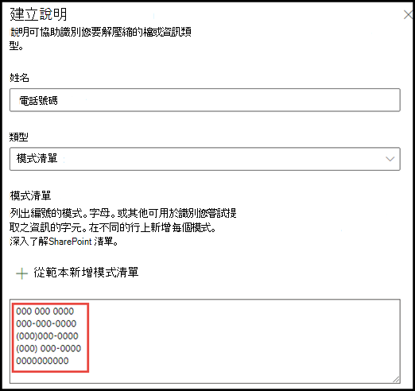

在這個範例中，請在 **[進階設定]** 選取 **[從 0 至 9 的任何數字]** 核取方塊，以將片語清單中使用的每個「0」值，識別為 0 到 9 之間的任何數字。

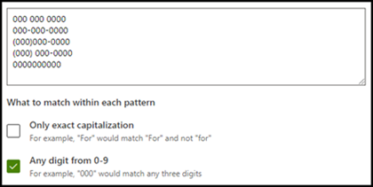

同樣地，如果您建立包含文字字元的片語清單，請選取 **[從 a 至 z 的任何字母]** 核取方塊，以將片語清單中使用的每個「a」字元，識別為「a」到「z」的任何字元。

例如，如果您建立 **日期** 片語清單，而您想要確認可辨識日期格式 *Jan 1, 2020*，您必須：

- 將 *aaa 0, 0000* 和 *aaa 00, 0000* 新增至您的片語清單。
- 確認您也已選取 [從 a-z 的任何字母 **]**。

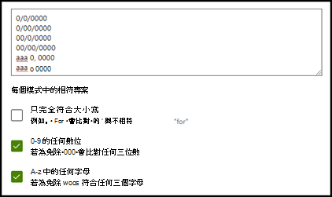

如果您在片語清單中有大小寫需求，則可以選取 **[僅完全符合大寫]** 核取方塊。 針對日期範例，如果您需要月份的第一個字母為大寫，您必須：

- 將 *Aaa 0, 0000* 和 *Aaa 00, 0000* 新增至您的片語清單。
- 確認也選取 [僅完全符合大寫 **]**。

> [!NOTE]
> 不要手動建立片語清單說明，而是使用 [說明文件庫](https://docs.microsoft.com/microsoft-365/contentunderstanding/explanation-types-overview#use-explanation-templates) 來使用針對常見片語清單的片語清單範本，例如 *日期*、*電話號碼* 或 *信用卡號碼*。

## 規則運算式

規則運算式說明類型可讓您建立模式，協助尋找及識別文件中特定的文字字串。 您可以使用規則運算式，快速剖析大量的文字，以達成下列目標：

- 尋找特定字元模式。
- 驗證文字以確保其符合預先定義的模式 (例如電子郵件地址)。
- 解壓縮、編輯、取代或刪除文字子字串。

規則運算式類型在建立說明時會特別有用，該說明可以識別和摘錄類似格式的資訊，例如電子郵件地址、銀行帳戶號碼，或 URL。 例如，電子郵件地址 (例如 megan@contoso.com) 會以特定模式顯示 ("megan" 是第一部分，而 "com" 是最後一部分)。 

電子郵件地址的規則運算式是：**[A-Za-z0-9._%-]+@[A-Za-z0-9.-]+.[A-Za-z]{2,6}**。

此運算式包含五個部分，順序為：

1. 任何下列字元數:

   a. 從 a 到 z 的字母

   b. 從 0-9 的數字

   c. 句點、底線、百分比或虛線

2. @ 符號

3. 任何與電子郵件地址的第一個部分相同的字元數

4. 句點

5. 兩到六個字母

若要新增規則運算式說明類型：

1. 從 **[建立說明]** 窗格的 **[說明類型]** 下方，選取 **[規則運算式]**。

   ![顯示已選取 [規則運算式] 的 [建立說明] 窗格的螢幕擷取畫面。](../media/content-understanding/create-regular-expression.png)

2. 您可以在 **[規則運算式]** 文字方塊中輸入解釋，或者選取 **[從範本中新增規則運算式]**。

   當您使用範本新增規則運算式時，它會自動將名稱和規則運算式新增到文字方塊。 例如，如果您選擇 **[電子郵件]** 範本，則會彈出 **[建立說明]** 窗格。

   ![顯示已套用 [電子郵件範本] 的 [建立說明] 窗格的螢幕擷取畫面。](../media/content-understanding/create-regular-expression-email.png)

## 鄰近 

鄰近說明類型可協助您的模型識別資料，方法是透過定義另一個資料片段與其相似程度。 例如，在您的模型中，您定義了兩個說明，可標記客戶的 *[街道地址號碼]* 和 *[電話號碼]*。 

請注意，客戶的電話號碼永遠都出現在街道地址的前面。 

Alex Wilburn 
555-555-5555 
One Microsoft Way 
Redmond, WA 98034 

使用鄰近說明來定義電話號碼說明的距離，以便更好地識別文件中的街道地址號碼。

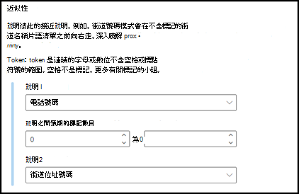

#### 什麼是權杖？

若要使用鄰近說明類型，您必須瞭解權杖是什麼。 權杖的編號是鄰近說明測量一個說明與另一個說明之間距離的方式。 權杖是字母和數字的連續範圍 (不含空格或標點符號)。 

下表顯示如何判斷片語中權杖數目的範例。

|片語|權杖數目|說明|
|--|--|--|
|`Dog`|1|沒有標點符號或空格的單字。|
|`RMT33W`|1|記錄定位器號碼。 其中可能含有數字和字母，但沒有標點符號。|
|`425-555-5555`|5|電話號碼。 每個標點符號都是單一權杖，因此 `425-555-5555` 會是 5 個權杖： `425` `-` `555` `-` `5555` |
|`https://luis.ai`|7|`https` `:` `/` `/` `luis` `.` `ai` |

#### 設定鄰近說明類型

針對此範例，請設定鄰近設定，以定義來自 *[街道地址號碼]* 說明的 *[電話號碼]* 說明之權杖數目的範圍。 請注意，最小範圍為「0」，因為電話號碼和街道地址號碼之間沒有權杖。

但範例文件中的部分電話號碼會附加 *(行動裝置)*。

Nestor Wilke 
111-111-1111 (行動電話) 
One Microsoft Way 
Redmond, WA 98034 

*(行動裝置)* 中有三個權杖：

|片語|權杖計數|
|--|--|
|(|1|
|行動電話|2|
|)|3|

將鄰近設定設為範圍 0 到 3。

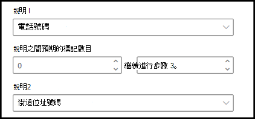

## 設定文件中出現片語的位置

當您建立說明時，系統預設在整份文件中搜尋您要摘錄的片語。 不過，您可以使用 **[這些片語出現的位置]** 進階設定，協助隔離文件中片語出現的特定位置。 當片語的類似實例可能出現在文件中的其他位置，而您想要確認已正確選取時，這項設定便是很實用的方法。

參照我們的醫學轉診文件範例，本文件第一段每次都提及 *「轉診醫生」*。 使用 **[這些片語出現的位置]** 設定，在這個範例中，您可以設定您的說明，只在文件的開頭一節，或其他任何可能出現的位置搜尋此標籤。

此設定有以下三個選項供您選擇：

- 檔案中的任何位置：搜尋整份文件中的片語。

- 檔案開頭：從開頭到片語位置搜尋文件。

   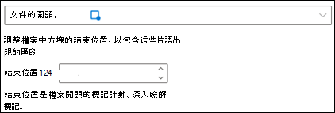

    在檢視器中，您可以手動調整選取方塊，以包含該階段所在的位置。 **[結束位置]** 值將會更新，以顯示您選取區域包含的語彙基元數目。 您可以更新 **[結束位置]** 值，並調整選取的區域。

   ![[檔案位置的開頭] 方塊](../media/content-understanding/beginning-box.png)

- 檔案結尾：從結尾到片語位置搜尋文件。

   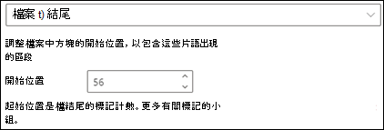

    在檢視器中，您可以手動調整選取方塊，以包含該階段所在的位置。 **[起始位置]** 值將會更新，以顯示您選取區域包含的語彙基元數目。 您可以更新 [起始位置] 值，並調整選取的區域。

   ![[檔案結尾] 方塊](../media/content-understanding/end-box.png)

- 自訂範圍：在文件的指定範圍内搜尋片語的位置。

   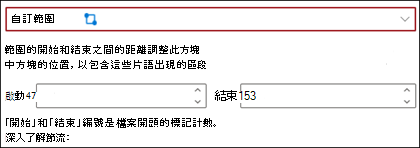

    在檢視器中，您可以手動調整選取方塊，以包含該階段所在的位置。 在此設定中，您必須選取 **[開始]** ，以及 **[結束]** 位置。 這些值代表從文件開頭算起的的語彙基元數目。 當您可以手動輸入這些值，在檢視器中手動調整選取方塊就變得更容易。 
   
## 使用說明範本

雖然您可以為您的說明手動新增各種片語清單值，但使用說明文件庫中所提供的範本會輕鬆得多。

例如，不要手動新增 *[日期]* 的所有變化，而是可以使用 *[日期]* 的片語清單範本，因為其中已包含許多片語清單值：

 
說明文件庫包含常用的 *片語清單* 說明，包括：

- 日期：行事曆日期，所有格式。 包含文字和數字 (例如，"2020 年 12 月 9 日")。
- 日期 (數字)：行事曆日期，所有格式。 包含數字 (例如，1-11-2020)。
- 時間：12 小時和 24 小時格式。
- 數字：最多兩位數的正數和負數。 
- 百分比：代表百分比的模式清單。 例如，1%、11%、100% 或 11.11%。
- 電話號碼：通用美國及國際格式。 例如，000 000 0000、000-000-0000、(000)000-0000 或 (000) 000-0000。
- 郵遞區號：美國郵遞區號格式。 例如，11111、11111-1111。
- 句子的第一個單字：最多九個字元的文字常用模式。 
- 句子結尾：句子結尾的常用標點符號。
- 信用卡：常用信用卡號碼格式。 例如，1111-1111-1111-1111。 
- 社會安全號碼：美國社會安全號碼格式。例如，111-11-1111。 
- 核取方塊：代表填入核取方塊上變化的片語清單。 例如，_X_、_ _X_。
- 貨幣：主要國際符號。 例如，$。 
- 電子郵件副本：帶有 'CC:' 一詞的片語清單，通常可在傳送郵件的其他人員或群組的名稱或電子郵件地址附近找到。
- 電子郵件日期：帶有 'Sent on:' 一詞的片語清單，通常可在傳送郵件的日期附近找到。
- 電子郵件問候語：電子郵件的常用開場白。
- 電子郵件收件者：帶有 'To:' 一詞的片語清單，通常可在傳送郵件的人員或群組的名稱或電子郵件地址附近找到。 
- 電子郵件寄件者：帶有 'From:' 一詞的片語清單，通常可在寄件者的名稱或電子郵件地址附近找到。 
- 電子郵件主旨：帶有 'Subject:' 一詞的片語清單，通常可在電子郵件的主旨附近找到。

說明文件庫也包含常用的 *[規則運算式]* 說明，包括：

- 6 到 17 位數的數位：符合任何從 6 到 17 位數長的數位。 美國銀行帳戶號碼符合此模式。
- 電子郵件：符合一般類型的電子郵件地址，例如 meganb@contoso.com。
- 美國納稅人識別碼：符合以 9 開頭的三位數字，然後符合以 7 或 8 開頭的 6 位數字。 
- 網址 (URL)：符合網址的格式，開頭為 http:// or https://。

此外，說明文件庫包含三個自動範本類型，可以搭配您在範例檔案中標示的資料：

- 標籤後面：範例檔案中標籤後面的文字或字元。
- 標籤前面：範例檔案中標籤前面的文字或字元。
- 標籤：範例檔案的最多前 10 個標籤。

為了提供您自動範本如何運作的範例，我們會在下列範例檔案中使用「標籤前面」說明範本，協助為模型提供更多資訊，以取得更準確的相符項目。

當您選取「標籤前面」說明範本時，它會尋找您的範例檔案中標籤前面出現的第一組文字。 範例中在第一個範例檔案中識別的文字是 "As of"。

您可以選取 [**新增**] 從範本建立說明。  隨著您新增更多範例檔案，將會識別出其他字詞，並將其新增至片語清單。

 
#### 使用來自說明文件庫的範本

1. 從模型 [訓練 **]** 頁面的 [說明 **]** 區段，選取 [新增 **]**，然後選取 [從範本 **]**。

   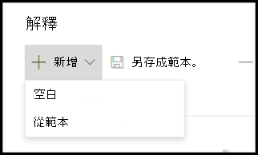

2.  在 [說明範本 **]** 頁面上，選取您要使用的說明，然後選取 [新增 **]**。

    

3. 您選取的範本資訊會顯示在 [建立說明 **]** 頁面上。 視需要編輯說明名稱，然後從片語清單新增或移除項目。  

    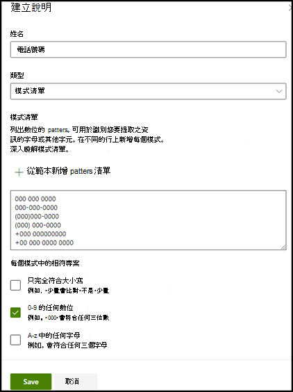

4. 完成後，選取 [儲存 **]**。