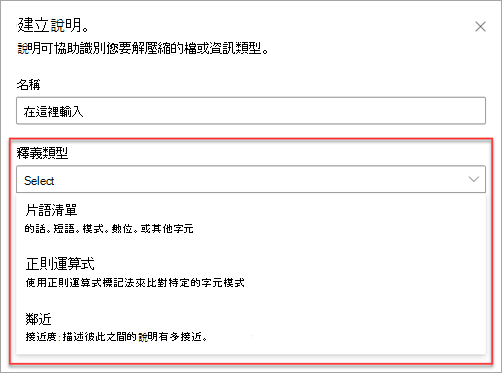

# 說明類型簡介Introduction to explanation types

說明可用來協助您定義要在 Microsoft SharePoint Syntex 中於您的文件瞭解模型中加標籤及摘錄的資訊。Explanations are used to help to define the information you want to label and extract in your document understanding models in Microsoft SharePoint Syntex. 建立說明時，您必須選取說明類型。When creating an explanation, you need to select an explanation type. 本文協助您了解不同的說明類型及其使用方式。This article helps you understand the different explanation types and how they are used. 

 
   
以下為可用的說明類型：These explanation types are available:

- **片語清單**：您可以在要摘錄的文件或資訊中使用的單字、片語、數字或其他字元的清單。**Phrase list**: List of words, phrases, numbers, or other characters you can use in the document or information that you are extracting. 例如，文字字串 **轉診醫生** 位於所有您要識別的「醫學轉診」文件中。For example, the text string **Referring Doctor** is in all Medical Referral documents you are identifying. 或者來自您要識別的所有「醫學轉診」文件中，轉診醫生的 **電話號碼**。Or the **Phone number** of the referring doctor from all Medical Referral document that you are identifying.

- **接近度**: 描述彼此之間的說明有多接近。**Proximity**: Describes how close explanations are to each other. 例如，*街道號碼* 片語清單會位於 *街道名稱* 片語清單之前，它們之間沒有權杖 (您將在本文稍後了解權杖)。For example, a *street number* phrase list goes right before the *street name* phrase list, with no tokens in between (you'll learn about tokens later in this article). 使用鄰近類型時，要求在您的模型中至少有兩個說明，否則將停用該選項。Using the proximity type requires you to have at least two explanations in your model or the option will be disabled. 
 
## 片語清單Phrase list

片語清單說明類型通常是用來透過您的模型來識別和分類文件。A phrase list explanation type is typically used to identify and classify a document through your model. 如 *轉診醫生* 標籤範例中所述，它是在您要識別的文件中一致的單字、片語、數字或字元的字串。As described in the *Referring Doctor* label example, it is a string of words, phrases, numbers, or characters that is consistently in the documents that you are identifying.

雖然這並非一項要求，但如果您要擷取的片語位於您文件中的一致位置，則使用您的說明可以更成功。While not a requirement, you can achieve better success with your explanation if the phrase you are capturing is located in a consistent location in your document. 例如，*轉診醫生* 標籤可能會一致地位於文件的第一個段落。For example, the *Referring Doctor* label may be consistently located in the first paragraph of the document. 您也可以使用 **[[設定片語在文件中出現的位置]](https://docs.microsoft.com/microsoft-365/contentunderstanding/explanation-types-overview#configure-where-phrases-occur-in-the-document)** 的進階設定來選取片語所在的特定區域，尤其是當片語可能出現在文件中多個位置時。You can also use the **[Configure where phrases occur in the document](https://docs.microsoft.com/microsoft-365/contentunderstanding/explanation-types-overview#configure-where-phrases-occur-in-the-document)** advanced setting to select specific areas where the phrase is located, especially if there is a chance that the phrase might occur in multiple locations in your document.

如果識別標籤時要求區分大小寫，使用片語清單類型可讓您在說明中加以指定，方法是選取 [僅完全符合大寫 **]** 核取方塊。If case sensitivity is a requirement in identifying your label, using the phrase list type allows you to specify it in your explanation by selecting the **Only exact capitalization** checkbox.

 

片語類型在建立說明時會特別有用，該說明可以識別和摘錄不同格式的資訊，例如日期、電話號碼和信用卡號。A phrase type is especially useful when you create an explanation that identifies and extracts information in different formats, such as dates, phone numbers, and credit card numbers. 例如，日期可以以許多不同的格式顯示 (1/1/2020、1-1-2020、01/01/20、01/01/2020、Jan 1,2020 等)。For example, a date can be displayed in a number of different formats (1/1/2020, 1-1-2020, 01/01/20, 01/01/2020, Jan 1,2020, etc.). 定義片語清單可讓您的說明更有效率，方法是從您想要識別及摘錄的資料中，擷取任何可能的變化。Defining a phrase list makes your explanation more efficient by capturing any possible variations in the data that you are trying to identify and extract. 

針對 **電話號碼** 範例，則會從模型識別的所有「醫學轉診」文件中，摘錄每位轉診醫生的電話號碼。For the **Phone number** example, you extract the phone number for each referring doctor from all Medical Referral documents that the model identifies. 建立說明時，輸入電話號碼可能會在文件中顯示的不同格式，以便您擷取可能的變化。When you create the explanation, type the different formats a phone number might display in your document so that you are able to capture possible variations. 

在這個範例中，請在 **[進階設定]** 選取 **[從 0 至 9 的任何數字]** 核取方塊，以將片語清單中使用的每個「0」值，識別為 0 到 9 之間的任何數字。For this example, in **Advanced Settings** select the **Any digit from 0-9** checkbox to recognize each "0" value used in your phrase list to be any digit from 0 through 9.

同樣地，如果您建立包含文字字元的片語清單，請選取 **[從 a 至 z 的任何字母]** 核取方塊，以將片語清單中使用的每個「a」字元，識別為「a」到「z」的任何字元。Similarly, if you create a phrase list that includes text characters, select the **Any letter from a-z** checkbox to recognize each "a" character used in the phrase list to be any character from "a" to "z".

例如，如果您建立 **日期** 片語清單，而您想要確認可辨識日期格式 *Jan 1, 2020*，您必須：For example, if you create a **Date** phrase list and you want to make sure that a date format such as *Jan 1, 2020* is recognized, you need to:
- 將 *aaa 0, 0000* 和 *aaa 00, 0000* 新增至您的片語清單。Add *aaa 0, 0000* and *aaa 00, 0000* to your phrase list.
- 確認您也已選取 [從 a-z 的任何字母 **]**。Make sure that **Any letter from a-z** is also selected.

此外，如果您在片語清單中有大小寫需求，則會有選項可選取 **[僅完全符合大寫]** 核取方塊。Additionally, if you have capitalization requirements in your phrase list, you have the option to select the **Only exact capitalization** checkbox. 針對日期範例，如果您需要月份的第一個字母為大寫，您必須：For the Date example, if you require the first letter of the month to be capitalized, you need to:

- 將 *Aaa 0, 0000* 和 *Aaa 00, 0000* 新增至您的片語清單。Add *Aaa 0, 0000* and *Aaa 00, 0000* to your phrase list.
- 確認也選取 [僅完全符合大寫 **]**。Make sure that **Only exact capitalization** is also selected.

> [!NOTE]
> 不要手動建立片語清單說明，而是使用 [說明文件庫](https://docs.microsoft.com/microsoft-365/contentunderstanding/explanation-types-overview#use-explanation-templates) 來使用針對常見片語清單的片語清單範本，例如 *日期*、*電話號碼*、*信用卡號碼* 等等。Instead of manually creating a phrase list explanation, use the [explanation library](https://docs.microsoft.com/microsoft-365/contentunderstanding/explanation-types-overview#use-explanation-templates) to use phrase list templates for a common phrase list, such as *date*, *phone number*, *credit card number*, etc.

## 鄰近Proximity 

鄰近說明類型可協助您的模型識別資料，方法是透過定義另一個資料片段與其相似程度。The proximity explanation type helps your model identify data by defining how close another piece of data is to it. 例如，在您的模型中，您定義了兩個說明，可標記客戶的 *街道地址號碼* 和 *電話號碼*。For example, in your model say you have defined two explanations that label both the customer *Street address number* and *Phone number*. 

請注意，客戶的電話號碼永遠都出現在街道地址的前面。Notice that customer phone numbers always appear before the street address number. 

Alex WilburnAlex Wilburn 
555-555-5555555-555-5555 
One Microsoft WayOne Microsoft Way 
Redmond, WA 98034Redmond, WA 98034 

使用鄰近說明來定義電話號碼說明的距離，以便更好地識別文件中的街道地址號碼。Use the proximity explanation to define how far away the phone number explanation is to better identify the street address number in your documents.

#### 什麼是權杖？What are tokens?

若要使用鄰近說明類型，您需要瞭解權杖的含義，因為權杖的編號是鄰近說明測量一個說明與另一個說明之間距離的方式。In order to use the proximity explanation type, you need to understand what a token is, as the number of tokens is how the proximity explanation measures distance from one explanation to another. 權杖是字母和數字的連續範圍 (不含空格或標點符號)。A token is a continuous span (not including spaces or punctuation) of letters and numbers. 

下表顯示如何判斷片語中權杖數目的範例。The following table shows examples for how to determine the number of tokens in a phrase.

|片語Phrase|權杖數目Number of tokens|說明Explanation|
|--|--|--|
|`Dog`|11|沒有標點符號或空格的單字。A single word with no punctuation or spaces.|
|`RMT33W`|11|記錄定位器號碼。A record locator number. 其中可能含有數字和字母，但沒有標點符號。It may include numbers and letters, but does not have punctuation.|
|`425-555-5555`|55|電話號碼。A phone number. 每個標點符號都是單一權杖，因此 `425-555-5555` 會是 5 個權杖：Each punctuation mark is a single token, so `425-555-5555` is 5 tokens: `425` `-` `555` `-` `5555` |
|`https://luis.ai`|77|`https` `:` `/` `/` `luis` `.` `ai` |

#### 設定鄰近說明類型Configure the proximity explanation type

針對此範例，請設定鄰近設定，以定義來自 *街道地址號碼* 說明的 *電話號碼* 說明之權杖數目的範圍。For the example, configure the proximity setting to define the range of the number of tokens in the *Phone number* explanation from the *Street address number* explanation. 請注意，最小範圍為「0」，因為電話號碼和街道地址號碼之間沒有權杖。Notice that the minimum range is "0", because there are no tokens between the phone number and street address number.

但範例文件中的部分電話號碼會附加 *(行動裝置)*。But some phone numbers in the sample documents are appended with *(mobile)*.

Nestor WilkeNestor Wilke 
111-111-1111 (行動電話)111-111-1111 (mobile) 
One Microsoft WayOne Microsoft Way 
Redmond, WA 98034Redmond, WA 98034 

*(行動裝置)* 中有三個權杖：There are three tokens in *(mobile)*:

|片語Phrase|權杖計數Token count|
|--|--|
|((|11|
|行動電話mobile|22|
|))|33|

將鄰近設定設為範圍 0 到 3。Configure the proximity setting to have a range of 0 through 3.

## 設定文件中出現片語的位置Configure where phrases occur in the document

當您建立說明時，系統預設在整份文件中搜尋您要摘錄的片語。When you create an explanation, by default the entire document is searched for the phrase you are trying to extract. 不過，您可以使用 **[這些片語出現的位置]** 進階設定，協助隔離文件中片語出現的特定位置。However, you can use the **Where these phrases occur** advanced setting to help in isolating a specific location in the document that a phrase occurs. 當片語的類似實例可能出現在文件中的其他位置，而您想要確認已正確選取時，這是很實用的方法。This is useful in situations where similar instances of a phrase might appear somewhere else in the document, and you want to make sure that the correct one is selected. 參照我們的醫學轉診文件範例，本文件第一段每次都提及 **「轉診醫生」**。Referring to our Medical Referral document example, the **Referring Doctor** is always mentioned in the first paragraph of the document. 使用 [這些片語出現的位置] 設定，在這個範例中，您可以設定您的說明，只在文件的開頭一節，或其他任何可能出現的位置搜尋此標籤。With the \*\*Where these phrases occur setting, in this example you can configure your explanation to search for this label only in the beginning section of the document, or any other location in which it might occur.

此設定有以下三個選項供您選擇：You can choose the following options for this setting:

- 檔案中的任何位置：搜尋整份文件中的片語。Anywhere in the file: The entire document is searched for the phrase.

- 檔案開頭：從開頭到片語位置搜尋文件。Beginning of the file:  The document is searched from the beginning to the phrase location.

   

    在檢視器中，您可以手動調整選取方塊，以包含該階段所在的位置。In the viewer, you can manually adjust the select box to include the location where the phase occurs. **[結束位置]** 值將會更新，以顯示您選取區域包含的語彙基元數目。The **End position** value will update to show the number of tokens your selected area includes. 請注意，您可以更新 [結束位置] 值，並調整選取的區域。Note that you can update the End position value as well to adjust the selected area.

   ![[檔案位置的開頭] 方塊](../media/content-understanding/beginning-box.png)

- 檔案結尾：從結尾到片語位置搜尋文件。End of the file:  The document is searched from the end to the phrase location.

   

    在檢視器中，您可以手動調整選取方塊，以包含該階段所在的位置。In the viewer, you can manually adjust the select box to include the location where the phase occurs. **[起始位置]** 值將會更新，以顯示您選取區域包含的語彙基元數目。The **Starting position** value will update to show the number of tokens your selected area includes. 請注意，您可以更新 [起始位置] 值，並調整選取的區域。Note that you can update the Starting position value as well to adjust the selected area.

   ![[檔案結尾] 方塊](../media/content-understanding/end-box.png)

- 自訂範圍：在文件的指定範圍内搜尋片語的位置。Custom range:  The document is searched in a specified range within the it for the phrase location.

   

    在檢視器中，您可以手動調整選取方塊，以包含該階段所在的位置。In the viewer, you can manually adjust the select box to include the location where the phase occurs. 在此設定中，您必須選取 **[開始]** ，以及 **[結束]** 位置。For this setting, you need to select a **Start** and an **End** position. 這些值代表從文件開頭算起的的語彙基元數目。These values represent the number of tokens from the begging of the document. 當您可以手動輸入這些值，在檢視器中手動調整選取方塊就變得更容易。While you can manually enter in these values, it is easier to manually adjust the select box in the viewer. 
   
## 使用說明範本Use explanation templates

雖然您可以為您的說明手動新增各種片語清單值，但使用說明文件庫中所提供的範本會輕鬆得多。While you can manually add various phrase list values for your explanation, it can be easier to use the templates provided to you in the explanation library.

例如，不要手動新增 *日期* 的所有變化，而是可以使用 *日期* 的片語清單範本，因為其中已包含一些片語清單值：For example, instead of manually adding all the variations for *Date*, you can use the phrase list template for *Date* as it already includes a number of phrase lists values:

 
說明文件庫包含常用的片語清單說明，包括：The explanation library includes commonly used phrase list explanations, including:

- 日期：行事曆日期，所有格式。Date: Calendar dates, all formats. 包含文字和數字 (例如，"2020 年 12 月 9 日")。Includes text and numbers (for example, "Dec 9, 2020").
- 日期 (數字)：行事曆日期，所有格式。Date (numeric): Calendar dates, all formats. 包含數字 (例如，1-11-2020)。Includes numbers (for example 1-11-2020).
- 時間：12 小時和 24 小時格式。Time: 12 and 24 hour formats.
- 數字：最多 2 位數的正數和負數。Number: Positive and negative numbers up to 2 decimals. 
- 百分比：代表百分比的模式清單。Percentage: A list of patterns representing a percentage. 例如，1%、11%、100%、11.11% 等等。For example, 1%, 11%, 100%, 11.11%, etc.
- 電話號碼：通用美國及國際格式。Phone number: Common US and International formats. 例如，000 000 0000、000-000-0000、(000)000-0000、(000) 000-0000 等等。For example, 000 000 0000, 000-000-0000, (000)000-0000, (000) 000-0000, etc.
- 郵遞區號：美國郵遞區號格式。Zip code: US Zip code formats. 例如，11111、11111-1111。For example, 11111, 11111-1111.
- 句子的第一個單字：最多 9 個字元的文字常用模式。First word of sentence: Common patterns for words up to 9 characters. 
- 句子結尾：句子結尾的常用標點符號End of sentence: Common punctuation for end of a sentence
- 信用卡：常用信用卡號碼格式。Credit card: Common credit card number formats. 例如，1111-1111-1111-1111。For example, 1111-1111-1111-1111. 
- 社會安全號碼：美國社會安全號碼格式。Social security number: US Social Security Number format. 例如，111-11-1111。For example, 111-11-1111. 
- 核取方塊：代表填入核取方塊上變化的片語清單。Checkbox: A phrase list representing variations on a filled in checkbox. 例如，_X_、_ _X_ 等等。For example, _X_, _ _X_, etc.
- 貨幣：主要國際符號。Currency: Major international symbols. 例如，$。For example, $. 
- 電子郵件副本：帶有 'CC:' 一詞的片語清單，通常可在傳送郵件的其他人員或群組的名稱或電子郵件地址附近找到。Email CC: A phrase list with the term 'CC:', often found near the names or email addresses of additional people or groups the message was sent to.
- 電子郵件日期：帶有 'Sent on:' 一詞的片語清單，通常可在傳送郵件的日期附近找到。Email date: A phrase list with the term 'Sent on:', often found near the date the email was sent.
- 電子郵件問候語：電子郵件的常用開場白。Email greeting: Common opening lines for emails.
- 電子郵件收件者：帶有 'To:' 一詞的片語清單，通常可在傳送郵件的人員或群組的名稱或電子郵件地址附近找到。Email recipient: A phrase list with the term 'To:', often found near the names or email addresses of people or groups the message was sent to. 
- 電子郵件寄件者：帶有 'From:' 一詞的片語清單，通常可在寄件者的名稱或電子郵件地址附近找到。Email sender: A phrase list with the term 'From:', often found near the sender's name or email address. 
- 電子郵件主旨：帶有 'Subject:' 一詞的片語清單，通常可在電子郵件的主旨附近找到。Email subject: A phrase list with the term 'Subject:', often found near the email's subject. 

說明文件庫也包含三個自動範本類型，可以搭配您在範例檔案中標示的資料：The explanation library also includes three automatic template types that work with the data you've labeled in your example files:

- 標籤後面：範例檔案中標籤後面的文字或字元。After label: The words or characters that occur after the labels in the example files.
- 標籤前面：範例檔案中標籤前面的文字或字元。Before label: The words or characters that occur before the labels in the example files.
- 標籤：範例檔案的最多前 10 個標籤。Labels: Up to the first 10 labels from the example files.

為了提供您自動範本如何運作的範例，我們會在下列範例檔案中使用「標籤前面」說明範本，協助為模型提供更多資訊，以取得更準確的相符項目。To give you an example of how automatic templates work, in the following example file, we will use the Before Label explanation template to help give the model more information to get a more accurate match.

當您選取「標籤前面」說明範本時，它會尋找您的範例檔案中標籤前面出現的第一組文字。When you select the Before Label explanation template, it will look for the first set of words that appear before the label in your example files. 範例中在第一個範例檔案中識別的文字是 "As of"。In the example, the words that are identified in the first example file is "As of".

您可以選取 [**新增**] 從範本建立說明。You can select **Add** to create an explanation from the template.  隨著您新增更多範例檔案，將會識別出其他字詞，並將其新增至片語清單。As you add more example files, additional words will be identified and added to the phrase list.

 
#### 使用來自說明文件庫的範本To use a template from the explanation library

1. 從模型 [訓練 **]** 頁面的 [說明 **]** 區段，選取 [新增 **]**，然後選取 [從範本 **]**。From the **Explanations** section of your model's **Train** page, select **New**, then select **From a template**.

   

2.  在 [說明範本 **]** 頁面上，選取您要使用的說明，然後選取 [新增 **]**。On the **Explanation templates** page, select the explanation you want to use, then select **Add**.

    

3. 您選取的範本資訊會顯示在 [建立說明 **]** 頁面上。The information for the template you selected displays on the **Create an explanation** page. 視需要編輯說明名稱，然後從片語清單新增或移除項目。If needed, edit the explanation name and add or remove items from the phrase list.  

    

4. 完成後，選取 [儲存 **]**。When finished, select **Save**.