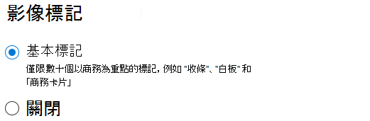

# SharePoint Syntex 中的影像標記

預設會對 SharePoint 和 OneDrive 開啟基本的影像標記。 上傳到兩個位置之一的影像會經過自動掃描，並從 37 個基本標記的清單套用適用的標記 (如果可用的話)。 使用者可以搜尋影像上的標記，透過搜尋來尋找影像。

當使用者上傳影像時，標記程序會自動執行。 如果影像已經過編輯，標記程序會再次執行以更新標記。

擁有影像權限的使用者可以在檔案資訊面板或搜尋結果頁面中查看及編輯標記。 一旦使用者編輯影像的標記，系統就不再會於該影像上執行自動標記，即使該影像已經過編輯。

如果您關閉標記，將不會再自動為影像加標記。 將不會移除現有的標記。

## 設定影像標記

您可以在 Microsoft 365 系統管理中心設定影像標記。  

開啟或關閉影像標記

1. 在 Microsoft 365 系統管理中心，按一下 [設定 **]**。

2. 在 [組織知識 **]** 底下，按一下 [自動內容瞭解 **]**。

3. 按一下 [管理 **]**。

4. 在 [影像標記 **]** 索引標籤上，按一下 [編輯 **]**。

5. 選擇允許 [基本標記 **]** 或將標記 [關閉 **]**。

6. 按一下 [儲存 **]**。

    

## 請參閱

[設定內容瞭解](set-up-content-understanding.md)