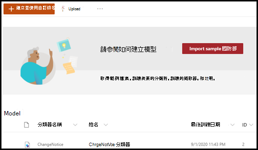

# 透過範例模型深入瞭解文件瞭解模型

Microsoft SharePoint Syntex 為您提供了一個您可用來檢查的範例模型，讓您更加瞭解如何建立您自己的模型。 範例模型也可讓您檢查模型元件，例如其分類器、擷取器和說明。 您還可以使用範例檔案來訓練模型。

## 匯入範例模型

若要存取範例模型，您必須先將模型匯入您的內容中心。

1. 從內容中心選取 **[模型]** 查看您的模型清單。 
2. 在 **模型** 頁面上，選取 **[匯入範例模型]**。 

      

3. 匯入完成後，**BenefitsChangeNotice** 模型的首頁會隨即開啟。 如果您日後需要開啟範例模型，您可以在內容中心的模型清單中執行此操作。  

      

您不僅可以流覽分析範例模型，進一步瞭解模型的構造方式，作爲一個工作模型，還可以更進一步執行例如以下的操作：

- 新增另一個擷取器。 例如，新增一個 *折扣費用* 的擷取器。
- 將模型套用到文件庫，並將部分訓練檔案上傳到文件庫，以查看模型如何分類檔案，以及如何從中擷取資料。

## 另請參閱
[建立分類器](create-a-classifier.md)

[建立擷取器](create-an-extractor.md)

[文件瞭解概觀](document-understanding-overview.md)

[建立表單處理模型](create-a-form-processing-model.md)  
