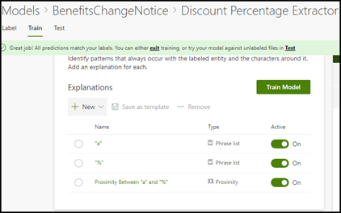

# 深入瞭解透過範例模型瞭解模型Learn about document understanding models through a sample model

Microsoft SharePoint Syntex 提供您可用於檢查的範例模型，讓您更深入瞭解如何建立您自己的模型。Microsoft SharePoint Syntex provides you a with a sample model you can use to examine, giving you a better understanding of how to create your own models. 範例模型也可讓您檢查模型元件，例如它的分類器、擷取器及說明。The sample model also allows you to examine model components, such as its classifier, extractors, and explanations. 您也可以使用範例檔案訓練模型。You can also use the sample files to train the model.

## 匯入範例模型Import the sample model

若要存取範例模型，您必須先將模型匯入內容中心。To access the sample model, you need to first import the model to your content center.

1. 從內容中心選取 [ **模型** ]，以查看您的模型清單。From the content center, select **Models** to see your models list. 
2. 在 [ **模型** ] 頁面上，選取 [匯 **入範例模型**]。On the **Models** page, select **Import sample model**. 

      

3. 尋找顯示在模型清單中的範例模型，其標題為*BenefitsChangeNotice。*Look for the sample model titled *BenefitsChangeNotice.classifier* that appears in your models list. 

      

4. 選取 [ *BenefitsChangeNotice] （分類器*）來開啟模型首頁。Select the *BenefitsChangeNotice.classifier*, to open the model's home page. 
  
     

5. 從模型首頁，仔細檢查模型，以查看其建立方式。From the model home page, examine the model more closely to see how it was created.
 
- 查看用於訓練模型的範例檔案。View the sample files used to train the model.
- 請仔細檢查模型的實體擷取器，以查看樣本模型如何設定說明。Examine the model's entity extractors more closely to see how the sample model configured the explanations.

     

## 另請參閱See Also
[建立分類器Create a classifier](create-a-classifier.md) 
[建立提取程式Create an extractor](create-an-extractor.md) 
[檔理解概述Document Understanding overview](document-understanding-overview.md) 
[建立表單處理模型Create a form processing model](create-a-form-processing-model.md)  
